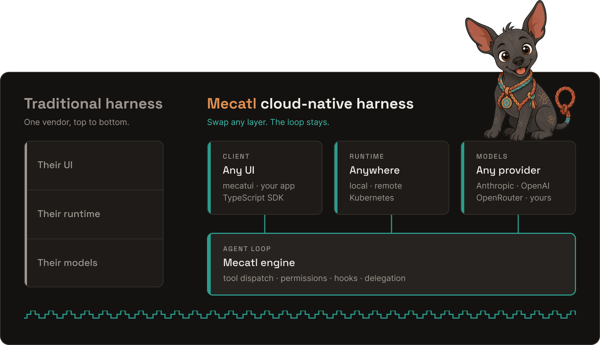
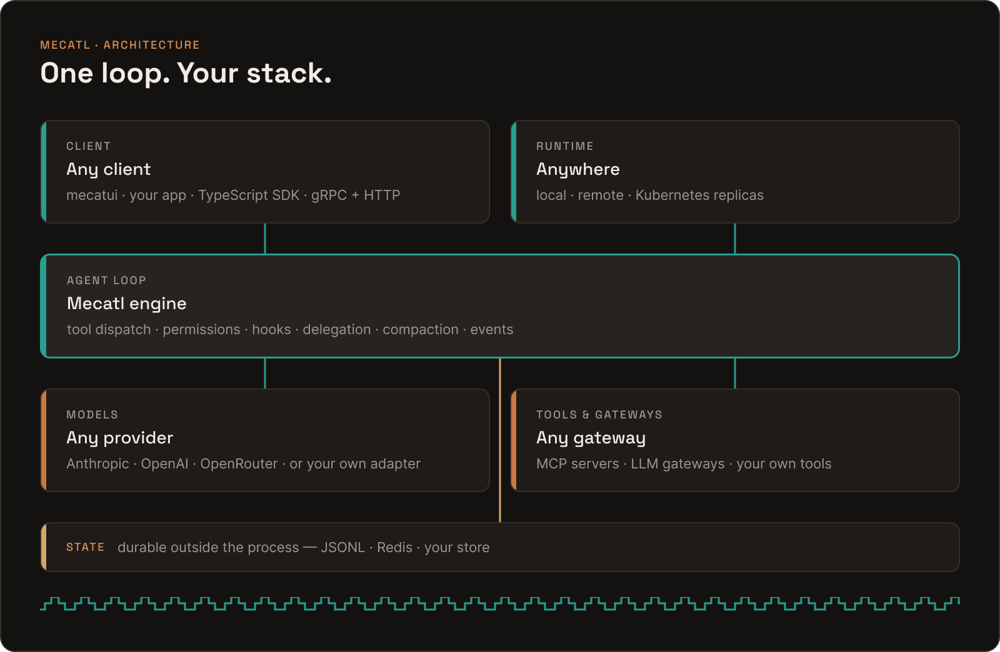

# Mecatl

<p align="center">
  
</p>

**Mecatl is an open source, cloud-native agent harness.** It provides
the loop, tools, permissions, hooks, delegation, and service boundaries for
running AI agents as production workloads on infrastructure you operate.

Mecatl keeps the agent loop independent of the client and execution
environment, so the same runtime can start locally, run remotely with durable
external state and a recorded event history, then scale across Kubernetes
replicas without replacing the loop. It combines composable tools and skills
with permissions, attribution, and audit records while keeping model providers
and deployment infrastructure replaceable.

Run one of the supplied services or connect Mecatl to an existing application
with the model provider, state store, filesystem, and UI that fit your
workflow. These concerns connect through explicit interfaces, so changing one
does not require replacing the agent loop.

Read the [Mecatl documentation](https://mecatl.dev/docs) to get started.

## What it provides

- A streaming agent loop with tool dispatch, permissions, compaction, hooks,
  subagents, and teams.
- Provider-agnostic model integration, with reference adapters and opt-in
  provider modules.
- Durable sessions and append-only event logs through pluggable stores, so a
  deployment can recover persisted work after process replacement.
- Client integration via gRPC and HTTP/SSE, the TypeScript SDK, and mecatui, a
  terminal client that can host a local server or connect to a remote one.
- A Kubernetes-native reference runtime that combines Redis-backed state,
  Kubernetes session leases, drain handling, and disposable replicas.
- Per-session execution environments, including an opt-in local microVM backend
  that keeps model providers and credentials on the host while filesystem tools
  and Bash run inside the VM.

## Get started

| Goal | Start with |
| --- | --- |
| Run an agent service | [`mecated`](./cmd/mecated) and the [deployment guide](./user-docs/building/deployment/mecated.md) |
| Run agents on Kubernetes | [`mecak8s`](./cmd/mecak8s) and the [Kubernetes deployment guide](./user-docs/building/deployment/mecak8s.md) |
| Use an agent locally | [Install](#install), then use [`mecatui`](./cmd/mecatui) — or [run the offline demo](#try-it-locally) from a checkout |
| Connect an application | The [TypeScript SDK guides](./user-docs/building/typescript-sdk/index.md) or the [gRPC and HTTP/SSE integration guide](./user-docs/building/deployment/grpc-http.md) |
| Build unattended automation | [`mecatequi`](./cmd/mecatequi) for one prompt, a patch, and a machine-readable result |
| Embed the runtime | [`engine`](./engine) and the [embedding guide](./user-docs/building/deployment/embed-engine.md) |

## Install

Install `mecatui`, the terminal client, and `mecated`, the server, with
Homebrew:

```sh
brew install stacklok/tap/mecatl
```

[Install and verify Mecatl](./user-docs/install.md) covers Conda-forge,
release archives, verification, and source builds. Build `mecademo`,
`mecatequi`, and `mecak8s` from a checkout with `task build`.

## Run agents as production workloads

An agent runtime needs more than a model call to operate as a workload. A
replaceable process needs durable state outside the process, a record of work
that survives a restart, and a way to coordinate access when replicas share a
session. Mecatl supplies the seams and reference implementations for those
concerns without making them part of the agent loop.

The supplied `mecak8s` runtime demonstrates this deployment model. It uses
Redis for session state and event logs, Kubernetes leases to ensure one writer
per session, and a drain path for replacing pods. You can also embed the engine
and provide the backing services and execution environment yourself. See
[What is a cloud-native harness?](./user-docs/building/cloud-native-harness.md)
for the runtime guarantees and boundaries.

## Open and modular by design

<p align="center">
  
</p>

Mecatl keeps the agent loop independent of the provider and infrastructure
behind it. Reference adapters support offline development, while integrations
use the interfaces that match the parts of the system they connect. This lets
you use the same harness with the model providers, state services, tools, and
clients your system requires.

Mecatl provides the agent runtime and its contracts. Your application decides
which capabilities a session receives, where code runs, and how it connects to
its identity, policy, and data services.

## Control and execution

Agents can act with a user's or service's authority, so Mecatl keeps the agent
loop separate from the execution environment. It treats permissions and the
event record as first-class runtime concerns. It includes deny-dominant
permissions, approval flows,
secret-scrubbed command environments, durable attribution, and an audit trail.
Delegated runs receive derived capabilities that can only narrow at each
in-process hop.

Caller identity and audit records are useful building blocks, not a complete
tenant-isolation boundary. Cross-process cryptographic proof and authority
attenuation remain active design work. See the
[agent identity tracker](https://github.com/stacklok/mecatl/issues/377) and the
[working identity model](./docs/agent-identity-model.md).

## Try it locally

The offline demo runs a scripted session with tool calls, a permission approval,
delegation, and usage accounting. It does not require an API key. It runs from a
checkout of this repository; the Homebrew formula does not ship `mecademo`.

```sh
go run ./cmd/mecademo
```

To build every supplied runtime and client:

```sh
task build
```

For an embedded deployment, see the
[engine compatibility contract](./engine/COMPATIBILITY.md) and the
[embedding guide](./user-docs/building/deployment/embed-engine.md).

> **Security:** `mecated` is unauthenticated by default and intended for
> loopback, single-user use. Configure authentication and transport protection
> before binding it off-loopback. The
> [deployment guide](./user-docs/building/deployment/mecated.md) covers
> bearer auth, TLS/mTLS, OIDC, rate limits, and deployment posture.

## Local microVM execution

For optional isolated local execution on Linux amd64, install and authenticate the
release-stamped host binaries: both `mecatui` and `mecated` for interactive use, or
just `mecated` for headless use. `mecatui` runs the embedded interactive server;
`mecated` supplies local microVM administration. Follow the
[verified host-binary installation steps](https://mecatl.dev/docs/building/deployment/microvm-environments#local-microvm-environments)
before running either command sequence:

```sh
# Interactive embedded journey: configure the operator-owned deployment setting
# in ~/.config/mecatl/settings.yaml:
#
# execution:
#   default_placement: microvm-local
mecated microvm doctor
mecatui

# Or headless, mecated-only journey:
mecated microvm doctor
mecated serve --headless --default-placement microvm-local
# --headless declares an unattended server, so child asks do not wait for a local UI.
# Ordinary POST /v1/sessions uses the deployment default; clients send no path or placement.
```

Release binaries verify and prepare the required runtime when the deployment selects
`microvm-local`. Source builds do not support this profile; repository developers can
use the separate [developer source workflow](./docs/usage/microvm-environments.md#developer-source-workflow).
`microvm doctor` and `microvm status` are read-only `mecated` administration commands.
Guest IPv4 egress is permissive by default; external IPv6 is unrouted and unsupported.
The local host operator can instead select `deny-all` or `allowlist` in
`execution.microvm.guest_egress`, or use `mecated serve`'s
`--microvm-guest-egress=deny-all` or `--microvm-guest-egress=allowlist` with repeatable
`--microvm-guest-allow=HOST:PORT/tcp|udp` rules. The allowlist requires at least one
valid hostname rule; invalid input or enforcement failure stops startup. HTTP/gRPC
clients and project configuration cannot set or weaken this host-only policy. Agent
edits live in an isolated session worktree, not in the original checkout. The [local
microVM operator guide](https://mecatl.dev/docs/building/deployment/microvm-environments) covers
verified installation, headless use, guest-egress controls, host-versus-guest
boundaries, and platform limits.

## User documentation

- [Mecatl documentation](./user-docs/intro.md) for user guides and
  deployment information.
- [Client integration guide](./user-docs/building/deployment/grpc-http.md)
  for gRPC and HTTP/SSE clients.
- [TypeScript SDK guides](./user-docs/building/typescript-sdk/index.md) for
  Node.js, Bun, and browser applications.

## Architecture and engineering documentation

- [Repository documentation index](./docs/README.md)
- [Architecture guide](./docs/architecture.md)
- [User documentation](./user-docs/intro.md)
- [Engine compatibility contract](./engine/COMPATIBILITY.md)

## Contributing, security, and license

Contributions are welcome through pull requests. Start with
[CONTRIBUTING.md](./CONTRIBUTING.md); coding agents should read
[AGENTS.md](./AGENTS.md) before changing the repository.

Report vulnerabilities privately through [SECURITY.md](./SECURITY.md).

Licensed under the [Apache License 2.0](./LICENSE). Community participation is
governed by the [Code of Conduct](./CODE_OF_CONDUCT.md).
