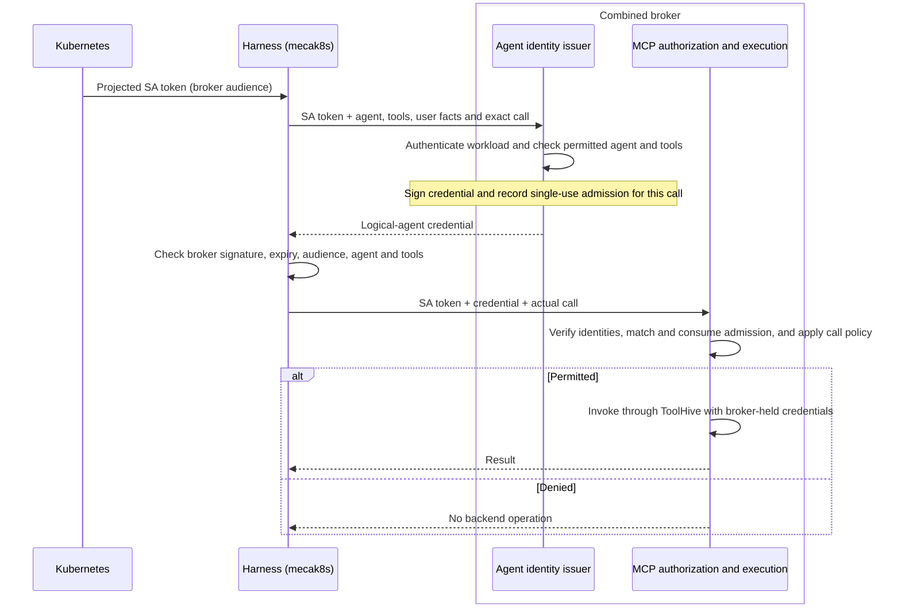
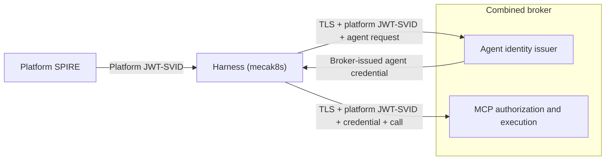
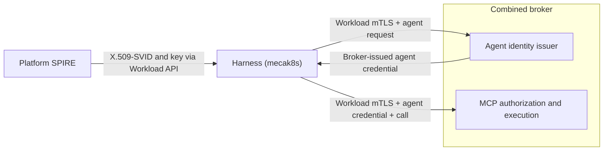

# Agent authority: user journey, trust boundaries, and implementation gaps

*Living explanation, not a new decision or acceptance plan. Implementation claims
refer to the pins below, not to an integrated release. Existing ADRs and plans
remain authoritative; source inspection is not deployment qualification. This page
describes the identity and external-broker foundation we intend to build. Mandates
are a possible follow-on capability, not a prerequisite or a selected wire profile;
new protocol decisions still require an ADR and acceptance proof.*

## The user journey

> An operator can enforce policies for named agents at the broker and, independently
> of the harness's logs, inspect which verified user and agent were associated with
> an exact requested operation, the broker's authorization decision, and its observed
> outcome—including an unknown outcome.

Alice asks a deployment specialist to change a registered target. The broker checks
identity evidence and its own policy before selecting credentials or dispatching.
Later, even without the harness, the operator can inspect the broker's decision and
observed outcome. The record distinguishes verified facts from claims accepted from
an attester. **This is the intended journey, not the current delivery claim.**

Two kinds of independence matter:

- **Enforcement and evidence:** the broker makes its own decision and retains its
  own records, correlated with—not reconstructed solely from—the harness log.
- **Identity verification:** the broker verifies user evidence without relying
  solely on the harness's assertion that it authenticated that user. A separate
  signer or a broker-audience claim does not by itself establish this property.

For example, Alice asks `code-reviewer` to read PR 42. Mecatl identifies the acting
agent; the broker checks its signed credential and decides whether to allow that
specific read. Permission to read PR 42 must not authorize merging PR 43. The broker
must check the requested action and target, not just accept the agent's name.

Trusting Mecatl to identify its own agents is intentional. Whether the broker should
also trust Mecatl's report that Alice authorized the action is a separate, unresolved
question. [Task mandates](#possible-follow-on-task-mandates) could add a way to
express delegated permission on top of this foundation; they would not by themselves
prove that Alice approved it.
The intended audit history must survive a broker restart; a permission record held
only in memory is not enough. The
[implementation evidence](#implementation-evidence-separate-branches-not-one-product)
section below distinguishes the existing prototypes from these design goals.

### Agreed agent-attribution trust boundary

**Mecatl says which agent is calling; the broker decides what that agent may do.**
We trust Mecatl to identify its own agents. The broker checks their credentials and
applies its own policy rather than accepting Mecatl's permission decision.

For example:

1. Mecatl starts `code-reviewer` and determines which tools it may use.
2. The issuer signs a credential identifying that agent and its allowed tools,
   using information supplied by Mecatl. The issuer limits which identities and
   tools Mecatl may request.
3. When the agent calls `read_pr`, Mecatl attaches its credential. The broker
   verifies it and checks whether its own policy permits reading the requested PR.

The signature proves who issued the credential and that its contents have not
changed. It does **not** prove which agent inside Mecatl actually made the call.
Authenticating the Mecatl process does not let the issuer or broker observe its
internal agents. If Mecatl is compromised, it could attach `deployer`'s credential
to a call made by `code-reviewer`, within the credentials it can obtain or use.
Keeping the signing key outside Mecatl limits token forgery, but does not prevent
that substitution. Separate instance IDs or keys held by the same compromised
process do not prevent it either.

Preventing that substitution is a longer-term goal, not a promise of this design.
It would require stronger isolation—for example, an agent running in a separate
worker whose identity and exclusive control of its key can be independently
verified. To leave room for that, we keep the agent definition, running instance,
party vouching for it, and credential holder distinct. A different SPIFFE name
alone does not provide isolation.

**Identifying the agent is separate from proving the user's permission.** Trusting
Mecatl to identify `code-reviewer` does not settle whether the broker should also
trust its claim that Alice approved the action. The broker must check whose
authority the call uses and whether that user's permission covers this agent and
operation. What evidence it accepts for those checks remains a separate decision.

## What each identity means

Alice opens a Mecatl session and asks `code-reviewer` to read PR 42 from
`acme/payments`. The request runs through a Mecatl worker and an external broker.
The identities describe the user, the agent and the worker carrying its request.
This is the intended broker flow. The existing architecture has caller ownership
checks and a separate acting-as-user exchange gate; that gate is not yet wired into
production external calls. The terms below build on the
[domain model](architecture/domain-model.md), not a second set of core entities.

### The user

**User:** Alice is the authenticated caller, represented by `session.Principal`.
Her identity is the pair `(Issuer, Subject)`, not her display name. Mecatl records
that principal as the session owner at creation; children and forks inherit it.
With ownership enforcement enabled, another caller cannot take over her session.
In the proposed broker flow, the broker also checks the required user-authorization
evidence and matches it to that owner. Session ownership alone does not authorize
external operations, and Bob's evidence cannot substitute for Alice's.

These are two checks about the same user, not a design requiring separate people
as owner and subject. Protocol sections use *subject* for the identity a particular
token describes; that may be the user or the logical agent, depending on the token.

### The agent and the process carrying its request

- **Logical agent / actor:** the resolved `code-reviewer` definition (`AgentDef`),
  which supplies the role, tools and model for a specialist. It is not Alice and
  not the Mecatl worker process. The logical-agent credential identifies that
  definition; it does not replace the session's user owner.
- **Instance:** a particular execution of that definition—for example, a Subagent
  with its own child `Session`. Two reviews can use the same definition but have
  different child sessions. Optional instance metadata distinguishes occurrences;
  it does not give each one an isolated key or introduce a new aggregate alongside
  `Session`.
- **Workload presenter:** the Mecatl worker that sends the request to the broker.
  Authenticating that worker identifies the calling software, not Alice or the
  particular agent inside it.

### The operation and its context

These are not additional identities:

- **Effective authority:** the tools this agent may actually use after applying
  parent, agent-definition and current policy restrictions. If its parent cannot
  write, selecting a definition that includes write tools must not restore them.
- **Environment:** the execution namespace supplied by `tool.Environment`: a
  workspace and an optional bound command runner, identified durably by an exact
  `EnvironmentRef{Kind, ID, Revision}`. For example, Alice's session reattaches to
  its recorded environment, not whatever workspace is now the deployment default.
  That placement is not permission to act on her GitHub account.

Sender binding is planned as [workload-level DPoP](#add-dpop-atop-logical-agent-identity)
after logical-agent identity. It protects against stolen-token replay, not
misattribution between agents inside a compromised harness.

### What the internal SPIFFE identity proves

The logical-agent credential separates **stable identity** from **the tools
allowed for a particular execution**.

- Editing `code-reviewer`'s prompt or tool configuration does not change its identity;
  renaming it or changing its source tier does. Identity follows the definition's
  source tier and exact name, not its contents or revision.
- Two executions can share that identity but receive credentials with different
  tool lists. The broker checks the credential presented for the call; it must
  never combine permissions from other credentials with the same identity.

The tool list is only one authority limit. It does not encode filesystem access,
direct-write permission or the full delegation history.

#### How the name and signature work

For a project-defined `code-reviewer`, the token's subject (`sub`) would look like
this (`<digest>` stands for the full computed digest, not literal text in the name):

```text
spiffe://agents.example.com/mecatl/agent-definition/v1/project/code-reviewer--<digest>
```

- **Trust domain:** `agents.example.com` is the configured identity namespace. It
  is not the address of the agent or broker.
- **Tier:** `project` means the definition came from the project. Other categories
  are `user`, `managed`, `driver` and `system`. These distinguish sources, not
  privilege levels: a user-defined `code-reviewer` and a project-defined
  `code-reviewer` are different identities.
- **Slug:** `code-reviewer` is the readable part. It is not sufficient to identify
  the agent: names such as `code reviewer` and `code-reviewer` can produce the same
  slug.
- **Digest:** a deterministic hash of the tier and exact name distinguishes those
  cases. Those two names receive different digests, as does the same name in a
  different tier. Changing only the prompt or tools leaves the digest unchanged;
  it is not a hash of the definition's contents.

The broker service initially contains both credential issuance and invocation
enforcement. Its issuance component holds the private signing key and signs only
permitted agent identities and tool lists, not arbitrary claims. Its invocation
component checks presented credentials using public verification keys and decides
whether to allow each call. Key rotation and cache expiry limit how long old keys
remain trusted.

These are separate responsibilities within one deployment, not separate services
or an internal security boundary. The signing key stays outside the agent-executing
harness. The components may be deployed separately later, but that would require
its own authentication and key-distribution design. The credentials use SPIFFE
names and JWT-SVIDs; running SPIRE is not required.

The issuer and its key storage remain trusted infrastructure: separating them from
agents does not protect against compromise of that infrastructure. The signing
algorithm and storage backend belong in the implementation specification.

#### Internal SPIFFE identity: issuer and verifier trust

These are **four deployment profiles, not mandatory stages**. In every profile, the harness (`mecak8s`) is a client of one logical broker deployment; the model does not participate in authentication or credential issuance.

**A — workload-only Kubernetes ServiceAccount authentication:** the harness runs as a Kubernetes **ServiceAccount (SA)**. Kubernetes projects that workload a short-lived bearer token with the broker as its audience. Over a trusted TLS connection, the broker validates the configured Kubernetes issuer, token audience and SA subject allowlist before accepting the request. The broker holds the provider credentials and invokes ToolHive itself.

This workload-only profile will be delivered as the first implementation of the broker.

For example, calls from `code-reviewer` and `deployer` inside the same harness present the same ServiceAccount identity. The broker can restrict which harness may connect, but this token alone cannot support different policies for those two agents. Profile B adds the missing logical-agent evidence.


**B — SA-authenticated logical-agent credential:** this adds a harness-attested, short-lived logical-agent credential to profile A. The broker remains one combined deployment containing the agent identity issuer and MCP authorization and execution components. The broker first authenticates the harness's SA identity, then checks which agent identities and tools that harness is allowed to request. It signs only a credential within those limits.

This profile is substantially implemented on the identity-integration branch, but still needs deployment qualification.

The broker returns the signed agent credential to the harness. Before using it, the harness checks the signature against the broker's configured public signing keys and verifies its expiry, audience, agent identity and tool list against the request. When the harness presents it with an operation, the broker checks both the workload token and agent credential again, enforces the exact-call admission and applies its policy before using provider credentials. These checks belong to one broker deployment, not separate services or trust domains.



Operator configuration tells the broker which Kubernetes issuer, audience and ServiceAccounts to accept, and which agent identities and tools each harness may request. It also supplies the public signing keys trusted by the harness and broker. Verification-key endpoints, CA trust and server names are configured by the operator, never selected by a token. Public keys allow verification, not signing; private signing keys stay inside the broker.

The broker signs the credential based on information supplied by the harness.
The signature does not independently prove that Alice approved the action or that a particular agent's code is running. The broker must still check whether each requested operation is allowed.

These credentials currently work as bearer tokens: possession is enough to present them, though the broker's other checks still apply. The planned [DPoP work](#add-dpop-atop-logical-agent-identity) will require proof of a worker-held key when presenting the broker-facing access token.

**C — B with SPIRE JWT-SVID authentication:** the first SPIRE integration replaces B's Kubernetes SA token with a platform JWT-SVID for the broker's audience. The harness obtains it through the SPIFFE Workload API and presents it on both issuance and invocation requests. The broker checks its signature, audience, expiry and allowed workload SPIFFE ID. Agent credential issuance and operation checks remain as in B; SPIRE does not replace the broker's signing keys or create federation.



C is planned, not yet wired. It retains B's bearer-token request pattern while adding SPIRE-managed identity. Credential renewal and platform trust-bundle refresh need explicit handling, separate from the broker's logical-agent verification keys. A stolen platform JWT-SVID remains replayable until expiry; DPoP on a subsequently issued access token does not remove that bootstrap risk.

**D — B with SPIRE X.509-SVID mutual TLS:** an optional follow-on to C replaces bearer workload authentication with proof of a workload private key during the TLS handshake. The harness obtains its certificate and key through the Workload API. The broker verifies the certificate against trusted platform keys and permits only configured workload SPIFFE IDs. Agent credential issuance and exact-call policy remain as in B and C.



Both broker endpoints must verify the harness's mTLS identity. A TLS-terminating ingress needs an explicitly trusted identity-propagation design; an ordinary forwarded header is not proof. Certificate rotation, trust-bundle refresh and connection renewal must be designed together. The operator selects the accepted method; failed mTLS must not silently fall back to bearer authentication.

D authenticates the harness, not its internal agents, and does not automatically bind an OAuth access token to the certificate. The selected DPoP task remains a separate token-protection mechanism. Neither C nor D independently verifies user consent or isolates agents sharing the harness.

## Implementation evidence: separate branches, not one product

These are inspected local-ref snapshots; uncommitted changes and later commits are
excluded. Re-pin before implementation. The external broker squash supersedes the
older review-remediation branch; the integration has not absorbed that squash.

| Source and pin | What it supplies | What it does not establish |
|---|---|---|
| `origin/main` — `a711451616edf84f50e793c9bcbfb697ef400347` | Caller/owner checks, carried authority, exact placement, dispatch/event logging and configured in-process MCP broker paths | Completed external user/agent admission or exhaustive evidence of shell side effects |
| `handover/agent-mcp-authority-restart` — `ed319f45cd972de3cb95031b39e57b8eec425789` | Issuer signing and verification, logical-agent credentials, adapter-neutral acting-as-user exchange contract | Production ToolHive exchange or provider credential lookup |
| `acc/singleton-mcp-broker-review-remediation-squash` — `53eab6b753869b33c317da49a67295575807ac61` | TLS/workload-OIDC remote broker, callback lifecycle, process-local Execute receipts, configured encrypted custody recovery | Logical-agent admission, fresh user proof, HA or durable operation outcomes |
| `acc/singleton-identity-mcp-integration` — `db5bcd8845f87f05fa0c0efecb2092fd6c5e497c` | Constrained issuer, live exact-call Cedar admission and ToolHive fixture tests | Independently verified human evidence, scheduled grants or durable broker audit completion |
| `workload-identity` — `b6dc951c091197bcb4c3ec444a80308d43dc9e5a` | Historical broker-owned SPIFFE custody/proxy experiment | Selected production transport or an integration dependency |

Pinned main is an ancestor of the squash. The identity, squash and integration
comparisons diverge at `038b5739`; neither squash nor integration contains the other.
The integration adapts the issuer slice but has no `internal/actingaccess`; its
broker-local admission is not simply the donor's exchange contract wired to ToolHive.
Individual branch tests do not prove that their combination works.

### Known identity-profile defects

The inspected integration classifies ordinary Kubernetes SA tokens as user grants,
but its issuance gate requires a client-credentials grant. That mismatch blocks the
ordinary-SA flow shown above. At `db5bcd884`, it lies between
[`GrantTypeFromClaims`](https://github.com/stacklok/mecatl/blob/db5bcd8845f87f05fa0c0efecb2092fd6c5e497c/engine/session/principal.go)
and [`IssueAttested`](https://github.com/stacklok/mecatl/blob/db5bcd8845f87f05fa0c0efecb2092fd6c5e497c/internal/identityissuer/host.go).
The separate [bundle-format gap](https://github.com/stacklok/mecatl/blob/db5bcd8845f87f05fa0c0efecb2092fd6c5e497c/internal/identityissuer/bundle.go)
prevents claiming standard SPIFFE bundle interoperability merely because the local
issuer and verifier agree. These are source-review findings, not fixes or live
reproductions. Profile A does not require this logical-agent issuer; profile C
requires new workload-authentication support as well as qualified issuer compatibility.

### Baseline and broker protections worth preserving

Main authenticates callers, checks ownership, reattaches exact placement, applies
local permissions/hooks/authority, and records effective tool results. Child
[derivation and resume checks][delegation] prevent a broader definition from
restoring authority absent from its parent. These are harness checks, not signed
external grants. Ownerless compatibility exists where owner enforcement is disabled;
a shared static bearer does not establish individual users.

The external broker authenticates workload OIDC over TLS, including Kubernetes
OIDC discovery/JWKS—not TokenReview. Workload/session-owned attachments and receipts
protect the remote lifecycle, not the complete user/actor conjunction. Identical
calls within a receipt lease may join or return a recorded result; changed content
is rejected. Those receipts do not survive process replacement.

Configured encrypted custody can recover a **fresh attachment** using exact
session/incarnation, workload/owner partitions, profile/provider, recovery-reference
and deadline checks. An owner partition is an isolation guard, not human identity
proof. Recovering credentials does not recover a callback, Execute receipt or effect.
Sources: [broker authentication][broker-auth], [custody RPCs][custody],
[protected storage][storage], and [Execute receipts][receipts].

Track B's alternate proxy keeps downstream workload credentials behind the broker.
Its [recorded spike results][track-b] include missing-subject, path-containment and
alternate-SVID bypass limitations. Those are historical prototype findings, not
claims about the current broker. Neither that proposal nor an SA-first checkpoint
silently replaces verified logical-agent identity in the selected integration.

### Singleton integration: live admission

```text
loop: exact tool-call execution evidence + current matching user authentication
  -> workload-authenticated request carrying resolved definition and authority
  -> constrained issuer + bounded single-use admission
  -> Run verifies workload and logical-agent JWT-SVID
  -> consume matching presenter/owner/actor/expiry, attachment/incarnation,
     call ID, argument digest and occurrence
  -> registered target/capability checks + Cedar
  -> broker-owned ToolHive invocation -> result
```

Changing PR 42 to PR 43 cannot reuse the admission; a valid SVID alone cannot skip
Cedar or exact-call checks. But user-authentication and definition-selection facts
come from the trusted harness attester. The broker checks consistency and its own
policy; it does not separately verify a human IdP credential.

The [integration ADR][integration-adr] describes this relationship. The design
handover's sections 10/13 instead call for a distinct fresh broker/AS user assertion
from which the broker derives owner. **Reconciling those trust profiles remains a
design decision, not an approved replacement made here.** Audience limits where an
assertion is accepted; independence depends on its issuer, required evidence and
verification. Local permission provenance alone does not prove all subject-authority
and consent ceilings of the [acting-as-user conjunction][exchange-adr].

Sources: [identity wrapper][wrapper], [issuer ingress][ingress],
[one-use admission][admission], [Cedar gate][cedar], and
[real-ToolHive fixture tests][fixtures]. Tests include an admitted write and denied
credential/backend counters; their presence is not a fresh test run or Kind proof.

## Intended flows and safety boundaries

### Interactive authorization and child escalation

Alice asks `code-reviewer` to read PR 42 in `acme/payments`. Here `read_pr` and
`merge_pr` are illustrative registered operations, not actual wire names.

```text
Alice's login bearer -> Mecatl API validation; persist owner, not bearer
  -> resolve definition + narrowed authority + exact environment
  -> local permissions/hooks/authority
  -> broker verifies workload, logical agent and agreed fresh user evidence
  -> owner/subject + subject authority + consent + presenter association
     + agent tools + registered target/scopes/detail + target policy all permit
  -> select provider credential -> dispatch exact call -> sanitized result
```

If the provider is not connected, the MCP authorization lifecycle parks the prepared
call for browser authorization. Connection consent does not waive operation admission.
A denial selects no invocation credential and sends no backend operation; enrollment
and callback traffic are accounted separately.

A malicious PR comment might ask the reviewer to delegate to `deployer` and merge.
A child name cannot restore merge authority missing from the parent. Derived child
authority must survive issuance and broker admission. A separately authorized
top-level deployer may merge if all ceilings permit. Proving this distinction through
the composed remote path remains necessary; neither a worktree nor a signature over
an arbitrary model-supplied agent name supplies that proof.

There are two presenter relationships: workload-to-broker authentication, and the
broker's own authenticated client relationship when it performs an AS exchange.
The latter client ID is not the logical agent's SPIFFE subject. The fresh exchange
assertion is neither the Mecatl login bearer nor an ID token; selecting its production
issuer/consent profile remains open. The upstream provider may simply receive its
ordinary credential without understanding Mecatl agents.

### Credential and execution custody

**The trusted invocation path includes transient memory inside mecak8s.** The
logical-agent token does enter the harness: trusted client code receives and verifies
it, binds it to an invocation context, and sends it in private gRPC metadata. It is
not a model argument, tool result or persisted conversation message. This is a
separation from the model's interface, not protection against a compromised harness
process or a guarantee of secure memory erasure.

The diagram shows **profile B's intended successful credential flow**, not a working
ordinary-SA deployment or the future independent user exchange. The
[SA-classification and bundle-compatibility defects](#known-identity-profile-defects)
remain open. Repeated harness/client and broker boxes are stages of the same two
deployments, not extra services; broker modules are not necessarily separate processes.
Harness-to-broker issuance uses HTTPS and invocation uses TLS-protected gRPC.

```text
Human IdP                                 Kubernetes SA issuer
  issues API bearer                         issues projected workload bearer
         |                                             |
         v                                             v
+-------------------- mecak8s / harness ---------------------------+
| API edge: verifies human signature, issuer, audience, expiry.    |
| Keeps fresh authentication evidence; persists owner, not bearer. |
|                                                                 |
| Model -> proposed tool/arguments -> trusted dispatch/client      |
|          (no credentials)          resolves definition/authority |
+--------------------------------------|--------------------------+
                                       | 1. HTTPS issuance request:
                                       | workload bearer + exact call
                                       | + harness-asserted user,
                                       |   definition and permission facts
                                       v
+-------------------- combined mecabroker ------------------------+
| Ingress: verifies workload OIDC bearer and attester envelope.    |
| Checks asserted owner/freshness; does NOT verify human bearer.   |
| Constrained issuer: private ES256 key -> logical-agent JWT-SVID. |
| Records bounded, single-use exact-call admission.                |
+--------------------------------------|--------------------------+
                                       | 2. Returns signed JWT-SVID
                                       v
                  Trusted mecak8s identity client
                  verifies with separately configured public bundle,
                  trust domain/audience and matching execution facts
                                       |
                                       | 3. gRPC Run metadata:
                                       | authorization: Bearer <workload>
                                       | mecatl-logical-agent-svid: <SVID>
                                       | Body: exact invocation
                                       v
+-------------------- combined mecabroker ------------------------+
| Verifies workload bearer AND logical-agent SVID.                 |
| Consumes exact admission; registered-target checks + Cedar.      |
| Deny: no invocation credential selection or backend operation.   |
| Allow:                                                          |
|   broker confidential OAuth client                              |
|     -- ToolHive-issued access token --> protected vMCP endpoint  |
|   ToolHive verifies token, selects/injects upstream credential    |
+--------------------------------------|--------------------------+
                                       | provider access credential
                                       v
                         Upstream MCP/resource server
                         verifies credential, performs operation
                         -> result returns through broker/harness
                            to model, never an authentication token
```

The final hop illustrates an OAuth-protected upstream, not every MCP deployment.
The provider receives its native credential, not the logical-agent SVID or Mecatl
login bearer. Other credentials and trust anchors in this flow are:

| Artifact | Issuer/source and verifier | Custody / boundary |
|---|---|---|
| Broker TLS certificate | Configured TLS issuer; harness verifies CA/server name | Bundle endpoint and trust settings are operator-configured, not chosen by a returned token. |
| Issuer public bundle | Broker issuer publishes public verification keys; trusted client uses them to verify SVIDs | No private signing key crosses to the harness. Broker also verifies the SVID at Run. |
| ToolHive client ID/secret | Broker generates/registers confidential client; ToolHive AS authenticates it with `client_secret_basic` | Secret remains broker-side. ToolHive AS issues its own access/refresh tokens; these are not upstream provider tokens. |
| Provider OAuth code/tokens | Upstream authorization server issues; broker/ToolHive redeems code; upstream resource server verifies access token | Browser delivers codes to registered callbacks, outside the model channel. ToolHive owns provider token storage, refresh and injection. |

**“Protected agent-free host” means no model-driven execution or shell in the
issuer/broker deployment.** Only the issuer component needs the signing key, but
module separation within a combined process does not isolate a broker compromise.
Software keys also do not exclude node, cluster-admin or Secret-store access. The
harness receives a signed credential and public keys, never signing authority.

A future broker/AS user assertion and a scheduled grant are separate evidence, not
provided merely by having a workload token, SVID or provider refresh token. Their
production issuer/consent profiles remain unresolved. Provider connection likewise
does not waive exact-operation admission.

Source: integration [identity client](https://github.com/stacklok/mecatl/blob/db5bcd8845f87f05fa0c0efecb2092fd6c5e497c/internal/identityissuer/client.go),
[trust configuration](https://github.com/stacklok/mecatl/blob/db5bcd8845f87f05fa0c0efecb2092fd6c5e497c/cmd/mecak8s/mcp_identity.go),
[issuer ingress][ingress], [gRPC presentation/verification][admission],
[ToolHive target](https://github.com/stacklok/mecatl/blob/db5bcd8845f87f05fa0c0efecb2092fd6c5e497c/internal/adapter/mcpbroker/toolhive_process.go)
and [OAuth flow](https://github.com/stacklok/mecatl/blob/db5bcd8845f87f05fa0c0efecb2092fd6c5e497c/internal/adapter/mcpbroker/auth.go).

- Human login bearers terminate at the Mecatl edge, transiently; never save them for
  broker or schedule use. The current direct client holds a broker-audience workload
  token; only a future selected proxy would hide that credential from the harness.
- Connected-provider secrets and access/refresh tokens stay in broker/OAuth custody.
  Return sanitized results, not tokens or reusable signed requests. This does not
  relocate every harness credential, including LLM-provider credentials.
- The operation API resolves registered targets server-side, not arbitrary model-chosen
  URLs, headers, issuers, audiences, scopes or credential selectors. For example,
  reading PR 42 must resolve through the registered integration and pass checks for
  the requested operation, resource and required tools. Credential lookup is a
  separate broker responsibility, not part of the existing exchange gate's target
  checks.
- Execution isolation must prevent alternate credential/network bypasses. A local
  workspace or scrubbed environment is not OS confinement; a microVM alone does not
  make a claimed identity trustworthy. Shell logs are not exhaustive effect records.
- Missing, malformed, stale or indeterminate authority denies. No ownerless, service,
  broader-agent or alternate-user credential is a fallback for a missing user grant.

### Scheduled authority: separate future consent

Today's [generic scheduler][scheduler] restores owner and placement, not fresh user
authentication or permission to spend a provider account unattended. The live identity
wrapper therefore does not supply the scheduled journey.

The proposed path binds explicit owner approval to an exact schedule revision and
bounded grant/reference. Every manual or timer fire checks current grant/revocation,
schedule, policy, agent/integration revisions and operation eligibility before fresh
short-lived authority and credential use. A signature does not replace those checks.
Changing the definition must not silently widen the approved job.

The consent mechanism remains undecided: a model-created Schedule call attributed
to Alice's session does not prove she approved its operation, cadence and limits.
The local signed grant is not OAuth `offline_access`, a login token or a provider
refresh token. Provider offline credentials, if needed, remain in broker custody.
Expiry/revocation denies both manual and timer fires, with no service-identity fallback.

### Broker replacement and evidence

The initial combined broker is one replica with `Recreate`, process-local active
state and no HA claim. Configured custody recovery can restore credential access;
restart still interrupts active work. A later narrow Unix-socket client proxy is
an open option, not a second policy engine or generic HTTP proxy.

```text
known not dispatched -> eligible for a carefully authorized retry
known completed      -> return the durable outcome
possibly dispatched  -> unknown/ambiguous; never retry automatically
```

If a merge reaches GitHub and the broker dies before recording the response, missing
completion is not proof of no merge. Credential recovery or a signed pre-dispatch
record cannot settle it. Provider-supported idempotency/status evidence may permit
reconciliation; arbitrary effects cannot generally be guaranteed exactly once.

The intended broker-owned ledger records identity provenance, exact operation,
policy decision, dispatch and observed completion/unknown outcome, without secrets.
Its records should link to the corresponding harness session, run and tool call;
knowing those identifiers grants no authority. The cross-system linking contract
still needs design: existing harness IDs alone are not assumed sufficient, and this
page introduces no new correlation identifier. Durable audit retention can precede
replication. Replicated continuity additionally needs durable
callback claims, refresh/disconnect fences, routing generations and operation state;
adding Redis or replicas alone does not deliver those semantics.

## Possible follow-on: task mandates

The logical-agent identity and external-broker design above is the foundation we
intend to build, not merely a survey of prototypes. A mandate could be built on top
of it to express authority delegated for a particular task. We do not yet have a
selected task-mandate model. Internal capability ceilings, logical-agent credentials
and broker-local operation policies are useful building blocks, not that model.
Mandates are not a prerequisite for completing the foundation.

The responsibilities would remain separate:

| Piece | What it establishes |
|---|---|
| Logical-agent credential | Which agent is acting and which tool ceiling the trusted attester asserts. |
| Possible task mandate | What this actor has been authorized to do, on which resources and under which conditions, for this delegation. |
| External broker | Whether the actual operation satisfies all required evidence and the broker's own current policy before credential selection and dispatch. |

For example, the foundation lets the broker identify `code-reviewer` and enforce
its own policy on a request to read PR 42. A future mandate could additionally
restrict this particular delegation to reviewing PR 42, even if the broker's
standing policy permits that agent to review other PRs. Identity supplies the actor
to bind the grant to; the broker supplies an enforcement point outside the harness.
Neither decides who may grant that permission or proves Alice's consent.

This makes mandates worth exploring when we need task-specific delegated authority
rather than only standing policy for a named agent. The foundation should keep
identity distinct from authorization and leave room for additional verified grant
evidence at broker admission. That does not require adding a speculative token
field or mandate interface now, nor does it weaken the existing acting-as-user,
registered-target, tool-ceiling or exact-call checks.

One candidate is a signed token carrying Cedar policy in RAR-shaped
`authorization_details`. In that candidate, the policy itself travels with the
trusted runtime's request; it is not merely operation data evaluated against
broker-local policies. The broker would verify the grant and its actor binding,
evaluate the carried policy against the actual operation, and independently require
its own policy to permit the call. Neither policy could expand the other. The
credential would stay outside model-visible content. This is an option to assess,
not a selected representation or a change to the logical-agent credential profile.

Before selecting a mandate design, we would need to decide:

- Who can issue a grant, what authorization or consent supports issuance, and how
  it binds to the verified user, actor and presenter.
- Which operations and resources it can express, and how the broker maps an actual
  registered call to those meanings. Cedar would also need an agreed schema and
  trusted entity/context inputs.
- Whether a grant covers a task or one operation, and separately whether it is
  reusable. A narrow policy does not itself make a grant single-use; a reusable
  task grant would still require every invocation to pass the broker's checks.
- How expiry, revocation and delegation narrowing work, including how issuance
  prevents a grant from exceeding the authority available to its issuer.

These questions belong to a follow-on design. They should not hold up useful
logical-agent attribution and broker enforcement, and choosing a mandate format
would not itself close the existing consent or durable-audit gaps.

## Comparison with current WIMSE work

These versions were returned by IETF Datatracker during review. They are evolving
Internet-Drafts, not final RFCs; no Mecatl WIMSE-conformance claim follows.

| Source | Relevant distinction | Mecatl comparison |
|---|---|---|
| [Architecture-08][wimse-arch], §§3.3, 3.4.4–3.4.7, 4.5 | Callee policy, context provenance, audit and delegation are distinct from workload authentication. | Broker Cedar fits that separation; authenticated harness assertions are not independently verified human consent. |
| [Workload Credentials-02][wimse-creds], §5.1 | WIT binds `cnf.jwk`, requires proof of possession and MUST NOT be bearer. | Workload OIDC bearer and logical-agent JWT-SVID are not WITs; TLS does not make them key-bound. |
| [Workload Proof Token-02][wimse-wpt], §§2, 3.1.4 | WPT binds audience, WIT hash and applicable context tokens to workload-key proof. Replay checking is recommended; standard claims do not bind HTTP method/body. | Server-side single-use exact-call admission is not WPT/PoP; WPT would not replace exact-argument authorization. |
| [Identity Practices-07][wimse-practices], §4.2 | Surveys deployed practices including bearer JWT-SVIDs; excludes ongoing WIMSE architecture/protocol work from its scope. | Credential context, not a conformance test or proof of measured agent code. |

The [former S2S draft][wimse-s2s] was replaced by workload-credentials, WPT,
HTTP-signature and mutual-TLS drafts. Cross-references can lag that split.
Architecture §§3.4.4–3.4.5 support context provenance, inspectable traces, secret
exclusion and tamper-evident storage—not a Mecatl audit schema or provider-effect
proof. The planned workload-level DPoP task addresses stolen-access-token replay;
it does not remove trust in harness-supplied user facts. WIMSE does not prescribe
Cedar, SPIRE, measured logical-agent code, replicas or exactly-once execution here.

## Next steps

This is the single work list for the design, not a shipped-status ledger. Complete
the identity and broker foundation first; DPoP is the selected security follow-on.
Mandates and the other extensions remain separate design work, not prerequisites.

### Complete the identity and broker foundation

1. **User provenance:** decide which user/consent facts the harness may attest and
   which the broker independently verifies. Prove rejection of substituted, stale
   or mismatched evidence. Independent attribution of individual goroutines is not
   required for this step.
2. **Logical-agent identity and broker integration:** reconcile the identity
   integration and broker squash, resolve the documented credential-profile defects,
   and qualify allow/deny, target/argument substitution and narrowed child authority
   through real deployment wiring. Coverage is registered protected MCP, not all
   agent actions. Issuer enablement is tracked by #478.
3. **Broker-owned evidence:** make identity, decision, dispatch and outcome records
   inspectable without the harness log. Define how they link to the harness's
   session, run and tool call, and preserve unknown outcomes across restart.
4. **Custody and protocol qualification:** prove the intended key/credential
   isolation and absence of alternate bypasses. Select the ToolHive release/exchange
   capabilities and direct-client/proxy topology. Decide any further structured
   resource constraints explicitly.

### Add DPoP atop logical-agent identity

5. **Workload-level sender binding — selected:** implement DPoP for the worker's
   broker-facing OAuth credential, retaining the separate logical-agent assertion
   and exact-call checks. Define issuance, key custody and rotation/restart behavior,
   nonce handling and replay-state ownership. Prove rejection of missing, wrong-key,
   stale and replayed proofs, with no bearer fallback. The initial claim is protection
   against stolen-access-token replay, not compromised-harness or per-agent isolation.

   [DPoP](https://www.rfc-editor.org/rfc/rfc9449.html) can use one key per worker;
   subagents need not be separate workloads. The broker must also verify the
   logical-agent assertion's association with the authenticated presenter. DPoP
   covers HTTP method and URI, not MCP arguments or the request body, and does not
   change the logical-agent JWT-SVID profile.

   Keep keys, tokens and proofs out of model-visible tools, results, logs and
   environment variables; expose no general-purpose signing tool. A process-lifetime
   key is a minimal custody option, with fresh token issuance after restart and no
   cached-token reuse under a different key. Custody and lifecycle still need an
   implementation plan.

   Environment scrubbing is not isolation: a shell with access to the worker's
   memory, files or signer can defeat this protection. A keystore or HSM may prevent
   key extraction, but an authorized compromised client can still request signatures.
   Protecting against hostile tools requires an enforced boundary around the broker
   client; a sidecar with an accessible signing socket is insufficient. That is the
   separate runtime-isolation work below, not a DPoP guarantee.

   A projected bearer used to bootstrap issuance remains a risk: stealing it may
   let an attacker obtain a new token bound to their own key.

### Evaluate separate extensions

6. **Task mandates — exploratory:** assess task-specific grants on top of the
   foundation. Token-carried Cedar is a candidate, not a selected profile. Decide
   issuance and consent, operation/resource semantics, scope and reuse, expiry,
   revocation and delegation narrowing before implementation. See
   [the mandate discussion](#possible-follow-on-task-mandates).
7. **Stronger runtime isolation — deferred:** if hostile tool code must be unable
   to exercise the worker's key, design an enforced boundary between tool execution
   and the protected broker client. Independently proving which agent made a call
   is a further requirement; neither DPoP nor a separate signing process alone
   provides it.
8. **Scheduled consent and revocation — separate contract:** define permission to
   act unattended (#373); restoring a schedule's owner is not sufficient.
9. **Replicated continuity — separate contract:** define durable callback claims,
   refresh/disconnect fences, routing generations and operation state. Replication
   is not a prerequisite for a useful singleton checkpoint.

10. **SPIRE integration — JWT-SVID first, optional mTLS later:** implement profile C
    using platform JWT-SVID authentication, then offer profile D using X.509-SVID
    mutual TLS. Both feed the same authenticated-harness checks; define workload
    allowlists, trust-bundle refresh and credential renewal. D additionally requires
    a deliberate TLS-termination and connection-lifecycle design, without silent
    fallback to bearer authentication.

Issue numbers are planning references, not runtime evidence.

For shipped behavior, use [architecture.md](architecture.md); for design alternatives,
[agent-identity-model.md](agent-identity-model.md) and
[agent-identity-outbound.md](agent-identity-outbound.md). Delivery proofs belong in
acceptance plans and decisions in ADRs; status belongs in
[PRODUCTION-READINESS.md](design/PRODUCTION-READINESS.md). Historical handovers are
conversation snapshots, not the evolving contract.

## Pinned references

[issuer-adr]: https://github.com/stacklok/mecatl/blob/ed319f45cd972de3cb95031b39e57b8eec425789/docs/adr/0303-identity-issuer-substrate.md
[agent-adr]: https://github.com/stacklok/mecatl/blob/ed319f45cd972de3cb95031b39e57b8eec425789/docs/adr/0304-logical-agent-identity-projection.md
[exchange-adr]: https://github.com/stacklok/mecatl/blob/ed319f45cd972de3cb95031b39e57b8eec425789/docs/adr/0305-acting-as-user-exchange.md
[delegation]: https://github.com/stacklok/mecatl/blob/a711451616edf84f50e793c9bcbfb697ef400347/engine/agent/authority_delegation.go
[scheduler]: https://github.com/stacklok/mecatl/blob/a711451616edf84f50e793c9bcbfb697ef400347/internal/app/scheduler_fire.go
[broker-auth]: https://github.com/stacklok/mecatl/blob/53eab6b753869b33c317da49a67295575807ac61/internal/adapter/mcpbrokerserver/authentication.go
[custody]: https://github.com/stacklok/mecatl/blob/53eab6b753869b33c317da49a67295575807ac61/internal/adapter/mcpbrokergrpc/continuity_rpc.go
[storage]: https://github.com/stacklok/mecatl/blob/53eab6b753869b33c317da49a67295575807ac61/internal/adapter/mcpbroker/toolhive_protected_storage.go
[receipts]: https://github.com/stacklok/mecatl/blob/53eab6b753869b33c317da49a67295575807ac61/internal/adapter/mcpbrokergrpc/server_execute.go
[track-b]: https://github.com/stacklok/mecatl/tree/b6dc951c091197bcb4c3ec444a80308d43dc9e5a/docs
[integration-adr]: https://github.com/stacklok/mecatl/blob/db5bcd8845f87f05fa0c0efecb2092fd6c5e497c/docs/adr/0306-singleton-identity-mcp-admission.md
[wrapper]: https://github.com/stacklok/mecatl/blob/db5bcd8845f87f05fa0c0efecb2092fd6c5e497c/internal/app/mcp_identity_attester.go
[ingress]: https://github.com/stacklok/mecatl/blob/db5bcd8845f87f05fa0c0efecb2092fd6c5e497c/internal/adapter/mcpbrokerserver/server.go
[admission]: https://github.com/stacklok/mecatl/blob/db5bcd8845f87f05fa0c0efecb2092fd6c5e497c/internal/adapter/mcpbrokergrpc/broker.go
[cedar]: https://github.com/stacklok/mecatl/blob/db5bcd8845f87f05fa0c0efecb2092fd6c5e497c/internal/adapter/mcpbrokergrpc/admission.go
[fixtures]: https://github.com/stacklok/mecatl/blob/db5bcd8845f87f05fa0c0efecb2092fd6c5e497c/internal/adapter/server/mcp_broker_live_admission_toolhive_test.go
[wimse-arch]: https://datatracker.ietf.org/doc/html/draft-ietf-wimse-arch-08
[wimse-creds]: https://datatracker.ietf.org/doc/html/draft-ietf-wimse-workload-creds-02
[wimse-wpt]: https://datatracker.ietf.org/doc/html/draft-ietf-wimse-wpt-02
[wimse-practices]: https://datatracker.ietf.org/doc/html/draft-ietf-wimse-workload-identity-practices-07
[wimse-s2s]: https://datatracker.ietf.org/doc/draft-ietf-wimse-s2s-protocol/
