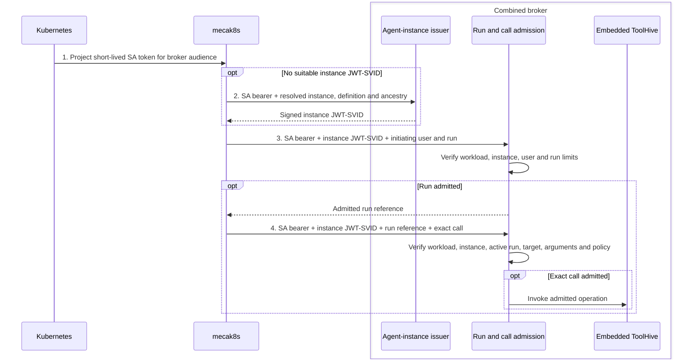
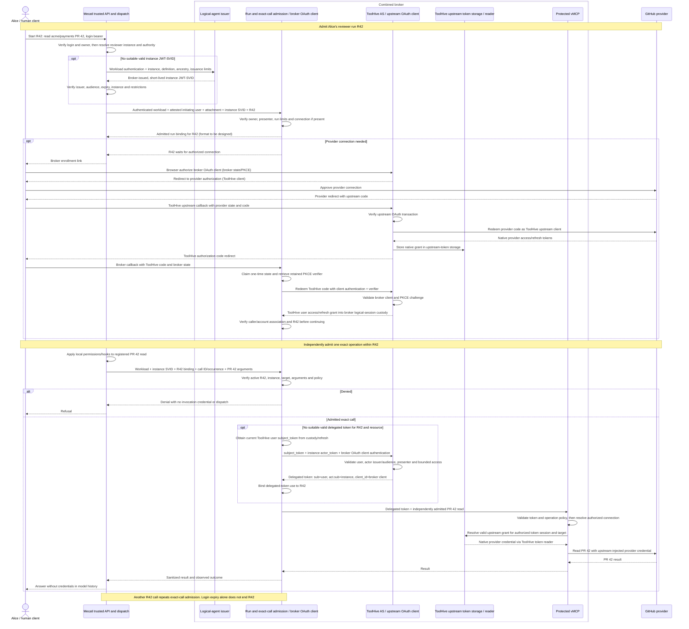

# Agent authority: user journey and trust boundaries

This page records the intended design of the agent identity work in mecatl, how credentials flow in the system and what the trust model is.

## 1. User journey

Alice asks `code-reviewer` to read PR 42 in `acme/payments`. Mecatl validates her login token and reports the verified user and acting reviewer instance to the workload-authenticated broker. The broker checks the instance credential and applies its own policy to the run and exact operation before dispatch. It trusts Mecatl’s report that Alice authenticated; it does not revalidate her login token or infer that she approved this particular action.

Binding the user, agent instance, run, and operation provides the substrate for broker authorization decisions and future audit records. Reading PR 42 does not authorize merging PR 43; an audit record must distinguish the broker’s checks from Mecatl’s assertions and capture the observed outcome.

## 2. Identity and trust model

### User identity and persisted ownership

Mecatl identifies Alice by the issuer and subject of her validated login token, represented by `session.Principal`. Mecatl saves that principal as the session owner; children and forks inherit it.

For each new human-initiated request, Mecatl validates the caller's login token signature, trusted issuer, intended audience and expiry, then checks that its issuer and subject match the saved session owner. It reports the verified user to the workload-authenticated broker for run admission; the broker checks that the report came from trusted Mecatl and matches the owner. Once a run is admitted, expiry of Alice's original login token does not end it.

### Agent definitions and execution lifetimes

- **Agent definition:** `code-reviewer` is a selected `AgentDef`; this design also gives the default main and unnamed child the built-in identities `system/main` and `system/explorer`. Broker policy would distinguish the verified source supplying `code-reviewer`, not rely on `project/code-reviewer` alone. Changing its content does not change that source identity; a task prompt cannot create a new definition.
- **Session:** The [domain model](architecture/domain-model.md) defines the `Session` aggregate. In this design, Alice and Bob have separate conversations and owners even if both select `system/main`.
- **Session incarnation:** the durable identity this design uses to distinguish their agent instances, even if an internal caller later reuses a session ID. Restoration keeps the incarnation.
- **Agent instance:** the proposed logical identity of a selected definition in one session incarnation, not a process or a run. Alice can select `code-reviewer` for her main instance or invoke it as a distinct child; a peer fork/clear creates another instance.
- **Run:** Alice's PR 42 task is one run of the reviewer instance. Continuing it after an approval pause keeps its run identity; giving the same instance a new task starts another run. The existing `RunID` correlates execution but does not authorize it: broker admission for each run is part of this design.
- **Workload:** the Mecatl service authenticating to the broker (`mecak8s` in this flow). Its identity names neither Alice nor one of the agent instances it hosts.

### Instance subject and creation ancestry

In this proposed design, a short-lived JWT-SVID carries the agent instance's SPIFFE ID. Each creation hop names a source category (`system`, `explicit`, `project`, `user` or `driver`), definition name and persisted session incarnation:

```text
spiffe://<trust-domain>/mecatl/agent/<category>/<name>/inst/<incarnation>[/child/<category>/<name>/inst/<incarnation> ...]
```

These illustrative subjects show Alice's main instance, its reviewer child, and a peer fork or clear of the main:

```text
# Alice's main instance
spiffe://agents.example.com/mecatl/agent/system/main/inst/inc_cejrv7re4uy3ubxyzj2gfxfp2u

# Reviewer child created by that main instance
spiffe://agents.example.com/mecatl/agent/system/main/inst/inc_cejrv7re4uy3ubxyzj2gfxfp2u/child/project/code-reviewer/inst/inc_gh56irfcpnupjqgfdw7dhzzw4m

# Alice forks or clears her main instance
spiffe://agents.example.com/mecatl/agent/system/main/inst/inc_45bvtrrrpkekb6336hwe6bvape
```

`project/code-reviewer` illustrates a wider problem: a category and name do not necessarily identify the source that supplied a definition. The payments and website projects, for example, could each supply `code-reviewer`. Before applying a definition-specific policy, the broker needs a verified record of which source supplied this instance's definition. How the issuer verifies and preserves that record, including across repository moves or renames, remains to be designed. If the record is unavailable, the broker must not guess from the path.

The reviewer subject adds `/child/project/code-reviewer/inst/` to Alice's main subject: her main created that instance. The forked main ends in `/system/main/inst/inc_45bvtrrrpkekb6336hwe6bvape` without `/child/`: fork or clear creates another root instance. A team member started directly through the API is also a root.

### Credential format and source provenance

Use literal, nonempty SPIFFE-safe definition names (`[A-Za-z0-9._-]+`, except `.` and `..`); reject invalid names rather than rewriting them. Incarnations use persisted `inc_` values with 26 lowercase base32 characters, or deterministic `legacy_` values for older snapshots. Apply any issuance limit to the **whole URI**, including child hops, without truncating it. [SPIFFE-ID §2.3](https://github.com/spiffe/spiffe/blob/main/standards/SPIFFE-ID.md#23-maximum-spiffe-id-length) requires support through 2048 bytes and advises against generating longer IDs; a Mecatl cap and compatible name/depth bounds remain undecided. Legacy-name compatibility is also open. The path has no version segment, so incompatible grammar requires migration.

Resume requires the instance's original definition source and revision; if either is unavailable, it cannot silently select another. Fork or clear starts a new instance using the current revision from the same source. Keep private source locations out of readable JWTs. How source records, revision snapshots, and optional claims are represented remains open.

### What signatures and identity do not prove

A signed agent JWT-SVID proves its issuer signed an instance identity, not which agent inside a shared Mecatl process used it. If that process is compromised, it can present `deployer`'s credential on `code-reviewer`'s call when it has access to that credential. Different SPIFFE names or keys held in the same process do not isolate the agents. The [interactive flow](#5-interactive-execution-flow) covers the broker's separate run and call checks.

## 3. Credential roles and lifetimes

An instance JWT-SVID can be renewed or reused across that instance's runs; the broker admits each run separately.

Delegated access belongs to the acting instance's admitted run, not its conversation session or a parent run. One run may need several access tokens for different resources or after expiry, but each stays within its authorization. A specialist uses its own run and identity, never a token naming its parent.

An admitted parent can start a child without Alice logging in again. The child's separate run derives its user and authority from the active parent and the child's definition ceiling; a saved owner or instance credential alone cannot open it. If Alice's run `R42` starts reviewer run `C1`, `R42` is `C1`'s parent and root run, distinct from instance ancestry in the SPIFFE ID. `C1` cannot outlive the applicable parent and root authority.

A token minted at run start cannot authorize another run. Completing or cancelling a run stops new admissions and delegated-access issuance or renewal for it and dependent children, although an operation already dispatched may finish. A recipient without live run-status checks may still accept an issued bearer until expiry. Renewing agent, ToolHive or provider credentials neither extends run authority nor authenticates another initiating request.

An approval wait or provider-enrollment pause leaves the run unfinished; continuation rechecks its original authorization and pending operation. Client disconnect follows the run's actual lifecycle, not automatic cancellation or indefinite authority. After restart, only a durable record of the unfinished run and its original authorization permits continuation; a saved owner, instance credential, connection or attachment alone cannot revive it. An ended child invoked again keeps its instance but needs a new run. Never blindly replay an operation whose outcome is unknown.

A run may have narrower resource/action limits than its definition ceiling. These broker limits govern protected external calls, not local file access or direct writes to a parent workspace; Mecatl's permission and environment controls still govern those. Pinning a definition revision across resume does not pin old operator grants. A model-proposed goal or broad definition tool list is not a trusted task grant; mission-bound authorization is a possible later approach, not a selected approval or policy-generation mechanism. Broker policy changes must not automatically widen an already admitted run. Explicit restrictions or withdrawal can constrain subsequent operations, while an expansion requires an authorized change. Policy lookup, token-carried limits, online evaluation and subset algorithms remain separate authorization-design choices; a signed SVID does not decide among them.

## 4. Identity progression

At every stage, `mecak8s` is a client of one broker deployment; the model neither requests credentials nor authenticates. A is a workload-only checkpoint. B adds agent-instance identity, while C and D change how the same harness authenticates its workload. These are alternatives, not a required sequence; agent JWT-SVIDs do not require SPIRE. The separate broker-to-ToolHive OAuth flow appears in [the interactive sequence](#5-interactive-execution-flow).

| Stage | Workload authentication to the broker | Agent-instance credential |
|---|---|---|
| **A** | Projected Kubernetes ServiceAccount (SA) bearer over TLS | None |
| **B** | Projected SA bearer over TLS | Broker-issued instance JWT-SVID |
| **C** | SPIRE workload JWT-SVID from the Workload API over TLS | Broker-issued instance JWT-SVID |
| **D** | SPIRE workload X.509-SVID and key from the Workload API over mTLS | Broker-issued instance JWT-SVID |

In A, the broker validates the configured Kubernetes issuer, audience and SA allowlist, then invokes ToolHive with credentials it holds. `code-reviewer` and `deployer` in one harness have the same workload identity; a self-declared agent name cannot distinguish them for policy.

### Example flow: ServiceAccount plus agent-instance JWT-SVID

B adds a short-lived credential for the acting instance. The broker authenticates the SA; its issuer must check the resolved definition and creation ancestry against trusted inputs rather than sign a model-supplied name. How it obtains those trusted inputs remains open. The diagram separates obtaining that credential, admitting a run and admitting one exact call:



Operator configuration fixes accepted Kubernetes issuers, audiences and SAs, issuance limits and trusted public signing keys. Verification endpoints, CA trust and server names are never selected by a token. A stolen SA token or workload JWT-SVID remains a bearer credential until expiry; workload proof does not replace per-run and per-call admission.

In C, `mecak8s` obtains a platform JWT-SVID for the broker's audience through the SPIFFE Workload API and presents it on issuance and invocation requests. The broker checks signature, audience, expiry and allowed workload SPIFFE ID. Platform credential renewal and trust-bundle refresh are separate from the broker issuer's key rotation; platform identity neither replaces agent-instance issuance nor creates federation.

In D, `mecak8s` obtains an X.509-SVID and key through the Workload API and proves possession during mTLS to both broker endpoints. The broker checks platform trust and permitted workload IDs. A TLS-terminating ingress needs explicitly trusted identity propagation; a forwarded header alone is insufficient. Rotation, bundle refresh and connection renewal must preserve mTLS checks without bearer fallback. Workload mTLS does not bind an OAuth access token to its certificate or prove user consent or isolation among agents in one harness.

## 5. Interactive execution flow

The flow separates occasional provider enrollment and run admission from independently checked calls in an admitted run. It uses an OAuth-protected upstream requiring its native provider credential, rather than a backend that directly accepts the delegated token. Operation and scope names are illustrative, not wire names.

The broker starts as a **modulith**: a constrained interface for issuing agent-instance JWT-SVIDs, ToolHive authserver and vMCP contracts, and credential-custody interfaces sit behind Mecatl-specific operations for run admission and exact-call dispatch. Those operations compose reusable interfaces while preserving authorization and custody checks; they expose neither raw signing nor credential retrieval. Mecatl-specific session, definition-source and engine adaptation stays at the integration edge. The modules are not separate security boundaries.

A broker attachment refers to broker-owned session and connection state under the authenticated workload; it is neither an agent instance nor a run grant. The preferred design holds admitted run context alongside it and checks both on authenticated calls. Existing reference machinery may be reused, but no API, persistence format or signed run assertion is selected.

Before invoking a connected provider account, the broker must establish that Alice may use it. Her Mecatl and GitHub identifiers need not match; the browser flow's state/PKCE and account-continuity checks do not establish that initial permission. How to authorize the caller to use the connected ToolHive user and provider account remains open, including separately governed account sharing.

Enrollment uses two OAuth clients and two authorization codes. ToolHive redeems the provider code and stores the native grant; the broker separately redeems a ToolHive AS code with its confidential-client authentication and PKCE. The broker consumes its callback state, while ToolHive AS checks the registered client, PKCE and eligible grant. Instances need no separate OAuth client registration.

The broker retains the ToolHive user access/refresh grant. A continuity record can link to ToolHive's token session but is not the provider-token store. The inspected [B2 foundation](agent-authority-implementation.md#b2-enrollment-and-account-continuity-to-reuse) has these OAuth/custody boundaries; the instance actor exchange, caller/account permission and admitted run remain intended integrations.

### Execution sequence

The sequence shows Alice starting reviewer run `R42` and one PR 42 read. The run label is illustrative, not a specified broker-reference format. Agent credential issuance, enrollment and exchange occur only when needed; the operation check applies on every invocation.



The sequence shows one run. For a child run, authenticated Mecatl reports the child instance and parent/root-run links without resending Alice's login bearer. The broker verifies those links and checks the active parent's initiating user and applicable authority against the child's definition ceiling before admitting the child's own run.

For each call, the broker authenticates the workload and validates the instance JWT-SVID's signature, issuer, audience, expiry and permitted presenter. It checks that the attachment matches the admitted user, authenticated workload and current Mecatl session incarnation, and that the SVID names that incarnation. The attachment's separate broker incarnation prevents an old reference from selecting new broker state. Neither an attachment nor a run reference grants authority by possession.

The broker resolves the issuer-verified definition source before selecting policy; missing or stale records fail closed. It checks the caller's connection permission and applies the definition ceiling and active run's limits to the registered target, resource, scopes or authorization details, and exact arguments. Admission binds one occurrence to the attachment, broker incarnation, run, call ID, argument digest and expiry. A credential's tool list is only a restriction, not the whole policy; ToolHive's Cedar checks remain a reuse candidate, not a selected policy platform.

After enrollment, continuation of the pending run rechecks the PR read before dispatch; connecting an account does not approve that operation.

At exchange, the broker uses its existing ToolHive authorization-code access token as RFC 8693 `subject_token`, the instance JWT-SVID as `actor_token`, and its own OAuth client authentication. ToolHive AS validates the user token, actor issuer, signature, audience, expiry and permitted presenter. A credential valid for broker admission needs an explicit ToolHive AS audience; no additional user-evidence credential is introduced.

ToolHive issues a delegated token with the user in `sub`, the acting instance in `act.sub`, the broker OAuth client in `client_id`, and the protected MCP endpoint as audience, not GitHub. These claims identify parties and recipient, not permission for particular tool arguments; the broker still admits the exact call.

The protected resource validates issuer, audience, expiry and bounded access,
applies operation policy and resolves only the authorized user/tenant/target's provider connection. `tsid` is a ToolHive-local credential link, outside SPIFFE's identity responsibility. It must come from validated subject and authoritative connection state, never an arbitrary external claim or caller-selected storage key.

## 6. Credential custody and safety boundaries

- **Human login bearers terminate at Mecatl's edge.** They are transient, never saved for downstream or scheduled use. Harness-attested authentication at run admission is not the bearer, a stored owner, an attachment or an authorization grant for arbitrary operations.
- **Agent credentials enter trusted Mecatl memory, not model content.** Client code verifies and attaches them without exposing them in arguments, results, conversation history, logs or environment variables. Model-hidden is not process-safe and does not guarantee secure memory erasure.
- **Signing authority stays with the broker issuer.** Mecatl receives signed credentials and public verification keys, never the private signing key. Issuance and invocation may be modules in one process: separate boxes do not protect against broker, host or key-storage compromise. Key rotation and verifier cache expiry bound trust in old keys.
- **Provider credentials stay in broker/ToolHive custody.** ToolHive retains,
  refreshes and injects native access credentials for the authorized connection;
  the broker holds its own ToolHive access/refresh tokens. Neither Mecatl nor
  the model receives the native provider grant. Results contain neither
  secrets nor reusable signed requests. This does not relocate all harness
  credentials, including LLM-provider credentials. The broker runs no model-driven
  agent loop or general-purpose shell.
- **Refresh is not a new run grant.** A provider connection can outlive a login token without authorizing another request. Credential recovery alone does not establish canonical-user identity or the authorized caller/connection association. After restart, revalidate connection continuity and durable unfinished-run binding before continuing an admitted run; missing or indeterminate bindings fail closed. An ended run needs new admission. Expiry of the original login bearer alone does not end unfinished, recoverable work. Self-contained bearers retain a residual lifetime unless recipients check live run status or introspect.
- **Targets and credentials are server-resolved.** Model-chosen URLs, headers,
  issuers, audiences, scopes or credential selectors cannot redirect authority.
  Missing, malformed, stale, revoked or indeterminate evidence or authorization
  fails closed—never to an ownerless, service, broader-agent or alternate-user
  credential. Denied calls select no invocation credential and dispatch no backend
  operation; enrollment/callback traffic is accounted separately.
- **Children only narrow authority.** A malicious PR comment cannot obtain merge
  authority by requesting `deployer` beneath a read-only reviewer. A separately
  authorized top-level deployer may merge if every ceiling permits. A signature
  over a model-supplied name is not enforcement. Native Kubernetes execution
  separates Shell commands into executor Pods while the agent loop remains in
  the harness. Its configured execution and network controls must prevent
  protected-route bypasses; local worktrees and environment scrubbing alone do
  not provide the same boundary. Shell logs are not exhaustive effect records.

Unattended execution requires independent authority; restoring a schedule's owner
or keeping provider offline credentials is insufficient. Interactive authentication
does not silently authorize future timer or manual fires.

A possibly dispatched operation with no recorded completion has an **unknown
outcome**, not proof that nothing happened. Never retry it automatically. Credential
recovery or a signed pre-dispatch record cannot establish whether a merge reached
the provider. Provider idempotency/status evidence can support reconciliation, but
arbitrary effects have no general exactly-once guarantee. Broker audit inputs must join the initiating user and authorized provider connection to the authenticated workload, acting instance's readable category/name and issuer-verified definition-source association and selected revision, executing run and parent/root-run links, exact tool invocation, decision, dispatch and observed outcome, without credentials. Creation ancestry in the SPIFFE path is distinct from the run and call identifiers. Reuse ToolHive/broker audit facilities where applicable; field mapping, delivery and retention belong to that integration work, not a new audit format here. The record must survive broker restart and distinguish broker-verified checks, harness assertions and provider-reported results. Knowing a correlation identifier grants no authority.

## 7. Future work required to establish the separation

The architecture separates the harness from signing, credential custody, and
external authorization. The following work must establish those boundaries in
implementation; SPIFFE identities alone do not complete it. Detailed mechanisms
and qualification belong in the [implementation companion](agent-authority-implementation.md).

1. **Qualify protected-route mediation in the execution environment.** Build on
   the existing native Kubernetes execution boundary, rather than invent another
   sandbox. Verify executor Pod mounts, ServiceAccount configuration, runtime
   restrictions, and effective network policy in the selected deployment. Test
   alternate MCP, native CLI, and direct provider routes for usable credentials
   or privileged interfaces that could bypass broker checks. Record the different
   guarantees of local execution; worktrees and environment scrubbing alone do
   not provide the Kubernetes execution boundary. State which protected operations
   the deployment actually mediates. This is integration and qualification work,
   not a claim that Kubernetes execution is absent or that every cluster is safe.

2. **Constrain issuance using trusted inputs.** Define how the issuer
   verifies each resolved definition's admitted source, its instance and
   creation ancestry, and which issuance limits a harness may request. The
   broker must validate those bindings rather than sign arbitrary
   harness-supplied names or ceilings. Qualify rejection of substituted
   definitions and unauthorized parent/child associations. Admission of a
   definition from a source must not automatically grant external access;
   exact grant and policy mechanisms belong to the separate authorization design.

3. **Bound shared-harness credential substitution.** Determine which instance
   credentials and run references a compromised harness can obtain or reuse, and
   qualify the limits enforced outside that process. Separate identifiers or keys
   in one process do not independently identify the executing agent. Document the
   residual substitution risk; if stronger per-agent guarantees are required,
   design and qualify a stronger execution boundary rather than claiming that a
   signed SVID supplies it. No per-agent workload topology is selected here.

4. **Integrate authorized caller/account and executing-run associations.** Build
   on the broker's enrollment and account-continuity machinery to establish which
   initiating caller may use a connection for a particular agent instance's run.
   Preserve and validate that association through credential renewal and supported
   recovery, including parent/root execution links and run termination. Neither
   successful enrollment nor possession of an SVID establishes that association
   alone. The [B2 integration work](agent-authority-implementation.md#calleraccount-association-and-exchange-on-b2)
   records the inspected foundation and remaining checks without selecting a new
   user-evidence credential or account-linking platform.
