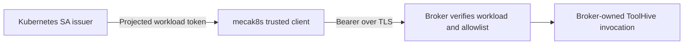
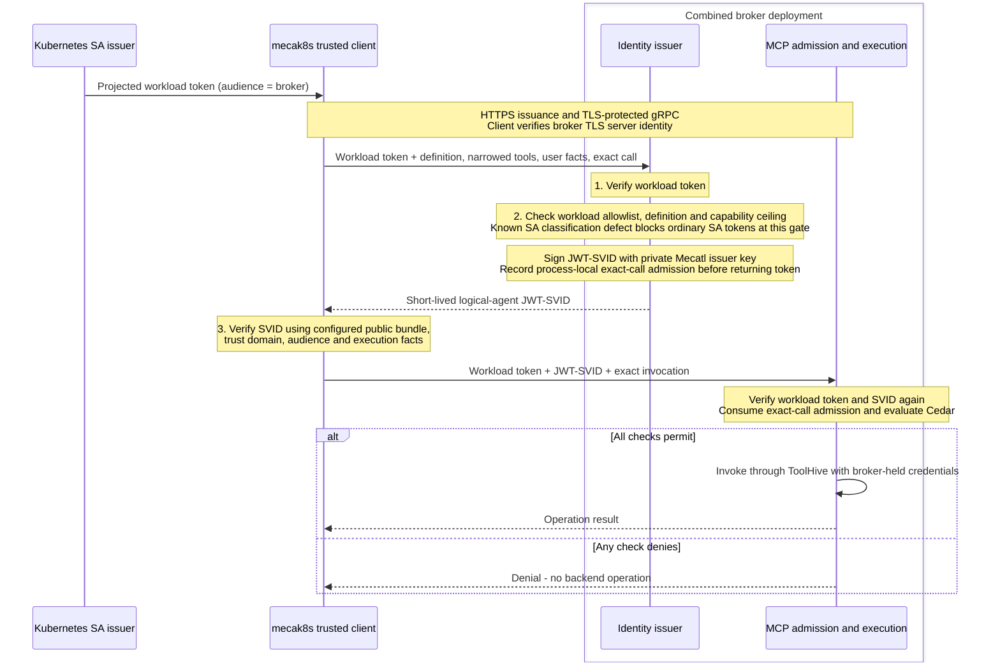
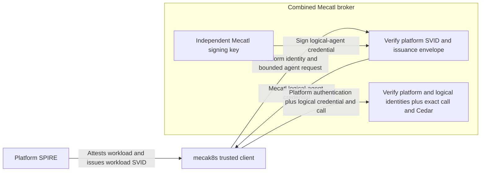

# Agent authority: user journey, trust boundaries, and implementation gaps

*Living explanation, not a new decision or acceptance plan. Implementation claims
refer to the pins below, not to an integrated release. Existing ADRs and plans
remain authoritative; source inspection is not deployment qualification.*

## The user journey

> An operator can enforce policies for named agents at the broker and, independently
> of the harness's logs, inspect which verified user and agent were associated with
> an exact requested operation, the broker's authorization decision, and its observed
> outcome—including an unknown outcome.

Alice asks a deployment specialist to change a registered target. The broker checks
identity evidence and its own policy before selecting credentials or dispatching.
Later, even without the harness, the operator can inspect the broker's decision and
observed outcome. The record distinguishes verified facts from claims accepted from
an attester. **This is the intended journey, not the current delivery claim.**

Two kinds of independence matter:

- **Enforcement and evidence:** the broker makes its own decision and retains its
  own records, correlated with—not reconstructed solely from—the harness log.
- **Identity verification:** the broker verifies user evidence without relying
  solely on the harness's assertion that it authenticated that user. A separate
  signer or a broker-audience claim does not by itself establish this property.

The integration branch supplies broker-side named-agent/exact-call enforcement.
It still trusts an allowlisted harness for user-authentication and agent-selection
facts, and its admission records are process-local. Independent user provenance and
broker-owned durable activity evidence remain gaps.

## What each identity means

| Value | Question it answers; boundary |
|---|---|
| Owner | Who controls the durable session or schedule? An owner label is not fresh authentication. |
| Subject | Whose user authority does the external call spend? |
| Logical agent / actor | Which configured definition performs the operation? |
| Instance | Which runtime occurrence? Accountability metadata, not a separately keyed v1 principal. |
| Workload presenter | Which admitted workload presents the request? Not the user or logical agent. |
| Holder | Which process/key can exercise a sender-bound credential, when used? |
| Effective authority | Which capabilities survive parent, definition and current policy ceilings? |
| Environment | Which exact namespace/revision supplies execution? Placement is not consent. |
| Target | Which server-resolved integration, operation, resource and credential selection? |
| Correlation | Which records join? A correlation value never grants authority. |

### What the internal SPIFFE identity proves

The v1 subject is definition-scoped:

```text
spiffe://<trust-domain>/mecatl/agent-definition/v1/<tier>/<slug>--<digest>
```

The digest binds tier and exact name, **not definition contents or revision**.
Renaming changes the principal; editing its contents does not. Schedule revision
pinning therefore needs separate verified evidence. Runtime measurement is not an
agreed v1 prerequisite, and a goroutine is not a separately protected principal.

The credential projects exact tool names through `CapabilitySet.Contains`. It is
not a complete resource/argument, filesystem, direct-write, delegation-history,
user-consent or holder-binding credential. Never union authority merely because
two tokens share a subject; instance/`jti` values alone do not prevent replay.

The identity substrate uses Secret-backed ES256 issuance, public bundles and bounded
rotation verification on an agent-free host. It neither requires SPIRE nor exposes
arbitrary signing. KMS/HSM is later hardening; software keys do not protect against
issuer-host, node, cluster-admin or Secret-store compromise.

Sources: pinned identity ADRs for [issuer custody][issuer-adr] and
[logical-agent projection][agent-adr].

#### Internal SPIFFE identity: issuer and verifier trust

These are **three deployment profiles, not mandatory stages**. Each diagram has
one harness. Model code is not a participant in credential issuance.

**A — SA only:** implemented in the broker squash at `53eab6b7`, without logical-agent
SPIFFE identity. The broker authenticates a workload, not the agent definition in it.



**B — SA-authenticated independent Mecatl issuer:** wired at `db5bcd884`, but the
sequence below is the **intended successful path, not a qualified SA deployment**.
Ordinary SA claims are classified as `user`, while issuance requires
`client_credentials`. The custom verification bundle also lacks standard
`use: jwt-svid` key metadata and uses custom sequence/refresh field names. These
[known blockers](#known-identity-profile-defects) remain unfixed.

There is one broker deployment containing issuance and invocation components.
Its three checks are configuration decisions, not three services or SPIFFE domains:

| Check | Who checks it? | Concrete question |
|---|---|---|
| Authenticate the workload | Broker | “Was this token issued by the configured Kubernetes issuer for this broker, and is it valid?” |
| Authorize issuance | Broker issuer | “Is this workload allowlisted to request `deployment-specialist` with this tool set?” |
| Verify the issued credential | Trusted harness client, then broker invocation component | “Was this SVID signed by our configured Mecatl issuer, for the expected audience, and is it still valid?” |

The first uses **Kubernetes workload identity**. The third uses the **internal
Mecatl SPIFFE identity**. The second is the operator's policy connecting the two:
knowing a workload's identity does not let it request any logical-agent identity.



Operator configuration is **not another network hop** in this sequence. It supplies
the broker's Kubernetes issuer/audience/allowed subjects, the issuer's permitted
agent definitions and capability ceilings, and each verifier's Mecatl issuer trust.
The harness obtains public verification keys from its configured HTTPS bundle
endpoint using configured CA/server-name trust; the SVID cannot choose that endpoint.
The broker uses its configured issuer/verifier. Private signing keys remain inside
the broker boundary; sharing public keys grants verification, not signing authority.

The broker still trusts this admitted harness to report user-authentication and
resolved-definition facts. The SVID proves what the constrained issuer accepted,
not independently measured agent code or independently authenticated human identity.
A valid SVID also does not bypass exact-call admission or Cedar. No SPIRE deployment,
federation or future user-token exchange is implied.
Sources: [integration issuer ingress][ingress], [admission verifier][admission] and
[integration ADR][integration-adr].

**C — external SPIRE workload authentication:** proposed, not wired in this pin.
It replaces B's requester authentication, not the independent Mecatl signing keys.
JWT-SVID verification or X.509-SVID/mTLS must authenticate the workload on both
issuance and invocation; the protocol choice and rotation wiring remain open.



Platform SVID verification requires explicitly trusted platform keys and permitted
workload IDs. The Mecatl credential is verified against separately configured Mecatl
keys. This is **authenticated workload → authorized issuance**, not an automatic
parent-domain signing chain or federation. Neither profile independently proves
harness-asserted human identity.

#### Known identity-profile defects

At `db5bcd884`, the SA blocker is the mismatch between
[`GrantTypeFromClaims`](https://github.com/stacklok/mecatl/blob/db5bcd8845f87f05fa0c0efecb2092fd6c5e497c/engine/session/principal.go)
and [`IssueAttested`](https://github.com/stacklok/mecatl/blob/db5bcd8845f87f05fa0c0efecb2092fd6c5e497c/internal/identityissuer/host.go).
The separate [bundle-format gap](https://github.com/stacklok/mecatl/blob/db5bcd8845f87f05fa0c0efecb2092fd6c5e497c/internal/identityissuer/bundle.go)
prevents claiming standard SPIFFE bundle interoperability merely because the local
issuer and verifier agree. These are source-review findings, not fixes or live
reproductions. Profile A does not require this logical-agent issuer; profile C
requires new workload-authentication support as well as qualified issuer compatibility.

## Implementation evidence: separate branches, not one product

These are inspected local-ref snapshots; uncommitted changes and later commits are
excluded. Re-pin before implementation. The external broker squash supersedes the
older review-remediation branch; the integration has not absorbed that squash.

| Source and pin | What it supplies | What it does not establish |
|---|---|---|
| `origin/main` — `a711451616edf84f50e793c9bcbfb697ef400347` | Caller/owner checks, carried authority, exact placement, dispatch/event logging and configured in-process MCP broker paths | Completed external user/agent admission or exhaustive evidence of shell side effects |
| `handover/agent-mcp-authority-restart` — `ed319f45cd972de3cb95031b39e57b8eec425789` | Issuer substrate (I1), logical-agent projection (I2), adapter-neutral acting-as-user contract (I3-C) | Production ToolHive exchange or provider credential lookup |
| `acc/singleton-mcp-broker-review-remediation-squash` — `53eab6b753869b33c317da49a67295575807ac61` | TLS/workload-OIDC remote broker, callback lifecycle, process-local Execute receipts, configured encrypted custody recovery | Logical-agent admission, fresh user proof, HA or durable operation outcomes |
| `acc/singleton-identity-mcp-integration` — `db5bcd8845f87f05fa0c0efecb2092fd6c5e497c` | Constrained issuer, live exact-call Cedar admission and ToolHive fixture tests | Independently verified human evidence, scheduled grants or durable broker audit completion |
| `workload-identity` — `b6dc951c091197bcb4c3ec444a80308d43dc9e5a` | Historical broker-owned SPIFFE custody/proxy experiment | Selected production transport or an integration dependency |

Pinned main is an ancestor of the squash. The identity, squash and integration
comparisons diverge at `038b5739`; neither squash nor integration contains the other.
The integration adapts the issuer slice but has no `internal/actingaccess`; its
broker-local admission is not simply the donor's exchange contract wired to ToolHive.
Individual branch tests do not prove that their combination works.

### Baseline and broker protections worth preserving

Main authenticates callers, checks ownership, reattaches exact placement, applies
local permissions/hooks/authority, and records effective tool results. Child
[derivation and resume checks][delegation] prevent a broader definition from
restoring authority absent from its parent. These are harness checks, not signed
external grants. Ownerless compatibility exists where owner enforcement is disabled;
a shared static bearer does not establish individual users.

The external broker authenticates workload OIDC over TLS, including Kubernetes
OIDC discovery/JWKS—not TokenReview. Workload/session-owned attachments and receipts
protect the remote lifecycle, not the complete user/actor conjunction. Identical
calls within a receipt lease may join or return a recorded result; changed content
is rejected. Those receipts do not survive process replacement.

Configured encrypted custody can recover a **fresh attachment** using exact
session/incarnation, workload/owner partitions, profile/provider, recovery-reference
and deadline checks. An owner partition is an isolation guard, not human identity
proof. Recovering credentials does not recover a callback, Execute receipt or effect.
Sources: [broker authentication][broker-auth], [custody RPCs][custody],
[protected storage][storage], and [Execute receipts][receipts].

Track B's alternate proxy keeps downstream workload credentials behind the broker.
Its [recorded spike results][track-b] include missing-subject, path-containment and
alternate-SVID bypass limitations. Those are historical prototype findings, not
claims about the current broker. Neither that proposal nor an SA-first checkpoint
silently replaces verified logical-agent identity in the selected integration.

### Singleton integration: live admission

```text
loop: exact tool-call execution evidence + current matching user authentication
  -> workload-authenticated request carrying resolved definition and authority
  -> constrained issuer + bounded single-use admission
  -> Run verifies workload and logical-agent JWT-SVID
  -> consume matching presenter/owner/actor/expiry, attachment/incarnation,
     call ID, argument digest and occurrence
  -> registered target/capability checks + Cedar
  -> broker-owned ToolHive invocation -> result
```

Changing PR 42 to PR 43 cannot reuse the admission; a valid SVID alone cannot skip
Cedar or exact-call checks. But user-authentication and definition-selection facts
come from the trusted harness attester. The broker checks consistency and its own
policy; it does not separately verify a human IdP credential.

The [integration ADR][integration-adr] describes this relationship. The design
handover's sections 10/13 instead call for a distinct fresh broker/AS user assertion
from which the broker derives owner. **Reconciling those trust profiles remains a
design decision, not an approved replacement made here.** Audience limits where an
assertion is accepted; independence depends on its issuer, required evidence and
verification. Local permission provenance alone does not prove all subject-authority
and consent ceilings of the [acting-as-user conjunction][exchange-adr].

Sources: [identity wrapper][wrapper], [issuer ingress][ingress],
[one-use admission][admission], [Cedar gate][cedar], and
[real-ToolHive fixture tests][fixtures]. Tests include an admitted write and denied
credential/backend counters; their presence is not a fresh test run or Kind proof.

## Intended flows and safety boundaries

### Interactive authorization and child escalation

Alice asks `code-reviewer` to read PR 42 in `acme/payments`. Here `read_pr` and
`merge_pr` are illustrative registered operations, not actual wire names.

```text
Alice's login bearer -> Mecatl API validation; persist owner, not bearer
  -> resolve definition + narrowed authority + exact environment
  -> local permissions/hooks/authority
  -> broker verifies workload, logical agent and agreed fresh user evidence
  -> owner/subject + subject authority + consent + presenter association
     + agent tools + registered target/scopes/detail + target policy all permit
  -> select provider credential -> dispatch exact call -> sanitized result
```

If the provider is not connected, the MCP authorization lifecycle parks the prepared
call for browser authorization. Connection consent does not waive operation admission.
A denial selects no invocation credential and sends no backend operation; enrollment
and callback traffic are accounted separately.

A malicious PR comment might ask the reviewer to delegate to `deployer` and merge.
A child name cannot restore merge authority missing from the parent. Derived child
authority must survive issuance and broker admission. A separately authorized
top-level deployer may merge if all ceilings permit. Proving this distinction through
the composed remote path remains necessary; neither a worktree nor a signature over
an arbitrary model-supplied agent name supplies that proof.

There are two presenter relationships: workload-to-broker authentication, and the
broker's own authenticated client relationship when it performs an AS exchange.
The latter client ID is not the logical agent's SPIFFE subject. The fresh exchange
assertion is neither the Mecatl login bearer nor an ID token; selecting its production
issuer/consent profile remains open. The upstream provider may simply receive its
ordinary credential without understanding Mecatl agents.

### Credential and execution custody

**The trusted invocation path includes transient memory inside mecak8s.** The
logical-agent token does enter the harness: trusted client code receives and verifies
it, binds it to an invocation context, and sends it in private gRPC metadata. It is
not a model argument, tool result or persisted conversation message. This is a
separation from the model's interface, not protection against a compromised harness
process or a guarantee of secure memory erasure.

The diagram shows **profile B's intended successful credential flow**, not a working
ordinary-SA deployment or the future independent user exchange. The
[SA-classification and bundle-compatibility defects](#known-identity-profile-defects)
remain open. Repeated harness/client and broker boxes are stages of the same two
deployments, not extra services; broker modules are not necessarily separate processes.
Harness-to-broker issuance uses HTTPS and invocation uses TLS-protected gRPC.

```text
Human IdP                                 Kubernetes SA issuer
  issues API bearer                         issues projected workload bearer
         |                                             |
         v                                             v
+-------------------- mecak8s / harness ---------------------------+
| API edge: verifies human signature, issuer, audience, expiry.    |
| Keeps fresh authentication evidence; persists owner, not bearer. |
|                                                                 |
| Model -> proposed tool/arguments -> trusted dispatch/client      |
|          (no credentials)          resolves definition/authority |
+--------------------------------------|--------------------------+
                                       | 1. HTTPS issuance request:
                                       | workload bearer + exact call
                                       | + harness-asserted user,
                                       |   definition and permission facts
                                       v
+-------------------- combined mecabroker ------------------------+
| Ingress: verifies workload OIDC bearer and attester envelope.    |
| Checks asserted owner/freshness; does NOT verify human bearer.   |
| Constrained issuer: private ES256 key -> logical-agent JWT-SVID. |
| Records bounded, single-use exact-call admission.                |
+--------------------------------------|--------------------------+
                                       | 2. Returns signed JWT-SVID
                                       v
                  Trusted mecak8s identity client
                  verifies with separately configured public bundle,
                  trust domain/audience and matching execution facts
                                       |
                                       | 3. gRPC Run metadata:
                                       | authorization: Bearer <workload>
                                       | mecatl-logical-agent-svid: <SVID>
                                       | Body: exact invocation
                                       v
+-------------------- combined mecabroker ------------------------+
| Verifies workload bearer AND logical-agent SVID.                 |
| Consumes exact admission; registered-target checks + Cedar.      |
| Deny: no invocation credential selection or backend operation.   |
| Allow:                                                          |
|   broker confidential OAuth client                              |
|     -- ToolHive-issued access token --> protected vMCP endpoint  |
|   ToolHive verifies token, selects/injects upstream credential    |
+--------------------------------------|--------------------------+
                                       | provider access credential
                                       v
                         Upstream MCP/resource server
                         verifies credential, performs operation
                         -> result returns through broker/harness
                            to model, never an authentication token
```

The final hop illustrates an OAuth-protected upstream, not every MCP deployment.
The provider receives its native credential, not the logical-agent SVID or Mecatl
login bearer. Other credentials and trust anchors in this flow are:

| Artifact | Issuer/source and verifier | Custody / boundary |
|---|---|---|
| Broker TLS certificate | Configured TLS issuer; harness verifies CA/server name | Bundle endpoint and trust settings are operator-configured, not chosen by a returned token. |
| Issuer public bundle | Broker issuer publishes public verification keys; trusted client uses them to verify SVIDs | No private signing key crosses to the harness. Broker also verifies the SVID at Run. |
| ToolHive client ID/secret | Broker generates/registers confidential client; ToolHive AS authenticates it with `client_secret_basic` | Secret remains broker-side. ToolHive AS issues its own access/refresh tokens; these are not upstream provider tokens. |
| Provider OAuth code/tokens | Upstream authorization server issues; broker/ToolHive redeems code; upstream resource server verifies access token | Browser delivers codes to registered callbacks, outside the model channel. ToolHive owns provider token storage, refresh and injection. |

**“Protected agent-free host” means no model-driven execution or shell in the
issuer/broker deployment.** Only the issuer component needs the signing key, but
module separation within a combined process does not isolate a broker compromise.
Software keys also do not exclude node, cluster-admin or Secret-store access. The
harness receives a signed credential and public keys, never signing authority.

A future broker/AS user assertion and a scheduled grant are separate evidence, not
provided merely by having a workload token, SVID or provider refresh token. Their
production issuer/consent profiles remain unresolved. Provider connection likewise
does not waive exact-operation admission.

Source: integration [identity client](https://github.com/stacklok/mecatl/blob/db5bcd8845f87f05fa0c0efecb2092fd6c5e497c/internal/identityissuer/client.go),
[trust configuration](https://github.com/stacklok/mecatl/blob/db5bcd8845f87f05fa0c0efecb2092fd6c5e497c/cmd/mecak8s/mcp_identity.go),
[issuer ingress][ingress], [gRPC presentation/verification][admission],
[ToolHive target](https://github.com/stacklok/mecatl/blob/db5bcd8845f87f05fa0c0efecb2092fd6c5e497c/internal/adapter/mcpbroker/toolhive_process.go)
and [OAuth flow](https://github.com/stacklok/mecatl/blob/db5bcd8845f87f05fa0c0efecb2092fd6c5e497c/internal/adapter/mcpbroker/auth.go).

- Human login bearers terminate at the Mecatl edge, transiently; never save them for
  broker or schedule use. The current direct client holds a broker-audience workload
  token; only a future selected proxy would hide that credential from the harness.
- Connected-provider secrets and access/refresh tokens stay in broker/OAuth custody.
  Return sanitized results, not tokens or reusable signed requests. This does not
  relocate every harness credential, including LLM-provider credentials.
- The operation API resolves registered targets server-side, not arbitrary model-chosen
  URLs, headers, issuers, audiences, scopes or credential selectors.
- Execution isolation must prevent alternate credential/network bypasses. A local
  workspace or scrubbed environment is not OS confinement; a microVM alone does not
  make a claimed identity trustworthy. Shell logs are not exhaustive effect records.
- Missing, malformed, stale or indeterminate authority denies. No ownerless, service,
  broader-agent or alternate-user credential is a fallback for a missing user grant.

### Scheduled authority: separate future consent

Today's [generic scheduler][scheduler] restores owner and placement, not fresh user
authentication or permission to spend a provider account unattended. The live identity
wrapper therefore does not supply the scheduled journey.

The proposed path binds explicit owner approval to an exact schedule revision and
bounded grant/reference. Every manual or timer fire checks current grant/revocation,
schedule, policy, agent/integration revisions and operation eligibility before fresh
short-lived authority and credential use. A signature does not replace those checks.
Changing the definition must not silently widen the approved job.

The consent mechanism remains undecided: a model-created Schedule call attributed
to Alice's session does not prove she approved its operation, cadence and limits.
The local signed grant is not OAuth `offline_access`, a login token or a provider
refresh token. Provider offline credentials, if needed, remain in broker custody.
Expiry/revocation denies both manual and timer fires, with no service-identity fallback.

### Broker replacement and evidence

The initial combined broker is one replica with `Recreate`, process-local active
state and no HA claim. Configured custody recovery can restore credential access;
restart still interrupts active work. A later narrow Unix-socket client proxy is
an open option, not a second policy engine or generic HTTP proxy.

```text
known not dispatched -> eligible for a carefully authorized retry
known completed      -> return the durable outcome
possibly dispatched  -> unknown/ambiguous; never retry automatically
```

If a merge reaches GitHub and the broker dies before recording the response, missing
completion is not proof of no merge. Credential recovery or a signed pre-dispatch
record cannot settle it. Provider-supported idempotency/status evidence may permit
reconciliation; arbitrary effects cannot generally be guaranteed exactly once.

The intended broker-owned ledger records identity provenance, exact operation,
policy decision, dispatch and observed completion/unknown outcome, without secrets.
Safe correlation joins it to the harness log but grants no authority. Durable audit
retention can precede replication. Replicated continuity additionally needs durable
callback claims, refresh/disconnect fences, routing generations and operation state;
adding Redis or replicas alone does not deliver those semantics.

## Comparison with current WIMSE work

These versions were returned by IETF Datatracker during review. They are evolving
Internet-Drafts, not final RFCs; no Mecatl WIMSE-conformance claim follows.

| Source | Relevant distinction | Mecatl comparison |
|---|---|---|
| [Architecture-08][wimse-arch], §§3.3, 3.4.4–3.4.7, 4.5 | Callee policy, context provenance, audit and delegation are distinct from workload authentication. | Broker Cedar fits that separation; authenticated harness assertions are not independently verified human consent. |
| [Workload Credentials-02][wimse-creds], §5.1 | WIT binds `cnf.jwk`, requires proof of possession and MUST NOT be bearer. | Workload OIDC bearer and logical-agent JWT-SVID are not WITs; TLS does not make them key-bound. |
| [Workload Proof Token-02][wimse-wpt], §§2, 3.1.4 | WPT binds audience, WIT hash and applicable context tokens to workload-key proof. Replay checking is recommended; standard claims do not bind HTTP method/body. | Server-side single-use exact-call admission is not WPT/PoP; WPT would not replace exact-argument authorization. |
| [Identity Practices-07][wimse-practices], §4.2 | Surveys deployed practices including bearer JWT-SVIDs; excludes ongoing WIMSE architecture/protocol work from its scope. | Credential context, not a conformance test or proof of measured agent code. |

The [former S2S draft][wimse-s2s] was replaced by workload-credentials, WPT,
HTTP-signature and mutual-TLS drafts. Cross-references can lag that split.
Architecture §§3.4.4–3.4.5 support context provenance, inspectable traces, secret
exclusion and tamper-evident storage—not a Mecatl audit schema or provider-effect
proof. Adopting sender-constrained credentials is a separate threat-model decision;
it would not remove trust in harness-supplied user facts. WIMSE does not prescribe
Cedar, SPIRE, measured logical-agent code, replicas or exactly-once execution here.

## Proof gaps and next decisions

These are inputs to acceptance plans, not a parallel shipped-status ledger:

1. **User provenance:** decide which facts the harness may attest and which the broker
   independently verifies; prove rejection of substituted, stale or mismatched evidence.
2. **Composed agent policy:** reconcile the integration and broker squash, then qualify
   allow/deny, target/argument substitution and narrowed child authority through real
   deployment wiring. Coverage is registered protected MCP, not all agent actions.
3. **Independent evidence:** prove broker identity/decision/dispatch/outcome records
   remain inspectable without the harness log; preserve unknown outcomes across restart.
4. **Custody and protocol qualification:** prove key/credential isolation and no alternate
   bypass; select the ToolHive release/exchange capabilities and direct-client/proxy
   topology. Decide any further structured resource constraints explicitly.
5. **Separate extensions:** scheduled consent/revocation (#373) and replicated callback/
   operation continuity require their own contracts. Neither is silently a prerequisite
   for a useful singleton live checkpoint. Issuer enablement work is tracked by #478;
   issue numbers are planning references, not runtime evidence.

For shipped behavior, use [architecture.md](architecture.md); for design alternatives,
[agent-identity-model.md](agent-identity-model.md) and
[agent-identity-outbound.md](agent-identity-outbound.md). Delivery proofs belong in
acceptance plans and decisions in ADRs; status belongs in
[PRODUCTION-READINESS.md](design/PRODUCTION-READINESS.md). Historical handovers are
conversation snapshots, not the evolving contract.

## Pinned references

[issuer-adr]: https://github.com/stacklok/mecatl/blob/ed319f45cd972de3cb95031b39e57b8eec425789/docs/adr/0303-identity-issuer-substrate.md
[agent-adr]: https://github.com/stacklok/mecatl/blob/ed319f45cd972de3cb95031b39e57b8eec425789/docs/adr/0304-logical-agent-identity-projection.md
[exchange-adr]: https://github.com/stacklok/mecatl/blob/ed319f45cd972de3cb95031b39e57b8eec425789/docs/adr/0305-acting-as-user-exchange.md
[delegation]: https://github.com/stacklok/mecatl/blob/a711451616edf84f50e793c9bcbfb697ef400347/engine/agent/authority_delegation.go
[scheduler]: https://github.com/stacklok/mecatl/blob/a711451616edf84f50e793c9bcbfb697ef400347/internal/app/scheduler_fire.go
[broker-auth]: https://github.com/stacklok/mecatl/blob/53eab6b753869b33c317da49a67295575807ac61/internal/adapter/mcpbrokerserver/authentication.go
[custody]: https://github.com/stacklok/mecatl/blob/53eab6b753869b33c317da49a67295575807ac61/internal/adapter/mcpbrokergrpc/continuity_rpc.go
[storage]: https://github.com/stacklok/mecatl/blob/53eab6b753869b33c317da49a67295575807ac61/internal/adapter/mcpbroker/toolhive_protected_storage.go
[receipts]: https://github.com/stacklok/mecatl/blob/53eab6b753869b33c317da49a67295575807ac61/internal/adapter/mcpbrokergrpc/server_execute.go
[track-b]: https://github.com/stacklok/mecatl/tree/b6dc951c091197bcb4c3ec444a80308d43dc9e5a/docs
[integration-adr]: https://github.com/stacklok/mecatl/blob/db5bcd8845f87f05fa0c0efecb2092fd6c5e497c/docs/adr/0306-singleton-identity-mcp-admission.md
[wrapper]: https://github.com/stacklok/mecatl/blob/db5bcd8845f87f05fa0c0efecb2092fd6c5e497c/internal/app/mcp_identity_attester.go
[ingress]: https://github.com/stacklok/mecatl/blob/db5bcd8845f87f05fa0c0efecb2092fd6c5e497c/internal/adapter/mcpbrokerserver/server.go
[admission]: https://github.com/stacklok/mecatl/blob/db5bcd8845f87f05fa0c0efecb2092fd6c5e497c/internal/adapter/mcpbrokergrpc/broker.go
[cedar]: https://github.com/stacklok/mecatl/blob/db5bcd8845f87f05fa0c0efecb2092fd6c5e497c/internal/adapter/mcpbrokergrpc/admission.go
[fixtures]: https://github.com/stacklok/mecatl/blob/db5bcd8845f87f05fa0c0efecb2092fd6c5e497c/internal/adapter/server/mcp_broker_live_admission_toolhive_test.go
[wimse-arch]: https://datatracker.ietf.org/doc/html/draft-ietf-wimse-arch-08
[wimse-creds]: https://datatracker.ietf.org/doc/html/draft-ietf-wimse-workload-creds-02
[wimse-wpt]: https://datatracker.ietf.org/doc/html/draft-ietf-wimse-wpt-02
[wimse-practices]: https://datatracker.ietf.org/doc/html/draft-ietf-wimse-workload-identity-practices-07
[wimse-s2s]: https://datatracker.ietf.org/doc/draft-ietf-wimse-s2s-protocol/
