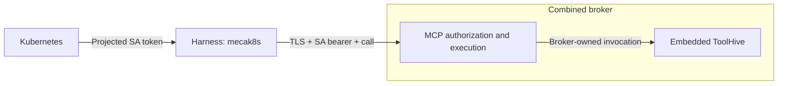
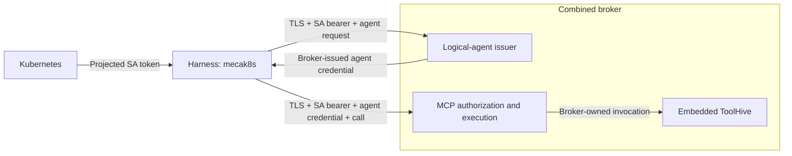
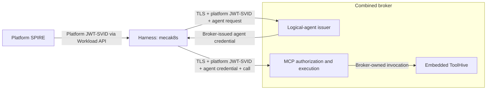
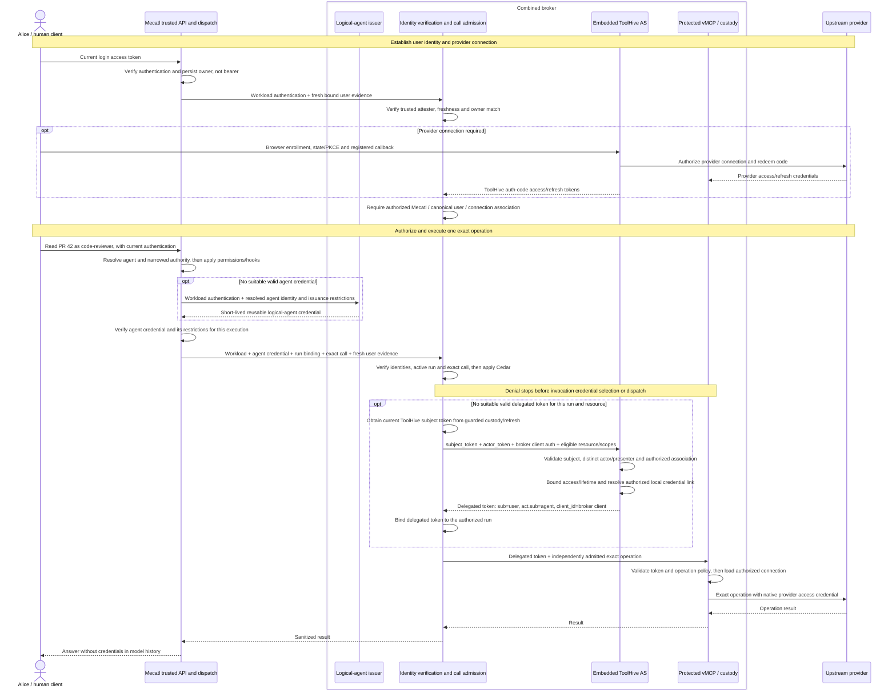

# Agent authority: user journey and trust boundaries

This page describes the **intended design**, not a delivery claim. The [implementation companion](agent-authority-implementation.md) records implementation evidence, unresolved choices and remaining work.

## 1. User journey

Alice asks `code-reviewer` to read PR 42 in `acme/payments`. Mecatl identifies the acting agent; an external broker verifies the presented evidence and applies its own policy to that exact operation before selecting credentials or dispatching. Permission to read PR 42 must not authorize merging PR 43.

The operator can inspect which user and agent were associated with the request, why the broker allowed or denied it, and its observed outcome—including an unknown outcome—without reconstructing the decision solely from Mecatl's logs. The record must survive broker restart and show which checks the broker performed itself and which identity claims it accepted from Mecatl.

**Mecatl identifies the user and agent; the broker applies its own policy to their request.** For Alice’s request, the broker relies on authenticated Mecatl to report that Alice’s login token was validated and that `code-reviewer` is acting for her. The broker checks the credentials and request against its own policy before allowing the operation. It does not revalidate Alice’s login token or treat her authenticated identity as proof that she approved this particular action.

## 2. Identity and trust model

These terms build on the [domain model](architecture/domain-model.md), not a second set of core entities.

### User identity and persisted ownership

Alice's identity is the `(Issuer, Subject)` pair represented by `session.Principal`, not her display name or email. Mecatl validates her login access token's signature, trusted issuer, intended audience and expiry. It records the principal as the session owner at creation; children and forks inherit it. Ownership enforcement prevents another caller from taking over her session.

When Alice requests an operation, Mecatl sends the broker a record of her current authentication, tied to that invocation. The broker checks that the record came from an authenticated Mecatl workload, is recent enough, and identifies the same user—by issuer and subject—as the session’s saved owner. A session owned by Alice cannot be used with Bob’s authentication record.

The saved owner tells the broker whose session this is; it does not show that Alice is still authenticated or that the operation is allowed. Those require separate checks.

Here, *owner* and *subject* refer to the same user in different contexts: Alice owns the session and is the subject of the user token. The logical-agent credential has its own subject, identifying `code-reviewer` rather than Alice.

### Logical agent, instance and workload

- **Logical agent / actor:** the agent performing the work. A named agent such as `code-reviewer` gets its identity from its resolved `AgentDef`, whether it runs as the main session or as a delegated specialist. A main session without a selected definition uses `system/main`. Neither identity represents Alice or the `mecak8s` worker.
- **Execution:** a particular run of that agent in a session. Two sessions can run the same agent with different permissions. Delegation depth distinguishes the main execution at depth zero from agents working beneath it; it does not change their logical identity. Forking or clearing a session does not, by itself, make it a delegated child.
- **Mecatl workload:** the `mecak8s` worker that authenticates to the broker. Agents running inside the same worker share that workload identity.

Effective authority and environment are context, not additional identities. Child authority is tighten-only: a definition containing write tools cannot restore writes denied to its parent. `tool.Environment` supplies a workspace and optional bound command runner, durably identified by `EnvironmentRef{Kind, ID, Revision}`. Running in Alice’s workspace does not, by itself, authorize the agent to use her GitHub account.

Authentication happens twice: `mecak8s` authenticates to the broker, then the broker authenticates to ToolHive’s token endpoint. Neither identifies `code-reviewer`—its identity comes from a separate agent credential. ToolHive checks that credential and whether the broker is allowed to present it. Each logical agent does not need its own OAuth client registration.

### Logical-agent naming and constrained issuance

An agent keeps the same identity when its prompt or allowed tools change. Its identity depends on where its definition comes from (such as the project or user configuration) and its exact name. For a project-defined `code-reviewer`, the credential's subject looks like this (`<digest>` represents the full computed hash):

```text
spiffe://agents.example.com/mecatl/agent-definition/v1/project/code-reviewer--<digest>
```

The trust domain is an identity namespace, not a broker address. Tiers—`project`, `user`, `managed`, `driver`, `system`—distinguish sources, not privilege levels. The slug is readable but not unique: `code reviewer` and `code-reviewer` can share it. The deterministic digest of tier and exact name distinguishes them. Editing tools or prompt leaves the identity unchanged; renaming or changing tier does not.

Agent identity, delegation depth and permissions describe different things. If Alice starts `code-reviewer` as her main session, it has the same logical identity as `code-reviewer` invoked as a specialist from the same definition. The specialist’s permissions are additionally restricted by its parent. Neither execution may borrow permissions from the other.

The default main agent uses `system/main` without requiring an agent-definition file. Its credential subject has this shape:

```text
spiffe://agents.example.com/mecatl/agent-definition/v1/system/main--<digest>
```

Here the digest is computed from `system` and `main`, not the user or session ID. Alice’s and Bob’s default main sessions therefore share this logical-agent identity, but not their user identity, authority, broker attachments or provider credentials. If Alice instead starts a main session using the project-defined `code-reviewer`, its subject is the `project/code-reviewer` identity shown above—not `system/main`. Selecting a named definition changes which agent runs, not the rule that every operation must satisfy the session’s authority and broker policy.

Two runs of `code-reviewer` can have different permissions. The broker checks the tools allowed by the credential attached to this call; it must not add tools allowed in another run. That tool list does not describe which files the agent can access, whether it may edit the parent workspace, or the chain of delegations that led to the call.

The combined broker has two responsibilities: its issuer signs only permitted agent identities and tool ceilings requested by an authenticated harness; its invocation component verifies presented credentials and enforces operation policy. The harness also verifies the returned credential's signature, expiry, audience, identity and tool list against its request. Public keys permit verification, not signing. These credentials use SPIFFE names and JWT-SVIDs without requiring SPIRE.

### What signatures and identity do not prove

A signature proves who issued a credential and that its contents have not changed.
It does not independently prove which agent inside Mecatl made the call. A compromised shared harness can attach `deployer`'s credential to `code-reviewer`'s call, within the credentials it can obtain or use. Keeping the signing key outside Mecatl limits forgery, not that substitution. Separate instance IDs or keys in the same compromised process provide no process isolation; a different SPIFFE name does not change this boundary.

**Identity never grants authority or proves consent.** The broker applies applicable authorization to the verified user, workload, logical agent and actual operation, not Mecatl's permission verdict. A separate signer or broker-audience claim does not turn trusted harness attestation into independent human proof. This design builds on authorization checks, not a new approval UI, opaque user-evidence platform, standing-grant store or mandate system.

## 3. Credential roles and lifetimes

The logical-agent identity is stable, but its credentials expire and are renewed. A short-lived agent credential can be reused across calls and runs while its audience, permitted presenter and any issuance restrictions still apply. It identifies the agent; it is not a one-use permission for a particular call. The same agent identity does not make credentials with different restrictions interchangeable.

Delegated access is scoped to a run: one execution started by a user request, not the whole conversation session. The run's authorization binds the user, acting agent, permitted resources and limits. A run can require several access tokens—for different resources or because an earlier token expired—but each must remain within that authorization. Changing the acting agent, including delegation to a specialist, requires an authorized actor transition rather than reusing a token that names another agent.

The broker checks the run binding and current authority before each operation, as well as admitting the exact call. Creating a fresh token at run start is not enough to prevent its use in another run. Ending or cancelling the run stops new admission and renewal under that run. An already-issued bearer can still be accepted until expiry by a recipient that does not check run status; short lifetimes limit that exposure but do not provide immediate revocation. Renewing agent, ToolHive or provider credentials does not extend the run's authority or replace required fresh user evidence.

## 4. Identity progression

At every stage the harness (`mecak8s`) is a client of one
logical broker deployment; the model does not authenticate or request credentials.
A–D concern **only Mecatl → broker**, not the separate broker OAuth client → ToolHive relationship in the interactive flow.

### A — workload-only Kubernetes ServiceAccount authentication

Kubernetes projects a short-lived ServiceAccount (SA) bearer token with the broker as audience. Over trusted TLS, the broker validates the configured Kubernetes issuer, audience and SA subject allowlist. It owns provider credentials and invokes ToolHive itself.



`code-reviewer` and `deployer` inside the same harness present the same SA identity. This restricts which harness may connect, but cannot distinguish those agents for policy. A self-declared agent name is not a substitute for B's credential.

### B — SA-authenticated logical-agent credential

B adds a harness-attested, short-lived agent credential. The broker authenticates the SA, constrains which agent identities and tools it may request, and returns a signed credential. On invocation it checks both workload and agent credentials, exact-call admission and its own policy before using provider credentials.



Operator configuration supplies accepted Kubernetes issuers, audiences and SAs, issuance limits and trusted public signing keys. Verification endpoints, CA trust and server names are never selected by a token. These are responsibilities within one broker deployment, not separate services or trust domains. Bearer credentials remain presentable by whoever possesses them; the other admission checks still apply.

### C — SPIRE JWT-SVID workload authentication

C replaces B's SA token with a platform JWT-SVID for the broker's audience, obtained through the SPIFFE Workload API and presented on issuance and invocation requests.
The broker verifies signature, audience, expiry and allowed workload SPIFFE ID.



Agent issuance and exact-call checks remain as in B. Platform identity does not replace the broker's logical-agent signing keys or create federation. Platform credential renewal and trust-bundle refresh are distinct from logical-agent key rotation. This is still bearer authentication: a stolen JWT-SVID is replayable until expiry.

### D — SPIRE X.509-SVID mutual TLS

D replaces bearer workload authentication with proof of a workload private key in the TLS handshake. The harness obtains its certificate and key through the Workload API; the broker verifies platform trust and permits only configured workload IDs.


Both broker endpoints must verify mTLS identity. A TLS-terminating ingress requires explicitly trusted identity propagation; an ordinary forwarded header is not proof.
Certificate rotation, bundle refresh and connection renewal must preserve that check, with no silent bearer fallback. D authenticates the harness, not its agents, and does not automatically bind an OAuth access token to the certificate. Neither C nor D proves user consent or isolates agents sharing a harness.

## 5. Interactive execution flow

The flow separates provider setup from admission of each exact operation. It uses an OAuth-protected upstream requiring its native provider credential, rather than a backend that directly accepts the delegated token. Operation and scope names are illustrative, not wire names.

The exchange reuses the broker's existing ToolHive authorization-code access token as RFC 8693 `subject_token`, the logical-agent credential as `actor_token`, and **separate broker OAuth client authentication**. The subject token is the ToolHive access token the broker already obtained through the user’s browser authorization flow. ToolHive validates it during exchange to establish the user identity. This reuses the broker’s existing token storage and refresh mechanism rather than introducing another credential to represent the user.

The broker must establish which ToolHive user and connected provider account Alice is allowed to use. Her Mecatl login and GitHub account can have different identifiers; matching names or identifiers alone do not establish that they belong together. The browser authorization flow protects the sign-in transaction, but does not by itself prove that the account connected in the browser belongs to the user making the Mecatl request.

Each interactive operation still requires Alice to be authenticated to Mecatl, the broker to check Mecatl’s current authentication report for that request, and policy to permit the operation. Being able to refresh a stored token keeps the connection usable; it does not authorize the next action.

### Execution sequence

The sequence shows one call within a run. Agent issuance and delegated-token exchange occur only when a suitable valid credential is unavailable; the run and exact-call checks apply to every invocation.



Before checking the operation, the broker resolves the session’s attachment and verifies that it belongs to the authenticated user and Mecatl workload. The attachment binding also identifies the broker incarnation, so a reference from an earlier broker instance cannot silently select new state. Exact-call admission is tied to this attachment.

Before allowing a call, the broker checks that the verified user matches the session owner, validates the workload and logical-agent credentials, and confirms that the workload is allowed to present that agent’s credential. It checks the requested tool against the credential’s allowed tools, then evaluates the registered target, resource, scopes or authorization details, and exact arguments.

Admission applies only to that specific call. It is bound to the broker attachment and incarnation, call ID, argument digest, invocation occurrence and expiry. The broker checks those bindings, validates the registered target and applies Cedar policy before dispatch.

If the call is paused while the user connects a provider account, the broker repeats admission checks after the browser callback. Permission to connect the account does not replace permission to perform the operation.

During token exchange, ToolHive authenticates the broker as an OAuth client. It separately checks the logical-agent credential’s issuer, signature, audience and expiry, and confirms that the broker is allowed to present it. A credential issued for admission at the broker is not automatically valid at ToolHive’s authorization server: its audience must explicitly cover that use.

ToolHive issues a delegated token identifying the user in `sub`, the logical agent in `act.sub` and the broker’s OAuth client in `client_id`. The token’s audience is the protected MCP endpoint that will receive it, not necessarily the upstream provider, such as GitHub.

These claims identify the parties and intended recipient; they do not specify or validate the exact tool arguments. The broker must still enforce its separate admission checks for the specific call.

The protected resource validates issuer, audience, expiry and bounded access,
applies operation policy and resolves only the authorized user/tenant/target's provider connection. `tsid` is a ToolHive-local credential link, outside SPIFFE's identity responsibility. It must come from validated subject and authoritative connection state, never an arbitrary external claim or caller-selected storage key.

## 6. Credential custody and safety boundaries

- **Human login bearers terminate at Mecatl's edge.** They are transient, never saved for downstream or scheduled use. Fresh harness-attested evidence is not the bearer, a stored owner, an attachment or an authorization grant.
- **Agent credentials enter trusted Mecatl memory, not model content.** Client code verifies and attaches them without exposing them in arguments, results, conversation history, logs or environment variables. Model-hidden is not process-safe and does not guarantee secure memory erasure.
- **Signing authority stays with the broker issuer.** Mecatl receives signed credentials and public verification keys, never the private signing key. Issuance and invocation may be modules in one process: separate boxes do not protect against broker, host or key-storage compromise. Key rotation and verifier cache expiry bound trust in old keys.
- **Provider credentials stay in broker/ToolHive custody.** ToolHive retains,
  refreshes and injects native access credentials for the authorized connection;
  the broker holds its own ToolHive access/refresh tokens. Results contain neither
  secrets nor reusable signed requests. This does not relocate all harness
  credentials, including LLM-provider credentials. The broker runs no model-driven
  agent loop or general-purpose shell.
- **Refresh is not fresh human authentication.** A provider connection can outlive
  a login token without granting the next operation. Credential recovery is not
  canonical-user identity continuity. After restart, revalidate connection state,
  reacquire transient credentials and require fresh evidence; cached tokens and
  persisted ownership are not authority. Self-contained bearers retain a residual
  lifetime unless execution performs live checks or introspection.
- **Targets and credentials are server-resolved.** Model-chosen URLs, headers,
  issuers, audiences, scopes or credential selectors cannot redirect authority.
  Missing, malformed, stale, revoked or indeterminate evidence or authorization
  fails closed—never to an ownerless, service, broader-agent or alternate-user
  credential. Denied calls select no invocation credential and dispatch no backend
  operation; enrollment/callback traffic is accounted separately.
- **Children only narrow authority.** A malicious PR comment cannot obtain merge
  authority by requesting `deployer` beneath a read-only reviewer. A separately
  authorized top-level deployer may merge if every ceiling permits. A worktree or
  signature over a model-supplied name is not enforcement. Execution isolation must
  prevent alternate credential/network bypasses; scrubbed environments and local
  workspaces are not OS confinement, and shell logs are not exhaustive effect records.

Unattended execution requires independent authority; restoring a schedule's owner
or keeping provider offline credentials is insufficient. Interactive authentication
does not silently authorize future timer or manual fires.

A possibly dispatched operation with no recorded completion has an **unknown
outcome**, not proof that nothing happened. Never retry it automatically. Credential
recovery or a signed pre-dispatch record cannot establish whether a merge reached
the provider. Provider idempotency/status evidence can support reconciliation, but
arbitrary effects have no general exactly-once guarantee. Broker records must retain
identity provenance, exact operation, decision, dispatch and observed outcome without
secrets, correlated with harness session/run/tool-call records; knowing those
identifiers grants no authority.
