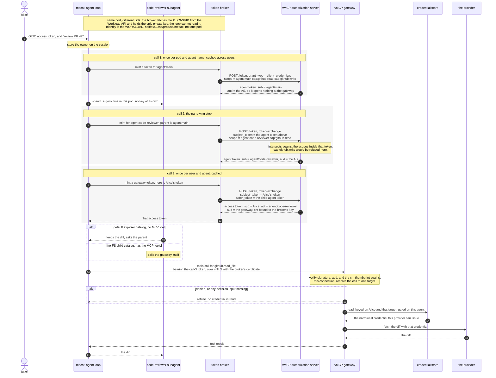

# Agent identity, part 2: the outbound hop

*Status: strawman / working draft. Speculative scoping, not a design record under
[ADR 0002](adr/0002-documentation-lifecycle.md). Companion to
[`docs/agent-identity-model.md`](agent-identity-model.md), which this takes as its premise
and does not restate. Same tier as
[`docs/scoped-resource-grants.md`](scoped-resource-grants.md).*

## What this decides

The companion doc models identity from the user down to the subagent and stops at the
boundary. This covers the boundary: how the harness reaches a tool, what the gateway
decides, and how a user's stored third-party credential gets used without handing an agent
more than it was given.

The gateway must authorize the use of a **concrete credential** for a **concrete resolved
target**. mecatl presents a short-lived delegated access token in which the user is the
subject, the agent is the actor, and the pod is the authenticated holder. The gateway
verifies it, resolves the call once, decides over that resolution, and fetches only the
selected credential after allow.

**The decisions:**

1. Four questions get four separate answers, and one answer never stands in for another:
   whose authority is being spent, which agent is spending it, which process holds the key,
   and who is accountable for the stored session or schedule.
2. A subagent can do less than the agent that spawned it, and never more.
3. What a subagent may reach has to be legible outside mecatl. How many turns it may take
   does not, and stays inside the process.
4. The gateway works out what a call resolves to once. The policy decision and the
   credential lookup both use that result, and neither works it out again.
5. No credential is read out of storage until the call has been allowed.
6. The correlation value is written to mecatl's log and the gateway's, and is read by
   nothing that makes a decision.
7. GitHub receives an ordinary GitHub token. It is never asked to understand agents,
   delegation, or anything else specific to mecatl.
8. A resumed session and a scheduled run each get authority no wider than what was granted
   before.

**Non-goals:** giving in-process children their own workload keys; making a provider verify
mecatl's delegation chain; carrying runtime budgets in access tokens; specifying OAuth
behaviour beyond the mecatl/vMCP profile.

**How to read the status notes.** Quoted blocks say what exists today. They are cost
signals rather than constraints. These codebases are built by one team and everything in them is
changeable. They stay inline rather than moving to an implementation doc because they are
what makes this checkable: two review rounds found false claims in them, and both times the
claim sounded like plumbing and was a prerequisite.

---

## Identity and token profiles

| Artifact | Subject | Actor | Holder | Verified by | Purpose |
|---|---|---|---|---|---|
| Agent token (leg 1) | agent definition | — | mecatl pod | vMCP authorization server, which also mints it | Prove which agent is acting |
| Outbound access token (leg 2) | the user | agent definition | mecatl pod | vMCP gateway | Authorize the gateway call |
| Provider credential | provider account | — | vMCP | the provider | Execute the backend operation |
| Schedule grant | the user | schedule + definition | credential store | mecatl and the AS | Permit unattended re-derivation |
| Correlation value | — | instance label | — | nobody | Join two audit records |

Terms whose outbound meaning differs from the companion model:

**Owner** — who is accountable for a persisted session or schedule, and the identity every
operation on that object is authorized against. A distinct axis from subject: owner is about
the stored object, subject is about whose authority a call spends.

**Definition and instance** — a definition is a kind of agent, named in configuration and
stable enough for policy to reference. An instance is one running occurrence, ephemeral and
unnamed in advance. Policy keys on definitions; audit records instances.

**Resolved target** — what routing determines a call to be: tool, operation, canonical
resource, and enough to select exactly one credential.

Authority, attenuation, limits and the internal tier model are defined in the companion doc.

### Named invariants

Referenced by name below rather than re-argued.

**Target binding.** Routing produces one resolution. Admission decides about that
resolution and credential selection consumes it. Nothing re-resolves in between.

**Constrain, never grant.** A binding may not let a holder reach past the authority the
credential already states. A session pointer fails this; a holder key satisfies it.

**No key below the pod, and none inside the agent loop.** Two facts, and the second is the
one that closes call 1.

Nothing below the pod holds a key. A subagent gets an identity from mecatl, real inside
mecatl's trust domain, and no private key, because siblings share a process and cannot hold
one separately.

The pod is the workload, but it is not where the key sits. A key in the agent loop's address
space is readable by a shell that loop can spawn, so the key lives in a broker process at a
uid the loop does not have. The workload identity is the pod's; custody is the broker's.

**Refuse on a missing input.** When something a decision needs is absent, whether that is a policy, a
resolved target, or an annotation saying whether a tool writes, deny rather than guess. Absent
metadata is treated as the dangerous case.

**Correlation is not authority.** Correlation values are read by logging and nothing else.

---

## The flow

Alice asks her agent to review a pull request. It spawns a code-reviewer subagent, which
needs the diff from GitHub. GitHub sits behind vMCP, which holds Alice's GitHub credential.




| Hop | Input | Action | Output | Invariant |
|---|---|---|---|---|
| 1 Bind | authenticated caller | resolve to an immutable principal | owned session | owner persisted and enforced |
| 2 Narrow | parent authority | compute a subset | child authority + limits | only authority travels |
| 3 Exchange | pod SVID; then a parent agent token; then Alice's token | three calls: name the root agent, narrow per spawn, add the user | sender-bound access token | three identities, each authenticated |
| 4 Call | access token, holder proof on the same connection | send the tool call | gateway request | correlation is not authority |
| 5 Decide | verified claims, resolved target | admission | allow or deny | refuse on a missing input |
| 6 Fetch | subject, credential selector | read one credential | provider credential | target binding |
| 7 Serve | provider credential | call the backend | result | chain stops at the gateway |
| 8 Resume | live principal or offline grant | re-derive | access token | authority never widens |

Hops 1 and 2 are fully stated by that table, with one exception each recorded below. The
rest need detail.

> **Hop 1 today.** Session creation has no owner field, and a scheduled fire constructs its
> session in-process from a leader-elected goroutine, so it never reaches anything that
> could assign one. Session listing takes no principal at all.
>
> **Hop 2 today.** There is no per-spawn narrowing at all. A
> child's tool set is resolved *statically, per definition, at build time* against the
> shared catalog; nothing reads the parent's current authority because no such value exists.
> The per-call knobs are limits and a selector for which pre-built tier to use. The audience
> tag on permission rules is a config-parse-time label on *rules*, identical for every child.
> So `Narrow` is not wiring an existing computation outward — **authority has to be invented
> as a runtime type first**, and that gates everything the gateway could enforce against.
>
> **Hop 4 today.** The inbound path reads only protocol headers and the identity struct has no
> header-populated field, which is correct and worth keeping when the outbound path stops baking
> a static header map into a client at dial time.

---

### Hop 3 — the exchange, in three calls

Three requests to the same endpoint, all authenticated by the same pod certificate. They
differ in what they carry and what comes back.

**Three scope namespaces meet here**, and conflating them is the easiest mistake to make:

| Namespace | Issued by | Example | Set by |
|---|---|---|---|
| IdP scopes | the company IdP | `agents.delegate` | Alice's login |
| our scopes | vMCP's AS | `agent:code-reviewer`, `cap:github.read` | the operator, in the client registration |
| provider scopes | GitHub | `repo` | Alice, at GitHub's consent screen |

`cap:github.read` is ours, not GitHub's. Alice's IdP token carries no `cap:*` scope unless the
AS is registered as a client at the IdP with our vocabulary, so by default her token proves who
she is and bounds nothing about capability. The capability ceiling is the client registration.

**Call 1 — which agent the root agent is.** `client_credentials`. No user is involved and none
is named in the result. Cached per pod and agent name, across all users.

```http
POST /token HTTP/1.1
Host: as.vmcp.example.com
                    # mTLS. Client certificate is the pod's X.509-SVID.

grant_type=client_credentials
&client_id=spiffe://mecatl.example.com/ns/prod/sa/mecatl
&scope=agent:main cap:github.read cap:github.write
```

```jsonc
{ "sub": "spiffe://mecatl.example.com/agent/main",
  "scope": "cap:github.read cap:github.write",
  "aud": "https://as.vmcp.example.com",   // the AS itself — opens nothing at the gateway
  "cnf": { "x5t#S256": "9f2c…" } }
```

**Call 2 — narrowing, per spawn.** The parent's agent token is the subject. The AS intersects
the request against the scopes inside it, so `cap:github.write` is refused here whatever the
registration says.

```http
grant_type=urn:ietf:params:oauth:grant-type:token-exchange
&subject_token=<the agent token from call 1>
&scope=agent:code-reviewer cap:github.read
```

```jsonc
{ "sub": "spiffe://mecatl.example.com/agent/code-reviewer",
  "scope": "cap:github.read",
  "aud": "https://as.vmcp.example.com",
  "cnf": { "x5t#S256": "9f2c…" } }
```

**Call 3 — Alice enters.** Cached per user and agent.

```http
grant_type=urn:ietf:params:oauth:grant-type:token-exchange
&subject_token=<Alice's IdP token>
&actor_token=<the agent token from call 2>
&resource=https://vmcp.example.com
&scope=cap:github.read
```

```jsonc
{ "sub": "u_01HQ8Z",
  "act": { "sub": "spiffe://mecatl.example.com/agent/code-reviewer" },
  "scope": "cap:github.read",
  "aud": "https://vmcp.example.com",
  "cnf": { "x5t#S256": "9f2c…" } }
```

**Why call 2 exists.** Without it, an injected parent picks the most privileged agent the
operator registered: it calls `Subagent(agent: "deployer")`, mecatl asks call 1 for
`agent:deployer cap:github.write`, the AS grants it because the registration lists it, and the
gateway permits the write. Nothing malfunctions — real pod, real user, registered agent,
matching policy. Call 2 removes the reward: the child derives from the parent's token, so
`cap:github.write` is not there to inherit and the agent name stops mattering.

Confirmed independently by three specifications.
`draft-sweeney-wimse-credential-delegation` §5.2 requires that capabilities in a sub-delegation
be a strict subset of the parent's. `draft-ietf-wimse-arch` §3.4.11 states that AI
intermediaries "inherit the upstream principal's security context and are expected to operate
strictly within the constraints of that delegation". RFC 8693's own scope handling does the
intersection. RFC 8693 §4.4 `may_act` does **not** help: it sits in the subject token and names
who may act *for* that subject, which is the opposite direction.

**Why call 1's audience is the AS.** A token that only functions as an input to another token
request is useless to steal. Both comparable platforms do the same — AgentCore's workload
access token is first-party-only, and Entra's intermediate is only ever a `client_assertion`
for the next call.

**mecatl holds no key whose signature carries authority.** In a single-call design mecatl signs
the actor assertion itself, so the strength of the actor claim equals the isolation of mecatl's
signing key. There is no such isolation asserted or tested: the Bash tool an injected model
drives runs in the same pod. An injected model would sign an assertion naming any agent, and
every rule keyed on `act.sub` becomes bypassable. Here mecatl signs nothing and the AS decides.

**The client id is the workload, not the pod.** `spiffe://mecatl.example.com/ns/prod/sa/mecatl`
— a namespace and service account, stable across restarts and shared by replicas. A per-pod
registration would be unmaintainable. The consequence is that all replicas share one ceiling,
which is why the root grant below is the open problem.

**One client authentication method, not two.** The SPIFFE client-auth draft offers JWT-SVID
assertion as the fallback for deployments that cannot terminate mTLS at the AS. We terminate
mTLS on the gateway call already, so using both adds a credential type, a Workload API round
trip and rotation surface for no additional security.

**`cnf` binds each token to the pod's key**, checked at the gateway against the certificate on
that connection. Without it a token copied from memory or a log replays until expiry. Note the
direction of travel: WIMSE is specifying WPT, which is DPoP-shaped, and states that WIT/WPT are
not used with mTLS. Certificate binding is the transition case.

**Call 1's ceiling is the whole registration, so the SVID must not be reachable from the agent
loop.** A shell the injected model controls otherwise performs call 1 itself, asks for
`agent:deployer cap:github.write`, and receives the pod's full registered set with no parent
token to narrow against. Calls 2 and 3 bound children; only reachability bounds the root.

Two things a shell could do, and they need different answers. It could **fetch** its own SVID
from the Workload API — closed by a SPIRE selector that pins issuance to the binary
(`unix:sha256`), which a model-spawned `/bin/sh` fails. It could **read the key out of the agent
loop's memory**, since a subprocess sharing a uid can ptrace its parent — closed only by
`unix:uid`, a uid the agent loop does not have.

So the SVID lives in a **token broker**: a separate process, at its own uid, holding the SVID
and exposing one call — mint a token for this session under this parent. Calls 1, 2 and 3 are
made by the broker, not by the agent loop. It pins the accepted peer's pid on top, so a
subprocess cannot pose as the loop, and its policy for which agent names a session may request
sits in configuration the loop cannot write.

This is not proof-of-possession machinery and it is not the SPIRE agent/server split applied
literally — the broker attests nothing and knows nothing about goroutines. It keeps one key out
of one address space, which is the whole job.

AgentCore reaches the same property by a different route: "Runtime-managed agent identities
cannot retrieve workload access tokens directly, preventing token extraction and misuse", paid
for with one agent per Runtime per execution role. A uid boundary buys it without one pod per
session.

> **Unverified.** Whether a shell in our own deployment can reach the SVID today depends on the
> registration selector being `unix:uid` and on the socket path being inherited. Neither is
> checked in our code, and the design should not rest on the answer being favourable.

> **Today, and none of it is why the design is shaped this way.** The argument above stands or
> falls on where keys sit and what the AS will refuse, which is ours to decide. What follows is
> a work list.
>
> `client_credentials` does not exist in the authorization server — it composes
> authorization-code, refresh and PKCE handlers plus the token-exchange factory. Nor does a
> per-client scope surface: `BaselineClientScopes` is one list applied to every client, so
> today granting `agent:code-reviewer` grants it to everyone and call 1's refusal never fires.
> That field is not a refinement of this design, it is its precondition.
>
> No client that may use either grant can be provisioned: registration hardcodes clients public
> and discovery advertises neither the grant nor secret-based client authentication. Both halves
> are [#6082](https://github.com/stacklok/toolhive/issues/6082), which also carries the
> non-secret option — authenticate from a verified X.509-SVID and auto-register with the SPIFFE
> ID as the client id. That option currently grants every registered scope to every client,
> which would make call 1 and call 2 vacuous, so it cannot be used as-is.
>
> The actor half is [#5815](https://github.com/stacklok/toolhive/issues/5815). It requires an
> actor token to be self-issued, which calls 1 and 2 satisfy, and additionally requires
> `actor_token.sub` to equal the authenticated `client_id`. Here `sub` is the agent and the
> client is the workload, so the check rejects. The replay attack it defends is real, and `cnf`
> defends it better: the token is already bound to the pod's key, so a leaked one is useless
> rather than merely attributable. The ask is to bind by `cnf` rather than by `sub`.

---

### Hop 4 — the call

Both child surfaces run in the same process under the same pod certificate, so the credential
is identical. What differs is which component issues the call.

The default Subagent explorer's catalog is Read, Grep, Glob and a sandboxed Bash, with no MCP
tool, so it asks its parent and the parent makes the call. The no-FS child catalog registers
the global MCP tools, so it calls the gateway itself. Either way the leg-2 token presented
names the *child* in `act`, so the narrowing from call 2 is what gets enforced.

This is a catalog boundary, not a structural one. A subagent is not architecturally incapable
of reaching the network — it has whatever its catalog was given, and the default catalog
includes a shell.

```http
POST /mcp HTTP/1.1
Host: vmcp.example.com
                    # mTLS with the same pod certificate the cnf thumbprint names.
Authorization: Bearer <the token from call 3>
X-Correlation-Id: sess-8812/sub-3/call-7

{"method":"tools/call","params":{"name":"github.read_file",
 "arguments":{"repo":"acme/widgets","path":"README.md"}}}
```

---

### Hop 5 — the gate

```cedar
entity Agent { grantedScopes: Set<String> };

permit (
    principal == Agent::"spiffe://mecatl.example.com/agent/code-reviewer",
    action == Action::"call_tool",
    resource
) when {
    resource.readOnlyHint == true &&
    principal.grantedScopes.containsAll(resource.requiredScopes)
};
```

**The rule names no backend.** Policy naming backends couples it to deployment topology and
works against the gateway presenting as an opaque toolset. The resolved target carries a
credential selector, but as something the fetch consumes rather than something policy reasons
over. A deployment wanting backend-level rules can have them; the design does not depend on
it.

**One gate rather than one per outbound path.** A check that lives in each path can be left
out of one of them, and nothing reveals the omission until someone looks. A single gate can
be wrong, but it cannot be missing from a path that has only it.

**The agent is a typed entity, not a string in context.** Comparing
`context.claim_act.sub` against a literal is stringly typed the whole way down: a policy naming
a nonexistent agent, or one whose casing or path segments drift from what the token carries,
matches nothing and reports no error. Making the agent the `principal` lets Cedar's schema
validator reject that when the policy is written rather than silently at evaluation time, and it
makes entity membership available for grouping agents.

**Set membership, not substring.** Where scope does reach Cedar as a claim, it arrives twice
over: `claim_scope` is a space-delimited string, so `like "*cap:github.read*"` also matches
`cap:github.readwrite`, while `claimset_scope` is a set with exact-element matching. Use the
set. It requires naming the claim in the authorizer's multi-valued claims, and a rule
referencing a set that was never built errors and denies — refuse-on-a-missing-input working as
designed.

**`grantedScopes` cannot be derived by Cedar.** `containsAll` does the comparison, but the value
it compares has to be written into the entity store before the decision, from the scope the
authorization server actually issued. A stale or absent value means the rule enforces nothing.
Here that value comes from the token on the request, so it cannot drift — which is the reason
the narrowing lives at call 2 rather than in policy.

**The scope test is the only comparison policy makes** — one axis, not a subset algorithm
over a schema, because definition and operation are named directly. In [later
phases](#later-phases) this becomes containment over the resolved target, which is what lets
the rule constrain *which* repository.

> **Today.** Admission is the single gate and runs before routing; the HTTP authz middleware
> is vestigial. `act` reaches policy as a nested claim.
>
> Three gaps. **The backend reaches the admission seam and is dropped before policy** — the
> tool carries it, the seam receives it, and only the name goes onward; a call to an
> unadvertised name gets a synthesised tool with no backend at all. **The read/write hint is
> absent by default** with no classifier to derive one, so a rule omitting `== true` silently
> permits unannotated tools — though per-tool operator overrides already exist in config,
> which is a cheaper lever than a new policy default. And **the resolved target does not
> exist as a value** for policy to compare against.
>
> One thing that is not simply a gap. When a primary upstream provider is pinned, the issued
> token's claims are deliberately not a claim source: in a multi-upstream chain the presented
> token's name and email belong to the first configured upstream, and using them would
> attribute one provider's identity to another. So `act` vanishes there by design. Restoring
> it reverses a provenance decision rather than fixing a bug, and needs arguing on those
> terms. An opaque upstream token falls back to request claims with a warning, so `act` does
> survive on some providers.

---

### Hop 6 — credential resolution

This doc does not say how vMCP stores credentials. It requires three things of the read.

**Read one credential, and read it only after the gate has allowed the call.** The gateway
allowed a specific call against a specific target. The credential it reads is the one that
target needs. If the target were worked out a second time after the decision, the credential
could belong to a backend the gate never saw.

This is where the scope limit either applies or does not. Call 3 issued a token confined to
`cap:github.read`. If the gateway loads every credential the user has and sends the provider a
full-scope token, that limit changed nothing about what the provider was asked to do.

**Gate the read on the acting agent, using one stored credential.** Every agent acting for Alice
otherwise reaches every integration she has connected. The fix is a read policy naming the
agent, not a copy of the credential per agent: a per-agent copy of her provider token still
carries her whole grant, so duplicating it reduces nothing while multiplying consent screens,
rotation points and revocation calls.

The reader holds a token naming both parties, but the store need only check one. Admission has
already established the user by the time the read happens, so the store's question is whether
*this agent* may reach *this integration*. A store whose policy language cannot address a nested
actor claim is therefore not a constraint here.

**The key is the user, not the token session id.** vMCP keys stored credentials on a `tsid`
claim — a login-session pointer. An agent can never carry one, for two independent reasons,
either of which alone is fatal: the claim is minted at the start of an authorization-code
flow, so a browser login produces one and an agent never walks that path; and the
token-exchange handler passes an empty session link, so any inherited one is dropped.

That gives a choice with no third option:

| | `tsid` | actor | credential lookup |
|---|---|---|---|
| Forward the user's token unchanged | present | **lost** | works |
| Exchange it for a delegated token | **dropped** | present | **dead** |

You get the actor or the `tsid` lookup, never both. This design needs the actor, so the read
keys on the user. The enterprise deployment already keys on the user, for its own reasons.

That is a consequence, not a choice. `tsid`-keyed credential injection cannot serve agents in
OSS vMCP at all, and [#5194](https://github.com/stacklok/toolhive/issues/5194) ends it for
everyone as a side effect of adding the actor.

> **Today.** Authentication middleware validates the token, takes the session pointer out of
> it, and loads **every** credential stored under that pointer into a map — before the
> JSON-RPC body is parsed, so nothing there knows what is being called. The code says as
> much: a per-backend check would need routing context this layer does not have. Afterwards
> the outbound strategy indexes that map by a provider name from static configuration.
>
> So a subagent narrowed to one repository can trigger a call to another service and nothing
> in the credential path objects, because by then that credential is already loaded.
>
> And when the `tsid` claim is absent the loader returns no credentials and **no error**. An
> agent presenting a delegated token therefore gets an empty map rather than a refusal, and
> what happens next is whatever the outbound strategy does with one — which differs per
> strategy and is nowhere stated as a contract.
>
> **Change.** Move the read to where the target is known, and key it on the user. What that
> takes is in [the work](#the-work).

**Other systems read credentials against a target they already know.** RFC 8693 requires an
exchange to carry `resource` or `audience`, so the request cannot be built before the target
is known. Envoy runs external authorization after route matching, and treats a later filter
changing the route as a privilege-escalation bug, because the decision then applied to a
different destination than the one served. Loading everything up front and picking later is
the same mistake: the component that picks is not the component that decided.

---

### Hop 7 — the backend

The backend receives a credential it already understands, for a call already authorized, and
learns nothing about agents. That is a goal: a provider has no policy about mecatl's
subagents it could apply.

It is also where the narrowing stops. The credential is whatever the user granted at connect
time, so GitHub applies its own limits and none of ours. Every constraint this design adds
sits upstream of the only party that could enforce one against the actual API call — see
[later phases](#later-phases).

**Where the chain stops.** Two reasons, and an earlier version of this document gave a third
that was wrong. RFC 8693 §4.1 requires a consumer to consider only the token's top-level
claims and the party identified as the **current** actor, so a chain is present in the token
and a conformant consumer still evaluates one hop of it — which also means policy at the
gateway may not conformantly intersect a nested `act`. And the backend never receives that
token at all: it receives a provider credential, so there is nothing there to walk.

Verifiability is therefore scoped to **the gateway** — the only place where the claimed
authority and the credential are both visible, and the only hop where refusing prevents
anything.

The claim this replaces cited §2.1's "one-time event... does not create a tight linkage between
the input and output tokens" as meaning a backend cannot reconstruct the chain. That sentence is
about lifecycle coupling between the two tokens, not about what the output carries.

> **Today, with one strategy that breaks the rule.** Four of five outbound strategies derive
> a credential without reading the inbound claims. **The AWS STS strategy reads them, and the
> read is authority-bearing**: the inbound token's claims select which IAM role the outbound
> credential assumes, and it hard-fails when claims are absent. Two strategies also forward
> the raw inbound token as the subject token when no provider is pinned.
>
> So this is not uniformly a boundary where nothing of ours crosses, and an earlier version
> of this document asserting "no change needed" here was wrong. On that path a discarded or
> forged actor claim changes the outbound authority directly, which ties it straight to the
> claims-provenance behaviour in hop 5. Any design for `act` has to account for a consumer
> that already authorizes on claims.

---

### Hop 8 — resume

The credential expires; the authority does not. On resume it is re-derived, never wider.

**Prefer the live caller.** Someone who just authenticated is a stronger statement than a
stored row. That covers more paths than it seems: approve-after-restart arrives on an inbound
request, a resumed subagent runs under a live parent turn, a background child is run-scoped.
The only case with nobody present is a scheduled fire, which has its own grant.

**Authority must not come from a row anything can write.** If the stored record is the
authority, whatever writes the store grants authority.

> **Today.** Sessions park and resume on another pod when a shared store is configured —
> flag-gated, with the default falling back to in-memory even in the Kubernetes binary.
> Persisted state is plain JSON with no signature or MAC.
>
> The posture ladder is **not** session state and is not restored; it is applied at build
> time. What is persisted and restored verbatim is the session mode, one value of which
> relaxes edit prompting. So a permission-relevant label is trusted verbatim — the posture
> ladder is simply not that label.

---

## Scheduled execution

Alice says "check CI at 3am and fix what is broken." Two kinds of schedule, separate types,
because the failure mode is one silently becoming the other.

| | User-delegated | Service-owned |
|---|---|---|
| Owner | Alice | a service or admin principal |
| Subject | Alice | none |
| Actor | schedule + definition | schedule + definition |
| Holder | firing pod | firing pod |
| Grant | offline grant scoped to this schedule | client credentials |

**A user-delegated schedule runs as Alice.** The work is hers. A run acting as itself loses
her, which is one of the two bad options the delegation epic exists to avoid.

**That requires capturing offline access when the schedule is created.** Nothing can mint a
credential naming Alice from nothing at 3am, and no specification offers a way — every shipped system either
replays something captured at consent time or degrades to a service identity. The agent still
holds nothing of hers: the refresh token lives in the credential store, scoped to one user and one
provider, revocable. That is *safer* than the alternative that avoids storage, since a system
able to mint a user's credential at will is more dangerous than one holding a token that can
be taken away.

**Consent must happen outside anything the model wrote.** Scheduling is model-facing, so a
prompt-injected agent can create recurring work, and "captured with consent" means nothing if
the model can cause the consent. Creation produces a pending authorization; a separate
interaction the model cannot author confirms account, resources, cadence and an absolute
expiry.

**The schedule stores a signed envelope, not a token.** Verified before every fire, so
mutating the row without re-signing invalidates it, and widening needs fresh consent.

**Refresh is bounded by the schedule, not the token.** Refresh-on-use lets an unsupervised
agent extend a credential forever; refresh-on-login stops a working schedule for invisible
reasons. A schedule has an expiry its owner set, and its grant refreshes only while it lives.

**When the grant is gone, fail and surface reauthorization.** Never fall back to a service
identity — that converts Alice's job into somebody else's and makes the audit record false.

---

## What an adversary gets

| Adversary | Can | Cannot | Caught at |
|---|---|---|---|
| Prompt-injected subagent | choose tool and arguments within the credential's authority, which for now is everything the user granted the provider | change whose authority is presented, which definition is named, or what it permits — fixed before it ran | the gate |
| Prompt-injected parent | name and spawn any agent the operator registered | name an agent nobody registered, or present another user as the subject | the registration — **not** a runtime ceiling, because no value representing the parent's current authority exists (hop 2) |
| Stolen access token | attempt replay | use it without the pod's certificate | the gateway |
| Store writer, no signing key | rewrite mutable rows | forge a schedule envelope, or obtain an agent token — that needs the pod's key and a registration | verification |
| Compromised gateway | use stored credentials; alter its own audit | be distinguished from Alice by the backend | reconciliation with mecatl's log |
| Compromised pod | anything the pod may do; lie about which goroutine acted | — | accepted boundary |

**What this does not protect against.** Providers cannot verify the agent chain in the stored-credential
path. Correlation gives operational attribution, not cryptographic proof. A compromised
gateway can both abuse credentials and rewrite its own record of doing so. A compromised pod
sits inside the accepted workload boundary.

### Revocation, and why no credential names an instance

Three things can be revoked, and none of them is an instance. Removing an agent from the
client's registered scopes stops the authorization server minting for it. Disconnecting the
user's provider integration removes what the credential read would return. Ending the session
stops the run. Each is an operator or user action against a durable object.

An instance is not on that list because **an instance is a goroutine**. Cancelling it is the
revocation, and mecatl does that directly with no credential involved. A per-instance
credential would name something no party outside the pod can address, present, or revoke
independently — so it would be a credential in form and a log field in effect.

This overturns a decision recorded earlier in
`.scratch/binding-first-principles.md`, which settled on two credentials: a shared one per
user and agent kind, plus a cheap per-call token naming the individual, on the argument that
*you cannot revoke a label*. `draft-ietf-oauth-transaction-tokens` was the named mechanism, and
`draft-mcguinness-oauth-ai-agent-instance` requires revocation keyed on the individual actor.

That argument holds where instances act independently of the harness. Ours do not:
`draft-ietf-wimse-arch` §2 defines a workload as independently addressable and executable, and
a goroutine sharing an address space is neither. Attribution is what the instance layer is for
here, and `X-Correlation-Id` carries it.

*This reverses if instances stop being goroutines.* A subagent in its own process or pod is
independently addressable, at which point it can hold a key, an external party can revoke it
alone, and the two-token shape becomes correct. Until then, per-instance revocation solves a
problem this architecture does not have.

**Revocation is bounded by TTL, not by the revoking action.** Removing a grant does not
invalidate an access token already issued and still inside its lifetime. Immediate cutoff needs
the token revoked explicitly as well, and the doc's short TTLs are what actually bound the
window.

One rule adopted verbatim from the credential-broker draft: *the PDP must not evaluate
justification text for approval decisions.* Agent-authored prose must never influence a
decision — in an agent deployment that is the whole injection surface.

---

## Interfaces

Every output is the next input. Where it is not, that is a finding.

```
Hop 1   BindPrincipal(inbound)                     -> PrincipalID
        OwnerOf(schedule)                          -> PrincipalID
        AuthorizeObject(principal, object, action) -> Decision
        RootAuthority(principal)                   -> Authority

Hop 2   Narrow(parent Authority, spawn)            -> (Authority, Limits)

Hop 3   AgentToken(clientSVID, definition)         -> ActorToken   // leg 1, AS-issued
        Exchange(subjectToken, actorToken,
                 clientSVID, authority, resource)  -> AccessToken  // leg 2
        VerifyScheduleGrant(schedule)              -> OfflineGrant

Hop 4/5 Verify(accessToken, holderProof)           -> Claims
        Resolve(call)                              -> Target
        Decide(claims, target)                     -> Decision

Hop 6   Fetch(subject, target.selector)            -> StoredCredential

Hop 8   Rederive(prior Authority,
                 livePrincipal | offlineGrant)     -> AccessToken
```

`Fetch` takes no decision: the call only arrives if the gate allowed it, and target binding
means it allowed *this* target. `Narrow` returns two values because only the first travels.
`Verify` is a step of its own because issuer, audience, expiry, algorithm and holder binding
must all be checked before any claim reaches policy. `Correlation` appears in no signature —
logged, never read by a decision, which is the point.

---

## The work

Status verified against code except where marked unknown.

| Capability | Owner | State | Blocks |
|---|---|---|---|
| Provisionable confidential client | ToolHive | **missing** — registration hardcodes public clients, and discovery advertises neither the grant nor secret auth ([#6082](https://github.com/stacklok/toolhive/issues/6082)) | everything |
| External-issuer subject tokens | ToolHive | partial — validator landed ([#5814](https://github.com/stacklok/toolhive/issues/5814)) but unwired; consent model open ([#5989](https://github.com/stacklok/toolhive/issues/5989)) | any real IdP |
| Authority as a runtime value | mecatl | **missing** — tool sets are static per definition at build time; nothing reads a parent's current authority | narrowing, and anything the gate can enforce |
| Canonical user principal | mecatl | missing | multi-user anything |
| Owner enforcement on every object operation | mecatl | missing — listing takes no principal | shared deployment |
| Agent token (leg 1) | ToolHive | proposed on [#5815](https://github.com/stacklok/toolhive/issues/5815), which binds `actor_token.sub` to `client_id` and so rejects a token naming the definition. Needs `cnf` binding instead. mecatl side is a call, not a signing key | a trustworthy actor claim |
| `client_credentials` grant | ToolHive | missing — the server composes authorization-code, refresh, PKCE and token-exchange only | leg 1 |
| Definition registration at the AS | ToolHive + operator | missing — nothing registers which definitions a client may be issued a token for | leg 1 meaning anything |
| Client authentication without a secret | ToolHive + deployment | prior art exists, unmerged; carried as an option on [#6082](https://github.com/stacklok/toolhive/issues/6082). Which of the three SPIFFE methods is undecided | the exchange |
| Sender-bound tokens | ToolHive | missing, **no tracker**; method undecided (mTLS binding or DPoP) | replay resistance |
| Resolved target as a value | ToolHive | partial — backend reaches the admission seam, dropped before policy | target binding |
| Post-admission credential fetch | ToolHive | **missing** — the load happens in auth middleware | least privilege |
| User-keyed credential read | ToolHive + enterprise | partial — see below | agents using stored credentials |
| Credential-ownership recheck | ToolHive | missing — the error is declared and returned by no implementation | multi-user safety |
| Upstream subject on the identity | ToolHive | missing ([#6053](https://github.com/stacklok/toolhive/issues/6053)) — so an OAuth-only upstream cannot produce a correct Cedar principal | policy naming the user |
| Signed schedule grant | undecided | unknown | unattended work |
| Token cache | ToolHive | exists, unwired — zero importers | fan-out cost |
| Resource-level authority | ToolHive | missing, **no tracker** — `authorization_details` appears nowhere. Later phase | constraining a call to one repository |

### Order

**Agree the shared contract first** — principal, agent token, authority, target,
selector, trust relationships. Neither repository should invent these separately.

**Then the two blocking gaps, in parallel.** ToolHive: a provisionable confidential client.
mecatl: authority as a runtime value, which gates everything on that side because there is
nothing to narrow or carry until it exists.

**Then local correctness, still in parallel.** mecatl adds canonical ownership and object
authorization. vMCP resolves one target, passes it to policy, preserves verified claims, and
treats absent metadata as mutating.

**Then the exchange, leg 1 before leg 2.** Client authentication from the SVID, a
registration saying which definitions a client may be issued a token for, and agent tokens
bound by `cnf`. Leg 2 then adds subject validation and the scope intersection. Leg 1 is
testable on its own — an unregistered definition must be refused — and leg 2 cannot be built
before it, since the agent token is its actor input.

**Then move the credential read behind the gate**, rechecking ownership at the read. This is
two changes and an interface addition, not a plugin — see below.

**Then prove one slice:** Alice, **two** agents — `code-reviewer` registered read-only and
`deployer` registered to write — and one GitHub tool. Complete when `code-reviewer` cannot
obtain `deployer`'s authority: the spawn is refused, or the token it yields carries no write
scope, and no credential is read either way.

One agent is not enough to prove anything here. A single-agent run never requests a second
definition, so the interesting step never executes and the slice passes whether or not it is
guarded. Denying a call to a *different repository* is the phase-2 proof and phase 1 cannot
express it, which is the honest cost of deferring resource-level authority.

### What has to be true of the credential read

Six statements about the resulting logic in vMCP. They are what hop 6 requires; how they are
built is the next section.

1. The read takes a user and a resolved target, and returns at most one credential.
2. It runs after admission allowed the call, and uses the same target admission decided on.
3. The user comes from the subject of the verified token, not from a session pointer and not
   from a header.
4. A credential stored for one user is never returned for another. Checked at the read, not
   assumed from the key.
5. A refused call reads no credential at all.
6. A missing credential fails the call. The backend is never called without one.

Today none of the six holds. The read takes a session id and returns everything under it, it
runs in auth middleware before the body is parsed, the ownership check exists as a declared
error that no implementation returns, and an absent session id yields an empty map and no
error, so what reaches the backend depends on which outbound strategy runs.

### Getting there

**Statements 1 and 3 are an interface change.** `upstreamtoken.TokenReader` has one method: it
takes a session id and returns every credential for that session. Nothing takes a user and a
target. That method has to exist before anything else can be arranged around it.

**Statement 4 is the storage layer**, and it is the piece the enterprise deployment has
already built — a decorator that keys tokens by user. Reusable as-is for what it does. Its
authors' warning applies: how a session maps to a user has to be settled first, or re-keying
can reintroduce a cross-user path.

**Statement 2 is the one that needs a decision.** Moving the call from auth middleware to
after admission satisfies it, and leaves nothing preventing a second call site from being
added later that reads early again. That is how the current behaviour arose — the read was put
where the token was validated, which was reasonable in isolation.

The cheap way to make the ordering hold is to make the resolved target a value that only
admission can produce. If the read's signature demands one, a caller in auth middleware has
nothing to pass and the early read stops being expressible. No new machinery, and it converts
target binding from a rule someone has to remember into one the compiler applies.

**Statements 5 and 6 follow from where the read sits**, once it sits there. A refused call
returns before reaching it, and a read that returns nothing has no map to fall through — the
call fails instead of continuing with whatever the strategy makes of an empty result.

### Later phases

Each entry says what would un-defer it. A deferral with no stated trigger is a decision nobody
revisits.

**Resource-level authority.** RFC 9396 `authorization_details` carries the structured fields
that name a resource, so hop 5 tests containment over the resolved target rather than a scope
string, and the residual stated in hop 3 closes. Deferred because nothing in vMCP implements
it, because §6.1 leaves the comparison of two authorization-detail requests unspecified so the
narrowing rule would be ours to define rather than adopt, and because phase 1 is provable
without it.

*Un-defers when* a deployment needs one agent confined to a subset of a backend that another
agent may reach in full. Scope cannot express that.

**Per-agent credential isolation.** Three ways to stop agents sharing one credential. They are
alternatives, not steps — a deployment picks one — and they differ in who decides.

| | Who decides | Where the agent binds | Have it |
|---|---|---|---|
| Gate a shared credential | the operator, in policy | `act.sub`, tested at hop 5 | **yes** |
| Narrow what the provider sees | the operator, per backend | the credential handed to GitHub | no |
| One credential per agent | the user, at connect time | the stored credential | no |

The first is already here. An operator can say which agents may call which tools against a
credential all of them share.

The second is the gap worth naming plainly: **this design narrows every token except the one
that reaches the provider.** Call 3 narrows what mecatl presents to vMCP, and hop 5 decides what
mecatl may ask for, but the provider receives whatever Alice granted at connect time. Every
constraint sits upstream of the only party that could enforce one.

Whether it can be closed is a property of each provider, not of this design. Nothing can narrow
a credential it did not mint, so a stored user OAuth token is final. Some providers will issue a
credential scoped to one resource and one permission from a grant already held — an app
installation, a session with a scoped policy, an impersonation with explicit scopes — and for
those the store can derive per call instead of handing over what it stored. Which integrations
justify moving to such a credential type is a per-provider decision, and for the rest the row
stays open.

The third is where AWS and Azure both are. Bedrock AgentCore stores vault entries under the
agent identity and the user together, so a token is scoped to that pair. Entra Agent ID has no
shared vault: the agent identity is a service principal with its own delegated permissions,
consented to per agent. Atrium reaches the same place and calls the consent record a
`ConnectorBinding`. One credential per user is where we stop, not a property of the model.

*Un-defers when* two conditions hold together: a second agent that needs different authority
from its siblings, and a record of the user consenting to a named agent. The second is the
hard one. Without it there is nothing to check, and a per-agent storage key would partition
credentials by an agent nobody authorized.

**And the consent record has a shape problem no mechanism solves.** Grant records at
user-client-scope granularity are ordinary, and per-agent means per-client. But a scheduled run
has nobody present, and an absent user cannot consent. The only available pattern is an
administrator deciding in advance that consent is not required for a class of agent, which
substitutes organizational authorization for Alice's. That is a policy decision someone signs,
not a technical gap to close, and it should be named as such to whoever signs it.

**Schedules, caching and stronger attribution.** *Un-defers when* unattended work is a
requirement, when fan-out makes the per-call exchange measurable, and when an auditor needs to
attribute a call to an instance rather than a definition.

---

## Deployment requirements

What this needs from how the system is run rather than from its code. A runbook item is
weaker than a product guarantee, and it is worth being explicit about which these are.

| Requirement | Provider | Consumer | Failure |
|---|---|---|---|
| Workload API reachable at startup | SPIFFE deployment | mecatl | no credential for any session |
| A uid for the token broker that the agent loop and its shells do not have | deployment | mecatl | call 1's ceiling is reachable by an injected shell |
| A registration naming every definition that may be acted as | operator | vMCP AS | leg 1 refuses, and the agent cannot act at all |
| AS issuer metadata and keys | vMCP AS | vMCP gateway | every call fails verification |
| A client authentication method the deployment can carry — mTLS needs TLS terminating at the AS or the ingress forwarding the certificate; a JWT-SVID assertion needs neither | deployment | AS | client authentication impossible; reads as configuration, is topology |
| An mTLS path to the gateway, if holder binding is by certificate | deployment | vMCP gateway | `cnf` cannot be checked, and the token is a bearer token in practice |
| An authorization policy wherever credentials are configured | operator | vMCP admission | every authenticated caller gets every credential |
| `scope` listed in the authorizer's multi-valued claims | operator | vMCP admission | the set form is absent, and a rule naming it denies every call |
| One credential per resolved target | configuration | vMCP | an allow permits a class and the fetch picks a member, silently |
| Authenticated, encrypted state transport | deployment | mecatl | signed objects still required; state alone grants nothing |

**The gateway needs the authorization server's keys.** Both tokens are minted by that
server, and with two legs mecatl signs nothing, so there is no second trust relationship to
conflate with the first. An earlier version of this document had mecatl self-signing the actor
assertion and therefore owed the server a trust bundle; splitting the exchange removed it.

---

## Open questions

1. Which SPIFFE client authentication method: JWT-SVID assertion, X.509-SVID over mTLS, or
   WIT-SVID. The deployment cost differs; the standard requires only one of them.
2. Whether the holder is bound by certificate thumbprint or DPoP, which is a separate choice
   from the one above and lands on a different connection.
3. Whether [#5815](https://github.com/stacklok/toolhive/issues/5815) will bind the agent token
   by `cnf` rather than by subject equality. Two legs depends on it, and nothing else in this
   design substitutes.
4. Sidecar or two legs. They are alternatives for the outbound hop, and the choice is whether
   mecatl's signing key leaves the process an injected model can reach. Only the sidecar also
   protects internal-chain signing, which exists for audit rather than authority.
5. Whether leg 1's `sub` is the agent or the pod. RFC 9068 §2.2 says a client-credentials
   token SHOULD carry the client; naming the agent is what makes `act` legible to policy.
6. Definition-based or instance-based external authorization.
7. Whether per-agent consent is a product requirement, and if so who holds the record. Until
   one exists, per-agent credentials cannot be built and the user has no say in which agents
   use her connections.
8. The exact credential selector, and how uniqueness is enforced.
9. Whether the access token is a profiled JWT or opaque plus introspection.
10. Whether signed per-call instance attribution is a product requirement.
11. How ownerless legacy sessions and schedules are handled.
12. Who owns the schedule grant broker.

---

## References

- **RFC 8693** — §1.1 delegation versus impersonation; §2.1 an exchange creates no linkage
  between input and output tokens; §4.1 the closed set of top-level claims plus the current
  actor, and `act` contents restricted to identity.
- **RFC 9396** — §2.2 the field model, and that fields within one object combine as a
  product; §6.1 no standardized way to compare two authorization detail requests. Relevant to
  later phases, not phase 1.
- **RFC 8707** the `resource` parameter, which binds the issued token to one resource server.
- **RFC 8705** §3 certificate-bound tokens. **RFC 9449** DPoP, the alternative holder binding
  where mTLS is not available.
- **`draft-ietf-oauth-spiffe-client-auth`** — §3.1 JWT-SVID as a client assertion, §3.2
  X.509-SVID over mTLS, §3.3 WIT-SVID; §4 an authorization server must support at least one,
  which is why mTLS is a deployment choice rather than a requirement. Leg 1 is §3.1.2's
  example verbatim; the mTLS variant is §3.2.1.
- **RFC 6749** §4.4 the client-credentials grant. **RFC 9068** §2.2 on what `sub` carries in
  a token issued by it.
- **`draft-ietf-wimse-arch`** §2 a workload is independently addressable and executable, which
  is why a goroutine is not one; §4.5 avoid treating authentication as implicit authorization.
- **`draft-hartman-credential-broker-4-agents`** §4.2 the justification-text rule, adopted
  verbatim.

Material read but not relied on is recorded in the review notes rather than here.
