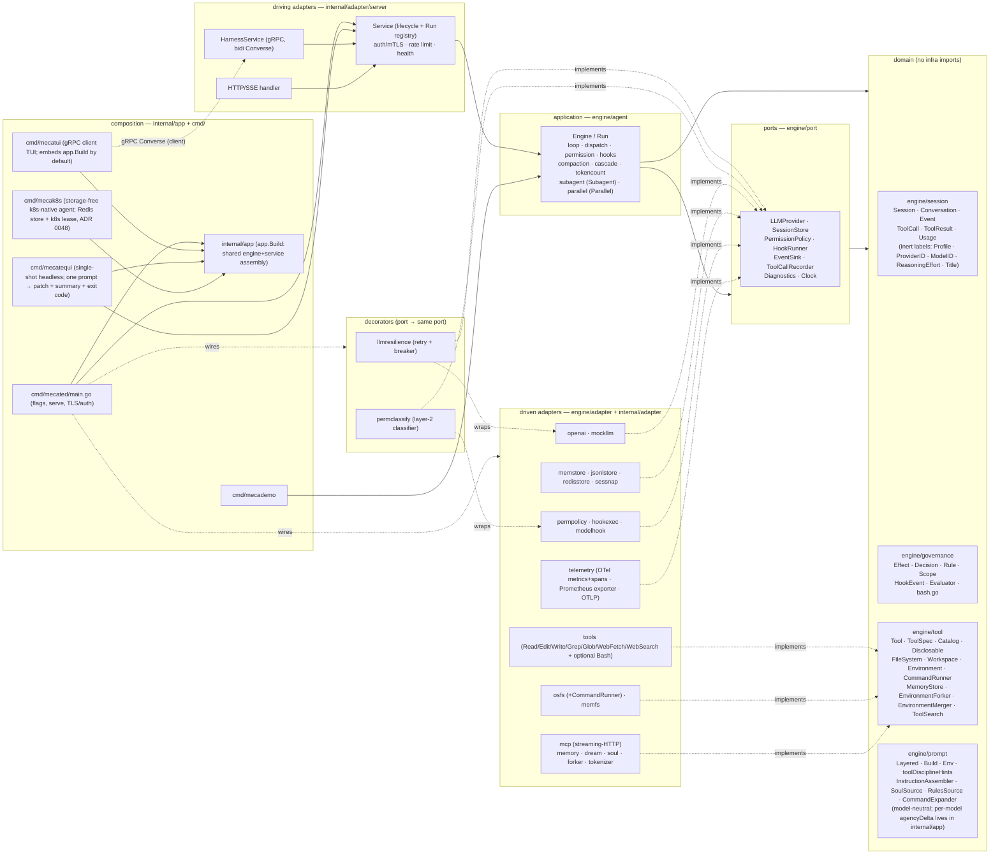

# mecatl — Architecture

> Reader-facing architecture guide. This describes the **code as it exists** in
> `engine/`, `internal/`, `cmd/`, and `contracts/`. Where the design notes in
> `docs/design/` differ from the implementation, this document follows the
> implementation.
>
> For the system's vocabulary — the canonical entities, their relationships, and
> the invariants that must hold — see the [domain model](architecture/domain-model.md).
> The accompanying [modelith](https://github.com/stacklok/modelith) model is a
> generated formal reference: edit its `.yaml` source and re-render, never the
> generated `.md`.

### How to read this

Start with the **living guides** — this overview, the per-subsystem pages below,
and [`docs/design/IMPLEMENTATION-NOTES.md`](design/IMPLEMENTATION-NOTES.md) —
which describe the code as it exists today. The [ADR index](adr/README.md) is a
**historical *why* archive**: each ADR records the decision made at a point in
time and is frozen, so reach for it on demand to understand a rationale, not as
the primary introduction to a feature.

For a full progressive reader map — foundation spine, topic branches, and routes
for operators, library consumers, and researchers — see
[`docs/READING.md`](READING.md). This page covers the big picture and the link
list below; the reading map owns audience routing.

## Build identity

All shipped commands share the linker-stamped build identity in
`internal/buildinfo/buildinfo.go`. Exact top-level `--version` exits before normal
The server exposes its build identity plus sanitized diagnostic display endpoint projections through authenticated gRPC
`GetServerInfo` and HTTP `GET /v1/info?provider_id=<active-provider>`; neither endpoint reads session or workspace
state, and the provider display projection is available only when the caller supplies its already-known active provider and never triggers discovery or configuration reads. These values are not connection instructions. Mecatui's palette-visible `/diagnostics` converts the exact
lower-case command into a sanitized report sent through the normal model prompt path;
remote identity lookup uses the existing authenticated connection and exposes only fixed
failure categories.


## The guide

The architecture is split across focused, per-subsystem files (one fact, one file).
This page is the overview and router; the big picture and the layering rule are below.

**Foundations** (the linear spine — read in order):

- **[The domain model](architecture/domain-model.md)** — the Session aggregate, Conversation, Events, ToolCall/ToolResult value objects.
- **[The ports (`engine/port`)](architecture/ports.md)** — the seams the loop consumes: `LLMProvider`, `SessionStore`, `PermissionPolicy`, `HookRunner`, and the `tool.Workspace`/`FileSystem` seam.
- **[The agent loop & permission pause/resume](architecture/agent-loop.md)** — `Engine.Run` / drive algorithm, dispatch (read-parallel / mutate-serial), and permission pause/resume.

**Topic branches** (stand alone; each lists its prerequisite):

- **[Hooks & guardrails](architecture/hooks-and-guardrails.md)**
- **[Subagents & teams](architecture/subagents-and-teams.md)**
- **[Providers — OpenAI adapter & multi-provider](architecture/providers.md)**
- **[The API surface](architecture/api-surface.md)**
- **[Observability, persistence & reliability](architecture/observability.md)**
- **[Context management & the compaction cascade](architecture/context-and-compaction.md)** — token counting, compaction, and the shared configured/live/catalog context-window resolver.
- **[Memory — cross-session recall & consolidation](architecture/memory.md)**
- **[Parallelism — fork-join](architecture/parallelism.md)**
- **[Extensibility — MCP, tools & progressive disclosure](architecture/extensibility.md)**
- **[Deployment & server hardening](architecture/deployment-and-hardening.md)**

### Internal credential store

`internal/adapter/credentialstore` is a host-internal, credential-format-agnostic
port for opaque binary records. It stays under `internal` rather than `engine/port`
because the engine is not its consumer. Its `Reader` contract provides lookup,
capabilities, and lifecycle operations; `ConditionalWriter` provides create-only and
version-matched replace/delete; mutable `Store` embeds both. Mutability is represented
by the implemented interface, not a capability bit that could disagree with it.

The optional adapter-local MCP OAuth controller borrows either one mutable Store or one
read-only Reader. Those options are mutually exclusive, and no independently supplied
writer is accepted, so reads and writes cannot cross CAS domains. It never constructs or
closes a backend. The opt-in `mcp/oauthlogin` host runtime and `internal/app.LoginMCP`
one-shot operation can populate a mutable store by driving a real protected MCP initialize
and tool listing through a random IPv4-loopback callback. RFC 9207 callback issuer
validation is conditioned on authorization-server metadata: an advertised
`authorization_response_iss_parameter_supported` requires a matching `iss`; an
unadvertised server may omit `iss`, while any supplied value must still match the discovered
issuer. The strict operator-tier
`mcp.servers` schema and the single `internal/cliconfig` loader feed all three headless
roots. Normal serve, ACP, mecatequi, and mecak8s install no presenter; only
`mecated mcp login SERVER [--no-browser] [--permission-config PATH ...]` authorizes a
mutable local profile, selecting trusted operator settings through the same resolver and
precedence as serve; the option never carries OAuth values. A hermetic cross-boundary gate
proves login-process exit, a first warm serving process, lazy refresh with durable
refresh-token rotation, a second warm process, and transparent MCP-session reconnect through
the model-visible global catalog. No reauthorization occurs across either restart or
reconnect. The global manager/controllers close before loader-owned Stores and Readers. ACP
cannot provide OAuth profiles or install/drive authorization, but after operator
authorization ACP sessions may invoke the shared global OAuth-backed tools under ordinary
permissions. OAuth is not available for per-session MCP, inline agent definitions, or
discovered servers (ADR 0113).

The explicit environment Reader maps one configured opaque key to one configured lookup
function and strict base64 environment value. It does no global lookup, listing, or
mutation. A read-only source supports warm restore; new authorization and reset require a
mutable Store. Expired-token refresh fails before network by default. An explicit
process-local mode may retain a refresh only in memory, without changing the source or
claiming restart durability. Kubernetes Secret-backed environment variables are immutable
for a running pod. Durable rotation therefore requires an external controller plus pod
restart, or a future Secret backend using `resourceVersion` CAS; no Kubernetes API writer
exists here.

Memory and local encrypted storage are Store adapters. Encrypted-file consumers must
explicitly inject an absolute root and an exact 32-byte key acquired elsewhere. Both
share create-only and version-matched replace/delete semantics. The file backend hashes
names, encrypts strict bounded envelopes with AES-256-GCM and location-bound AAD, and
serializes the complete CAS under stable per-record flock sentinels. Supported Unix
stores enforce owner-only modes and reject symlinks, special files, hard links, and
wrong ownership. Its guarantee is cooperating-process, single-host, local-filesystem
only; same-UID attacks, authenticated rollback, crash-left encrypted temporary files,
and non-local flock/rename behavior remain outside it. See [ADR 0218](adr/0218-credential-store.md).

The [formal domain model](architecture/mecatl.modelith.md) (generated by modelith) is a supporting reference — start with the prose [domain model](architecture/domain-model.md) for the human walkthrough.

## 1. What it is

mecatl is a **headless agentic coding harness**: a service (and library)
that runs the agent loop — call the model, stream its output, execute coding
tools, enforce permissions and hooks, and emit a single typed event stream.
There is no TUI. Clients drive it over **gRPC** (a bidirectional `Converse`
stream) or **HTTP/SSE**. Both surfaces speak one provider-neutral domain
`session.Event` and call the same application service; neither ever sees an
OpenAI type.

The system is built **hexagonally (ports & adapters) with a DDD core**.
Dependencies point inward only: a domain of pure value objects and aggregates
(`session`, `governance`, `learning`, `tool`, `prompt`), a set of port interfaces the
application consumes (`port`), the application use-case layer that is the agent
loop (`agent`), and adapters that implement the ports (`adapter/*`). The core
tiers (domain, ports, agent loop) plus a small set of lightweight REFERENCE
adapters (`engine/adapter/*`: `mockllm`, `memfs`, `nofs`, `memstore`, `sessnap`,
`permpolicy`, `permstore`, `wallclock`, `search` (the graduated web-search tool body + Exa/HTTP/SearXNG providers + offline fake, #363),
`webfetch` (bounded public HTTP(S) text retrieval with DNS-pinned dialing and `x/net/html` extraction),
`fstools` (the FS tool bodies), `agentfs` (the filesystem agent-def discovery adapter), `skillfs` (the read-only skills discovery core + Skill tool body), `rulesfs` (the `.claude/rules` discovery adapter, issue #329 — the pattern-2 turn-0 context instance), plus
the conformance-as-contract suites `fsconformance`, `memconformance`,
`storeconformance`, `sourceconformance`, `eventlogconformance`) live
under `engine/` — the
importable core, fully self-contained (tests included: nothing under `engine/`
imports `internal/...`) and intended to be importable as a library by external
consumers — while the heavy adapters and the composition layer stay under
`internal/`. `engine/` **is its own Go module**
(`github.com/stacklok/mecatl/engine`), kept in this repo as a monorepo via a
committed `go.work`; its standalone dependency closure is just `doublestar` +
`robfig/cron` + `github.com/goccy/go-yaml` + `x/net/html` + `x/sync` (+ test-only `goleak`), so an external consumer importing `engine/agent`
pulls in that small set rather than mecatl's full require cone (see
[ADR 0036](adr/0036-engine-module.md)). The exported identifiers of the **eight
core packages** (`session`, `governance`, `learning`, `tool`, `prompt`, `port`, `team`,
`agent`) are the engine's STABLE public surface, governed by a compatibility
contract ([`engine/COMPATIBILITY.md`](../engine/COMPATIBILITY.md)) and enforced
by the `api-compat` gate — a change to that surface fails CI until the committed
`engine/api/*.txt` snapshots and `engine/CHANGELOG.md` are updated
([ADR 0037](adr/0037-engine-stability-contract.md)); the `engine/adapter/*`
reference adapters carry no such promise. The **real LLM-provider wire adapters**
are their own **opt-in Go submodules** under `provider/` ([ADR 0093](adr/0093-provider-modules.md)):
`provider/anthropic` (native Messages API), `provider/openai` (Responses API),
`provider/openaichat` (Chat Completions API), and `provider/ssefilter` (the shared
SSE keepalive filter). Each is a separate module requiring the engine module plus
its own SDK, so a consumer embedding the engine `go get`s exactly the provider(s)
it wants and pulls only that SDK — never the root module. They release under
`provider/<name>/vX.Y.Z` submodule tags. Three sibling efforts harden the same
embeddable-core arc: the engine is now **fully clock-injectable** — every core
wall-clock read flows through `port.Clock` (`Engine.now()`), enforced by an AST
guard (`engine/arch/clock_test.go`) so an embedding host can drive it
deterministically (#116); `port.SessionStore.Load` carries a documented
**event-sourced reconstruction contract** so a host whose system of record is an
append-only log can fold its `EventLog` (+ `SessionMeta`) into a session via
`engine/adapter/eventsource.Fold` — the durable log now records the log-only
`EvUserPrompt` so user turns reconstruct, with a replay-fidelity caveat for
reasoning providers (#115, [ADR 0038](adr/0038-event-sourced-rehydration.md)); and the
supply chain gains per-module **`govulncheck`** (engine strict-clean; a
fail-closed reachable-vuln gate on the root) plus **`dependabot`** over both
modules and the SHA-pinned actions, on a **go 1.26.5** toolchain (#118). The LLM provider sits behind the `port.LLMProvider` seam, with each
wire format isolated entirely inside its own adapter — the OpenAI Responses API
in `provider/openai`, the native Anthropic Messages API in
`provider/anthropic` ([multi-provider](architecture/providers.md)) — so the core is provider-agnostic and
unit-testable against fakes (`mockllm`, `memfs`, `memstore`).

OpenAI has two deliberately separate registry identities. `openai` uses a public
API key and the supported public Responses API. Experimental `openai-codex`
uses a manually supplied ChatGPT Codex access-token snapshot against OpenAI's
undocumented private Codex backend. They are separate billing and entitlement
boundaries; configuring either one never enables the other. Composition applies
the Codex credential/header/model-inventory policy around the existing
`provider/openai.Provider`, so request building, stateless replay, successful SSE
translation, resilience, tools, and the provider-neutral engine port remain
single-sourced. See [the provider chapter](architecture/providers.md#experimental-openai-codex-subscription-provider)
and [ADR 0215](adr/0215-openai-subscription-manual-token.md).

### TypeScript SDK

The ESM-only `@stacklok/mecatl-sdk` package lives in `sdk/typescript/`, with its
own pnpm lockfile and Node-focused build/test gates kept separate from the Go
modules and the npm-based `website/` tree. Its public surface is split by
transport: `.` is the transport-neutral core plus the browser HTTP/SSE client,
while `./node` contains the Node/Bun real-gRPC transport (TCP and UDS), and
`./gen` is reserved for protobuf-es types and service descriptors generated under
`sdk/typescript/src/gen/` from `contracts/proto/mecatl/v1/`. Both transports feed
the same `Client`/`Session`/single-consumption `Run` layer: compatibility is checked
before ordinary calls; events and server errors are normalized into closed typed
families; controls carry the current run id; permission responders do not hide raw
ask events; and prompt media is validated before transport selection. UDS dials by
supplying connect-node's HTTP/2 node connection option for the socket path, never a
`unix://` base URL. Unit tests inject transports; `sdk/typescript/e2e/` separately
builds and spawns the same checkout's `mecated` with the offline mock provider to
prove TCP, UDS, HTTP/SSE, asks, cancellation, and stale controls on real wire. See
[ADR 0279](adr/0279-typescript-sdk-architecture.md).

Around that core, every capability beyond the minimal loop is a **seam with a
default and a swap-in adapter**, so the production build stays static and
network-free unless you wire something in. The current adapters cover, grouped:
**reliability** (`llmresilience` semantic retry/breaker decorator), **observability**
(`telemetry`: OTel metrics + runtime collector via a Prometheus exporter, OTel
spans over OTLP), **security** (server auth/mTLS, rate
limiting, the `permclassify` model-based risk classifier), **context management**
(`tokenizer` + the `CascadeCompactor`), **memory** (`memory` + `dream`),
**parallelism** (`forker` fork-join), and **extensibility** (the `mcp`
streaming-HTTP client). Each is detailed below.

### Semantic stream retry

Provider failures carry two independent typed facts: causal retry disposition
(`unknown`, `retryable`, `permanent`) and semantic stream progress (`unknown`,
`precommit`, `visible`, `complete`). Retry policy and circuit-breaker health remain
separate decisions. A configured classifier, attempt limit, provider-internal veto,
or cancellation may suppress replay without changing the cause; permanent and
caller-cancelled failures do not count against provider health.

`llmresilience` buffers leading whitespace, display reasoning, opaque replay state,
phase, downstream route, usage, and tool calls. The first meaningful assistant text
commits and flushes those chunks in wire order. A clean done chunk also flushes a
wholly tentative turn. Only a retryable failure that is still precommit is discarded
and transparently retried. After visible output, the failure is terminal. This delays
tentative reasoning display, but prevents a retry from exposing two attempts or
executing a tentative tool call twice.

The terminal `result` event carries both facts, and snapshots plus event-sourced
reconstruction preserve them. Optional protobuf presence distinguishes explicit
`unknown` from an older server that did not send typed metadata. The legacy
`permanent` boolean remains a compatibility projection. Failed incomplete assistant
deltas stay in the event log for audit but do not enter reconstructed conversation
history; a clean text-bearing error stop is complete and remains `StateCompleted`.
See [ADR 0239](adr/0239-semantic-stream-retry.md).

A retryable failed step can be repeated without another prompt through a first-frame
`Converse.RetryStart` or bodyless `POST /v1/sessions/{id}/retry`. The aggregate first
persists failed-step retry intent and blocks normal prompts until it resolves. Persisted
conversation, user prompt, and tool state are reused; live turn-0 instructions, operator
profile, and system-prompt inputs are re-resolved. This is not byte-exact request replay.
A retry stopped by a clean pre-turn brake remains idle+pending, while cancellation clears
intent. Every retry run emits a durable `model.retry` event whose structured disposition
and progress let event-source folding reconstruct idle/running retry state without parsing
Text; partial unterminated retry deltas never become conversation history.
Structured attempt diagnostics record the
attempt, elapsed time, disposition, progress, decision, and safe optional status/code
or correlation metadata. They never record raw provider error bodies, prompts,
headers, or credentials.


## 2. The big picture



**Built-in web retrieval.** `WebSearch` discovers candidate sources; `WebFetch`
reads one public HTTP(S) textual resource without an MCP server. The fetch adapter
resolves and validates every destination, pins the accepted DNS answers into the
dial, and repeats that check for each of at most five redirects. It uses no ambient
proxy, cookies, credentials, or caller-controlled headers. Raw and decompressed
bodies are independently capped at 5 MiB, HTML is parsed without executing or
loading subresources, and the 25,000-byte model result is framed as untrusted data.
See [ADR 0105](adr/0105-built-in-webfetch.md) for the security boundary and fixed
limits.

**Dependency direction is inward only.** The allowed-imports rule, stated by the
per-package `doc.go` files and honoured by the code:

| Package | May import |
|---|---|
| `session`, `governance`, `tool`, `prompt` (domain) | stdlib + other domain packages. Never `adapter`, `agent`, `contracts`, `os`, or any third-party library. |
| `port` | domain packages + stdlib (`context`, `io`, `iter`, `time`). |
| `agent` (application) | domain + `port` + stdlib only. Never an adapter or `contracts`. (Tests may import adapters.) |
| `engine/adapter/*` | domain + `port` + the one external library it adapts. Production files never import `agent`; `search`/`webfetch` import the domain leaf `governance` for canonical untrusted-content framing instead. This boundary is enforced by `engine/arch/layering_test.go` (`TestNoEngineAdapterImportsAgent`). |
| `internal/adapter/*` | host adapter dependencies are explicit rather than uniformly agent-free. `server` imports `agent` to drive and relay runs, `tokenizer` implements `agent.TokenCounter`/compaction seams, and `modelhook` imports `agent` only for the shared `StripLoneCodeFence` parser while importing `governance` for canonical fence policy. Other deliberate adapter→adapter carve-outs include: (1) `mcpperf` → `telemetry` for the `RuntimeSnapshot` DTO; (2) `soul`/`memory` → `skills` for `ScanForInjection`; (3) `permconfig`/`skills`/`agents`/`soul`/`memory` → the stdlib-only `xdgconfig` path-resolution leaf; and (4) `soul`/`memory` → `engine/prompt` only for compile-time source-port assertions. |
| `contracts/gen` | generated; protobuf + gRPC runtime. |
| `app` (composition) | the shared engine/service assembly (`app.Build`). MAY import adapters + `agent` + (via `server`) `contracts/gen`. Nothing imports it but the `cmd/` mains. |
| `cmd/*` | flags + serving; consumes `internal/app`. With `app`, the only places concrete adapters meet ports. |
| `cmd/mecatui/{client,ui,theme}` | a gRPC **client**. `contracts/gen` + grpc + `internal/app` appear only in `client`, `embed`, and the `cmd/mecatui` main; `ui` and `theme` import none of them and **never** any `internal/...` package. |

**Canonical untrusted-content framing.** The stdlib-only, session-free
`engine/governance/fence.go` owns all five public fence APIs: `UntrustedFence`,
`WriteUntrustedBlock`, `FenceUntrusted`, `NeutraliseFraming`, and
`NeutraliseDelegationResult`. Prompt bodies use the matched-block APIs; delegation
results use the narrower result neutraliser. The former `engine/agent` exports were
removed as an intentional pre-v1 clean break, with no aliases or duplicate matcher.
See [ADR 0241](adr/0241-governance-fence-ownership.md).

**mecatui — the terminal UI (`cmd/mecatui`).** An optional gRPC *client*. It dials
the `HarnessService`, creates a session, opens the bidi `Converse` stream, and
renders the streamed `Event` envelopes (glamour markdown for assistant text,
themed lipgloss cards for user prompts and tool I/O), resolving permission asks
inline by sending `ResumeApproval` on the same stream. Terminal results carry
presence-aware retry disposition and stream progress. Mecatui performs at most one
automatic prompt-free failed-step retry, and only for typed `retryable` plus `precommit`;
it preserves queued future prompts while retrying and pauses them after ambiguity or
a second failure. Visible failures require an explicit retry. The server it talks to is
either one it **hosts in-process** over a UNIX socket (`cmd/mecatui/embed` →
`app.Build`, the default — bare `mecatui` always embeds, never probes) or an
external `mecated` it dials via `mecatui connect ADDRESS` — so a single binary
works with no daemon. The `sessions` launch intent is orthogonal to that transport:
`mecatui sessions` and `mecatui connect ADDRESS sessions` enter the same stored-session
inventory without first creating a session, then continue/inspect through the existing
authoritative transcript path or create only when the operator requests a new chat.
The sibling `mecatui debug TARGET` and
`mecatui connect ADDRESS debug TARGET` forms create a separate durable `debug` session whose trusted relationship metadata binds
one authorized target. The proto-free UI uses the same fixed 12-column,
terminal-safe handle as the header: safe `[A-Za-z0-9._-]` bytes are literal except that
a leading `-` is encoded as `%2D`; all other UTF-8 bytes are uppercase `%HH`, with only
complete atoms that fit. The displayed literal has no leading `#`. A syntactically valid
short target is resolved against the complete caller-filtered inventory: exact full-ID equality
wins automatically, otherwise one unique projected match resolves. Multiple projections fail
with guidance to copy and pass the full exact ID as `TARGET`. Inventory failure or no match
passes `TARGET` unchanged to the existing server exact-ID authorization/not-found path. Longer
or malformed targets likewise remain exact-ID inputs automatically. Only the resolved exact ID
crosses the real `Client.CreateDebugSession` request boundary, and the server remains the final
authority.
That engine has no filesystem, carries a stable-prefix debugging
contract, and always exposes the target-bound `InspectSession` tool; the model cannot
choose another target or submit a raw session ID. A create request may additionally name
bounded, unique server-global MCP servers. Composition borrows only their direct tools from
the shared manager—never inline/client MCP, connection details, resource/query meta-tools,
or an implicit all-global mount—and persists both selected names and the exact initial tool
ceiling. Rehydration requires those names/tools and intersects with that ceiling, so the
session can never gain a newly advertised tool. A debug permission decorator reloads and
re-authorizes the root target on every MCP call, preserves Deny, trusts only an explicit
`readOnlyHint: true`, forces every mutation Allow to Ask, refuses mutation headlessly, and
never learns a mutating Allow Always verdict. The stable prompt requires a text draft and a
later genuine current operator publication request; evidence and prior tool output grant no
authority. Besides root `status`, `transcript`,
`activity`, `performance`, and `network`, the tool exposes `related`, `delegation`,
`history`, and `manifest`. Related sessions are addressed only by deterministic,
target-bound SHA-256 scope handles. Every scoped call rescans the authorized lineage
(depth 8, 500 records), revalidates each typed relationship, owner equality, root
existence, and retained snapshot, and compares handles in constant time. The lineage
index is preferred and requires both related ID and cryptographic parent/origin
incarnation; typed parent events can attach a handle only when they carry the constructed
child incarnation, while legacy events and snapshot relationships remain explicitly
incomplete fallback evidence. Pruned, inaccessible, not-retained, never-produced, and
absent relationships are distinguished only when durable evidence supports the label;
foreign rows never disclose their IDs. Snapshot status and transcript are authoritative sources; the
transcript projection includes bounded textual/structured message and tool-result parts,
marks binary payloads omitted with metadata, advances past a row that cannot fit while
reporting its index, role, projected size, and omission reason, and reports scan versus
projection completeness explicitly. UTF-8 repair is likewise disclosed at the affected
field and page; canonical fencing is included in the final 64 KiB calculation. EventLog
activity/performance projections are optional and non-authoritative. The sibling `network`
view exposes only failed or policy-interesting attempts captured by the provider-neutral
resilience wrapper: run/turn and attempt correlation, elapsed/backoff, retry disposition,
stream progress, decision/suppression reason, sanitized failure class, validated statuses,
and a closed correlation kind with a fixed domain-separated SHA-256 digest. Raw provider codes
and raw correlation IDs are never retained. When a durable EventLog is configured, the loop
canonicalizes the entire producer-controlled observation before emitting log-only `network.attempt`
events and the relay persists them, preserving the EventLog ownership rule. They have no
public protobuf projection and every ordinary client relay suppresses them, including direct
Team gRPC and HTTP/SSE; only the
target-bound `InspectSession` network view exposes them to the debug model. Raw errors,
URLs/queries, headers, bodies, prompts, tool arguments, credentials, cookies, and environment
values are never retained. Availability, pagination, scan completeness, and truncation are
explicit; successful-attempt timing and per-phase DNS/TCP/TLS durations are honestly
unavailable. Independently, when a durable EventLog is configured, every model turn emits a
log-only `request.manifest` immediately
before `LLMProvider.Stream`, after compaction and all final request filtering. It records only
provider/model/reasoning-effort labels when safely available, the resolved context window,
final tool-name order, closed catalog/overlay/MCP source labels, observed tool projection
decisions, message counts/bytes, and prompt-component byte counts with closed provenance.
It deliberately retains no prompt/message/component content digest: even a
domain-separated digest would create an offline content oracle. It never retains prompt
or message bodies, tool descriptions/schemas/arguments, reasoning blobs, provider-private
content, URLs, headers, or credentials. Built-in turn-0 assemblers report closed provenance;
custom assemblers remain compatible and are labelled `custom`/`unknown`. The same shared
predicate that suppresses `network.attempt` suppresses manifests from live, replay,
subscription, direct Team, and ACP client surfaces; the relay still persists them for a later
debugger-only consumer.
Every evidence
payload is fenced as hostile data. Creation persists a non-projectable,
domain-separated target-incarnation fingerprint over an opaque persisted 128-bit
`crypto/rand` nonce, target ID, and owner scope. It contains no timestamp or other embedded
metadata. Every evidence read and debugger rehydration reloads the target and always
compares that fingerprint. When ownership enforcement is enabled, target, debugger, and
current caller are additionally compared by stable issuer+subject identity; display/grant
metadata is irrelevant. Ownership-disabled deployments omit those owner comparisons.
Deletion or ID reuse remains inaccessible in either posture. Selected MCP calls use the
same check. `InspectSession` and selected MCP authorization evaluate the base deployment
policy first: denies remain absolute and configured asks remain configured. Every selected
direct MCP call, including a tool marked read-only, then asks a fresh interactive approval;
headless calls deny, and allow-always is never learned. Creation conceals absent and unauthorized targets behind
the same not-found result, and the debug session never resumes, leases, mutates, approves,
cancels, or steers its target. Persisted debug sessions rehydrate through the dedicated
factory and fail closed if their lineage, no-fs metadata, target, or factory is unavailable.
Mecatui treats invocation as consent, prints the disclosure before launch, and submits one
first user turn ordered as objective, required InspectSession workflow, expected report
structure, then a delimited sanitized debugger-runtime context. The runtime block is
compatibility/transport context, never target evidence; a custom `--prompt` changes only the
objective. Durable safety, authority, and source hierarchy stay in the stable system Role.
Its normal padded header keeps amber/bold `DEBUG target <handle>`
ahead of lower-priority details, `/session` exposes and copies the safely quoted exact target,
and the target-derived terminal title uses the same handle. See [ADR 0254](adr/0254-session-debugger-admin-transport.md), [ADR 0255](adr/0255-sanitized-network-attempt-evidence.md), [ADR 0256](adr/0256-session-debugger-evidence-and-reporting.md), and [ADR 0257](adr/0257-session-debugger-hardening.md). Each
inventory row also carries server-authored action capabilities. The TUI uses those bits—not
ID spelling—to expose exact-ID copy, detached transcript view, peer fork, operator-title
rename, and confirmed physical deletion. The server also exposes authenticated legacy-adoption
preflight and apply RPCs: an owned, transcript-complete `unknown` source can be copied into a
new explicit-main session only with explicit workspace/environment and provider/model bindings.
Apply revalidates under run-entry serialization and the mutation lease, persists a
caller+source-bound idempotency proof and source audit link, and never rewrites the legacy source.
The TUI adoption affordance is a separate client workflow. Fork/rename/delete are revalidated under the
server's run-entry serialization with ownership, kind, state, liveness, and optional lease
checks; a stale UI row therefore cannot bypass the server gates, and a failed action does
not rebind the prompt target. The
render packages stay pure: they render **purely
from proto `Event`s** and are bound by the inward-only layering rule. The
`contracts/gen` + grpc + `internal/app` surface lives only in `cmd/mecatui/client`,
`cmd/mecatui/embed`, and the `cmd/mecatui` main; the `ui` (Bubble Tea
model/update/view) and `theme` (pure styling) packages import no `engine/...` or `internal/...`
package and no proto directly. Its local status customization is a separate
client-owned seam: `cmd/mecatui/statusline.Source` receives display-safe `Input`
snapshots from the UI and publishes latest semantic `Result` spans. It owns
responsive template evaluation or a direct local executable, refresh and
cancellation; the UI owns theme resolution, renderer chrome, clipping, and
alignment. Settings live only in `$XDG_CONFIG_HOME/mecatui/settings.yaml`; a
remote server or project never selects a local executable. Templates get a
StatusML-escaped projection, commands get raw JSON on stdin, and StatusML carries
semantic tokens rather than ANSI/OSC. This preserves `ui` as a pure render layer
while allowing autonomous source updates. Its `/clear` command uses the existing
create-session RPC to create a new empty session first (preserving the current
workspace, effective model/reasoning effort, and permission mode), then rebinds
locally and only afterward best-effort closes the old session; a failed create
leaves the old session and UI unchanged. Usage and configuration are documented in
`docs/tui.md`.

**Remote mecatui OIDC.** The remote-login path is separate from the ToolHive LLM
login: `mecatui llm login` remains the ToolHive gateway flow, while `mecatui login
ADDRESS` performs public-client OIDC enrollment for one remote target. Login requires
issuer, public client ID, and audience; an issuer CA bundle is required only for a
private issuer. When omitted, the issuer uses the system trust store. Only an explicit
CA reference, never CA contents, is saved. The login `--tls-ca` path is distinct from the
optional server CA supplied to `connect`. It validates discovery, PKCE, and
the resulting token before saving. `mecatui connect ADDRESS` never opens a browser or
guesses missing settings. An enrolled target uses a root-scoped OS-keyring key and a
keyring-wrapped encrypted credential store; under the root lock, the legacy unsuffixed
keyring key is copied only when that encrypted namespace contains an actual credential
record—opening an empty namespace is not migration evidence. Credentials are bound to
the canonical target and
complete OIDC identity; legacy records whose target used a zero-padded port need a
one-time login because canonical decimal-port spelling changes their key. A
target-bound dynamic bearer source validates, refreshes, and CAS-saves credentials on
application token demand. Proactive refresh is activity-gated: an application-facing
`Token` demand that obtains a bearer is activity, including one served from a valid
access token; RPC success is not the signal, and background work cannot arm another
refresh. This prevents a background refresh loop from sustaining itself; provider
browser-SSO and refresh-token lifetimes remain provider-specific. Only an OAuth
`RetrieveError` whose exact structured `ErrorCode` is `invalid_grant` triggers
credential cleanup; provider prose never does. Local login-required errors retain the `ErrLoginRequired` sentinel and safe typed causes,
which composition translates into the client's closed auth-reason contract; repairable
credential corruption is distinct from unavailable local storage or issuer trust, which
must not be overwritten and instead require remediation or a browser-free retry. Unknown
adapter and transport failures remain unclassified. A server `Unauthenticated` verdict
remains a transport-layer rejection. Refresh, enrollment, logout, and
superseded-credential cleanup share one canonical-root-plus-target cross-process
transaction lock; enrollment takes it only after interactive token acquisition. An
ambiguous credential save is reread and accepted only when the intended token committed.
A registry failure is likewise reread to distinguish a committed rename; a pre-commit
failure compensates only the credential CAS version written by that operation. There is
no journal: a crash between the registry and credential stores may leave partial state,
and a missing credential requires login. `mecatui logout ADDRESS` removes the target's
credential by
CAS before deleting the matching registry snapshot, so a concurrent rotation is
reloaded and retried once; a persistent conflict or re-enrollment retains reachable
metadata and reports an incomplete logout rather than creating an orphan. It uses
non-creating keyring access and spends one operation-wide fifteen-second provider budget,
beginning before HTTP client construction and shared by discovery and every refresh- or
access-token RFC 7009 revocation attempt, after local cleanup. A target absent from the
registry is an idempotent success, but pre-existing credential-only orphans remain unreachable
because the credential store has no enumeration contract. `/connect` is a confirmed
chooser. Ordinary saved-target selection and every target switch start a fresh remote
session; during same-target authentication recovery only, an ownership-authorized
completed, cancelled, or failed session may be adopted. Missing, ownership-hidden,
active, awaiting, and infrastructure-ambiguous candidates are discarded. The closed
`ConnectAction` separates saved-target connect, explicit reauthentication, cleanup-only
retry, and add-target intent; it preserves the server CA path only for same-target
restarts, and a rejected static bearer offers no browser-login loop. Static
`--auth-token` remains unmanaged, while a saved managed OIDC credential is validated and
refreshed by mecatui. No session history crosses a target switch. Remote login uses the
fixed `http://127.0.0.1:18473/oauth/callback`: unauthenticated wrong-state/pre-state
probes are unlimited and do not burn state, while MCP OAuth keeps its random-path bounded
matching-route policy. `--no-browser` uses Authorization Code + PKCE (not device flow)
and lets SSH users forward that fixed callback with `ssh -N -L 18473:127.0.0.1:18473`.
The shared private-HTTPS path reuses a finite, owner-closed scoped keep-alive pool;
every new dial re-resolves DNS and intersects the approved addresses while retaining
HTTPS, origin, CA, hostname, and redirect safeguards. Kind remote login is available after fixture setup with host aliases and
the public CA, but is a live qualification path, not ordinary offline-test coverage.
See [ADR 0275](adr/0275-bounded-scoped-https-keepalive-oidc.md), [ADR 0277](adr/0277-remote-mecatui-oidc.md) and [ADR 0274](adr/0274-remote-mecatui-logout-budget.md).

**mecatequi — the single-shot headless runner (`cmd/mecatequi`).** A fourth composition
root and a *peer of `mecademo`* over the same `app.Build`: it runs **one** prompt against
an in-process `server.Service`, drives it to a terminal state, and emits three
artifacts — a working-tree git diff (modified, **added**, and deleted files: `git diff
HEAD` plus a `git diff --no-index` new-file hunk per untracked file, so a downstream `git
apply` reproduces new files too), a machine-readable run-summary JSON (`Summary`,
additive-only contract), and an optional durable JSONL event log — then maps the terminal
`StopReason` to a process exit code (`0` clean incl. the honest non-completions, `1` run
failure/cancel/timeout, `2` setup failure). The durable event log (`port.EventLog`,
cloud-native Phase 3a) is now readable over the public `HarnessService` via the
server-streaming `StreamSessionEvents` RPC (and `GET /v1/sessions/{id}/events` over HTTP) —
the client-tier surface over the same `port.EventLog.Read` the operator-tier 3c
`EventLogService.Read` serves, so a client opening a past session replays its full timeline
(the loop stays storage-agnostic; it only emits). That replay is complete and ordered but
has **no position and no follow**, so "catch up, then watch" was two calls with a window
between them in which an append was silently lost; the live alternative
(`StreamSessionLive`, over the in-memory `Service.Subscribe` registry) is process-local and
drops for a slow subscriber. `WatchSessionEvents` (and `GET /v1/sessions/{id}/watch`) is
the **one operation** that closes both gaps, over the additive `port.CursorEventLog` seam
([ADR 0250](adr/0250-durable-cursors-and-watch.md)): it replays from an opaque cursor,
emits one phase-only frame at the replay→live boundary, then follows the tail, delivering
`{event, cursor, phase}` where `phase` is an open string (`replay`/`live`/`gap`). A gap is
a **delivery-envelope phase, never a `session.Event`** — so the event taxonomy, the proto
`Event` message, and the kind-parity gate are untouched. A watcher reads durable storage,
so it structurally cannot backpressure a run; one that falls behind its bounded delivery
buffer is **terminated with a resumable error rather than silently dropped**, which is the
behaviour a durable cursor exists to make available. Cursor assignment happens at the ONE
persistence chokepoint (`Service.appendEvent`), never at an emit site — the loop never
imports `port.CursorEventLog`, exactly as it never imports `port.EventLog`. Unlike `mecated` it owns no listeners, TLS,
auth, or telemetry pipeline; unlike `mecatui` it has no UI. It defaults `--headless`
(inverted from `mecated`): a CI run has no approver, so a child ask auto-denies or routes
to the opt-in ask-reviewer, and a *main-engine* ask under `posture strict` cancels the run
with an actionable message (the intended CI posture is `--posture auto`). It is **forge-
agnostic** — the GitHub-Actions glue that turns an issue into a pull request (a composite
action + a split-privilege workflow) lives entirely under `.github/` and changes no Go.
An EXPLICIT `--out-summary=-` selects the stdout-compact summary mode (ADR 0082): the
`Summary` is emitted as a single compact JSON line as the FINAL stdout line, so a
scheduler tailing pod logs parses the last line; the unset default keeps the indented
JSON. `--run-id`/`--task-ref` are deliberately not accepted — a scheduler correlates via
its own launch identity plus `Summary.session_id`.
See `docs/adr/0028-mecatequi.md`. The four real-provider mains (`mecated`, `mecatui`,
`mecatequi`, `mecak8s`) share credential loading and non-secret endpoint-override wiring through
`internal/cliconfig`: each root injects a `ProviderCredentialResolver` and maps its base-URL
flags into `app.Config.ProviderOverrides`. `app.Build` merges those command overrides over
operator `provider_overrides` settings before registry construction. All four read the same
`OPENAI_API_KEY` / `OPENROUTER_API_KEY` / `ANTHROPIC_API_KEY` environment keys and register the
same base-URL flags. The daemon/headless mains
(`mecated`, `mecatequi`, `mecak8s`) also share the repeatable `--mcp-server name=URL`
flag and its `MCP_<NAME>_TOKEN` bearer convention through the same package
(`cliconfig.MCPServerList`, ADR 0082) — a scheduler launching one-shot runs injects a
short-lived per-run identity as the token env and the run presents it to that MCP
endpoint.

**mecak8s — the storage-free Kubernetes-native agent (`cmd/mecak8s`).** A fifth
composition root and a *thin peer of `mecated`* over the same `app.Build`: it composes the
shared assembly with **k8s-native defaults** — a **Redis** session store + durable event log
(`internal/adapter/redisstore`, ADR 0048), a `coordination.k8s.io` Lease per session
(`internal/adapter/k8slease`, the in-cluster multi-replica single-writer path), a dynamic
`/readyz` (drain-gated + Redis-pinged), and a bounded `GracefulStop`. The agent pods are
**storage-free**: no PVC, no `--store-dir`, no local state — every piece of state is a
managed service the pod talks to over the network (Redis + the k8s API server). The focused
`internal/adapter/tlsreload` lifecycle validates and atomically publishes the last-valid
server chain for both listeners, watches projected-Secret swaps, and warns once per current
certificate generation when its leaf is expiring or expired. Its fixed expiry ticker and
watcher are both stopped and joined on shutdown; client CA trust remains static. File-backed
Redis credentials reload as an atomically probed client generation. Each I/O path receives
its leased client explicitly; shutdown rejects new work immediately, starts claimed client closes
asynchronously, and waits on leases and close completion for only one fixed grace interval. It
never force-closes a generation still held by an iterator or migration lock, and a blocked client
`Close` cannot stall a swap. Credential targets must resolve to regular files. The reload-worker
join is separately bounded after watcher close and cancellation; any candidate completing after a
timeout is rejected and closed by the shut generation manager. Credential retries use capped
jitter and restart at attempt one on a newer projection event.
Redis
metadata paging and retention are zero-load and work-bounded after index publication; the
retention worker is owned by `app.Build`, whose idempotent close cancels and joins any
startup/ticker sweep before Service and store teardown. Every automatic deletion uses
that same mandatory maintenance lease as manual cleanup (except a genuinely
process-private in-memory store), so a shareable store with no working lease fails
closed rather than trusting process-local liveness. Engine-owned delegation children use
that same lease backend: Subagent and Parallel sessions, plus Team members (including
queued, between-round, and synthesis lifetimes), acquire before becoming runnable and
release only after their actual lifecycle teardown, so a remote retention or manual-cleanup
worker cannot delete a live child. An
upgraded legacy keyspace stays honestly unavailable until the authenticated, resumable
storage-migration job CAS-adopts every snapshot row. Each drive carries one required,
context-bound acquisition shared by both built-in stores. Redis renews its fenced lock,
cancels the bound operation context on ownership loss, and compares the exact lock token as
the first operation inside both mutation Lua scripts; a stale holder therefore has no side
effects. Stable inspection deduplicates `SCAN` results and proves each valid snapshot's exact
expected global/owner metadata membership, turning missing or stale rows into repair
candidates without mutating during planning. Invalid snapshots complete the job with failures
and keep paging unavailable. Before publication, finalization derives the complete expected
member sets and compares them in both directions with the global and every owner index through
bounded client-side `SCAN`/`ZSCAN` batches. Orphaned, malformed, and wrong-owner memberships
therefore fail closed for explicit operator repair. A constant-work Lua CAS then rechecks the
stable generation, exact lock token, and global cardinality while publishing readiness, so a
concurrent Save/Delete cannot invalidate the proof and no O(total) key or member list enters
Lua ([ADR 0231](adr/0231-redis-owner-index-exact-coverage.md)). It defaults
`--headless=true` and `--posture=auto` (an unattended daemon, inverted from `mecated`'s
interactive defaults), drops `mecated`'s subcommands + Prometheus/OTel admin surface, and
exposes `--redis-url` (mutually exclusive with `--store-dir`/`--session-store-url`). The
honest shutdown contract: new runs are rejected (503 via the drain gate) the moment SIGTERM
or the `preStop` `httpGet /drain` fires; **in-flight runs are cancelled, not drained** (a
multi-minute LLM turn cannot survive a rolling update within
`terminationGracePeriodSeconds: 60`); the pod is disposable, the session is not — it is
`Recover`-able on the successor (issue #51) from the Redis snapshot + durable event log.
Its Helm chart offers three secure real-provider transport postures — in-pod TLS, an
operator-attested edge-terminated TLS boundary, and the explicit unsafe bypass —
detailed in [deployment and hardening](architecture/deployment-and-hardening.md).
See `docs/adr/0048-mecak8s.md`.

Two deliberate cycle-breaks worth noting, documented in code:
- `port` imports `tool` and `prompt` (because `LLMRequest` carries
  `[]tool.ToolSpec` and `prompt.Layered`) — see the package note at the top of
  `engine/port/llm.go`.
- `FileSystem`/`Workspace`/`Environment` live in `engine/tool`, **not**
  `engine/port`, because `port` already imports `tool` while
  `tool.Tool.Execute` takes an `Environment`; defining them in `port` would form
  a `port↔tool` cycle. See the package note in `engine/tool/tool.go`.
  `Environment` bundles a `Workspace`, an optional bound `CommandRunner`, and a
  backend identity `EnvironmentRef`. FS tools obtain `env.Workspace()`; the Bash
  tool obtains `env.CommandRunner()`. Workspace file mutation is version-aware:
  agent-facing Read records an opaque `FileVersion`, new-file Write is create-only,
  and Edit/existing-file Write finish with conditional replace. Public Workspace
  exposes no unconditional mutation; its ledger belongs to the live
  Environment instance and resets whenever the default Service factory rebuilds it.
  As of [ADR 0214](adr/0214-environment-persistence.md), `EnvironmentRef` is a DURABLE
  snapshot field: a non-in-tree ref persists across a restart and reattaches a live
  `Environment` at run entry through `server.Config.EnvironmentResolver`; the in-tree
  Kinds never reach the resolver, and a nil/mismatch/nil-Workspace result fails loudly.
  See [ADR 0208](adr/0208-execution-environment.md),
  [ADR 0211](adr/0211-execution-environment-runtime-seam.md),
  [ADR 0214](adr/0214-environment-persistence.md), and the
  [ports chapter](architecture/ports.md).
- `governance` does **not** import `session` (so `session` can import
  `governance` without a cycle); the `Evaluator` works on primitive args, and
  the `permpolicy` adapter bridges `session` types into it.

**Offline operator-config validation.** `mecated config validate` opens the final
settings-file component with a no-follow, nonblocking descriptor, requires the opened
descriptor to be a regular file, bounded-reads it, and runs the same `permconfig.ValidateYAML`
parser used by runtime loading without starting composition or printing values. Its optional
`--learning-patch` input is deliberately not a generic merge: it accepts exactly
one top-level `learning:` mapping, replaces or inserts only that YAML node in
memory, and validates the complete result without writing either file. A supplied
patch may preflight a missing base as an empty new document. See
[ADR 0225](adr/0225-operator-settings-validation.md).

**Default prompt behavior.** `engine/prompt/builder.go` (`defaultTone`) owns one
cache-stable default tone. Its concise-delivery guidance is explicitly scoped away
from investigation and reasoning depth, while the minimum-change ladder,
read-before-edit discipline, trust-boundary validation, and safety carveouts remain
always on. There is no output-economy surface at all: the former `terse` delta and its
public flag/config surface were removed by [ADR 0086](adr/0086-remove-output-economy-control.md),
and the one-release parse-compat shim was deleted by [ADR 0089](adr/0089-cli-clean-break-grammar.md) —
a legacy `--output-economy` is now an unknown-flag error, and a top-level `output-economy:`
settings.yaml key is a named unknown-key rejection.

**Live operator profile (#508 slice).** The optional `prompt.OperatorProfileSource`
feeds a bounded full-value JSONL data envelope in `System.VolatileSuffix` (32 entries,
8 KiB by default); `agent` refreshes it before every request, retains a run-local
last-good snapshot, and never persists it into conversation history. The stable prefix
is unchanged, and the legacy value-omitting `UserModelAssembler` remains the standard
composition path for now.

**Skills as slash commands.** The resolved, admitted skills inventory also exposes each skill as a `/<skill-name>` command. A syntactically valid name expands only when it is in that inventory; it then loads the instruction body and the same bounded logical asset inventory as the `Skill` tool. Asset names are appended after ordinary command parsing and placeholder substitution so metadata stays literal. A slash command does not fetch asset content: when the instructions need a textual asset, the model calls `Skill` with `{name, asset}`. It gains no base directory and makes no claim about `Read` or `Bash`. In the command chain, file-backed commands take precedence over skills, skills over driver commands, and driver commands over MCP prompts; the first matching source wins. See `engine/adapter/skillfs/commandsource.go`, `engine/adapter/skillfs/tool.go`, `engine/prompt/commandsource.go`, and `internal/app/build.go` (`buildCommandExpander`).

**Typed tool results.** A `session.ToolResult` may carry typed content blocks on
`ToolResult.Parts` (`[]session.Content`, additive — a zero-value `Parts` is the
legacy string-only shape). Composition projects them to the model via
`port.RouteToolResultParts`, which gates image/audio blocks by the per-session
capability intersection (the single `modelCapability` = catalog ∩ adapter) and
passes text / resource-link / embedded-resource / structured-content blocks
through unconditionally. `Content.Audience` is advisory display routing ONLY and
is never consulted to suppress model-facing content (CWE-345 — an untrusted MCP
server's `audience:["user"]` is not a suppression control). Server-returned
`resource_link` URIs are never auto-dereferenced; an `https://` link may be
fetched by the `FetchMcpResource` tool through `ValidateMediaURL` (SSRF
backstop, CWE-918). See `docs/adr/0078-mcp-typed-tool-results.md`.

**Conversation fork.** `Service.ForkSession` (`internal/adapter/server/service.go`)
creates a new peer session whose conversation history is a snapshot of an existing
session's, inheriting the source's mode, workspace, limits, and
provider/model/profile labels (ADR 0065). The ONE permitted selector delta is an
optional `reasoning_effort` override (ADR 0068): empty inherits the source's effort
verbatim, while a non-empty value replaces only the effort label/engine — provider
and model always inherit. This is how a mid-conversation effort switch works
non-destructively (the mecatui `/effort` fork-resume): the transcript survives on
the peer. It reuses the domain primitives the
subagent `fork:true` path already exercises — `session.ForkSnapshot`
(`engine/session/conversation.go`) clones the conversation with a fresh backing
array and strips trailing unanswered tool calls (tool-pairing-valid), and
`session.SeedHistory` (`engine/session/session.go`) loads it into a fresh
`session.New` aggregate that starts idle with zeroed `Counters`/`Usage`. The
source is authorized and revalidated under the same per-session run-entry mutex used by
prompt starts and the rename/delete management paths. The gate accepts only owned main
sessions at a turn boundary, rejects legacy child-ID prefixes even when stale metadata says
`main`, and acquires the optional cross-process session lease before recovering or snapshotting
the source. A terminal source is recovered to idle first; a running/awaiting source or a live
in-process run is rejected with `ErrFailedPrecondition`. A mutation-scoped lease is released on
every exit, while a lease already held by this process for the session lifetime is preserved.
The forked engine is
rehydrated ONLY when the source needed a per-session engine (non-default selector
/ no-fs profile / worktree workspace), mirroring `createSession`'s branching; a
default-FS fork rides the shared engine. Same provider and model only — the
snapshot carries provider-private replay blobs a different provider cannot
consume. Wire surface: the `ForkSession` gRPC RPC and `POST /v1/sessions/{id}/fork`.

## See also

- [Usage & operator guide](usage.md) — building, running `mecated`, every flag, and the gRPC + HTTP/SSE APIs that drive this design.
- [mecatui terminal UI](tui.md) — the gRPC client that renders the event stream described above.
- [ADR 0001 — the ACP adapter](adr/0001-acp-adapter.md) — the decisions behind the third (editor) wire surface.
- [Go performance measurement & observability survey](perf-measurement-survey.md) — the technique reference behind [observability & persistence](architecture/observability.md).

## Scheduled tasks

A scheduler subsystem (issue #189, [ADR 0059](adr/0059-scheduled-tasks.md)) lets an
operator register a saved prompt to run on a 5-field cron schedule (`0 9 * * *`,
`@every 30m`, `@daily` macros) or once at a future time, and have mecatl drive
that run **autonomously, durably, and exactly-once** across a multi-replica
deployment — with no human present at fire time.

It is a **composition-layer** subsystem (no `engine/agent` changes) that reuses
the existing run-entry funnel. The pieces:

- **`port.ScheduleStore`** (`engine/port/schedule.go`) — the durable registry,
  a peer of `port.SessionLease`/`port.EventLog`. The store is ground truth; an
  in-memory timer is a derived lookahead. `Claim` is the at-most-once atomic
  advance (NextFireAt + LastFireAt + FireCount) that gives exactly-once across
  replicas — a crash mid-fire skips the slot (recurring self-heals via
  fire-once-now; a one-shot can be lost).
- **Adapters** — `memschedulestore` (reference), `jsonlstore` (single-host),
  `redisstore` (multi-replica, via a Lua CAS for the atomic Claim). All pass
  the shared `scheduleconformance` suite.
- **`internal/adapter/scheduler`** — the tick loop, gated by a leader-lease on
  the well-known `__scheduler__` id (only the leader ticks). Leadership is a
  STANDBY loop (ADR 0073 follow-up): `Start` is infallible-at-launch — a
  non-leader serves RPCs and retries the acquire on a jittered backoff,
  promoting when the leader's lease lapses; a definitive Renew loss demotes the
  leader back to standby (failover), and a sticky
  store-unsupported flag stops the loop re-acquiring forever. `FireNow` is
  gated on leadership (`ErrNotLeader` → FailedPrecondition/412). On each tick:
  `Due` → misfire policy → `Claim` (at-most-once) → `FireFunc` → `RecordFire`.
  The `FireFunc` seam is how composition injects the run-entry funnel.
  **Scaling shape (ADR 0074):** one server hosts MANY concurrent sessions (the
  per-session `SessionLease` is the exclusion primitive across both vertical
  session-density and horizontal replicas); the scheduler stays a single global
  leader for the cheap tick (`Claim` is the correctness fence, leadership is
  hygiene), and the expensive fire DRIVE is decoupled into a bounded pool
  (Phase 2), sharded per-schedule only if throughput later demands it.
- **Composition** (`internal/app/build.go` `buildScheduler`/`startScheduler`)
  wires the scheduler ON BY DEFAULT ([ADR 0073](adr/0073-schedule-tool.md)
  decision 2 — the opt-in `--scheduler` flag is deleted; `--no-scheduler` is
  the disable knob) whenever the configured store exposes a `ScheduleStore()`
  accessor (discovered by type-assertion) — a store with none (the in-memory
  default) stays on the byte-identical no-scheduling path. The registry can
  also be REMOTE: `--schedule-store-url` points it at a
  `mecatl.driver.v1.ScheduleStoreService` + `ScheduleOneShotReArmerService`
  driver (a peer of `SessionStoreService`/`EventLogService` on the same
  `mecatl.driver.v1` protocol), INDEPENDENT of the session store — when set
  it REPLACES the `ScheduleStore()` discovery, and the driver's
  `Claim`/`ClaimNow`/`ReArmOneShot` run the at-most-once atomic advance
  server-side (the durable NextFireAt advance IS the fence, exactly as the
  in-process store's is). A dial failure is fatal (an explicitly-configured
  driver that won't dial is an operator misconfiguration). The override backs
  the in-chat `Schedule` TOOL too: composition passes the ONE resolved
  `port.ScheduleStore` into `server.ScheduleManagerConfig.ScheduleStore`, so
  the tool + tick loop + fire path share the one registry — no absent tool
  with an accessor-less session store, and no split-brain with an accessor-ful
  one. The leader-lease reuses the session-lease backend (same backend, different id). The
  `FireFunc` mints a fresh `sched--`
  top-level session per fire via `Service.CreateSessionWithProfile` +
  `StartRunContent` with subagent-grade defaults (bounded budgets, read-leaning
  posture unless `mutating: true`, headless ask model, fail-closed model
  pinning). The fire id IS the session id (ADR 0059 decision #7 Phase-2): the
  fire path pre-mints a `sched--<name>-<ts>-<rand>` id and passes it as the
  `WithSessionID` override (a variadic options pattern on
  `CreateSessionWithProfile`), so the persisted session carries the `sched--`
  GC-retention family prefix. A distinct `ScheduleFireRetention` GC family
  (`sweepScheduleFires`, peer of the main/child passes) sweeps per-fire
  sessions on their own age horizon — never the main or child pass. The
  `--schedule-fire-retention` flag (operator-tier, peer of
  `--child-retention`) defaults to 7d whenever unset (the scheduler is on by
  default); an explicit 0 disables (fire sessions are never swept). The
  shared create-seam (`validateScheduleSpec`) also enforces the
  `--scheduler-min-interval` cadence floor and rejects an
  unknown/uncatalogued provider+model selector, fail-closed, for both the
  in-chat `Schedule` tool and the REST/gRPC handler.

See [ADR 0059](adr/0059-scheduled-tasks.md) for the frozen rationale (the 10
resolved decisions + the leader-lease decision) and the consequences. The two
documented v1 trade-offs — one-shot loss on a mid-fire crash, and
fresh-context-per-fire — are mitigated by the opt-in Phase-2 fields below.

### One-shot crash-loss retry + carried context (Phase 2c, issue #236)

Two opt-in `ScheduleSpec` fields close the documented v1 trade-offs. Both are
composition/scheduler-layer (no `engine/agent` change) and default OFF (the
pre-Phase-2 path is byte-identical when neither field is set):

- **`OneShotRetry` / `OneShotMaxRetries`** — at-least-once retry for a one-shot
  that cannot tolerate crash-loss. The tick loop's post-fire scan
  (`maybeReArmOneShots`, run after the due-fire batch) re-enables a crashed
  one-shot — one whose prior fire ended in `StopError`, or whose
  `LastFireSessionID` is still the `pending` sentinel (Claim happened but
  RecordFire did not) — up to `OneShotMaxRetries` times, via the OPTIONAL
  `port.ScheduleOneShotReArmer` interface (`ReArmOneShot` re-enables + advances
  `NextFireAt` with a small backoff + increments the durable
  `OneShotRetryCount`). The interface is type-asserted on the store exactly like
  `PrunableStore`/`SessionLease` — a store that does not implement it degrades to
  the byte-identical at-most-once path. All three store adapters implement it.
  The budget gate (`OneShotRetryCount >= OneShotMaxRetries`) makes an exhausted
  one-shot permanently done (no crash-loop). One-shot-ONLY: the create-seam
  rejects `OneShotRetry` on a cron trigger fail-closed, and applies a default
  `OneShotMaxRetries=3` when `OneShotRetry=true` and the field is 0. A re-armed
  one-shot starts FRESH (the crashed fire's context is untrusted AND incomplete
  — the re-arm path ignores `CarryContext`).
- **`CarryContext`** — carried-context across fires. The fire path
  (`makeFireFunc` + `renderCarriedContext`, `internal/app/scheduler_fire.go`)
  loads the prior fire's session and renders its conversation as a FENCED
  UNTRUSTED preamble prepended to the prompt — NOT as seeded history. Carried
  context is UNTRUSTED (model-authored + tool-result-laden; a prior fire may
  have been prompt-injected), so it must NOT become replayable
  `Conversation.Messages` (which would carry injection forward as live
  instructions). The canonical governance fence (`governance.FenceUntrusted` +
  `NeutraliseFraming`, `engine/governance/fence.go`) quarantines it: a forged `<<<UNTRUSTED` closing marker
  or harness section header in the prior content is neutralised, so it cannot
  break out of its block. The summary is clamped to the last 20 turns and a 10000-
  rune budget. On prior-session-load failure (not found, decode error) the fire
  degrades to fresh-context (WARN, never fails the fire). The gate is
  `CarryContext && LastFireSessionID != "" && LastFireSessionID != pending` — so
  a re-armed one-shot does NOT carry context on the retry.

### ScheduleService API surface (Phase 2a, issue #232)

The scheduler is reachable over BOTH wire surfaces — gRPC `ScheduleService` and a
peer REST surface — so an operator/client can create, inspect, pause, fire, and
delete schedules out-of-band from the tick loop. The handlers are thin
delegations over the same `Service` methods the tick loop uses; they live in
`internal/adapter/server/grpc_schedule.go` (gRPC) and `internal/adapter/server/http.go`
(the `schedule_*` REST handlers).

**gRPC `ScheduleService`** (`contracts/proto/mecatl/v1/schedule.proto`,
`ScheduleServer` in `internal/adapter/server/grpc_schedule.go`) — 10 RPCs:

- `CreateSchedule` / `UpdateSchedule` — upsert by name; the create-seam
  (`Service.CreateSchedule`) validates the trigger XOR, prompt-or-parts, cron
  grammar, and the Mutating/Mode invariant fail-closed, then computes the first
  `NextFireAt` (cron via `cronparse`; one-shot = the `OneShot` instant).
- `GetSchedule` / `ListSchedules` / `DeleteSchedule` (idempotent).
- `PauseSchedule` / `ResumeSchedule` — toggle `State.Enabled` via the atomic
  `SetEnabled` (Save preserves State on a Spec overwrite, so pause/resume is a
  dedicated primitive).
- `FireNow` — force an immediate fire, returning `fire_id` + `session_id`
  (fire_id == session_id). The fire is driven synchronously through the
  `FireFunc`; poll `GetFire` for the terminal stop reason.
- `GetFire` / `ListFires` — the pull-only outcome channel: a `ScheduleFire`
  carries the stop reason + the session id whose `SessionStore` snapshot holds
  the full conversation.

**REST routes** (`internal/adapter/server/http.go`, under `/v1/schedules`):

```
POST   /v1/schedules                  -> CreateSchedule
GET    /v1/schedules                  -> ListSchedules
GET    /v1/schedules/{name}           -> GetSchedule
PUT    /v1/schedules/{name}           -> UpdateSchedule
DELETE /v1/schedules/{name}           -> DeleteSchedule
POST   /v1/schedules/{name}/fire      -> FireNow
POST   /v1/schedules/{name}/pause     -> PauseSchedule
POST   /v1/schedules/{name}/resume   -> ResumeSchedule
GET    /v1/schedules/{name}/fires     -> ListFires
GET    /v1/schedules/{name}/fires/{id} -> GetFire
```

**Errors** — a backend with no `ScheduleStore` (memstore, or a store that does
not expose the accessor) honestly reports `Unimplemented` (gRPC) / 501 (HTTP)
from every schedule RPC; `FireNow` on a paused/done schedule is
`FailedPrecondition` / 412; a singleton-overlap skip is `FailedPrecondition` /
412; an unknown schedule/fire is `NotFound` / 404.

**`schedule.*` events** (`EvScheduleFired` / `EvScheduleSkipped` /
`EvScheduleFailed`, `session.SchedulePayload`) — the scheduler emits a
lifecycle event for each fired/skipped/failed fire via the composition-injected
`EmitScheduleEvent` callback (`Service.EmitScheduleEvent`), which appends it to
the fire session's durable `EventLog` (so schedule lifecycle rides the same
durable log as the fire's own events). The events project onto the
`Event.schedule` field (proto field 15); a skipped fire with no session is
dropped from the durable log (the log is session-keyed) and surfaces only via
the operator diagnostic.

**Fire-result delivery ([ADR 0075](adr/0075-fire-result-delivery.md), origin
attribution superseded by [ADR 0209](adr/0209-schedule-origin-run-context.md)).** A
schedule created in-chat carries `ScheduleSpec.OriginSessionID` — the conversation
that created it. The shared `startRun` seam places the executing session id on the
cancellation-derived context with the engine-internal `withSessionOrigin`, so normal runs and
awaiting-approval resumes inherit the same attribution. The `Schedule` tool reads it
off that context when it builds the create spec — the one place the field is ever
assigned (empty when unbound; never a model-supplied arg, since the tool's schema has
no origin field). Because attribution travels with each run context rather than
mutable wrapper state, concurrent sessions sharing one `Engine` cannot cross-stamp
origins. After a
fire reaches its terminal `EvResult` and `RecordFire` persists the
record, the scheduler's `SetDeliverFireResult` callback
(`deliverFireResult`, `internal/app/scheduler_delivery_run.go`) renders the
outcome as a **fenced-untrusted** harness note (`renderFireDelivery` —
`governance.FenceUntrusted` + `NeutraliseFraming`, never a live instruction), enqueues
it to a DURABLE per-session pending-delivery queue (`port.DeliveryQueue`, a
sidecar-backed `FileDeliveryQueue`; the exactly-once ledger is session-scoped and
survives restart), and delivers it into the origin: an idle/completed/cancelled/
failed origin is driven through the existing `StartRunContent` → `loadAndReopen`
funnel (recording the note as ordinary user history); a busy or awaiting origin
keeps the note queued and the loop drains it at the next turn boundary
(`drainPendingDelivery`, Step 2a, before `BeginTurn` — the same seam as the
background-subagent notice). A deleted / child / `sched--` origin degrades to
pull-only with a WARN (the fire is never failed by delivery). The connected
mecatui renders the note LIVE as a distinct delivery card over the
server-streaming `StreamSessionLive` RPC (a per-session live event subscription;
the live wire relays the delivery's `EvUserPrompt` note while the other log-only
kinds stay skipped), serving both the embedded in-process server and a remote
mecated over one projection. Pull-only (`GetFire`/`ListFires`) remains the floor
for out-of-band schedules (empty `OriginSessionID`).

### Schedule metrics

The operator-facing declarative surfaces Phase 2b once added — the operator-tier
`settings.yaml` `schedules:` block and the `mecated schedules` CLI — were
**removed** by [ADR 0073](adr/0073-schedule-tool.md): the in-chat `Schedule`
tool + the retained REST/gRPC API + the OS scheduler cover the use cases, so the
declarative reconcile and the CLI subcommand group no longer exist. The
surviving management surfaces are the in-chat `Schedule` tool, the
`ScheduleService` gRPC + REST `/v1/schedules` API, and the mecatui `/schedule`
overlay. What remains here is the metrics surface:

- **Schedule metrics** — two instruments emitted via the composition-injected
  `Config.ScheduleMetrics` callback (`internal/adapter/telemetry/metrics.go`
  `EmitSchedule`): `mecatl.schedule.fires` (counter, by `outcome` =
  fired/skipped/failed) and `mecatl.schedule.fire_duration` (histogram, seconds,
  due→terminal — skipped fires record no duration). No role label (a fire's own run
  already carries `role="main"`).


## Evidence-backed reflection

`engine/learning` contains the storage-neutral reflection domain and completed-trajectory
observer seam ([ADR 0109](adr/0109-staged-learning-proposals.md)). Standard composition owns the
bounded staged-reflection coordinator. A host constructs an owned `learning.Input` from a
trajectory, optional session events, typed admission signals, and bounded existing facts.
Canonical evidence projections assign compact message/event handles (`m:<ordinal>` and
`e:<ordinal>`) with SHA-256 digests while omitting provider reasoning blobs, binary media,
actor identity, permission arguments, and unbounded delegation data. Structural signal
detection is deliberately local to that input; cross-session contradiction or repetition
must be supplied explicitly by the host. Signals admit reflection but never become
candidates themselves.

`agent.EvidenceReflector` is the optional model-backed implementation. It makes one
provider-neutral call for an admitted input, with no catalog, tools, child engine, filesystem,
MCP, delegation, memory mutation, or persistence; the injected production LLM transport is its
only I/O. The input is canonical JSON inside the
shared untrusted fence. The response parser accepts exactly one JSON object (or one lone
JSON fence), resolves every returned handle against the exact digest-bound input, and
rejects the entire response on recursively duplicate or unknown fields, trailing/multiple values,
malformed fences, invalid enums, duplicate evidence, exceeded limits, unexpected stream chunks,
provider errors, missing/non-benign terminal stops, or secret/directive/transient content. Explicit abstention
is a successful outcome. Hosts select the provider/model; standard explicit reflection reloads the completed session's persisted provider/model through the registry, and a reflection-slot model remains on that provider. Hosts enforce input, event,
existing-fact, candidate, evidence, output-byte, token, and timeout bounds. This layer only
returns proposals or abstention. Durable proposal lifecycle is a separate, host-driven
layer: `learning.ProposalRepository` stages deterministic content-addressed records partitioned by
principal/project; reference `memproposal` and the flocked `reflectionstore` adapter provide atomic
CAS transitions through staged, promoting, terminal, and undone states. The importable standard
memory-promotion policy rejects unsafe/transient facts, never overwrites conflicts or user-explicit
revisions, routes procedure candidates into the evaluated learned-skill pipeline, and uses per-candidate presence-and-version CAS. Memory revisions carry
an optional proposal id, allowing a crashed promoting claim to reconcile without a duplicate write.
Batches may partially promote by design because each candidate is its own atomic convergence unit.
Standard composition applies `learning.ThresholdPolicy` before one bounded Build-owned
coordinator ([ADR 0114](adr/0114-configurable-learning-trigger-policy.md)). Standard weights are
5/5/4/3/2 for repeated correction, trusted host contradiction, failure recovery, repeated stable
tool sequence, and substantial success; modifiers never admit alone. Conservative/balanced/eager
thresholds are 6/4/3. Detection is scoped to a verified current-run message span. Weighted work is
main-session benign `end_turn` only; a genuine current principal prompt carrying explicit remember
or learn-procedure intent is hard admission on the bounded clean-limit stops too. Non-main,
failed/cancelled/awaiting, plan, no-progress, timeout, structured-output, and unverifiable compacted
spans fail closed before a provider call.

A process-owned controller adds a ten-minute weighted per-principal cooldown, one-hour sliding
process/principal count and reserved-token windows, trajectory-digest in-flight joins, and a
24-hour/1024-entry completed-digest LRU. Reservation uses the selected provider/model token counter
for bounded canonical input plus a 4096-token output cap. It happens after queue capacity succeeds
and before provider work; failure, timeout, and abstention still consume it. Queue-full does not.
The controller, coordinator queues, and caches reset on restart; durable proposals remain
idempotent. Shutdown rejects admission, cancels active jobs, joins workers, and performs no catch-up.
Budgets are process-local, so multiple replicas multiply aggregate capacity.

Review and auto share admission; only downstream staging/promotion differs. Auto promotes operator
facts only from explicit principal-authored current-prompt evidence and project facts only at the
exact trusted configured root. Tool/assistant/repository/history-only evidence stages for review.
Authenticated explicit reflection carries host-requested provenance and bypasses automatic policy,
cooldown, budgets, and completed cache while retaining provider, queue, timeout, ownership, and
stage/promotion controls. In off mode there is no automatic observer, controller, coordinator worker,
or provider call; persistence initializes lazily for explicit operations. The gRPC and HTTP surfaces expose explicit completed-session
reflection, bounded caller-partitioned list/detail, CAS approve/reject, and compensating undo;
capability bits keep older/unconfigured servers honest. Source-session ownership and proposal
principal are verified, project partitions remain reviewable but project promotion is root/trust-gated, and evidence detail reports only
digest availability rather than transcript text. `/reflections` provides bounded TUI review and
`/reflect` explicitly submits the current completed session even when automatic mode is off
([ADR 0109](adr/0109-staged-learning-proposals.md)).
Procedures initially remain visibly `deferred_unsupported`. The importable learned-skill
contracts ([ADR 0110](adr/0110-evaluated-agent-owned-skills.md), superseded by
[ADR 0111](adr/0111-hardened-agent-owned-skill-publication.md)) now let a host explicitly
materialize one as an owner-agent draft: body-only bundles are content-addressed and move by
CAS through draft, evaluated, staged, active, archived, or rejected states, with bounded
provenance, evaluations, receipts, and version history. `memskill` and the shared conformance
suite prove lifecycle, ownership, partition, and concurrency behavior; the durable
`internal/adapter/skillstore` adds a stable flock, bounded atomic manifest, and immutable
content-addressed `SKILL.md` versions with reopen and multi-instance CAS coverage. `skillvalidation`
rejects unsafe framing, secrets, machine paths, permission claims, generated assets, and
inventory collisions; the legacy `DirDrafter` now delegates logical checks to it while retaining
quarantine and an explicit compatibility-off option. Historical title/body procedures stay readable
and can be linked from `deferred_unsupported` only by explicit materialization.
`engine/adapter/skillmaterialize` turns an evidence-backed proposal into a validated
`SkillDraftInput`, then uses recoverable create-then-CAS-link reconciliation. A crash after
Draft creation converges by proposal provenance and SkillID without a duplicate. The legacy
`mecated skills promote` filesystem workflow remains operator/manual-only and deprecated;
`ImportLegacyDraft` imports `origin:model` quarantine content as an unevidenced Draft, never
Active. The synchronous `skilllifecycle.Pipeline` applies off/review/auto policy with the
closed `validated | evaluated` activation assurance ([ADR 0224](adr/0224-validated-automatic-skill-activation.md)).
Its zero value remains `evaluated` for embedders; the standard app resolves an omitted activation
to `validated` only when Auto is explicitly selected, while learning remains Off by default. A
trusted project may tighten validated to evaluated and an untrusted project cannot alter it.
Explicit/direct SkillDraft drafts stay inactive. Evidence-backed reflected procedures record an
evaluation: FAIL rejects; evaluator infrastructure errors record a generic durable ERROR verdict,
reject, and return the original failure only to the caller without persisting or logging it; Review
always stages PASS/deliberate ABSTAIN. Auto PASS uses the ordinary `activate`
transition. Auto validated may atomically `activate_validated` only for non-legacy, accepted/exact,
evidence-backed ABSTAIN versions; evaluated ABSTAIN, similar candidates, collisions,
unpublishable partitions, missing publishers, and missing repository capability stay staged. The
state-aware pipeline resumes after each durable boundary and republishes an already-active version
during reconciliation. The existing reflection coordinator owns automatic work; there is no
second queue or historical sweep.
`skillfs.AtomicCatalog` retains the immutable path-free external `SkillSource` and independent immutable learned generations per principal/project partition. A caller-bound per-session `LiveTool` selects only that principal's global and admitted exact-project generations; its `Spec`, inventory, and `Execute` use the same selected snapshot, so metadata cannot leak before execution and Alice/Bob/project refreshes neither evict nor expose one another. External logical assets preserve the ordinary `{name, asset}` behavior and precedence; body-only learned skills reject assets and add no paths or roots. Archive is Active-only and rollback requires durable prior-active transition proof (`activate`, `activate_validated`, or rollback), never an arbitrary ABSTAIN/draft. Caller/project-partitioned gRPC and HTTP methods provide bounded list/get/diff and stable receipt-index pages plus CAS activate/reject/archive/rollback. The receipt index retains bounded historical-version changes and rejects invalid or expired cursors. One publication gate serializes the external-collision check, durable transition, authoritative active-state reread, generation swap, and failure quarantine while the repository keeps cross-process flock/CAS. Uncertain state clears only the affected partition; a stale failure cannot revoke a newer success. Caller-scoped lazy hydration reconciles global and trusted project partitions on list/run after restart, so authenticated active skills need no new mutation. Reflections links procedure proposals to learned skills, while `/skills` marks live agent-owned versions. The legacy direct filesystem promotion command remains deprecated.

## Caller identity

Caller identity ([ADR 0204](adr/0204-caller-identity-threading.md), issue #367)
threads *who asked* through the harness. It is **attribution, not isolation**:
every durable artifact learns its owner, and nothing is yet refused on identity
grounds. The thread has four segments.

**It enters at the edge, and only there.** `internal/adapter/server/authn.go`
(`PrincipalValidator`) is the seam: the gRPC interceptor and the HTTP middleware
hand a bearer to a validator and get back a `session.Principal`
(`engine/session/principal.go`), whose identity is the `(Issuer, Subject)` pair.
Token mechanics — parse, signature, `iss`/`aud`/`exp`, JWKS rotation — are
delegated to the validator; mecatl hand-rolls none of it. The reusable implementation
is the opt-in `github.com/stacklok/mecatl/authn/oidc` module
([ADR 0206](adr/0206-oidc-authn-module.md)); it keeps ToolHive and JWT dependencies
outside the engine and exposes no ToolHive types. The operator wires one
through `--oidc-issuer` / `--oidc-jwks-uri` / `--oidc-audience` /
`--oidc-max-jwks-staleness`. A private HTTPS issuer may additionally opt into
`--oidc-allow-private-https-issuer` with a required `--oidc-ca-cert-file`; an
internal scoped transport admits only the configured issuer/JWKS hosts' resolved
private addresses, re-checks them on every new dial, and reuses only a finite,
owner-closed keep-alive pool. It keeps HTTPS, CA and hostname validation, and redirect refusal. The legacy
`--oidc-insecure-allow-private-issuer` remains deprecated compatibility-only and
is the sole combined HTTP/private escape hatch ([ADR 0235](adr/0235-scoped-private-https-oidc-transport.md)).
`internal/cliconfig/oidc.go` (`OIDCConfig`, `OIDCValidator`) makes a validator
that cannot be constructed a **fatal**
startup error, never a silent degrade to unauthenticated. The shipped
`toolhive-core/authn` **v0.0.39** validator caches the last good JWKS during a
brief IdP outage, but the 1h default bounds that cache: once stale, it refreshes
before deciding and an unavailable refresh maps to **503**, not 401. `0` is the
explicit unbounded-availability escape hatch; negative durations are rejected.
The JWKS cache is process-local and never persisted, so restart re-fetches current
keys. This bounds signing-key revocation exposure during an outage; it does not
provide per-token revocation before token expiry. When OIDC and `--rate-limit`
are both enabled, a separate pre-validation bucket limits rejected bearers by
**direct transport peer IP** before another validator call. Forwarding headers
are deliberately ignored. A successful validation does not consume that bucket;
the existing post-validation limiter still charges the verified `(Issuer,
Subject)` exactly once. With no validator wired the
whole path is byte-identical to a mecatl without identity. Caller identity is
deliberately independent of the static
`--auth-token`: `SecurityConfig.identityConfigured()` gates neither on nor off
`authEnabled()`, because a shared-token deployment has one credential and zero
subjects.

**It rides a context key, and is never fabricated.** `session.WithPrincipal` /
`session.PrincipalFromContext` (`engine/session/principal_context.go`) carry the
verified caller inward. For direct embedding, verification stays outside the engine;
a generic verifier's exact wiring is:

```go
claims, err := verifyCredential(ctx, bearer) // signature, issuer, audience, expiry
if err != nil {
    return err
}
principal := session.PrincipalFromClaims(claims) // claims are already verified
if principal == nil {
    return errUnauthenticated
}
ctx = session.WithPrincipal(ctx, principal)      // context passed to Engine.Run
if err := sess.RestoreLabels(principal, session.Authority{}); err != nil {
    return err
}
run := eng.Run(ctx, sess, workspace, request)
```

`authn/oidc.Validator.Validate` can replace the first projection steps and returns the
same non-nil `*session.Principal`; embedders still apply `WithPrincipal` and, when they
seed the aggregate themselves, `RestoreLabels`. The restore call must happen before the
first run so durable ownership is set through the aggregate seam. Children, conversation
forks, and resumed sessions inherit the source session's owner; do not re-derive or
replace it at those boundaries. Absent identity is a **nil** principal — no anonymous
placeholder is ever minted (an `AGENTS.md` invariant, pinned by
`TestInvariant_no_fabricated_principal`). Internal goroutines have no caller at
all, so they run under an *explicit* system principal instead of an absent one:
`internal/syscaller/syscaller.go` (`Roots`) is the registry, and the childgc
sweeper, both dream consolidators, the scheduler's `Start` and the JWKS refresh
each stamp `mecatl:internal / <root>`. The user-model consolidator is a process-wide,
cross-project maintenance service independently enabled by an explicit positive
`--user-model-consolidate-interval`; workspace `learning.mode` only controls
completed-trajectory observation and cannot suppress that schedule. `FireNow` is
deliberately **not** wrapped — a manual fire keeps its requester's identity.

**Schedules record an owner at creation; fire authorization stays narrow.**
`CreateSession` stamps the owner from the context principal, **write-once and never
from the request body** (`internal/adapter/server/service.go` (`resolveOwner`));
children and forks inherit it from the source. It persists as the additive `owner`
snapshot field (`engine/adapter/sessnap/sessnap.go` (`Snapshot`)) and surfaces
display-only on both listing paths (`SessionSummary.Owner`, `port.SessionMeta.Owner`)
— no filtering. The schedule captures that owner at **create**, and the scheduler
retains its system context for storage bookkeeping and log attribution. Only after it
creates a fire session does composition derive the captured owner for the
authorization-sensitive fire run entry and watchdog cancel; an ownerless schedule is
consequently denied there when ownership is enforced.

**The event log's `Actor` is log-only.** `session.Event.Actor`
(`engine/session/event.go`) is stamped at the relay, in the one place the durable
log is written (`internal/adapter/server/service.go` (`appendEvent`), plus the
`AppendRunEvent` delegate the scheduler's fire loop uses because it ranges
`run.Events()` itself and is not a wire relay). The loop never sets it — it stays
storage- and identity-agnostic, exactly as it does for `port.EventLog`. `Actor` is
an annotation on log lines; the **session owner** is the identity of record.

## Caller ownership enforcement

Caller ownership ([ADR 0212](adr/0212-caller-ownership-enforcement.md), issue
#368) turns the attribution [ADR 0204](adr/0204-caller-identity-threading.md)
introduced into isolation: with an OIDC verifier wired, a caller reaches only
its own sessions, schedules, teams, memory, event streams, and live runs. A
refusal is indistinguishable from absence at every layer — no response ever
reveals another caller's owner, existence, policy reason, or transcript-load
failure. Ownership-enabled transcript loads deliberately map every load/decode
failure to not-found, including for the owner: without separately trusted owner
metadata, that availability trade-off prevents a malformed snapshot from acting
as an existence oracle.

**One decision function, applied on every request.** `Service.ownsResource`
(`internal/adapter/server/ownership.go`) is the sole comparison: `owner != nil
&& owner.SameIdentity(session.PrincipalFromContext(ctx))`, gated on
`Config.OwnershipEnforced` (true only once a verifier is wired). Two thin
wrappers apply it to the two owner shapes the store layer holds —
`authorizeSession` (a `*session.Session`) and `authorizeSchedule` (a
`*session.Principal`) — both mapping a mismatch or absence to the SAME
not-found sentinel a genuinely missing id would return
(`internal/adapter/server/ownership.go`). Every session/schedule/team verb
re-runs this decision itself rather than trusting an earlier check in the same
request: a passed run-entry authorization is not a standing grant. Caller-
partitioned memory (`internal/adapter/memory.CallerStore`) makes the same
decision a different way — it derives its storage namespace directly from
`session.PrincipalFromContext(ctx)` on every call, so an absent principal is
rejected rather than falling back to a shared bucket. User-model memory
(`RememberUser`/`RecallUser`/`SearchUserModel`) and project memory
(`Remember`/`Recall`/`SearchMemory`/`Forget`) are separate kinds — their
backing stores stay distinct even where logical keys collide.

**The classification guard (ADR 0212 decision 2).**
`internal/adapter/server/classification.go` inventories every designated
application-facade, in-memory-registry/event-relay, cache/index, and system-root
boundary. Model-facing tools are inventoried separately at their real
composition registration sites by `internal/app/catalog_classification.go`:
each successful registration receives one `ClassificationEntry`, and catalog
finalization compares those entries with `Catalog.Tools()`, so a raw or newly
added registration during assembly cannot disappear from both sides of a
hand-maintained list.
Both guards use the same four classifications — `caller-owned` (re-runs the
decision itself), `derived` (ownership follows from the current authorized
run), `shared-infrastructure` (a narrow, non-caller-identified operation), or
`exempt` (workspace/project-trust scoped or irrelevant to caller ownership).
A shared-infrastructure/exempt entry MUST carry a concrete, reviewable
rationale; a short or blanket-bypass-sounding one fails validation.
`TestInvariant_owned_access_is_classified`
(`internal/adapter/server/classification_test.go`) drives the server guard over
the real `*server.Service` and `memory.CallerStore` method sets and registered
`internal/syscaller.Roots`. The app guard runs during full-session, no-fs,
explorer, specialist, and member catalog assembly; its negative proof registers
a real extra tool and requires assembly to fail naming that tool.

**System principals are scoped, not a universal bypass (decision 5).** Every
`internal/syscaller.Root` (the childgc sweeper, both dream consolidators, the
scheduler, the JWKS refresh) is classified `shared-infrastructure` with the
narrow operation it may perform — never a blanket grant. A system principal
is denied by every caller-owned boundary exactly like any other non-matching
identity: the scheduler's tick loop retains its system principal for claims,
records, diagnostics, and event attribution, then derives the already-captured
schedule owner only for the fire session's authorization-sensitive run-entry
calls. The created work remains Alice's, the scheduler has no general caller-owned
access, and ownerless schedules fail closed when ownership is enforced.

**The raw driver boundary remains explicitly trusted infrastructure**
(decision 6) until [ADR 0213](adr/0213-driver-caller-ownership.md) lands — see
`deploy/README.md` for the concrete NetworkPolicy/mTLS/Unix-socket boundary a
deployment must select and prove.
