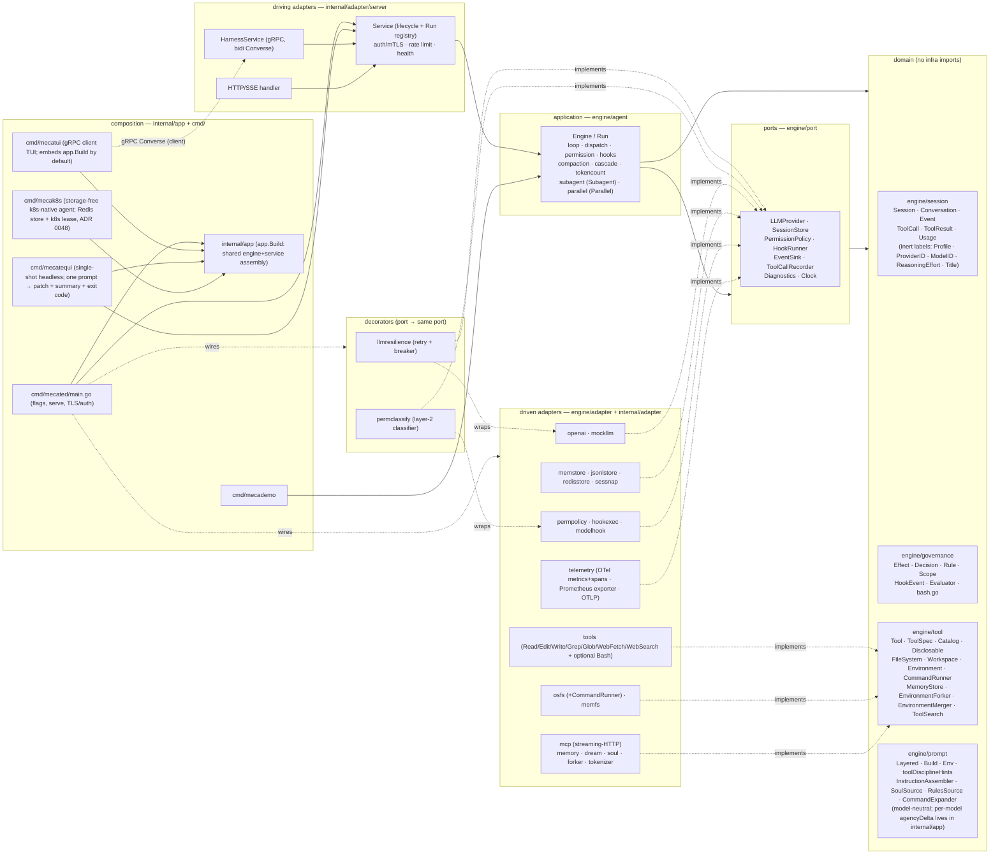

# mecatl — Architecture

> Reader-facing architecture guide. This describes the **code as it exists** in
> `engine/`, `internal/`, `cmd/`, and `contracts/`. Where the design notes in
> `docs/design/` differ from the implementation, this document follows the
> implementation.
>
> For the system's vocabulary — the canonical entities, their relationships, and
> the invariants that must hold — see the [domain model](architecture/domain-model.md).
> The accompanying [modelith](https://github.com/stacklok/modelith) model is a
> generated formal reference: edit its `.yaml` source and re-render, never the
> generated `.md`.

### How to read this

Start with the **living guides** — this overview, the per-subsystem pages below,
and [`docs/design/IMPLEMENTATION-NOTES.md`](design/IMPLEMENTATION-NOTES.md) —
which describe the code as it exists today. The [ADR index](adr/README.md) is a
**historical *why* archive**: each ADR records the decision made at a point in
time and is frozen, so reach for it on demand to understand a rationale, not as
the primary introduction to a feature.

For a full progressive reader map — foundation spine, topic branches, and routes
for operators, library consumers, and researchers — see
[`docs/READING.md`](READING.md). This page covers the big picture and the link
list below; the reading map owns audience routing.


## The guide

The architecture is split across focused, per-subsystem files (one fact, one file).
This page is the overview and router; the big picture and the layering rule are below.

**Foundations** (the linear spine — read in order):

- **[The domain model](architecture/domain-model.md)** — the Session aggregate, Conversation, Events, ToolCall/ToolResult value objects.
- **[The ports (`engine/port`)](architecture/ports.md)** — the seams the loop consumes: `LLMProvider`, `SessionStore`, `PermissionPolicy`, `HookRunner`, and the `tool.Workspace`/`FileSystem` seam.
- **[The agent loop & permission pause/resume](architecture/agent-loop.md)** — `Engine.Run` / drive algorithm, dispatch (read-parallel / mutate-serial), and permission pause/resume.

**Topic branches** (stand alone; each lists its prerequisite):

- **[Hooks & guardrails](architecture/hooks-and-guardrails.md)**
- **[Subagents & teams](architecture/subagents-and-teams.md)**
- **[Providers — OpenAI adapter & multi-provider](architecture/providers.md)**
- **[The API surface](architecture/api-surface.md)**
- **[Observability, persistence & reliability](architecture/observability.md)**
- **[Context management & the compaction cascade](architecture/context-and-compaction.md)** — token counting, compaction, and the shared configured/live/catalog context-window resolver.
- **[Memory — cross-session recall & consolidation](architecture/memory.md)**
- **[Parallelism — fork-join](architecture/parallelism.md)**
- **[Extensibility — MCP, tools & progressive disclosure](architecture/extensibility.md)**
- **[Deployment & server hardening](architecture/deployment-and-hardening.md)**

### Internal credential store

`internal/adapter/credentialstore` is a host-internal, credential-format-agnostic
port for opaque binary records. It stays under `internal` rather than `engine/port`
because the engine is not its consumer. Its `Reader` contract provides lookup,
capabilities, and lifecycle operations; `ConditionalWriter` provides create-only and
version-matched replace/delete; mutable `Store` embeds both. Mutability is represented
by the implemented interface, not a capability bit that could disagree with it.

The optional adapter-local MCP OAuth controller borrows an explicitly injected mutable
Store for its credential envelope; it never constructs or closes a backend. The opt-in
`mcp/oauthlogin` host runtime and `internal/app.LoginMCP` one-shot operation can populate
that store by driving a real protected MCP initialize and tool listing through a random
IPv4-loopback callback. They are not installed by default: no command, profile resolver,
key-acquisition policy, daemon, or ACP surface wires them yet. Future environment or
Kubernetes Secret-backed sources may satisfy Reader only; durable refresh rotation requires
a mutable CAS Store. No environment source is implemented here.

Memory and local encrypted storage are Store adapters. Encrypted-file consumers must
explicitly inject an absolute root and an exact 32-byte key acquired elsewhere. Both
share create-only and version-matched replace/delete semantics. The file backend hashes
names, encrypts strict bounded envelopes with AES-256-GCM and location-bound AAD, and
serializes the complete CAS under stable per-record flock sentinels. Supported Unix
stores enforce owner-only modes and reject symlinks, special files, hard links, and
wrong ownership. Its guarantee is cooperating-process, single-host, local-filesystem
only; same-UID attacks, authenticated rollback, crash-left encrypted temporary files,
and non-local flock/rename behavior remain outside it. See [ADR 0108](adr/0108-credential-store.md).

The [formal domain model](architecture/mecatl.modelith.md) (generated by modelith) is a supporting reference — start with the prose [domain model](architecture/domain-model.md) for the human walkthrough.

## 1. What it is

mecatl is a **headless agentic coding harness**: a service (and library)
that runs the agent loop — call the model, stream its output, execute coding
tools, enforce permissions and hooks, and emit a single typed event stream.
There is no TUI. Clients drive it over **gRPC** (a bidirectional `Converse`
stream) or **HTTP/SSE**. Both surfaces speak one provider-neutral domain
`session.Event` and call the same application service; neither ever sees an
OpenAI type.

The system is built **hexagonally (ports & adapters) with a DDD core**.
Dependencies point inward only: a domain of pure value objects and aggregates
(`session`, `governance`, `learning`, `tool`, `prompt`), a set of port interfaces the
application consumes (`port`), the application use-case layer that is the agent
loop (`agent`), and adapters that implement the ports (`adapter/*`). The core
tiers (domain, ports, agent loop) plus a small set of lightweight REFERENCE
adapters (`engine/adapter/*`: `mockllm`, `memfs`, `nofs`, `memstore`, `sessnap`,
`permpolicy`, `permstore`, `wallclock`, `search` (the graduated web-search tool body + Exa/HTTP/SearXNG providers + offline fake, #363),
`webfetch` (bounded public HTTP(S) text retrieval with DNS-pinned dialing and `x/net/html` extraction),
`fstools` (the FS tool bodies), `agentfs` (the filesystem agent-def discovery adapter), `skillfs` (the read-only skills discovery core + Skill tool body), `rulesfs` (the `.claude/rules` discovery adapter, issue #329 — the pattern-2 turn-0 context instance), plus
the conformance-as-contract suites `fsconformance`, `memconformance`,
`storeconformance`, `sourceconformance`, `eventlogconformance`) live
under `engine/` — the
importable core, fully self-contained (tests included: nothing under `engine/`
imports `internal/...`) and intended to be importable as a library by external
consumers — while the heavy adapters and the composition layer stay under
`internal/`. `engine/` **is its own Go module**
(`github.com/stacklok/mecatl/engine`), kept in this repo as a monorepo via a
committed `go.work`; its standalone dependency closure is just `doublestar` +
`robfig/cron` + `go.yaml.in/yaml/v3` + `x/net/html` + `x/sync` (+ test-only `goleak`), so an external consumer importing `engine/agent`
pulls in that small set rather than mecatl's full require cone (see
[ADR 0036](adr/0036-engine-module.md)). The exported identifiers of the **eight
core packages** (`session`, `governance`, `learning`, `tool`, `prompt`, `port`, `team`,
`agent`) are the engine's STABLE public surface, governed by a compatibility
contract ([`engine/COMPATIBILITY.md`](../engine/COMPATIBILITY.md)) and enforced
by the `api-compat` gate — a change to that surface fails CI until the committed
`engine/api/*.txt` snapshots and `engine/CHANGELOG.md` are updated
([ADR 0037](adr/0037-engine-stability-contract.md)); the `engine/adapter/*`
reference adapters carry no such promise. The **real LLM-provider wire adapters**
are their own **opt-in Go submodules** under `provider/` ([ADR 0093](adr/0093-provider-modules.md)):
`provider/anthropic` (native Messages API), `provider/openai` (Responses API),
`provider/openaichat` (Chat Completions API), and `provider/ssefilter` (the shared
SSE keepalive filter). Each is a separate module requiring the engine module plus
its own SDK, so a consumer embedding the engine `go get`s exactly the provider(s)
it wants and pulls only that SDK — never the root module. They release under
`provider/<name>/vX.Y.Z` submodule tags. Three sibling efforts harden the same
embeddable-core arc: the engine is now **fully clock-injectable** — every core
wall-clock read flows through `port.Clock` (`Engine.now()`), enforced by an AST
guard (`engine/arch/clock_test.go`) so an embedding host can drive it
deterministically (#116); `port.SessionStore.Load` carries a documented
**event-sourced reconstruction contract** so a host whose system of record is an
append-only log can fold its `EventLog` (+ `SessionMeta`) into a session via
`engine/adapter/eventsource.Fold` — the durable log now records the log-only
`EvUserPrompt` so user turns reconstruct, with a replay-fidelity caveat for
reasoning providers (#115, [ADR 0038](adr/0038-event-sourced-rehydration.md)); and the
supply chain gains per-module **`govulncheck`** (engine strict-clean; a
fail-closed reachable-vuln gate on the root) plus **`dependabot`** over both
modules and the SHA-pinned actions, on a **go 1.26.5** toolchain (#118). The LLM provider sits behind the `port.LLMProvider` seam, with each
wire format isolated entirely inside its own adapter — the OpenAI Responses API
in `provider/openai`, the native Anthropic Messages API in
`provider/anthropic` ([multi-provider](architecture/providers.md)) — so the core is provider-agnostic and
unit-testable against fakes (`mockllm`, `memfs`, `memstore`).

OpenAI has two deliberately separate registry identities. `openai` uses a public
API key and the supported public Responses API. Experimental `openai-codex`
uses a manually supplied ChatGPT Codex access-token snapshot against OpenAI's
undocumented private Codex backend. They are separate billing and entitlement
boundaries; configuring either one never enables the other. Composition applies
the Codex credential/header/model-inventory policy around the existing
`provider/openai.Provider`, so request building, stateless replay, successful SSE
translation, resilience, tools, and the provider-neutral engine port remain
single-sourced. See [the provider chapter](architecture/providers.md#experimental-openai-codex-subscription-provider)
and [ADR 0104](adr/0104-openai-subscription-manual-token.md).

Around that core, every capability beyond the minimal loop is a **seam with a
default and a swap-in adapter**, so the production build stays static and
network-free unless you wire something in. The current adapters cover, grouped:
**reliability** (`llmresilience` retry/breaker decorator), **observability**
(`telemetry`: OTel metrics + runtime collector via a Prometheus exporter, OTel
spans over OTLP), **security** (server auth/mTLS, rate
limiting, the `permclassify` model-based risk classifier), **context management**
(`tokenizer` + the `CascadeCompactor`), **memory** (`memory` + `dream`),
**parallelism** (`forker` fork-join), and **extensibility** (the `mcp`
streaming-HTTP client). Each is detailed below.

## 2. The big picture



**Built-in web retrieval.** `WebSearch` discovers candidate sources; `WebFetch`
reads one public HTTP(S) textual resource without an MCP server. The fetch adapter
resolves and validates every destination, pins the accepted DNS answers into the
dial, and repeats that check for each of at most five redirects. It uses no ambient
proxy, cookies, credentials, or caller-controlled headers. Raw and decompressed
bodies are independently capped at 5 MiB, HTML is parsed without executing or
loading subresources, and the 25,000-byte model result is framed as untrusted data.
See [ADR 0105](adr/0105-built-in-webfetch.md) for the security boundary and fixed
limits.

**Dependency direction is inward only.** The allowed-imports rule, stated by the
per-package `doc.go` files and honoured by the code:

| Package | May import |
|---|---|
| `session`, `governance`, `tool`, `prompt` (domain) | stdlib + other domain packages. Never `adapter`, `agent`, `contracts`, `os`, or any third-party library. |
| `port` | domain packages + stdlib (`context`, `io`, `iter`, `time`). |
| `agent` (application) | domain + `port` + stdlib only. Never an adapter or `contracts`. (Tests may import adapters.) |
| `adapter/*` | domain + `port` + the one external lib it adapts. Never `agent`, except the narrow `search`/`webfetch` call to `agent.FenceUntrusted`: fetched external text must use the same framing-neutralisation choke point as every other model-facing untrusted block, and copying that security policy into adapters would be worse than this leaf call. (Deliberate adapter→adapter carve-outs: (1) `adapter/mcpperf` may import `adapter/telemetry` solely for the `RuntimeSnapshot` data DTO it projects into tool output — a plain JSON struct with no OTel/SDK types, not a behavioural dependency; the DTO stays in `telemetry` by design. (2) `adapter/soul` AND `adapter/memory` import `adapter/skills` for `ScanForInjection` — the conservative role-override deny-list is shared so the soul (load-time) and the user-model RememberUser write path (write-time) reuse the same injection gate rather than copying the regexes. (3) `adapter/{permconfig,skills,agents,soul,memory}` import the leaf `adapter/xdgconfig` for the shared `ResolveEnv`/`UserConfigDir` XDG path-resolution seam — a stdlib-only adapter leaf, extracted to de-duplicate the copies (the user-model store resolves `<xdg>/mecatl/usermodel` through it). (4) `adapter/soul` and `adapter/memory` import the DOMAIN `engine/prompt` for a single compile-time assertion only — `var _ prompt.SoulSource = (*Store)(nil)` (soul→prompt) and `var _ prompt.UserModelSource = (*Store)(nil)` (memory→prompt) — pinning that each adapter satisfies the consumer-local prompt port it is bound to at composition. These are assertion-only edges (no prompt value is constructed or called); the adapters meet the ports structurally, and `engine/prompt` never imports them. |
| `contracts/gen` | generated; protobuf + gRPC runtime. |
| `app` (composition) | the shared engine/service assembly (`app.Build`). MAY import adapters + `agent` + (via `server`) `contracts/gen`. Nothing imports it but the `cmd/` mains. |
| `cmd/*` | flags + serving; consumes `internal/app`. With `app`, the only places concrete adapters meet ports. |
| `cmd/mecatui/{client,ui,theme}` | a gRPC **client**. `contracts/gen` + grpc + `internal/app` appear only in `client`, `embed`, and the `cmd/mecatui` main; `ui` and `theme` import none of them and **never** any `internal/...` package. |

**mecatui — the terminal UI (`cmd/mecatui`).** An optional gRPC *client*. It dials
the `HarnessService`, creates a session, opens the bidi `Converse` stream, and
renders the streamed `Event` envelopes (glamour markdown for assistant text,
themed lipgloss cards for user prompts and tool I/O), resolving permission asks
inline by sending `ResumeApproval` on the same stream. The server it talks to is
either one it **hosts in-process** over a UNIX socket (`cmd/mecatui/embed` →
`app.Build`, the default — bare `mecatui` always embeds, never probes) or an
external `mecated` it dials via `mecatui connect ADDRESS` — so a single binary
works with no daemon. The render packages stay pure: they render **purely
from proto `Event`s** and are bound by the inward-only layering rule. The
`contracts/gen` + grpc + `internal/app` surface lives only in `cmd/mecatui/client`,
`cmd/mecatui/embed`, and the `cmd/mecatui` main; the `ui` (Bubble Tea
model/update/view) and `theme` (pure styling) packages import no `engine/...` or `internal/...`
package and no proto directly. Usage and theming are documented in `docs/tui.md`.

**mecatequi — the single-shot headless runner (`cmd/mecatequi`).** A fourth composition
root and a *peer of `mecademo`* over the same `app.Build`: it runs **one** prompt against
an in-process `server.Service`, drives it to a terminal state, and emits three
artifacts — a working-tree git diff (modified, **added**, and deleted files: `git diff
HEAD` plus a `git diff --no-index` new-file hunk per untracked file, so a downstream `git
apply` reproduces new files too), a machine-readable run-summary JSON (`Summary`,
additive-only contract), and an optional durable JSONL event log — then maps the terminal
`StopReason` to a process exit code (`0` clean incl. the honest non-completions, `1` run
failure/cancel/timeout, `2` setup failure). The durable event log (`port.EventLog`,
cloud-native Phase 3a) is now readable over the public `HarnessService` via the
server-streaming `StreamSessionEvents` RPC (and `GET /v1/sessions/{id}/events` over HTTP) —
the client-tier surface over the same `port.EventLog.Read` the operator-tier 3c
`EventLogService.Read` serves, so a client opening a past session replays its full timeline
(the loop stays storage-agnostic; it only emits). Unlike `mecated` it owns no listeners, TLS,
auth, or telemetry pipeline; unlike `mecatui` it has no UI. It defaults `--headless`
(inverted from `mecated`): a CI run has no approver, so a child ask auto-denies or routes
to the opt-in ask-reviewer, and a *main-engine* ask under `posture strict` cancels the run
with an actionable message (the intended CI posture is `--posture auto`). It is **forge-
agnostic** — the GitHub-Actions glue that turns an issue into a pull request (a composite
action + a split-privilege workflow) lives entirely under `.github/` and changes no Go.
An EXPLICIT `--out-summary=-` selects the stdout-compact summary mode (ADR 0082): the
`Summary` is emitted as a single compact JSON line as the FINAL stdout line, so a
scheduler tailing pod logs parses the last line; the unset default keeps the indented
JSON. `--run-id`/`--task-ref` are deliberately not accepted — a scheduler correlates via
its own launch identity plus `Summary.session_id`.
See `docs/adr/0028-mecatequi.md`. The four real-provider mains (`mecated`, `mecatui`,
`mecatequi`, `mecak8s`) share provider credential + base-URL wiring through `internal/cliconfig`, so
all four read the same `OPENAI_API_KEY` / `OPENROUTER_API_KEY` / `ANTHROPIC_API_KEY`
environment keys and register the same base-URL flags. The daemon/headless mains
(`mecated`, `mecatequi`, `mecak8s`) also share the repeatable `--mcp-server name=URL`
flag and its `MCP_<NAME>_TOKEN` bearer convention through the same package
(`cliconfig.MCPServerList`, ADR 0082) — a scheduler launching one-shot runs injects a
short-lived per-run identity as the token env and the run presents it to that MCP
endpoint.

**mecak8s — the storage-free Kubernetes-native agent (`cmd/mecak8s`).** A fifth
composition root and a *thin peer of `mecated`* over the same `app.Build`: it composes the
shared assembly with **k8s-native defaults** — a **Redis** session store + durable event log
(`internal/adapter/redisstore`, ADR 0048), a `coordination.k8s.io` Lease per session
(`internal/adapter/k8slease`, the in-cluster multi-replica single-writer path), a dynamic
`/readyz` (drain-gated + Redis-pinged), and a bounded `GracefulStop`. The agent pods are
**storage-free**: no PVC, no `--store-dir`, no local state — every piece of state is a
managed service the pod talks to over the network (Redis + the k8s API server). It defaults
`--headless=true` and `--posture=auto` (an unattended daemon, inverted from `mecated`'s
interactive defaults), drops `mecated`'s subcommands + Prometheus/OTel admin surface, and
exposes `--redis-url` (mutually exclusive with `--store-dir`/`--session-store-url`). The
honest shutdown contract: new runs are rejected (503 via the drain gate) the moment SIGTERM
or the `preStop` `httpGet /drain` fires; **in-flight runs are cancelled, not drained** (a
multi-minute LLM turn cannot survive a rolling update within
`terminationGracePeriodSeconds: 60`); the pod is disposable, the session is not — it is
`Recover`-able on the successor (issue #51) from the Redis snapshot + durable event log.
See `docs/adr/0048-mecak8s.md`.

Two deliberate cycle-breaks worth noting, documented in code:
- `port` imports `tool` and `prompt` (because `LLMRequest` carries
  `[]tool.ToolSpec` and `prompt.Layered`) — see the package note at the top of
  `engine/port/llm.go`.
- `FileSystem`/`Workspace`/`Environment` live in `engine/tool`, **not**
  `engine/port`, because `port` already imports `tool` while
  `tool.Tool.Execute` takes an `Environment`; defining them in `port` would form
  a `port↔tool` cycle. See the package note in `engine/tool/tool.go`.
  `Environment` bundles a `Workspace`, an optional bound `CommandRunner`, and a
  backend identity `EnvironmentRef`. FS tools obtain `env.Workspace()`; the Bash
  tool obtains `env.CommandRunner()`. Workspace file mutation is version-aware:
  agent-facing Read records an opaque `FileVersion`, new-file Write is create-only,
  and Edit/existing-file Write finish with conditional replace. Public Workspace
  exposes no unconditional mutation; its ledger belongs to the live
  Environment instance and resets whenever the default Service factory rebuilds it.
  As of [ADR 0106](adr/0106-environment-persistence.md), `EnvironmentRef` is a DURABLE
  snapshot field: a non-in-tree ref persists across a restart and reattaches a live
  `Environment` at run entry through `server.Config.EnvironmentResolver`; the in-tree
  Kinds never reach the resolver, and a nil/mismatch/nil-Workspace result fails loudly.
  See [ADR 0104](adr/0104-execution-environment.md),
  [ADR 0105](adr/0105-execution-environment-runtime-seam.md),
  [ADR 0106](adr/0106-environment-persistence.md), and the
  [ports chapter](architecture/ports.md).
- `governance` does **not** import `session` (so `session` can import
  `governance` without a cycle); the `Evaluator` works on primitive args, and
  the `permpolicy` adapter bridges `session` types into it.

**Default prompt behavior.** `engine/prompt/builder.go` (`defaultTone`) owns one
cache-stable default tone. Its concise-delivery guidance is explicitly scoped away
from investigation and reasoning depth, while the minimum-change ladder,
read-before-edit discipline, trust-boundary validation, and safety carveouts remain
always on. There is no output-economy surface at all: the former `terse` delta and its
public flag/config surface were removed by [ADR 0086](adr/0086-remove-output-economy-control.md),
and the one-release parse-compat shim was deleted by [ADR 0089](adr/0089-cli-clean-break-grammar.md) —
a legacy `--output-economy` is now an unknown-flag error, and a top-level `output-economy:`
settings.yaml key is a named unknown-key rejection.

**Live operator profile (#508 slice).** The optional `prompt.OperatorProfileSource`
feeds a bounded full-value JSONL data envelope in `System.VolatileSuffix` (32 entries,
8 KiB by default); `agent` refreshes it before every request, retains a run-local
last-good snapshot, and never persists it into conversation history. The stable prefix
is unchanged, and the legacy value-omitting `UserModelAssembler` remains the standard
composition path for now.

**Skills as slash commands.** The resolved, admitted skills inventory also exposes each skill as a `/<skill-name>` command. A syntactically valid name expands only when it is in that inventory; it then loads the instruction body and the same bounded logical asset inventory as the `Skill` tool. Asset names are appended after ordinary command parsing and placeholder substitution so metadata stays literal. A slash command does not fetch asset content: when the instructions need a textual asset, the model calls `Skill` with `{name, asset}`. It gains no base directory and makes no claim about `Read` or `Bash`. In the command chain, file-backed commands take precedence over skills, skills over driver commands, and driver commands over MCP prompts; the first matching source wins. See `engine/adapter/skillfs/commandsource.go`, `engine/adapter/skillfs/tool.go`, `engine/prompt/commandsource.go`, and `internal/app/build.go` (`buildCommandExpander`).

**Typed tool results.** A `session.ToolResult` may carry typed content blocks on
`ToolResult.Parts` (`[]session.Content`, additive — a zero-value `Parts` is the
legacy string-only shape). Composition projects them to the model via
`port.RouteToolResultParts`, which gates image/audio blocks by the per-session
capability intersection (the single `modelCapability` = catalog ∩ adapter) and
passes text / resource-link / embedded-resource / structured-content blocks
through unconditionally. `Content.Audience` is advisory display routing ONLY and
is never consulted to suppress model-facing content (CWE-345 — an untrusted MCP
server's `audience:["user"]` is not a suppression control). Server-returned
`resource_link` URIs are never auto-dereferenced; an `https://` link may be
fetched by the `FetchMcpResource` tool through `ValidateMediaURL` (SSRF
backstop, CWE-918). See `docs/adr/0078-mcp-typed-tool-results.md`.

**Conversation fork.** `Service.ForkSession` (`internal/adapter/server/service.go`)
creates a new peer session whose conversation history is a snapshot of an existing
session's, inheriting the source's mode, workspace, limits, and
provider/model/profile labels (ADR 0065). The ONE permitted selector delta is an
optional `reasoning_effort` override (ADR 0068): empty inherits the source's effort
verbatim, while a non-empty value replaces only the effort label/engine — provider
and model always inherit. This is how a mid-conversation effort switch works
non-destructively (the mecatui `/effort` fork-resume): the transcript survives on
the peer. It reuses the domain primitives the
subagent `fork:true` path already exercises — `session.ForkSnapshot`
(`engine/session/conversation.go`) clones the conversation with a fresh backing
array and strips trailing unanswered tool calls (tool-pairing-valid), and
`session.SeedHistory` (`engine/session/session.go`) loads it into a fresh
`session.New` aggregate that starts idle with zeroed `Counters`/`Usage`. The
source is loaded via the run-entry funnel (`loadAndReopen`), so a terminal source
is recovered to idle first; a running/awaiting source is rejected with
`ErrFailedPrecondition` (fork requires a turn boundary). The forked engine is
rehydrated ONLY when the source needed a per-session engine (non-default selector
/ no-fs profile / worktree workspace), mirroring `createSession`'s branching; a
default-FS fork rides the shared engine. Same provider and model only — the
snapshot carries provider-private replay blobs a different provider cannot
consume. Wire surface: the `ForkSession` gRPC RPC and `POST /v1/sessions/{id}/fork`.

## See also

- [Usage & operator guide](usage.md) — building, running `mecated`, every flag, and the gRPC + HTTP/SSE APIs that drive this design.
- [mecatui terminal UI](tui.md) — the gRPC client that renders the event stream described above.
- [ADR 0001 — the ACP adapter](adr/0001-acp-adapter.md) — the decisions behind the third (editor) wire surface.
- [Go performance measurement & observability survey](perf-measurement-survey.md) — the technique reference behind [observability & persistence](architecture/observability.md).

## Scheduled tasks

A scheduler subsystem (issue #189, [ADR 0059](adr/0059-scheduled-tasks.md)) lets an
operator register a saved prompt to run on a 5-field cron schedule (`0 9 * * *`,
`@every 30m`, `@daily` macros) or once at a future time, and have mecatl drive
that run **autonomously, durably, and exactly-once** across a multi-replica
deployment — with no human present at fire time.

It is a **composition-layer** subsystem (no `engine/agent` changes) that reuses
the existing run-entry funnel. The pieces:

- **`port.ScheduleStore`** (`engine/port/schedule.go`) — the durable registry,
  a peer of `port.SessionLease`/`port.EventLog`. The store is ground truth; an
  in-memory timer is a derived lookahead. `Claim` is the at-most-once atomic
  advance (NextFireAt + LastFireAt + FireCount) that gives exactly-once across
  replicas — a crash mid-fire skips the slot (recurring self-heals via
  fire-once-now; a one-shot can be lost).
- **Adapters** — `memschedulestore` (reference), `jsonlstore` (single-host),
  `redisstore` (multi-replica, via a Lua CAS for the atomic Claim). All pass
  the shared `scheduleconformance` suite.
- **`internal/adapter/scheduler`** — the tick loop, gated by a leader-lease on
  the well-known `__scheduler__` id (only the leader ticks). Leadership is a
  STANDBY loop (ADR 0073 follow-up): `Start` is infallible-at-launch — a
  non-leader serves RPCs and retries the acquire on a jittered backoff,
  promoting when the leader's lease lapses; a definitive Renew loss demotes the
  leader back to standby (failover), and a sticky
  store-unsupported flag stops the loop re-acquiring forever. `FireNow` is
  gated on leadership (`ErrNotLeader` → FailedPrecondition/412). On each tick:
  `Due` → misfire policy → `Claim` (at-most-once) → `FireFunc` → `RecordFire`.
  The `FireFunc` seam is how composition injects the run-entry funnel.
  **Scaling shape (ADR 0074):** one server hosts MANY concurrent sessions (the
  per-session `SessionLease` is the exclusion primitive across both vertical
  session-density and horizontal replicas); the scheduler stays a single global
  leader for the cheap tick (`Claim` is the correctness fence, leadership is
  hygiene), and the expensive fire DRIVE is decoupled into a bounded pool
  (Phase 2), sharded per-schedule only if throughput later demands it.
- **Composition** (`internal/app/build.go` `buildScheduler`/`startScheduler`)
  wires the scheduler ON BY DEFAULT ([ADR 0073](adr/0073-schedule-tool.md)
  decision 2 — the opt-in `--scheduler` flag is deleted; `--no-scheduler` is
  the disable knob) whenever the configured store exposes a `ScheduleStore()`
  accessor (discovered by type-assertion) — a store with none (the in-memory
  default) stays on the byte-identical no-scheduling path. The registry can
  also be REMOTE: `--schedule-store-url` points it at a
  `mecatl.driver.v1.ScheduleStoreService` + `ScheduleOneShotReArmerService`
  driver (a peer of `SessionStoreService`/`EventLogService` on the same
  `mecatl.driver.v1` protocol), INDEPENDENT of the session store — when set
  it REPLACES the `ScheduleStore()` discovery, and the driver's
  `Claim`/`ClaimNow`/`ReArmOneShot` run the at-most-once atomic advance
  server-side (the durable NextFireAt advance IS the fence, exactly as the
  in-process store's is). A dial failure is fatal (an explicitly-configured
  driver that won't dial is an operator misconfiguration). The override backs
  the in-chat `Schedule` TOOL too: composition passes the ONE resolved
  `port.ScheduleStore` into `server.ScheduleManagerConfig.ScheduleStore`, so
  the tool + tick loop + fire path share the one registry — no absent tool
  with an accessor-less session store, and no split-brain with an accessor-ful
  one. The leader-lease reuses the session-lease backend (same backend, different id). The
  `FireFunc` mints a fresh `sched--`
  top-level session per fire via `Service.CreateSessionWithProfile` +
  `StartRunContent` with subagent-grade defaults (bounded budgets, read-leaning
  posture unless `mutating: true`, headless ask model, fail-closed model
  pinning). The fire id IS the session id (ADR 0059 decision #7 Phase-2): the
  fire path pre-mints a `sched--<name>-<ts>-<rand>` id and passes it as the
  `WithSessionID` override (a variadic options pattern on
  `CreateSessionWithProfile`), so the persisted session carries the `sched--`
  GC-retention family prefix. A distinct `ScheduleFireRetention` GC family
  (`sweepScheduleFires`, peer of the main/child passes) sweeps per-fire
  sessions on their own age horizon — never the main or child pass. The
  `--schedule-fire-retention` flag (operator-tier, peer of
  `--child-retention`) defaults to 7d whenever unset (the scheduler is on by
  default); an explicit 0 disables (fire sessions are never swept). The
  shared create-seam (`validateScheduleSpec`) also enforces the
  `--scheduler-min-interval` cadence floor and rejects an
  unknown/uncatalogued provider+model selector, fail-closed, for both the
  in-chat `Schedule` tool and the REST/gRPC handler.

See [ADR 0059](adr/0059-scheduled-tasks.md) for the frozen rationale (the 10
resolved decisions + the leader-lease decision) and the consequences. The two
documented v1 trade-offs — one-shot loss on a mid-fire crash, and
fresh-context-per-fire — are mitigated by the opt-in Phase-2 fields below.

### One-shot crash-loss retry + carried context (Phase 2c, issue #236)

Two opt-in `ScheduleSpec` fields close the documented v1 trade-offs. Both are
composition/scheduler-layer (no `engine/agent` change) and default OFF (the
pre-Phase-2 path is byte-identical when neither field is set):

- **`OneShotRetry` / `OneShotMaxRetries`** — at-least-once retry for a one-shot
  that cannot tolerate crash-loss. The tick loop's post-fire scan
  (`maybeReArmOneShots`, run after the due-fire batch) re-enables a crashed
  one-shot — one whose prior fire ended in `StopError`, or whose
  `LastFireSessionID` is still the `pending` sentinel (Claim happened but
  RecordFire did not) — up to `OneShotMaxRetries` times, via the OPTIONAL
  `port.ScheduleOneShotReArmer` interface (`ReArmOneShot` re-enables + advances
  `NextFireAt` with a small backoff + increments the durable
  `OneShotRetryCount`). The interface is type-asserted on the store exactly like
  `PrunableStore`/`SessionLease` — a store that does not implement it degrades to
  the byte-identical at-most-once path. All three store adapters implement it.
  The budget gate (`OneShotRetryCount >= OneShotMaxRetries`) makes an exhausted
  one-shot permanently done (no crash-loop). One-shot-ONLY: the create-seam
  rejects `OneShotRetry` on a cron trigger fail-closed, and applies a default
  `OneShotMaxRetries=3` when `OneShotRetry=true` and the field is 0. A re-armed
  one-shot starts FRESH (the crashed fire's context is untrusted AND incomplete
  — the re-arm path ignores `CarryContext`).
- **`CarryContext`** — carried-context across fires. The fire path
  (`makeFireFunc` + `renderCarriedContext`, `internal/app/scheduler_fire.go`)
  loads the prior fire's session and renders its conversation as a FENCED
  UNTRUSTED preamble prepended to the prompt — NOT as seeded history. Carried
  context is UNTRUSTED (model-authored + tool-result-laden; a prior fire may
  have been prompt-injected), so it must NOT become replayable
  `Conversation.Messages` (which would carry injection forward as live
  instructions). The fence (`agent.FenceUntrusted` + `NeutraliseFraming`,
  `engine/agent/fence.go`) quarantines it: a forged `<<<UNTRUSTED` closing marker
  or harness section header in the prior content is neutralised, so it cannot
  break out of its block. The summary is clamped to the last 20 turns and a 10000-
  rune budget. On prior-session-load failure (not found, decode error) the fire
  degrades to fresh-context (WARN, never fails the fire). The gate is
  `CarryContext && LastFireSessionID != "" && LastFireSessionID != pending` — so
  a re-armed one-shot does NOT carry context on the retry.

### ScheduleService API surface (Phase 2a, issue #232)

The scheduler is reachable over BOTH wire surfaces — gRPC `ScheduleService` and a
peer REST surface — so an operator/client can create, inspect, pause, fire, and
delete schedules out-of-band from the tick loop. The handlers are thin
delegations over the same `Service` methods the tick loop uses; they live in
`internal/adapter/server/grpc_schedule.go` (gRPC) and `internal/adapter/server/http.go`
(the `schedule_*` REST handlers).

**gRPC `ScheduleService`** (`contracts/proto/mecatl/v1/schedule.proto`,
`ScheduleServer` in `internal/adapter/server/grpc_schedule.go`) — 10 RPCs:

- `CreateSchedule` / `UpdateSchedule` — upsert by name; the create-seam
  (`Service.CreateSchedule`) validates the trigger XOR, prompt-or-parts, cron
  grammar, and the Mutating/Mode invariant fail-closed, then computes the first
  `NextFireAt` (cron via `cronparse`; one-shot = the `OneShot` instant).
- `GetSchedule` / `ListSchedules` / `DeleteSchedule` (idempotent).
- `PauseSchedule` / `ResumeSchedule` — toggle `State.Enabled` via the atomic
  `SetEnabled` (Save preserves State on a Spec overwrite, so pause/resume is a
  dedicated primitive).
- `FireNow` — force an immediate fire, returning `fire_id` + `session_id`
  (fire_id == session_id). The fire is driven synchronously through the
  `FireFunc`; poll `GetFire` for the terminal stop reason.
- `GetFire` / `ListFires` — the pull-only outcome channel: a `ScheduleFire`
  carries the stop reason + the session id whose `SessionStore` snapshot holds
  the full conversation.

**REST routes** (`internal/adapter/server/http.go`, under `/v1/schedules`):

```
POST   /v1/schedules                  -> CreateSchedule
GET    /v1/schedules                  -> ListSchedules
GET    /v1/schedules/{name}           -> GetSchedule
PUT    /v1/schedules/{name}           -> UpdateSchedule
DELETE /v1/schedules/{name}           -> DeleteSchedule
POST   /v1/schedules/{name}/fire      -> FireNow
POST   /v1/schedules/{name}/pause     -> PauseSchedule
POST   /v1/schedules/{name}/resume   -> ResumeSchedule
GET    /v1/schedules/{name}/fires     -> ListFires
GET    /v1/schedules/{name}/fires/{id} -> GetFire
```

**Errors** — a backend with no `ScheduleStore` (memstore, or a store that does
not expose the accessor) honestly reports `Unimplemented` (gRPC) / 501 (HTTP)
from every schedule RPC; `FireNow` on a paused/done schedule is
`FailedPrecondition` / 412; a singleton-overlap skip is `FailedPrecondition` /
412; an unknown schedule/fire is `NotFound` / 404.

**`schedule.*` events** (`EvScheduleFired` / `EvScheduleSkipped` /
`EvScheduleFailed`, `session.SchedulePayload`) — the scheduler emits a
lifecycle event for each fired/skipped/failed fire via the composition-injected
`EmitScheduleEvent` callback (`Service.EmitScheduleEvent`), which appends it to
the fire session's durable `EventLog` (so schedule lifecycle rides the same
durable log as the fire's own events). The events project onto the
`Event.schedule` field (proto field 15); a skipped fire with no session is
dropped from the durable log (the log is session-keyed) and surfaces only via
the operator diagnostic.

**Fire-result delivery ([ADR 0075](adr/0075-fire-result-delivery.md), origin
attribution superseded by [ADR 0104](adr/0104-schedule-origin-run-context.md)).** A
schedule created in-chat carries `ScheduleSpec.OriginSessionID` — the conversation
that created it. The shared `startRun` seam places the executing session id on the
cancellation-derived context with the engine-internal `withSessionOrigin`, so normal runs and
awaiting-approval resumes inherit the same attribution. The `Schedule` tool reads it
off that context when it builds the create spec — the one place the field is ever
assigned (empty when unbound; never a model-supplied arg, since the tool's schema has
no origin field). Because attribution travels with each run context rather than
mutable wrapper state, concurrent sessions sharing one `Engine` cannot cross-stamp
origins. After a
fire reaches its terminal `EvResult` and `RecordFire` persists the
record, the scheduler's `SetDeliverFireResult` callback
(`deliverFireResult`, `internal/app/scheduler_delivery_run.go`) renders the
outcome as a **fenced-untrusted** harness note (`renderFireDelivery` —
`agent.FenceUntrusted` + `NeutraliseFraming`, never a live instruction), enqueues
it to a DURABLE per-session pending-delivery queue (`port.DeliveryQueue`, a
sidecar-backed `FileDeliveryQueue`; the exactly-once ledger is session-scoped and
survives restart), and delivers it into the origin: an idle/completed/cancelled/
failed origin is driven through the existing `StartRunContent` → `loadAndReopen`
funnel (recording the note as ordinary user history); a busy or awaiting origin
keeps the note queued and the loop drains it at the next turn boundary
(`drainPendingDelivery`, Step 2a, before `BeginTurn` — the same seam as the
background-subagent notice). A deleted / child / `sched--` origin degrades to
pull-only with a WARN (the fire is never failed by delivery). The connected
mecatui renders the note LIVE as a distinct delivery card over the
server-streaming `StreamSessionLive` RPC (a per-session live event subscription;
the live wire relays the delivery's `EvUserPrompt` note while the other log-only
kinds stay skipped), serving both the embedded in-process server and a remote
mecated over one projection. Pull-only (`GetFire`/`ListFires`) remains the floor
for out-of-band schedules (empty `OriginSessionID`).

### Schedule metrics

The operator-facing declarative surfaces Phase 2b once added — the operator-tier
`settings.yaml` `schedules:` block and the `mecated schedules` CLI — were
**removed** by [ADR 0073](adr/0073-schedule-tool.md): the in-chat `Schedule`
tool + the retained REST/gRPC API + the OS scheduler cover the use cases, so the
declarative reconcile and the CLI subcommand group no longer exist. The
surviving management surfaces are the in-chat `Schedule` tool, the
`ScheduleService` gRPC + REST `/v1/schedules` API, and the mecatui `/schedule`
overlay. What remains here is the metrics surface:

- **Schedule metrics** — two instruments emitted via the composition-injected
  `Config.ScheduleMetrics` callback (`internal/adapter/telemetry/metrics.go`
  `EmitSchedule`): `mecatl.schedule.fires` (counter, by `outcome` =
  fired/skipped/failed) and `mecatl.schedule.fire_duration` (histogram, seconds,
  due→terminal — skipped fires record no duration). No role label (a fire's own run
  already carries `role="main"`).


## Evidence-backed reflection

`engine/learning` contains the storage-neutral reflection domain and completed-trajectory
observer seam ([ADR 0109](adr/0109-staged-learning-proposals.md)). Standard composition owns the
bounded staged-reflection coordinator. A host constructs an owned `learning.Input` from a
trajectory, optional session events, typed admission signals, and bounded existing facts.
Canonical evidence projections assign compact message/event handles (`m:<ordinal>` and
`e:<ordinal>`) with SHA-256 digests while omitting provider reasoning blobs, binary media,
actor identity, permission arguments, and unbounded delegation data. Structural signal
detection is deliberately local to that input; cross-session contradiction or repetition
must be supplied explicitly by the host. Signals admit reflection but never become
candidates themselves.

`agent.EvidenceReflector` is the optional model-backed implementation. It makes one
provider-neutral call for an admitted input, with no catalog, tools, child engine, filesystem,
MCP, delegation, memory mutation, or persistence; the injected production LLM transport is its
only I/O. The input is canonical JSON inside the
shared untrusted fence. The response parser accepts exactly one JSON object (or one lone
JSON fence), resolves every returned handle against the exact digest-bound input, and
rejects the entire response on recursively duplicate or unknown fields, trailing/multiple values,
malformed fences, invalid enums, duplicate evidence, exceeded limits, unexpected stream chunks,
provider errors, missing/non-benign terminal stops, or secret/directive/transient content. Explicit abstention
is a successful outcome. Hosts select the provider/model; standard explicit reflection reloads the completed session's persisted provider/model through the registry, and a reflection-slot model remains on that provider. Hosts enforce input, event,
existing-fact, candidate, evidence, output-byte, token, and timeout bounds. This layer only
returns proposals or abstention. Durable proposal lifecycle is a separate, host-driven
layer: `learning.ProposalRepository` stages deterministic content-addressed records partitioned by
principal/project; reference `memproposal` and the flocked `reflectionstore` adapter provide atomic
CAS transitions through staged, promoting, terminal, and undone states. The importable standard
memory-promotion policy rejects unsafe/transient facts, never overwrites conflicts or user-explicit
revisions, routes procedure candidates into the evaluated learned-skill pipeline, and uses per-candidate presence-and-version CAS. Memory revisions carry
an optional proposal id, allowing a crashed promoting claim to reconcile without a duplicate write.
Batches may partially promote by design because each candidate is its own atomic convergence unit.
Standard composition signal-gates completions into one bounded Build-owned coordinator with fair
per-principal queues, digest singleflight, pre-admission per-job and aggregate byte budgets, reserved-before-admission receipts, job timeouts, cancellation receipts, and joined shutdown. Review stages only; auto promotes operator facts only from explicit principal-authored remember evidence and project facts only from principal-authored evidence at the exact trusted configured root. Tool/assistant/repository-only evidence stages for review. In off mode the proposal repository stays lazy and the dormant coordinator starts workers only if explicit synchronous reflection is requested; there is no public async mode. Project candidates from an admitted non-launch root remain staged/reviewable but cannot auto-promote, approve, or undo until a safe exact-root lifecycle store exists, and reflection does not read launch-root project memory for those inputs; untrusted project material is not ingested. The standard proposal repository defaults
beside the user-model store. The gRPC and HTTP surfaces expose explicit completed-session
reflection, bounded caller-partitioned list/detail, CAS approve/reject, and compensating undo;
capability bits keep older/unconfigured servers honest. Source-session ownership and proposal
principal are verified, project partitions remain reviewable but project promotion is root/trust-gated, and evidence detail reports only
digest availability rather than transcript text. `/reflections` provides bounded TUI review and
`/reflect` explicitly submits the current completed session even when automatic mode is off
([ADR 0109](adr/0109-staged-learning-proposals.md)).
Procedures initially remain visibly `deferred_unsupported`. The importable learned-skill
contracts ([ADR 0110](adr/0110-evaluated-agent-owned-skills.md), superseded by
[ADR 0111](adr/0111-hardened-agent-owned-skill-publication.md)) now let a host explicitly
materialize one as an owner-agent draft: body-only bundles are content-addressed and move by
CAS through draft, evaluated, staged, active, archived, or rejected states, with bounded
provenance, evaluations, receipts, and version history. `memskill` and the shared conformance
suite prove lifecycle, ownership, partition, and concurrency behavior; the durable
`internal/adapter/skillstore` adds a stable flock, bounded atomic manifest, and immutable
content-addressed `SKILL.md` versions with reopen and multi-instance CAS coverage. `skillvalidation`
rejects unsafe framing, secrets, machine paths, permission claims, generated assets, and
inventory collisions; the legacy `DirDrafter` now delegates logical checks to it while retaining
quarantine and an explicit compatibility-off option. Historical title/body procedures stay readable
and can be linked from `deferred_unsupported` only by explicit materialization.
`engine/adapter/skillmaterialize` turns an evidence-backed proposal into a validated
`SkillDraftInput`, then uses recoverable create-then-CAS-link reconciliation. A crash after
Draft creation converges by proposal provenance and SkillID without a duplicate. The legacy
`mecated skills promote` filesystem workflow remains operator/manual-only and deprecated;
`ImportLegacyDraft` imports `origin:model` quarantine content as an unevidenced Draft, never
Active. The synchronous `skilllifecycle.Pipeline` now applies off/review/auto policy: explicit drafts
stay inactive, evidence-backed procedures are evaluated, FAIL rejects, PASS/ABSTAIN stage, and only
an auto-mode PASS with a bound publication target activates; similarity always forces review. The state-aware
pipeline resumes after each durable boundary and republishes an already-active version during reconciliation.
The existing reflection coordinator owns automatic work; there is no second queue or historical sweep.
`skillfs.AtomicCatalog` retains the immutable path-free external `SkillSource` and independent immutable learned generations per principal/project partition. A caller-bound per-session `LiveTool` selects only that principal's global and admitted exact-project generations; its `Spec`, inventory, and `Execute` use the same selected snapshot, so metadata cannot leak before execution and Alice/Bob/project refreshes neither evict nor expose one another. External logical assets preserve the ordinary `{name, asset}` behavior and precedence; body-only learned skills reject assets and add no paths or roots. Archive is Active-only and rollback requires durable prior-active PASS proof. Caller/project-partitioned gRPC and HTTP methods provide bounded list/get/diff and stable receipt-index pages plus CAS activate/reject/archive/rollback. The receipt index retains bounded historical-version changes and rejects invalid or expired cursors. One publication gate serializes the external-collision check, durable transition, authoritative active-state reread, generation swap, and failure quarantine while the repository keeps cross-process flock/CAS. Uncertain state clears only the affected partition; a stale failure cannot revoke a newer success. Caller-scoped lazy hydration reconciles global and trusted project partitions on list/run after restart, so authenticated active skills need no new mutation. Reflections links procedure proposals to learned skills, while `/skills` marks live agent-owned versions. The legacy direct filesystem promotion command remains deprecated.

## Caller identity

Caller identity ([ADR 0100](adr/0100-caller-identity-threading.md), issue #367)
threads *who asked* through the harness. It is **attribution, not isolation**:
every durable artifact learns its owner, and nothing is yet refused on identity
grounds. The thread has four segments.

**It enters at the edge, and only there.** `internal/adapter/server/authn.go`
(`PrincipalValidator`) is the seam: the gRPC interceptor and the HTTP middleware
hand a bearer to a validator and get back a `session.Principal`
(`engine/session/principal.go`), whose identity is the `(Issuer, Subject)` pair.
Token mechanics — parse, signature, `iss`/`aud`/`exp`, JWKS rotation — are
delegated to the validator; mecatl hand-rolls none of it. The reusable implementation
is the opt-in `github.com/stacklok/mecatl/authn/oidc` module
([ADR 0103](adr/0103-oidc-authn-module.md)); it keeps ToolHive and JWT dependencies
outside the engine and exposes no ToolHive types. The operator wires one
through `--oidc-issuer` / `--oidc-jwks-uri` / `--oidc-audience` /
`--oidc-max-jwks-staleness` (`internal/cliconfig/oidc.go` (`OIDCConfig`,
`OIDCValidator`)), and a validator that cannot be constructed is a **fatal**
startup error, never a silent degrade to unauthenticated. The shipped
`toolhive-core/authn` **v0.0.39** validator caches the last good JWKS during a
brief IdP outage, but the 1h default bounds that cache: once stale, it refreshes
before deciding and an unavailable refresh maps to **503**, not 401. `0` is the
explicit unbounded-availability escape hatch; negative durations are rejected.
The JWKS cache is process-local and never persisted, so restart re-fetches current
keys. This bounds signing-key revocation exposure during an outage; it does not
provide per-token revocation before token expiry. When OIDC and `--rate-limit`
are both enabled, a separate pre-validation bucket limits rejected bearers by
**direct transport peer IP** before another validator call. Forwarding headers
are deliberately ignored. A successful validation does not consume that bucket;
the existing post-validation limiter still charges the verified `(Issuer,
Subject)` exactly once. With no validator wired the
whole path is byte-identical to a mecatl without identity. Caller identity is
deliberately independent of the static
`--auth-token`: `SecurityConfig.identityConfigured()` gates neither on nor off
`authEnabled()`, because a shared-token deployment has one credential and zero
subjects.

**It rides a context key, and is never fabricated.** `session.WithPrincipal` /
`session.PrincipalFromContext` (`engine/session/principal_context.go`) carry the
verified caller inward. For direct embedding, verification stays outside the engine;
a generic verifier's exact wiring is:

```go
claims, err := verifyCredential(ctx, bearer) // signature, issuer, audience, expiry
if err != nil {
    return err
}
principal := session.PrincipalFromClaims(claims) // claims are already verified
if principal == nil {
    return errUnauthenticated
}
ctx = session.WithPrincipal(ctx, principal)      // context passed to Engine.Run
if err := sess.RestoreLabels(principal, ""); err != nil {
    return err
}
run := eng.Run(ctx, sess, workspace, request)
```

`authn/oidc.Validator.Validate` can replace the first projection steps and returns the
same non-nil `*session.Principal`; embedders still apply `WithPrincipal` and, when they
seed the aggregate themselves, `RestoreLabels`. The restore call must happen before the
first run so durable ownership is set through the aggregate seam. Children, conversation
forks, and resumed sessions inherit the source session's owner; do not re-derive or
replace it at those boundaries. Absent identity is a **nil** principal — no anonymous
placeholder is ever minted (an `AGENTS.md` invariant, pinned by
`TestInvariant_no_fabricated_principal`). Internal goroutines have no caller at
all, so they run under an *explicit* system principal instead of an absent one:
`internal/syscaller/syscaller.go` (`Roots`) is the registry, and the childgc
sweeper, both dream consolidators, the scheduler's `Start` and the JWKS refresh
each stamp `mecatl:internal / <root>`. The user-model consolidator is a process-wide,
cross-project maintenance service independently enabled by an explicit positive
`--user-model-consolidate-interval`; workspace `learning.mode` only controls
completed-trajectory observation and cannot suppress that schedule. `FireNow` is
deliberately **not** wrapped — a manual fire keeps its requester's identity.

**Schedules record an owner at creation; fire authorization stays narrow.**
`CreateSession` stamps the owner from the context principal, **write-once and never
from the request body** (`internal/adapter/server/service.go` (`resolveOwner`));
children and forks inherit it from the source. It persists as the additive `owner`
snapshot field (`engine/adapter/sessnap/sessnap.go` (`Snapshot`)) and surfaces
display-only on both listing paths (`SessionSummary.Owner`, `port.SessionMeta.Owner`)
— no filtering. The schedule captures that owner at **create**, and the scheduler
retains its system context for storage bookkeeping and log attribution. Only after it
creates a fire session does composition derive the captured owner for the
authorization-sensitive fire run entry and watchdog cancel; an ownerless schedule is
consequently denied there when ownership is enforced.

**The event log's `Actor` is log-only.** `session.Event.Actor`
(`engine/session/event.go`) is stamped at the relay, in the one place the durable
log is written (`internal/adapter/server/service.go` (`appendEvent`), plus the
`AppendRunEvent` delegate the scheduler's fire loop uses because it ranges
`run.Events()` itself and is not a wire relay). The loop never sets it — it stays
storage- and identity-agnostic, exactly as it does for `port.EventLog`. `Actor` is
an annotation on log lines; the **session owner** is the identity of record.

## Caller ownership enforcement

Caller ownership ([ADR 0102](adr/0102-caller-ownership-enforcement.md), issue
#368) turns the attribution [ADR 0100](adr/0100-caller-identity-threading.md)
introduced into isolation: with an OIDC verifier wired, a caller reaches only
its own sessions, schedules, teams, memory, event streams, and live runs. A
refusal is indistinguishable from absence at every layer — no response ever
reveals another caller's owner, existence, or policy reason.

**One decision function, applied on every request.** `Service.ownsResource`
(`internal/adapter/server/ownership.go`) is the sole comparison: `owner != nil
&& owner.SameIdentity(session.PrincipalFromContext(ctx))`, gated on
`Config.OwnershipEnforced` (true only once a verifier is wired). Two thin
wrappers apply it to the two owner shapes the store layer holds —
`authorizeSession` (a `*session.Session`) and `authorizeSchedule` (a
`*session.Principal`) — both mapping a mismatch or absence to the SAME
not-found sentinel a genuinely missing id would return
(`internal/adapter/server/ownership.go`). Every session/schedule/team verb
re-runs this decision itself rather than trusting an earlier check in the same
request: a passed run-entry authorization is not a standing grant. Caller-
partitioned memory (`internal/adapter/memory.CallerStore`) makes the same
decision a different way — it derives its storage namespace directly from
`session.PrincipalFromContext(ctx)` on every call, so an absent principal is
rejected rather than falling back to a shared bucket. User-model memory
(`RememberUser`/`RecallUser`/`SearchUserModel`) and project memory
(`Remember`/`Recall`/`SearchMemory`/`Forget`) are separate kinds — their
backing stores stay distinct even where logical keys collide.

**The classification guard (ADR 0102 decision 2).**
`internal/adapter/server/classification.go` inventories every designated
application-facade, in-memory-registry/event-relay, cache/index, and
model-tool access boundary and resolves each to exactly one
`ClassificationEntry` — `caller-owned` (re-runs the decision itself),
`derived` (resolves ownership by construction, through an id a caller can
only obtain from an already-classified caller-owned call), `shared-
infrastructure` (a classified, narrow, non-caller-identified operation — a
system-principal root or a process-wide catalog read), or `exempt` (a
structurally caller-free composition-time accessor). A shared-
infrastructure/exempt entry MUST carry a concrete, reviewable rationale — a
short or blanket-bypass-sounding one fails validation — so an exemption can
never quietly become a caller-owned bypass. `TestInvariant_owned_access_is_
classified` (`internal/adapter/server/classification_test.go`) drives the
guard over the real `*server.Service` and `memory.CallerStore` method sets
(via reflection — an exported method with no table entry fails the test by
name), the registered `internal/syscaller.Roots`, and the fixed
`ModelToolBoundaries` registry, so a new owned access path cannot ship
unclassified.

**System principals are scoped, not a universal bypass (decision 5).** Every
`internal/syscaller.Root` (the childgc sweeper, both dream consolidators, the
scheduler, the JWKS refresh) is classified `shared-infrastructure` with the
narrow operation it may perform — never a blanket grant. A system principal
is denied by every caller-owned boundary exactly like any other non-matching
identity: the scheduler's tick loop retains its system principal for claims,
records, diagnostics, and event attribution, then derives the already-captured
schedule owner only for the fire session's authorization-sensitive run-entry
calls. The created work remains Alice's, the scheduler has no general caller-owned
access, and ownerless schedules fail closed when ownership is enforced.

**The raw driver boundary remains explicitly trusted infrastructure**
(decision 6) until [ADR 0103](adr/0103-driver-caller-ownership.md) lands — see
`deploy/README.md` for the concrete NetworkPolicy/mTLS/Unix-socket boundary a
deployment must select and prove.
