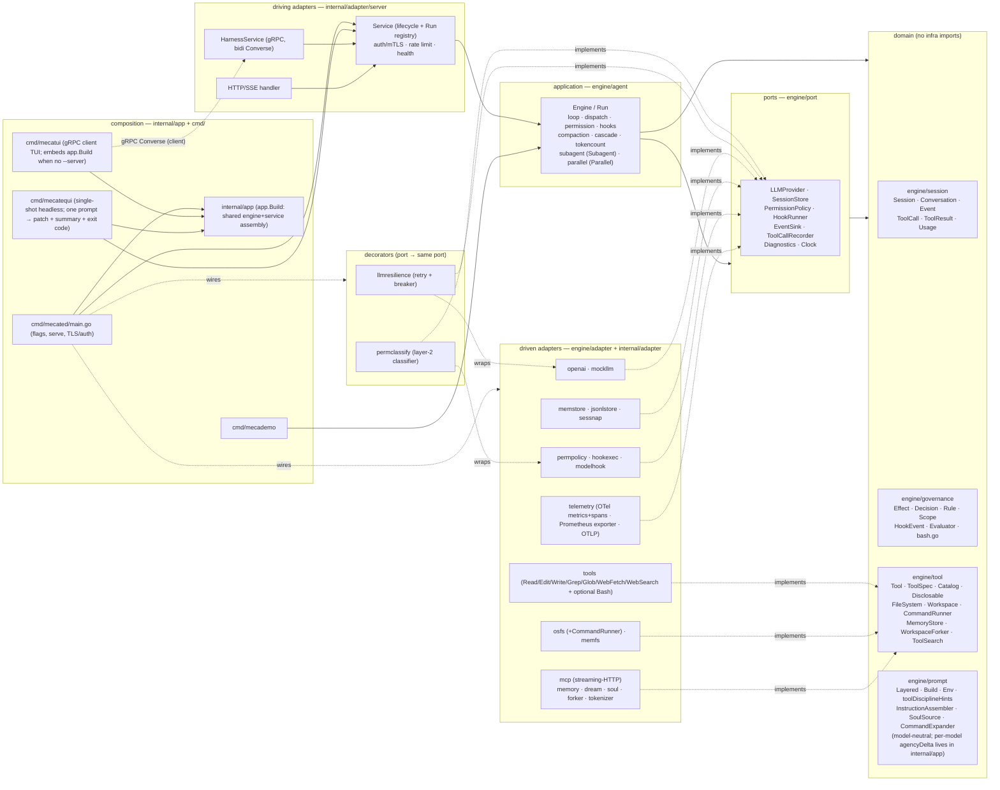

# mecatl — Architecture

> Reader-facing architecture guide. This describes the **code as it exists** in
> `engine/`, `internal/`, `cmd/`, and `contracts/`. Where the design notes in
> `docs/design/` differ from the implementation, this document follows the
> implementation.
>
> For the system's vocabulary — the canonical entities, their relationships, and
> the invariants that must hold — see the [domain model](architecture/mecatl.modelith.md)
> (a [modelith](https://github.com/stacklok/modelith) model; edit the `.yaml`
> source and re-render, never the generated `.md`).

## The guide

The architecture is split across focused, per-subsystem files (one fact, one file).
This page is the overview and router; the big picture and the layering rule are below.

- **[The domain model](architecture/domain-model.md)**
- **[The ports (`engine/port`)](architecture/ports.md)**
- **[The agent loop & permission pause/resume](architecture/agent-loop.md)**
- **[Hooks & guardrails](architecture/hooks-and-guardrails.md)**
- **[Subagents & teams](architecture/subagents-and-teams.md)**
- **[Providers — OpenAI adapter & multi-provider](architecture/providers.md)**
- **[The API surface](architecture/api-surface.md)**
- **[Observability, persistence & reliability](architecture/observability.md)**
- **[Context management & the compaction cascade](architecture/context-and-compaction.md)**
- **[Memory — cross-session recall & consolidation](architecture/memory.md)**
- **[Parallelism — fork-join](architecture/parallelism.md)**
- **[Extensibility — MCP, tools & progressive disclosure](architecture/extensibility.md)**
- **[Deployment & server hardening](architecture/deployment-and-hardening.md)**

## 1. What it is

mecatl is a **headless agentic coding harness**: a service (and library)
that runs the agent loop — call the model, stream its output, execute coding
tools, enforce permissions and hooks, and emit a single typed event stream.
There is no TUI. Clients drive it over **gRPC** (a bidirectional `Converse`
stream) or **HTTP/SSE**. Both surfaces speak one provider-neutral domain
`session.Event` and call the same application service; neither ever sees an
OpenAI type.

The system is built **hexagonally (ports & adapters) with a DDD core**.
Dependencies point inward only: a domain of pure value objects and aggregates
(`session`, `governance`, `tool`, `prompt`), a set of port interfaces the
application consumes (`port`), the application use-case layer that is the agent
loop (`agent`), and adapters that implement the ports (`adapter/*`). The core
tiers (domain, ports, agent loop) plus a small set of stdlib-only REFERENCE
adapters (`engine/adapter/*`: `mockllm`, `memfs`, `nofs`, `memstore`, `sessnap`,
`permpolicy`, `permstore`, `wallclock`, `search` (a fake web-search backend), plus
the conformance-as-contract suites `fsconformance`, `memconformance`,
`storeconformance`, `sourceconformance`, `eventlogconformance`) live
under `engine/` — the
importable core, fully self-contained (tests included: nothing under `engine/`
imports `internal/...`) and intended to be importable as a library by external
consumers — while the heavy adapters and the composition layer stay under
`internal/`. `engine/` **is its own Go module**
(`github.com/stacklok/mecatl/engine`), kept in this repo as a monorepo via a
committed `go.work`; its standalone dependency closure is just `doublestar` +
`x/sync` (+ test-only `goleak`), so an external consumer importing `engine/agent`
pulls in that small set rather than mecatl's full require cone (see
[ADR 0036](adr/0036-engine-module.md)). The exported identifiers of the **seven
core packages** (`session`, `governance`, `tool`, `prompt`, `port`, `team`,
`agent`) are the engine's STABLE public surface, governed by a compatibility
contract ([`engine/COMPATIBILITY.md`](../engine/COMPATIBILITY.md)) and enforced
by the `api-compat` gate — a change to that surface fails CI until the committed
`engine/api/*.txt` snapshots and `engine/CHANGELOG.md` are updated
([ADR 0037](adr/0037-engine-stability-contract.md)); the `engine/adapter/*`
reference adapters carry no such promise. The LLM provider sits behind the `port.LLMProvider` seam, with each
wire format isolated entirely inside its own adapter — the OpenAI Responses API
in `internal/adapter/openai`, the native Anthropic Messages API in
`internal/adapter/anthropic` ([multi-provider](architecture/providers.md)) — so the core is provider-agnostic and
unit-testable against fakes (`mockllm`, `memfs`, `memstore`).

Around that core, every capability beyond the minimal loop is a **seam with a
default and a swap-in adapter**, so the production build stays static and
network-free unless you wire something in. The current adapters cover, grouped:
**reliability** (`llmresilience` retry/breaker decorator), **observability**
(`telemetry`: OTel metrics + runtime collector via a Prometheus exporter, OTel
spans over OTLP), **security** (server auth/mTLS, rate
limiting, the `permclassify` model-based risk classifier), **context management**
(`tokenizer` + the `CascadeCompactor`), **memory** (`memory` + `dream`),
**parallelism** (`forker` fork-join), and **extensibility** (the `mcp`
streaming-HTTP client). Each is detailed below.

## 2. The big picture

**Dependency direction is inward only.** The allowed-imports rule, stated by the
per-package `doc.go` files and honoured by the code:

| Package | May import |
|---|---|
| `session`, `governance`, `tool`, `prompt` (domain) | stdlib + other domain packages. Never `adapter`, `agent`, `contracts`, `os`, or any third-party library. |
| `port` | domain packages + stdlib (`context`, `io`, `iter`, `time`). |
| `agent` (application) | domain + `port` + stdlib only. Never an adapter or `contracts`. (Tests may import adapters.) |
| `adapter/*` | domain + `port` + the one external lib it adapts. Never `agent`. (Deliberate adapter→adapter carve-outs: (1) `adapter/mcpperf` may import `adapter/telemetry` solely for the `RuntimeSnapshot` data DTO it projects into tool output — a plain JSON struct with no OTel/SDK types, not a behavioural dependency; the DTO stays in `telemetry` by design. (2) `adapter/soul` AND `adapter/memory` import `adapter/skills` for `ScanForInjection` — the conservative role-override deny-list is shared so the soul (load-time) and the user-model RememberUser write path (write-time) reuse the same injection gate rather than copying the regexes. (3) `adapter/{permconfig,skills,agents,soul,memory}` import the leaf `adapter/xdgconfig` for the shared `ResolveEnv`/`UserConfigDir` XDG path-resolution seam — a stdlib-only adapter leaf, extracted to de-duplicate the copies (the user-model store resolves `<xdg>/mecatl/usermodel` through it). (4) `adapter/soul` and `adapter/memory` import the DOMAIN `engine/prompt` for a single compile-time assertion only — `var _ prompt.SoulSource = (*Store)(nil)` (soul→prompt) and `var _ prompt.UserModelSource = (*Store)(nil)` (memory→prompt) — pinning that each adapter satisfies the consumer-local prompt port it is bound to at composition. These are assertion-only edges (no prompt value is constructed or called); the adapters meet the ports structurally, and `engine/prompt` never imports them. |
| `contracts/gen` | generated; protobuf + gRPC runtime. |
| `app` (composition) | the shared engine/service assembly (`app.Build`). MAY import adapters + `agent` + (via `server`) `contracts/gen`. Nothing imports it but the `cmd/` mains. |
| `cmd/*` | flags + serving; consumes `internal/app`. With `app`, the only places concrete adapters meet ports. |
| `cmd/mecatui/{client,ui,theme}` | a gRPC **client**. `contracts/gen` + grpc + `internal/app` appear only in `client`, `embed`, and the `cmd/mecatui` main; `ui` and `theme` import none of them and **never** any `internal/...` package. |

**mecatui — the terminal UI (`cmd/mecatui`).** An optional gRPC *client*. It dials
the `HarnessService`, creates a session, opens the bidi `Converse` stream, and
renders the streamed `Event` envelopes (glamour markdown for assistant text,
themed lipgloss cards for user prompts and tool I/O), resolving permission asks
inline by sending `ResumeApproval` on the same stream. The server it talks to is
either an external `mecated` (`--server`) or one it **hosts in-process** over a
UNIX socket (`cmd/mecatui/embed` → `app.Build`) when none is given — so a single
binary works with no daemon. The render packages stay pure: they render **purely
from proto `Event`s** and are bound by the inward-only layering rule. The
`contracts/gen` + grpc + `internal/app` surface lives only in `cmd/mecatui/client`,
`cmd/mecatui/embed`, and the `cmd/mecatui` main; the `ui` (Bubble Tea
model/update/view) and `theme` (pure styling) packages import no `engine/...` or `internal/...`
package and no proto directly. Usage and theming are documented in `docs/tui.md`.

**mecatequi — the single-shot headless runner (`cmd/mecatequi`).** A fourth composition
root and a *peer of `mecademo`* over the same `app.Build`: it runs **one** prompt against
an in-process `server.Service`, drives it to a terminal state, and emits three
artifacts — a working-tree git diff (modified, **added**, and deleted files: `git diff
HEAD` plus a `git diff --no-index` new-file hunk per untracked file, so a downstream `git
apply` reproduces new files too), a machine-readable run-summary JSON (`Summary`,
additive-only contract), and an optional durable JSONL event log — then maps the terminal
`StopReason` to a process exit code (`0` clean incl. the honest non-completions, `1` run
failure/cancel/timeout, `2` setup failure). Unlike `mecated` it owns no listeners, TLS,
auth, or telemetry pipeline; unlike `mecatui` it has no UI. It defaults `--headless`
(inverted from `mecated`): a CI run has no approver, so a child ask auto-denies or routes
to the opt-in ask-reviewer, and a *main-engine* ask under `posture strict` cancels the run
with an actionable message (the intended CI posture is `--posture auto`). It is **forge-
agnostic** — the GitHub-Actions glue that turns an issue into a pull request (a composite
action + a split-privilege workflow) lives entirely under `.github/` and changes no Go.
See `docs/adr/0028-mecatequi.md`. The three real-provider mains (`mecated`, `mecatui`,
`mecatequi`) share provider credential + base-URL wiring through `internal/cliconfig`, so
all three read the same `OPENAI_API_KEY` / `OPENROUTER_API_KEY` / `ANTHROPIC_API_KEY`
environment keys and register the same base-URL flags.

Two deliberate cycle-breaks worth noting, documented in code:
- `port` imports `tool` and `prompt` (because `LLMRequest` carries
  `[]tool.ToolSpec` and `prompt.Layered`) — see the package note at the top of
  `engine/port/llm.go`.
- `FileSystem`/`Workspace` live in `engine/tool`, **not** `engine/port`,
  because `port` already imports `tool` while `tool.Tool.Execute` takes a
  `Workspace`; defining them in `port` would form a `port↔tool` cycle. See the
  package note in `engine/tool/tool.go`.
- `governance` does **not** import `session` (so `session` can import
  `governance` without a cycle); the `Evaluator` works on primitive args, and
  the `permpolicy` adapter bridges `session` types into it.

## See also

- [Usage & operator guide](usage.md) — building, running `mecated`, every flag, and the gRPC + HTTP/SSE APIs that drive this design.
- [mecatui terminal UI](tui.md) — the gRPC client that renders the event stream described above.
- [ADR 0001 — the ACP adapter](adr/0001-acp-adapter.md) — the decisions behind the third (editor) wire surface.
- [Go performance measurement & observability survey](perf-measurement-survey.md) — the technique reference behind [observability & persistence](architecture/observability.md).
