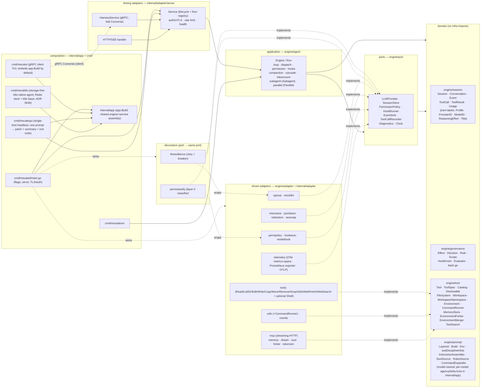

# mecatl — Architecture

> Reader-facing architecture guide. This describes the **code as it exists** in
> `engine/`, `internal/`, `cmd/`, and `contracts/`. Where the design notes in
> `docs/design/` differ from the implementation, this document follows the
> implementation.
>
> For the system's vocabulary — the canonical entities, their relationships, and
> the invariants that must hold — see the [domain model](architecture/domain-model.md).
> The accompanying [modelith](https://github.com/stacklok/modelith) model is a
> generated formal reference: edit its `.yaml` source and re-render, never the
> generated `.md`.

### How to read this

Start with this overview and the per-subsystem living guides below, which
describe the code as it exists today. The [ADR index](adr/README.md) is a
**historical *why* archive**: each ADR records the decision made at a point in
time and is frozen, so reach for it on demand to understand a rationale, not as
the primary introduction to a feature.

For a full progressive reader map — foundation spine, topic branches, and routes
for operators, library consumers, and researchers — see
[`docs/READING.md`](READING.md). This page covers the big picture and the link
list below; the reading map owns audience routing.

## Build identity

All shipped commands share the linker-stamped build identity in
`internal/buildinfo/buildinfo.go`. Ordinary `task build`, `task install`, and
Taskfile-driven ko builds resolve the source checkout at build time with
`git describe --tags --match 'v[0-9]*' --always --dirty`; this yields the most
recent root release tag, commits since it, abbreviated SHA, and an optional dirty
suffix (for example, `v0.0.22-28-g40a6b3fc6-dirty`). A nonempty `BUILD_ID` stamp
is retained exactly, including an explicit `dev`. Direct Go or ko builds with no
stamp never invoke git at runtime: they fall back to Go's embedded VCS metadata as
`dev+<12-char-vcs-revision>[.dirty]`, or to `dev` if metadata is unavailable or
invalid. Exact top-level `--version` exits before normal
startup. The server exposes its build identity plus sanitized diagnostic display endpoint projections through authenticated gRPC
`GetServerInfo` and HTTP `GET /v1/info?provider_id=<active-provider>`; neither endpoint reads session or workspace
state, and the provider display projection is available only when the caller supplies its already-known active provider and never triggers discovery or configuration reads. These values are not connection instructions. Mecatui's palette-visible `/diagnostics` converts the exact
lower-case command into a sanitized report sent through the normal model prompt path;
remote identity lookup uses the existing authenticated connection and exposes only fixed
failure categories.


## The guide

The architecture is split across focused, per-subsystem files (one fact, one file).
This page is the overview and router; the big picture and the layering rule are below.

**Foundations** (the linear spine — read in order):

- **[The domain model](architecture/domain-model.md)** — the Session aggregate, Conversation, Events, ToolCall/ToolResult value objects.
- **[The ports (`engine/port`)](architecture/ports.md)** — the seams the loop consumes: `LLMProvider`, `SessionStore`, `PermissionPolicy`, `HookRunner`, and the `tool.Workspace`/`FileSystem` seam.
- **[The agent loop & permission pause/resume](architecture/agent-loop.md)** — `Engine.Run` / drive algorithm, dispatch (read-parallel / mutate-serial), and permission pause/resume.

**Topic branches** (stand alone; each lists its prerequisite):

- **[Hooks & guardrails](architecture/hooks-and-guardrails.md)**
- **[Subagents & teams](architecture/subagents-and-teams.md)**
- **[Providers — OpenAI adapter & multi-provider](architecture/providers.md)**
- **[The API surface](architecture/api-surface.md)**
- **[Observability, persistence & reliability](architecture/observability.md)**
- **[Local microVM execution environments](architecture/microvm-environments.md)** — opt-in runtime boundary, path model, artifact/network trust, lifecycle, and operations.
- **[Context management & the compaction cascade](architecture/context-and-compaction.md)** — token counting, compaction, and the shared configured/live/catalog context-window resolver.
- **[Memory — cross-session recall & consolidation](architecture/memory.md)**
- **[Parallelism — fork-join](architecture/parallelism.md)**
- **[Extensibility — MCP, tools & progressive disclosure](architecture/extensibility.md)**
- **[Session titles & durable token accounting](architecture/domain-model.md#session-titles-and-durable-token-accounting)** — operator renaming, opt-in asynchronous generation, and canonical token usage.
- **[Deployment & server hardening](architecture/deployment-and-hardening.md)**

### Protected-resource discovery

Both `mecated` and `mecak8s` use the shared OIDC profile flags. When configured,
`--oidc-resource` publishes the RFC 9728 canonical resource and
`--oidc-client-id` publishes mecatl's public client hint; `--oidc-scopes` is the
shared CSV syntax and a narrow operator-configured request allowlist (a comma is a
separator, never part of one scope token). mecatui requests exactly the confirmed
advertised scopes. When metadata omits `scopes_supported`, it requests the fixed
`openid,profile,offline_access` baseline. Discovery rejects `--scopes`; administrators
configure `oidc.scopes` for other scopes. The list is neither server authorization
policy nor expanded from later metadata. Explicit identity login retains its `--scopes`
override. These values are not inferred
from listeners or request headers: the canonical configured resource is the explicit
service-wide protected-resource identity. Its direct well-known endpoint serves
metadata; protected subordinate API routes return a generic `Bearer` challenge because
their path and untrusted Host cannot prove that exact identity. Discovery is an
anonymous HTTPS bootstrap path distinct from authenticated gRPC. The
client-side flow is a narrow Apache-2.0-attributed adaptation of ToolHive and
ToolHive-Core behavior; neither is an engine dependency. Existing issuer/audience
projection and explicit OIDC login remain compatible.

### Internal credential store

`internal/adapter/credentialstore` is a host-internal, credential-format-agnostic
port for opaque binary records. It stays under `internal` rather than `engine/port`
because the engine is not its consumer. Its `Reader` contract provides lookup,
capabilities, and lifecycle operations; `ConditionalWriter` provides create-only and
version-matched replace/delete; mutable `Store` embeds both. Mutability is represented
by the implemented interface, not a capability bit that could disagree with it.

The optional adapter-local MCP OAuth controller borrows either one mutable Store or one
read-only Reader. Those options are mutually exclusive, and no independently supplied
writer is accepted, so reads and writes cannot cross CAS domains. It never constructs or
closes a backend. The opt-in `mcp/oauthlogin` host runtime and `internal/app.LoginMCP`
one-shot operation can populate a mutable store by driving a real protected MCP initialize
and tool listing through a random IPv4-loopback callback. RFC 9207 callback issuer
validation is conditioned on authorization-server metadata: an advertised
`authorization_response_iss_parameter_supported` requires a matching `iss`; an
unadvertised server may omit `iss`, while any supplied value must still match the discovered
issuer. The strict operator-tier
`mcp.servers` schema and the single `internal/cliconfig` loader feed all three headless
roots. Normal serve, ACP, mecatequi, and mecak8s install no presenter; only
`mecated mcp login SERVER [--no-browser] [--permission-config PATH ...]
[--reset-dcr-registration | --retry-dcr-registration]` authorizes a
mutable local profile, selecting trusted operator settings through the same resolver and
precedence as serve; the option never carries OAuth values. A hermetic cross-boundary gate
proves preregistered login-process exit, warm serving, lazy refresh with durable refresh-token
rotation, and transparent MCP-session reconnect through the model-visible global catalog.
Direct DCR profiles instead persist a separate public-client registration and a
generation-bound no-refresh access grant. A valid registration is reused across explicit
logins; expiry returns login-required without refresh or browser launch, while the two
DCR-only login modifiers explicitly retry an identity-matching pending attempt or replace a ready registration. Ready identity drift is reset-required. Pending identity drift is the distinct pending-identity-mismatch category and cannot retry or reset; restore the matching profile, principal, canonical resource, and exact issuer first.
No reauthorization occurs across restart or reconnect while the selected credential remains
valid. The global manager/controllers close before loader-owned Stores and Readers. ACP
cannot provide OAuth profiles or install/drive authorization, but after operator
authorization ACP sessions may invoke the shared global OAuth-backed tools under ordinary
permissions. The native direct-MCP wrapping-key custody is a separate, fail-closed seam. Its
owner-only `mcp-credential-backend.json` marker binds the native namespace,
backend, canonical locator, and a random initialization identity. First setup
publishes a `pending` marker before creating the file/keyring artifact, then
atomically replaces it with `ready`; a later run may recover only a matching
pending marker. An arbitrary unmarked artifact is never adopted, overwritten, or
deleted. Attended fallback confirmation is performed without retaining the root
lock while cancellation or operator input is pending.

The explicit environment Reader maps one configured opaque key to one configured lookup
function and strict base64 environment value. It does no global lookup, listing, or
mutation. A read-only source supports warm restore; new authorization and reset require a
mutable Store. Expired-token refresh fails before network by default. An explicit
process-local mode may retain a refresh only in memory, without changing the source or
claiming restart durability. Kubernetes Secret-backed environment variables are immutable
for a running pod. Durable rotation therefore requires an external controller plus pod
restart, or a future Secret backend using `resourceVersion` CAS; no Kubernetes API writer
exists here.

Memory and local encrypted storage are Store adapters. Encrypted-file consumers must
explicitly inject an absolute root and an exact 32-byte key acquired elsewhere. Both
share create-only and version-matched replace/delete semantics. The file backend hashes
names, encrypts strict bounded envelopes with AES-256-GCM and location-bound AAD, and
serializes the complete CAS under stable per-record flock sentinels. Supported Unix
stores enforce owner-only modes and reject symlinks, special files, hard links, and
wrong ownership. Its guarantee is cooperating-process, single-host, local-filesystem
only; same-UID attacks, authenticated rollback, crash-left encrypted temporary files,
and non-local flock/rename behavior remain outside it. See [ADR 0218](adr/0218-credential-store.md).

Native LLM endpoint OAuth records use the separate `mecatl/provider-oidc/v1`
namespace and always remain encrypted. The shared operator-only `llm.credential_key`
selects OS keyring custody by default or explicit `source: environment` with a `MECATL_*`
`key_env` reference to canonical padded base64 encoding exactly 32 bytes. There is no
fallback, implicit key generation in environment mode, or migration; source/reference do
not enter record identity. Their authenticated identity includes the endpoint, canonical gateway,
exact issuer and client, optional resource audience, normalized scopes, fixed redirect, and
separate issuer/gateway trust-policy and loaded-CA digests. A configured audience stays
part of the exact identity and is requested and matched; omission skips both. A hashed owner-only
endpoint transaction flock surrounds load, refresh exchange, and record CAS; rotated
refresh material is committed and ambiguous commits are exactly reread before a
bearer is returned. This serializes cooperating processes but is not a provider/store
transaction journal: a process crash after provider-side refresh-token rotation and
before local CAS persistence can invalidate the saved token and require a new login.

The session-scoped MCP broker is a process-wide in-process runtime owned by `app.Built`.
Broker authority is exclusive of programmatic global `MCPServers`; `app.Build` rejects a
mixed configuration after resolving the effective authority, including a loader result,
before constructing MCP, broker-process, or Redis resources. It accepts multiple configured
OAuth upstreams. ToolHive owns their ordered browser flow, callback state, PKCE/code exchange,
refresh, and provider-specific backend token injection. A protected backend with static `tools:`
declarations is visible immediately; those declarations are pre-authentication placeholders only,
and a first call starts that same opaque ToolHive bundle authorization. After the grant, authenticated
discovery replaces or removes the declared placeholders before the parked call resumes; definitions
without declarations remain hidden. Pre-prompt enrollment remains the path for the complete frozen
catalogue, including undeclared backends and tools. Each protected ToolHive process generates one
confidential broker client; ToolHive persists only its hash, and mecatl retains the
raw secret only in private process memory for HTTP-Basic code exchange and refresh
([ADR 0312](adr/0312-confidential-toolhive-broker-client.md)). Public enrollment controls carry aggregate status, a
service count, an opaque reference, and a presentation URL—not upstream names, endpoints,
callback state, codes, or tokens.

`mecated` and `mecak8s` mount ToolHive's fixed broker handler bundle on their existing
primary HTTP mux before the API catch-all; no second listener or context-value catalogue
channel exists. The same broker origin has two callback roles: every upstream provider returns
to ToolHive's fixed `/v1/mcp/broker/oauth/callback` prefix, while ToolHive's completed chain
returns to the operator-configured final mecatl callback URL. Ingress must route the complete
fixed broker prefix as well as that final callback path to the listener. The final callback URL
is operator configuration, not a client-supplied route. In Helm, broker OAuth requires the
chart-supported OIDC verified-caller configuration; its authorization is a browser/session
flow and a preregistered client secret remains a Kubernetes Secret reference, never broker
profile data.

Authenticated discovery results remain staged until the opaque pre-prompt enrollment succeeds.
Mecatl then admits every live definition through the shared protected-route validation boundary,
collision-checks the complete result, and atomically replaces all static placeholders with that
session's authenticated membership, descriptions, schemas, and read-only hints. A declared tool
omitted by live discovery disappears; an undeclared live tool appears. The resulting catalogue is frozen for the session, so later runs and token refreshes do not
rediscover it. Initial enrollment performs a fresh discovery; an explicit owner-controlled
refresh may perform the same whole-bundle discovery after a completed turn or after broker
process loss. A failure admits no mixed or partial catalogue.

Direct/global MCP uses a separate Build-owned reconciler. ToolHive-only bounded
polling, current-runtime list notifications, and explicit refresh build complete
immutable runtime candidates and publish one revision atomically. Root runs,
direct teams, and resource/prompt operations pin one revision. Automatic cycles
update availability without widening durable authority; an explicit owned-session
refresh stable-unions missing active direct names. `ListMcpSources` reads cached
published/pre-shadow inventory and revision, stale, and reconciling status without
probing.

In a broker-only
session with eligible frozen tools, `CallMcpWithQuery` is attachment-bound: it invokes the
same frozen route and authorization transaction, applies bounded in-memory jq before normal
result rendering, and never opens a direct upstream connection or exposes the raw successful
result. Normal mecatl permissions govern the frozen tools. `server.Service` holds only local attachments, and each per-session catalogue is
assembled from an explicit wrapper-tool slice after the canonical session ID is reserved. The
session snapshot persists an opaque broker-incarnation binding and reload requires an exact
match. Ordinary `CloseSession` detaches locally, while permanent owner deletion and retention
also delete broker transactions, grants, and replay state.

This runtime retains a process-local mecatl session/attachment boundary. A persisted binding from a prior process is never inferred as live: ordinary rehydration leaves broker tools unavailable and does not attach, discover, refresh credentials, or open browser consent. An owner-authorized stable idle session may explicitly invoke the existing whole-bundle refresh control; it withdraws the old wrappers before replacement and admits them only after complete authenticated discovery and persistence. ToolHive's configured Redis storage may preserve its inner authorization/token state, but mecatl makes no grant-reuse guarantee and never exposes that material. Durable/remote outer broker ownership and multi-replica routing remain later-stage concerns.
OAuth broker mode is therefore not safe behind mecak8s's default multi-replica Service until an
affinity or durable-broker decision is made; the chart enforces `replicaCount: 1` when broker
callback mode is configured and does not silently change its replica behavior.

The owner-scoped broker connector inventory is available to authenticated mecatui
sessions through `/mcp` when the server advertises its broker-status capability. The
panel intentionally stays concise: enrollment and declared/discovered connector rows are
broker-local publication facts, not a connection test. It neither enables direct
resources/prompts nor probes upstreams or persists a status cache. Its
panel explicitly distinguishes that publication from session installation,
persistence, prompt readiness, current authorization, and live health.

The [formal domain model](architecture/mecatl.modelith.md) (generated by modelith) is a supporting reference — start with the prose [domain model](architecture/domain-model.md) for the human walkthrough.

## 1. What it is

mecatl is a **headless agentic coding harness**: a service (and library)
that runs the agent loop — call the model, stream its output, execute coding
tools, enforce permissions and hooks, and emit a single typed event stream.
There is no TUI. Clients drive it over **gRPC** (a bidirectional `Converse`
stream) or **HTTP/SSE**. Both surfaces speak one provider-neutral domain
`session.Event` and call the same application service; neither ever sees an
OpenAI type.

The system is built **hexagonally (ports & adapters) with a DDD core**.
Dependencies point inward only: a domain of pure value objects and aggregates
(`session`, `governance`, `learning`, `tool`, `prompt`), a set of port interfaces the
application consumes (`port`), the application use-case layer that is the agent
loop (`agent`), and adapters that implement the ports (`adapter/*`). The core
tiers (domain, ports, agent loop) plus a small set of lightweight REFERENCE
adapters (`engine/adapter/*`: `mockllm`, `memfs`, `nofs`, `memstore`, `sessnap`,
`permpolicy`, `permstore`, `wallclock`, `search` (the graduated web-search tool body + Exa/HTTP/SearXNG providers + offline fake, #363),
`webfetch` (bounded public HTTP(S) text retrieval with DNS-pinned dialing and `x/net/html` extraction),
`fstools` (the FS tool bodies), `agentfs` (the filesystem agent-def discovery adapter), `skillfs` (the read-only skills discovery core + Skill tool body), `rulesfs` (the `.claude/rules` discovery adapter, issue #329 — the pattern-2 turn-0 context instance), plus
the conformance-as-contract suites `fsconformance`, `memconformance`,
`storeconformance`, `sourceconformance`, `eventlogconformance`,
`attemptconformance`, and `automaticconformance`) live
under `engine/` — the
importable core, fully self-contained (tests included: nothing under `engine/`
imports `internal/...`) and intended to be importable as a library by external
consumers — while the heavy adapters and the composition layer stay under
`internal/`. `engine/` **is its own Go module**
(`github.com/stacklok/mecatl/engine`), kept in this repo as a monorepo via a
committed `go.work`; its standalone dependency closure is just `doublestar` +
`robfig/cron` + `github.com/goccy/go-yaml` + `mvdan.cc/sh/v3/syntax` + `x/net/html` + `x/sync` (+ test-only `goleak`), so an external consumer importing `engine/agent`
pulls in that small set rather than mecatl's full require cone (see
[ADR 0036](adr/0036-engine-module.md)). The exported identifiers of the **eight
core packages** (`session`, `governance`, `learning`, `tool`, `prompt`, `port`, `team`,
`agent`) are the engine's STABLE public surface, governed by a compatibility
contract ([`engine/COMPATIBILITY.md`](../engine/COMPATIBILITY.md)) and enforced
by the `api-compat` gate — a change to that surface fails CI until the committed
`engine/api/*.txt` snapshots and `engine/CHANGELOG.md` are updated
([ADR 0037](adr/0037-engine-stability-contract.md)); the `engine/adapter/*`
reference adapters carry no such promise. The **real LLM-provider wire adapters**
are their own **opt-in Go submodules** under `provider/` ([ADR 0093](adr/0093-provider-modules.md)):
`provider/anthropic` (native Messages API), `provider/openai` (Responses API),
`provider/openaichat` (Chat Completions API), and `provider/ssefilter` (the shared
SSE keepalive filter). Each is a separate module requiring the engine module plus
its own SDK, so a consumer embedding the engine `go get`s exactly the provider(s)
it wants and pulls only that SDK — never the root module. They release under
`provider/<name>/vX.Y.Z` submodule tags. Three sibling efforts harden the same
embeddable-core arc: the engine is now **fully clock-injectable** — every core
wall-clock read flows through `port.Clock` (`Engine.now()`), enforced by an AST
guard (`engine/arch/clock_test.go`) so an embedding host can drive it
deterministically (#116); `port.SessionStore.Load` carries a documented
**event-sourced reconstruction contract** so a host whose system of record is an
append-only log can fold its `EventLog` (+ `SessionMeta`) into a session via
`engine/adapter/eventsource.Fold` — the durable log now records the log-only
`EvUserPrompt` so user turns reconstruct, with a replay-fidelity caveat for
reasoning providers (#115, [ADR 0038](adr/0038-event-sourced-rehydration.md)); and the
supply chain gains per-module **`govulncheck`** (engine strict-clean; a
fail-closed reachable-vuln gate on the root) plus **Renovate** over the
modules, npm workspaces, and SHA-pinned actions, on a **go 1.27** toolchain (#118). The LLM
provider sits behind the `port.LLMProvider` seam, with each
wire format isolated entirely inside its own adapter — the OpenAI Responses API
in `provider/openai`, the native Anthropic Messages API in
`provider/anthropic` ([multi-provider](architecture/providers.md)) — so the core is provider-agnostic and
unit-testable against fakes (`mockllm`, `memfs`, `memstore`).

The ToolHive gateway composes those same two wire adapters as separate registry
identities backed by one detected gateway configuration: `toolhive` remains the
OpenAI Responses/default surface, while `toolhive-anthropic` exposes native
Anthropic discovery and Messages inference. Their inventories and health are
independent; their direct-mode OIDC source is shared. See the
[provider chapter](architecture/providers.md#multi-provider--registry-per-session-routing--model-inventory).

OpenAI has two deliberately separate registry identities. `openai` uses a public
API key and the supported public Responses API. Experimental `openai-codex`
uses a manually supplied ChatGPT Codex access-token snapshot against OpenAI's
undocumented private Codex backend. They are separate billing and entitlement
boundaries; configuring either one never enables the other. Composition applies
the Codex credential/header/model-inventory policy around the existing
`provider/openai.Provider`, so request building, stateless replay, successful SSE
translation, resilience, tools, and the provider-neutral engine port remain
single-sourced. See [the provider chapter](architecture/providers.md#experimental-openai-codex-subscription-provider)
and [ADR 0215](adr/0215-openai-subscription-manual-token.md).

### TypeScript SDK

The ESM-only `@stacklok-oss/mecatl-sdk` package lives in `sdk/typescript/`, with its
own pnpm lockfile and runtime-focused build/test gates kept separate from the Go
modules and the npm-based `website/` tree. A release tag stages an inspected
artifact on public npmjs through trusted publishing; a maintainer must approve
the candidate with 2FA before it becomes public
([ADR 0328](adr/0328-typescript-sdk-npmjs-stacklok-oss.md)). SDK releases begin
with a bot-authored PR that adds a generated `sdk/typescript/CHANGELOG.md` entry
and advances `sdk/typescript/VERSION` and `package.json` together. Merging that
exact three-file change makes the release App create the path-qualified tag. Its
public surface is split by
transport: `.` is the transport-neutral core plus the browser HTTP/SSE client,
`./node` contains the Node/Bun real-gRPC transport (TCP and UDS), `./deno`
shares that gRPC transport and adds Deno-native local-process ownership, and `./gen` is
reserved for protobuf-es types and service descriptors generated under
`sdk/typescript/src/gen/` from `contracts/proto/mecatl/v1/`. All transports feed
the same `Client`/`Session`/single-consumption `Run` layer: compatibility is checked
before ordinary calls; events and server errors are normalized into closed typed
families; controls carry the current run id; permission responders do not hide raw
ask events; and prompt media is validated before transport selection. Immediately before
protobuf-es decoding, the HTTP transport recursively follows the output descriptor and converts
stdlib-JSON `{seconds,nanos}` objects only at `google.protobuf.Timestamp` and
`google.protobuf.Duration` fields. ProtoJSON strings and `null` pass through, malformed objects
fail as typed HTTP protocol errors, and normalization uses a detached value so `getRawJson()`
retains the original unary or SSE data. JSON, well-known-type, and protobuf decode failures for
successful unary responses and ordinary SSE data frames expose only generic SDK messages, HTTP
status, and an available request ID; they omit decoder causes so rejected response text cannot
escape through runtime-specific exception messages. Body acquisition, server errors,
authentication, network, cancellation, and SSE reader failures stay outside that cause-free
boundary. UDS dials by
supplying connect-node's HTTP/2 node connection option for the socket path, never a
`unix://` base URL. Unit tests inject transports; `sdk/typescript/e2e/` separately
builds and spawns the same checkout's `mecated` with the offline mock provider to
prove TCP, UDS, HTTP/SSE, asks, cancellation, and stale controls on real wire.
The unbundled JavaScript names each sibling declaration through Deno's stable
`@ts-self-types` directive. CI checks the packed package at Deno 2.9.3 and current
Deno 2.x without unstable resolution flags. See
[ADR 0279](adr/0279-typescript-sdk-architecture.md) and
[ADR 0339](adr/0339-typescript-sdk-deno.md).

An ordinary `Run` can complete with a terminal result or park on
`authorization.required`. `Run.outcome()` represents both as normal detached values;
event iteration also ends cleanly after the park, while completed-only `Run.result()`
raises `RunAuthorizationRequiredError` with the same handoff. Each remains a mutually
exclusive consumption mode and releases the Session's live-run registration without
changing the server's pending authorization.

`Session.mcpAuthorization(authorizationId)` binds the handoff to the existing
session-affined operation bag. The reusable handle asserts no state and stores no
credential or lifecycle truth. `presentation()` returns one validated live HTTP(S) URL
for application-owned display without opening or persisting it. Each `recheck()` or
`cancel()` creates a distinct lazy, single-consumption flow. First consumption starts one
exact-affinity control request. The flow validates the authoritative status and optional
continuation into pending, settled, completed, or chained-authorization results. The SDK
does not poll, retry a mutation, reconnect, or choose a permission verdict. Automatic
permission responses use their separately declared request options and the existing
prompt-free exact-run controls. This lifecycle is limited to session-scoped ToolHive broker
handoffs; direct and global profiles remain host-local administration through `mecated mcp`.

Request cancellation releases only SDK-owned resources. The server decides what committed
before disconnect. gRPC detaches and drains ordinary continuation work but cancels a run
stranded on an ordinary permission ask. HTTP requests cancellation of a still-active
continuation and drains it. Both leave a follow-up authorization intact after its park is
committed. An application that observed the continuation run ID may use existing attach or
activity APIs for explicit recovery where storage retains it. Before that correlation is
observed, a lost control response can be unrecoverable, and a new recheck succeeds only if
the original authorization is still pending. See
[ADR 0348](adr/0348-typescript-sdk-mcp-authorization-lifecycle.md).

The `./node` entry point can also own a local daemon through `spawn()`. It resolves an
already-installed `mecated` from `binaryPath`, `MECATED_BIN`, then `PATH` without a
shell; creates a private per-client runtime directory; and launches the fixed UDS-only,
HTTP-disabled topology by default. The child inherits fd 3 as a lifetime socketpair, so
the daemon observes EOF if its Node parent disappears; `lifetimePipe: false` removes both
the fd and its flag without changing explicit shutdown. `http: true` opens only an
ephemeral loopback HTTP listener and honestly costs the deployment-scoped
`mcp_servers_on_create` feature. The SDK reads that feature truth from the ready document,
never from its own argv. The client is returned only after a complete `mecated-ready/1`
file is read and the first compatibility dial succeeds; its transport dials the document's
`socket_path`. Exit before that barrier is `spawn_failed`, while a live child that misses the
deadline is `readiness_timeout` and is stopped. Startup errors carry the end of a bounded stderr
tail after line-boundary truncation and whole-line credential-shape redaction. An optional
structured diagnostics sink receives the same safe report; without one, the SDK writes nothing
to `console`. Every post-launch failure stops the child before removing its private directory. A `SpawnedClient`'s
`daemon` getter exposes only the frozen pid, Unix transport, socket path, API major and
feature list; environment overrides are merged over the inherited parent environment but
are never projected there. Client disposal first cancels its owned runs and releases durable
watch activity, then stops status monitoring and any local tool host before closing its owned
transport. A spawned client next sends `SIGTERM` to its child handle, escalates to `SIGKILL`
after a bounded grace only while that handle is still running, and finally removes the runtime
directory. Connected clients acquire no process or directory ownership. Every teardown fault is
reported through diagnostics while later steps continue, and `close()` / `Symbol.asyncDispose`
share one non-throwing idempotent operation. A daemon exit outside disposal puts the client in a
terminal local `invalid_state`, emits one diagnostic, and prevents a dead socket from surfacing as
the later-operation error. See
[ADR 0292](adr/0292-typescript-sdk-local-daemon-and-tools.md).

The `./deno` entry point reuses `@connectrpc/connect-node` through Deno's Node
compatibility layer. Remote connections support TCP, TLS, and Unix sockets; client
assembly shares credentials, diagnostics, and transport ownership with Node/Bun.
The separate `Deno.Command` launcher starts one ephemeral loopback TCP gRPC listener
with HTTP disabled. The private ready document must declare TCP transport, the
captured child pid, and the SDK-owned loopback address before the first compatibility
call can complete. Deno holds the child's piped stdin open and
passes `--lifetime-stdin`; the daemon validates that pipe and treats EOF as
parent death. Explicit disposal closes the pipe, applies bounded signal
fallbacks through the child handle, and removes the temporary directory. Deno's
runtime permission system controls executable, filesystem, and loopback access.
The spawned TCP topology does not receive client-provided MCP authority. Deno returns
the ordinary `Client`; path media and callback-tool helpers remain in `./node`.
The packed-package floor/current qualification covers streaming, cancellation, TLS,
Unix sockets, and native process cleanup. See
[ADR 0341](adr/0341-typescript-sdk-deno-grpc.md).

The `./node` and `./deno` entry points expose `query()` as the one-shot layer over that existing
`Client`/`Session`/`Run` choreography. `await query(prompt, options)` resolves after session and
run acceptance to a single-consumption `Query` whose iterator yields the ordinary `Event` union
and whose `sessionId` identifies the session it created. Reaching the terminal result, returning
from the iterator early, or aborting its signal drives one cleanup ledger: cancel and drain an
unfinished run, delete the transient session unless `retainSession` is true, and close a client
only when the query spawned it. A caller-supplied client therefore stays open while the query's
default transient session is still deleted. Retention is bounded by the daemon's storage: it is
useful across calls with a supplied live client, while an SDK-spawned daemon uses an in-memory
store and is stopped when its owning query finishes. Plan mode requires `onPlanApproval` before
resource creation. A `PresentPlan` ask invokes only that plan-specific responder; approval drains
the same-ID plan run through `plan_approved`, then starts a fresh Converse stream carrying the
parity-pinned proceed prompt. The query iterator flattens both run streams. With no permission
responder, query denies an ordinary ask, emits one client diagnostic naming the ask and tool, and
continues the run; the raw `permission.ask` remains in the event stream.

Separately, `Session.resolvePlan()` addresses a durably parked plan with no local live run through
the server-streaming `ApprovePlan` RPC. Its single-consumption `PlanResolution` partitions the
merged wire iterator into two runs: the original-ID resumed plan run and, only after its
`plan_approved` terminal, an optional different-ID continuation run, requiring a terminal result
for each. A non-`plan_approved` resumed terminal has no continuation; malformed
ordering is a protocol error, while the server's empty-ID continuation-admission terminal becomes
a distinct typed continuation-start failure. Run-bound attachments end at their selected terminal;
`Session.activity()` remains the cross-run view. See
[ADR 0304](adr/0304-typescript-sdk-public-surface-and-release.md) Decision 4.

The committed concise examples under `sdk/typescript/examples/` self-import only the package's
four exported entry points. A dedicated no-emit project runs after the package build, so no source
path alias can hide an export/example drift. It covers remote and local Node/Bun use, callback
tools, Deno remote and local use, browser+BFF guidance, permissions, durable attachment, teams,
schedules, plan resolution, session lifecycle, capability discovery, MCP workspace enrollment,
and MCP authorization. The offline SDK e2e gate also compiles and executes the four latter
workflow entry points against controlled daemon or protocol fixtures. The browser BFF is
explicitly a deployment shape, not SDK server code. The larger
Slack bot remains a separate pnpm project and has its own package-export typecheck CI leg.

The test-only [high-level RPC inventory](../sdk/typescript/test/high-level-surface.test.ts)
classifies every public `HarnessService` and `ScheduleService` descriptor by the public SDK
operation that invokes it. The session handle invokes the two guardrail diagnostic RPCs through
`guardrailCoverage()` and `guardrailReviewDetail()`. `StreamSessionEvents` and `StreamSessionLive`
have individual raw-only rationales: durable `Session.activity()` and `attach()` instead use
`WatchSessionEvents`. This coverage guard checks handwritten invocation paths separately from the
raw transport catalog.
The [TUI builtin inventory](../cmd/mecatui/ui/sdk_high_level_parity_test.go) classifies all
actual builtin declarations by reusable SDK outcome or application, operator, and debug
ownership. These inventories are verification data; the SDK and `mecatui` remain independent
clients and share no command registry.

Spawned Node/Bun clients also expose `client.tool(name, schema, handler, options)` for a
client-wide callback-tool registry. Schemas are plain JSON Schema 2020-12 values compiled by the
`./node`-only validator; invalid schemas, duplicate names, namespace-forging names, and invalid
server names fail locally with `tool_registration`. On the first session create, the client
pre-flights `ListMcpSources`, refuses a resolved server-global namespace collision, and sends the
entire registry as one loopback HTTP `McpServerSpec` named `sdk` by default. A successful create
makes that registry immutable. Arguments are validated without coercion or default insertion and
then copied onto null-prototype objects before the handler sees them. Tools are mutating unless
`readOnly: true` is asserted; the SDK does not verify that assertion, and the harness uses the MCP
`readOnlyHint` to choose concurrent read dispatch. The Ajv dependency and callback-tool types stay
outside the transport-neutral `.` module graph. The concrete host is a stateless, hand-written
streaming-HTTP MCP subset on a literal ephemeral `127.0.0.1` listener. It handles the Go client's
`server/discover` fallback, legacy initialize negotiation, initialized notification, tool listing,
tool calls and ping as JSON while every non-POST method receives `405`. A per-client 256-bit bearer
travels only in the session's secret-shaped MCP headers over the daemon UDS; foreign `Origin` or
`Host` requests are refused before authentication, authentication precedes bounded body reads, and
the host emits no CORS headers.

Callback registration is available only when `spawn()`'s ready document advertises
`mcp_servers_on_create`; otherwise the loopback host is not started and `tool()` fails locally with
typed `unsupported_feature` before any RPC. A connected client always takes that local refusal,
while a feature-missing spawned client names `mcp_servers_on_create` in the error. Once a
tool-bearing create reaches the daemon, `client_mcp_unsupported` and `client_mcp_unreachable` remain
server-originated codes, and a refusal returns no `Session` and does not mark the registry as
successfully created.

Callback execution has eight client-wide slots, optional tighten-only per-tool limits, a bounded
queue and a wall-clock deadline whose `AbortSignal` is also fired by caller cancellation and client
disposal. Strings become text blocks, other JSON values become structured content plus a text
mirror, and explicit `CallToolResult` values pass through. Results larger than the harness's
25,000-byte tool-output cap are refused locally. A thrown handler value produces only a generic
model-facing error and correlation id; the original cause is available to the client's diagnostics
sink under that id, while an intentional `isError` result remains model-visible verbatim. Closing
the client aborts running calls, drops queued calls and releases the loopback port before transport
and daemon teardown.

The offline close-out suite drives this public surface rather than the older hand-written daemon
harness. Node Vitest starts the same checkout's `mecated --mock-script`, asserts callback results and
generic handler failures on the real Go MCP wire, and verifies the default gRPC and HTTP TCP ports
refuse connections while the UDS daemon is live. A built-package helper repeats spawn, callback and
clean shutdown under Bun; separate Node and Bun parents are killed to prove fd-3 EOF stops the child.
The SDK CI job pins both Node and Bun, so the hand-written host's discovery/initialize negotiation and
the two runtime-lifecycle claims fail together when either side drifts. Those callback fixtures select
the `noop` authority evaluator: a client MCP tool joins a per-session catalog after `mintRootAuthority`
has already projected the process-wide root catalog, so under the default local evaluator the exact
tool name is absent from the capability set and is denied after the permission ask has been allowed.
One fixture pins that default-posture denial. Making callback tools usable under the default evaluator
needs the root authority to carry a session's client MCP tool names, which is server work beyond
ADR 0292.

The durable-watch foundation uses the generated `WatchSessionEvents` descriptor on
both transports and decodes each wire frame into a four-arm `WatchEnvelope`:
`event`, the single replay-to-live `boundary`, cursor-free `gap`, or lossless
`unknown`. Envelope events pass through the same M1 event decoder, so unknown event
kinds retain transport-native raw data. The compatibility feature set is exposed at
the raw/client seam rather than owned by HTTP, allowing both transports to gate the
shared `watch_session_events` capability. See
[ADR 0288](adr/0288-typescript-sdk-durable-attachment.md).

`Session.attach(runId?)` builds the first ergonomic view over that watch. An explicit
run id is sent as the server filter; without one, the client opens exactly one
unfiltered watch, scans its replay to the boundary, selects the newest run id, and
filters that same stream client-side. A readable log with no run-bearing record raises
the local `NoRunsError`, including the deliberately documented interval where a run is
already stamped on a running session but has emitted no durable event. Unknown or
foreign sessions, unsupported watch deployments, missing logs, and delegation-child
ids remain distinct typed server refusals. `AttachedRun.live` reflects events observed
through that attachment and becomes false when its selected run delivers either a
terminal `result` or a valid pending `authorization.required` park with exact run
correlation and non-empty authorization and call IDs.

`Session.activity()` keeps both the server filter and cursor run binding empty, so one
ordered stream spans every run and also includes run-less `schedule.*` records. A run's
terminal `result` does not end this session-level timeline. Both views omit the event kinds
derived from the server's public/live relay filters by default; `includeLogOnly: true` adds
those records without changing the order or cursors of records already visible. The filter
applies only to event kinds: activity still yields a cursor-free `gap` delivery frame, then
raises `ActivityGapError` if the consumer asks to continue. A run-bound attachment preserves
its existing immediate typed-gap termination.

The attachment is one replay-then-follow operation: it yields the selected run's durable
replay in append order, announces the live boundary once, follows new appends, and completes
at either that run's terminal `result` or a valid pending `authorization.required` park. A
run that already reached either terminal therefore completes from replay without following.
`attach(runId, { from: "now" })` still opens the ordinary watch with an empty wire cursor and
receives the replay, but discards replay envelopes client-side before yielding the live
boundary; the mode is rejected locally when no explicit run id is supplied.

Ergonomic checkpoints are opaque, serializable `sdkcur/1` strings that wrap the server token
with the view's run binding and effective server filter. The SDK validates that envelope and
delivered-set scope before opening a watch: a run-bound cursor cannot widen to session
activity or another run, while an unbound activity cursor can narrow to any run. Checkpoints
advance when the consumer requests the next envelope, giving natural at-least-once delivery;
records dropped by the ergonomic filter advance immediately, and a filtered `approval` still
retires its permission ask. The SDK exposes the string for application-owned persistence but
does not write browser storage or files itself.

A decoded `gap` remains visible on the raw watch. A run-bound ergonomic attachment turns it
into a local `ActivityGapError` before yielding; session activity yields the delivery fact but
raises the same error on the next pull. Neither path checkpoints the gap, leaving the exposed
cursor at the last preceding envelope. Cursor faults use the same typed error classes on both transports:
gRPC carries the registry code in its terminal status, while HTTP has already committed 200 and
therefore carries it in a terminal `event: error` SSE frame. An expired cursor never triggers an
implicit restart from the beginning; that recovery remains an explicit application decision.

Attachment continuity is owned only by the durable watch. Transport failures,
`watch_lagging`, `watch_capacity`, authentication failures, and clean
non-terminal EOF reconnect with bounded exponential backoff and jitter from the
attachment checkpoint under the same filter. The client
invalidates and re-probes cached compatibility before each reconnect, so a replacement daemon's
feature set is authoritative on the first attempt. The closed permanent-code set ends the view;
ordinary mutations, prompts, permission verdicts, and owned run streams remain one-shot. An
`AttachedRun` stops after its own `result` or valid pending authorization park, while session
activity treats every clean EOF as a reconnect point. Reconnected watches do not re-announce
the replay-to-live boundary. An optional
`AttachOptions.signal`, iterator release, explicit disposal, or `Client.close()` aborts backoff and
releases the current watch without cancelling the run.

The client connection monitor combines its ordinary request outcome with one private input per
open attachment. It resolves those inputs by fixed precedence — `incompatible` above
`unauthorized`, `reconnecting`, `connecting`, `offline`, then `online` — so one healthy stream or
successful unary call cannot hide another attachment's retry. A retrying watch reports
`reconnecting` (or `unauthorized` while refreshing credentials) and never publishes the ordinary
request path's transient `offline`; its next envelope restores `online` once no higher-ranked input
remains. Opening an attachment does not subscribe to status or start/retain the heartbeat. Browser
visibility still pauses the subscriber-gated heartbeat, but it neither pauses nor detaches a watch.

Prompt-free run controls are independent of owned Converse streams and durable watches.
`Session.controls(runId)` constructs a synchronous local `RunControls` resource without probing,
attaching, or registering a live run. Its resolve-ask, cancel, steer, and steer-retraction methods
gate on `prompt_free_controls`, address the supplied run id exactly, and issue one bounded unary
request over gRPC or HTTP. All four methods carry ordinary request options. They neither retry nor
fall back to legacy controls, and a late operation cannot target a successor run. Steer accepts the
same structured text and media input as a prompt and returns the server's accepted-or-appended
outcome with the exact run and client correlation ids. Retraction returns retracted-or-none-pending
with the same correlations.

The unary acknowledgement is a delivery fact rather than an idempotency proof. A request can be
accepted before its response is lost to cancellation, deadline, or transport failure, so an
application reconciles an ambiguous outcome from authoritative session and durable-activity state.
Resolving a matching ordinary ask on a persisted awaiting run is the one prompt-free operation that
can rehydrate it. Acceptance transfers that resumed run to a server-owned context before the bounded
acknowledgement returns. Plan-originated asks stay under the separate plan-resolution choreography.

`AttachedRun` preserves its established compatibility surface instead of silently acquiring these
semantics. Its legacy `cancel()` retains its transport-specific behavior, while approval and steer
methods remain typed deferrals that direct callers to `session.controls(attached.runId)`. Aborting,
disposing, or leaving attachment iteration still releases only the watch.

The offline SDK lane exercises that contract against a same-checkout daemon rather than only
an injected transport. Its restartable harness rebinds the same listeners over one JSONL store:
an open `activity()` view resumes from its consumption checkpoint and observes a newly minted run,
while a run-bound view crosses restart only in the persisted-awaiting case. Prompt-free control
coverage drives successful root and surfaced-child ask resolution, cancellation, text and media
steer, retraction, strict stale/error results, request cancellation and deadlines, and bounded
acknowledgement-only rehydration across gRPC TCP, UDS, and HTTP. The attachment suites retain their
stale-guarded cancellation, terminal SSE cursor errors, and default log-only filtering proofs.

### Mecatl Studio

Mecatl Studio is the browser UI, kept in the repository as the self-contained pnpm
workspace `apps/` (`apps/web`, `apps/server`, `apps/contracts`; its own lockfile, pnpm
12 pin, Biome config, and `apps/Taskfile.yml`, included in the root Taskfile as
`studio:*`). It is a **client** of mecatl in the same sense the TypeScript SDK is, one
layer further out: `apps/server` is a Hono backend for frontend (BFF) that depends on the
**published** `@stacklok-oss/mecatl-sdk` from npm by a semver range — never on
`sdk/typescript` by path or `workspace:` link — so Studio builds without a Go toolchain
or the SDK's build, its Docker build context is `apps/` alone, and the UI lags the daemon
by one SDK release on purpose. The boundary has three sides: the **browser** runs the
Vite + React SPA in `apps/web` and calls only the BFF's `/api/v1` product API, importing
`@mecatl-studio/contracts` and its generated query client but neither the SDK nor any
daemon protocol type; the **BFF** holds the user's credential and forwards it per request
through the SDK credential provider bound to the request's `AsyncLocalStorage` context,
serving the SPA and `/api` from one origin; **mecatl** is reached only by the BFF. The
BFF's `/api/v1` routes describe product capabilities rather than mirroring daemon
endpoints, and `apps/contracts` (Zod schemas, the generated `openapi.json`, the generated
Hey API client) is committed and drift-gated like `contracts/gen` and `engine/api/*.txt`.

At startup the BFF resolves exactly one **runtime mode** from the environment:
`external` (`MECATL_BASE_URL`, an existing gRPC listener), `spawn` (a local `mecated`
from `MECATED_BIN` or `PATH`), or `mock` (`MECATL_DEV_MOCK=1`, `mecated --mock`); a
conflicting combination exits non-zero before listening. Configuration is split by
ownership — `MECATL_*` describes the target, `STUDIO_*` is Studio's own. Interactive
login is Authorization Code + PKCE against the single issuer named by the target's
RFC 9728 protected-resource document (fetched for `MECATL_RESOURCE_URL`, or derived
from `MECATL_BASE_URL`); a `404` from discovery disables interactive login, any other
discovery failure is a startup error, and a static token (`MECATL_AUTH_TOKEN`) or an
issuer-less target yields the `static` / `none` auth modes, which WARN because every
browser then acts as one principal. The **session model** is stateless: no server-side
store, four `SameSite=Lax` cookies (`studio_access` and `studio_refresh` HttpOnly and
sealed with AES-256-GCM under a key derived from `STUDIO_SESSION_SECRET`, `studio_login`
for the in-flight PKCE transaction, and `studio_csrf` as the double-submit token), so
every replica shares one secret and scales horizontally behind mecak8s with no new
infrastructure. `Secure` flags and the callback origin derive from `STUDIO_PUBLIC_URL`,
never from the request scheme, because production TLS terminates at an Ingress.

`GET /api/v1/status` is the sole anonymous `/api/v1` exception. It returns only a
coarse connection state (`checking`, `reachable`, or `unavailable`) and whether this
browser needs to sign in. A daemon authentication rejection proves transport
reachability; a transport failure reports unavailable even when sign-in is also
required. Detailed `/api/v1/runtime`, settings, storage health, and feature routes
retain the OIDC session gate. The browser uses the public status for its shell
banner, giving outages priority over sign-in, and reads storage health only after
authentication. OIDC sign-in can complete in a same-origin popup through the
existing callback URL. The opener verifies the callback message's origin, source,
and active attempt, then checks the BFF session; the callback message carries only
a success or failure result. A blocked or closed popup leaves the route and draft
mounted with retry and a manual new-tab sign-in path. After a same-account session
recovery, reads refetch; mutations and streams await explicit user retry. The
BFF's authenticated session response can include a validated email claim from
the verified ID token. The raw subject stays in sealed server-readable
credentials; the browser receives only the opaque account key for identity
comparison. An OIDC session without that identity fails closed.

The **image** is one origin: a multi-stage `Dockerfile` compiles `apps/web` and
`apps/server` to `dist`, prunes the server to production dependencies with
`pnpm deploy --prod`, and copies them onto `cgr.dev/chainguard/node` pinned by digest
(the `.ko.yaml` posture), running `node dist/index.js` as the base's non-root user with
`STUDIO_IMAGE=1` set — which refuses the spawn and mock modes and requires
`STUDIO_ALLOW_UNAUTHENTICATED=1` for static/none auth. It is published as
`ghcr.io/stacklok/mecatl/studio` by the `publish-studio` release job with the same sign,
SBOM, and provenance steps as the Slack bot image, labelled
`org.stacklok.mecatl.studio.stability=early-access` because Studio can change without
notice between versions; `apps/docker-compose.yml` runs it against a locally built `mecated` for
development. CI gates it with its own `studio` job and path-relevance category
(`apps/*|.github/*|Taskfile.yml`), separate from the Go and SDK families because
neither can change it. The bootstrap shipped health, runtime status, auth, and the shell;
each feature port is a Bounded follow-up with its own acceptance plan, since new
`/api/v1` routes and contract schemas are a public BFF interface. **Chat** is the first
feature: `/api/v1/sessions…` carries the session inventory (paged through the SDK,
`inspect_only_kind` rows filtered, delete/rename capabilities relayed from the daemon),
creation with mode / model / reasoning effort / `toolAccess` (`noFilesystem` → the
`no-fs` profile), detail with cumulative usage, rename, delete, mode, compaction, fork,
clear, and the transcript; runs, replays (`…/activity`), and retries stream as
Server-Sent Events carrying Studio's own `type`-discriminated union — `run.started`,
`run.event`, `run.truncated`, `run.error` — where `run.event` wraps the SDK event with `bigint` counters
as decimal strings and an SDK kind the SDK does not model forwarded as `unknown: true`
with its wire kind and raw payload, so protocol drift stays visible instead of being
dropped. Replay is bounded and resumable rather than unconditional: every `run.event`
frame carries its durable cursor in the SSE `id` field, a request resumes exactly after
the cursor in `Last-Event-ID` (or the `resumeFrom` query parameter), a no-cursor replay
stops after `STUDIO_ACTIVITY_REPLAY_MAX` durable replay events with a
`run.truncated` frame that points the client at the authoritative transcript, a durable
gap ends the stream rather than streaming across the hole, an unusable cursor is `400`,
and a session admits `STUDIO_ACTIVITY_MAX_STREAMS` concurrent streams per replica so one
browser cannot impose unbounded historical reads. Live events stay unbounded; cancel, steer, and permission verdicts address the exact durable run through the
SDK's control handle and answer `409 stale_run_control` for an ended one. Every mutation
sits behind the bootstrap's same-origin + double-submit CSRF check and, with interactive
login active, the `401` session gate. **Schedules** is the second feature:
`/api/v1/schedules…` projects the daemon's ScheduleService (cron or one-shot trigger,
permission mode, tool profile, fire history) through a contract that is capability-gated
live on the negotiated snapshot's `scheduling` flag — the list answers `supported: false`
with a reason instead of failing, every mutation answers `501 schedule_unsupported` — and
whose updates re-send only the exposed fields while carrying the daemon's unexposed spec
fields (`limits`, `selector`, `parts`, …) over untouched; the browser adds a cron builder
and a natural-language phrase parser as pure functions. **Knowledge** is the third:
`/api/v1/skills`, `/learned-skills…`, `/learning-proposals…`, `/sessions/{id}/reflection`,
and `/user-memory…` project configured skills, versioned learned skills (detail, unified
diff, lifecycle history, and `activate`/`archive`/`reject`/`rollback` carrying the daemon's
`expectedRevision`), the evidence-backed learning queue (decide, undo promotion), session
reflection receipts, and the user model with its daemon-curated consolidation plans
(generate, then apply or dismiss by plan id); each surface is gated live on its own snapshot
capability (`skills`, `learnedSkills`, `learningProposals`, `reflection`, `userModel`,
`manualDream.userModel`) with a surface-specific `501` code, the two inventory lists degrade
to `supported: false` instead, and the daemon's conflict on a stale token is relayed, never
retried. **Settings** is the fourth: `GET /api/v1/settings/runtime` is a read-only,
allowlisted projection — build id, server implementation, the provider's *display* endpoint,
the model and provider inventory (with provider rows synthesised for models whose provider
reports no status), and fixed `management` flags saying provider and routing configuration are
deployment-managed — calling `server.info` only when the snapshot advertises `server_info` and
`models.list` only under `modelSelection`; `GET /api/v1/storage/health` maps the daemon's
storage health with counts as decimal strings and byte figures `null` unless marked available,
gated on `storageHealth`. Never a credential, key, or raw base URL. Two **browser-only**
surfaces complete the set with no BFF change: a global search palette whose index is a pure
function over the inventories the BFF already served this user (titles, names, descriptions,
and ids only, matched client-side with accent folding, never sent upstream), and a
keyboard-shortcuts reference page over a closed static registry (bindings pinned to
preventable primary-modifier combos) that lists only the deployment capabilities with a
reachable spot in Studio's UI, each read off the same snapshot gate the owning component uses.
See
[ADR 0351](adr/0351-mecatl-studio-in-repo-web-ui.md), the
[Studio bootstrap](acceptance/studio-bootstrap.md) and
[Studio chat](acceptance/studio-chat.md) acceptance plans, and the workspace's own
[README](../apps/README.md) for running and configuring it.

Around that core, every capability beyond the minimal loop is a **seam with a
default and a swap-in adapter**, so the production build stays static and
network-free unless you wire something in. The current adapters cover, grouped:
**reliability** (`llmresilience` semantic retry/breaker decorator), **observability**
(`telemetry`: OTel metrics + runtime collector via a Prometheus exporter, OTel
spans over OTLP), **security** (server auth/mTLS, rate
limiting, the `permclassify` model-based risk classifier), **context management**
(`tokenizer` + the `CascadeCompactor`), **memory** (`memory` + `dream`),
**parallelism** (`forker` fork-join), and **extensibility** (the `mcp`
streaming-HTTP client). Each is detailed below.

### Semantic stream retry

Provider failures carry two independent typed facts: causal retry disposition
(`unknown`, `retryable`, `permanent`) and semantic stream progress (`unknown`,
`precommit`, `visible`, `complete`). Retry policy and circuit-breaker health remain
separate decisions. A configured classifier, attempt limit, provider-internal veto,
or cancellation may suppress replay without changing the cause; permanent and
caller-cancelled failures do not count against provider health.

`llmresilience` buffers leading whitespace, display reasoning, opaque replay state,
phase, downstream route, usage, and tool calls. The first meaningful assistant text
commits and flushes those chunks in wire order. A clean done chunk also flushes a
wholly tentative turn. Only a retryable failure that is still precommit is discarded
and transparently retried. After visible output, the failure is terminal. This delays
tentative reasoning display, but prevents a retry from exposing two attempts or
executing a tentative tool call twice.

The terminal `result` event carries both facts, and snapshots plus event-sourced
reconstruction preserve them. Optional protobuf presence distinguishes explicit
`unknown` from an older server that did not send typed metadata. The legacy
`permanent` boolean remains a compatibility projection. Failed incomplete assistant
deltas stay in the event log for audit but do not enter reconstructed conversation
history; a clean text-bearing error stop is complete and remains `StateCompleted`.
See [ADR 0239](adr/0239-semantic-stream-retry.md).

Structured HTTP/API rejections may additionally append a sanitized actual target
(scheme, host, optional port, clean escaped path) and one bounded opaque provider request
ID to the user-visible error. They omit userinfo, query, fragment, raw bodies, headers,
and invalid IDs; in-band SSE failures do not fabricate HTTP evidence. This display-only
exception does not change retry or durable attempt metadata. See [ADR 0309](adr/0299-safe-http-rejection-display-evidence.md).

`Converse.RetryStart` or bodyless `POST /v1/sessions/{id}/retry`. The aggregate first
persists failed-step retry intent and blocks normal prompts until it resolves. Persisted
conversation, user prompt, and tool state are reused; live turn-0 instructions, operator
profile, and system-prompt inputs are re-resolved. This is not byte-exact request replay.
A retry stopped by a clean pre-turn brake remains idle+pending, while cancellation clears
intent. Every retry run emits a durable `model.retry` event whose structured disposition
and progress let event-source folding reconstruct idle/running retry state without parsing
Text; partial unterminated retry deltas never become conversation history.
Structured attempt diagnostics record the
attempt, elapsed time, disposition, progress, decision, and safe optional status/code
or correlation metadata. They never record raw provider error bodies, prompts,
headers, or credentials.


## 2. The big picture



**Built-in web retrieval.** `WebSearch` discovers candidate sources; `WebFetch`
reads one public HTTP(S) textual resource without an MCP server. The fetch adapter
resolves and validates every destination, pins the accepted DNS answers into the
dial, and repeats that check for each of at most five redirects. It uses no ambient
proxy, cookies, credentials, or caller-controlled headers. Raw and decompressed
bodies are independently capped at 5 MiB, HTML is parsed without executing or
loading subresources, and the 25,000-byte model result is framed as untrusted data.
See [ADR 0105](adr/0105-built-in-webfetch.md) for the security boundary and fixed
limits.

**Dependency direction is inward only.** The allowed-imports rule, stated by the
per-package `doc.go` files and honoured by the code:

| Package | May import |
|---|---|
| `session`, `governance`, `tool`, `prompt` (domain) | stdlib + other domain packages. Never `adapter`, `agent`, `contracts`, `os`, or any third-party library. |
| `engine/internal/shellcompat` | stdlib + `mvdan.cc/sh/v3/syntax` only. It is an engine-internal Shell execution-compatibility helper, not a public domain or policy package. |
| `port` | domain packages + stdlib (`context`, `io`, `iter`, `time`). |
| `agent` (application) | domain + the internal `engine/internal/shellcompat` helper + `port` + stdlib only. Never an adapter or `contracts`. (Tests may import adapters.) |
| `engine/adapter/*` | domain + `port` + the one external library it adapts. The sole Shell-compatibility exception is `engine/adapter/fstools` → `engine/internal/shellcompat`; production files otherwise never import `agent`. `search`/`webfetch` import the domain leaf `governance` for canonical untrusted-content framing instead. This boundary is enforced by `engine/arch/layering_test.go` (`TestNoEngineAdapterImportsAgent`). |
| `internal/adapter/*` | host adapter dependencies are explicit rather than uniformly agent-free. `server` imports `agent` to drive and relay runs, `tokenizer` implements `agent.TokenCounter`/compaction seams, and `modelhook` imports `agent` only for the shared `StripLoneCodeFence` parser while importing `governance` for canonical fence policy. Other deliberate adapter→adapter carve-outs include: (1) `mcpperf` → `telemetry` for the `RuntimeSnapshot` DTO; (2) `soul`/`memory` → `skills` for `ScanForInjection`; (3) `permconfig`/`skills`/`agents`/`soul`/`memory` → the stdlib-only `xdgconfig` path-resolution leaf; and (4) `soul`/`memory` → `engine/prompt` only for compile-time source-port assertions. |
| `contracts/gen` | generated; protobuf + gRPC runtime. |
| `app` (composition) | the shared engine/service assembly (`app.Build`). MAY import adapters + `agent` + (via `server`) `contracts/gen`. Nothing imports it but the `cmd/` mains. |
| `cmd/*` | flags + serving; consumes `internal/app`. With `app`, the only places concrete adapters meet ports. |
| `cmd/mecatui/{client,ui,theme}` | a gRPC **client**. `contracts/gen` + grpc + `internal/app` appear only in `client`, `embed`, and the `cmd/mecatui` main; `ui` and `theme` import none of them and **never** any `internal/...` package. |

**Canonical untrusted-content framing.** The stdlib-only, session-free
`engine/governance/fence.go` owns all five public fence APIs: `UntrustedFence`,
`WriteUntrustedBlock`, `FenceUntrusted`, `NeutraliseFraming`, and
`NeutraliseDelegationResult`. Prompt bodies use the matched-block APIs; delegation
results use the narrower result neutraliser. The former `engine/agent` exports were
removed as an intentional pre-v1 clean break, with no aliases or duplicate matcher.
See [ADR 0241](adr/0241-governance-fence-ownership.md).

**mecatui — the terminal UI (`cmd/mecatui`).** An optional gRPC *client*. It dials
the `HarnessService`, creates a session, opens the bidi `Converse` stream, and
renders the streamed `Event` envelopes (glamour markdown for assistant text,
themed lipgloss cards for user prompts and tool I/O), resolving permission asks
inline by sending `ResumeApproval` on the same stream. Terminal results carry
presence-aware retry disposition and stream progress. Mecatui performs at most one
automatic prompt-free failed-step retry, and only for typed `retryable` plus `precommit`;
it preserves queued future prompts while retrying and pauses them after ambiguity or
a second failure. Visible failures require an explicit retry. The server it talks to is
either one it **hosts in-process** over a UNIX socket (`cmd/mecatui/embed` →
`app.Build`, the default — bare `mecatui` always embeds, never probes) or an
external `mecated` it dials via `mecatui connect ADDRESS` — so a single binary
works with no daemon. Remote transport is target-aware: an omitted `--tls` uses
verified TLS for a non-loopback or unparseable target and plaintext only for
loopback; `--tls=false` is the explicit remote plaintext downgrade. A saved OIDC
connection always uses verified TLS. The `sessions` launch intent is orthogonal to that transport:
`mecatui sessions` and `mecatui connect ADDRESS sessions` enter the same stored-session
inventory without first creating a session, then continue/inspect through the existing
authoritative transcript path or create only when the operator requests a new chat.
The sibling `mecatui debug TARGET` and
`mecatui connect ADDRESS debug TARGET` forms create a separate durable `debug` session whose trusted relationship metadata binds
one authorized target. The proto-free UI uses the same fixed 12-column, terminal-safe handle as the header: safe
`[A-Za-z0-9._-]` bytes are literal except that a leading `-` is encoded as `%2D`; all other UTF-8
bytes are uppercase `%HH`, with only complete atoms that fit. The displayed literal has no leading
`#`. A syntactically valid short target is resolved against the complete caller-filtered inventory:
exact full-ID equality wins automatically, otherwise one unique projected match resolves. Multiple
projections fail with guidance to copy and pass the full exact ID as `TARGET`. Inventory failure or
no match passes `TARGET` unchanged to the existing server exact-ID authorization/not-found path.
Longer or malformed targets likewise remain exact-ID inputs automatically.
Only the resolved exact ID crosses the real `Client.CreateDebugSession` request boundary, and the
server remains the final authority.
That engine has no filesystem, carries a stable-prefix debugging
contract, and always exposes the target-bound `InspectSession` tool; the model cannot
choose another target or submit a raw session ID. A create request may additionally name
bounded, unique server-global MCP servers. Composition borrows only their direct tools from
the shared manager—never inline/client MCP, connection details, resource/query meta-tools,
or an implicit all-global mount—and persists both selected names and the exact initial tool
ceiling. Rehydration requires those names/tools and intersects with that ceiling, so the
session can never gain a newly advertised tool. A debug permission decorator reloads and
re-authorizes the root target on every MCP call, preserves Deny, trusts only an explicit
`readOnlyHint: true`, forces every mutation Allow to Ask, refuses mutation headlessly, and
never learns a mutating Allow Always verdict. The stable prompt requires a text draft and a
later genuine current operator publication request; evidence and prior tool output grant no
authority. Besides root `status`, `transcript`,
`activity`, `performance`, and `network`, the tool exposes `related`, `delegation`,
`history`, and `manifest`. Unscoped root views read the authorized target directly and
never traverse the global lineage index. The reserved literal `scope_handle: "root"` is
normalized to omitted scope before deciding whether to scan or resolving the scope, so it
has the same lineage-free authorized-root behavior; it is not an opaque descendant handle.
The debugger prompt directs root/target views to omit `scope_handle` and permits only opaque
handles returned by `related` evidence to select descendants. `related`, `delegation`, and
every request with a non-root `scope_handle` perform the bounded lineage scan. Related sessions are addressed only by deterministic,
target-bound SHA-256 scope handles. Every scoped call rescans the authorized lineage
(depth 8, 500 records), revalidates each typed relationship, owner equality, root
existence, and retained snapshot, and compares handles in constant time. The lineage
index is preferred and requires both related ID and cryptographic parent/origin
incarnation; typed parent events can attach a handle only when they carry the constructed
child incarnation, while legacy events and snapshot relationships remain explicitly
incomplete fallback evidence. Pruned, inaccessible, not-retained, never-produced, and
absent relationships are distinguished only when durable evidence supports the label;
foreign rows never disclose their IDs. Snapshot status and transcript are authoritative sources; the
transcript projection includes bounded textual/structured message and tool-result parts,
marks binary payloads omitted with metadata, advances past a row that cannot fit while
reporting its index, role, projected size, and omission reason, and reports scan versus
projection completeness explicitly. UTF-8 repair is likewise disclosed at the affected
field and page; canonical fencing is included in the final 64 KiB calculation. EventLog
activity/performance projections are optional and non-authoritative. The sibling `network`
view exposes only failed or policy-interesting attempts captured by the provider-neutral
resilience wrapper: run/turn and attempt correlation, elapsed/backoff, retry disposition,
stream progress, decision/suppression reason, sanitized failure class, validated statuses,
and a closed correlation kind with a fixed domain-separated SHA-256 digest. Raw provider codes
and raw correlation IDs are never retained. When a durable EventLog is configured, the loop
canonicalizes the entire producer-controlled observation before emitting log-only `network.attempt`
events and the relay persists them, preserving the EventLog ownership rule. They have no
public protobuf projection and every ordinary client relay suppresses them, including direct
Team gRPC and HTTP/SSE; only the
target-bound `InspectSession` network view exposes them to the debug model. Raw errors,
URLs/queries, headers, bodies, prompts, tool arguments, credentials, cookies, and environment
values are never retained. Availability, pagination, scan completeness, and truncation are
explicit; successful-attempt timing and per-phase DNS/TCP/TLS durations are honestly
unavailable. Independently, when a durable EventLog is configured, every model turn emits a
log-only `request.manifest` immediately
before `LLMProvider.Stream`, after compaction and all final request filtering. It records only
provider/model/reasoning-effort labels when safely available, the resolved context window,
final tool-name order, closed catalog/overlay/MCP source labels, observed tool projection
decisions, message counts/bytes, and prompt-component byte counts with closed provenance.
It deliberately retains no prompt/message/component content digest: even a
domain-separated digest would create an offline content oracle. It never retains prompt
or message bodies, tool descriptions/schemas/arguments, reasoning blobs, provider-private
content, URLs, headers, or credentials. Built-in turn-0 assemblers report closed provenance;
custom assemblers remain compatible and are labelled `custom`/`unknown`. The same shared
predicate that suppresses `network.attempt` suppresses manifests from live, replay,
subscription, direct Team, and ACP client surfaces; the relay still persists them for a later
debugger-only consumer.
Every evidence
payload is fenced as hostile data. Creation persists a non-projectable,
domain-separated target-incarnation fingerprint over an opaque persisted 128-bit
`crypto/rand` nonce, target ID, and owner scope. It contains no timestamp or other embedded
metadata. Every evidence read and debugger rehydration reloads the target and always
compares that fingerprint. When ownership enforcement is enabled, target, debugger, and
current caller are additionally compared by stable issuer+subject identity; display/grant
metadata is irrelevant. Ownership-disabled deployments omit those owner comparisons.
Deletion or ID reuse remains inaccessible in either posture. Selected MCP calls use the
same check. `InspectSession` and selected MCP authorization evaluate the base deployment
policy first: denies remain absolute and configured asks remain configured. Every selected
direct MCP call, including a tool marked read-only, then asks a fresh interactive approval;
headless calls deny, and allow-always is never learned. Creation conceals absent and unauthorized targets behind
the same not-found result, and the debug session never resumes, leases, mutates, approves,
cancels, or steers its target. Persisted debug sessions rehydrate through the dedicated
factory and fail closed if their lineage, no-fs metadata, target, or factory is unavailable.
Mecatui treats invocation as consent, keeps the disclosure visible in the debugger UI, and submits one
first user turn ordered as objective, required InspectSession workflow, expected report
structure, then a delimited sanitized debugger-runtime context. The runtime block is
compatibility/transport context, never target evidence; a custom `--prompt` changes only the
objective. Durable safety, authority, and source hierarchy stay in the stable system Role.
Its normal padded header keeps amber/bold `DEBUG target <handle>` ahead of lower-priority details,
and `/session` exposes and copies the safely quoted exact target. The configured/default terminal
title has a `DEBUG` prefix and no mandatory handle; a custom title template may include the handle.
See [ADR 0254](adr/0254-session-debugger-admin-transport.md), [ADR 0255](adr/0255-sanitized-network-attempt-evidence.md), [ADR 0256](adr/0256-session-debugger-evidence-and-reporting.md), and [ADR 0257](adr/0257-session-debugger-hardening.md). Each
inventory row also carries server-authored action capabilities. The TUI uses those bits—not
ID spelling—to expose exact-ID copy, detached transcript view, peer fork, operator-title
rename, and confirmed physical deletion. Unknown legacy/custom rows remain inspect-only:
the server exposes no adoption or preflight API and accepts no replacement workspace or
placement authority for them. Clear and fork instead create new main-session successors
from an owned main source: Clear carries no history, Fork carries valid history, and both
inherit the source's exact placement unless given a fresh source-scoped worktree selector.
Fork/clear/rename/delete are revalidated under the
server's run-entry serialization with ownership, kind, state, liveness, and optional lease
checks; a stale UI row therefore cannot bypass the server gates, and a failed action does
not rebind the prompt target. The
render packages stay pure: they render **purely
from proto `Event`s** and are bound by the inward-only layering rule. The
`contracts/gen` + grpc + `internal/app` surface lives only in `cmd/mecatui/client`,
`cmd/mecatui/embed`, and the `cmd/mecatui` main; the `ui` (Bubble Tea
model/update/view) and `theme` (pure styling) packages import no `engine/...` or `internal/...`
package and no proto directly. Prompt key events are owned by this client process:
the terminal transports the events, the client routes its action map first, and
unclaimed events reach the Bubbles textarea. The default action map therefore leaves
`ctrl+a`, `ctrl+e`, and `ctrl+p` to the textarea for line start, line end, and
previous line; Agents, Effort, and MCP Prompts use `f6`, `f7`, and `f8`.

Its local status customization is a separate
client-owned seam: `cmd/mecatui/customization.Source` receives display-safe `Input`
snapshots from the UI and publishes latest semantic `Result` spans. It owns
responsive template evaluation or a direct local executable, refresh and
cancellation; the UI owns theme resolution, renderer chrome, clipping, and
alignment. Settings live only in `$XDG_CONFIG_HOME/mecatui/settings.yaml`; a
remote server or project never selects a local executable. Templates get a
StatusML-escaped projection, commands get raw JSON on stdin, and StatusML carries
semantic tokens rather than ANSI/OSC. For an operator-enabled local-context
service, Mecatui asynchronously reattaches the active owned session and keeps its
root in the status customization boundary: as `Workspace.Path` in raw command JSON,
as the process CWD, and in the StatusML-escaped template projection. It refreshes on
every create, adoption, clear, fork, and worktree switch, ignores stale replies, and
uses the configured helper executable's cleaned absolute parent directory when the
service is unavailable (the launch directory remains the fallback
when that parent cannot be determined). Its command environment retains a fixed
safe baseline; `passthrough_env` may add only explicitly named user-global values,
never ambient environment values; reserved baseline and source-owned terminal-dimension
names are rejected during settings validation. Before StatusML parsing, command output trims only boundary
ASCII whitespace, so a normal `print` newline is accepted without changing internal
text. This preserves `ui` as a pure render layer
while allowing autonomous source updates. Its `/clear` command calls `ClearSession`
to create an empty-history successor that inherits the current session's exact placement,
effective model/reasoning effort, and permission mode. For a running or awaiting source,
clear is abandon-and-replace: cancellation is irreversible, while successor publication and
local rebinding happen only after later placement, engine, and persistence steps succeed.
A post-cancellation failure therefore leaves the UI bound to the stored source, which may
already be terminal-cancelled; retry remains valid and workspace mutations are never rolled
back. Usage and configuration are documented in
`docs/tui.md`.

**Remote mecatui OIDC.** The remote-login path is separate from the ToolHive LLM
login: `mecatui providers login toolhive` remains the ToolHive gateway flow, while `mecatui login
ADDRESS` performs public-client OIDC enrollment for one remote target. A bare DNS
hostname or HTTPS resource URL discovers the issuer, public client ID, audience, and
operator-configured requested scopes from the resource metadata. When metadata advertises
`scopes_supported`, mecatui requests that confirmed set exactly; when it omits the
member, it requests the fixed `openid,profile,offline_access` baseline. Discovery
rejects `--scopes`, so administrators configure `oidc.scopes` for other scopes.
First enrollment displays the discovered values and requires default-deny confirmation;
later login skips confirmation only when fresh discovery exactly matches the saved
canonical resource, complete identity (including scopes), issuer CA, and issuer-address
policy for that resource. Any mismatch or registry lookup failure requires confirmation.
Legacy/private deployments without that profile require those values explicitly and
retain the explicit-login `--scopes` override. Login defaults to public, globally routable issuer
addresses verified against the system trust store; optional `--tls-ca` replaces those
roots. `--private-issuer` requires `--tls-ca` and selects private-address admission. The
saved policy and an explicit CA reference, never CA contents, are used for later refresh
and logout. The login `--tls-ca` path is distinct from the
optional server CA supplied to `connect`. It validates discovery, PKCE, and
the resulting token before saving. `mecatui connect ADDRESS` never opens a browser or
guesses missing settings. Credential selection is explicit-token first (and therefore wins
if `--anonymous` is also present), then explicit
`--anonymous`, then a saved enrollment. A clean registry/target miss dials without a
credential for both local and remote targets; only an actual server `Unauthenticated`
response establishes that caller authentication is required. Explicit anonymous bypasses
the registry even when enrollment exists, while corrupt or unreadable registry, keyring,
or credential state never silently degrades ([ADR 0293](adr/0293-mecatui-anonymous-connect.md)).
Remote credential-free targets still default to verified TLS, and plaintext requires an
explicit `--tls=false`; no private IP, DNS name, or Tailscale-like target weakens that policy.
In a credential-free Tailscale deployment, tailnet membership and ACLs are the shared
authority and all admitted peers share the server's unauthenticated caller posture. A saved credential forces verified TLS for the gRPC server,
even on loopback; its saved issuer CA remains issuer-only, while `connect --tls-ca`
is the only custom server-CA input. Login pins one backend per canonical clientauth
root before OAuth ([ADR 0318](adr/0318-headless-mecatui-credential-backend-selection.md)).
`--credential-store=auto|keyring|file` is login-only. Fresh Linux auto uses a read-only,
no-autostart same-executable D-Bus helper with a 500 ms joined deadline; only absence
or its own timeout selects file. macOS auto selects keyring. Explicit file bypasses
keyring; pinned routes never detect, fall back, or migrate. A cancelled login retains
the strict non-secret `clientauth-credential-backend.json` pin. File records below
`clientauth-plaintext/` are plaintext at rest with 0700 directories and 0600 files,
full-record versioned CAS, stable locks, sync, and atomic mutations. They do not
protect against same-account access. File selection emits its neutral notice once,
not on connect or refresh; upgrade all clients sharing a file root. Valid legacy
registry evidence pins keyring before secret access; invalid evidence fails closed.
The keyring route uses a root-scoped OS-keyring key and encrypted store; under the
root lock, the legacy unsuffixed
keyring key is copied only when that encrypted namespace contains an actual credential
record—opening an empty namespace is not migration evidence. Credentials are bound to
the canonical target and a confirmed RFC 9728 resource URL when enrolled through discovery; resource
aliases and legacy `host:port` targets resolve exactly and ambiguities fail closed.
Legacy records remain target-only; records whose target used a zero-padded port need a
one-time login because canonical decimal-port spelling changes their key. A target-bound dynamic bearer source validates, refreshes, and CAS-saves credentials on
application token demand. Proactive refresh is activity-gated: an application-facing
`Token` demand that obtains a bearer is activity, including one served from a valid
access token; RPC success is not the signal, and background work cannot arm another
refresh. This prevents a background refresh loop from sustaining itself; provider
browser-SSO and refresh-token lifetimes remain provider-specific. Only an OAuth
`RetrieveError` whose exact structured `ErrorCode` is `invalid_grant` triggers
credential cleanup; provider prose never does. Local login-required errors retain the `ErrLoginRequired` sentinel and safe typed causes,
which composition translates into the client's closed auth-reason contract. Login-local
`storage_unavailable` errors additionally carry one closed stage whose static message
distinguishes CA-file reads, config-directory/registry access, OS keyring access, and
encrypted-store access; raw adapter errors and paths remain hidden. Repairable
credential corruption is distinct from unavailable local storage or issuer trust, which
must not be overwritten and instead require remediation or a browser-free retry. Unknown
adapter and transport failures remain unclassified. A server `Unauthenticated` verdict
remains a transport-layer rejection. Refresh, enrollment, logout, and
superseded-credential cleanup share one canonical-root-plus-target cross-process
transaction lock; enrollment takes it only after interactive token acquisition. An
ambiguous credential save is reread and accepted only when the intended token committed.
A registry failure is likewise reread to distinguish a committed rename; a pre-commit
failure compensates only the credential CAS version written by that operation. There is
no journal: a crash between the registry and credential stores may leave partial state,
and a missing credential requires login. `mecatui logout ADDRESS` removes the target's
credential by
CAS before deleting the matching registry snapshot, so a concurrent rotation is
reloaded and retried once; a persistent conflict or re-enrollment retains reachable
metadata and reports an incomplete logout rather than creating an orphan. It uses
non-creating keyring access and spends one operation-wide fifteen-second provider budget,
beginning before HTTP client construction and shared by discovery and every refresh- or
access-token RFC 7009 revocation attempt, after local cleanup. A target absent from the
registry is an idempotent success, but pre-existing credential-only orphans remain unreachable
because the credential store has no enumeration contract. `/connect` is a confirmed
chooser. Ordinary saved-target selection and every target switch start a fresh remote
session; during same-target authentication recovery only, an ownership-authorized
completed, cancelled, or failed session may be resumed. Missing, ownership-hidden,
active, awaiting, and infrastructure-ambiguous candidates are discarded. The closed
`ConnectAction` separates saved-target connect, explicit reauthentication, cleanup-only
retry, and add-target intent; it preserves the server CA path only for same-target
restarts, and a rejected static bearer offers no browser-login loop. Static
`--auth-token` remains unmanaged, while a saved managed OIDC credential is validated and
refreshed by mecatui. No session history crosses a target switch. Remote login uses the
fixed `http://127.0.0.1:18473/oauth/callback`: unauthenticated wrong-state/pre-state
probes are unlimited and do not burn state, while MCP OAuth keeps its random-path bounded
matching-route policy. `--no-browser` uses Authorization Code + PKCE (not device flow)
and lets SSH users forward that fixed callback with `ssh -N -L 18473:127.0.0.1:18473`.
The shared private-HTTPS path reuses a finite, owner-closed scoped keep-alive pool;
every new dial re-resolves DNS and intersects the approved addresses while retaining
HTTPS, origin, CA, hostname, and redirect safeguards. Kind remote login is available after fixture setup with host aliases and
the public CA, but is a live qualification path, not ordinary offline-test coverage.
See [ADR 0275](adr/0275-bounded-scoped-https-keepalive-oidc.md), [ADR 0277](adr/0277-remote-mecatui-oidc.md), [ADR 0287](adr/0287-target-aware-mecatui-tls.md), and [ADR 0274](adr/0274-remote-mecatui-logout-budget.md).

**mecatequi — the single-shot headless runner (`cmd/mecatequi`).** A fourth composition
root and a *peer of `mecademo`* over the same `app.Build`: it runs **one** prompt against
an in-process `server.Service`, drives it to a terminal state, and emits three
artifacts — a working-tree git diff (modified, **added**, and deleted files: `git diff
HEAD` plus a `git diff --no-index` new-file hunk per untracked file, so a downstream `git
apply` reproduces new files too), a machine-readable run-summary JSON (`Summary`,
additive-only contract), and an optional durable JSONL event log — then maps the terminal
`StopReason` to a process exit code (`0` clean incl. the honest non-completions, `1` run
failure/cancel/timeout, `2` setup failure). The durable event log (`port.EventLog`,
cloud-native Phase 3a) is now readable over the public `HarnessService` via the
server-streaming `StreamSessionEvents` RPC (and `GET /v1/sessions/{id}/events` over HTTP) —
the client-tier surface over the same `port.EventLog.Read` the operator-tier 3c
`EventLogService.Read` serves, so a client opening a past session replays its full timeline
(the loop stays storage-agnostic; it only emits). That replay is complete and ordered but
has **no position and no follow**, so "catch up, then watch" was two calls with a window
between them in which an append was silently lost; the live alternative
(`StreamSessionLive`, over the in-memory `Service.Subscribe` registry) is process-local and
drops for a slow subscriber. It is the best-effort live path for out-of-band session metadata
updates such as `session.title`; the per-run HTTP SSE relay does not receive those updates, so
HTTP clients discover them by reloading the authoritative session snapshot or reading the durable
event stream. `WatchSessionEvents` (and `GET /v1/sessions/{id}/watch`) is
the **one operation** that closes both gaps, over the additive `port.CursorEventLog` seam
([ADR 0250](adr/0250-durable-cursors-and-watch.md)): it replays from an opaque cursor,
emits one phase-only frame at the replay→live boundary, then follows the tail, delivering
`{event, cursor, phase}` where `phase` is an open string (`replay`/`live`/`gap`). A gap is
a **delivery-envelope phase, never a `session.Event`** — so the event taxonomy, the proto
`Event` message, and the kind-parity gate are untouched. A watcher reads durable storage,
so it structurally cannot backpressure a run; one that falls behind its bounded delivery
buffer is **terminated with a resumable error rather than silently dropped**, which is the
behaviour a durable cursor exists to make available. Cursor assignment happens at the ONE
persistence chokepoint (`Service.appendEvent`), never at an emit site — the loop never
imports `port.CursorEventLog`, exactly as it never imports `port.EventLog`. Unlike `mecated` it owns no listeners, TLS,
auth, or telemetry pipeline; unlike `mecatui` it has no UI. It defaults `--headless`
(inverted from `mecated`): a CI run has no approver, so a child ask auto-denies or routes
to the opt-in ask-reviewer, and a *main-engine* ask under `posture strict` cancels the run
with an actionable message (the intended CI posture is `--posture auto`). It is **forge-
agnostic** — the GitHub-Actions glue that turns an issue into a pull request (a composite
action + a split-privilege workflow) lives entirely under `.github/` and changes no Go.
An EXPLICIT `--out-summary=-` selects the stdout-compact summary mode (ADR 0082): the
`Summary` is emitted as a single compact JSON line as the FINAL stdout line, so a
scheduler tailing pod logs parses the last line; the unset default keeps the indented
JSON. `--run-id`/`--task-ref` are deliberately not accepted — a scheduler correlates via
its own launch identity plus `Summary.session_id`.
See `docs/adr/0028-mecatequi.md`. The four real-provider mains (`mecated`, `mecatui`,
`mecatequi`, `mecak8s`) share credential loading and non-secret endpoint-override wiring through
`internal/cliconfig`: each root injects a `ProviderCredentialResolver` and maps its base-URL
flags into `app.Config.ProviderOverrides`. `app.Build` merges those command overrides over
operator `provider_overrides` settings before registry construction. All four read the same
`OPENAI_API_KEY` / `OPENROUTER_API_KEY` / `ANTHROPIC_API_KEY` environment keys and register the
same base-URL flags. The daemon/headless mains
(`mecated`, `mecatequi`, `mecak8s`) also share the repeatable `--mcp-server name=URL`
flag and its `MCP_<NAME>_TOKEN` bearer convention through the same package
(`cliconfig.MCPServerList`, ADR 0082) — a scheduler launching one-shot runs injects a
short-lived per-run identity as the token env and the run presents it to that MCP
endpoint.

**mecak8s — the storage-free Kubernetes-native agent (`cmd/mecak8s`).** A fifth
composition root and a *thin peer of `mecated`* over the same `app.Build`: it composes the
shared assembly with **k8s-native defaults** — a **Redis** session store + durable event log
(`internal/adapter/redisstore`, ADR 0048), a `coordination.k8s.io` Lease per session
(`internal/adapter/k8slease`, the in-cluster multi-replica single-writer path), a dynamic
`/readyz` (drain-gated + Redis-pinged), and a bounded `GracefulStop`. The agent pods are
**storage-free**: no PVC, no `--store-dir`, no local state — every piece of state is a
managed service the pod talks to over the network (Redis + the k8s API server). An
optional principal-scoped Redis virtual workspace provides shell-less
Read/ListDir/Edit/Write/Copy/Move/Remove/Grep/Glob persistence without a volume: exact issuer/subject pairs select
opaque namespaces, ownerless sessions share an anonymous namespace, and private placement
refs are revalidated on reattach. It is mutually exclusive with the mounted-workspace mode.
A separately selectable Redis read ledger keeps each session's read-before-write evidence
across pods and restarts; session deletion removes that ledger but not principal-shared
files. The focused
`internal/adapter/tlsreload` lifecycle validates and atomically publishes the last-valid
server chain for both listeners, watches projected-Secret swaps, and warns once per current
certificate generation when its leaf is expiring or expired. Its fixed expiry ticker and
watcher are both stopped and joined on shutdown; client CA trust remains static. File-backed
Redis credentials reload as an atomically probed client generation containing
separate durability and follow clients. Durability operations retain the
connection defaults, while blocking event followers use a dedicated pool.
`--redis-follow-pool-size` bounds that pool and `--redis-max-followers` bounds
process-local admission. Both default to 32, and the maximum followers value
cannot exceed the pool size. Each I/O path receives its leased client
explicitly.
Shutdown rejects new work immediately, cancels and joins admitted followers,
and waits on leases and close completion for one fixed grace interval. It may
force-close an isolated follow client after the cooperative wait, but it never
force-closes a durability client held by an iterator or migration lock. A
blocked client `Close` cannot stall a swap. Credential
targets must resolve to regular files. The reload-worker
join is separately bounded after watcher close and cancellation; any candidate completing after a
timeout is rejected and closed by the shut generation manager. Credential retries use capped
jitter and restart at attempt one on a newer projection event.
Redis
metadata paging and retention are zero-load and work-bounded after index publication; the
retention worker is owned by `app.Build`, whose idempotent close cancels and joins any
startup/ticker sweep before Service and store teardown. Every automatic deletion uses
that same mandatory maintenance lease as manual cleanup (except a genuinely
process-private in-memory store), so a shareable store with no working lease fails
closed rather than trusting process-local liveness. Engine-owned delegation children use
that same lease backend: Subagent and Parallel sessions, plus Team members (including
queued, between-round, and synthesis lifetimes), acquire before becoming runnable and
release only after their actual lifecycle teardown, so a remote retention or manual-cleanup
worker cannot delete a live child. An
upgraded legacy keyspace stays honestly unavailable until the authenticated, resumable
storage-migration job CAS-adopts every snapshot row. Each drive carries one required,
context-bound acquisition shared by both built-in stores. Redis renews its fenced lock,
cancels the bound operation context on ownership loss, and compares the exact lock token as
the first operation inside both mutation Lua scripts; a stale holder therefore has no side
effects. Stable inspection deduplicates `SCAN` results and proves each valid snapshot's exact
expected global/owner metadata membership, turning missing or stale rows into repair
candidates without mutating during planning. Invalid snapshots complete the job with failures
and keep paging unavailable. Before publication, finalization derives the complete expected
member sets and compares them in both directions with the global and every owner index through
bounded client-side `SCAN`/`ZSCAN` batches. Orphaned, malformed, and wrong-owner memberships
therefore fail closed for explicit operator repair. A constant-work Lua CAS then rechecks the
stable generation, exact lock token, and global cardinality while publishing readiness, so a
concurrent Save/Delete cannot invalidate the proof and no O(total) key or member list enters
Lua ([ADR 0231](adr/0231-redis-owner-index-exact-coverage.md)). It defaults
`--headless=true` and `--posture=auto` (an unattended daemon, inverted from `mecated`'s
interactive defaults), drops `mecated`'s subcommands + Prometheus/OTel admin surface, and
exposes `--redis-url` (mutually exclusive with `--store-dir`/`--session-store-url`). Its
normal HTTP/SSE listener exposes only health/readiness outside authentication and the API
behind authentication; a separate plaintext drain-only listener defaults to `0.0.0.0:8082`.
The honest shutdown contract: new runs are rejected (503 via the drain gate) the moment
SIGTERM or the `preStop` `httpGet /drain` fires; **in-flight runs are cancelled, not drained** (a
multi-minute LLM turn cannot survive a rolling update within the configurable Helm
`terminationGracePeriodSeconds` default of 60s). The default sequential shutdown budget is
43s: preStop propagation 3s + Service drain 15s + gRPC 10s + HTTP 5s + resource close 5s +
telemetry 5s. The four runtime server/close bounds have dedicated flags; the pod is disposable,
the session is not — it is
`Recover`-able on the successor (issue #51) from the Redis snapshot + durable event log.
Its Helm chart offers three secure real-provider transport postures — in-pod TLS, an
operator-attested edge-terminated TLS boundary, and the explicit unsafe bypass —
detailed in [deployment and hardening](architecture/deployment-and-hardening.md).
See `docs/adr/0048-mecak8s.md` and [ADR 0290](adr/0290-mecak8s-drain-listener.md); direct
Pod-IP access to the drain port remains an operator-enforced network-isolation residual.

Two deliberate cycle-breaks worth noting, documented in code:
- `port` imports `tool` and `prompt` (because `LLMRequest` carries
  `[]tool.ToolSpec` and `prompt.Layered`) — see the package note at the top of
  `engine/port/llm.go`.
- `FileSystem`/`Workspace`/`Environment` live in `engine/tool`, **not**
  `engine/port`, because `port` already imports `tool` while
  `tool.Tool.Execute` takes an `Environment`; defining them in `port` would form
  a `port↔tool` cycle. See the package note in `engine/tool/tool.go`.
  `Environment` bundles a `Workspace`, an optional bound `CommandRunner`, and an
  exact backend identity `EnvironmentRef{Kind, ID, Revision}`. FS tools obtain
  `env.Workspace()`; Shell obtains `env.CommandRunner()`. Workspace content mutation remains
  version-aware: Read records an opaque `FileVersion`, new-file Write is create-only,
  and Edit/existing-file Write conditionally replace. The optional additive
  `WorkspaceNamespace` capability supplies `ReadDir`, non-recursive `Remove`,
  no-clobber `Rename`, and no-clobber regular-file `CopyFile`; these namespace
  operations do not consult the content read ledger. The built-in ListDir, Remove,
  Move, and Copy tools fail honestly when a workspace omits the extension. The read
  ledger belongs to the live Environment and resets when that Environment is rebuilt.

  [ADR 0291](adr/0291-server-owned-session-placement.md) makes `EnvironmentRef` the
  sole durable runtime identity. Every session is bound to a valid exact ref before
  persistence; snapshots and trusted driver storage retain it, while public Harness,
  HTTP, event, and client projections expose only bounded display metadata. There is
  no persisted `Session.Workspace`, zero-ref fallback, lazy stamping, or inferred
  default. Run entry exactly reattaches the persisted ref/revision; missing providers,
  authorization/revision drift, nil Workspace, or identity mismatch fail closed.
  See [ADR 0208](adr/0208-execution-environment.md),
  [ADR 0211](adr/0211-execution-environment-runtime-seam.md),
  [ADR 0214](adr/0214-environment-persistence.md),
  [ADR 0315](adr/0315-posix-workspace-namespace-operations.md), and the
  [ports chapter](architecture/ports.md).
- `governance` does **not** import `session` (so `session` can import
  `governance` without a cycle); the `Evaluator` works on primitive args, and
  the `permpolicy` adapter bridges `session` types into it.

**Offline operator-config validation.** `mecated config validate` opens the final
settings-file component with a no-follow, nonblocking descriptor, requires the opened
descriptor to be a regular file, bounded-reads it, and runs the same `permconfig.ValidateYAML`
parser used by runtime loading without starting composition or printing values. Its optional
`--learning-patch` input is deliberately not a generic merge: it accepts exactly
one top-level `learning:` mapping, replaces or inserts only that YAML node in
memory, and validates the complete result without writing either file. A supplied
patch may preflight a missing base as an empty new document. See
[ADR 0225](adr/0225-operator-settings-validation.md).

**Default prompt behavior.** `engine/prompt/builder.go` (`defaultTone`) owns one
cache-stable default tone. Its concise-delivery guidance is explicitly scoped away
from investigation and reasoning depth, while the minimum-change ladder,
read-before-edit discipline, trust-boundary validation, and safety carveouts remain
always on. There is no output-economy surface at all: the former `terse` delta and its
public flag/config surface were removed by [ADR 0086](adr/0086-remove-output-economy-control.md),
and the one-release parse-compat shim was deleted by [ADR 0089](adr/0089-cli-clean-break-grammar.md) —
a legacy `--output-economy` is now an unknown-flag error, and a top-level `output-economy:`
settings.yaml key is a named unknown-key rejection.

**Live operator profile (#508 slice).** The optional `prompt.OperatorProfileSource`
feeds a bounded full-value JSONL data envelope in `System.VolatileSuffix` (32 entries,
8 KiB by default); `agent` refreshes it before every request, retains a run-local
last-good snapshot, and never persists it into conversation history. The stable prefix
is unchanged, and the legacy value-omitting `UserModelAssembler` remains the standard
composition path for now.

**Skills as slash commands.** The resolved, admitted skills inventory also exposes each skill as a `/<skill-name>` command. A syntactically valid name expands only when it is in that inventory; it then loads the instruction body and the same bounded logical asset inventory as the `Skill` tool. Asset names are appended after ordinary command parsing and placeholder substitution so metadata stays literal. A slash command does not fetch asset content: when the instructions need a textual asset, the model calls `Skill` with `{name, asset}`. It gains no base directory and makes no claim about `Read` or `Shell`. In the command chain, file-backed commands take precedence over skills, skills over driver commands, and driver commands over MCP prompts; the first matching source wins. See `engine/adapter/skillfs/commandsource.go`, `engine/adapter/skillfs/tool.go`, `engine/prompt/commandsource.go`, and `internal/app/build.go` (`buildCommandExpander`).

**Typed tool results.** A `session.ToolResult` may carry typed content blocks on
`ToolResult.Parts` (`[]session.Content`, additive — a zero-value `Parts` is the
legacy string-only shape). Composition projects them to the model via
`port.RouteToolResultParts`, which gates image/audio blocks by the per-session
capability intersection (the single `modelCapability` = catalog ∩ adapter) and
passes text / resource-link / embedded-resource / structured-content blocks
through unconditionally. `Content.Audience` is advisory display routing ONLY and
is never consulted to suppress model-facing content (CWE-345 — an untrusted MCP
server's `audience:["user"]` is not a suppression control). Server-returned
`resource_link` URIs are never auto-dereferenced; an `https://` link may be
fetched by the `FetchMcpResource` tool through `ValidateMediaURL` (SSRF
backstop, CWE-918). See `docs/adr/0078-mcp-typed-tool-results.md`.

**Harness context runtime.** The [domain model](architecture/mecatl.modelith.md#harnesscontext)
defines source authority independently from execution. The [acceptance contract](acceptance/harness-context.md)
owns the source-binding design; [ADR 0359](adr/0359-harness-context-source-authority.md)
records its rationale. `app.Build` resolves the selected kind-specific registrations and owns
process and per-session binding generations. A principal-scoped registration receives the exact
session ID, stored owner, and profile. Only a selected registration declared for execution files
receives a lazy callback that exactly reattaches the server-authorized placement. The callback
returns a read-only workspace and its own release, never a runner, read ledger, public root, or
caller-selected environment reference. Retiring a generation waits for existing engine and child
references to drain; restart reconstructs bindings under current composition and authorization.

**Server-owned placement.** Trusted composition installs one placement provider and
scope before listeners serve, but service construction validates only that configuration: it
never calls `Bind` or allocates a provisional placement. `CreateSession` accepts only the provider's deployment
`default` or explicit `no-fs`; the public request has no workspace, cwd, placement ID,
or selector. Local embedded and daemon deployments configure their root privately with
`--workspace`; remote/cloud-native providers may bind another backend without widening
the public API. ACP's required cwd is only checked against the trusted local binding and
cannot select authority.

A microVM placement keeps tools and shell in guest `/workspace` while host-owned settings,
soul, memory, MCP, hooks, identity, provider credentials, and the TUI remain outside the
guest. Each private placement binding separately carries the trusted host source checkout for
project instructions, rules, commands, permission learning, and authorization; host composition
never infers that root from guest `/workspace`, and the value is neither persisted nor exposed.
No-FS has no host composition root. Sessions persist only exact private `EnvironmentRef` identity; unknown, disabled,
mismatched, or unavailable generations fail without host-local fallback. Lifecycle
composition reattaches the exact generation and explicitly detaches or deletes it without
exposing source, worktree, endpoint, or guest paths on public APIs.

The user-local administration surface is `mecated microvm doctor|status|delete`, scoped
to the current OS principal and local execution host. Doctor and status are read-only;
delete requires one exact backend/attachment/ref/generation status row plus confirmation,
preserves dirty worktrees, and never deletes or resets the repository VM. Daily embedded
use sets `execution.default_placement` to `microvm-local` once in operator settings and then
launches bare `mecatui`; remote `mecatui connect` remains client-only. The shared
provisioning boundary performs
idempotent readiness immediately before each actual default MicroVM provision attempt; service
startup and no-FS creation do not run readiness or allocate a validation attachment. The live
`microvm-local` support boundary is the signed Linux-amd64 `mecatui` release binary:
ordinary source builds have no authenticated release defaults and fail closed. For source
development only, [ADR 0368](adr/0368-microvm-execution-environments.md#6-keep-source-build-release-activation-developer-only) defines a
separately tagged `microvm_dev` mecated and embedded-local mecatui binaries whose
development activation requires explicit
acknowledgement and a strict owner-only local release descriptor. Untagged and published
binaries do not expose this path; release verification and daemon-policy checks remain.
Readiness
preflights Git, Python 3, KVM access, and an actual ephemeral unprivileged user-namespace
creation before downloading or provisioning repository state. One repository-scoped daemon
is shared across sessions and host processes. Under the manager lock, genuinely fresh state
is installed and started once; compatible callers reuse it. A desired release or egress-policy
conflict, corrupt configuration, identity mismatch, stopped daemon, or unhealthy runtime fails
without rewriting configuration, stopping the daemon, deleting state, or replacing repository
runtime. Readiness and doctor
authenticate the daemon serving the owner-only socket and require its protocol,
release/binary, loaded-config, policy, profile-set, and socket identities to match.
A mismatch or unhealthy daemon is left untouched and readiness fails with local repair
guidance. It supports local single-user Git sessions on
Linux amd64 with KVM. Linux arm64 and Apple Silicon macOS have compile/static coverage only;
live support is deferred. Remote placement, multi-user enforcement, non-Git
sources, and unified host+guest egress policy remain out of scope. Schedules reuse one
exact logical attachment across fires. Before the first claim, deleting an independently
placed schedule cleans its attachment while preserving dirty state. After the first claim,
the attachment is retained for historical and resumable fire sessions when the schedule is deleted.
See the [microVM architecture](architecture/microvm-environments.md) and
[operator guide](usage/microvm-environments.md) (ADR 0368).

Discovery is source-session scoped. `ListCommands(session_id)` and
`ListWorktrees(session_id)` first authorize the owner and exactly reattach that source.
No-FS returns empty before filesystem discovery. Worktree entries contain bounded
kind/label/branch/revision metadata and an opaque selector. The local selector is an
HMAC-SHA256 digest scoped to caller and source session using one random Build-owned key;
use re-enumerates current eligible choices and constant-time matches. No selector is
decoded, persisted, or stored in a registry/map, and restart requires clients to relist.

`ClearSession` creates a distinct empty-history successor; `ForkSession` creates a
distinct history-carrying successor. With no selector both inherit and exactly reattach
the source placement. A fresh source-scoped selector may move either successor to an
eligible worktree; Fork may also atomically apply provider/model/effort overrides.
Source ownership, run-entry serialization, and leases are checked before publication.
Failures detected before active-source cancellation leave the source and client binding
unchanged. For a running or awaiting Clear, cancellation is the irreversible boundary: a
later failure publishes no successor and performs no client rebind, but the source may remain
terminal-cancelled. Fork and idle-source failures retain the non-mutating source behavior.
In broker mode, each successor receives a fresh broker attachment and persists its own opaque
binding before publication; broker enrollment and authorization are not copied from the
source. A missing or mismatched binding during later reattachment still fails closed.
Schedules similarly
persist their resolved exact ref, durable owner, placement scope, and trusted ownership bit—not
a selector or "current default" intent—and reauthorize and exactly reattach at each fire.
An origin-backed schedule borrows its session placement. An independent schedule owns a newly
provisioned placement only when its provider supports exact path-free deletion; legacy records
without the bit remain conservatively borrowed. Delete disables first, refuses cleanup while a
claim/run is active, and destroys only the owned logical attachment after the registry delete
succeeds. MicroVM cleanup preserves dirty worktrees as exact-reattachable and never destroys the
repository VM/rootfs or sibling attachments.

Delegation never accepts placement input: Team derives the owning session environment;
Subagent and Parallel share or server-fork the parent Environment. Preserved-fork,
delegation, inspection, and artifact handles are typed capabilities, not worktree
selectors, and public results/events do not reveal fork roots or exact refs. Trusted
driver storage is the deliberate private exception: it transports exact
`EnvironmentRef` values so another process can reattach, but public mappers never project
them.

**Conversation successors.** `Service.ClearSessionSuccessor` and
`Service.ForkSessionSuccessor` implement the two operations above. Fork snapshots valid
history with `session.ForkSnapshot` and `session.SeedHistory`; Clear starts with empty
history. Both create fresh idle aggregates with fresh counters/usage and retain the
source session as a stored conversation. Active Clear first cancels the source; a later
successor failure can therefore leave that source terminal-cancelled without publishing or
rebinding a successor. Wire surfaces are `ClearSession`/`ForkSession` over gRPC and the matching
HTTP successor routes.

## See also

- [User documentation](../user-docs/intro.md) — guides for building and operating Mecatl, plus rendered gRPC and HTTP/SSE reference material.
- [mecatui terminal UI](tui.md) — the gRPC client that renders the event stream described above.
- [ADR 0001 — the ACP adapter](adr/0001-acp-adapter.md) — the decisions behind the third (editor) wire surface.
- [Go performance measurement & observability survey](perf-measurement-survey.md) — the technique reference behind [observability & persistence](architecture/observability.md).

## Scheduled tasks

A scheduler subsystem (issue #189, [ADR 0059](adr/0059-scheduled-tasks.md)) lets an
operator register a saved prompt to run on a 5-field cron schedule (`0 9 * * *`,
`@every 30m`, `@daily` macros) or once at a future time, and have mecatl drive
that run **autonomously, durably, and exactly-once** across a multi-replica
deployment — with no human present at fire time.

It is a **composition-layer** subsystem (no `engine/agent` changes) that reuses
the existing run-entry funnel. Schedule creation resolves the source/default placement
immediately and persists the exact private `EnvironmentRef`, durable owner, and trusted
placement scope. It never persists a worktree selector or an instruction to follow a
future deployment default. Every fire reauthorizes that owner/scope and exactly reattaches;
drift or unavailability records a failure before session creation or filesystem access.
The pieces:

- **`port.ScheduleStore`** (`engine/port/schedule.go`) — the durable registry,
  a peer of `port.SessionLease`/`port.EventLog`. The store is ground truth; an
  in-memory timer is a derived lookahead. `Claim` is the at-most-once atomic
  advance (NextFireAt + LastFireAt + FireCount) that gives exactly-once across
  replicas — a crash mid-fire skips the slot (recurring self-heals via
  fire-once-now; a one-shot can be lost).
- **Adapters** — `memschedulestore` (reference), `jsonlstore` (single-host),
  `redisstore` (multi-replica, via a Lua CAS for the atomic Claim). All pass
  the shared `scheduleconformance` suite.
- **`internal/adapter/scheduler`** — the tick loop, gated by a leader-lease on
  the well-known `__scheduler__` id (only the leader ticks). Leadership is a
  STANDBY loop (ADR 0073 follow-up): `Start` is infallible-at-launch — a
  non-leader serves RPCs and retries the acquire on a jittered backoff,
  promoting when the leader's lease lapses; a definitive Renew loss demotes the
  leader back to standby (failover), and a sticky
  store-unsupported flag stops the loop re-acquiring forever. Standby logging is
  rate-limited: state transitions and periodic heartbeats remain
  operator-visible, while repeated acquire attempts are logged at debug level to
  avoid replica-scale log noise. `FireNow` is
  gated on leadership (`ErrNotLeader` → FailedPrecondition/412). On each tick:
  `Due` → misfire policy → `Claim` (at-most-once) → `FireFunc` → `RecordFire`.
  The `FireFunc` seam is how composition injects the run-entry funnel.
  **Scaling shape (ADR 0074):** one server hosts MANY concurrent sessions (the
  per-session `SessionLease` is the exclusion primitive across both vertical
  session-density and horizontal replicas); the scheduler stays a single global
  leader for the cheap tick (`Claim` is the correctness fence, leadership is
  hygiene), and the expensive fire DRIVE is decoupled into a bounded pool
  (Phase 2), sharded per-schedule only if throughput later demands it.
- **Composition** (`internal/app/build.go` `buildScheduler`/`startScheduler`)
  wires the scheduler ON BY DEFAULT ([ADR 0073](adr/0073-schedule-tool.md)
  decision 2 — the opt-in `--scheduler` flag is deleted; `--no-scheduler` is
  the disable knob) whenever the configured store exposes a `ScheduleStore()`
  accessor (discovered by type-assertion) — a store with none (the in-memory
  default) stays on the byte-identical no-scheduling path. The registry can
  also be REMOTE: `--schedule-store-url` points it at a
  `mecatl.driver.v1.ScheduleStoreService` + `ScheduleOneShotReArmerService`
  driver (a peer of `SessionStoreService`/`EventLogService` on the same
  `mecatl.driver.v1` protocol), INDEPENDENT of the session store — when set
  it REPLACES the `ScheduleStore()` discovery, and the driver's
  `Claim`/`ClaimNow`/`ReArmOneShot` run the at-most-once atomic advance
  server-side (the durable NextFireAt advance IS the fence, exactly as the
  in-process store's is). A dial failure is fatal (an explicitly-configured
  driver that won't dial is an operator misconfiguration). The override backs
  the in-chat `Schedule` TOOL too: composition passes the ONE resolved
  `port.ScheduleStore` into `server.ScheduleManagerConfig.ScheduleStore`, so
  the tool + tick loop + fire path share the one registry — no absent tool
  with an accessor-less session store, and no split-brain with an accessor-ful
  one. The leader-lease reuses the session-lease backend (same backend, different id). The
  `FireFunc` mints a fresh `sched--`
  top-level session per fire via `Service.CreateSessionWithProfile` +
  `StartRunContent` with subagent-grade defaults (bounded budgets, read-leaning
  posture unless `mutating: true`, headless ask model, fail-closed model
  pinning). The fire id IS the session id (ADR 0059 decision #7 Phase-2): the
  fire path pre-mints a `sched--<name>-<ts>-<rand>` id and passes it as the
  `WithSessionID` override (a variadic options pattern on
  `CreateSessionWithProfile`), so the persisted session carries the `sched--`
  GC-retention family prefix. A distinct `ScheduleFireRetention` GC family
  (`sweepScheduleFires`, peer of the main/child passes) sweeps per-fire
  sessions on their own age horizon — never the main or child pass. The
  `--schedule-fire-retention` flag (operator-tier, peer of
  `--child-retention`) defaults to 7d whenever unset (the scheduler is on by
  default); an explicit 0 disables (fire sessions are never swept). The
  shared create-seam (`validateScheduleSpec`) also enforces the
  `--scheduler-min-interval` cadence floor and rejects an
  unknown/uncatalogued provider+model selector, fail-closed, for both the
  in-chat `Schedule` tool and the REST/gRPC handler.

See [ADR 0059](adr/0059-scheduled-tasks.md) for the frozen rationale (the 10
resolved decisions + the leader-lease decision) and the consequences. The two
documented v1 trade-offs — one-shot loss on a mid-fire crash, and
fresh-context-per-fire — are mitigated by the opt-in Phase-2 fields below.

### One-shot crash-loss retry + carried context (Phase 2c, issue #236)

Two opt-in `ScheduleSpec` fields close the documented v1 trade-offs. Both are
composition/scheduler-layer (no `engine/agent` change) and default OFF (the
pre-Phase-2 path is byte-identical when neither field is set):

- **`OneShotRetry` / `OneShotMaxRetries`** — at-least-once retry for a one-shot
  that cannot tolerate crash-loss. The tick loop's post-fire scan
  (`maybeReArmOneShots`, run after the due-fire batch) re-enables a crashed
  one-shot — one whose prior fire ended in `StopError`, or whose
  `LastFireSessionID` is still the `pending` sentinel (Claim happened but
  RecordFire did not) — up to `OneShotMaxRetries` times, via the OPTIONAL
  `port.ScheduleOneShotReArmer` interface (`ReArmOneShot` re-enables + advances
  `NextFireAt` with a small backoff + increments the durable
  `OneShotRetryCount`). The interface is type-asserted on the store exactly like
  `PrunableStore`/`SessionLease` — a store that does not implement it degrades to
  the byte-identical at-most-once path. All three store adapters implement it.
  The budget gate (`OneShotRetryCount >= OneShotMaxRetries`) makes an exhausted
  one-shot permanently done (no crash-loop). One-shot-ONLY: the create-seam
  rejects `OneShotRetry` on a cron trigger fail-closed, and applies a default
  `OneShotMaxRetries=3` when `OneShotRetry=true` and the field is 0. A re-armed
  one-shot starts FRESH (the crashed fire's context is untrusted AND incomplete
  — the re-arm path ignores `CarryContext`).
- **`CarryContext`** — carried-context across fires. The fire path
  (`makeFireFunc` + `renderCarriedContext`, `internal/app/scheduler_fire.go`)
  loads the prior fire's session and renders its conversation as a FENCED
  UNTRUSTED preamble prepended to the prompt — NOT as seeded history. Carried
  context is UNTRUSTED (model-authored + tool-result-laden; a prior fire may
  have been prompt-injected), so it must NOT become replayable
  `Conversation.Messages` (which would carry injection forward as live
  instructions). The canonical governance fence (`governance.FenceUntrusted` +
  `NeutraliseFraming`, `engine/governance/fence.go`) quarantines it: a forged `<<<UNTRUSTED` closing marker
  or harness section header in the prior content is neutralised, so it cannot
  break out of its block. The summary is clamped to the last 20 turns and a 10000-
  rune budget. On prior-session-load failure (not found, decode error) the fire
  degrades to fresh-context (WARN, never fails the fire). The gate is
  `CarryContext && LastFireSessionID != "" && LastFireSessionID != pending` — so
  a re-armed one-shot does NOT carry context on the retry.

### ScheduleService API surface (Phase 2a, issue #232)

The scheduler is reachable over BOTH wire surfaces — gRPC `ScheduleService` and a
peer REST surface — so an operator/client can create, inspect, pause, fire, and
delete schedules out-of-band from the tick loop. The handlers are thin
delegations over the same `Service` methods the tick loop uses; they live in
`internal/adapter/server/grpc_schedule.go` (gRPC) and `internal/adapter/server/http.go`
(the `schedule_*` REST handlers).

**gRPC `ScheduleService`** (`contracts/proto/mecatl/v1/schedule.proto`,
`ScheduleServer` in `internal/adapter/server/grpc_schedule.go`) — 10 RPCs:

- `CreateSchedule` / `UpdateSchedule` — upsert by name; the create-seam
  (`Service.CreateSchedule`) validates the trigger XOR, prompt-or-parts, cron
  grammar, and the Mutating/Mode invariant fail-closed, then computes the first
  `NextFireAt` (cron via `cronparse`; one-shot = the `OneShot` instant).
- `GetSchedule` / `ListSchedules` / `DeleteSchedule` (idempotent).
- `PauseSchedule` / `ResumeSchedule` — toggle `State.Enabled` via the atomic
  `SetEnabled` (Save preserves State on a Spec overwrite, so pause/resume is a
  dedicated primitive).
- `FireNow` — force an immediate fire, returning `fire_id` + `session_id`
  (fire_id == session_id). The fire is driven synchronously through the
  `FireFunc`; poll `GetFire` for the terminal stop reason.
- `GetFire` / `ListFires` — the pull-only outcome channel: a `ScheduleFire`
  carries the stop reason + the session id whose `SessionStore` snapshot holds
  the full conversation.

**REST routes** (`internal/adapter/server/http.go`, under `/v1/schedules`):

```
POST   /v1/schedules                  -> CreateSchedule
GET    /v1/schedules                  -> ListSchedules
GET    /v1/schedules/{name}           -> GetSchedule
PUT    /v1/schedules/{name}           -> UpdateSchedule
DELETE /v1/schedules/{name}           -> DeleteSchedule
POST   /v1/schedules/{name}/fire      -> FireNow
POST   /v1/schedules/{name}/pause     -> PauseSchedule
POST   /v1/schedules/{name}/resume   -> ResumeSchedule
GET    /v1/schedules/{name}/fires     -> ListFires
GET    /v1/schedules/{name}/fires/{id} -> GetFire
```

**Errors** — a backend with no `ScheduleStore` (memstore, or a store that does
not expose the accessor) honestly reports `Unimplemented` (gRPC) / 501 (HTTP)
from every schedule RPC; `FireNow` on a paused/done schedule is
`FailedPrecondition` / 412; a singleton-overlap skip is `FailedPrecondition` /
412; an unknown schedule/fire is `NotFound` / 404.

**`schedule.*` events** (`EvScheduleFired` / `EvScheduleSkipped` /
`EvScheduleFailed`, `session.SchedulePayload`) — the scheduler emits a
lifecycle event for each fired/skipped/failed fire via the composition-injected
`EmitScheduleEvent` callback (`Service.EmitScheduleEvent`), which appends it to
the fire session's durable `EventLog` (so schedule lifecycle rides the same
durable log as the fire's own events). The events project onto the
`Event.schedule` field (proto field 15); a skipped fire with no session is
dropped from the durable log (the log is session-keyed) and surfaces only via
the operator diagnostic.

**Fire-result delivery ([ADR 0075](adr/0075-fire-result-delivery.md), origin
attribution superseded by [ADR 0209](adr/0209-schedule-origin-run-context.md)).** A
schedule created in-chat carries `ScheduleSpec.OriginSessionID` — the conversation
that created it. The shared `startRun` seam places the executing session id on the
cancellation-derived context with the engine-internal `withSessionOrigin`, so normal runs and
awaiting-approval resumes inherit the same attribution. The `Schedule` tool reads it
off that context when it builds the create spec — the one place the field is ever
assigned (empty when unbound; never a model-supplied arg, since the tool's schema has
no origin field). Because attribution travels with each run context rather than
mutable wrapper state, concurrent sessions sharing one `Engine` cannot cross-stamp
origins. After a
fire reaches its terminal `EvResult` and `RecordFire` persists the
record, the scheduler's `SetDeliverFireResult` callback
(`deliverFireResult`, `internal/app/scheduler_delivery_run.go`) renders the
outcome as a **fenced-untrusted** harness note (`renderFireDelivery` —
`governance.FenceUntrusted` + `NeutraliseFraming`, never a live instruction), enqueues
it to a DURABLE per-session pending-delivery queue (`port.DeliveryQueue`, a
sidecar-backed `FileDeliveryQueue`; the exactly-once ledger is session-scoped and
survives restart), and delivers it into the origin: an idle/completed/cancelled/
failed origin is driven through the existing `StartRunContent` → `loadAndReopen`
funnel (recording the note as ordinary user history); a busy or awaiting origin
keeps the note queued and the loop drains it at the next turn boundary
(`drainPendingDelivery`, Step 2a, before `BeginTurn` — the same seam as the
background-subagent notice). A deleted / child / `sched--` origin degrades to
pull-only with a WARN (the fire is never failed by delivery). The connected
mecatui renders the note LIVE as a distinct delivery card over the
server-streaming `StreamSessionLive` RPC (a per-session live event subscription;
the live wire relays the delivery's `EvUserPrompt` note while the other log-only
kinds stay skipped), serving both the embedded in-process server and a remote
mecated over one projection. Pull-only (`GetFire`/`ListFires`) remains the floor
for out-of-band schedules (empty `OriginSessionID`).

### Schedule metrics

The operator-facing declarative surfaces Phase 2b once added — the operator-tier
`settings.yaml` `schedules:` block and the `mecated schedules` CLI — were
**removed** by [ADR 0073](adr/0073-schedule-tool.md): the in-chat `Schedule`
tool + the retained REST/gRPC API + the OS scheduler cover the use cases, so the
declarative reconcile and the CLI subcommand group no longer exist. The
surviving management surfaces are the in-chat `Schedule` tool, the
`ScheduleService` gRPC + REST `/v1/schedules` API, and the mecatui `/schedule`
overlay. What remains here is the metrics surface:

- **Schedule metrics** — two instruments emitted via the composition-injected
  `Config.ScheduleMetrics` callback (`internal/adapter/telemetry/metrics.go`
  `EmitSchedule`): `mecatl.schedule.fires` (counter, by `outcome` =
  fired/skipped/failed) and `mecatl.schedule.fire_duration` (histogram, seconds,
  due→terminal — skipped fires record no duration). No role label (a fire's own run
  already carries `role="main"`).


## Evidence-backed reflection

`engine/learning` contains the storage-neutral reflection domain and completed-trajectory
observer seam ([ADR 0109](adr/0109-staged-learning-proposals.md), refined by
[ADR 0300](adr/0300-bounded-reflection-evidence-materialization.md)). Its exported
`MaterializeEvidence(MaterializationRequest)` operation returns one closed-disposition
`Materialization`: either a bounded `Input` plus immutable `MaterializationManifest`, or a
content-free no-work outcome. Standard composition owns the bounded staged-reflection
coordinator. Automatic admission scans the full eligible source/current
span through a context-aware borrowed-trajectory policy with bounded counters, coordinates, digests,
and ranking state; it never first constructs an unbounded `learning.Input`, and caller cancellation or
Build closure interrupts the scan. Only after admission does it invoke the shared `reflection-evidence/v1`
selector used by explicit reflection. Explicit reflection streams and ranks the complete event source
before applying the selected-event cap. The selector chooses whole connected tool-turn components
(an assistant message, all its calls, and every result), emits them in source order, and gives
priority to mandatory verified current span/closure, explicit remember/learn intent,
correction/failure-recovery/repeated-tool-sequence context, recent eligible user/assistant context,
then events, with original coordinates as tie-breakers. Individually oversized components are
omitted after existing canonical per-field projection; an unfit mandatory closure skips automatic
work or explicitly abstains. Raw retained size is not an independent rejection condition.

Each bounded selected input has an immutable aggregate manifest: protocol, exact source boundary
`{domain: "mecatl/reflection-evidence/source/v1", session_id}`, every selected original message
coordinate or zero-based session-wide event-log ordinal in source order, canonical entry digests and
complete component bindings, plus a domain-separated
selected-evidence SHA-256 digest. Model handles are selected-local `m:<n>`/`e:<n>`; durable
coordinates remain distinct. Candidate references carry aggregate digest plus selected manifest
entry index and must match that entry's durable locator/coordinate/digest/binding; they never replace
the manifest. Pre-version ADR-0109 records decode only as `reflection-evidence/legacy-v0`, where
`EvidenceRef.Ordinal` keeps its historical input-local meaning; new records write v1 and readers
dispatch by resolved version rather than new-field presence. Host signal,
invocation mode, and bounded existing-memory comparison context are outside selected-evidence
identity. A host constructs the bounded owned `learning.Input` only from the selection.

Canonical projection retains bounded repaired user/assistant text, safe textual tool results,
tool ID/name, admitted public textual media metadata, and eligible content-free event metadata.
It omits provider reasoning/item IDs, binary media/data, actor identity, permission/raw tool
arguments, credentials/secret-shaped fields, and delegation payloads/previews before copying or
accounting. Existing fixed projection markers and per-field limits remain protocol behavior; there
is no second truncation to force a component to fit. Structural signal detection over the selected
input remains local; cross-session contradiction or repetition is host-supplied. Signals admit
reflection but never become candidates themselves.

`agent.EvidenceReflector` is the optional model-backed implementation. It makes one
provider-neutral call for an admitted input, with no catalog, tools, child engine, filesystem,
MCP, delegation, memory mutation, or persistence; the injected production LLM transport is its
only I/O. The input is canonical JSON inside the
shared untrusted fence. The response parser accepts exactly one JSON object (or one lone
JSON fence), resolves every returned handle against the exact digest-bound input, and
rejects the entire response on recursively duplicate or unknown fields, trailing/multiple values,
malformed fences, invalid enums, duplicate evidence, exceeded limits, unexpected stream chunks,
provider errors, missing/non-benign terminal stops, or secret/directive/transient content. Explicit abstention
is a successful outcome. Hosts select the provider/model; standard explicit reflection reloads the completed session's persisted provider/model through the registry, and a reflection-slot model remains on that provider. Hosts enforce input, event,
existing-fact, candidate, evidence, output-byte, token, and timeout bounds. This layer only
returns proposals or abstention. Durable proposal lifecycle is a separate, host-driven
layer: `learning.ProposalRepository` stages deterministic content-addressed records partitioned by
principal/project; reference `memproposal` and the flocked `reflectionstore` adapter provide atomic
CAS transitions through staged, promoting, terminal, and undone states. The importable standard
memory-promotion policy rejects unsafe/transient facts, never overwrites conflicts or user-explicit
revisions, routes procedure candidates into the evaluated learned-skill pipeline, and uses per-candidate presence-and-version CAS. Memory revisions carry
an optional proposal id, allowing a crashed promoting claim to reconcile without a duplicate write.
Batches may partially promote by design because each candidate is its own atomic convergence unit.
Standard composition applies `learning.ThresholdPolicy` before durable admission
([ADR 0114](adr/0114-configurable-learning-trigger-policy.md)). Standard weights are
5/5/4/3/2 for repeated correction, trusted host contradiction, failure recovery, repeated stable
tool sequence, and substantial success; modifiers never admit alone. Conservative/balanced/eager
thresholds are 6/4/3. Detection is scoped to a verified current-run message span. Weighted work is
main-session benign `end_turn` only; a genuine current principal prompt carrying explicit remember
or learn-procedure intent is hard admission on the bounded clean-limit stops too. Non-main,
failed/cancelled/awaiting, plan, no-progress, timeout, structured-output, and unverifiable compacted
spans fail closed before a provider call.

A durable admitted attempt is the workflow authority for admitted learning, not the
coordinator queue, its receipt cache, or `EventLog` ([ADR 0259](adr/0259-cloud-native-learning.md)).
Before reporting `queued`, composition reloads the source session, requires its exact non-empty
ADR-0249 `RunID`, binds the verified current principal prompt and canonical digest into
content-free immutable provenance, and idempotently creates the deterministic caller/session/run
attempt. One Build-owned, cancellation-aware worker continuously performs bounded repository
`DiscoverWork` reads across opaque partitions, so it sees attempts admitted after startup as well as
running attempts whose claims expired. Every durable hard or weighted attempt executes through this
repository discovery path; admission retains no `learning.Input` and no coordinator callback can
execute it. The worker requests only a bounded claim duration: the repository backend mints and
compares all acquisition, renewal, transition, retention, and discovery times. It renews the fenced
claim throughout evidence, model, and publication work, cancels that work if renewal is lost, and is
cancelled and joined before borrowed Build resources close. The same contract is available through
the remote AttemptRepository driver. Every repository partition retains at most 256 records; creation at
that boundary evicts the oldest terminal record only, and returns a content-free quota error when
queued/running work fills the partition. Capacity checks and terminal cleanup happen inside the same
partition-authoritative lock/CAS boundary, so one caller cannot consume another caller's quota or
force deletion of its claimed work. The legacy process-local coordinator is not used for admitted
durable attempts: both hard and weighted admission create or converge the repository record directly,
and `DiscoverWork` is their only execution queue. Skipped or non-admitted completions
remain immediate content-free activity and create no attempt history.

The attempt references source evidence; it never copies a transcript. A worker rechecks owner,
`RunID`, append ordering (first target event `Seq==1`, then strictly increasing; recorder-coalesced
records may legitimately have numeric gaps), and canonical digest, reconstructs only the existing bounded secret-safe
projection, and applies the governance untrusted fence at every restarted or remote model boundary.
Raw prompt, transcript, archive, tool, event, provider-error, path, identity, credential,
diagnostic, and metric content is absent from attempt storage and APIs. Missing, gap-marked,
unauthorized, compacted-without-archive, or mismatched evidence fails with a closed
`evidence_unavailable`-class outcome before proposal or skill mutation. Abstention is a distinct
successful terminal outcome.

Explicit authority lands first: only a verified current principal-authored main-session imperative
on the exact clean hard-stop set can hard-admit procedure learning; negation, capability questions,
history, and model/tool/repository text fail closed. This hard admission uses the same durable
attempt lifecycle as weighted work and does not activate a direct `SkillDraft`. Authenticated
host-requested reflection remains a separate explicit operation outside automatic accounting.

A durable automatic-admission ledger applies the ten-minute weighted per-principal cooldown,
one-hour global/principal count and reserved-token windows, trajectory-digest deduplication, and a
24-hour dedupe window atomically across cooperating processes. The ledger backend owns an immutable
policy and its derived revision plus the clock used for every reservation, expiry, reassignment,
retain, and reclaim decision. Clients carry only identity, charge demand, and the expected policy
revision; they cannot enlarge limits or age out a charge/fence by submitting policy or wall time.
Reservation uses the selected
provider/model token counter for bounded canonical input plus a 4096-token output cap. The ledger
reserves by deterministic attempt identity, then consumes the current backend fence by durably retaining the charge before `AttemptRepository.Create`. A reclaimer that wins before retention fences the stale creator out; once retention wins, create failure or response loss leaves a conservative charge until backend window/retention expiry, and only the same deterministic identity may finish creation. A Build-owned cancellation-aware worker repeatedly
asks the selected local or remote ledger to atomically discover and re-fence a bounded batch of
expired held reservations, then reads `AttemptRepository`: an existing linked attempt retains the
charge, while absence reclaims it. `Built.Close` cancels and joins this worker before repository
resources close. The local ledger additionally caps durable records at 512 globally and 128 per
opaque principal partition; resolved entries age out after deduplication retention, while saturation
by unresolved records fails closed instead of growing the 16 MiB document without bound.
Failures, timeouts, and abstentions after create
retain the charge. Hard current-principal intent bypasses cooldown only; authenticated explicit
reflection remains outside automatic accounting.

Weighted work then enters the same durable attempt worker as explicit work: claim fencing,
source evidence validation/reconstruction, reflection, proposal/skill convergence, terminal state,
and restart recovery all remain repository-authoritative. No process-local queue or receipt controls
admitted work. Because attempt admission precedes relay persistence of the terminal `EvResult`, an
otherwise valid source run whose terminal event has not arrived yet is not misclassified as corrupt:
the worker keeps its running claim as a backend-timed persisted exponential-backoff marker. A
replacement process rediscovers it after expiry; the third failed setup/evidence-not-ready claim
terminally records only `retry_exhausted`, so an undeliverable source cannot cycle on the one-second
discovery interval forever. Malformed, gap-marked, unauthorized, or mismatched evidence still fails
closed immediately. Local composition uses the
flock-backed automatic ledger beside the attempt store; a configured learning driver must
positively advertise and serve the automatic ledger whenever automatic learning is enabled, with
no local fallback.

The current raw Attempt/Proposal/Skill driver RPCs are trusted-infrastructure-only: callers select
repository partitions, and no ADR-0213 workload-authentication middleware, private durable owner
registry, or separately authenticated maintenance surface exists yet. Consequently,
`--learning-store-url` fails closed whenever application ownership enforcement is enabled, regardless
of a driver's self-advertised `enforced` or RPC-separation capability. In an explicitly trusted
single-tenant deployment, a driver declaring `trusted` may be composed; the reserved `enforced`
value is treated no stronger than `trusted` until its claim is cryptographically bound to the missing
ADR-0213 mechanisms. Missing negotiation, an unspecified posture, or any false Attempt/Proposal/Skill
member remains a startup error with no local fallback. The clients share the Build-owned driver
connection cache and its once-guarded close. Composition hashes principal and project partition
components before Proposal/Skill RPCs and restores only the caller's in-process partition view, so
raw workspace paths and identity strings do not cross this repository transport.

Within that durable attempt lifecycle, bounded evidence materialization is a distinct,
versioned pre-provider step. Automatic admission scans the full eligible source and verified
current span incrementally without constructing an unbounded `learning.Input`; automatic and
explicit reflection then use the same deterministic selector to produce one bounded selected
unit. Scans run under Build-owned cancellation and active-operation accounting, with no queue or
goroutine per materialization. The selected-evidence identity, rather than raw retained size,
binds duplicate convergence, the immutable proposal manifest, and later exact
re-materialization. Reservation still uses the selected provider/model token counter over the
bounded canonical selection plus its output cap. A no-safe-selection result spends no automatic
reservation and starts no provider, proposal, or promotion work; failures after durable automatic
admission retain the existing ledger charge. Attempt claims, repository discovery, quota,
restart recovery, and terminal state remain authoritative around this step.


Review and auto share admission; only downstream staging/promotion differs. Auto promotes operator
facts only from explicit principal-authored current-prompt evidence and project facts only at the
exact trusted configured root. Tool/assistant/repository/history-only evidence stages for review.
Authenticated explicit reflection carries host-requested provenance and bypasses automatic policy,
cooldown, budgets, and completed cache while retaining provider, queue, timeout, ownership, and
stage/promotion controls. With no configured remote learning store, off mode has no automatic observer, attempt repository, coordinator worker,
or recovery worker; explicit reflection uses the pre-existing synchronous lazy proposal path and creates no durable attempt. An explicit `--learning-store-url` is different: even in off mode composition dials, probes, and composes the remote repositories, publishes their learned-skill view, and may run recovery for attempts already admitted elsewhere. That opt-in does not make ordinary off-mode completions automatically admit attempts, and `/reflect` remains the explicit synchronous operation. When the durable repository is wired, authenticated gRPC `GetLearningAttempt` / `ListLearningAttempts` / `RetryLearningAttempt` / `AbandonLearningAttempt` and HTTP `GET /v1/learning/attempts[/{id}]` plus `POST /v1/learning/attempts/{id}/{retry,abandon}` expose bounded, caller-partitioned attempt state and opaque-version controls. The Service derives the private one-way owner partition before repository access; foreign and missing IDs return the same absence response, and system principals cannot bypass the owner binding. Retry and non-compensating abandon mutate only the AttemptRepository under CAS; abandon does not promise downstream rollback. Projections contain only closed lifecycle metadata, timestamps, opaque versions/cursors, and proposal/skill IDs already linked inside that partition—never source evidence, transcript/tool/provider text, principal values, paths, diagnostics, metrics, or EventLog/watch data. There is deliberately no attempt-watch endpoint, cursor, envelope, or process-local substitute: ADR-0250 session `EventLog` watch is not an attempt feed. A future attempt-change feed requires a separate decision, and its notifications can only advise clients to re-read `AttemptRepository` under caller authority. The gRPC and HTTP surfaces also expose explicit completed-session
reflection, bounded caller-partitioned list/detail, CAS approve/reject, and compensating undo;
capability bits keep older/unconfigured servers honest. Source-session ownership and proposal
principal are verified, project partitions remain reviewable but project promotion is root/trust-gated,
and proposals persist one complete immutable manifest for the aggregate selection. List remains
metadata-only. Detail and approval each owner-authorize and re-materialize that exact ordered
manifest once (never re-ranking), validating protocol, identity boundary, original message/event
coordinates, component bindings, entry digests, aggregate digest, and candidate citations. Missing,
changed, or mismatched source fails precondition and never promotes. Existing evidence preview is
not repurposed: it remains the at-most-1024-byte canonical redacted/digest-verified projection,
never raw transcript text or a manifest dump. Materialization outcomes use closed
`selected|abstained|skipped` dispositions and closed content-free reasons; stable harness-authored
client text maps from them, while cancellation, close, source mismatch, provider, persistence,
validation, queue, and timeout faults retain typed non-Internal mappings. `/reflections` provides
bounded TUI review and
`/reflect` explicitly submits the current completed session even when automatic mode is off
([ADR 0109](adr/0109-staged-learning-proposals.md)).
Procedures initially remain visibly `deferred_unsupported`. The importable learned-skill
contracts ([ADR 0110](adr/0110-evaluated-agent-owned-skills.md), superseded by
[ADR 0111](adr/0111-hardened-agent-owned-skill-publication.md)) now let a host explicitly
materialize one as an owner-agent draft: body-only bundles are content-addressed and move by
CAS through draft, evaluated, staged, active, archived, or rejected states, with bounded
provenance, evaluations, receipts, and version history. `memskill` and the shared conformance
suite prove lifecycle, ownership, partition, and concurrency behavior; the durable
`internal/adapter/skillstore` adds a stable flock, bounded atomic manifest, and immutable
content-addressed `SKILL.md` versions with reopen and multi-instance CAS coverage. `skillvalidation`
rejects unsafe framing, secrets, machine paths, permission claims, generated assets, and
inventory collisions; the legacy `DirDrafter` now delegates logical checks to it while retaining
quarantine and an explicit compatibility-off option. Historical title/body procedures stay readable
and can be linked from `deferred_unsupported` only by explicit materialization.
`engine/adapter/skillmaterialize` turns an evidence-backed proposal into a validated
`SkillDraftInput`, then uses recoverable create-then-CAS-link reconciliation. A crash after
Draft creation converges by proposal provenance and SkillID without a duplicate. The legacy
`mecated skills promote` filesystem workflow remains operator/manual-only and deprecated;
`ImportLegacyDraft` imports `origin:model` quarantine content as an unevidenced Draft, never
Active. The synchronous `skilllifecycle.Pipeline` applies off/review/auto policy with the
closed `validated | evaluated` activation assurance ([ADR 0224](adr/0224-validated-automatic-skill-activation.md)).
Its zero value remains `evaluated` for embedders; the standard app resolves an omitted activation
to `validated` only when Auto is explicitly selected, while learning remains Off by default. A
trusted project may tighten validated to evaluated and an untrusted project cannot alter it.
Explicit/direct SkillDraft drafts stay inactive. Evidence-backed reflected procedures record an
evaluation: FAIL rejects; evaluator infrastructure errors record a generic durable ERROR verdict,
reject, and return the original failure only to the caller without persisting or logging it; Review
always stages PASS/deliberate ABSTAIN. Auto PASS uses the ordinary `activate`
transition. Auto validated may atomically `activate_validated` only for non-legacy, accepted/exact,
evidence-backed ABSTAIN versions; evaluated ABSTAIN, similar candidates, collisions,
unpublishable partitions, missing publishers, and missing repository capability stay staged. The
state-aware pipeline resumes after each durable boundary and republishes an already-active version
during reconciliation. The existing reflection coordinator owns automatic work; there is no
second queue or historical sweep.
`skillfs.AtomicCatalog` retains the immutable path-free external `SkillSource` and independent immutable learned generations per principal/project partition. A caller-bound per-session `LiveTool` selects only that principal's global and admitted exact-project generations; its `Spec`, inventory, and `Execute` use the same selected snapshot, so metadata cannot leak before execution and Alice/Bob/project refreshes neither evict nor expose one another. External logical assets preserve the ordinary `{name, asset}` behavior and precedence; body-only learned skills reject assets and add no paths or roots. Archive is Active-only and rollback requires durable prior-active transition proof (`activate`, `activate_validated`, or rollback), never an arbitrary ABSTAIN/draft. Caller/project-partitioned gRPC and HTTP methods provide bounded list/get/diff and stable receipt-index pages plus CAS activate/reject/archive/rollback. The receipt index retains bounded historical-version changes and rejects invalid or expired cursors. One publication gate serializes the external-collision check, durable transition, authoritative active-state reread, generation swap, and failure quarantine while the repository keeps cross-process flock/CAS. Uncertain state clears only the affected partition; a stale failure cannot revoke a newer success. Caller-scoped lazy hydration reconciles global and trusted project partitions on list/run after restart, so authenticated active skills need no new mutation. Reflections links procedure proposals to learned skills, while `/skills` marks live agent-owned versions. The legacy direct filesystem promotion command remains deprecated.

## Caller identity

Caller identity ([ADR 0204](adr/0204-caller-identity-threading.md), issue #367)
threads *who asked* through the harness. It is **attribution, not isolation**:
every durable artifact learns its owner, and nothing is yet refused on identity
grounds. The thread has four segments.

**It enters at the edge, and only there.** `internal/adapter/server/authn.go`
(`PrincipalValidator`) is the seam: the gRPC interceptor and the HTTP middleware
hand a bearer to a validator and get back a `session.Principal`
(`engine/session/principal.go`), whose identity is the `(Issuer, Subject)` pair.
Token mechanics — parse, signature, `iss`/`aud`/`exp`, JWKS rotation — are
delegated to the validator; mecatl hand-rolls none of it. The reusable implementation
is the opt-in `github.com/stacklok/mecatl/authn/oidc` module
([ADR 0206](adr/0206-oidc-authn-module.md)); it keeps ToolHive and JWT dependencies
outside the engine and exposes no ToolHive types. The operator wires one
through `--oidc-issuer` / `--oidc-jwks-uri` / `--oidc-audience` /
`--oidc-max-jwks-staleness`. A private HTTPS issuer may additionally opt into
`--oidc-allow-private-https-issuer` with a required `--oidc-ca-cert-file`; an
internal scoped transport admits only the configured issuer/JWKS hosts' resolved
private addresses, re-checks them on every new dial, and reuses only a finite,
owner-closed keep-alive pool. It keeps HTTPS, CA and hostname validation, and redirect refusal. The legacy
`--oidc-insecure-allow-private-issuer` remains deprecated compatibility-only and
is the sole combined HTTP/private escape hatch ([ADR 0235](adr/0235-scoped-private-https-oidc-transport.md)).
`internal/cliconfig/oidc.go` (`OIDCConfig`, `OIDCValidator`) makes a validator
that cannot be constructed a **fatal**
startup error, never a silent degrade to unauthenticated. The shipped
`toolhive-core/authn` **v0.0.39** validator caches the last good JWKS during a
brief IdP outage, but the 1h default bounds that cache: once stale, it refreshes
before deciding and an unavailable refresh maps to **503**, not 401. `0` is the
explicit unbounded-availability escape hatch; negative durations are rejected.
The JWKS cache is process-local and never persisted, so restart re-fetches current
keys. This bounds signing-key revocation exposure during an outage; it does not
provide per-token revocation before token expiry. When OIDC and `--rate-limit`
are both enabled, a separate pre-validation bucket limits rejected bearers by
**direct transport peer IP** before another validator call. Forwarding headers
are deliberately ignored. A successful validation does not consume that bucket;
the existing post-validation limiter still charges the verified `(Issuer,
Subject)` exactly once. With no validator wired the
whole path is byte-identical to a mecatl without identity. Caller identity is
deliberately independent of the static
`--auth-token`: `SecurityConfig.identityConfigured()` gates neither on nor off
`authEnabled()`, because a shared-token deployment has one credential and zero
subjects.

The auth edge emits structured diagnostics when enabled authentication rejects
credentials or malformed authorization input, or cannot reach the validator/IdP. It
emits the first accepted outcome once for each closed category/transport pair (static
bearer or validated identity, over HTTP or gRPC), rather than once per request.
Records contain only closed `outcome`, `category`, `transport`, and `status` values.
They never include the Authorization header, bearer/JWT, validator error text, issuer,
subject, claims, or KID; identity-off requests emit no auth record.

**It rides a context key, and is never fabricated.** `session.WithPrincipal` /
`session.PrincipalFromContext` (`engine/session/principal_context.go`) carry the
verified caller inward. For direct embedding, verification stays outside the engine;
a generic verifier's exact wiring is:

```go
claims, err := verifyCredential(ctx, bearer) // signature, issuer, audience, expiry
if err != nil {
    return err
}
principal := session.PrincipalFromClaims(claims) // claims are already verified
if principal == nil {
    return errUnauthenticated
}
ctx = session.WithPrincipal(ctx, principal)      // context passed to Engine.Run
if err := sess.RestoreLabels(principal, session.Authority{}); err != nil {
    return err
}
run := eng.Run(ctx, sess, workspace, request)
```

`authn/oidc.Validator.Validate` can replace the first projection steps and returns the
same non-nil `*session.Principal`; embedders still apply `WithPrincipal` and, when they
seed the aggregate themselves, `RestoreLabels`. The restore call must happen before the
first run so durable ownership is set through the aggregate seam. Children, conversation
forks, and resumed sessions inherit the source session's owner; do not re-derive or
replace it at those boundaries. Absent identity is a **nil** principal — no anonymous
placeholder is ever minted (an `AGENTS.md` invariant, pinned by
`TestInvariant_no_fabricated_principal`). Internal goroutines have no caller at
all, so they run under an *explicit* system principal instead of an absent one:
`internal/syscaller/syscaller.go` (`Roots`) is the registry, and the childgc
sweeper, both dream consolidators, the scheduler's `Start` and the JWKS refresh
each stamp `mecatl:internal / <root>`. The user-model consolidator is a process-wide,
cross-project maintenance service independently enabled by an explicit positive
`--user-model-consolidate-interval`; workspace `learning.mode` only controls
completed-trajectory observation and cannot suppress that schedule. `FireNow` is
deliberately **not** wrapped — a manual fire keeps its requester's identity.

**Schedules record an owner at creation; fire authorization stays narrow.**
`CreateSession` stamps the owner from the context principal, **write-once and never
from the request body** (`internal/adapter/server/service.go` (`resolveOwner`));
children and forks inherit it from the source. It persists as the additive `owner`
snapshot field (`engine/adapter/sessnap/sessnap.go` (`Snapshot`)) and surfaces
display-only on both listing paths (`SessionSummary.Owner`, `port.SessionMeta.Owner`)
— no filtering. The schedule captures that owner at **create**, and the scheduler
retains its system context for storage bookkeeping and log attribution. Only after it
creates a fire session does composition derive the captured owner for the
authorization-sensitive fire run entry and watchdog cancel; an ownerless schedule is
consequently denied there when ownership is enforced.

**The event log's `Actor` is log-only.** `session.Event.Actor`
(`engine/session/event.go`) is stamped at the relay, in the one place the durable
log is written (`internal/adapter/server/service.go` (`appendEvent`), plus the
`AppendRunEvent` delegate the scheduler's fire loop uses because it ranges
`run.Events()` itself and is not a wire relay). The loop never sets it — it stays
storage- and identity-agnostic, exactly as it does for `port.EventLog`. `Actor` is
an annotation on log lines; the **session owner** is the identity of record.

## Caller ownership enforcement

Caller ownership ([ADR 0212](adr/0212-caller-ownership-enforcement.md), issue
#368) turns the attribution [ADR 0204](adr/0204-caller-identity-threading.md)
introduced into isolation: with an OIDC verifier wired, a caller reaches only
its own sessions, schedules, teams, memory, event streams, and live runs. A
refusal is indistinguishable from absence at every layer — no response ever
reveals another caller's owner, existence, policy reason, or transcript-load
failure. Ownership-enabled transcript loads deliberately map every load/decode
failure to not-found, including for the owner: without separately trusted owner
metadata, that availability trade-off prevents a malformed snapshot from acting
as an existence oracle.

**One decision function, applied on every request.** `Service.ownsResource`
(`internal/adapter/server/ownership.go`) is the sole comparison: `owner != nil
&& owner.SameIdentity(session.PrincipalFromContext(ctx))`, gated on
`Config.OwnershipEnforced` (true only once a verifier is wired). Two thin
wrappers apply it to the two owner shapes the store layer holds —
`authorizeSession` (a `*session.Session`) and `authorizeSchedule` (a
`*session.Principal`) — both mapping a mismatch or absence to the SAME
not-found sentinel a genuinely missing id would return
(`internal/adapter/server/ownership.go`). Every session/schedule/team verb
re-runs this decision itself rather than trusting an earlier check in the same
request: a passed run-entry authorization is not a standing grant. Caller-
partitioned memory (`internal/adapter/memory.CallerStore`) makes the same
decision a different way — it derives its storage namespace directly from
`session.PrincipalFromContext(ctx)` on every call, so an absent principal is
rejected rather than falling back to a shared bucket. User-model memory
(`RememberUser`/`RecallUser`/`SearchUserModel`) and project memory
(`Remember`/`Recall`/`SearchMemory`/`Forget`) are separate kinds — their
backing stores stay distinct even where logical keys collide.

**The classification guard (ADR 0212 decision 2).**
`internal/adapter/server/classification.go` inventories every designated
application-facade, in-memory-registry/event-relay, cache/index, and system-root
boundary. Model-facing tools are inventoried separately at their real
composition registration sites by `internal/app/catalog_classification.go`:
each successful registration receives one `ClassificationEntry`, and catalog
finalization compares those entries with `Catalog.Tools()`, so a raw or newly
added registration during assembly cannot disappear from both sides of a
hand-maintained list.
Both guards use the same four classifications — `caller-owned` (re-runs the
decision itself), `derived` (ownership follows from the current authorized
run), `shared-infrastructure` (a narrow, non-caller-identified operation), or
`exempt` (workspace/project-trust scoped or irrelevant to caller ownership).
A shared-infrastructure/exempt entry MUST carry a concrete, reviewable
rationale; a short or blanket-bypass-sounding one fails validation.
`TestInvariant_owned_access_is_classified`
(`internal/adapter/server/classification_test.go`) drives the server guard over
the real `*server.Service` and `memory.CallerStore` method sets and registered
`internal/syscaller.Roots`. The app guard runs during full-session, no-fs,
explorer, specialist, and member catalog assembly; its negative proof registers
a real extra tool and requires assembly to fail naming that tool.

**System principals are scoped, not a universal bypass (decision 5).** Every
`internal/syscaller.Root` (the childgc sweeper, both dream consolidators, the
scheduler, the JWKS refresh) is classified `shared-infrastructure` with the
narrow operation it may perform — never a blanket grant. A system principal
is denied by every caller-owned boundary exactly like any other non-matching
identity: the scheduler's tick loop retains its system principal for claims,
records, diagnostics, and event attribution, then derives the already-captured
schedule owner only for the fire session's authorization-sensitive run-entry
calls. The created work remains Alice's, the scheduler has no general caller-owned
access, and ownerless schedules fail closed when ownership is enforced.

**The raw driver boundary remains explicitly trusted infrastructure**
(decision 6) until [ADR 0213](adr/0213-driver-caller-ownership.md) lands — see
`deploy/README.md` for the concrete NetworkPolicy/mTLS/Unix-socket boundary a
deployment must select and prove.
