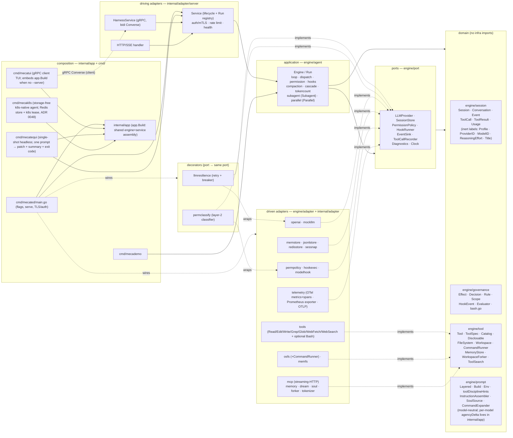

# mecatl — Architecture

> Reader-facing architecture guide. This describes the **code as it exists** in
> `engine/`, `internal/`, `cmd/`, and `contracts/`. Where the design notes in
> `docs/design/` differ from the implementation, this document follows the
> implementation.
>
> For the system's vocabulary — the canonical entities, their relationships, and
> the invariants that must hold — see the [domain model](architecture/mecatl.modelith.md)
> (a [modelith](https://github.com/stacklok/modelith) model; edit the `.yaml`
> source and re-render, never the generated `.md`).


## The guide

The architecture is split across focused, per-subsystem files (one fact, one file).
This page is the overview and router; the big picture and the layering rule are below.

- **[The domain model](architecture/domain-model.md)**
- **[The ports (`engine/port`)](architecture/ports.md)**
- **[The agent loop & permission pause/resume](architecture/agent-loop.md)**
- **[Hooks & guardrails](architecture/hooks-and-guardrails.md)**
- **[Subagents & teams](architecture/subagents-and-teams.md)**
- **[Providers — OpenAI adapter & multi-provider](architecture/providers.md)**
- **[The API surface](architecture/api-surface.md)**
- **[Observability, persistence & reliability](architecture/observability.md)**
- **[Context management & the compaction cascade](architecture/context-and-compaction.md)**
- **[Memory — cross-session recall & consolidation](architecture/memory.md)**
- **[Parallelism — fork-join](architecture/parallelism.md)**
- **[Extensibility — MCP, tools & progressive disclosure](architecture/extensibility.md)**
- **[Deployment & server hardening](architecture/deployment-and-hardening.md)**

## 1. What it is

mecatl is a **headless agentic coding harness**: a service (and library)
that runs the agent loop — call the model, stream its output, execute coding
tools, enforce permissions and hooks, and emit a single typed event stream.
There is no TUI. Clients drive it over **gRPC** (a bidirectional `Converse`
stream) or **HTTP/SSE**. Both surfaces speak one provider-neutral domain
`session.Event` and call the same application service; neither ever sees an
OpenAI type.

The system is built **hexagonally (ports & adapters) with a DDD core**.
Dependencies point inward only: a domain of pure value objects and aggregates
(`session`, `governance`, `tool`, `prompt`), a set of port interfaces the
application consumes (`port`), the application use-case layer that is the agent
loop (`agent`), and adapters that implement the ports (`adapter/*`). The core
tiers (domain, ports, agent loop) plus a small set of stdlib-only REFERENCE
adapters (`engine/adapter/*`: `mockllm`, `memfs`, `nofs`, `memstore`, `sessnap`,
`permpolicy`, `permstore`, `wallclock`, `search` (a fake web-search backend),
`fstools` (the FS tool bodies), `agentfs` (the filesystem agent-def discovery adapter), `skillfs` (the read-only skills discovery core + Skill tool body), plus
the conformance-as-contract suites `fsconformance`, `memconformance`,
`storeconformance`, `sourceconformance`, `eventlogconformance`) live
under `engine/` — the
importable core, fully self-contained (tests included: nothing under `engine/`
imports `internal/...`) and intended to be importable as a library by external
consumers — while the heavy adapters and the composition layer stay under
`internal/`. `engine/` **is its own Go module**
(`github.com/stacklok/mecatl/engine`), kept in this repo as a monorepo via a
committed `go.work`; its standalone dependency closure is just `doublestar` +
`robfig/cron` + `go.yaml.in/yaml/v3` + `x/sync` (+ test-only `goleak`), so an external consumer importing `engine/agent`
pulls in that small set rather than mecatl's full require cone (see
[ADR 0036](adr/0036-engine-module.md)). The exported identifiers of the **seven
core packages** (`session`, `governance`, `tool`, `prompt`, `port`, `team`,
`agent`) are the engine's STABLE public surface, governed by a compatibility
contract ([`engine/COMPATIBILITY.md`](../engine/COMPATIBILITY.md)) and enforced
by the `api-compat` gate — a change to that surface fails CI until the committed
`engine/api/*.txt` snapshots and `engine/CHANGELOG.md` are updated
([ADR 0037](adr/0037-engine-stability-contract.md)); the `engine/adapter/*`
reference adapters carry no such promise. Three sibling efforts harden the same
embeddable-core arc: the engine is now **fully clock-injectable** — every core
wall-clock read flows through `port.Clock` (`Engine.now()`), enforced by an AST
guard (`engine/arch/clock_test.go`) so an embedding host can drive it
deterministically (#116); `port.SessionStore.Load` carries a documented
**event-sourced reconstruction contract** so a host whose system of record is an
append-only log can fold its `EventLog` (+ `SessionMeta`) into a session via
`engine/adapter/eventsource.Fold` — the durable log now records the log-only
`EvUserPrompt` so user turns reconstruct, with a replay-fidelity caveat for
reasoning providers (#115, [ADR 0038](adr/0038-event-sourced-rehydration.md)); and the
supply chain gains per-module **`govulncheck`** (engine strict-clean; a
fail-closed reachable-vuln gate on the root) plus **`dependabot`** over both
modules and the SHA-pinned actions, on a **go 1.26.4** toolchain (#118). The LLM provider sits behind the `port.LLMProvider` seam, with each
wire format isolated entirely inside its own adapter — the OpenAI Responses API
in `internal/adapter/openai`, the native Anthropic Messages API in
`internal/adapter/anthropic` ([multi-provider](architecture/providers.md)) — so the core is provider-agnostic and
unit-testable against fakes (`mockllm`, `memfs`, `memstore`).

Around that core, every capability beyond the minimal loop is a **seam with a
default and a swap-in adapter**, so the production build stays static and
network-free unless you wire something in. The current adapters cover, grouped:
**reliability** (`llmresilience` retry/breaker decorator), **observability**
(`telemetry`: OTel metrics + runtime collector via a Prometheus exporter, OTel
spans over OTLP), **security** (server auth/mTLS, rate
limiting, the `permclassify` model-based risk classifier), **context management**
(`tokenizer` + the `CascadeCompactor`), **memory** (`memory` + `dream`),
**parallelism** (`forker` fork-join), and **extensibility** (the `mcp`
streaming-HTTP client). Each is detailed below.

## 2. The big picture



**Dependency direction is inward only.** The allowed-imports rule, stated by the
per-package `doc.go` files and honoured by the code:

| Package | May import |
|---|---|
| `session`, `governance`, `tool`, `prompt` (domain) | stdlib + other domain packages. Never `adapter`, `agent`, `contracts`, `os`, or any third-party library. |
| `port` | domain packages + stdlib (`context`, `io`, `iter`, `time`). |
| `agent` (application) | domain + `port` + stdlib only. Never an adapter or `contracts`. (Tests may import adapters.) |
| `adapter/*` | domain + `port` + the one external lib it adapts. Never `agent`. (Deliberate adapter→adapter carve-outs: (1) `adapter/mcpperf` may import `adapter/telemetry` solely for the `RuntimeSnapshot` data DTO it projects into tool output — a plain JSON struct with no OTel/SDK types, not a behavioural dependency; the DTO stays in `telemetry` by design. (2) `adapter/soul` AND `adapter/memory` import `adapter/skills` for `ScanForInjection` — the conservative role-override deny-list is shared so the soul (load-time) and the user-model RememberUser write path (write-time) reuse the same injection gate rather than copying the regexes. (3) `adapter/{permconfig,skills,agents,soul,memory}` import the leaf `adapter/xdgconfig` for the shared `ResolveEnv`/`UserConfigDir` XDG path-resolution seam — a stdlib-only adapter leaf, extracted to de-duplicate the copies (the user-model store resolves `<xdg>/mecatl/usermodel` through it). (4) `adapter/soul` and `adapter/memory` import the DOMAIN `engine/prompt` for a single compile-time assertion only — `var _ prompt.SoulSource = (*Store)(nil)` (soul→prompt) and `var _ prompt.UserModelSource = (*Store)(nil)` (memory→prompt) — pinning that each adapter satisfies the consumer-local prompt port it is bound to at composition. These are assertion-only edges (no prompt value is constructed or called); the adapters meet the ports structurally, and `engine/prompt` never imports them. |
| `contracts/gen` | generated; protobuf + gRPC runtime. |
| `app` (composition) | the shared engine/service assembly (`app.Build`). MAY import adapters + `agent` + (via `server`) `contracts/gen`. Nothing imports it but the `cmd/` mains. |
| `cmd/*` | flags + serving; consumes `internal/app`. With `app`, the only places concrete adapters meet ports. |
| `cmd/mecatui/{client,ui,theme}` | a gRPC **client**. `contracts/gen` + grpc + `internal/app` appear only in `client`, `embed`, and the `cmd/mecatui` main; `ui` and `theme` import none of them and **never** any `internal/...` package. |

**mecatui — the terminal UI (`cmd/mecatui`).** An optional gRPC *client*. It dials
the `HarnessService`, creates a session, opens the bidi `Converse` stream, and
renders the streamed `Event` envelopes (glamour markdown for assistant text,
themed lipgloss cards for user prompts and tool I/O), resolving permission asks
inline by sending `ResumeApproval` on the same stream. The server it talks to is
either an external `mecated` (`--server`) or one it **hosts in-process** over a
UNIX socket (`cmd/mecatui/embed` → `app.Build`) when none is given — so a single
binary works with no daemon. The render packages stay pure: they render **purely
from proto `Event`s** and are bound by the inward-only layering rule. The
`contracts/gen` + grpc + `internal/app` surface lives only in `cmd/mecatui/client`,
`cmd/mecatui/embed`, and the `cmd/mecatui` main; the `ui` (Bubble Tea
model/update/view) and `theme` (pure styling) packages import no `engine/...` or `internal/...`
package and no proto directly. Usage and theming are documented in `docs/tui.md`.

**mecatequi — the single-shot headless runner (`cmd/mecatequi`).** A fourth composition
root and a *peer of `mecademo`* over the same `app.Build`: it runs **one** prompt against
an in-process `server.Service`, drives it to a terminal state, and emits three
artifacts — a working-tree git diff (modified, **added**, and deleted files: `git diff
HEAD` plus a `git diff --no-index` new-file hunk per untracked file, so a downstream `git
apply` reproduces new files too), a machine-readable run-summary JSON (`Summary`,
additive-only contract), and an optional durable JSONL event log — then maps the terminal
`StopReason` to a process exit code (`0` clean incl. the honest non-completions, `1` run
failure/cancel/timeout, `2` setup failure). The durable event log (`port.EventLog`,
cloud-native Phase 3a) is now readable over the public `HarnessService` via the
server-streaming `StreamSessionEvents` RPC (and `GET /v1/sessions/{id}/events` over HTTP) —
the client-tier surface over the same `port.EventLog.Read` the operator-tier 3c
`EventLogService.Read` serves, so a client opening a past session replays its full timeline
(the loop stays storage-agnostic; it only emits). Unlike `mecated` it owns no listeners, TLS,
auth, or telemetry pipeline; unlike `mecatui` it has no UI. It defaults `--headless`
(inverted from `mecated`): a CI run has no approver, so a child ask auto-denies or routes
to the opt-in ask-reviewer, and a *main-engine* ask under `posture strict` cancels the run
with an actionable message (the intended CI posture is `--posture auto`). It is **forge-
agnostic** — the GitHub-Actions glue that turns an issue into a pull request (a composite
action + a split-privilege workflow) lives entirely under `.github/` and changes no Go.
See `docs/adr/0028-mecatequi.md`. The four real-provider mains (`mecated`, `mecatui`,
`mecatequi`, `mecak8s`) share provider credential + base-URL wiring through `internal/cliconfig`, so
all four read the same `OPENAI_API_KEY` / `OPENROUTER_API_KEY` / `ANTHROPIC_API_KEY`
environment keys and register the same base-URL flags.

**mecak8s — the storage-free Kubernetes-native agent (`cmd/mecak8s`).** A fifth
composition root and a *thin peer of `mecated`* over the same `app.Build`: it composes the
shared assembly with **k8s-native defaults** — a **Redis** session store + durable event log
(`internal/adapter/redisstore`, ADR 0048), a `coordination.k8s.io` Lease per session
(`internal/adapter/k8slease`, the in-cluster multi-replica single-writer path), a dynamic
`/readyz` (drain-gated + Redis-pinged), and a bounded `GracefulStop`. The agent pods are
**storage-free**: no PVC, no `--store-dir`, no local state — every piece of state is a
managed service the pod talks to over the network (Redis + the k8s API server). It defaults
`--headless=true` and `--posture=auto` (an unattended daemon, inverted from `mecated`'s
interactive defaults), drops `mecated`'s subcommands + Prometheus/OTel admin surface, and
exposes `--redis-url` (mutually exclusive with `--store-dir`/`--session-store-url`). The
honest shutdown contract: new runs are rejected (503 via the drain gate) the moment SIGTERM
or the `preStop` `httpGet /drain` fires; **in-flight runs are cancelled, not drained** (a
multi-minute LLM turn cannot survive a rolling update within
`terminationGracePeriodSeconds: 60`); the pod is disposable, the session is not — it is
`Recover`-able on the successor (issue #51) from the Redis snapshot + durable event log.
See `docs/adr/0048-mecak8s.md`.

Two deliberate cycle-breaks worth noting, documented in code:
- `port` imports `tool` and `prompt` (because `LLMRequest` carries
  `[]tool.ToolSpec` and `prompt.Layered`) — see the package note at the top of
  `engine/port/llm.go`.
- `FileSystem`/`Workspace` live in `engine/tool`, **not** `engine/port`,
  because `port` already imports `tool` while `tool.Tool.Execute` takes a
  `Workspace`; defining them in `port` would form a `port↔tool` cycle. See the
  package note in `engine/tool/tool.go`.
- `governance` does **not** import `session` (so `session` can import
  `governance` without a cycle); the `Evaluator` works on primitive args, and
  the `permpolicy` adapter bridges `session` types into it.

**Typed tool results.** A `session.ToolResult` may carry typed content blocks on
`ToolResult.Parts` (`[]session.Content`, additive — a zero-value `Parts` is the
legacy string-only shape). Composition projects them to the model via
`port.RouteToolResultParts`, which gates image/audio blocks by the per-session
capability intersection (the single `modelCapability` = catalog ∩ adapter) and
passes text / resource-link / embedded-resource / structured-content blocks
through unconditionally. `Content.Audience` is advisory display routing ONLY and
is never consulted to suppress model-facing content (CWE-345 — an untrusted MCP
server's `audience:["user"]` is not a suppression control). Server-returned
`resource_link` URIs are never auto-dereferenced; an `https://` link may be
fetched by the `FetchMcpResource` tool through `ValidateMediaURL` (SSRF
backstop, CWE-918). See `docs/adr/0078-mcp-typed-tool-results.md`.

**Conversation fork.** `Service.ForkSession` (`internal/adapter/server/service.go`)
creates a new peer session whose conversation history is a snapshot of an existing
session's, inheriting the source's mode, workspace, limits, and
provider/model/profile labels (ADR 0065). The ONE permitted selector delta is an
optional `reasoning_effort` override (ADR 0068): empty inherits the source's effort
verbatim, while a non-empty value replaces only the effort label/engine — provider
and model always inherit. This is how a mid-conversation effort switch works
non-destructively (the mecatui `/effort` fork-resume): the transcript survives on
the peer. It reuses the domain primitives the
subagent `fork:true` path already exercises — `session.ForkSnapshot`
(`engine/session/conversation.go`) clones the conversation with a fresh backing
array and strips trailing unanswered tool calls (tool-pairing-valid), and
`session.SeedHistory` (`engine/session/session.go`) loads it into a fresh
`session.New` aggregate that starts idle with zeroed `Counters`/`Usage`. The
source is loaded via the run-entry funnel (`loadAndReopen`), so a terminal source
is recovered to idle first; a running/awaiting source is rejected with
`ErrFailedPrecondition` (fork requires a turn boundary). The forked engine is
rehydrated ONLY when the source needed a per-session engine (non-default selector
/ no-fs profile / worktree workspace), mirroring `createSession`'s branching; a
default-FS fork rides the shared engine. Same provider and model only — the
snapshot carries provider-private replay blobs a different provider cannot
consume. Wire surface: the `ForkSession` gRPC RPC and `POST /v1/sessions/{id}/fork`.

## See also

- [Usage & operator guide](usage.md) — building, running `mecated`, every flag, and the gRPC + HTTP/SSE APIs that drive this design.
- [mecatui terminal UI](tui.md) — the gRPC client that renders the event stream described above.
- [ADR 0001 — the ACP adapter](adr/0001-acp-adapter.md) — the decisions behind the third (editor) wire surface.
- [Go performance measurement & observability survey](perf-measurement-survey.md) — the technique reference behind [observability & persistence](architecture/observability.md).

## Scheduled tasks

A scheduler subsystem (issue #189, [ADR 0059](adr/0059-scheduled-tasks.md)) lets an
operator register a saved prompt to run on a 5-field cron schedule (`0 9 * * *`,
`@every 30m`, `@daily` macros) or once at a future time, and have mecatl drive
that run **autonomously, durably, and exactly-once** across a multi-replica
deployment — with no human present at fire time.

It is a **composition-layer** subsystem (no `engine/agent` changes) that reuses
the existing run-entry funnel. The pieces:

- **`port.ScheduleStore`** (`engine/port/schedule.go`) — the durable registry,
  a peer of `port.SessionLease`/`port.EventLog`. The store is ground truth; an
  in-memory timer is a derived lookahead. `Claim` is the at-most-once atomic
  advance (NextFireAt + LastFireAt + FireCount) that gives exactly-once across
  replicas — a crash mid-fire skips the slot (recurring self-heals via
  fire-once-now; a one-shot can be lost).
- **Adapters** — `memschedulestore` (reference), `jsonlstore` (single-host),
  `redisstore` (multi-replica, via a Lua CAS for the atomic Claim). All pass
  the shared `scheduleconformance` suite.
- **`internal/adapter/scheduler`** — the tick loop, gated by a leader-lease on
  the well-known `__scheduler__` id (only the leader ticks). Leadership is a
  STANDBY loop (ADR 0073 follow-up): `Start` is infallible-at-launch — a
  non-leader serves RPCs and retries the acquire on a jittered backoff,
  promoting when the leader's lease lapses; a definitive Renew loss demotes the
  leader back to standby (failover), and a sticky
  store-unsupported flag stops the loop re-acquiring forever. `FireNow` is
  gated on leadership (`ErrNotLeader` → FailedPrecondition/412). On each tick:
  `Due` → misfire policy → `Claim` (at-most-once) → `FireFunc` → `RecordFire`.
  The `FireFunc` seam is how composition injects the run-entry funnel.
  **Scaling shape (ADR 0074):** one server hosts MANY concurrent sessions (the
  per-session `SessionLease` is the exclusion primitive across both vertical
  session-density and horizontal replicas); the scheduler stays a single global
  leader for the cheap tick (`Claim` is the correctness fence, leadership is
  hygiene), and the expensive fire DRIVE is decoupled into a bounded pool
  (Phase 2), sharded per-schedule only if throughput later demands it.
- **Composition** (`internal/app/build.go` `buildScheduler`/`startScheduler`)
  wires the scheduler ON BY DEFAULT ([ADR 0073](adr/0073-schedule-tool.md)
  decision 2 — the opt-in `--scheduler` flag is deleted; `--no-scheduler` is
  the disable knob) whenever the configured store exposes a `ScheduleStore()`
  accessor (discovered by type-assertion) — a store with none (the in-memory
  default) stays on the byte-identical no-scheduling path. The leader-lease
  reuses the session-lease backend (same backend, different id). The
  `FireFunc` mints a fresh `sched--`
  top-level session per fire via `Service.CreateSessionWithProfile` +
  `StartRunContent` with subagent-grade defaults (bounded budgets, read-leaning
  posture unless `mutating: true`, headless ask model, fail-closed model
  pinning). The fire id IS the session id (ADR 0059 decision #7 Phase-2): the
  fire path pre-mints a `sched--<name>-<ts>-<rand>` id and passes it as the
  `WithSessionID` override (a variadic options pattern on
  `CreateSessionWithProfile`), so the persisted session carries the `sched--`
  GC-retention family prefix. A distinct `ScheduleFireRetention` GC family
  (`sweepScheduleFires`, peer of the main/child passes) sweeps per-fire
  sessions on their own age horizon — never the main or child pass. The
  `--schedule-fire-retention` flag (operator-tier, peer of
  `--child-retention`) defaults to 7d whenever unset (the scheduler is on by
  default); an explicit 0 disables (fire sessions are never swept). The
  shared create-seam (`validateScheduleSpec`) also enforces the
  `--scheduler-min-interval` cadence floor and rejects an
  unknown/uncatalogued provider+model selector, fail-closed, for both the
  in-chat `Schedule` tool and the REST/gRPC handler.

See [ADR 0059](adr/0059-scheduled-tasks.md) for the frozen rationale (the 10
resolved decisions + the leader-lease decision) and the consequences. The two
documented v1 trade-offs — one-shot loss on a mid-fire crash, and
fresh-context-per-fire — are mitigated by the opt-in Phase-2 fields below.

### One-shot crash-loss retry + carried context (Phase 2c, issue #236)

Two opt-in `ScheduleSpec` fields close the documented v1 trade-offs. Both are
composition/scheduler-layer (no `engine/agent` change) and default OFF (the
pre-Phase-2 path is byte-identical when neither field is set):

- **`OneShotRetry` / `OneShotMaxRetries`** — at-least-once retry for a one-shot
  that cannot tolerate crash-loss. The tick loop's post-fire scan
  (`maybeReArmOneShots`, run after the due-fire batch) re-enables a crashed
  one-shot — one whose prior fire ended in `StopError`, or whose
  `LastFireSessionID` is still the `pending` sentinel (Claim happened but
  RecordFire did not) — up to `OneShotMaxRetries` times, via the OPTIONAL
  `port.ScheduleOneShotReArmer` interface (`ReArmOneShot` re-enables + advances
  `NextFireAt` with a small backoff + increments the durable
  `OneShotRetryCount`). The interface is type-asserted on the store exactly like
  `PrunableStore`/`SessionLease` — a store that does not implement it degrades to
  the byte-identical at-most-once path. All three store adapters implement it.
  The budget gate (`OneShotRetryCount >= OneShotMaxRetries`) makes an exhausted
  one-shot permanently done (no crash-loop). One-shot-ONLY: the create-seam
  rejects `OneShotRetry` on a cron trigger fail-closed, and applies a default
  `OneShotMaxRetries=3` when `OneShotRetry=true` and the field is 0. A re-armed
  one-shot starts FRESH (the crashed fire's context is untrusted AND incomplete
  — the re-arm path ignores `CarryContext`).
- **`CarryContext`** — carried-context across fires. The fire path
  (`makeFireFunc` + `renderCarriedContext`, `internal/app/scheduler_fire.go`)
  loads the prior fire's session and renders its conversation as a FENCED
  UNTRUSTED preamble prepended to the prompt — NOT as seeded history. Carried
  context is UNTRUSTED (model-authored + tool-result-laden; a prior fire may
  have been prompt-injected), so it must NOT become replayable
  `Conversation.Messages` (which would carry injection forward as live
  instructions). The fence (`agent.FenceUntrusted` + `NeutraliseFraming`,
  `engine/agent/fence.go`) quarantines it: a forged `<<<UNTRUSTED` closing marker
  or harness section header in the prior content is neutralised, so it cannot
  break out of its block. The summary is clamped to the last 20 turns and a 10000-
  rune budget. On prior-session-load failure (not found, decode error) the fire
  degrades to fresh-context (WARN, never fails the fire). The gate is
  `CarryContext && LastFireSessionID != "" && LastFireSessionID != pending` — so
  a re-armed one-shot does NOT carry context on the retry.

### ScheduleService API surface (Phase 2a, issue #232)

The scheduler is reachable over BOTH wire surfaces — gRPC `ScheduleService` and a
peer REST surface — so an operator/client can create, inspect, pause, fire, and
delete schedules out-of-band from the tick loop. The handlers are thin
delegations over the same `Service` methods the tick loop uses; they live in
`internal/adapter/server/grpc_schedule.go` (gRPC) and `internal/adapter/server/http.go`
(the `schedule_*` REST handlers).

**gRPC `ScheduleService`** (`contracts/proto/mecatl/v1/schedule.proto`,
`ScheduleServer` in `internal/adapter/server/grpc_schedule.go`) — 10 RPCs:

- `CreateSchedule` / `UpdateSchedule` — upsert by name; the create-seam
  (`Service.CreateSchedule`) validates the trigger XOR, prompt-or-parts, cron
  grammar, and the Mutating/Mode invariant fail-closed, then computes the first
  `NextFireAt` (cron via `cronparse`; one-shot = the `OneShot` instant).
- `GetSchedule` / `ListSchedules` / `DeleteSchedule` (idempotent).
- `PauseSchedule` / `ResumeSchedule` — toggle `State.Enabled` via the atomic
  `SetEnabled` (Save preserves State on a Spec overwrite, so pause/resume is a
  dedicated primitive).
- `FireNow` — force an immediate fire, returning `fire_id` + `session_id`
  (fire_id == session_id). The fire is driven synchronously through the
  `FireFunc`; poll `GetFire` for the terminal stop reason.
- `GetFire` / `ListFires` — the pull-only outcome channel: a `ScheduleFire`
  carries the stop reason + the session id whose `SessionStore` snapshot holds
  the full conversation.

**REST routes** (`internal/adapter/server/http.go`, under `/v1/schedules`):

```
POST   /v1/schedules                  -> CreateSchedule
GET    /v1/schedules                  -> ListSchedules
GET    /v1/schedules/{name}           -> GetSchedule
PUT    /v1/schedules/{name}           -> UpdateSchedule
DELETE /v1/schedules/{name}           -> DeleteSchedule
POST   /v1/schedules/{name}/fire      -> FireNow
POST   /v1/schedules/{name}/pause     -> PauseSchedule
POST   /v1/schedules/{name}/resume   -> ResumeSchedule
GET    /v1/schedules/{name}/fires     -> ListFires
GET    /v1/schedules/{name}/fires/{id} -> GetFire
```

**Errors** — a backend with no `ScheduleStore` (memstore, or a store that does
not expose the accessor) honestly reports `Unimplemented` (gRPC) / 501 (HTTP)
from every schedule RPC; `FireNow` on a paused/done schedule is
`FailedPrecondition` / 412; a singleton-overlap skip is `FailedPrecondition` /
412; an unknown schedule/fire is `NotFound` / 404.

**`schedule.*` events** (`EvScheduleFired` / `EvScheduleSkipped` /
`EvScheduleFailed`, `session.SchedulePayload`) — the scheduler emits a
lifecycle event for each fired/skipped/failed fire via the composition-injected
`EmitScheduleEvent` callback (`Service.EmitScheduleEvent`), which appends it to
the fire session's durable `EventLog` (so schedule lifecycle rides the same
durable log as the fire's own events). The events project onto the
`Event.schedule` field (proto field 15); a skipped fire with no session is
dropped from the durable log (the log is session-keyed) and surfaces only via
the operator diagnostic.

**Fire-result delivery (ADR 0075).** A schedule created in-chat carries
`ScheduleSpec.OriginSessionID` — the conversation that created it, stamped at
create-time by the `SessionOriginScheduleManager` wrapper (composition binds the
per-session id via `Deps.OriginBinder`, set in `startRun`; never a model-supplied
arg). After a fire reaches its terminal `EvResult` and `RecordFire` persists the
record, the scheduler's `SetDeliverFireResult` callback
(`deliverFireResult`, `internal/app/scheduler_delivery_run.go`) renders the
outcome as a **fenced-untrusted** harness note (`renderFireDelivery` —
`agent.FenceUntrusted` + `NeutraliseFraming`, never a live instruction), enqueues
it to a DURABLE per-session pending-delivery queue (`port.DeliveryQueue`, a
sidecar-backed `FileDeliveryQueue`; the exactly-once ledger is session-scoped and
survives restart), and delivers it into the origin: an idle/completed/cancelled/
failed origin is driven through the existing `StartRunContent` → `loadAndReopen`
funnel (recording the note as ordinary user history); a busy or awaiting origin
keeps the note queued and the loop drains it at the next turn boundary
(`drainPendingDelivery`, Step 2a, before `BeginTurn` — the same seam as the
background-subagent notice). A deleted / child / `sched--` origin degrades to
pull-only with a WARN (the fire is never failed by delivery). The connected
mecatui renders the note LIVE as a distinct delivery card over the
server-streaming `StreamSessionLive` RPC (a per-session live event subscription;
the live wire relays the delivery's `EvUserPrompt` note while the other log-only
kinds stay skipped), serving both the embedded in-process server and a remote
mecated over one projection. Pull-only (`GetFire`/`ListFires`) remains the floor
for out-of-band schedules (empty `OriginSessionID`).

### Schedule metrics

The operator-facing declarative surfaces Phase 2b once added — the operator-tier
`settings.yaml` `schedules:` block and the `mecated schedules` CLI — were
**removed** by [ADR 0073](adr/0073-schedule-tool.md): the in-chat `Schedule`
tool + the retained REST/gRPC API + the OS scheduler cover the use cases, so the
declarative reconcile and the CLI subcommand group no longer exist. The
surviving management surfaces are the in-chat `Schedule` tool, the
`ScheduleService` gRPC + REST `/v1/schedules` API, and the mecatui `/schedule`
overlay. What remains here is the metrics surface:

- **Schedule metrics** — two instruments emitted via the composition-injected
  `Config.ScheduleMetrics` callback (`internal/adapter/telemetry/metrics.go`
  `EmitSchedule`): `mecatl.schedule.fires` (counter, by `outcome` =
  fired/skipped/failed) and `mecatl.schedule.fire_duration` (histogram, seconds,
  due→terminal — skipped fires record no duration). No role label (a fire's own run
  already carries `role="main"`).

