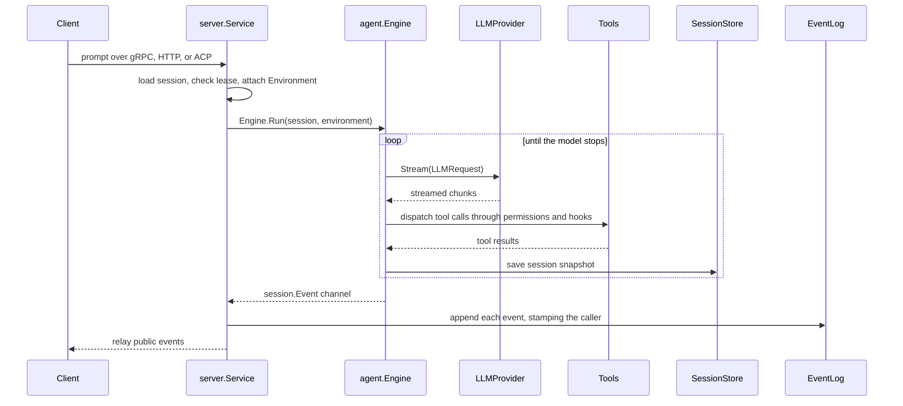

# Mecatl architecture

This overview covers what Mecatl is, its layers, how a prompt flows, where code lives,
and the principles the design keeps. Each topic has a [chapter](#chapters), and
[`READING.md`](READING.md) gives a reading order. The formal domain model in
[`architecture/mecatl.modelith.md`](architecture/mecatl.modelith.md) is generated: edit
the `.yaml` beside it and re-render, never the `.md`.

## What Mecatl is

Mecatl is a headless agentic coding harness. It runs the agent loop: call a model,
stream its output, run coding tools, enforce permissions and hooks, and emit one typed
stream of session events. You can use it two ways:

- **As a service.** The `mecated` server exposes the loop over gRPC (a bidirectional
  `Converse` stream), HTTP with server-sent events, and the Agent Client Protocol (ACP)
  for editors. All three translate the same provider-neutral `session.Event` and call
  the same application service. The server has no UI of its own; `mecatui`, the
  TypeScript SDK, and Mecatl Studio are clients.
- **As a library.** The `engine/` Go module is the importable core. A host program
  constructs an `agent.Engine` with its own adapters and drives runs directly.

## Layers and dependency direction

Mecatl uses a hexagonal (ports and adapters) design with a domain-driven core. Every
dependency points inward, toward the domain:

| Layer | Packages | Holds |
| --- | --- | --- |
| Domain | `engine/session`, `engine/governance`, `engine/learning`, `engine/tool`, `engine/prompt`, `engine/team` | Aggregates and value objects with no I/O |
| Ports | `engine/port` | Interfaces the loop consumes, such as `LLMProvider`, `SessionStore`, `EventLog`, `PermissionPolicy`, `HookRunner`, `Diagnostics`, and `Clock` |
| Application | `engine/agent` | The agent loop, which receives every adapter by injection |
| Adapters | `engine/adapter/*`, `internal/adapter/*`, `provider/*`, `adapters/*` | Implementations of the ports, plus the API server that drives the loop |
| Composition | `internal/app`, `cmd/*` | Wiring that picks concrete adapters and builds an engine and service |

The packages in the first three rows are the engine's stable public API. Their exported
identifiers are snapshotted in `engine/api/*.txt`, and a change fails CI until the
snapshot and [`engine/CHANGELOG.md`](../engine/CHANGELOG.md) are updated under the
rules in [`engine/COMPATIBILITY.md`](../engine/COMPATIBILITY.md). The reference
adapters under `engine/adapter/` carry no such promise.

### Modules

The repository is a Go workspace (`go.work`) of several modules. All of them build
on the Go toolchain version that `go.work` declares.

- **`engine`** is the core plus reference adapters. It never imports the root module,
  so a library consumer pulls in only a handful of small dependencies.
- **The root module** holds the host: heavy adapters, the API server, composition, and
  the binaries.
- **`provider/*`** modules each pair the engine with one vendor SDK, so an embedder
  fetches only the providers it uses.
- **`adapters`** publishes the `jsonlstore` and `redisstore` stores and the
  `grpcdriver` remote store client.
- **Smaller modules** isolate narrow dependencies: `authn/oidc`,
  `environment/microvm`, `internal/adaptersupport`, the driver contracts, and the
  `integration/microvm` test harness.

### How the direction is enforced

Two checks cover the core, and they fail independently, so a new import between core
packages must be allowed in both:

- **depguard** in `.golangci.yml` checks each file. Every core tier has a strict
  allowlist of the standard library plus the specific core packages it may import, so
  any new adapter or SDK import is rejected by default. It also bans `os` in core
  files.
- **`engine/arch/layering_test.go`** checks the whole graph: no core package reaches an
  adapter, SDK, gRPC, or generated contract even transitively, imports follow the
  tier table, and the core has no cycles.

`task test:engine-standalone` builds the engine with `GOWORK=off` to prove it needs
nothing from the root module, `engine/arch/clock_test.go` rejects wall-clock reads in
the core, and a `forbidigo` rule bans global `slog` in `engine/` and `internal/`.

Two placements avoid cycles. `port` imports `tool` because `port.LLMRequest` carries
tool specs, so `Environment` and its file seams live in `tool`, where a tool's
`Execute` takes them. `governance` never imports `session`, so `session` can carry
governance values.

## How a request flows

This is the path of one prompt sent to a running `mecated`:

```mermaid
sequenceDiagram
  participant C as Client
  participant S as server.Service
  participant E as agent.Engine
  participant P as LLMProvider
  participant T as Tools
  participant St as SessionStore
  participant L as EventLog
  C->>S: prompt over gRPC, HTTP, or ACP
  S->>S: load session, check lease, attach Environment
  S->>E: Engine.Run(session, environment)
  loop until the model stops
    E->>P: Stream(LLMRequest)
    P-->>E: streamed chunks
    E->>T: dispatch tool calls through permissions and hooks
    T-->>E: tool results
    E->>St: save session snapshot
  end
  E-->>S: session.Event channel
  S->>L: append each event, stamping the caller
  S-->>C: relay public events
```

1. The gRPC and HTTP adapters (`internal/adapter/server`) and the ACP adapter
   (`internal/adapter/acp`) hand the prompt to the same `server.Service`.
2. The service loads the session, confirms this process holds its lease, reattaches
   its execution environment, and mints a run ID.
3. `Engine.Run` drives the loop in its own goroutine: assemble the system prompt,
   stream a response, and dispatch tool calls (reads in parallel, mutations one at a
   time) through the permission policy and hooks.
4. A call that needs approval pauses the run until the client answers.
5. The loop only emits events. The service relay appends each one to `port.EventLog`,
   stamping the verified caller, and forwards public events to the client. Approvals
   and compaction archives go to the log only.

Other entry points use the same service: `mecatui` runs it in-process by default,
`mecatequi` drives a single run, and scheduled tasks start runs on a timer. `mecademo`
skips the server and calls `Engine.Run` directly.

## Code map

### Engine module (`engine/`)

| Path | Contents |
| --- | --- |
| `session` | The `Session` aggregate, conversation, turns, event taxonomy, and tool call and result pairing |
| `governance` | Permission evaluation, shell command analysis, hook events, and canonical untrusted-content fences (standard library only) |
| `learning` | Evidence-backed reflection and skill lifecycle values |
| `tool` | The `Tool` interface, catalog, and the `FileSystem`, `Workspace`, and `Environment` seams |
| `prompt` | Layered system-prompt assembly (stable prefix plus volatile suffix) |
| `team` | Shared in-memory state for agent teams |
| `port` | Port interfaces |
| `agent` | The loop, dispatch, permission pause and resume, compaction, subagents, and fork-join |
| `adapter/*` | Offline reference adapters (`mockllm`, `memfs`, `memstore`, and others), file tool bodies, discovery for agents, skills, and rules, web search and fetch, and conformance suites every real adapter must pass |
| `arch` | Layering tests and the canonical core package list |
| `api` | Public API snapshots |

### Root module

| Path | Contents |
| --- | --- |
| `internal/app` | `app.Build`, the shared assembly of engine and service. The `cmd` mains and their shared `internal/cliconfig` wiring import it |
| `internal/adapter/server` | gRPC, HTTP/SSE, ownership, scheduling, and the run relay |
| `internal/adapter/*` | Host adapters: file system and shell (`osfs`, `tools`), stores and leases, MCP, telemetry, settings (`permconfig`), provider resilience, compaction (`tokenizer`), memory, and more |
| `internal/configgen`, `internal/apicheck` | Generators and gates for the configuration reference and API snapshots |
| `internal/buildinfo` | The build identity stamped into every binary |
| `contracts/` | Protobuf sources (`proto/`) and generated Go code (`gen/`) for the public, driver, and execution APIs |

### Binaries (`cmd/`)

| Binary | Role |
| --- | --- |
| `mecated` | The standalone server. Serves gRPC and HTTP, or ACP over stdio for an editor |
| `mecatui` | Terminal client. By default it hosts its own server in-process over a private UNIX socket (`cmd/mecatui/embed`); `mecatui connect ADDRESS` dials a remote `mecated` instead. Its `ui` and `theme` packages never import contracts or `internal/` |
| `mecatequi` | Single-shot headless runner for CI. Runs one prompt, then writes a git diff, a JSON run summary, and an optional event log, and maps the stop reason to an exit code |
| `mecak8s` | Storage-free Kubernetes agent. Uses Redis for sessions and the event log and a Kubernetes Lease per session, so pods keep no local state |
| `mecademo` | Offline smoke test that builds an engine directly against `mockllm` |
| `mecatl-execution-provider`, `mecatl-executor` | The optional Kubernetes execution provider and its credential-free workload helper |

### Everything else

| Path | Contents |
| --- | --- |
| `sdk/typescript/` | The `@stacklok-oss/mecatl-sdk` client package |
| `apps/` | Mecatl Studio: a browser UI whose backend reaches `mecated` through the TypeScript SDK |
| `perf/` | Offline whole-loop scenarios, KPI capture, and CI trend tools |
| `e2e/` | Live end-to-end suite against real providers (costs money) |
| `examples/` | Small programs that embed the engine |
| `deploy/`, `build/` | Kubernetes manifests, Helm charts, and container build contexts |
| `user-docs/` | Public documentation, rendered by the Docusaurus site in `website/` |

## Platform principles

These cross-cutting rules shape every change. Topic chapters hold the behavior-level
invariants.

1. **Dependencies point inward, checked by machines.** A reviewer cannot catch every
   transitive import, and one adapter import in the core breaks embedding.
2. **The engine is a self-contained library with offline tests.** Consumers get a
   small dependency set, and tests run fast, free, and deterministic on `mockllm`,
   `memfs`, `memstore`, and the conformance suites.
3. **Ports stay provider-neutral.** A test guards `port.LLMRequest`, so one loop works
   with every provider and wire quirks stay inside their adapter.
4. **Permissions are deny-dominant and fail closed.** A deny in any scope wins, no
   matching rule means ask, and the zero posture is `strict`, so a broader rule or a
   looser posture never overrides a deny.
5. **The session is an aggregate whose history stays paired.** Every history
   replacement passes `session.ValidateToolPairing`, because providers reject a tool
   result without its call.
6. **The loop emits and the host persists events.** `Service.appendEvent` is the one
   place that writes the event log and stamps the actor, which keeps the engine
   storage-agnostic and gives every event one order and one attribution.
7. **Diagnostics and time are injected.** The core logs through `port.Diagnostics`
   and reads time through `port.Clock`, so an embedding host controls its logs and can
   drive the engine deterministically.
8. **Agent-facing processes get a scrubbed environment.** Command runners start from a
   scrubbed copy of the host environment, so model-driven commands do not see harness
   credentials. Scrubbing is not an OS sandbox.
9. **Untrusted content has one fence.** All framing lives in
   `engine/governance/fence.go`, so every injection defense uses the same matcher.
10. **MCP servers are reached over streaming HTTP only.** The client rejects stdio
    configurations, so adding an MCP server never spawns a local process.
11. **A model-dependent affordance ships its instruction and a test.** The model cannot
    use what the system prompt never tells it, so a test proves the instruction reaches
    the right prompt layer through the real factory.
12. **Capabilities beyond the minimal loop are seams with a default.** Resilience,
    telemetry, memory, MCP, and the risk classifier are ports or decorators, so an
    embedder pays only for what it wires in.
13. **Generated files change only by regeneration.** The configuration reference,
    protobuf code, API snapshots, and the modelith model each have one source, and
    drift checks catch hand edits.

## Chapters

Foundations, best read in order:

- [Domain model](architecture/domain-model.md): session aggregate, events, tool results, and token accounting.
- [Ports](architecture/ports.md): port interfaces, the tool contract, and the environment seam.
- [Agent loop](architecture/agent-loop.md): `Engine.Run`, dispatch, permission pause and resume, and prompt assembly.

Topics:

- [Context and compaction](architecture/context-and-compaction.md): token budget and the compaction cascade.
- [Subagents and teams](architecture/subagents-and-teams.md): subagents, teams, fork-join, and worktree placement.
- [Providers](architecture/providers.md): provider adapters, registry, model resolution, and routing.
- [Observability](architecture/observability.md): telemetry, the event log, leases, store drivers, and resilience.
- [API surface](architecture/api-surface.md): wire APIs, session commands, scheduled tasks, SDK, and Studio.
- [Governance](architecture/governance.md): permissions, posture, trust, scrubbing, fences, hooks, and guardrails.
- [Deployment and hardening](architecture/deployment-and-hardening.md): authentication, caller identity, ownership, and deployment shapes.
- [Extensibility](architecture/extensibility.md): MCP and its broker, skills, progressive disclosure, and web retrieval.
- [Memory](architecture/memory.md): cross-session recall, the user model, and evidence-backed reflection.
- [MicroVM environments](architecture/microvm-environments.md): server-owned placement and the microVM runtime.

Elsewhere: [`tui.md`](tui.md) (mecatui contributor standards),
[`perf-tracking.md`](perf-tracking.md) and
[`perf-measurement-survey.md`](perf-measurement-survey.md) (performance), and
[proposals](proposals/README.md) (designs not built yet).

## Related

- [Reading map](READING.md)
- [Contributor instructions in `AGENTS.md`](../AGENTS.md)
- [Building on Mecatl](../user-docs/building/index.md)
- [Embed the engine](../user-docs/building/deployment/embed-engine.md)
- [Public documentation](../user-docs/intro.md)
