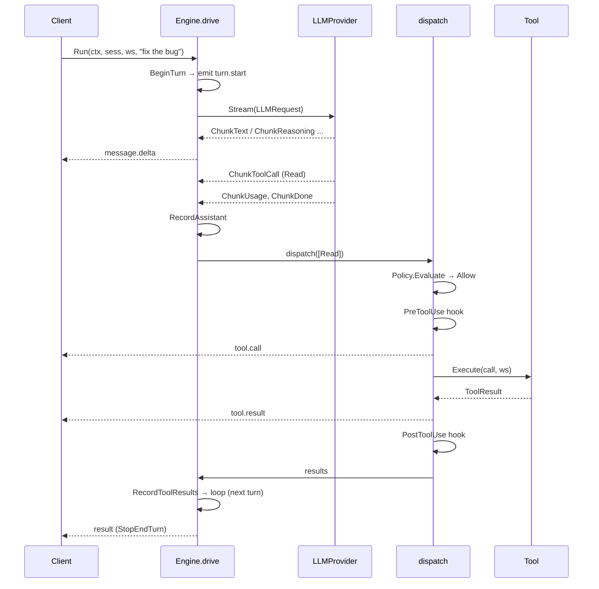
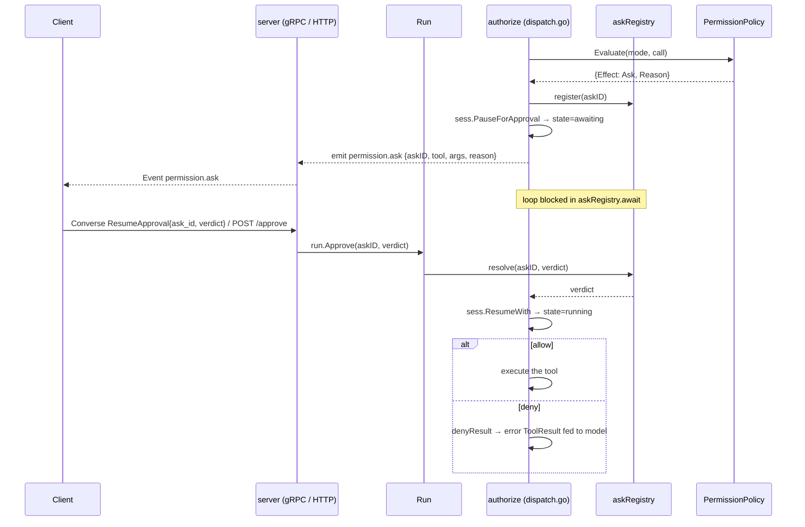

# The agent loop & permission pause/resume

> Part of the [mecatl architecture guide](../architecture.md).

**What this covers:** the `Engine.Run` drive algorithm, read-parallel / mutate-serial dispatch, permission pause/resume (`askRegistry`, `Run.Approve`), the plan-approval gate (`PresentPlan`), the token budget, and bounded no-progress nudging.

**Prerequisites:** [the ports](ports.md) — the seams the loop consumes.

**Follow-on:** [hooks & guardrails](hooks-and-guardrails.md), [subagents & teams](subagents-and-teams.md), [context & compaction](context-and-compaction.md), [memory](memory.md), [extensibility](extensibility.md), and [the API surface](api-surface.md) — subsystems that build on or drive the loop.

## The agent loop (`engine/agent`)

`Engine` is built from `Deps` (all ports + the application seams + config) via
`NewEngine`, which supplies network-free defaults for every optional seam:
`Compactor`→`HeuristicCompactor{}`, `CompactionRatio`→`0.8`,
`TokenCounter`→`HeuristicTokenCounter{}`, `Instructions`→`prompt.RootAssembler{}`,
`CommandExpander`→`prompt.NoopExpander{}`. `Engine.Run(ctx, sess, ws, userText)`
returns a `*Run` handle immediately and drives the loop in a background
goroutine; the `Run` exposes:
- `Events() <-chan session.Event` — the primary surface, closed exactly once
  when the run terminates.
- `Approve(askID string, v session.ApprovalVerdict)` — resolves a
  `permission.ask` out-of-band with one of three verdicts: `VerdictDeny` (the
  fail-safe zero value), `VerdictAllowOnce`, or `VerdictAllowAlways` (which
  additionally asks the policy to **learn** a session-scoped allow via
  `PermissionPolicy.Learn`).
- `Cancel()` — cancels the run's context.
- `CancelChild(childID string) bool` — cancels ONE child run (subagent /
  parallel branch / team member) without touching the run itself ([subagents & teams](subagents-and-teams.md)).

`drive` (in `loop.go`) is the algorithm:

1. **Run-open + SessionStart gate**: emit `session.init` exactly once, before
   anything else; then (first turn only) fire the blocking `SessionStart` hook
   (`fireSessionStart`); a block (or hook error) aborts the run before the
   prompt is even recorded.
2. **Record the prompt** (`recordPrompt`): expand the raw input through
   `CommandExpander.Expand` (slash commands; the `NoopExpander` default leaves it
   unchanged), fire the blocking `UserPromptSubmit` hook **on the expanded text**
   (a block ends the run; a `Mutated` payload replaces the effective prompt), and
   on the first turn assemble project instructions via `Instructions.Assemble`
   (the `RootAssembler` default reads AGENTS.md/CLAUDE.md), recording them + the
   final user text through the aggregate root.
3. **Pre-turn stop guard**: announce any newly-finished background children
   (one harness-note user message, ids + stop labels only; [subagents & teams](subagents-and-teams.md)); then, if
   `sess.StopReason()` trips, `ctx` is cancelled, or the run **token budget**
   is crossed (below), terminate.
4. `BeginTurn`, emit `turn.start`.
5. **Maybe compact** (`maybeCompact`).
6. **Run the turn** (`runTurn`): build the `LLMRequest`, call `LLM.Stream`,
   consume chunks, emit `message.delta` for text, accumulate reasoning, collect
   tool calls and usage, capture the stop reason; assemble one assistant
   `Message`. `ctx` cancellation mid-stream surfaces as a cancellation.
7. `RecordAssistant`. If there are **no tool calls**, the model is done →
   complete the run.
8. **Dispatch** the tool calls, `RecordToolResults`, `save`, loop back to (3).

The loop terminates the session in exactly one of `Complete`/`Stop`/`Cancel`/
`Fail` and emits exactly one terminal `result` event carrying cumulative usage.

A run-level **token budget** bounds the whole loop: `Deps.MaxRunTokens`
(`--max-run-tokens`; **default: unlimited**, `0` disables the brake) is checked at the turn boundary — never
mid-stream, so an in-flight turn always completes — against the run's
accumulated `session.Usage` (input + output; cache tokens excluded). Crossing
it ends the run cleanly with `StopBudget` (a NON-error terminal → `completed`,
Reopen-recoverable, mirroring `StopNoProgress`). Every child engine — Subagent,
Parallel branch, team member, lead synthesis — inherits it; a per-call override
(`RunOptions.MaxRunTokensOverride`, the Subagent `max_run_tokens` arg — `max_tokens`
is the deprecated alias for the same budget) may only
**tighten** it. The team-aggregate counterpart is `--max-team-tokens` ([parallelism](parallelism.md)).

### Read-parallel / mutate-serial dispatch (`dispatch.go`)

Enforced in `Engine.dispatch`, keyed off `Tool.ReadOnly()`:
- Calls are processed **in original order**, batched into maximal runs of
  consecutive read-only tools.
- A read-only batch (`runReadBatch`) authorizes + runs PreToolUse hooks for
  every call first (permission **asks are sequenced one at a time**, never two
  at once), then executes the cleared calls **concurrently**, one goroutine per
  call, results merged under a mutex.
- A mutating or **unknown** tool (`runOne`) runs **alone, serially**, never
  overlapping anything.
- Results are keyed by `CallID` and re-assembled in input order.

A `cancelled` flag propagates from `dispatch` so the loop terminates as
`StopCancelled` if `ctx` was cancelled mid-await or mid-execution. A
harness-level tool error becomes an error `ToolResult` (the loop never aborts on
one tool failure); a genuinely unknown tool yields an error result too.

## Permission pause / resume

When `Policy.Evaluate` returns `Ask`, `dispatch.go`'s `authorize` pauses the
loop. The handshake is brokered by `askRegistry` (`permission.go`): the loop
**registers the resolution channel before** pausing and emitting, so an
`Approve` that races in cannot be lost. `PauseForApproval` moves the session to
`awaiting`; the loop emits `permission.ask`; `askRegistry.await` blocks on the
buffered channel until `Run.Approve` resolves it or `ctx` is cancelled.

- **Allow (once)** → the call executes normally.
- **Allow always** → the call executes AND the policy **learns** a per-session
  allow rule for the same tool + exact canonical pattern
  (`PermissionPolicy.Learn`; never overrides a deny or plan mode).
- **Deny** → `denyResult` synthesizes a `permission denied: <reason>` error
  `ToolResult`, fed back so the model can adapt. Deny is the verdict's zero
  value, so an abandoned ask fails safe.
- **Cancel while awaiting** → `await` returns `ok=false`; the loop ends as
  `StopCancelled`.

On the wire, `ResumeApproval` carries the three-way `verdict` enum; the legacy
`allow` bool is kept for back-compat (ignored when `verdict` is set; otherwise
`true` maps to allow-once, `false` to deny).

This ties directly to the API: the gRPC `Converse` stream carries the verdict in
a `ResumeApproval` frame on the **same** stream emitting events (no out-of-band
correlation), and the HTTP surface uses `POST /v1/sessions/{id}/approve`. Both
land on `Run.Approve`. The `Service` keeps a registry of in-flight `*agent.Run`
keyed by session id so the verdict reaches the right run
(`server/service.go`: `LookupRun`).

## Plan-approval gate

Plan mode (`session.ModePlan`) gains a structured approval gate
([ADR 0069](../adr/0069-plan-approval-gate.md)) that reuses the permission-ask
machinery above. The shape is the same as the guardrail approve-once
([ADR 0062](../adr/0062-guardrails-approve-once.md)): a tool call refined into an
askable ask, a serialized provenance marker, and a verdict tail.

- **The PresentPlan signalling tool** (`engine/agent/presentplan.go`
  (`NewPresentPlanTool`)) is read-only and signaling-only. Once the model has
  presented a complete plan in its preceding assistant text it calls `PresentPlan`
  to hand control to the operator. The tool implements `engine/tool/tool.go`
  (`PlanOnly`), so the catalog's mode projection (`Available`) advertises
  it ONLY in plan mode (registered everywhere so shared/per-session name-sets stay
  equal; hidden outside plan mode). The model is told to use it — the gate is not
  opt-in from the model's side: the tool description, the plan-mode Role suffix
  (`internal/app/build.go` (`applyPlanModePosture`)), and the per-turn plan-mode
  prompt reminder (`engine/prompt/builder.go`) all state the contract — present the
  plan, call `PresentPlan` once, and STOP; an inline "acceptable" in chat is NOT
  approval.
- **The dispatcher intercepts by name+mode.** `engine/agent/dispatch.go`
  (`surfacePlanAsk`) — a sibling of `askHookApproval` over the shared `surfaceAsk`
  spine — mints a `session.PendingAsk{PlanOriginated: true}`, parks the run
  `StateAwaiting`, and emits `EvPermissionAsk`. It is sequenced one-at-a-time in
  dispatch Phase 1 (never the parallel fan-out). The headless guard
  (`!Interactive && !PlanModeAutoApprove`) synthesizes a deny result (fail-safe —
  no silent mode flip); the opt-in `PlanModeAutoApprove` surfaces the ask even
  headless so the composition observer can resolve it.
- **Verdict → mode.** Allow-once → flip to `ModeDefault`; allow-always → flip to
  `ModeAccept`; deny → terminate CLEANLY with `engine/session/session.go`
  (`StopPlanIterate`) (the iterate pause — issue #206 UX fix: the run ENDS so the
  operator's next typed prompt drives the revision; the model does NOT continue
  iterating in-turn with no operator input). The session stays `ModePlan` on Deny
  (no mode flip). On Allow the run
  terminates with the clean `engine/session/session.go` (`StopPlanApproved`)
  terminal; `engine/agent/loop.go` (`terminateComplete`) flips the mode AT the
  terminal boundary (after `Stop` → `StateCompleted`, where `SetMode` is legal —
  the `Running`/`Awaiting` rejection invariant is preserved). The plan→execute
  model swap rides the existing ADR 0030 Layer 3 run-entry rebuild.
- **Cross-process resume.** `PendingAsk.PlanOriginated` is serialized
  (`json:"plan_originated,omitempty"`, sibling of `HookOriginated`); the
  awaiting-resume path (`resolvePendingCall`) keys the plan-flip branch on it —
  an Allow does NOT re-present the plan; a Deny sets `planIterateRequested` so the
  resumed run terminates `StopPlanIterate` (the iterate pause, cross-process twin
  of the live-path deny). The read-time
  `engine/session/session.go` (`Origin`) accessor derives the single
  provenance (`AskOriginPlan`/`AskOriginHook`/`AskOriginNone`) from the two
  serialized bools.
- **The atomic `ApprovePlan` RPC** (`internal/adapter/server/service.go`
  (`ApprovePlan`), `POST /v1/sessions/{id}/plan:approve`,
  `rpc ApprovePlan`) resolves a parked plan-ask and — on Allow — starts a FRESH
  continuation run carrying `agent.PlanApprovedProceedText` + an optional note,
  streaming BOTH runs' events. On Deny (`ModePlan`) NO continuation runs — the
  resumed run terminates `StopPlanIterate` (the iterate pause), so the operator's
  next typed prompt drives the revision. The opt-in `--plan-mode-auto-approve`
  observer (`MaybeAutoApprovePlan`) auto-resolves a parked plan-ask headless
  (DEFAULT OFF, OPERATOR-TIER ONLY, loud "NO HUMAN REVIEW" diagnostic).

## Follow-on reading

- [Hooks & guardrails — the loop's lifecycle gates](hooks-and-guardrails.md)
- [Subagents & teams — delegation from the loop](subagents-and-teams.md)
- [Context & compaction — the loop's token management](context-and-compaction.md)
- [Memory — the index the loop injects each run](memory.md)
- [Extensibility — the tools & MCP the loop runs](extensibility.md)
- [The API surface that drives the loop](api-surface.md)

## Related

- [The ports the loop consumes](ports.md)

---

[← Architecture guide](../architecture.md)
