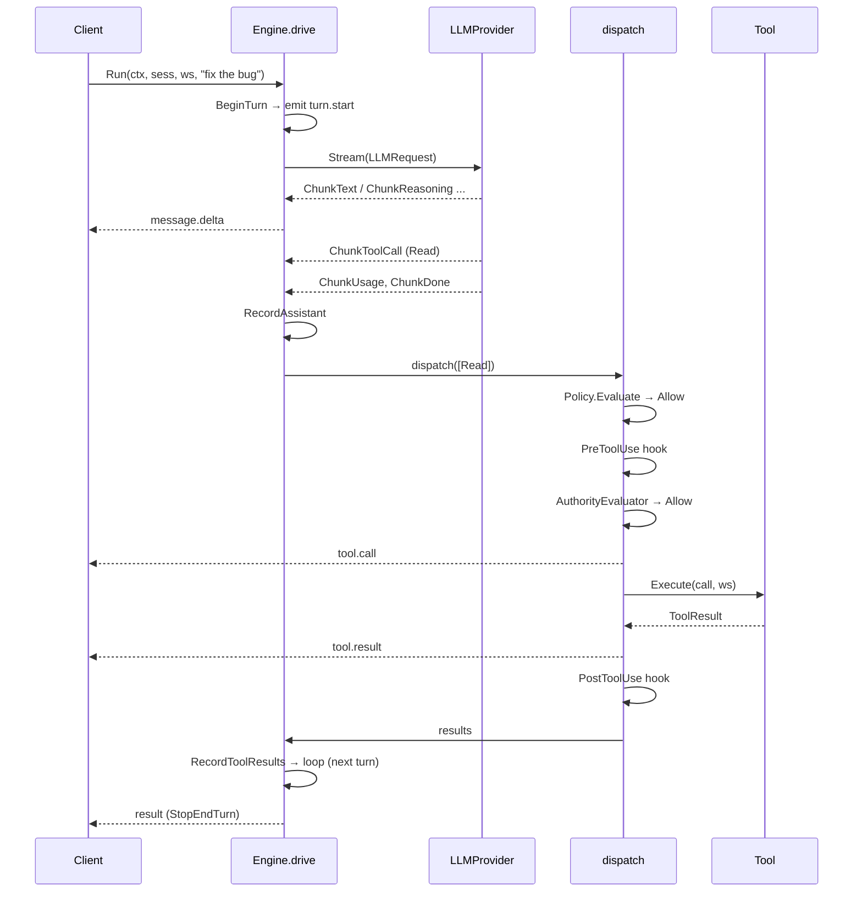
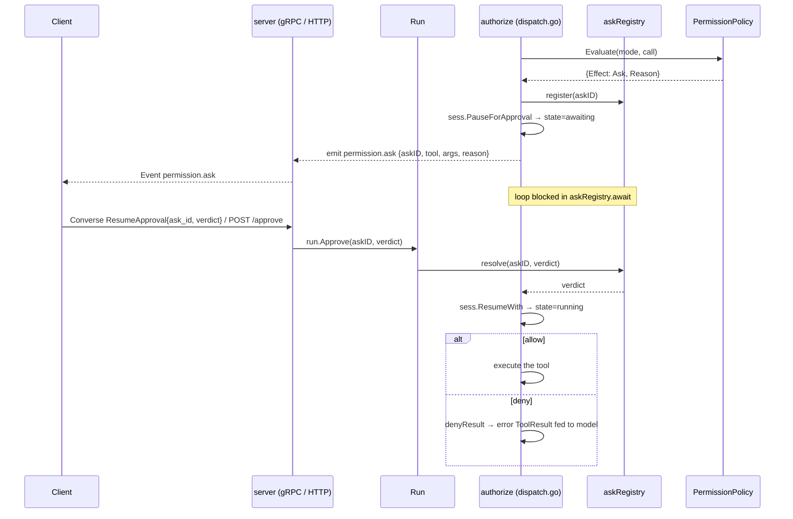

# The agent loop & permission pause/resume

> Part of the [mecatl architecture guide](../architecture.md).

**What this covers:** the `Engine.Run` drive algorithm, read-parallel / mutate-serial dispatch, permission pause/resume (`askRegistry`, `Run.Approve`), the plan-approval gate (`PresentPlan`), the token budget, bounded no-progress nudging, and steer-while-running (mid-run operator input).

**Prerequisites:** [the ports](ports.md) — the seams the loop consumes.

**Follow-on:** [hooks & guardrails](hooks-and-guardrails.md), [subagents & teams](subagents-and-teams.md), [context & compaction](context-and-compaction.md), [memory](memory.md), [extensibility](extensibility.md), and [the API surface](api-surface.md) — subsystems that build on or drive the loop.

## The agent loop (`engine/agent`)

`Engine` is built from `Deps` (all ports + the application seams + config) via
`NewEngine`, which supplies network-free defaults for every optional seam:
`Compactor`→`HeuristicCompactor{}`, `CompactionRatio`→`0.8`,
`TokenCounter`→`HeuristicTokenCounter{}`, `Instructions`→`prompt.RootAssembler{}`,
`CommandExpander`→`prompt.NoopExpander{}`.
`Engine.Run(ctx, sess, ws, RunRequest{Text: userText})` returns a `*Run` handle
immediately and drives the loop in a background goroutine; the `Run` exposes:
- `Events() <-chan session.Event` — the primary surface, closed exactly once
  when the run terminates.
- `Approve(askID string, v session.ApprovalVerdict)` — resolves a
  `permission.ask` out-of-band with one of three verdicts: `VerdictDeny` (the
  fail-safe zero value), `VerdictAllowOnce`, or `VerdictAllowAlways` (which
  additionally asks the policy to **learn** a session-scoped allow via
  `PermissionPolicy.Learn`).
- `Cancel()` — cancels the run's context.
- `CancelChild(childID string) bool` — cancels ONE child run (subagent /
  parallel branch / team member) without touching the run itself ([subagents & teams](subagents-and-teams.md)).

`drive` (in `loop.go`) is the algorithm:

1. **Run-open + SessionStart gate**: emit `session.init` exactly once, before
   anything else; then (first turn only) fire the blocking `SessionStart` hook
   (`fireSessionStart`); a block (or hook error) aborts the run before the
   prompt is even recorded.
2. **Record the prompt** (`recordPrompt`): expand the raw input through
   `CommandExpander.Expand` (slash commands; the `NoopExpander` default leaves it
   unchanged), fire the blocking `UserPromptSubmit` hook **on the expanded text**
   (a block ends the run; a `Mutated` payload replaces the effective prompt), and
   on the first turn assemble project instructions via `Instructions.Assemble`
   (the `RootAssembler` default reads AGENTS.md/CLAUDE.md), recording them + the
   final user text through the aggregate root.
3. **Pre-turn stop guard**: announce any newly-finished background children
   (one harness-note user message, ids + stop labels only, family-aware across
   the delegation families and background-Bash jobs; [subagents & teams](subagents-and-teams.md));
   drain the fire-result delivery queue (ADR 0075) and the **steer inbox**
   (below) — the Step 2a boundary injections,
   `engine/agent/loop.go` (`runBoundaryInjections`); then, if
   `sess.StopReason()` trips, `ctx` is cancelled, or the run **token budget**
   is crossed (below), terminate.
4. `BeginTurn`, emit `turn.start`.
5. **Maybe compact** (`engine/agent/loop.go` (`maybeCompact`)): estimate the
   already-built complete request, including rendered system text, ephemeral
   fragments, messages, typed tool results, and advertised tool schemas. At the
   default 0.8 ratio, compact only persisted conversation history and rebuild only
   the request's message suffix. Fixed system, fragment, and tool-schema overhead
   cannot be reduced. A client can request the separate threshold-independent
   `Engine.CompactSession` operation only outside a run; see
   [context & compaction](context-and-compaction.md).
6. **Run the turn** (`runTurn`): send the already-built `LLMRequest`, call
   `LLM.Stream`, consume chunks, emit `message.delta` for text, accumulate
   reasoning, collect tool calls and usage, capture the stop reason; assemble one
   assistant `Message`. While `buildRequest` assembles each request, an optional
   `OperatorProfileSource` is re-read and its last-good active facts are placed only in the volatile system
   suffix. A read fault warns once and reuses the run-local last-good snapshot;
   profile bytes are never persisted as conversation messages. `ctx` cancellation
   mid-stream surfaces as a cancellation.
7. `RecordAssistant`. If there are **no tool calls**, the model is done →
   complete the run.
8. **Observe eligible completion**: after the aggregate reaches `completed`, an
   optional non-`off` `learning.Observer` receives one owned `learning.Trajectory`
   snapshot. Failed, cancelled, and awaiting runs are excluded; observer errors are
   diagnostics only and cannot change the terminal result.
9. **Dispatch** the tool calls, `RecordToolResults`, `save`, loop back to (3).

The loop terminates the session in exactly one of `Complete`/`Stop`/`Cancel`/
`Fail` and emits exactly one terminal `result` event carrying cumulative usage.
The `result` payload includes a `Permanent` boolean — meaningful only when
`stop=error` — that distinguishes a permanent provider rejection (retrying
can't help) from a transient failure ([ADR 0203](../adr/0203-permanent-provider-error-signal.md)).
A permanently-failed session that is recovered for re-entry emits a one-time
`recover_notice` advisory BEFORE the first turn, so the operator sees the
warning before burning a provider call.

A run-level **token budget** bounds the whole loop: `Deps.MaxRunTokens`
(`--max-run-tokens`; **default: unlimited**, `0` disables the brake) is checked at the turn boundary — never
mid-stream, so an in-flight turn always completes — against the run's
accumulated `session.Usage` (input + output; cache tokens excluded). Crossing
it ends the run cleanly with `StopBudget` (a NON-error terminal → `completed`,
Reopen-recoverable, mirroring `StopNoProgress`). Every child engine — Subagent,
Parallel branch, team member, lead synthesis — inherits it; a per-call override
(`RunRequest.MaxRunTokensOverride`, the Subagent `max_run_tokens` arg — `max_tokens`
is the deprecated alias for the same budget) may only
**tighten** it. The team-aggregate counterpart is `--max-team-tokens` ([parallelism](parallelism.md)).

### Read-parallel / mutate-serial dispatch (`dispatch.go`)

Enforced in `Engine.dispatch`, keyed off `Tool.ReadOnly()`:
- Calls are processed **in original order**, batched into maximal runs of
  consecutive read-only tools.
- A read-only batch (`runReadBatch`) authorizes + runs PreToolUse hooks for
  every call first (permission **asks are sequenced one at a time**, never two
  at once), then executes the cleared calls **concurrently**, one goroutine per
  call, results merged under a mutex.
- A mutating or **unknown** tool (`runOne`) runs **alone, serially**, never
  overlapping anything.
- Results are keyed by `CallID` and re-assembled in input order.

A `cancelled` flag propagates from `dispatch` so the loop terminates as
`StopCancelled` if `ctx` was cancelled mid-await or mid-execution. A
harness-level tool error becomes an error `ToolResult` (the loop never aborts on
one tool failure); a genuinely unknown tool yields an error result too.

### Authority evaluation at execution

Permission policy, session ownership, and delegated authority are independent
checks. Permission policy answers whether a call needs approval; ownership
answers who may access a session; authority answers whether this particular run
was delegated the capability at all. A bound root session starts with the tool
capabilities assembled in its composed catalog. Its authority set also records
whether it has a filesystem, whether it may write directly, and how many child
delegations remain.

Before creating a Subagent, Parallel branch, or Team member, the harness derives
the child's set by intersecting the parent's set with the child's actual runtime
posture, any eligible managed-specialist ceiling, and an optional per-call
tightening. It then consumes one delegation hop. Derivation happens before the
harness creates the child engine, workspace, runner, or worktree, so a refused
request allocates no child runtime resource. The child persists its derived set;
a later resume checks it is still contained by the current parent's set without
spending another hop.

Tool disclosure is only guidance for the model. The security boundary is the
execution path: after the ordinary permission and pre-tool-hook gates clear, the
loop asks the configured authority evaluator about the actual capability being
spent. A denied capability, an unavailable evaluator, or an ambiguous target
returns an error ToolResult and does not invoke the tool body. For normal tools
the capability is the tool name. `CallMcpWithQuery` is instead checked against
its addressed `mcp__<server>__<tool>` capability, while MCP resource operations
spend a per-server resource capability and retain their operation as the action.

The evaluator receives the carried set, the selected capability, action,
delegation depth, non-secret identity attribution, and—for recognized local-file
calls—a normalized physical workspace target. It never receives raw tool
arguments or credentials. Composition chooses one evaluator at startup:

| Evaluator | What it decides |
| --- | --- |
| `local` (default) | Permits an exact capability only when it appears in the carried set. |
| `noop` (explicit) | Disables authority enforcement for deployments that deliberately choose that posture; it is never the fallback for a missing evaluator. |
| `cedar` (opt-in) | First requires the carried set to allow the capability, then applies one static operator-owned policy that can add denials such as a workspace path boundary. A missing or invalid policy prevents startup. |

A Cedar policy cannot grant a capability absent from the carried set. An
unavailable evaluator is a distinct fail-closed execution error, not an implicit
switch to `noop`. See [ADR 0234](../adr/0234-authority-evaluator-port.md) for
the decision; operator configuration is documented in the public permissions
guide.

## Permission pause / resume

When `Policy.Evaluate` returns `Ask`, `dispatch.go`'s `authorize` pauses the
loop. The handshake is brokered by `askRegistry` (`permission.go`): the loop
**registers the resolution channel before** pausing and emitting, so an
`Approve` that races in cannot be lost. `PauseForApproval` moves the session to
`awaiting`; the loop emits `permission.ask`; `askRegistry.await` blocks on the
buffered channel until `Run.Approve` resolves it or `ctx` is cancelled.

- **Allow (once)** → the call executes normally.
- **Allow always** → the call executes AND the policy **learns** a per-session
  allow rule for the same tool + exact canonical pattern
  (`PermissionPolicy.Learn`; never overrides a deny or plan mode).
- **Deny** → `denyResult` synthesizes a `permission denied: <reason>` error
  `ToolResult`, fed back so the model can adapt. Deny is the verdict's zero
  value, so an abandoned ask fails safe.
- **Cancel while awaiting** → `await` returns `ok=false`; the loop ends as
  `StopCancelled`.

On the wire, `ResumeApproval` carries the three-way `verdict` enum; the legacy
`allow` bool is kept for back-compat (ignored when `verdict` is set; otherwise
`true` maps to allow-once, `false` to deny).

This ties directly to the API: the gRPC `Converse` stream carries the verdict in
a `ResumeApproval` frame on the **same** stream emitting events (no out-of-band
correlation), and the HTTP surface uses `POST /v1/sessions/{id}/approve`. Both
land on `Run.Approve`. The `Service` keeps a registry of in-flight `*agent.Run`
keyed by session id so the verdict reaches the right run
(`server/service.go`: `LookupRun`).

## Plan-approval gate

Plan mode (`session.ModePlan`) gains a structured approval gate
([ADR 0069](../adr/0069-plan-approval-gate.md)) that reuses the permission-ask
machinery above. The shape is the same as the guardrail approve-once
([ADR 0062](../adr/0062-guardrails-approve-once.md)): a tool call refined into an
askable ask, a serialized provenance marker, and a verdict tail.

- **The PresentPlan signalling tool** (`engine/agent/presentplan.go`
  (`NewPresentPlanTool`)) is read-only and signaling-only. Once the model has
  presented a complete plan in its preceding assistant text it calls `PresentPlan`
  to hand control to the operator. The tool implements `engine/tool/tool.go`
  (`PlanOnly`), so the catalog's mode projection (`Available`) advertises
  it ONLY in plan mode (registered everywhere so shared/per-session name-sets stay
  equal; hidden outside plan mode). The model is told to use it — the gate is not
  opt-in from the model's side: the tool description, the plan-mode Role suffix
  (`internal/app/build.go` (`applyPlanModePosture`)), and the per-turn plan-mode
  prompt reminder (`engine/prompt/builder.go`) all state the contract — present the
  plan, call `PresentPlan` once, and STOP; an inline "acceptable" in chat is NOT
  approval.
- **The dispatcher intercepts by name+mode.** `engine/agent/dispatch.go`
  (`surfacePlanAsk`) — a sibling of `askHookApproval` over the shared `surfaceAsk`
  spine — mints a `session.PendingAsk{PlanOriginated: true}`, parks the run
  `StateAwaiting`, and emits `EvPermissionAsk`. It is sequenced one-at-a-time in
  dispatch Phase 1 (never the parallel fan-out). The headless guard
  (`!Interactive && !PlanModeAutoApprove`) synthesizes a deny result (fail-safe —
  no silent mode flip); the opt-in `PlanModeAutoApprove` surfaces the ask even
  headless so the composition observer can resolve it.
- **Verdict → mode.** Allow-once → flip to `ModeDefault`; allow-always → flip to
  `ModeAccept`; deny → terminate CLEANLY with `engine/session/session.go`
  (`StopPlanIterate`) (the iterate pause — issue #206 UX fix: the run ENDS so the
  operator's next typed prompt drives the revision; the model does NOT continue
  iterating in-turn with no operator input). The session stays `ModePlan` on Deny
  (no mode flip). On Allow the run
  terminates with the clean `engine/session/session.go` (`StopPlanApproved`)
  terminal; `engine/agent/loop.go` (`terminateComplete`) flips the mode AT the
  terminal boundary (after `Stop` → `StateCompleted`, where `SetMode` is legal —
  the `Running`/`Awaiting` rejection invariant is preserved). The plan→execute
  model swap rides the existing ADR 0030 Layer 3 run-entry rebuild.
- **Cross-process resume.** `PendingAsk.PlanOriginated` is serialized
  (`json:"plan_originated,omitempty"`, sibling of `HookOriginated`); the
  awaiting-resume path (`resolvePendingCall`) keys the plan-flip branch on it —
  an Allow does NOT re-present the plan; a Deny sets `planIterateRequested` so the
  resumed run terminates `StopPlanIterate` (the iterate pause, cross-process twin
  of the live-path deny). The read-time
  `engine/session/session.go` (`Origin`) accessor derives the single
  provenance (`AskOriginPlan`/`AskOriginHook`/`AskOriginNone`) from the two
  serialized bools.
- **The atomic `ApprovePlan` RPC** (`internal/adapter/server/service.go`
  (`ApprovePlan`), `POST /v1/sessions/{id}/plan:approve`,
  `rpc ApprovePlan`) resolves a parked plan-ask and — on Allow — starts a FRESH
  continuation run carrying `agent.PlanApprovedProceedText` + an optional note,
  streaming BOTH runs' events. On Deny (`ModePlan`) NO continuation runs — the
  resumed run terminates `StopPlanIterate` (the iterate pause), so the operator's
  next typed prompt drives the revision. The opt-in `--plan-mode-auto-approve`
  observer (`MaybeAutoApprovePlan`) auto-resolves a parked plan-ask headless
  (DEFAULT OFF, OPERATOR-TIER ONLY, loud "NO HUMAN REVIEW" diagnostic).

## Steer-while-running

A **steer** is an operator-supplied message injected into an *in-flight* run
(issue #512, [ADR 0232](../adr/0232-steer-while-running.md)): it takes effect at
a turn boundary after the current streamed response and its tool batch settle —
never mid-stream, never aborting an in-flight model call — and rides the gRPC
`Converse` stream as `steer` / `steer_cancel` frames. The pieces:

- **The run-scoped mutex inbox** (`engine/agent/steer.go` (`steerInbox`)). Each
  `Run` carries a single-slot pending-steer box guarded by one mutex
  (`{closed, pending, has}`); every transition is one critical section.
  `engine/agent/steer.go` (`Run.EnqueueSteer`) parks the steer when the slot is
  empty (`accepted`), and **appends** into the pending bundle when one is already
  pending (`appended` — `pending += "\n\n" + text`, merged with a blank-line
  separator; the merged bundle still drains as ONE user message). Replacing a
  pending bundle is an explicit `Run.CancelSteer`-then-resend. The inbox reports
  `too_late` once it closes at run terminal. Steer text is repaired to valid
  UTF-8 at ingress (`session.ToValidUTF8`) so recorded history, the echo, and
  the model view stay byte-identical. The outcome is the closed enum
  `engine/agent/steer.go` (`SteerOutcome`): `accepted` / `appended` /
  `retracted` / `none_pending` / `too_late`.
- **The Step 2a drain** (`engine/agent/steer.go` (`drainPendingSteer`)) runs in
  `runBoundaryInjections` (step 3 above), the same provider-legal seam as the
  background-completion notice and the delivery drain — history there always
  ends on a user prompt / tool result / nudge, never inside a `tool_use` pair.
  The drained steer is recorded as an ordinary harness-authored user
  continuation (`recordContinuation`: `RecordUserPrompt` + the log-only
  `EvUserPrompt`), persisted, then echoed to the client as `EvSteer` carrying
  the committed text — the engine is the sole authority on what landed.
- **The clean-exit continue-run rule** (`engine/agent/loop.go`
  (`finishTurnNoTools`)). A would-be clean end (meaningful text, benign stop)
  while a steer is still parked does NOT terminate: the loop re-enters step 2
  with no injected nudge so the very next Step 2a drains the steer and the turn
  it feeds consumes it. The never-drop contract stays engine-internal; the run
  simply extends (bounded by `Limits.MaxTurns` like any continuation).
- **The terminal close-drain** (`engine/agent/steer.go` (`closeSteerDrained`)).
  Both terminate paths drain-then-close: a steer still parked when the run ends
  for another reason is recorded into durable history first (addressed by the
  next run), then the inbox closes — it is never closed unconsumed.
- **Lost terminal race → promote** (`internal/adapter/server/service.go`
  (`Service.Steer`)). A steer arriving when no live run can take it (no live
  run, or the inbox already closed) is promoted to a fresh follow-up run through
  the same hardened run-entry funnel a prompt uses (`StartRunContent` →
  `loadAndReopen` + lease + recover-if-terminal). Because the just-terminal
  run's relay may still be draining — still registered, so the funnel's
  liveness guard would refuse — the promote path alone awaits the original
  run's deregistration, bounded by the promote-grace
  (`internal/adapter/server/service.go` (`promotedSteerRun`),
  `awaitRunDeregister`); a run still registered at the lapse is genuinely
  in-flight and the promotion is refused. Only the promoted steer pays the
  wait; a concurrent prompt on a live session is never delayed.
- **The sequential active-run handoff** (`internal/adapter/server/grpc.go`
  (`Converse`)). The bidi RPC relays the original run, then — while a promoted
  steer is queued in the `steerHandoff` mailbox — relays each promoted run in
  turn on the SAME stream before the RPC returns: one relay owner at a time, so
  `runRelay.sendErr` keeps a single owner, every `Send` still crosses the one
  mutex (`streamSender`), and the control target (`ResumeApproval` / `Cancel` /
  `CancelChild`) swaps to the promoted run atomically before its relay starts.
  The promoted run is `FinishRun`-deregistered before the RPC returns, and its
  terminal outcome is reported inline as the `steer.outcome` ack
  (`promoted=true`) — never an orphaned relay, never an ack after close.
- **The `message_id` watermark correlation.** Steer frames carry a
  client-minted `message_id` (`contracts/proto/mecatl/v1/harness.proto`). The
  engine inbox parks text only, so the Service keeps a small per-session FIFO
  (`internal/adapter/server/service.go` (`trackSteerMessageID`)) of the ordered
  frame ids appended into the pending bundle. On drain, the relay pops the
  whole list and stamps the `EvSteer` echo with the LATEST (tail) id — the
  **watermark** the client splits its ordered queue on (sends up to and
  including it drained, sends after it still pending). The ack lane echoes each
  frame's own id on its outcome; a retract drops the whole correlation list
  (`dropSteerMessageID`); a `CloseSession` clears the map entry with the
  session. The correlation is positional (never text-match) — pinned by
  `internal/adapter/server/steer_watermark_pin_test.go`
  (`TestLookupSteerMessageIDExactUnderDuplicateTexts`).
- **Fidelity.** The inbox is in-memory and best-effort: a pending (un-drained)
  steer is lost with its run on a crash — reset-by-design, inventoried in
  [ADR 0027](../adr/0027-cloud-native.md) (List 1 / List 2). Only a steer that
  reached a boundary and was recorded survives, as ordinary conversation
  history.

Awaiting-ask runs hold the steer parked: the loop is suspended in
`PauseForApproval`, and the resumed run's first Step 2a drains it (the steer is
purely additive — the ask still requires an explicit verdict). Steer-to-child
(subagent / team / parallel) and HTTP/SSE + ACP steer are deferred (ADR 0232).

## Follow-on reading

- [Hooks & guardrails — the loop's lifecycle gates](hooks-and-guardrails.md)
- [Subagents & teams — delegation from the loop](subagents-and-teams.md)
- [Context & compaction — the loop's token management](context-and-compaction.md)
- [Memory — the index the loop injects each run](memory.md)
- [Extensibility — the tools & MCP the loop runs](extensibility.md)
- [The API surface that drives the loop](api-surface.md)

## Related

- [The ports the loop consumes](ports.md)

---

[← Architecture guide](../architecture.md)
