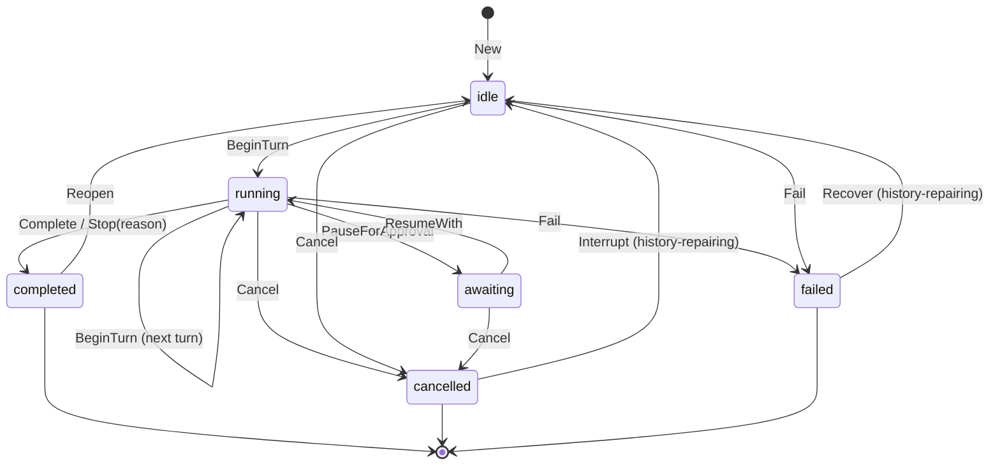

# The domain model

> Part of the [mecatl architecture guide](../architecture.md).

**What this covers:** the `Session` aggregate (state machine), `Conversation`/`Message`, value objects (`ToolCall`, `ToolResult`, `Usage`), and the `Event` taxonomy — the core entities the loop drives and the API exposes.

**Prerequisites:** [architecture overview](../architecture.md).

**Follow-on:** [the ports](ports.md) — the seams the loop consumes — then [the agent loop](agent-loop.md).

This page is the prose walkthrough. The **formal** domain model — entities,
relationships, and invariants as a checked artifact — is
[`mecatl.modelith.md`](mecatl.modelith.md), generated by
[modelith](https://github.com/stacklok/modelith) from `mecatl.modelith.yaml`
(edit the `.yaml` and re-render with `task docs:model`; never edit the `.md`).

### Session aggregate (`engine/session/session.go`)

`Session` is the aggregate root. Outside code holds a `SessionID` and reaches
inner entities only through intention-revealing methods, so the state machine
and stop conditions always hold. There are no public setters for lifecycle
state; mutation flows through methods such as `BeginTurn`, `RecordAssistant`,
`RecordToolResults`, `RecordUserPrompt`, `ReplaceHistory`, `PauseForApproval`,
`ResumeWith`, `Complete`, `Stop`, `Cancel`, `Fail`.

States (`session.State`): `idle`, `running`, `awaiting`, `completed`, `failed`,
`cancelled`. The last three are terminal (`State.IsTerminal()`).

Every new aggregate also carries validated, durable producer metadata
(`SessionKind` + `SessionRelationship`): public create, peer fork, reasoning-effort
fork, and model carryover are `main` with no lineage; scheduler fires are
`scheduled`; and Subagent, Parallel, and Supervisor producers stamp their respective
child relationships. Snapshot stores and metadata listings round-trip it, while an
absent legacy kind restores as fail-closed `unknown`. `session.New` remains the
main-session constructor; the non-main producer paths use intention-revealing
validated constructors.

A terminal session can re-enter the loop through one of three intention-revealing
seams (one per terminal state — each is legal ONLY from its own state and they
never widen into each other):
- `completed → (Reopen) → idle` — a clean end-of-run is reopened to accept the
  next prompt, preserving history and resetting per-run `Counters`.
- `cancelled → (Interrupt) → idle` — an interrupted turn is recovered the same
  way, but Interrupt **also repairs the history**: a turn cancelled mid-dispatch
  can leave the trailing assistant message with tool calls that never received a
  result, so `closeOutInterruptedTurn` appends one synthetic error tool result
  per orphaned `ToolCall.ID` before going idle, keeping the replayed history
  provider-valid (no dangling `tool_use`/`function_call`).
- `failed → (Recover) → idle` — a failed run (a transient provider failure, e.g.
  an upstream 5xx that exhausted the resilience layer's retries) recovers with
  the **same history repair** as Interrupt, so the session is retryable instead
  of permanently bricked (issue #51). Recovery makes retry *possible*, not
  guaranteed — a permanent-cause failure simply fails again with the
  conversation context intact.

The service's `loadAndReopen` drives the right seam per state; all three persist
the recovered snapshot.

Notable, code-accurate details:
- `BeginTurn` is legal from `idle` **or** `running` (a follow-up model call in
  the same run) and increments `Counters.Turns`. It does **not** itself enforce
  limits; the loop consults `StopReason()` as a pre-turn guard.
- `Cancel`/`Fail`/`Stop`/`Complete` are legal from any non-terminal state and
  clear any pending ask.
- `ResumeWith()` takes **no** governance argument and returns the resolved
  `PendingAsk`. The aggregate only reconciles its own lifecycle; the loop owns
  acting on the decision. This keeps `session` a clean domain leaf with no
  `governance` dependency in its method signatures.

`Limits` (`MaxTurns`, `MaxToolCalls`, `MaxConsecutiveFailures`) and `Counters`
(`Turns`, `ToolCalls`, `ConsecutiveFailures`) drive stop conditions. A **zero
limit disables** that condition — which is why the composition root injects
non-zero defaults. Three derived predicates:
- `LimitTripped()` — pure; reports the limit-implied stop reason.
- `RecordedStopReason()` — pure; the faithful terminal reason recorded via
  `Stop/Cancel/Fail/Complete` (used by persistence; performs no derivation).
- `StopReason()` — `RecordedStopReason()` first, else `LimitTripped()`; the
  loop's pre-turn guard. Its godoc explicitly warns it conflates the two and is
  not a faithful witness — persistence must use `RecordedStopReason()`.

`PermissionMode`: `default`, `plan` (read-only toolset enforced), `acceptEdits`. A
plan-mode run gains a structured approval gate (ADR 0069): once the model has presented a
complete plan it calls the `PresentPlan` signalling tool, which the dispatcher intercepts
and surfaces as a `PlanOriginated` permission ask; the operator approves (→ flip to
`default`/`acceptEdits` and execute) or iterates (→ stay in `plan`). See
[agent-loop.md](agent-loop.md#plan-approval-gate).

### Conversation / Message / Turn (`engine/session/conversation.go`)

`Conversation` holds the ordered, model-visible `[]Message`. `Message` is an
immutable value object built via `NewUserMessage`, `NewSystemMessage`,
`NewAssistantMessage(text, reasoning, calls)`, `NewToolMessage(result)`. Roles:
`system`, `user`, `assistant`, `tool`. `Message.Reasoning` carries the
provider's opaque reasoning item, replayed back verbatim and never interpreted.
`Message.ProviderPhase` carries the OpenAI Responses **phase** marker
(`commentary`/`final_answer`) under the same discipline — opaque, replayed
verbatim on the assistant message item, never displayed or interpreted (issue
#46: dropping it makes GPT-5.x treat preambles as final answers and stop early).
`Turn` is a value object summarizing one model call plus its results and usage
(defined but not the primary carrier — the loop appends messages directly).

### Value objects

- `ToolCall{ID, Name, Args json.RawMessage}` (`toolcall.go`) — produced by the
  LLM, consumed by tool + governance; `NewToolCall`.
- `ToolResult{CallID, Content, IsError, Parts}` — `NewToolResult` /
  `NewToolError` retain the legacy text-only shape; `NewToolResultWithParts`
  adds typed result blocks. Consumers prefer non-empty `Parts`, while `Content`
  remains the fallback when a provider cannot consume a block's modality. For
  example, `Read` returns detected PNG, JPEG, GIF, and WebP files as
  `BlockImage` content with a textual fallback. An error result is still fed
  back to the model so it can recover.
- `Usage{InputTokens, OutputTokens, CacheReadTokens, CacheWriteTokens}`
  (`usage.go`) with `CacheHitRate()` and an immutable `Add(other) Usage`.
- `TokenUsage` is the canonical durable aggregate for model work. It groups totals by
  a closed usage kind and opaque server-selected provider/model entries; each total is
  the sum of its entries. `Session.UsageFor` reads a bucket's authoritative total.
  Run budgets measure the `main` bucket from an internal, immutable per-run baseline.

### Session titles and durable token accounting

A session starts with its first genuine prompt as a fallback title. An operator can
replace an idle main-session title through `RenameSession`; that records `operator`
provenance and permanently stops automatic generation. An explicit compatible
`models.slots.title` binding records durable `pending` generation intent; no usable
binding records `disabled`. The `title` slot deliberately has no fallback, so title
calls are opt-in.

At prompt ingress the aggregate retains only the first three genuine, non-empty
principal text prompts. Every terminal relay persists a completed exchange before
submitting bounded asynchronous title work. On startup, the coordinator makes one
capped initial metadata-page scan for completed eligible sessions that have no
attempt; it deliberately does not follow the cursor, so restart reconciliation is
bounded best-effort rather than an inventory sweep. Generated input is fenced untrusted data;
output is strict, valid UTF-8, normalized to one line, and capped at 80 runes. Title
metadata has a durable, title-specific revision that advances with every effective
mutation. Both live `session.title` events and session snapshots carry it; clients
accept legacy revision `0` only until a positive revision has been observed for the
active session, then retain only a strictly higher revision. This makes a snapshot
followed by a delayed older live event converge on the snapshot rather than regress.

A physical call records its input/output tokens only in `TokenUsage[session_title]`,
attributed to the composition-selected opaque provider/model. It never changes the
`main` usage bucket, a main-run budget, `EvResult` usage, or the conversation. The Service
emits session-correlated, diagnostics-only lifecycle records for submission, admission,
claim, generator selection/completion, and conditional commit loss. Completion records
only outcome, provider/model attribution, token counts, and on failure a stable class
plus stage; it never records prompt sources, provider error text, credentials, or model
output. See [ADR 0308](../adr/0308-session-title-generation-and-auxiliary-usage.md)
and [ADR 0307](../adr/0307-canonical-durable-token-accounting.md).

### Event taxonomy (`engine/session/event.go`)

`EventType` is the single, provider-neutral taxonomy shared by the loop and the
API. The real constants:

| EventType value | Const | Emitted when |
|---|---|---|
| `session.init` | `EvSessionInit` | run starts — emitted exactly once, before the SessionStart hook and the first `turn.start` |
| `session.title` | `EvSessionTitle` | a durable session-title lifecycle change — carries the source-free `TitlePayload` (`Title`, `Provenance`, `GenerationState`, `LatestAttempt`, and durable title `Revision`), never title-source prompts or provider error text |
| `turn.start` | `EvTurnStart` | beginning of each turn |
| `turn.end` | `EvTurnEnd` | closes a turn's model exchange, carrying the typed `TurnEndPayload` |
| `message.delta` | `EvMessageDelta` | streamed assistant text delta |
| `reasoning.delta` | `EvReasoningDelta` | streamed, display-only reasoning summary text |
| `tool.call` | `EvToolCall` | a tool is about to run |
| `tool.result` | `EvToolResult` | a tool result (incl. denies / hook blocks) |
| `tool.progress` | `EvToolProgress` | transient progress for a long-running tool |
| `permission.ask` | `EvPermissionAsk` | loop paused for client approval |
| `permission.retract` | `EvPermissionRetract` | a previously surfaced ask is withdrawn (e.g. the child that parked it was cancelled) |
| `approval` | `EvApproval` | a permission ask was RESOLVED by a verdict (tool name + verdict string + askID — never the raw args); **log-only**, persisted to the durable event log, skipped on the client wire |
| `hook` | `EvHook` | a hook fired (e.g. PreToolUse block) |
| `compaction` | `EvCompaction` | a compaction boundary crossed |
| `compaction.archive` | `EvCompactionArchive` | carries the pre-compaction conversation for the durable record; **log-only**, skipped on the client wire (cloud-native Phase 3b) |
| `no_progress` | `EvNoProgress` | a completed turn produced no tool call and no meaningful text; the loop is nudging (gentle, then a final best-effort extraction) or giving up |
| `result` | `EvResult` | terminal: carries `ResultPayload{Stop, Text, Usage}` |
| `user_prompt` | `EvUserPrompt` | a user-role message was recorded (the genuine client prompt AND the harness-authored synthetic continuations — the no-progress / background nudges & completion notice), carrying `UserPromptPayload`; **log-only**, persisted to the durable event log and skipped on the client wire — it lets an event-sourced fold reconstruct user-role turns |
| `subagent.start/tool/end` | `EvSubagent*` | a `Subagent` child run's REDACTED, bounded-preview projection (flat fleet) |
| `team.start/member/tasks/findings/end` | `EvTeam*` | an in-process `Team` run's BOUNDED projection (coordinating roster) |
| `parallel.start/branch/end` | `EvParallel*` | a `Parallel` fork-join run's REDACTED, bounded-preview GROUP projection (join + winner + fork paths) |

`Event` carries `Type, Seq, Turn, Text` plus the optional `Title *TitlePayload` (set on
`EvSessionTitle`) and other optional pointers `ToolCall`, `ToolResult`, `Ask *PendingAsk`, `Result *ResultPayload`, `TurnEnd *TurnEndPayload`,
`Hook *HookPayload`, `Approval *ApprovalPayload`,
`CompactionArchive *CompactionArchivePayload`, `UserPrompt *UserPromptPayload`,
`Usage *Usage`, `Subagent`, `Team`, `Parallel` (each set only on its own event
kind).

The three DELEGATION families (`subagent.*` / `team.*` / `parallel.*`) project child-loop
lifecycle events and differ in AGGREGATION shape — flat fleet vs coordinating roster vs
fan-out group. As of ADR 0079 they converge on a TWO-TIER model: all three families project
the same BOUNDED PREVIEWS — capped and control-byte-scrubbed (the shared `clampPreview` in
`engine/agent/teamtool.go`), client-only — through the single `drainChildObserved`
chokepoint, so a Subagent or a Parallel branch is watchable at the same fidelity as a Team
member. Team-unique structures stay on tier 2: `team.tasks` and `team.findings` carry capped
snapshots, `team.end` adds terminal per-member dispositions, plus the mutating cue and the
context meter. A member/branch/child `permission.ask` is still never
projected. The families are deliberately NOT merged; a 4th family is the trip-wire to
extract a shared lifecycle value object (see `engine/session/event.go`).
Gauntlet #7 still holds: none of these projections injects branch/child/member transcripts
into the parent conversation — only the delegation tool's final result does (plus, for
Parallel, fork-root path handles).

## Follow-on reading

- [The ports — the seams the loop consumes](ports.md)
- [The agent loop — how the domain is driven](agent-loop.md)

## Related

- [The formal model (modelith)](mecatl.modelith.md) — entities, relationships, and invariants as a checked artifact.

---

[← Architecture guide](../architecture.md)
