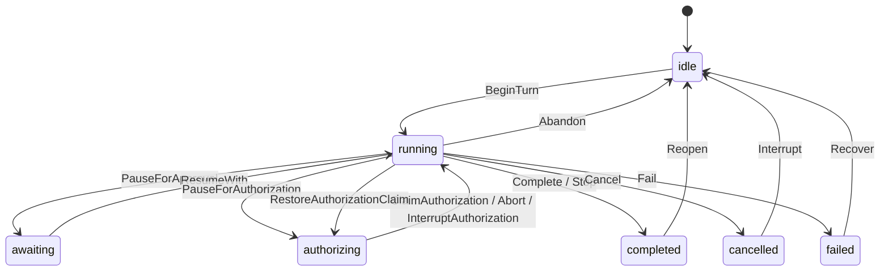

# The domain model

The domain lives in [`engine/session`](../../engine/session): the `Session` aggregate,
its conversation, the value objects the loop and governance exchange, and the single
event taxonomy. The package imports only the standard library and `engine/governance`,
so every other layer can depend on it. [`mecatl.modelith.md`](mecatl.modelith.md) is
the generated, checked model of the same entities and invariants.

## The Session aggregate

`Session` is the aggregate root. Lifecycle state, conversation history, counters, and
token usage change only through its methods (`BeginTurn`, `RecordAssistant`,
`RecordToolResults`, `PauseForApproval`, `Complete`, and so on). Each method checks the
current state and returns `ErrIllegalTransition` when the move is not allowed. Keeping
every mutation behind the root enforces the state machine, the stop conditions, and
tool pairing in one place instead of at every call site.

Fields such as `Profile`, `ProviderID`, `ModelID`, `EnvironmentRef`, and `Owner` are
inert labels: the aggregate persists them but never interprets them. Composition owns
their meaning, which keeps providers, placement, and identity out of the domain while
letting a restarted process rebuild the same per-session engine. `SessionKind` (main,
scheduled, subagent, parallel branch, team member, or debug) and `SessionRelationship`
record who produced the session; legacy data restores as `unknown`, which fails closed.

`Limits` and `Counters` drive the stop conditions; a zero limit disables that check.
`StopReason` is the loop's pre-turn guard and mixes the recorded reason with a limit
check, so persistence uses `RecordedStopReason` instead.

## Conversation and messages

`Conversation` is the ordered, model-visible `[]Message`. A `Message` is an immutable
value object built through constructors such as `NewAssistantMessage` and
`NewToolMessage`. Some fields are opaque provider replay data: `Reasoning`,
`ProviderPhase`, `ReasoningItemID`, and `ToolCall.ItemID`. Providers are called
statelessly with the full history and can reject or misbehave on a replay that drops
them, so the harness stores them verbatim and never branches on their contents.

A user-role message records its `UserPromptProvenance`: `principal` for authenticated
operator input, `harness` for loop-authored continuations, or unknown. Unknown is never
treated as principal authority.

## The session state machine

```mermaid
stateDiagram-v2
  [*] --> idle
  idle --> running: BeginTurn
  running --> awaiting: PauseForApproval
  awaiting --> running: ResumeWith
  running --> authorizing: PauseForAuthorization
  authorizing --> running: ClaimAuthorization / Abort / InterruptAuthorization
  running --> authorizing: RestoreAuthorizationClaim
  running --> completed: Complete / Stop
  running --> cancelled: Cancel
  running --> failed: Fail
  completed --> idle: Reopen
  cancelled --> idle: Interrupt
  failed --> idle: Recover
  running --> idle: Abandon
```

`Cancel`, `Fail`, `Stop`, and `Complete` are also legal from `idle` and `awaiting`.
`ResumeWith` takes no governance argument: the aggregate only reconciles its
lifecycle, and the loop acts on the verdict. `authorizing` parks a call that needs
external authorization, such as MCP OAuth, with its deferred siblings, and leaves only
through its own methods.

Each terminal state has exactly one seam back to `idle`. `Abandon` covers a snapshot
left `running` by a process that exited mid-turn. All four share one reset that clears
the stop reason, pending ask, and counters but keeps main token usage, so a run budget
stays cumulative across reopen and restart. `Abandon` then keeps a pending exact
retry, so a crash after durable preparation returns to idle-but-pending. The server's `repairTerminalState` applies
the seam for each terminal state; only the run-entry path abandons a `running`
session, after it holds the session lock. Non-error stops such as `no_progress`,
`budget`, and `plan_approved` end in `completed`, so they stay reopenable.

## Tool call and result pairing

Every assistant tool call needs a following result, and every result must answer an
earlier call. Providers reject both an orphaned result and a dangling call with HTTP
400. Because each request replays the full history, one malformed history fails every
later turn and bricks the session. `ValidateToolPairing` checks both directions, and
these seams keep the history valid:

- `ReplaceHistory`, `ReplaceHistoryAtBoundary`, and `SeedHistory` reject an unpaired
  slice. The compactors also validate their output and keep the original on failure.
- `Interrupt`, `Recover`, and `Abandon` append one synthetic error result per
  unanswered call, worded for the actual cause.
- Resuming from `awaiting` after a restart, and `AbortAuthorization`, close out the
  unanswered sibling calls and record every result in `ToolCalls` order.
- Denied and hook-blocked calls still get an error result.
- Steering and harness nudges are recorded only at turn boundaries.

## Typed tool results

A `ToolResult` has a `Content` string and optional typed `Parts` (text, image, audio,
resource link, embedded resource, or structured content). Consumers prefer `Parts` and
fall back to `Content`; `Read`, for example, returns images as an image block with a
text fallback. Error results still go to the model so it can recover.

Providers project `Parts` through `port.RouteToolResultParts`. Image and audio blocks
survive only when the session's model supports them, and blocks that render to empty
text are dropped because strict providers reject them. The projection never rewrites
recorded history. `Content.Audience` is untrusted server input and never suppresses
model-visible content. Resource links are never fetched automatically; the
`FetchMcpResource` tool fetches only `https://` links that pass `ValidateMediaURL`.

## Events

`EventType` is one provider-neutral taxonomy shared by the loop and the API. An
`Event` carries its type, sequence number, turn, and only the payload for its kind.
The loop emits to `port.EventSink`; the server relay forwards events to clients and
appends them to the durable `port.EventLog`. Some types, such as `approval` and
`compaction.archive`, are log-only and never reach clients; a `user_prompt` reaches
clients only when it carries a scheduled-task delivery note. The `subagent.*`, `team.*`, and
`parallel.*` families project child runs as bounded, redacted previews. Child
transcripts never enter the parent conversation; only the delegation tool's result does.

## Session titles and token accounting

The first genuine prompt becomes the fallback title. An operator rename records
`operator` provenance, which automatic generation never overwrites. Generation is
opt-in through the `title` model slot: the server's title coordinator fences up to
three source prompts as untrusted input and accepts only valid, single-line output of
at most 80 characters. Each title change advances `TitleRevision`, which snapshots and
`session.title` events both carry, so a late event cannot undo a newer snapshot.

`TokenUsage` is the durable ledger of model work, bucketed by `UsageKind` (`main`,
`session_title`, `compaction`, `guardrail`, and others) and attributed to an opaque
provider and model. Readers keep unknown kinds so newer writers round-trip. A run
budget counts `main` and `router` usage, measured from a per-run baseline; title
generation, compaction, and other auxiliary calls land in their own buckets.

## Harness context runtime

A `HarnessContext` is the deployment-configured set of sources for instructions,
commands, rules, skills, and agent definitions, selected independently of the
execution `Environment` ([`internal/app/harness_context.go`](../../internal/app/harness_context.go)).
A source registration is either process-scoped and shared, or principal-scoped and
bound per session with its ID, owner, and profile.

Only a registration that declares it uses execution files gets a lazy callback. It
reattaches the session's server-authorized placement and returns a write-refusing
workspace and its own release, never a command runner or the session's read ledger,
so source reads cannot count as read-before-edit evidence. Retiring a session's
binding defers cleanup until the last borrower releases it.

## Related

- [The ports](ports.md)
- [The agent loop](agent-loop.md)
- [Context and compaction](context-and-compaction.md)
- [Engine and session (public docs)](../../user-docs/building/what-you-get/engine-and-session.md)
