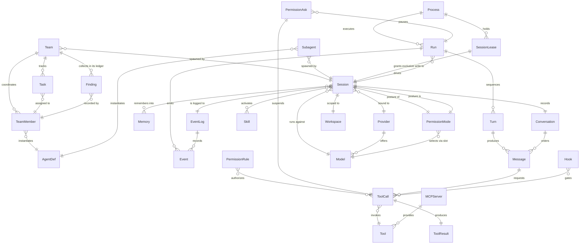

{/* Generated by `modelith render`. Do not edit by hand; edit the .modelith.yaml source and re-render. */}

# mecatl — Agentic Coding Harness

The domain of mecatl: a headless agentic coding harness. A `Session` carries a `Conversation` that a `Run` drives turn by turn against a `Provider`, invoking `Tools` under a permission model, emitting a stream of `Events`, and optionally delegating to `Subagents` and `Teams`. Pass 2 adds the invariants that must always hold and scenarios that stress-test them. For the prose walkthrough see the [architecture guide](../architecture.md).

## Glossary

- **`Client`** — An API consumer driving a `Session` over gRPC, HTTP/SSE, or ACP — and the party that answers a `PermissionAsk`.
- **`Lead`** — The `TeamMember` that coordinates a `Team` and produces the consolidated synthesis returned as the team's result.
- **`Operator`** — Whoever deploys and configures the harness: sets `PermissionRules`, `Hooks`, token budgets, provider credentials, and connects `MCPServers`.
- **`Principal`** — The human or caller on whose behalf a `Session` runs — the source of the trusted prompt and team goal.

## Entities

### `AgentDef`

A reusable definition of a specialist agent — its role prompt, tool grants, model, and optional memory head — from which a `Subagent` or `TeamMember` can be instantiated. It is a value object: where it came from is a tier label (managed, project, user), not a location.

**Invariants**

- **agentdef-origin-is-tier-not-location** — An `AgentDef`'s origin is a trust tier (managed, project, user), never a filesystem location.

### `Conversation`

The ordered history of `Messages` belonging to one `Session`. It is the replayed context sent to the `Provider` each turn, and the thing a compactor rewrites when it grows too large. It cannot exist outside its `Session`.

**Relationships**

- `Message` — 1:n — owned — orders

**Invariants**

- **conversation-no-orphan-tool-result** — Every tool `Message` pairs with a preceding `ToolCall`; the `Conversation` never contains an orphaned `ToolResult`.

- **compaction-keeps-recent-user-intent** — Compaction preserves the first and most-recent user `Messages` verbatim and never produces unpaired history.

- **compaction-archived-to-log** — Before compaction rewrites the `Conversation`, the replaced span is archived to the `EventLog`, so compacted history remains reconstructible.

### `Event`

A typed, ordered item on a `Run`'s output stream — the single observable currency shared by every interface (gRPC, HTTP/SSE, ACP). Each step of the loop (turn start/end, tool call, tool result, permission ask, result) is an `Event`. A transient `Event` is recorded into the durable `EventLog` for later replay.

**Invariants**

- **event-ordered-and-typed** — Every `Event` is emitted in order on its `Run`'s stream, and the same typed `Event` model is shared by every interface.

### `EventLog`

The durable, append-only record of a `Session`'s `Events`, distinct from the transient stream the loop emits. It is the source of truth for replaying state the `Session` snapshot does not carry — learned `PermissionRules`, the pre-compaction `Conversation` archive, and the user-role turns (the log-only `EvUserPrompt`) — when a `Session` is rehydrated after a restart. Because it carries the user turns alongside the assistant/tool `Events`, a host whose system of record IS the log can reconstruct the whole `Session` by FOLDING the stream (the event-sourced rehydration path), not only top up a snapshot (structural reconstruction; a pure fold is byte-identical-replay only for providers not using the opaque reasoning-replay fields — Reasoning/ProviderPhase/ToolCall.ItemID are not on the event stream — see ADR 0038).

**Relationships**

- `Event` — 1:n — referenced — records

**Invariants**

- **event-log-append-only** — The `EventLog` is append-only and records each `Event` at most once, independently of whether a `Client` is still connected.

- **event-log-records-terminal-tail** — The `EventLog` records every `Event` a `Run` emits, including the terminal result emitted after a `Client` disconnects.

- **event-log-reconstructs-user-turns** — The `EventLog` records every user-role turn (the genuine prompt and the harness's synthetic continuations) as a log-only `EvUserPrompt`, so folding the stream reconstructs the `Session`'s `Conversation` including what the user asked — not only the assistant and tool `Events`.

### `Finding`

An entry a `TeamMember` records to its `Team`'s shared findings ledger. The `Lead` synthesizes the team's consolidated result from the `Findings`. A `Finding` is part of its `Team` and does not outlive it.

**Relationships**

- `TeamMember` — n:1 — referenced — recorded by

**Invariants**

- **finding-fenced-untrusted** — A `Finding` read by another `TeamMember` or the `Lead` is treated as untrusted input.

### `Hook`

A deterministic, operator-configured program that fires at a lifecycle point (session start, prompt submit, pre/post tool use, stop) and can allow or block by exit code. Hooks are the deterministic counterpart to the model-based permission and guardrail layers.

**Relationships**

- `ToolCall` — n:n — referenced — gates

**Invariants**

- **hook-exit-code-decides** — A `Hook` allows the gated action on exit code 0 and blocks it on exit code 2.

### `MCPServer`

An external Model Context Protocol server, connected over streaming-HTTP transport only, whose tools are registered into the catalog as namespaced `Tools`. It is a driven adapter, never spawned as a local stdio process.

**Relationships**

- `Tool` — 1:n — referenced — provides

**Invariants**

- **mcp-streaming-http-only** — An `MCPServer` connects only over streaming-HTTP transport; it is never spawned as a local stdio process.

- **mcp-tools-namespaced** — An `MCPServer`'s `Tools` are registered into the catalog under a server-namespaced name.

### `Memory`

Durable, tiered knowledge a `Session` can write (Remember) and read back (Recall, SearchMemory) across runs and sessions, with an optional background consolidation pass. A user-scoped tier sits alongside the session-scoped one. Memory is independent of any single `Session`.

**Invariants**

- **memory-outlives-session** — `Memory` persists independently of any single `Session` and is readable across runs and sessions.

### `Message`

One entry in a `Conversation`, attributed to a role (user, assistant, or tool). An assistant `Message` may carry text, an opaque reasoning blob, and one or more `ToolCalls`; a tool `Message` carries a `ToolResult`. `Messages` are immutable once recorded.

**Relationships**

- `ToolCall` — 1:n — owned — requests

**Invariants**

- **message-immutable** — A `Message` is immutable once recorded into a `Conversation`.

### `Model`

A specific model exposed by a `Provider`, with its own context window and capabilities (text, image, reasoning). A `Session` runs against one `Model`; a `Subagent` or `TeamMember` may override it within the same `Provider`, and a `PermissionMode` change may re-resolve it within the same `Provider` (plan mode → a strong-reasoning model, ADR 0030 Layer 3).

**Invariants**

- **model-override-stays-in-provider** — A `Subagent` or `TeamMember` may override the `Model` only within the `Session`'s bound `Provider`.

### `PermissionAsk`

A suspension of a `Run` when a `ToolCall` resolves to "ask": the loop pauses and surfaces the request to the `Client`, which approves or denies before the loop continues. A child's ask may surface to an interactive parent or be adjudicated by a bounded reviewer in a headless deployment.

**Relationships**

- `ToolCall` — 1:1 — referenced — suspends
- `Run` — n:1 — referenced — pauses

**Invariants**

- **ask-suspends-run-until-resolved** — A `PermissionAsk` suspends its `Run` and blocks the `ToolCall` from executing until a `Client` or reviewer resolves it.

- **child-ask-redacts-raw-args** — A child `PermissionAsk` surfaced to a parent or reviewer never carries the child's raw `ToolCall` arguments.

- **ask-resolves-to-verdict** — A `PermissionAsk` resolves to exactly one verdict — allow-once, allow-always, or deny.

### `PermissionMode`

A `Session`'s permission posture — default, plan, or acceptEdits — governing which `Tools` may run and, via ADR 0030 Layer 3, the effective `Model`: in plan mode the `Session` re-resolves the plan slot to a strong-reasoning `Model` within the same `Provider`. Plan mode is enforced at two layers (catalog filter hides mutating `Tools`; evaluator gate hard-denies mutations). `acceptEdits` is a declared-but-not-yet-implemented posture (ADR 0022 Future work): it is carried as metadata and surfaced in mode pickers, but the decision path treats it identically to `default` (deny→ask→allow), so it auto-allows nothing today. It is a value object owned by exactly one `Session`; a control surface switches it out of band (e.g. ACP session/set_mode).

**Relationships**

- `Session` — 1:1 — referenced — posture of
- `Model` — n:1 — referenced — selects via slot — Plan mode re-resolves the plan slot to a `Model` within the `Session`'s bound `Provider`; default/acceptEdits keep the session `Model`.

**Invariants**

- **mode-switch-rejected-mid-turn** — A `PermissionMode` change is rejected while a turn is in flight (running or awaiting); a control surface defers it to the next turn boundary.

- **mode-model-same-provider** — A mode-driven `Model` re-resolution stays within the `Session`'s bound `Provider`; the provider is fixed per session.

- **mode-model-fixed-per-turn** — The effective `Model` is fixed for the duration of a turn; a mode change re-resolves it only between turns, at the run-entry seam, never mid-stream.

- **acceptedits-declared-not-implemented** — `acceptEdits` is carried as metadata and surfaced in mode pickers, but the permission decision path never branches on it — it resolves identically to `default` (deny→ask→allow). It auto-allows no `ToolCall` today; a real auto-accept-edits tier is ADR 0022 Future work.

### `PermissionRule`

A governance rule that maps a `Tool` invocation to an effect — deny, ask, or allow — within a scope (managed, CLI, project, user, built-in default) and an audience (main session or delegated child). Rules resolve deny-dominant: a deny in any scope is absolute.

**Relationships**

- `ToolCall` — n:n — referenced — authorizes

**Invariants**

- **deny-dominant** — A deny in any scope is absolute; among ask and allow the higher configured scope wins, and a configured ask is never suppressed by a higher-scope allow.

- **plan-mode-denies-mutations** — In plan mode, every mutating `ToolCall` is denied.
- **allow-always-learns-rule** — An allow-always verdict on a `PermissionAsk` learns a `PermissionRule` matching the approved `Tool`, so the same `ToolCall` is not asked again.

- **learned-rule-volatile-rehydrated-from-log** — A learned `PermissionRule` is held in memory and lost on restart; it is reconstructed from the `EventLog` when the `Session` is rehydrated.

### `Process`

A disposable harness instance — one running process — that loads `Sessions` from the durable stores, holds their `SessionLeases`, and executes `Runs`. Killing a `Process` and starting another over the same stores loses nothing the user relies on: rehydration is a new `Process` reconstructing a `Session` from its snapshot plus the `EventLog`.

**Relationships**

- `Run` — 1:n — referenced — executes
- `SessionLease` — 1:n — referenced — holds

**Invariants**

- **process-disposable** — Killing a `Process` and starting another over the same durable stores loses no state the user relies on; all load-bearing state is externalized to the snapshot and the `EventLog`.

### `Provider`

An LLM backend behind a provider-agnostic port — OpenAI Responses, the native Anthropic Messages API, or OpenRouter. A `Provider` offers a catalog of `Models` and is selected per `Session`. Adapters are stateless: the full `Conversation` is replayed each turn.

**Relationships**

- `Model` — 1:n — referenced — offers

**Invariants**

- **provider-stateless-replay** — A `Provider` adapter holds no server-side conversation state; the full `Conversation` is replayed each `Turn` behind a byte-stable cache prefix.

### `Run`

A single drive of a `Session` from a starting state to a terminal one — one invocation of the agent loop. A `Run` sequences `Turns`, emits a stream of `Events`, and ends with a stop reason (end-of-turn, budget, no-progress, cancelled, error). It is the execution, not the state: the `Session` it drives outlives it.

**Relationships**

- `Session` — n:1 — referenced — drives
- `Turn` — 1:n — owned — sequences
- `Event` — 1:n — owned — emits

**Invariants**

- **run-one-terminal-stop** — A `Run` drives its `Session` to exactly one terminal state and reports exactly one stop reason.

- **run-no-replay-after-first-chunk** — Once a `Turn` has streamed its first chunk, the `Run` never retries or replays that `Turn`.

### `Session`

The central aggregate and unit of work: a stateful conversation between a principal and a model, with its own workspace, usage accounting, and limits. A `Session` is a state machine (idle, running, awaiting, completed, cancelled, failed) and is bound to exactly one `Provider` and `Model` for its lifetime. It survives process restarts when backed by a store.

**Relationships**

- `Conversation` — 1:1 — owned — records
- `Workspace` — 1:1 — owned — scoped to
- `Provider` — n:1 — referenced — bound to — A `Session`'s `Provider` is fixed for its lifetime
- `Model` — n:1 — referenced — runs against
- `PermissionMode` — 1:1 — owned — posture is — The `Session`'s `PermissionMode` governs its toolset and — via ADR 0030 Layer 3 — its effective `Model`: switching to plan mode re-resolves the plan slot to a strong-reasoning `Model` within the same `Provider`, between turns.

- `Memory` — n:n — referenced — remembers into
- `Skill` — n:n — referenced — activates
- `EventLog` — 1:1 — referenced — is logged to — The `Session` aggregate is also persisted as a point-in-time snapshot (state, `Conversation`, usage, pending `PermissionAsk`); the snapshot plus the `EventLog` together rehydrate it after a restart.

**Invariants**

- **fixed-provider-per-session** — A `Session` is bound to one `Provider` and one `Model` for its entire lifetime; they are re-derived together, never swapped individually.

- **session-recover-before-reuse** — A `Session` in a terminal state (completed, cancelled, or failed) is returned to idle before any new `Run` reuses it.

- **session-usage-survives-restart** — Cumulative token usage is preserved across reopen, interrupt, recover, and process restart.

### `SessionLease`

An exclusive, renewable, expiring claim on a `Session` held by a single `Process`, so that at most one `Process` writes a `Session` at a time. Sessions are routed to the `Process` holding their lease (session affinity); when a holding `Process` dies, the lease expires and another `Process` may acquire it and rehydrate the `Session`.

**Relationships**

- `Session` — 1:1 — referenced — grants exclusive write to — A `Session` has at most one live `SessionLease` at a time

**Invariants**

- **single-writer-per-session** — At most one live `SessionLease` exists per `Session`; two `Process` instances never write the same `Session` concurrently.

- **session-affinity-routing** — A `Session` is routed to the `Process` that holds its `SessionLease`.

### `Skill`

A logical bundle of instructions and named assets that the agent can activate by name to extend its behavior for a task. A `Skill` crosses the boundary as identity, body, and payloads — never as a path. Textual assets are read one at a time by logical name through the `Skill` tool.

**Invariants**

- **skill-crosses-as-bundle-not-path** — A `Skill` crosses the boundary as identity, body, and named assets — never as a filesystem path or directory.

- **skill-assets-on-demand** — A `Skill`'s textual assets are retrieved one at a time by logical name; they are not materialized or exposed to the `Workspace`.

### `Subagent`

A one-shot, isolated child agent spawned by a `Session` to explore or delegate a task in its own read-only sandbox, returning a single result. It runs the same agent loop in a less-privileged child context and may be instantiated from an `AgentDef`. Subagents do not nest.

**Relationships**

- `Session` — n:1 — referenced — spawned by
- `AgentDef` — n:1 — referenced — instantiates

**Invariants**

- **subagent-no-nesting** — A `Subagent` cannot spawn further `Subagents`.
- **subagent-read-only-sandbox** — A `Subagent` runs in a strictly less-privileged, read-only child context.
- **subagent-fanout-bounded** — Concurrent child agents are bounded by a child-concurrency gate.

### `Task`

A unit of work on a `Team`'s shared task list, assigned to a `TeamMember` and tracked to completion. A `Task` has no meaning outside its `Team`.

**Relationships**

- `TeamMember` — n:1 — referenced — assigned to

**Invariants**

- **task-within-team** — A `Task` exists only within its `Team` and is assigned to at most one `TeamMember` at a time.

### `Team`

A coordinated crew of `TeamMembers` spawned by a `Session`, working a shared task list and findings ledger under a lead that synthesizes the consolidated result. The team's goal is trusted by default; peer messages are not.

**Relationships**

- `Session` — n:1 — referenced — spawned by
- `TeamMember` — 1:n — owned — coordinates
- `Task` — 1:n — owned — tracks
- `Finding` — 1:n — owned — collects in its ledger

**Invariants**

- **team-goal-trusted-peers-untrusted** — A `Team`'s goal is trusted as principal-authored; peer messages and claimed-task descriptions are treated as untrusted input.

- **team-returns-lead-synthesis** — A `Team` returns the `Lead`'s consolidated synthesis, not concatenated `TeamMember` output.

- **team-coordination-not-durable** — Mid-round `Team` coordination state — roster, `Task` assignments, the `Finding` ledger, and the round number — is not durable; only member sessions persist, so a mid-round `Team` does not survive a `Process` restart and must be re-created.

### `TeamMember`

One worker within a `Team`, running an isolated child loop and contributing findings to the shared ledger. A member may be instantiated from an `AgentDef` and has its own persisted child session. It cannot exist outside its `Team`.

**Relationships**

- `AgentDef` — n:1 — referenced — instantiates

**Invariants**

- **member-isolated-loop** — Each `TeamMember` runs an isolated child loop and never shares a `Conversation` with another member.

### `Tool`

A capability the model can invoke by name — Read, Edit, Write, Grep, Glob, Bash, and opt-in tools like memory, skills, and delegation. A `Tool` is either read-only (may run concurrently) or mutating (never concurrent). It defines a name and an argument schema; a `ToolCall` is one invocation of it.

**Invariants**

- **tool-readonly-or-mutating** — Every `Tool` is classified read-only or mutating, and that classification governs how its `ToolCalls` are dispatched.

- **plan-mode-invisible-tools** — In plan mode, the `Catalog` hides mutating `Tools` from the model's view before dispatch — a defense in depth ahead of the evaluator's hard-deny gate, so the model never even sees a mutating `ToolSpec`.

### `ToolCall`

A single request by the model to invoke a `Tool` with concrete arguments, issued within a `Turn`. It must be authorized by the permission model before it executes, and it produces exactly one `ToolResult`.

**Relationships**

- `Tool` — n:1 — referenced — invokes
- `ToolResult` — 1:1 — owned — produces

**Invariants**

- **toolcall-authorized-before-execute** — A `ToolCall` executes only after the permission model resolves it to allow.
- **toolcall-exactly-one-result** — A `ToolCall` produces exactly one `ToolResult`.
- **mutating-toolcalls-serial** — Two mutating `ToolCalls` never execute concurrently; read-only `ToolCalls` may run in parallel.

### `ToolResult`

The outcome of executing a `ToolCall` — either a success payload or an error — recorded back into the `Conversation` as a tool `Message`. Each `ToolResult` belongs to exactly one `ToolCall`.

**Invariants**

- **toolresult-one-call** — A `ToolResult` belongs to exactly one `ToolCall` and is recorded back into the `Conversation`.

### `Turn`

One round-trip with the `Provider` inside a `Run`: the model is given the replayed `Conversation`, streams back a response, and the loop dispatches any `ToolCalls` it requested. A `Run` is a sequence of `Turns`, bounded by a max-turns limit.

**Relationships**

- `Message` — 1:n — referenced — produces

**Invariants**

- **turn-count-bounded** — The number of `Turns` in a `Run` is bounded by a configured maximum.
- **empty-turn-nudged-not-looped** — A `Turn` that completes with no `ToolCall` and no meaningful text is nudged a bounded number of times, then ends cleanly — never silently and never in an infinite loop.

- **snapshot-at-turn-boundary** — The `Session` snapshot is persisted at every `Turn` boundary; an in-flight `Turn` cut by a `Process` death is replayed from the last boundary, not resumed mid-stream.

### `Workspace`

The filesystem scope of a `Session`, rooted at a single directory and contained so that file `Tools` cannot escape it via symlinks or parent traversal. One `Workspace` per `Session`.

**Invariants**

- **workspace-contained** — File `Tools` cannot read or write outside the `Workspace` root, except through explicitly granted read-only roots.

- **workspace-shell-env-scrubbed** — Every agent-facing shell in a `Workspace` runs with provider credentials and other secrets scrubbed from its environment.

## Relationships

## Invariants

- **budget-enforced-at-turn-boundary** — The token budget is checked at a `Turn` boundary: an in-flight `Turn` always completes, and the budget then stops the next `Turn` cleanly.

- **per-engine-budget-inherited-tighten-only** — `MaxRunTokens` is the same configured ceiling for the main engine, each `Subagent`, each `Parallel` branch, every `TeamMember`, and lead synthesis, but each engine enforces it only against its own session usage. Child spend never draws down parent usage; per-call overrides may only tighten a child's ceiling. A delegation tree can therefore exceed this per-engine ceiling.

- **team-budget-round-aggregate** — `MaxTeamTokens` is a distinct, tighten-only aggregate checked between team rounds. Crossing it prevents new rounds; the in-flight round and lead synthesis still complete. Cross-tree aggregate enforcement and observability are deferred.

- **rehydration-needs-snapshot-plus-log** — Rehydrating a `Session` after a restart restores the aggregate from its snapshot and re-derives volatile state — learned `PermissionRules` and the pre-compaction `Conversation` archive — by replaying the `EventLog`; the snapshot alone is insufficient.

- **snapshot-is-primary-projection** — The `Session` snapshot is the primary replay projection and the source of truth for rehydration; the `EventLog` is additive, replayed only for state the snapshot does not carry.

- **rehydrate-tool-exactly-once** — When a `Process` resumes a `Session` parked on a `PermissionAsk`, the pending `ToolCall` executes exactly once and every other unanswered `ToolCall` on the turn is closed out as an aborted result.

## Scenarios

### A tool call pauses for approval and resumes

**Actors:** Principal, Client

**Steps**

1. `Principal` sends a prompt; the `Run` begins and the model issues a `ToolCall` a `PermissionRule` resolves to ask.
2. The `Run` suspends on a `PermissionAsk` and surfaces it to the `Client`.
3. `Client` approves; the `ToolCall` executes, producing one `ToolResult` recorded into the `Conversation`.

**Invariants touched**

- **toolcall-authorized-before-execute** — A `ToolCall` executes only after the permission model resolves it to allow.
- **deny-dominant** — A deny in any scope is absolute; among ask and allow the higher configured scope wins, and a configured ask is never suppressed by a higher-scope allow.

- **ask-suspends-run-until-resolved** — A `PermissionAsk` suspends its `Run` and blocks the `ToolCall` from executing until a `Client` or reviewer resolves it.

- **toolcall-exactly-one-result** — A `ToolCall` produces exactly one `ToolResult`.

### Read-parallel, mutate-serial dispatch

**Actors:** Principal

**Steps**

1. A `Turn` returns several `ToolCalls` at once: three read-only and one mutating.
2. The read-only `ToolCalls` dispatch concurrently while the mutating one runs alone.
3. Each `ToolCall` yields exactly one `ToolResult`.

**Invariants touched**

- **tool-readonly-or-mutating** — Every `Tool` is classified read-only or mutating, and that classification governs how its `ToolCalls` are dispatched.

- **mutating-toolcalls-serial** — Two mutating `ToolCalls` never execute concurrently; read-only `ToolCalls` may run in parallel.

- **toolcall-exactly-one-result** — A `ToolCall` produces exactly one `ToolResult`.

### Switching to plan mode re-resolves the model between turns

**Actors:** Principal, Client

**Steps**

1. `Principal` runs a turn in default mode; the `Session` runs against its session `Model`.
2. `Client` switches the `Session`'s `PermissionMode` to plan; the change is rejected if a turn is in flight and otherwise deferred to the next turn.
3. At the next run entry the `Session` re-resolves the plan slot to a strong-reasoning `Model` within the same `Provider`, and `resolved_model` re-emits it.

**Invariants touched**

- **mode-switch-rejected-mid-turn** — A `PermissionMode` change is rejected while a turn is in flight (running or awaiting); a control surface defers it to the next turn boundary.

- **mode-model-same-provider** — A mode-driven `Model` re-resolution stays within the `Session`'s bound `Provider`; the provider is fixed per session.

- **mode-model-fixed-per-turn** — The effective `Model` is fixed for the duration of a turn; a mode change re-resolves it only between turns, at the run-entry seam, never mid-stream.

- **fixed-provider-per-session** — A `Session` is bound to one `Provider` and one `Model` for its entire lifetime; they are re-derived together, never swapped individually.

### Plan mode hides mutating tools and denies any mutation

**Actors:** Principal, Client

**Steps**

1. `Client` switches the `Session`'s `PermissionMode` to plan between turns.
2. On the next turn the `Catalog` advertises only read-only `ToolSpecs` to the model, so no mutating `Tool` is visible.
3. If a mutation is somehow requested anyway, the evaluator's plan-mode gate hard-denies it before any learned allow is consulted.

**Invariants touched**

- **plan-mode-invisible-tools** — In plan mode, the `Catalog` hides mutating `Tools` from the model's view before dispatch — a defense in depth ahead of the evaluator's hard-deny gate, so the model never even sees a mutating `ToolSpec`.

- **plan-mode-denies-mutations** — In plan mode, every mutating `ToolCall` is denied.
- **deny-dominant** — A deny in any scope is absolute; among ask and allow the higher configured scope wins, and a configured ask is never suppressed by a higher-scope allow.

### acceptEdits is carried but not enforced

**Actors:** Principal, Client

**Steps**

1. `Client` switches the `Session`'s `PermissionMode` to acceptEdits between turns; the mode picker advertises it.
2. On the next turn the `Catalog` advertises the full toolset (acceptEdits hides nothing) and the decision path resolves `ToolCalls` through the normal deny→ask→allow fold — identically to `default`.
3. A mutating `ToolCall` still surfaces a `PermissionAsk`; nothing is auto-allowed by the mode alone.

**Invariants touched**

- **acceptedits-declared-not-implemented** — `acceptEdits` is carried as metadata and surfaced in mode pickers, but the permission decision path never branches on it — it resolves identically to `default` (deny→ask→allow). It auto-allows no `ToolCall` today; a real auto-accept-edits tier is ADR 0022 Future work.

- **deny-dominant** — A deny in any scope is absolute; among ask and allow the higher configured scope wins, and a configured ask is never suppressed by a higher-scope allow.

- **toolcall-authorized-before-execute** — A `ToolCall` executes only after the permission model resolves it to allow.

### The conversation is compacted without losing the task

**Actors:** Principal

**Steps**

1. A long `Run` grows the `Conversation` past the context window.
2. A compactor rewrites the history, summarizing the middle while keeping the first and recent user `Messages` verbatim.
3. The rewritten `Conversation` contains no orphaned `ToolResult`.

**Invariants touched**

- **compaction-keeps-recent-user-intent** — Compaction preserves the first and most-recent user `Messages` verbatim and never produces unpaired history.

- **conversation-no-orphan-tool-result** — Every tool `Message` pairs with a preceding `ToolCall`; the `Conversation` never contains an orphaned `ToolResult`.

- **message-immutable** — A `Message` is immutable once recorded into a `Conversation`.

### A subagent fans out to explore

**Actors:** Principal

**Steps**

1. The model issues delegation `ToolCalls` that spawn several `Subagents` from an `AgentDef`, bounded by the concurrency gate.
2. Each `Subagent` runs a read-only child loop and cannot spawn its own `Subagents`.
3. A child `PermissionAsk` surfaces without raw arguments; every child gets the configured `MaxRunTokens` value as its own independently enforced ceiling, so child spend does not draw down the parent.

**Invariants touched**

- **subagent-no-nesting** — A `Subagent` cannot spawn further `Subagents`.
- **subagent-read-only-sandbox** — A `Subagent` runs in a strictly less-privileged, read-only child context.
- **subagent-fanout-bounded** — Concurrent child agents are bounded by a child-concurrency gate.
- **child-ask-redacts-raw-args** — A child `PermissionAsk` surfaced to a parent or reviewer never carries the child's raw `ToolCall` arguments.

- **per-engine-budget-inherited-tighten-only** — `MaxRunTokens` is the same configured ceiling for the main engine, each `Subagent`, each `Parallel` branch, every `TeamMember`, and lead synthesis, but each engine enforces it only against its own session usage. Child spend never draws down parent usage; per-call overrides may only tighten a child's ceiling. A delegation tree can therefore exceed this per-engine ceiling.

### A team works a shared task and the lead synthesizes

**Actors:** Principal, Lead

**Steps**

1. A `Team` is spawned with a trusted goal; each `TeamMember` runs an isolated loop and records findings to the shared ledger.
2. Peer messages between members are treated as untrusted input.
3. `Lead` reads the ledger and returns one consolidated synthesis as the `Team`'s result.
4. Each `TeamMember` and the `Lead` synthesis use the configured `MaxRunTokens` value as independently enforced per-engine ceilings; their spend does not draw down the parent.
5. The separate `MaxTeamTokens` ceiling aggregates team rounds: when crossed it prevents new rounds, while the in-flight round and lead synthesis finish.

**Invariants touched**

- **team-goal-trusted-peers-untrusted** — A `Team`'s goal is trusted as principal-authored; peer messages and claimed-task descriptions are treated as untrusted input.

- **member-isolated-loop** — Each `TeamMember` runs an isolated child loop and never shares a `Conversation` with another member.

- **team-returns-lead-synthesis** — A `Team` returns the `Lead`'s consolidated synthesis, not concatenated `TeamMember` output.

- **per-engine-budget-inherited-tighten-only** — `MaxRunTokens` is the same configured ceiling for the main engine, each `Subagent`, each `Parallel` branch, every `TeamMember`, and lead synthesis, but each engine enforces it only against its own session usage. Child spend never draws down parent usage; per-call overrides may only tighten a child's ceiling. A delegation tree can therefore exceed this per-engine ceiling.

- **team-budget-round-aggregate** — `MaxTeamTokens` is a distinct, tighten-only aggregate checked between team rounds. Crossing it prevents new rounds; the in-flight round and lead synthesis still complete. Cross-tree aggregate enforcement and observability are deferred.

### A run crosses the token budget

**Actors:** Operator

**Steps**

1. `Operator` sets a run token budget; a `Run` streams a `Turn` that pushes cumulative usage past it.
2. The in-flight `Turn` completes without being replayed.
3. The budget stops the `Run` cleanly at the next `Turn` boundary.

**Invariants touched**

- **budget-enforced-at-turn-boundary** — The token budget is checked at a `Turn` boundary: an in-flight `Turn` always completes, and the budget then stops the next `Turn` cleanly.

- **run-no-replay-after-first-chunk** — Once a `Turn` has streamed its first chunk, the `Run` never retries or replays that `Turn`.

- **run-one-terminal-stop** — A `Run` drives its `Session` to exactly one terminal state and reports exactly one stop reason.

### A session resumes after a restart at a pending ask

**Actors:** Operator, Client

**Steps**

1. A `Session` is parked on a `PermissionAsk` when the process dies; the `EventLog` holds every `Event` up to that point.
2. `Operator` restarts the harness; a new `Process` recovers the `Session` to idle before reuse, preserving cumulative usage.
3. `Client` approves the pending ask; the `Run` re-enters the loop at the ask and the pending `ToolCall` executes exactly once.

**Invariants touched**

- **session-recover-before-reuse** — A `Session` in a terminal state (completed, cancelled, or failed) is returned to idle before any new `Run` reuses it.

- **event-log-records-terminal-tail** — The `EventLog` records every `Event` a `Run` emits, including the terminal result emitted after a `Client` disconnects.

- **ask-suspends-run-until-resolved** — A `PermissionAsk` suspends its `Run` and blocks the `ToolCall` from executing until a `Client` or reviewer resolves it.

- **session-usage-survives-restart** — Cumulative token usage is preserved across reopen, interrupt, recover, and process restart.

- **rehydrate-tool-exactly-once** — When a `Process` resumes a `Session` parked on a `PermissionAsk`, the pending `ToolCall` executes exactly once and every other unanswered `ToolCall` on the turn is closed out as an aborted result.

### A rehydrated session does not re-ask a previously granted tool

**Actors:** Operator, Client

**Steps**

1. In an earlier `Run`, `Client` resolves a `PermissionAsk` allow-always, learning a `PermissionRule`; the verdict is recorded in the `EventLog` as metadata only.
2. `Operator` restarts; rehydration loads the `Session` snapshot and replays the `EventLog`, reconstructing the learned `PermissionRule`.
3. The model re-issues the same `ToolCall` and it is allowed without a new `PermissionAsk`.

**Invariants touched**

- **ask-resolves-to-verdict** — A `PermissionAsk` resolves to exactly one verdict — allow-once, allow-always, or deny.

- **allow-always-learns-rule** — An allow-always verdict on a `PermissionAsk` learns a `PermissionRule` matching the approved `Tool`, so the same `ToolCall` is not asked again.

- **learned-rule-volatile-rehydrated-from-log** — A learned `PermissionRule` is held in memory and lost on restart; it is reconstructed from the `EventLog` when the `Session` is rehydrated.

- **rehydration-needs-snapshot-plus-log** — Rehydrating a `Session` after a restart restores the aggregate from its snapshot and re-derives volatile state — learned `PermissionRules` and the pre-compaction `Conversation` archive — by replaying the `EventLog`; the snapshot alone is insufficient.

- **event-log-append-only** — The `EventLog` is append-only and records each `Event` at most once, independently of whether a `Client` is still connected.

### An MCP server's tools join the catalog

**Actors:** Operator

**Steps**

1. `Operator` connects an `MCPServer` over streaming-HTTP.
2. Its tools register into the catalog under server-namespaced names.
3. The model issues a `ToolCall` against one of them like any other `Tool`.

**Invariants touched**

- **mcp-streaming-http-only** — An `MCPServer` connects only over streaming-HTTP transport; it is never spawned as a local stdio process.

- **mcp-tools-namespaced** — An `MCPServer`'s `Tools` are registered into the catalog under a server-namespaced name.

### A hook blocks a tool use

**Actors:** Operator

**Steps**

1. `Operator` configures a pre-tool-use `Hook`.
2. The model issues a `ToolCall`; the `Hook` runs and exits with code 2.
3. The `ToolCall` is blocked before it executes.

**Invariants touched**

- **hook-exit-code-decides** — A `Hook` allows the gated action on exit code 0 and blocks it on exit code 2.

- **toolcall-authorized-before-execute** — A `ToolCall` executes only after the permission model resolves it to allow.

### A skill is activated

**Actors:** Principal

**Steps**

1. The model activates a `Skill` by name; it crosses as identity, body, and assets, never as a path.
2. Activation lists logical asset names without reading their content.
3. When needed, the model calls `Skill` again with the name and one asset; that textual payload is returned without widening the `Workspace`.

**Invariants touched**

- **skill-crosses-as-bundle-not-path** — A `Skill` crosses the boundary as identity, body, and named assets — never as a filesystem path or directory.

- **skill-assets-on-demand** — A `Skill`'s textual assets are retrieved one at a time by logical name; they are not materialized or exposed to the `Workspace`.
- **workspace-contained** — File `Tools` cannot read or write outside the `Workspace` root, except through explicitly granted read-only roots.

### A subagent overrides the model within the same provider

**Actors:** Principal

**Steps**

1. A `Session` is bound to one `Provider` and `Model` for its lifetime.
2. A delegation `ToolCall` spawns a `Subagent` with a `Model` override on the same `Provider`.
3. The `Subagent` replays its own `Conversation` statelessly each `Turn`.

**Invariants touched**

- **fixed-provider-per-session** — A `Session` is bound to one `Provider` and one `Model` for its entire lifetime; they are re-derived together, never swapped individually.

- **model-override-stays-in-provider** — A `Subagent` or `TeamMember` may override the `Model` only within the `Session`'s bound `Provider`.

- **provider-stateless-replay** — A `Provider` adapter holds no server-side conversation state; the full `Conversation` is replayed each `Turn` behind a byte-stable cache prefix.

### The agent remembers a fact and recalls it later

**Actors:** Principal

**Steps**

1. During a `Run`, the model writes a fact to `Memory`.
2. The `Session` ends, and `Memory` persists independently of it.
3. A later `Session` recalls the fact.

**Invariants touched**

- **memory-outlives-session** — `Memory` persists independently of any single `Session` and is readable across runs and sessions.

### Two replicas, one writer

**Actors:** Operator

**Steps**

1. `Process` A acquires the `SessionLease` for a `Session` and runs it; `Process` B is routed away by session affinity.
2. A dies and its `SessionLease` expires.
3. B acquires the `SessionLease`, rehydrates the `Session` from its snapshot plus the `EventLog`, and continues — never writing concurrently with A.

**Invariants touched**

- **single-writer-per-session** — At most one live `SessionLease` exists per `Session`; two `Process` instances never write the same `Session` concurrently.

- **session-affinity-routing** — A `Session` is routed to the `Process` that holds its `SessionLease`.

- **process-disposable** — Killing a `Process` and starting another over the same durable stores loses no state the user relies on; all load-bearing state is externalized to the snapshot and the `EventLog`.

- **rehydration-needs-snapshot-plus-log** — Rehydrating a `Session` after a restart restores the aggregate from its snapshot and re-derives volatile state — learned `PermissionRules` and the pre-compaction `Conversation` archive — by replaying the `EventLog`; the snapshot alone is insufficient.

### A mid-round team does not survive a restart

**Actors:** Principal, Operator

**Steps**

1. A `Team` is mid-round: `Tasks` are assigned to `TeamMembers` and `Findings` are accumulating in the shared ledger.
2. The `Process` dies; the member sessions persist as loadable transcripts, but the roster, `Task` assignments, and `Finding` ledger are gone.
3. Recovery is to re-create the `Team` from scratch; a mid-round team is not resumable in v1.

**Invariants touched**

- **team-coordination-not-durable** — Mid-round `Team` coordination state — roster, `Task` assignments, the `Finding` ledger, and the round number — is not durable; only member sessions persist, so a mid-round `Team` does not survive a `Process` restart and must be re-created.

- **member-isolated-loop** — Each `TeamMember` runs an isolated child loop and never shares a `Conversation` with another member.

- **process-disposable** — Killing a `Process` and starting another over the same durable stores loses no state the user relies on; all load-bearing state is externalized to the snapshot and the `EventLog`.

