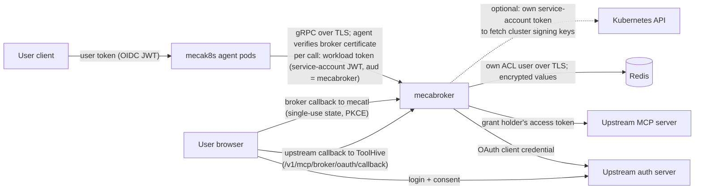
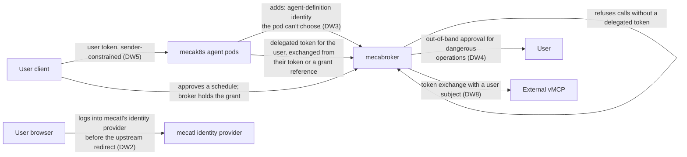

# Design: a separate MCP broker service for mecak8s

## Why

When a mecak8s deployment lets users connect OAuth-protected MCP servers (GitHub,
Linear, …), ToolHive runs inside every agent pod and holds those users' upstream tokens.
That causes two problems.

**Tokens live next to the agent.** The mecak8s process also drives the model and reads
untrusted content, and ToolHive stores every user's tokens in the session-store Redis,
unencrypted, with credentials every agent pod holds. A compromised pod, or a leaked Redis credential exposes every connected user's tokens.
The only barrier today is that the image has no shell.

**The broker pins the agent fleet to one pod.** ToolHive's signing keys and mecatl's
broker session state are per process, so the chart forces one replica and a `Recreate`
rollout in broker mode: no scaling, and an outage for everyone on every rollout.

## What changes

ToolHive and mecatl's session wrapper move out of the agent process into one separate
service, `mecabroker`, installed by the mecak8s chart. What runs doesn't change; where it
runs does. Agent pods call the broker over authenticated gRPC, scale freely, and never
hold an upstream token or OAuth client secret. mecated and mecatui keep the embedded
broker.

## Who authenticates to whom

This is what implementing the design delivers; later iterations are in
[Future iterations](#future-iterations).



- **Users** authenticate to mecak8s with their OIDC token, as today.
- **Agent pods and the broker** use one TLS connection authenticated both ways by
  different means. The agent verifies the broker's server certificate (operator-supplied,
  checked against an operator-supplied CA and DNS name) before sending anything. The
  broker verifies the agent's short-lived Kubernetes service-account token, issued for
  the broker only and sent inside that connection, against the cluster's signing keys.
- **The broker** authenticates to upstreams with the configured OAuth client and to
  Redis with its own ACL user.
- **Browsers** reach the broker only for OAuth callbacks, authorized by single-use state
  the broker issued.

## How a call finds the right state

Four bindings connect a tool call to the right credentials. The broker checks all of
them; none depends on the agent pod telling the truth.

**Deployment: which mecak8s install may call.**
- *Value:* the workload token, a Kubernetes service-account JWT with `sub` =
  `system:serviceaccount:<namespace>:<name>`, `aud` = `mecabroker`, and a 10-minute
  lifetime. It's sent as `authorization: Bearer` metadata on every call and re-read from
  its projected file each time.
- *Checked against:* the broker's allowlist, which the chart fills with exactly one
  entry: this install's agent service account. The token proves who the caller is; the
  allowlist decides it's allowed, since any pod in the cluster can obtain a
  broker-audience token for its own account. All agent pods share that account, so the
  broker sees one caller and any pod can continue work another started.

**Session: which broker-side session belongs to a mecatl session.**
- *Value:* an opaque *binding* string the broker returns from `Attach`. Today it's a random
  value the broker process picked at startup plus a generation counter, but mecak8s treats
  it as opaque.
- *Kept:* in the session snapshot. The broker session is also tied to the workload
  identity that created it.
- *Checked:* every `Attach` sends the session ID and the saved binding. A mismatch, from a
  recreated session or a restarted broker, is rejected, never adopted. Deleting broker
  state also requires the exact binding, so cleanup of an old session can't delete a newer
  one. The binding grants nothing on its own.

**Call: which broker process is serving a series of calls.**
- *Value:* a *handle* plus the broker's instance ID (random per broker process), both
  returned by `Attach` together with the session's frozen tool list.
- *Kept:* in agent-pod memory only; never saved.
- *Checked:* every call carries both. The handle expires after about five minutes idle,
  and a handle from an earlier broker process fails with a distinct "broker restarted"
  reason. Repeat-call receipts are keyed by instance, handle, and call ID.

**User: whose upstream account a call spends.**
- *Value:* the *grant holder*, the person who completed the OAuth login, plus the upstream
  account they logged in as (for example `github:@bob`). ToolHive stores the tokens under
  its own per-login ID; the broker records the grant holder and account alongside.
- *Kept:* with the encrypted tokens, in the broker. The session keeps only an opaque
  reference to them and an expiry.
- *Checked:* when a session reconnects after a restart, the stored grant must belong to
  this session's grant holder, deployment, and provider configuration.

A call, end to end:

```text
Attach(session_id, expected_binding = <saved binding>)
  ← binding, handle, broker instance ID, tools
Execute(handle, broker instance ID, tool name, call ID, arguments)
  + authorization: Bearer <workload token>
  ← result, or "outcome unknown", or "broker restarted"
```

## Restarts

The broker is one replica, so every rollout restarts it. Parked calls fail, a call whose
outcome is unknown is reported as such and never retried, and sessions keep running
without broker tools; the next broker call says the broker restarted. `/tools-connect`
restores them at any point in the conversation, with **no new browser login**: the
upstream tokens are kept in Redis, encrypted with keys only the broker holds, and the
broker restores them after checking they still belong to this session's user,
deployment, and provider configuration. The session stores only an opaque reference to
them, forks never inherit it, the tokens expire with the upstream grant, and revoking
them removes mecatl's own record first.

## Owners and grants

The session owner decides who may use a session. The *grant holder*, whoever completed
the browser login, decides whose upstream account is spent. Today they're the same
person, but the design keeps them apart: a grant belongs to the person who consented,
never to a group, and sharing a session in future will never share grants. The broker
records which upstream account each login used and shows it to the owner, so a wrong
account or a phished consent is visible, though not prevented. Deployments without OIDC
have no owners, so everyone with API access is one trust domain, as today.

## What it protects against

- **Taking tokens: stopped.** No upstream token or client secret is ever in an agent pod
  or the session-store Redis.
- **Using tokens: not yet stopped.** Every agent pod is the same caller to the broker, so
  a compromised pod can still call broker tools for any session while the compromise
  lasts, including tools that create lasting access such as deploy keys. The first future
  iteration below narrows this to users who are active.
- **Out of scope:** static-bearer MCP tokens (still in the agent pod), prompt injection,
  and consent phishing.

## Future iterations

Everything above is what implementing this design delivers. The following are later
iterations, most of them the identity work. Nothing in this design blocks them.



- **Checking the user on every call.** The pod trades the user's token for a short-lived
  *delegated token* (RFC 8693 token exchange: subject = the user, actor = mecak8s,
  audience = the broker), and broker calls carry it. It never outlives the user's token,
  so a compromised pod can only act for users who are active, on their own sessions.
  Schedules and long runs have no user token, so this ships together with grants. The
  broker first only logs what it would refuse, then refuses, through an internal switch.
- **Grants.** A grant is a user's recorded permission for the broker to keep acting for
  them while they're away: who gave it, what it covers, and when it ends. It's stored in
  the broker next to the retained tokens, and mecatl keeps only a reference to it. When
  there's no live user token, the pod presents that reference to the same exchange and
  gets the same short-lived delegated token back. There are two kinds:
  - a *schedule grant*, which the owner gives by approving a schedule's exact terms, and
    which is redeemed at most once per scheduled slot. The broker keeps the terms and the
    cadence itself, because the scheduler runs inside the agent pods;
  - a *run grant*, created when a user starts a run, so a long run keeps its broker tools
    for a few hours after the user's token lapses.

  Schedules the model creates through its Schedule tool stay pending until the owner
  approves them outside the model's reach. Open: an approval step a compromised pod can't
  fake, and keeping retained tokens alive after the session that created a schedule is
  gone, or its schedules stop.
- **Broker-side user login.** The broker terminates user login itself, so the agent pod
  never handles a user token at all.
- **Browser-side consent check.** The browser logs into mecatl's identity provider before
  the upstream redirect, and the broker proceeds only if that is the session owner. This
  closes consent phishing.
- **Agent-definition identity and per-operation policy.** The *agent* half of per-call
  policy. It has to follow one rule this design exposed: every per-call input must be
  verifiable by the broker without trusting the agent pod.
- **Out-of-band approval** for dangerous operations, and **sender-constrained user
  tokens**. Together they close misuse of an active user's session by a compromised pod.
