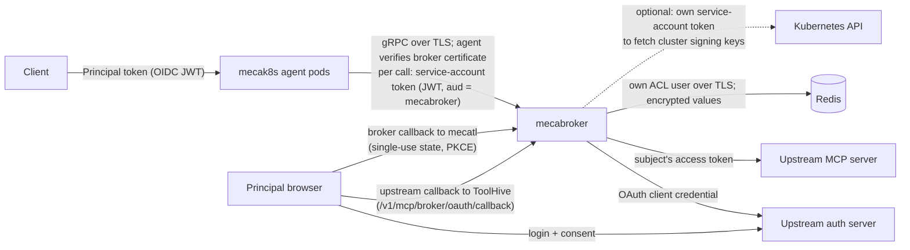
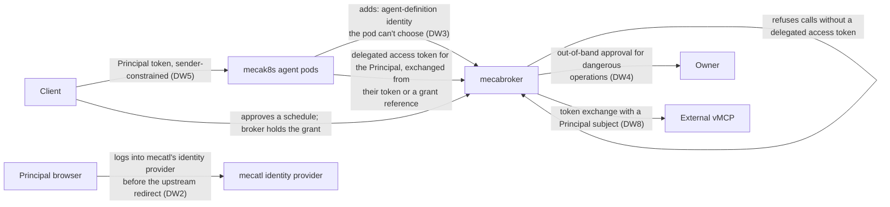

# Design: a separate MCP broker service for mecak8s

This proposal defines the broker's responsibilities and the harness workflows
its interface must support. The session-reference model below is a proposed
simplification, not a description of the current protobuf contract. Exact RPCs
follow the [contract work](#contract-work) described below.

## Why

When a mecak8s deployment lets users connect OAuth-protected MCP servers (GitHub,
Linear, …), ToolHive runs inside every agent pod and holds those users' upstream tokens.
That causes two problems.

**Tokens live next to the agent.** The mecak8s process also drives the model and reads
untrusted content, and ToolHive stores every user's tokens in the session-store Redis,
unencrypted, with credentials every agent pod holds. A compromised pod, or a leaked Redis credential exposes every connected user's tokens.
The only barrier today is that the image has no shell.

**The broker pins the agent fleet to one pod.** ToolHive's signing keys and mecatl's
broker session state are per process, so the chart forces one replica and a `Recreate`
rollout in broker mode: no scaling, and an outage for everyone on every rollout.

## What changes

ToolHive and mecatl's session wrapper move out of the agent process into one separate
service, `mecabroker`, installed by the mecak8s chart. Agent pods call the broker
over authenticated gRPC, scale freely, and never hold an upstream token or OAuth
client secret. The broker owns provider credentials and broker sessions;
the harness uses tools through opaque references rather than coordinating broker
process identities. mecated and mecatui keep the embedded broker.

## Who authenticates to whom

This is what implementing the design delivers; later iterations are in
[Future iterations](#future-iterations).

```mermaid
flowchart LR
  U[Client] -- "Principal token (OIDC JWT)" --> A[mecak8s agent pods]
  A -- "gRPC over TLS; agent verifies broker certificate<br/>per call: service-account token (JWT, aud = mecabroker)" --> B[mecabroker]
  W[Principal browser] -- "login + consent" --> AS[Upstream auth server]
  W -- "upstream callback to ToolHive<br/>(/v1/mcp/broker/oauth/callback)" --> B
  W -- "broker callback to mecatl<br/>(single-use state, PKCE)" --> B
  B -- "OAuth client credential" --> AS
  B -- "subject's access token" --> M[Upstream MCP server]
  B -- "own ACL user over TLS; encrypted values" --> R[(Redis)]
  B -. "optional: own service-account token<br/>to fetch cluster signing keys" .-> K[Kubernetes API]
```

- **Principals** authenticate to mecak8s with their OIDC token, as today.
- **Agent pods and the broker** use one TLS connection authenticated both ways by
  different means. The agent verifies the broker's server certificate (operator-supplied,
  checked against an operator-supplied CA and DNS name) before sending anything. The
  broker verifies the agent's short-lived Kubernetes service-account token, issued for
  the broker only and sent inside that connection, against the cluster's signing keys.
- **The broker** authenticates to upstreams with the configured OAuth client and to
  Redis with its own ACL user.
- **Browsers** reach the broker only for OAuth callbacks, authorized by single-use state
  the broker issued.

## Session model and ownership

This section uses the [domain model](../architecture/mecatl.modelith.md)'s terms:
`Session` is the aggregate, and its `Conversation` is only the message history.
The design adds one concept, the broker session, described below. Other broker
terms come from [the architecture guide](../architecture.md), the broker ADRs, and
the [outbound identity design](../agent-identity-outbound.md).

A *broker session* is the broker-owned state through which one `Session` uses
upstream tools: its catalog, its bundle authorizations, its workspace enrollment,
the provider credentials obtained for it, and its replay state. Its *broker
session reference* is an opaque value issued by the broker and saved in the
`Session` snapshot. It replaces today's opaque broker-incarnation binding
(`ExternalBinding`). Reload still requires an exact match, but the reference
names durable broker state rather than one broker process. The harness returns
it unchanged; it neither constructs it nor interprets its contents. Possession of
the reference alone does not authorize a request.

The reference must distinguish separate lifetimes of broker state. Suppose an
old pod retains reference `R1`, the `Session` is deleted, and a new `Session` with
the same session ID receives `R2`. Cleanup using `R1` must not delete
`R2`, and opening `R1` must not silently create or adopt `R2`. The reference
stays unchanged across broker restarts. The broker durably retains enough
session identity and credential association to recognize it after replacement;
the harness does not store a separate credential-recovery reference. This does
not make pending bundle authorizations or replay state durable.

A *bundle authorization* is the existing expiring browser interaction that a
first call to a protected tool starts, tied to that exact `ToolCall`. *Workspace
enrollment* is the existing pre-prompt flow that authorizes every required
upstream before publishing the complete catalog. Both have opaque correlation
references and observable status. These are separate from the broker session
reference: cancelling one browser interaction must not mean deleting the whole
broker session.

The owner is the `Session`'s `Principal`, accountable for the stored object
([ADR 0212](../adr/0212-caller-ownership-enforcement.md)). The *subject* is whose
upstream account a call spends: whoever completed the browser login, matching
the owner/subject split in the [outbound identity design](../agent-identity-outbound.md#identity-and-token-profiles).
*Provider credentials* are the encrypted upstream tokens the broker keeps for
that consent. They have their own expiry and revocation lifecycle. The harness
keeps the broker session reference and expiry metadata; the broker keeps
the credential records and their associations with the broker session, the
install's agent service account, the subject, and the provider configuration.
The initial API removes a workspace enrollment's provider credentials as a set,
not per upstream. Removing them does not revoke the OAuth application's grant at
the provider.

| Responsibility | Owner |
|---|---|
| `Session`, its ID and lifecycle, and durable reference storage | Harness |
| Deciding when to expose tools, enroll, re-enroll, or forget state | Harness |
| `ToolCall` ID, arguments, and recording an unknown outcome as a `ToolResult` | Harness |
| Broker sessions, catalogs, bundle authorizations, workspace enrollments, and provider credentials | Broker |
| Checking current caller identity and stored credential associations | Broker, within the authentication limits below |
| Process-local access handles, process identities, and access cleanup | Broker gRPC client and broker |

The broker gRPC client is the harness's driven adapter for the broker. Today's
process-local attachments ([ADR 0323](../adr/0323-target-governed-mcp-query.md),
[ADR 0358](../adr/0358-durable-workspace-enrollment-broker-authority.md)) become
private to it: the harness no longer opens or holds them. If two agent pods use
one broker session, each pod's client manages its own access. Stopping one pod
releases its local resources without deleting the broker session or
interrupting the other pod. Process-local handles and instance identifiers can
still exist inside the protocol implementation; they are not separate values
the harness assembles or persists.

## Caller identity

Every request carries a Kubernetes service-account token for the install's agent
service account: a JWT with `sub` =
`system:serviceaccount:<namespace>:<name>`, `aud` = `mecabroker`, and a 10-minute
lifetime. The broker gRPC client re-reads it from its projected file for each call
and sends it as `authorization: Bearer` metadata over TLS.

The broker checks the token against the cluster's signing keys and its
allowlist. The chart supplies exactly this install's agent service account.
Audience alone is insufficient because another pod can obtain a token for its
own service account with the same audience. All agent pods in the install
share the allowed account, so a different pod can continue the broker session.

This authenticates the workload, not the `Principal` independently. The harness
authenticates principals and supplies the owner of the `Session`. Comparing that
owner with the stored owner prevents accidental cross-session recovery, but a
host-supplied owner digest does not prove that the broker authenticated the
`Principal`. Independent verification remains part of the future identity work.
An opaque broker session reference does not narrow a compromised agent pod's authority.

## Harness workflows

The following describes caller intent, not proposed RPC names or signatures.
The interface should let the harness perform these workflows without knowing
how the broker indexes state or identifies its current process.

### Open and use tools

For a new `Session`, the harness obtains a broker session reference and a
catalog. It saves the reference in the `Session` snapshot before making
those tools usable. On reload, it supplies the saved reference and requires the
exact corresponding state. Creating new state is a separate intent from
reopening existing state. A fork gets a fresh broker session and does not inherit
the source `Session`'s reference or provider credentials.

The harness invokes a named tool with the `ToolCall` ID and arguments. The
broker returns a result, an authorization requirement, or a classified failure.
The `ToolCall` ID is bound to the exact broker session lifetime, tool, and
arguments; reusing it with different arguments is rejected. Bounded broker-owned
replay state can return a previously recorded result without executing the tool
again. A broker restart does not provide distributed exactly-once execution.

For example, a GitHub tool creates an issue and the broker dies before returning
the result. The harness records an unknown outcome as an error `ToolResult`, so
the `ToolCall` still has exactly one result, as `Interrupt` already does for
orphaned calls. Opening a replacement broker session must not create the issue a
second time. Automatic retry is allowed only when there is exact evidence that
dispatch of this `ToolCall` did not start; a timeout or a missing broker session
is not that evidence.

### Authorize upstreams and publish their tools

When a tool requires authorization, the broker ties the bundle authorization to
that exact `ToolCall`. The harness saves the pending correlation before exposing the
browser URL. A confirmed failure to save requires abandoning the pending
authorization so it cannot resume an unrecorded `ToolCall`. If the save outcome
is unknown, the harness withholds the URL and reconciles the saved state before
destructive cancellation. Cancellation by the owner has
a different purpose: it settles a recorded authorization and reports whether it
was cancelled or already resolved. Both outcomes are required, but they do not
necessarily require different cancellation RPCs.

Workspace enrollment follows the same rule for durable correlation before browser
presentation. The harness receives an opaque reference for observation and
cancellation, an ephemeral browser URL for presentation, and the enrollment's expiry.
The URL is not persisted. The expiry describes the browser interaction, not the
broker session's 48-hour inactivity timeout.

The broker reports one overall status: pending, completed, cancelled, expired,
or failed. Workspace enrollment is all-or-nothing: it completes and publishes its
catalog only after every required upstream is authorized. Per-upstream progress
and internal service bitsets remain broker-private. Completion supplies an
authenticated catalog; the descriptors advertised to the model and the
executable tools must come from the same snapshot. The harness durably adopts
the result before exposing those tools.

If workspace enrollment fails, expires, is cancelled, or is interrupted by broker
restart, the broker discards provider credentials newly obtained by that attempt.
Partial credentials cannot be used by `ToolCalls` or recovered as a completed
enrollment. Retry starts a fresh workspace enrollment; there is no
partial-progress recovery. Provider credentials from an earlier completed
enrollment are unaffected by this cleanup. Cleanup is local and does not revoke
a provider grant. The broker owns attempt tracking and bounded cleanup, without
a harness staging or commit operation.

Cancelling or replacing workspace enrollment targets the exact enrollment.
Re-enrollment must withdraw the old enrollment-derived tools and reset the
corresponding broker state; merely opening another browser URL is insufficient.
A stale completion must not republish tools from the replaced enrollment. The
same rule applies to restoration already in progress: it cannot restore authority
withdrawn by a later re-enrollment or deletion. Compatible concurrent restorations
can share current state, but a delayed result cannot undo a newer lifecycle decision.

### Release access, disconnect, and delete state

Closing a `Session` locally or stopping an agent pod releases local access.
Deleting a `Session` first removes its durable host record, then cleans up
the exact referenced broker session and its provider credentials. Cleanup for an
old reference cannot destroy new state that happens to have the same session ID.

Disconnecting tools withdraws the whole workspace enrollment's tools and removes
its provider credentials. The initial API has no per-upstream disconnect or
public per-credential references. Disconnect leaves the broker session available
for a fresh workspace enrollment. It does not revoke the application's grant at the
upstream provider or affect other broker sessions. The subject can revoke the
provider grant separately at that provider. Cancelling a pending bundle
authorization or workspace enrollment is also distinct from disconnecting
established access.

The harness durably records the withdrawal of tool access so it cannot
silently restore those credentials while disconnect is pending. The broker must
stop accepting new `ToolCalls` that would use removed credentials; disconnect
cannot undo an upstream action already dispatched. A lost response is an
unresolved disconnect, not proof of completion, and must be safely reconciled
or retried.

A delayed OAuth completion or recovery request must not revive disconnected
credentials. Disconnect and its retries target the original workspace
enrollment's credentials, so a lost response followed by a retry cannot remove
credentials from a later valid enrollment in the same broker session. The broker
owns this distinction; a stable broker session reference must not turn an old
disconnect into deletion of whichever credentials are current. The final contract
must specify retry and cleanup behavior without exposing credential-storage identifiers.

## Publication across the two stores

The broker owns broker-session creation. The harness does not prepare, commit, or
abort it. It obtains an opaque reference, saves it in the `Session` snapshot,
and only then exposes the tools. Creation must be retry-safe:
a lost response must not cause an unbounded series of duplicate broker sessions.
The exact request correlation belongs in the API contract.

If the harness crashes before saving the reference, an unused broker record
can remain. If the save succeeded before the crash, another agent pod can use
the saved reference. The broker does not infer which case occurred from a
connection closing, and the harness does not delete broker state as compensation
for an ambiguous save.

Broker-session records expire after **48 hours of inactivity**, starting at
creation and renewed by authenticated, authorized broker-session use. Use the storage
backend's native TTL for reclamation. Explicit deletion removes the broker session
sooner. Background token refresh, health checks, and process restart do not
renew activity, so unused records expire without an orphan-detection service or
a scan of the harness's session store. The expiry survives broker restart;
access rejects expired records even before physical reclamation finishes.

A saved reference remains usable within that lifecycle even when an agent pod
disconnects or restarts. After 48 idle hours, the `Session` remains,
but its broker session expires and enrolling again can require fresh
authorization, even if an upstream refresh token would still be valid. Expiry
is a retention policy, not evidence that a record was never saved. Broker-session TTL
renewal does not extend a provider grant's lifetime or revive revoked credentials.
An expired access token can still be refreshed under a valid provider grant;
access-token expiry alone does not end the broker session.

The broker saves encrypted provider credentials against the existing broker session
when the subject completes a valid OAuth flow. In a workspace enrollment that spans
several upstreams, credentials obtained along the way belong to the attempt until the
whole enrollment completes. Only then does the broker durably record the completed
enrollment and report success. The harness does not stage or commit credential
custody and receives no separate credential-recovery reference.
It observes completion and durably adopts the resulting catalog before
exposing those tools to the model.

If the harness crashes after the broker durably recorded a completed enrollment
but before adopting the tools, it can observe it again using the same broker session
reference. It does not repeat the browser login while those credentials remain
valid. This recovers completed enrollment state, not a pending bundle authorization or
permission to replay an interrupted `ToolCall`. Broker-side completion must
reject stale or cancelled enrollments and must not resurrect an expired broker session or
revoked credentials.

Credentials can therefore exist before the harness adopts their tools. They
remain subject to the broker's identity checks and credential lifecycle.
Credential records owned by a broker session must be reclaimed with a bounded lifetime when
the broker session expires or is deleted; expiring only the broker-session pointer and leaving
encrypted tokens indefinitely is insufficient. Keep that cleanup broker-local,
using storage expiry where possible. Local removal is distinct from revoking an
provider grant.

The harness still owns durable publication of tools and authorization state.
Broker-owned broker-session and credential creation do not make the two stores atomic:
they accept bounded unused records instead of exposing transaction steps to the
harness. Lost responses during explicit disconnect must still be reconciled or
retried safely; orphan expiry is not a substitute for completing disconnect.

## Restarts

The broker remains one replica. The broker gRPC client automatically restores access
using the saved broker session reference after a restart, including for a `Session`
with history. A restart between calls does not require
`/tools-connect` or another browser login. Once the broker is available, future
calls proceed if credentials remain valid, current identity checks pass, and
the recovered catalog is compatible with the `Session`'s adopted tools.

This reverses a current rule. Today a persisted binding from a prior process is
never treated as live: ordinary rehydration leaves broker tools unavailable until
the owner explicitly refreshes ([architecture guide](../architecture.md),
[ADR 0335](../adr/0335-idle-session-broker-workspace-refresh.md)), and snapshot
restore never resurrects broker runtime
([ADR 0358](../adr/0358-durable-workspace-enrollment-broker-authority.md)
decision 4). The ADR for this design must supersede those clauses. ADR 0358's
broker-key ledger is unaffected: restoration re-adopts the recorded catalog and
cannot widen the `Session`'s authority.

Restoring access is separate from retrying an execution:

| Restart timing | Required behavior |
|---|---|
| Between calls | Automatically restore access and execute the next call. |
| Before dispatch, with exact proof the `ToolCall` did not dispatch | Restore access and safely dispatch that `ToolCall`. |
| After dispatch might have happened, before a result is received | Record an unknown outcome as an error `ToolResult`; do not execute it again automatically. Restore access for subsequent calls. |

For example, the broker restarts while the owner reads an answer. Their next
message asks the agent to list GitHub issues. The broker gRPC client restores access and
the tool runs without a manual reconnect. If the interrupted call instead
created an issue before its response was lost, that call remains uncertain;
restoration must not create a second issue.

Pending bundle authorizations, workspace enrollments, and parked calls are interrupted;
automatic restoration does not resume them. The broker and its gRPC client must
prevent stale execution requests from being accepted as fresh calls after
restoration, even though the saved broker session reference is unchanged. They own
that distinction without exposing process identities to the harness.

The broker validates each provider credential's associations with the broker session,
the agent service account, the subject, and the provider configuration before using
them. This validation has the `Principal` limitation described in
[Caller identity](#caller-identity).
Recovery never extends their original expiry. Revoked or expired credentials,
failed identity checks, or incompatible tool changes require an appropriate
error or owner action rather than silent adoption. Temporary storage or broker
unavailability fails closed within bounded request deadlines without erasing
recoverable state or pretending that the failure proves revocation.

## Contract work

The session model and ownership decisions above guide the replacement API.
Exact interfaces, acceptance scenarios, and the domain-model source are the
next step. The broker session entity is already in the
[domain model](../architecture/mecatl.modelith.md) as proposed. Broker sessions and
provider credentials outlive a call, so that work also adds them to
[ADR 0027](../adr/0027-cloud-native.md) Lists 1 and 2 with owner, cleanup, and
restart-state decisions. The contract must specify retry correlation, stale-call rejection
after restart, credential cleanup, and disconnect failure semantics without
exposing broker process or storage bookkeeping. These local amendments do not
require compatibility adapters for the unsubmitted API.

## Owners and subjects

The owner decides who may use a `Session`. The subject, whoever completed
the browser login, decides whose upstream account is spent. Today they're the same
`Principal`, but the design keeps them apart: provider credentials belong to the
`Principal` who consented, never to a group, and sharing a `Session` in future will
never share provider credentials. The broker
records which upstream account each login used and shows it to the owner, so a wrong
account or a phished consent is visible, though not prevented. Deployments without OIDC
have no owners, so everyone with API access is one trust domain, as today.

## What it protects against

- **Taking tokens: stopped.** No upstream token or client secret is ever in an agent pod
  or the session-store Redis.
- **Using tokens: not yet stopped.** Every agent pod is the same caller to the broker, so
  a compromised pod can still call broker tools for any session while the compromise
  lasts, including tools that create lasting access such as deploy keys. The first future
  iteration below narrows this to principals who are active.
- **Out of scope:** static-bearer MCP tokens (still in the agent pod), prompt injection,
  and consent phishing.

## Future iterations

Everything above is what implementing this design delivers. The following are later
iterations, most of them the identity work. Nothing in this design blocks them.

```mermaid
flowchart LR
  U[Client] -- "Principal token, sender-constrained (DW5)" --> A[mecak8s agent pods]
  A -- "adds: agent-definition identity<br/>the pod can't choose (DW3)" --> B[mecabroker]
  B -- "refuses calls without a delegated access token" --> B
  A -- "delegated access token for the Principal, exchanged from<br/>their token or a grant reference" --> B
  U -- "approves a schedule; broker holds the grant" --> B
  W[Principal browser] -- "logs into mecatl's identity provider<br/>before the upstream redirect (DW2)" --> IDP[mecatl identity provider]
  B -- "out-of-band approval for dangerous<br/>operations (DW4)" --> U2[Owner]
  B -- "token exchange with a Principal subject (DW8)" --> V[External vMCP]
```

- **Checking the `Principal` on every call.** The pod trades the `Principal`'s token for a
  short-lived *delegated access token* (RFC 8693 token exchange: subject = the `Principal`,
  actor = the agent definition, as in the outbound identity design's token profiles;
  audience = the broker), and broker calls carry it. The actor depends on agent-definition
  identity below. The token never outlives the `Principal`'s token,
  so a compromised pod can only act for principals who are active, on their own sessions.
  Schedules and long runs have no `Principal` token, so this ships together with grants. The
  broker first only logs what it would refuse, then refuses, through an internal switch.
- **Grants.** A grant is a `Principal`'s recorded permission for the broker to keep acting for
  them while they're away: who gave it, what it covers, and when it ends. It's stored in
  the broker next to the provider credentials, and mecatl keeps only a reference to it. When
  there's no live `Principal` token, the pod presents that reference to the same exchange and
  gets the same short-lived delegated access token back. There are two kinds:
  - a *schedule grant* (as in the outbound identity design), which the owner gives by approving a schedule's exact terms, and
    which is redeemed at most once per scheduled slot. The broker keeps the terms and the
    cadence itself, because the scheduler runs inside the agent pods;
  - a *run grant*, created when the owner starts a `Run`, so a long `Run` keeps its broker
    tools for a few hours after the `Principal`'s token lapses. This is new; the identity
    docs would need to adopt it.

  Schedules the model creates through its Schedule tool stay pending until the owner
  approves them outside the model's reach. Open: an approval step a compromised pod can't
  fake, and keeping provider credentials alive after the `Session` that created a schedule is
  gone, or its schedules stop.
- **Broker-side login.** The broker terminates `Principal` login itself, so the agent pod
  never handles a `Principal` token at all.
- **Browser-side consent check.** The browser logs into mecatl's identity provider before
  the upstream redirect, and the broker proceeds only if that is the `Session` owner. This
  closes consent phishing.
- **Agent-definition identity and per-operation policy.** The *agent* half of per-call
  policy. It has to follow one rule this design exposed: every per-call input must be
  verifiable by the broker without trusting the agent pod.
- **Out-of-band approval** for dangerous operations, and **sender-constrained `Principal`
  tokens**. Together they close misuse of an active `Principal`'s session by a compromised pod.
