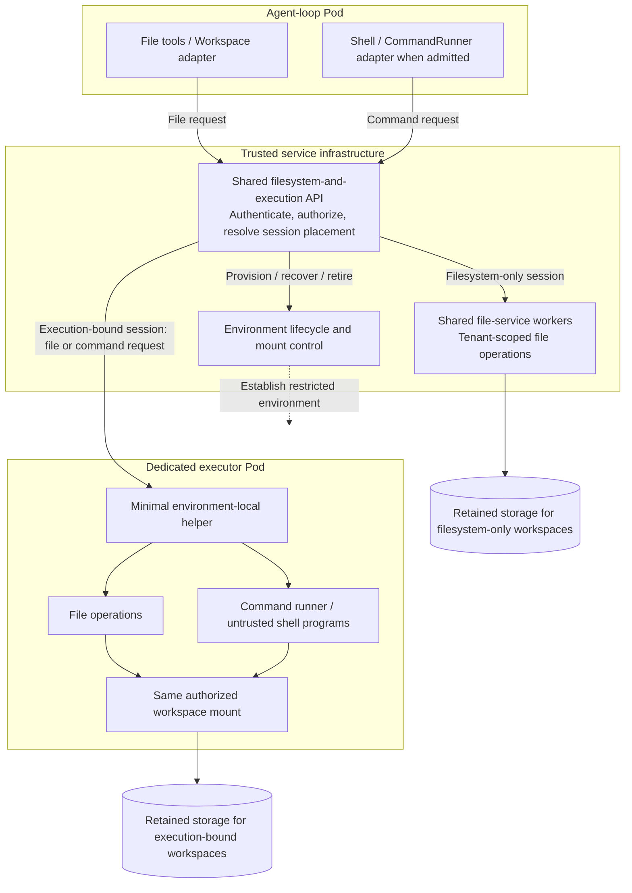
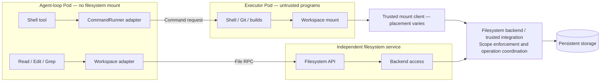
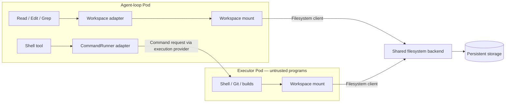
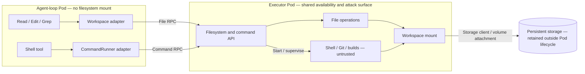

# Kubernetes execution and filesystems

This proposal chooses **capability-based placement behind a shared filesystem-and-execution API**. At session creation,
the server admits the requested capabilities and binds the session either to shared filesystem workers or to a dedicated
executor that handles both files and commands. Filesystem-only sessions need no executor. This is the selected design
for this proposal, not implemented behavior. The alternatives and their diagrams are retained in the appendices.

The agent loop stays separate from execution, keeping credentials and permission checks outside untrusted shell
programs. The [cloud-native harness explanation](../../user-docs/cloud-native-harness.md) describes that broader design.
The [agent identity][identity-draft] and [scoped resource grants][grant-draft] drafts describe a possible future identity
system that takes the delegation chain into account.

We use Kubernetes Pods so deployments can reuse the isolation mechanisms their cluster already provides. The operator
selects an installed runtime through Kubernetes
[RuntimeClass](https://kubernetes.io/docs/concepts/containers/runtime-class/). This could be a standard container runtime,
gVisor, or a VM-backed runtime such as Kata Containers. The executor remains a Pod from Kubernetes' perspective, even
when its programs run inside a VM. Mecatl already selects a RuntimeClass through its execution profile; each runtime
and storage combination still needs testing. The goal is to reuse this support rather than manage every isolation
technology ourselves.

The immediate question is how file tools and shell commands can use one live, persistent workspace across Pods.
Persistent files belong under a documented mount point, currently `/workspace`; paths outside it are outside the
persistence guarantee and may be ephemeral or read-only. Executors are disposable: the design requires a replacement
to start fresh and reattach the same authorized storage. Process restoration is optional; whole-Pod snapshots are not
required.

After a successful shell write and close, a fresh file-tool read should see the change without waiting for command
completion. After a file-tool Edit completes, a fresh shell read should see it. Both placement modes retain files
independently of compute. Filesystem-only sessions access them through shared workers; execution-bound sessions depend
on their executor being available to serve them. The loop mounts neither workspace. Storage technology and the executor
provider remain integration choices; the selected architecture does not require FUSE.

## Context, files, and commands are different

`HarnessContext` supplies the instructions, rules, skills, custom slash commands, and agent definitions given to the
model. Slash commands here are prompt shortcuts, **not** shell commands. These instruction rules also cannot replace
the permission rules that control tool use.

The operator chooses where this content comes from. A source can read an API, host files, or explicitly selected
workspace files. The code combines these sources; it does not require a separate context service or Pod.
[Model][context-model] · [Context sources][context-source]

`Workspace` gives file tools access to files. `CommandRunner` runs programs. An `Environment` groups these together with
its identity and a `ReadLedger`: a record of the file versions the agent has read. That record helps prevent an Edit
from overwriting changes made since the Read. It does not store file contents. A workspace can exist without a command
runner. Shell programs use the mounted filesystem directly, rather than calling the `Workspace` API.
[Environment][link-2] · [Workspace operations][link-3]

The operator selects context sources separately from the execution environment. They can use the same storage, but
access to those files does not make their contents trusted instructions. For example, two sessions can use the same
company instruction source while using different workspaces and executors. Each session keeps its own record of file
reads. A session with no file tools can still receive company instructions from an independent source.
[Source selection][context-binding] · [Model][context-model]

Files in a workspace or container image must not automatically become trusted instructions. A deployment may explicitly
select a workspace-backed context source using the appropriate adapter. Project content still needs the project-trust
check. Context reads do not count as file-tool reads, even when they access the same file: they neither satisfy
read-before-edit nor update the `ReadLedger`. A context choice cannot grant filesystem or shell access or weaken
permissions. A virtual Redis workspace root must not be reopened as a host path to load instructions. [Project
admission][context-admission] · [Model][context-model]

Today the native Kubernetes path keeps operator-configured sources that do not depend on project files. It does not
load project instructions from either the host repository or the executor's PVC, even if the host project is trusted.
The existing local microVM backend can read repository instructions and prompt shortcuts from the guest, but only when
that source is selected and project trust permits it. This local implementation is separate from RuntimeClass selection.
Choosing a shell image or execution template must not silently change the agent's instructions. Selectable, versioned
templates are [proposed, not implemented][templates].
[Local microVM sources][context-microvm] · [Project trust checks][context-admission]

## What the Kubernetes provider does today

The current proof of concept uses one operator-selected execution profile. The loop sends file and command requests
through an authenticated gRPC connection to the execution provider. The provider uses Kubernetes Pod exec to start
`/mecatl-executor`. Its file operations use
`osfs`; commands use `/bin/sh`. Both see the same persistent volume claim (PVC), Kubernetes storage mounted at
`/workspace` in the executor Pod. The PVC is `ReadWriteOnce`, which limits where it can be mounted. `/tmp` is temporary
Pod storage. The loop mounts neither volume. [Remote binding][link-4] · [Pod exec][link-5] · [Executor][link-6] ·
[Pod storage][link-7]

The PVC outlives the executor and session references. Retirement retains it; deletion is a separate administrator
operation tied to the recorded PVC identity. A missing PVC cannot quietly be replaced under the same allocation. If an
executor's termination is uncertain or its lease expires, access stops rather than allowing an automatic takeover.
This is a draft provider, **not** an approved boundary for hostile multi-tenant workloads. Its operation grants and
run claim also do not implement the full proposed identity system. [Lifecycle][k8s-lifecycle] · [Run claim][link-8]

So the gap is not basic persistence or shared files between the current file and shell tools. It is independent file
access when compute is absent, and a defined consistency contract when independently placed clients use one filesystem.
Current `Workspace` operations include versioned reads, create-only writes, conditional replacement, and search.
Compare-and-swap (CAS) means replacing a file only if its version still matches the version previously read. Existing
adapter guarantees do not establish atomic CAS against a shell process writing through a separate mount.
[Workspace operations][link-3]

Mecatl also has a Redis-backed workspace shared among sessions of the same authenticated user identity. It has no
command runner or ordinary Unix filesystem. Its hash-based files and Lua CAS work for file tools, but do not provide
normal Unix file operations (POSIX), such as open handles, symlinks, and permissions. It cannot become a runnable mount
just by adding a thin wrapper; durability also depends on the Redis deployment. [Redis placement][link-9] ·
[Redis operations][link-10]

## Selected architecture: capability-based placement

One shared API exposes file operations and optional command execution. The loop reaches these through `Workspace` and
`CommandRunner`; a common endpoint does not collapse those contracts into one interface. The trusted service resolves
each authorized request to the session's recorded placement. Clients do not select a Pod address, mount path, or storage
credential. The API and worker processes can scale separately.

| Admitted session capabilities | Where operations run | Availability and resource use |
| --- | --- | --- |
| Filesystem only | Shared file-service workers serving authorized workspace allocations | File access needs no executor; workers can serve multiple users and sessions and scale with file demand. |
| Filesystem and execution | A dedicated executor's file helper and command runner, using the same workspace mount | Both file and command access depend on that executor; compute is reserved for the isolated execution environment. |

This combines the shared file-serving path from [option 1](#option-1-the-agent-uses-an-api-the-executor-mounts-the-filesystem)
with the co-located file and command path from [option 3](#option-3-the-executor-pod-also-serves-the-filesystem-api).
It does not route file requests for an execution-bound session to shared workers while commands run elsewhere.



The storage boxes represent authorized allocations, not a requirement for separate storage products or a volume shared
by everyone. Boxes show placement, not proof of isolation. The helper transport can be provider-mediated invocation or a
small authenticated listener; the shared API does not require every executor to expose its own public API.

### Admission and binding

The session-creation request declares the needed capabilities. A request for Shell is not a grant: the server admits
it under operator policy, chooses the placement, and records the environment and storage identities. Per-operation
permission checks still apply, and withdrawing authority must stop access even if the placement remains allocated.
The initial design keeps the placement class fixed for the session. Adding execution later needs an explicit transition
contract or a new session; it must not silently provision compute or broaden authority.

A dedicated environment can be scoped per session, user, or workspace according to authorized sharing policy. The
initial routing model binds each session to one environment; it does not require one permanent Pod per user. Sharing
an executor across differently authorized agents requires a defined isolation and coordination contract. Existing no-FS
sessions remain a separate, valid configuration.

The two implementations must preserve the same file-tool contract, including path containment, versioned reads,
create-only writes, conditional replacement, and error behavior. Read evidence remains session-specific even when
sessions share content. This is host-side placement and adapter composition; it does not make Kubernetes or a remote
service mandatory for local use or the importable Go engine.

### Scaling and recovery

Shared file-service workers can serve file-only sessions without reserving execution sandboxes. Horizontal scaling
still depends on backend capacity, cross-replica mutation coordination, and per-tenant limits for expensive operations
such as recursive searches. Process-local locks cannot coordinate independent replicas, and shared capacity must not
combine agents' authority.

Execution-bound sessions accept coupled file and command availability. If their Pod disappears, the shared API waits
for authorized recovery against the exact retained storage rather than transparently sending file operations elsewhere.
The frontend can remain available while that session's operations are unavailable. An independent file-access fallback
would need separate fencing, storage-attachment, and consistency rules and is outside the initial design. The presence
of a common API must not cause a command with an uncertain outcome to be retried automatically.

The dedicated helper can coordinate file operations with the command processes it supervises. It must account for
background processes, not merely serialize request handlers. Live reads during a command remain required; whether
file-tool mutations wait for shell writers is an implementation decision. Co-location does not by itself strengthen
conditional Edit into atomic CAS against arbitrary shell writes.

### Keep trusted authority outside execution

The shared service owns authentication, current authorization, and routing. Trusted infrastructure owns grant issuance,
provisioning, storage attachment, retirement, and authoritative withdrawal. Broad storage credentials, signing keys,
and mount-control interfaces stay outside the shell's reach. Shared file workers are trusted services, not hosts for
user-supplied shell commands.

The executor gets only the helper and filesystem view needed for its admitted environment. The helper must have no
greater filesystem authority than the shell's assigned view and cannot select other allocations, issue grants, or manage
infrastructure. This supports a small executor security profile without moving the shared service's authority into the
Pod. It does not remove the risk of shell attacks on the helper or on shell-controlled paths and content. A sidecar alone
is not an isolation proof, and helper compromise must not grant access to other environments.

Restrictions must hold on the native shell path as well as through the API. Trusted mount setup or backend enforcement
must establish the authorized view and bounded withdrawal; API checks alone cannot enforce either on mounted writers.
FUSE is one possible mount implementation, not the source of those guarantees. Neither a listener nor file handling
inherently requires root or added Linux capabilities; the actual helper, mount placement, and runtime still need security
qualification.

## Filesystem requirements

### Instructions and storage identity

The loop receives instructions through selected `HarnessContext` sources. Mounting files must not turn them into
trusted instructions; shell requests still need execution permission. The server selects storage before starting an
executor and records its stable identity with the `EnvironmentRef`. Reattachment must fail closed if storage is absent
or replaced. Clients cannot choose raw mount paths or storage credentials. Retention is independent of executor or
session deletion; deleting retained files requires a separate explicit authorized operation. An execution template,
an environment identity, and a file version identify different things.

### Live files and recovery

Ordinary, unmodified shell programs, Git, and representative builds must operate on the persistent tree. Qualification
must exercise their actual operations, not demand every POSIX feature. After a successful write and close, a fresh
read from another client must see the change before the writing command finishes. The same holds for a completed file
Edit followed by a fresh shell open. Already-open descriptors may retain the old file after replacement; hard links,
writable mappings, cache behavior, and delayed writes remain qualification points. A batch of shell writes is not a
single transaction; job-start/end snapshots cannot meet live two-way visibility. [inotify][inotify] is not a reliable
cross-host change feed.

Completed, closed files must survive executor Pod loss. Filesystem-only sessions must remain accessible through shared
workers without an executor. Execution-bound sessions regain access after a replacement has safely reattached and serves
the same authorized storage; they do not have an executor-independent file-access guarantee. An interrupted write may be
incomplete, but unrelated completed files remain retained. If the filesystem client runs inside the executor Pod, its
loss is part of the same failure and cannot be excluded from durability qualification.
Separate filesystem-client, node, and storage-cluster failures need their own documented durability guarantees.
Qualify close and `fsync` behavior at the actual client placement, including writeback errors and server failures;
no candidate integration is claimed to meet these guarantees without qualification.

### Concurrent edits

Preserve Mecatl’s existing read-before-edit behavior: file tools reject detected changes since the preceding Read and
require a fresh Read. Background shell commands may overlap with file tools. Conditional replacement does not guarantee
atomicity against arbitrary shell writers, and content-based versions do not detect changes that restore identical bytes.

This concerns live shared visibility, not the [grants draft's][grant-draft] `exclusive-write` mode, which publishes at
explicit commit boundaries.

### Agent identity and withdrawal

Workload authentication and user authentication are inputs, not substitutes for the acting agent's identity. Mecatl
would issue logical agent identities in its own SPIFFE trust domain using those and any additional authenticators.
The user -> agent -> subagent chain can continue through further hops under policy; each hop may preserve or narrow,
never widen, delegated authority. Ancestors provide provenance, not extra rights. The verifier must enforce the
acting agent's *current* delegated authority from Mecatl's session and permission checks, not treat a signed history
as authority. A trusted client authenticates its workload while acting for the agent; both identities stay distinct.
The [identity draft][identity-draft] is a proposal, not current support; this requirement does not freeze token format,
require per-process keys, or ask SPIRE to attest goroutines.

Native filesystem enforcement, a concrete trusted adapter, or an upstream change can provide the checks on *both*
file-tool and shell paths. Mecatl selects each agent's permitted files and operations, including read-only inputs and
writable outputs. Sharing files requires explicit authorization; neither a storage identifier nor starting an executor
grants access. A restricted agent must not bypass its view through backing-storage endpoints or another agent's mount.
Keep broad filesystem, database, mount-control, and harness credentials outside the shell.
Ordinary programs should use the mount without handling grant tokens, SDKs, or an auth service. Scope enforcement
applies to the persistent tree, not every filesystem operation in the entire shell Pod. Shell approval is not a
permission prompt for every open or write.

Withdrawal must have a bounded effect through nonrenewal of short-lived grants, including already-mounted clients
and delayed writes. An expired grant or replaced executor must not keep publishing writes. Define and test the exact
cutoff and in-flight operation semantics; immediate push revocation is not mandatory, and bytes already read cannot
be recalled. Do not automatically retry a modifying command whose outcome is unknown. These are proposed integration
requirements, not guarantees of the current provider.

## Comparison with Agent Substrate

Agent Substrate is a possible execution backend for this design, not an alternative agent loop. Its [actor and worker
model][substrate-selected-architecture] separates logical workloads from physical worker Pods. The companion
[env service][env-selected-overview] adds an external API that proxies commands and file operations into an
`ate-env-guest` daemon inside an actor. These findings are source-backed at Substrate `288694ef2297` and env
`0d359ea73823`; they do not establish a tested Mecatl integration.

### Shared frontend, different placement decisions

An external `ate-env-api` resembles our shared entry point, but its filesystem requests still reach a guest actor.
Substrate can suspend idle actors and multiplex them over fewer worker Pods, resuming them when traffic arrives.
Therefore its executor-hosted file API does not require a permanently running Pod per session. File access still needs
actor activation and worker capacity, however; a scalable proxy is not an executor-independent filesystem service.

| Concern | Selected capability-based placement | Substrate with the standard env service |
| --- | --- | --- |
| File-only session | Shared file workers; no execution sandbox to activate | File requests are proxied into an active or resumed actor. |
| Session with Shell | Dedicated environment serves both file and command requests on one mount | Guest process and filesystem services provide a similar co-located route. |
| Idle capacity | File-only sessions share service capacity; execution environments have a separate lifecycle | Suspend/resume lets many idle actors share a smaller worker pool. |
| Retained workspace | Storage identity and deletion are independent of executor lifetime | Reviewed external-volume templates provision per actor and delete with it. |
| File-tool semantics | Both routes preserve Mecatl's versioned reads, create-only writes, and conditional replacement | Guest file RPCs stream raw reads and writes; they do not expose Mecatl's version/CAS contract. |
| Authority | Trusted admission, routing, and lifecycle control remain outside a narrowly scoped helper | Substrate controls sandbox lifecycle; Mecatl agent scopes and env request authorization still need integration. |

For execution-bound sessions, env supplies useful process operations: asynchronous launch, output streaming, input,
and signals. Its [guest protocol][env-selected-protocol] also exposes file reads and writes, but writes have no expected
version or create-only precondition. A client-side read/compare/write sequence cannot substitute for an authoritative
conditional replacement. Reusing that API would require extending it or using a Mecatl-compatible helper.

Substrate's sandbox boundary protects surrounding infrastructure; it does not by itself isolate shell programs from
the file daemon inside the same actor. The reviewed [env API entry point][env-selected-api] and
[guest server][env-selected-server] do not establish Mecatl's authenticated, agent-scoped request boundary. Keep that
boundary in trusted infrastructure and limit guest authority as in the selected design. The guest library separately
controls process and filesystem service registration, so adopting Substrate does not require adopting every env service.

### Adoption work and decision

The reviewed [volume API][substrate-selected-volumes] has a per-actor `external_volume_template`, without an explicit
externally owned existing-volume source. Its [actor deletion workflow][substrate-selected-delete] deletes those volumes.
For our retained workspaces, adoption needs attach/detach semantics that preserve externally owned storage, bind its
exact identity, and never silently recreate or delete it with an actor.

The [CSI adapter][substrate-selected-csi] requests `SINGLE_NODE_WRITER`, publishes read-write, and lacks the CSI secret
plumbing some storage drivers require. The mount schema has no read-only or subtree selection. Integrating a chosen
filesystem therefore needs appropriate access modes, restricted views, and protected credentials rather than assuming
CSI support alone supplies them. Its direct CSI integration also differs from ordinary Kubernetes PVC attachment.

We can use Substrate for the execution-bound path while retaining our own shared file workers for file-only sessions.
That would preserve the selected API and admission model. Adopting env unchanged for every session would instead make
file-only access depend on actor activation. Suspend/resume and snapshots could improve execution density and continuity,
but are not required by our fresh-executor/retained-workspace contract. Snapshot persistence alone does not establish
survival of completed files after abrupt executor loss.

The decision to adopt Substrate remains open: its scheduling, routing, and continuation features must justify the
storage and API integration work and the operational cost of worker pools, control-plane state, and snapshots. Both
projects have pre-stable APIs; env's [dependency pin][env-selected-module] targets an older Substrate revision, so a
specific version pair needs qualification rather than assuming the reviewed heads work together.

## Remaining integration choices

The placement architecture is selected; the filesystem backend, helper transport, and execution provider are not.
Choose them against the contracts above, using the source comparisons in the appendices. The implementation must settle
cross-replica mutation coordination, command-process supervision, protected mount placement, and the exact withdrawal
cutoff before claiming those guarantees. Qualify file-only operation with no executor, file/command visibility in a
dedicated environment, retained-storage recovery, and denial of access outside each admitted scope. Process snapshots
and automatic transitions between placement classes are not prerequisites for the initial design.

## Appendix A: Alternative filesystem layouts

These are the three layouts considered before selecting capability-based placement. The selected design combines the
shared-serving benefits of option 1 with the dedicated execution path of option 3; none is adopted unchanged for every
session. Their diagrams are retained to explain the tradeoffs. File and shell changes still need live visibility, and
runtime support depends on the actual mount and isolation configuration. The text diagrams show access paths; Mermaid
boxes show component placement, not proof of security isolation. Common identity and lifecycle services are omitted.

### Option 1: The agent uses an API; the executor mounts the filesystem

The agent loop sends file requests through its `Workspace` adapter to a service interface. For example, `Read` asks
for a file, and `Edit` asks the service to update it. The loop does not mount the filesystem.

Separating file access from execution enables independent scaling and resource sharing. Sessions that need only file
operations require no executor Pod; multiple authorized users and sessions can share a filesystem-service deployment.
Executor compute can be provisioned when commands are needed and retired without removing file access, while the file
service scales separately. This depends on backend capacity, coordination across API replicas, and per-tenant resource
controls for expensive operations such as recursive searches. Adding replicas alone does not remove storage bottlenecks
or make process-local locks sufficient, and shared capacity must not combine users' or agents' authority.

The separation also supports a smaller executor attack surface and a more restrictive security profile. The executor
need not host the filesystem API, its request handlers, or its server credentials; it runs programs against an authorized
filesystem view. Filesystem serving and broader storage authority remain in trusted infrastructure outside untrusted
execution. That infrastructure still needs hardening, and the benefit depends on protecting mount clients, credentials,
and control interfaces from the shell. A privileged or broadly credentialed mount client reachable from the shell would
erode this separation. A command endpoint may still be needed; this option removes the need for an executor-hosted
filesystem endpoint, not necessarily all executor network access.

Programs inside the executor expect normal filesystem access. A trusted mount client exposes the same stored files,
not a separate copy to synchronize. Both file-tool requests and shell filesystem operations must participate in the
same authorization and consistency model, with no route around the enforced restrictions. A trusted FUSE client can
translate shell filesystem operations into requests to the same service used by file tools. Alternatively, a native
filesystem client can be used when the filesystem server or a trusted integration enforces the required scopes and
coordinates both access paths. An API frontend over an unrestricted mount is insufficient: frontend-only authorization
and locking do not cover native mount writes. FUSE itself does not supply these guarantees; client caching, writeback,
and grant expiry still need defined behavior.

```text
Agent file tools -> Workspace adapter -> API ---+
                                               +--> Filesystem service -> Storage
Executor programs -> FUSE client ------> API ---+    (scope checks and operation coordination)
```

The diagram illustrates a shared-service implementation, not a requirement to build a complete storage protocol.
An API frontend over a mature filesystem can reuse its existing clients. Any distinct mount route still needs common
enforcement. Mecatl's current Redis filesystem would need more functionality to serve programs.

The component view below illustrates the native-client variant: both routes reach a filesystem backend or trusted
integration responsible for scope enforcement and operation coordination. That responsibility does not require a
separate service, but must cover both routes. The trusted mount client's placement depends on the runtime and storage
driver. Command-request arrows omit the execution-provider transport.



Each API request can carry the acting agent's identity and permitted operations and files. The service must verify
that identity and check the requested action; using RPC does not provide those checks automatically. Access through
the shell's mount needs equivalent checks without giving the shell broad credentials.

Programs such as Git and compilers need more than reading and writing whole files. They also keep files open, change
parts of a file, rename files, and use permissions and symbolic links. We need to test these operations before relying
on the mount for real workloads. If using FUSE, its client needs a safe place to run: putting it in a sidecar does not,
by itself, keep its credentials or control socket away from the shell.

If this route uses FUSE, it needs access to `/dev/fuse` and a mount mechanism permitted by the runtime. This does
not automatically require making the whole Pod privileged. Trusted infrastructure should perform the mount, not the
untrusted shell. We must also test where the client can run and how its mount reaches the executor with runtimes such
as gVisor or Kata. [FUSE][fuse]

A FUSE client does not need to run inside the executor. A VM-backed runtime may expose a host-mounted filesystem through
[virtio-fs](https://virtio-fs.gitlab.io/design.html). The runtime provides the VM-to-host connection; when using a
remote filesystem service, the host client connects to it.

### Option 2: Both use an existing shared filesystem

The agent loop and executor mount the same shared filesystem, such as NFS, CephFS, or JuiceFS. The agent's `Workspace`
adapter accesses files through its mount. Programs in the executor access them through theirs. A runtime-provided
VM-to-host connection can also expose shared storage to a VM-backed executor.

```text
Agent file tools -> Workspace adapter -> Mount ---+
                                                 +--> Shared filesystem
Executor programs --------------------> Mount ---+
```



This reuses an existing filesystem and its clients instead of building a new filesystem API and custom FUSE client.
The choice between options 1 and 2 is whether the loop uses a service interface or a mounted filesystem.
Option 2 requires a mount in the agent-loop Pod, unlike options 1 and 3 and the mount-free preference described above.
A filesystem that enforces agent scopes natively need not put every write through a separate gateway; neither option
assumes that mounts bypass enforcement.

Mounted access sees processes and Unix IDs, not logical agents. A trusted adapter or mount broker must map verified
permissions to a restricted view for file tools and shell, without unintentionally combining scopes. Two goroutines
in one process with one Unix ID are not separately authorized by directory or mount names. NFS has identity controls,
but still needs this mapping.

### Option 3: The executor Pod also serves the filesystem API

The external loop sends file operations through its `Workspace` adapter and `Shell` requests through its
`CommandRunner` to the executor's API endpoint. File handlers and shell programs use the same mounted persistent tree.
Sharing an endpoint does not require sharing a process or container. The mount can use FUSE, a native filesystem
client, or PVC-backed storage; FUSE is optional. This resembles the existing provider's shared mount, but changes the
security boundary: the trusted provider authorizes externally and invokes a credential-free helper through Pod exec,
whereas this proposal puts a listening API service in the Pod. It is not an implemented daemon or integration.

```text
External agent loop                         Executor Pod
                                            +---------------------------------------+
File tools -> Workspace adapter ----------> | API -> File operations ---+           |
                                            |                           +-> Mount --+--> Persistent storage
Shell ------> CommandRunner --------------> | API -> Shell programs ----+           |
                                            +---------------------------------------+
```



The shared mount keeps the loop mount-free and gives one endpoint a place to coordinate request scheduling and
process-lifecycle concurrency policy. A mutex around API handlers alone cannot catch arbitrary shell writes.
Serializing all file access for the whole shell lifetime would block the live reads required above. Allowing live
reads while deferring file-tool mutations during shell execution is one possible policy, not a settled design.

One tradeoff is coupling file access to executor availability and scaling. Files survive Pod loss, but this
route cannot serve them until a replacement mounts and serves the tree. Keeping file access available requires a
running Pod even when no `Shell` command is active. Typically, each isolated execution environment gets a Pod; the
environment may be per user, per session, or per workspace, rather than inherently one Pod per user. A multi-user
executor is possible but makes isolation harder. In contrast, option 1's shared API can serve multiple users and scale
independently of executor compute with appropriate tenant isolation and backend support; availability and scaling
still depend on that deployment.

Hosting a persistent filesystem API beside untrusted shell programs increases the executor's attack surface: its
listener, request handling, authentication, and endpoint credentials if TLS terminates there. It need not require root,
added Linux capabilities, or weaker seccomp, but trust separation is harder even with a restricted container profile.
The shell can attack the API; containers in one Pod share networking, and ordinary NetworkPolicy does not isolate
containers within it. Separate sidecar mounts, UIDs, and process restrictions can mitigate this risk, but do not
automatically make the sidecar a trustworthy boundary.

Escalation depends on authority the API has beyond the shell's limited view: broader paths or write permissions,
cross-agent views, or backing-storage or mount-control credentials. Access to the same authorized bytes alone is not
an escalation, though attacks can still compromise response integrity or availability.

A bounded variant would treat the guest API as an environment-local helper with no greater filesystem
authority than the shell. Trusted authentication and authorization, grant issuance, broad credentials, mount control,
and authoritative withdrawal would remain outside the executor. API checks alone cannot constrain native shell
filesystem access; both routes still need scope enforcement. These are proposed constraints, not implemented guarantees.

### Deploying shared storage on Kubernetes

#### Can the loop and executor access the same storage?

For option 2, the loop and executor may run on different nodes. The chosen filesystem and Kubernetes storage driver
must support access from both, and both mounts must reach the same files.

A persistent volume claim (PVC) requests storage, but does not make it shareable across nodes. The current provider
uses `ReadWriteOnce`, which allows read-write mounts on one node. Multiple Pods on that node may use it. Cross-node
access needs a backend and driver that support it, commonly exposed through `ReadWriteMany`.

#### How do we limit access for each agent?

Kubernetes mounts volumes into Pods. Mecatl must decide which files and operations each agent may access.

For example, an agent may have read-only access to an input directory and write access to an output directory. Both
its file tools and executor must respect those permissions. Mounting a shared volume does not enforce them
by itself, especially when one loop process serves several agents. Kubernetes RBAC does not supply these file-level
agent permissions either.

We could use separate volumes or restricted views of shared storage. In either case, access must follow the agent's
verified permissions, not merely a supplied directory name.

#### Does each new session require a Pod restart?

Not necessarily. If the agent-loop Pod already mounts a shared filesystem, Mecatl can assign a directory to a new
session without changing the Pod's volumes.

Adding a separate volume to an existing Pod normally requires replacing that Pod. This makes one-volume-per-session
harder to manage in a long-running, multi-session loop. [Pod updates][pod-updates]

A trusted node service can also make mounts available after a Pod starts. That requires explicit runtime and
mount-propagation support; it is not something we should assume every installation provides. A mount made in one
container is not automatically visible in another.
[Mount namespaces][mount-ns] · [Mount propagation][mount-propagation]

## Appendix B: Filesystem candidates

These candidates remain backend choices for the selected placement model. Each integration must meet the filesystem
requirements above, including the different availability guarantees for file-only and execution-bound sessions.

Source review baseline: 2026-10-07. The implementation links below identify reviewed commits or releases; general
manuals may change independently. These are existing capabilities and proposed integration points, not tested Mecatl
integrations. A missing feature may be supplied by a concrete adapter, extension, or upstream change; it is not by
itself grounds to reject a candidate.

| Candidate | Existing capability | Integration to research | Status |
| --- | --- | --- | --- |
| NFS / Ganesha | Standard Linux NFS clients; close-to-open coherence on fresh opens [NFS coherence][nfs]; [Ganesha FSAL][ganesha-fsal] has write, commit, rename, close, and access hooks. | Server state/auth plus FSAL or other backend integration for agent scope and writer fencing; hooks alone do not guarantee it. | Source reviewed; untested. |
| CephFS | Shared filesystem with coordinated clients [CephFS behavior][ceph]; [scoped client access][ceph-client-auth] and [client eviction/blocklisting][ceph-eviction]. | Bind clients to agent scopes, grant expiry, and writer fencing. Eviction is not an agent TTL. Qualify close durability at the actual client placement. | Source reviewed; untested. |
| JuiceFS Community | FUSE client, [metadata transactions][juice-meta] and [CSI mount pods][juice-csi]; [cache behavior][juice-cache] requires fresh-open qualification. | Grant epochs across all writes, not just file-tool API calls; isolate mount credentials and test CSI/runtime paths. Do not conflate Community and Enterprise behavior. | Source reviewed; untested. |
| Purpose-built service / go-fuse | [go-fuse hooks][go-fuse] provide a reusable mount interface over a service. | Build or integrate distributed protocol, authentication, consistency, and recovery; the mount library supplies none of these guarantees. | Source reviewed; untested. |

Client placement matters for durability: the reviewed Ceph userspace client's [close path][ceph-close] may start an
asynchronous flush. Losing only the executor is different from losing that client too. JuiceFS's metadata schema is
not Mecatl's Redis-hash workspace, so it is not a drop-in replacement for that adapter. Its cache and writeback settings
also need qualification against the requirements above.

Reusing a filesystem saves implementation work, but isolation, availability, durability, cache behavior, and
conditional Edit still need qualification. Choose the filesystem separately from the controller that starts and
stops executor Pods.

## Appendix C: Upstream execution platforms

These source comparisons retain the independent-file-access integrations explored for options 1 and 2. In the selected
architecture, an upstream platform can instead supply only the execution-bound path; our shared file workers serve
file-only sessions. Guest file APIs are relevant to that dedicated path but still need Mecatl-compatible semantics and
restricted authority. All four platforms can keep the loop external. Process restoration is an optional benefit, not
a requirement. Agent Substrate's refreshed comparison is in the main discussion.

### Shared integration work

For option 1, a trusted file service could reuse `osfs` over a mounted NFS, CephFS, or JuiceFS filesystem. The
executor mounts the same files through the platform's storage support. The mounted-loop option uses that filesystem
directly instead of a service. Neither requires copying files between commands or building a new filesystem protocol.

All three options need a recorded storage identity and verified agent scopes: for example, read-only inputs and writable
outputs. File-tool checks alone cannot restrict shell writes. Mount credentials stay in trusted infrastructure, and
the chosen backend or mount broker must enforce withdrawal; read-only mount flags alone do not provide grant expiry.
Keep the existing Edit semantics described above, not stronger atomicity against shell writers.

The evaluations below describe concrete platform-specific work in addition to this shared work. They are source-backed
integration proposals, not tested support or delivery estimates.

### agent-sandbox

[agent-sandbox][agent-sandbox] is a Kubernetes controller. A `Sandbox` describes a Pod and its lifecycle. Templates are
reusable Pod specifications; claims request sandboxes, optionally from a pool started in advance.

- **Workspace connection:** A [direct Sandbox][sandbox-lifecycle] accepts an existing PVC through its Pod specification.
  An independent file-service Pod can mount the same shared storage. Cross-node access needs a suitable backend and
  driver, normally with `ReadWriteMany`. Separate read-only and writable mounts can expose the authorized input/output view.
- **Pros:** Standard Kubernetes volume configuration supports this layout without an identified agent-sandbox source
  change. We can retain our executor helper and RuntimeClass selection.
- **Limits:** Use an independently owned PVC, not [Sandbox-owned claim templates][link-12] that can delete or recreate
  storage. The controller does not supply our file service or agent-level mount authorization.
- **Work:** Generate the restricted Pod mounts from verified authority, bind the Sandbox to the recorded storage identity,
  and adapt executor discovery after replacement. The shared Workspace service and mount enforcement remain Mecatl
  integration work. Router adoption is optional; its [authorization hook][router-authorizer] would need explicit wiring.

### OpenSandbox

[OpenSandbox][opensandbox] offers a sandbox-management API and `execd`, a guest command/file helper. Its Kubernetes
`BatchSandbox` controller creates Pods from templates; we can use it directly or through the server API.

- **Workspace connection:** The server's template mode accepts [existing PVCs][link-17], subdirectories, and per-mount
  read-only flags. Mount the same retained filesystem in our independent Workspace service. Set `createIfNotExists=false`
  and `deleteOnSandboxTermination=false`; Mecatl must still check the recorded PVC identity.
- **Pros:** Its [mount construction][opensandbox-mounts] supports read-only inputs and writable outputs from one PVC.
  Direct [BatchSandbox templates][batchsandbox-template] also support our own helper and ordinary Kubernetes volumes.
- **Limits:** The guest file API requires a running sandbox, so it fits option 3 rather than the independent Workspace route.
  Warm-pool and FastSandbox routes restrict dynamic volume attachment; use template mode for this proposal.
- **Work:** Map approved storage views to volume requests and connect current-agent authorization to command access.
  If adopting the server, adapt our command runner to its [injected execd service][opensandbox-bootstrap]; that helper
  does not require moving the harness inside. No platform patch was identified for basic shared-PVC attachment.

### Agent Substrate and env

See [Comparison with Agent Substrate](#comparison-with-agent-substrate) for the refreshed source review, the distinction
between actor activation and executor-independent file access, and the retained-storage and API work needed for adoption.

### E2B

[E2B][e2b] manages Firecracker microVMs. Its guest helper, `envd`, runs commands, while an NFS proxy mounts persistent
volumes into the guest. This is a different compute backend from Kubernetes RuntimeClass, but the harness can stay external.

- **Workspace connection:** In a self-hosted deployment, configure E2B's volume roots on a shared filesystem and mount
  that same filesystem in our Workspace service. Its [directory builder][e2b-volume-root] maps volume type, team, and volume
  ID to a host directory used by the NFS proxy and host file operations. All eligible nodes must reach the same files,
  not different local directories with matching names.
- **Pros:** We can supply the independent Workspace API ourselves. The separate `belt` content service is **not required**
  for this route, and the ordinary guest NFS mount can remain.
- **Limits:** Current [mount authorization][link-18] uses sandbox/team volume bindings, not Mecatl's agent scopes.
  The reviewed mount configuration lacks scoped read-only/subtree grants. This proposal requires self-hosted access to
  the backing mounts and NFS implementation; hosted support is not established.
- **Work:** Bind each export to the acting agent's permitted view and enforce read/write rights and grant withdrawal
  through NFS operations, including existing handles. Add the independent Workspace adapter, exact volume binding, and
  E2B command adapter. This extends a public mount path rather than depending on an unavailable content-service implementation.

Keeping our provider remains an option. Compare which platform best supports the shared workspace and reduces maintenance;
do not select one only for its compute lifecycle features.

[substrate-selected-architecture]: https://github.com/agent-substrate/substrate/blob/288694ef2297bb5d6fab30eca328ddaa89015f91/docs/architecture.md
[substrate-selected-volumes]: https://github.com/agent-substrate/substrate/blob/288694ef2297bb5d6fab30eca328ddaa89015f91/pkg/proto/ateapipb/ateapi.proto#L1248-L1311
[substrate-selected-delete]: https://github.com/agent-substrate/substrate/blob/288694ef2297bb5d6fab30eca328ddaa89015f91/cmd/ateapi/internal/controlapi/workflow_delete.go#L72-L105
[substrate-selected-csi]: https://github.com/agent-substrate/substrate/blob/288694ef2297bb5d6fab30eca328ddaa89015f91/internal/volume/csi/plugin.go
[env-selected-overview]: https://github.com/agent-substrate/env/blob/0d359ea738233e7ad510c5c79dae6635148a64eb/README.md
[env-selected-protocol]: https://github.com/agent-substrate/env/blob/0d359ea738233e7ad510c5c79dae6635148a64eb/proto/ateenv/v1alpha/guest.proto
[env-selected-api]: https://github.com/agent-substrate/env/blob/0d359ea738233e7ad510c5c79dae6635148a64eb/cmd/ate-env-api/main.go
[env-selected-server]: https://github.com/agent-substrate/env/blob/0d359ea738233e7ad510c5c79dae6635148a64eb/guest/server.go
[env-selected-module]: https://github.com/agent-substrate/env/blob/0d359ea738233e7ad510c5c79dae6635148a64eb/go.mod

[ganesha-fsal]: https://github.com/nfs-ganesha/nfs-ganesha/blob/952fb93373a6f9f9e187bf9bc35c41a9fc25efa6/src/include/fsal_api.h
[ceph-eviction]: https://github.com/ceph/ceph/blob/v19.2.3/doc/cephfs/eviction.rst
[ceph-client-auth]: https://github.com/ceph/ceph/blob/v19.2.3/doc/cephfs/client-auth.rst
[ceph-close]: https://github.com/ceph/ceph/blob/v19.2.3/src/client/Client.cc#L10444-L10476
[juice-meta]: https://github.com/juicedata/juicefs/blob/adcca1cc61bb4d668a945d64b2e176b44ac8e5b5/pkg/meta/redis.go#L3132-L3175
[juice-csi]: https://github.com/juicedata/juicefs-csi-driver/blob/2d2bd8a9ceb6233a9dc84a18ea169d8cacede157/docs/en/introduction.md
[go-fuse]: https://github.com/hanwen/go-fuse/blob/efadbedbc68e9f5781e3cc04e8be7217e89bf775/fs/api.go
[grant-draft]: https://github.com/stacklok/mecatl/blob/443c8d3dc08668406cd4fc0fff7b1d0ac18fc63c/docs/scoped-resource-grants.md
[identity-draft]: https://github.com/stacklok/mecatl/blob/443c8d3dc08668406cd4fc0fff7b1d0ac18fc63c/docs/agent-identity-model.md
[link-2]: https://github.com/stacklok/mecatl/blob/e731897077c75b020190f0d7b6e0b78af15082f1/engine/tool/environment.go#L9-L43
[link-3]: https://github.com/stacklok/mecatl/blob/e731897077c75b020190f0d7b6e0b78af15082f1/engine/tool/tool.go#L427-L505
[link-4]: https://github.com/stacklok/mecatl/blob/e731897077c75b020190f0d7b6e0b78af15082f1/internal/adapter/executionclient/client.go#L753-L792
[link-5]: https://github.com/stacklok/mecatl/blob/e731897077c75b020190f0d7b6e0b78af15082f1/internal/adapter/executioncontroller/podexec.go#L33-L73
[link-6]: https://github.com/stacklok/mecatl/blob/e731897077c75b020190f0d7b6e0b78af15082f1/internal/executionexecutor/executor.go#L26-L47
[link-7]: https://github.com/stacklok/mecatl/blob/e731897077c75b020190f0d7b6e0b78af15082f1/internal/adapter/executioncontroller/controller.go#L252-L327
[link-8]: https://github.com/stacklok/mecatl/blob/e731897077c75b020190f0d7b6e0b78af15082f1/internal/adapter/executioncontroller/handler.go#L642-L672
[link-9]: https://github.com/stacklok/mecatl/blob/e731897077c75b020190f0d7b6e0b78af15082f1/internal/app/redis_workspace.go#L23-L80
[link-10]: https://github.com/stacklok/mecatl/blob/e731897077c75b020190f0d7b6e0b78af15082f1/adapters/redisstore/workspace.go#L129-L179
[link-11]: https://github.com/agent-substrate/substrate/blob/0b91488d79637052458a29a6ba6c757bcf7a9292/docs/architecture.md#terminology-actor
[link-12]: https://github.com/kubernetes-sigs/agent-sandbox/blob/58707de4f339615645724deae3898ef65360192a/controllers/sandbox_controller.go#L1711-L1786
[link-13]: https://github.com/kubernetes-sigs/agent-sandbox/blob/58707de4f339615645724deae3898ef65360192a/site/content/docs/volumes/volume-claim-template/_index.md#L8-L23
[link-14]: https://github.com/kubernetes-sigs/agent-sandbox/blob/58707de4f339615645724deae3898ef65360192a/examples/latebind-storage-gke-sandbox/README.md#L1-L20
[link-15]: https://github.com/agent-substrate/substrate/blob/0b91488d79637052458a29a6ba6c757bcf7a9292/docs/csi-volumes.md#L7-L12
[link-16]: https://github.com/agent-substrate/substrate/blob/0b91488d79637052458a29a6ba6c757bcf7a9292/docs/authentication.md#L21-L31
[link-17]: https://github.com/opensandbox-group/OpenSandbox/blob/c7dc78a4090e5de2b9119e9bd93952cae24f87bd/docs/examples/kubernetes-pvc-volume-mount.md#L6-L18
[link-18]: https://github.com/e2b-dev/infra/blob/47096f195aca4a545a9079b706efb3a18f51cf3f/packages/orchestrator/pkg/nfsproxy/chroot/nfs.go#L122-L193
[link-19]: https://github.com/e2b-dev/infra/blob/47096f195aca4a545a9079b706efb3a18f51cf3f/docs/ARCHITECTURE.md#L511-L546
[link-20]: https://github.com/daytonaio/docs/blob/f6ff62bc27fb7701e04c51a1869aa8d016573cb5/src/content/docs/volumes.mdx#L114-L121
[context-model]: ../architecture/mecatl.modelith.yaml
[context-source]: ../../internal/app/harness_context.go
[context-binding]: ../../internal/app/harness_context_binding.go
[context-admission]: ../../internal/app/project_ingestion.go
[context-microvm]: ../../internal/app/execution.go
[templates]: https://github.com/stacklok/mecatl/issues/2109
[k8s-lifecycle]: ../../user-docs/features/security-and-execution/execution-environments.md#native-kubernetes-lifecycle-and-retention
[inotify]: https://man7.org/linux/man-pages/man7/inotify.7.html
[nfs]: https://man7.org/linux/man-pages/man5/nfs.5.html#DATA_AND_METADATA_COHERENCE
[ceph]: https://docs.ceph.com/en/latest/cephfs/posix/
[juicefs]: https://juicefs.com/docs/community/architecture/
[juice-cache]: https://juicefs.com/docs/community/guide/cache/
[pod-updates]: https://kubernetes.io/docs/concepts/workloads/pods/#pod-update-and-replacement
[mount-ns]: https://man7.org/linux/man-pages/man7/mount_namespaces.7.html
[mount-propagation]: https://kubernetes.io/docs/concepts/storage/volumes/#mount-propagation
[router-authorizer]: https://github.com/kubernetes-sigs/agent-sandbox/blob/58707de4f339615645724deae3898ef65360192a/sandbox-router/authz/authorizer.go
[router-modes]: https://github.com/kubernetes-sigs/agent-sandbox/blob/58707de4f339615645724deae3898ef65360192a/sandbox-router/cmd/main.go#L194-L276
[router-tokenreview]: https://github.com/kubernetes-sigs/agent-sandbox/blob/58707de4f339615645724deae3898ef65360192a/sandbox-router/authz/tokenreview.go#L83-L95
[router-proxy]: https://github.com/kubernetes-sigs/agent-sandbox/blob/58707de4f339615645724deae3898ef65360192a/sandbox-router/proxy/proxy.go#L243-L276
[substrate-authn]: https://github.com/agent-substrate/substrate/blob/0b91488d79637052458a29a6ba6c757bcf7a9292/cmd/ateapi/internal/apiauthn/apiauthn.go
[substrate-authz]: https://github.com/agent-substrate/substrate/blob/0b91488d79637052458a29a6ba6c757bcf7a9292/cmd/ateapi/internal/authz/registry.go#L69-L83
[substrate-authz-pass]: https://github.com/agent-substrate/substrate/blob/0b91488d79637052458a29a6ba6c757bcf7a9292/cmd/ateapi/internal/authz/interceptor.go#L25-L54
[env-api]: https://github.com/agent-substrate/env/blob/f73ddaab0b2c18e97ca9466d4202e2e24e9902e2/cmd/ate-env-api/main.go#L58-L83
[substrate-delete]: https://github.com/agent-substrate/substrate/blob/0b91488d79637052458a29a6ba6c757bcf7a9292/cmd/ateapi/internal/controlapi/workflow_delete.go#L73-L106
[fuse]: https://docs.kernel.org/filesystems/fuse/fuse.html
[agent-sandbox]: https://github.com/kubernetes-sigs/agent-sandbox/tree/58707de4f339615645724deae3898ef65360192a
[substrate]: https://github.com/agent-substrate/substrate/tree/0b91488d79637052458a29a6ba6c757bcf7a9292
[substrate-env]: https://github.com/agent-substrate/env/blob/f73ddaab0b2c18e97ca9466d4202e2e24e9902e2/README.md#L147-L200
[opensandbox]: https://github.com/opensandbox-group/OpenSandbox/tree/c7dc78a4090e5de2b9119e9bd93952cae24f87bd
[e2b]: https://github.com/e2b-dev/infra/tree/47096f195aca4a545a9079b706efb3a18f51cf3f
[daytona]: https://github.com/daytonaio/docs/tree/f6ff62bc27fb7701e04c51a1869aa8d016573cb5
[sandbox-lifecycle]: https://github.com/kubernetes-sigs/agent-sandbox/blob/58707de4f339615645724deae3898ef65360192a/controllers/sandbox_controller.go#L1260-L1563
[batchsandbox-template]: https://github.com/opensandbox-group/OpenSandbox/blob/c7dc78a4090e5de2b9119e9bd93952cae24f87bd/kubernetes/apis/sandbox/v1alpha1/batchsandbox_types.go#L84-L120
[opensandbox-bootstrap]: https://github.com/opensandbox-group/OpenSandbox/blob/c7dc78a4090e5de2b9119e9bd93952cae24f87bd/server/opensandbox_server/services/k8s/provider_common.py#L116-L232
[opensandbox-mounts]: https://github.com/opensandbox-group/OpenSandbox/blob/c7dc78a4090e5de2b9119e9bd93952cae24f87bd/server/opensandbox_server/services/k8s/volume_helper.py#L25-L105
[substrate-volumes]: https://github.com/agent-substrate/substrate/blob/0b91488d79637052458a29a6ba6c757bcf7a9292/pkg/proto/ateapipb/ateapi.proto#L1253-L1316
[substrate-csi]: https://github.com/agent-substrate/substrate/blob/0b91488d79637052458a29a6ba6c757bcf7a9292/internal/volume/csi/plugin.go#L214-L319
[e2b-volume-root]: https://github.com/e2b-dev/infra/blob/47096f195aca4a545a9079b706efb3a18f51cf3f/packages/orchestrator/pkg/chrooted/builder.go#L25-L50
[daytona-status]: https://github.com/daytonaio/daytona/blob/ec4c21b2d597091ac09ecc278f3bcc172575a987/README.md
[daytona-license]: https://github.com/daytonaio/daytona/blob/01c502bb1f1ff8f2885d0cd490e043736083dca8/LICENSE
