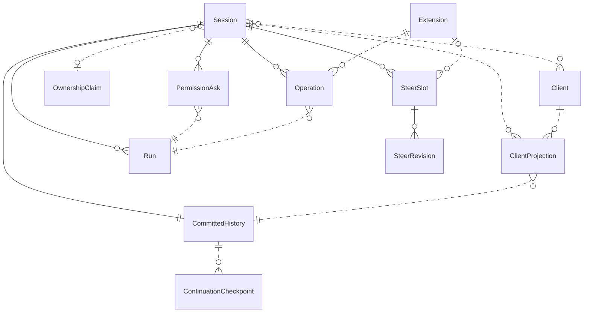

{/* Generated by `modelith render`. Do not edit by hand; edit the .modelith.yaml source and re-render. */}

# Committed session history and shared interaction

A `Session` retains authoritative `CommittedHistory`, admits one active `Run`, and exposes authorized `ClientProjection` views. `Client` and `Extension` actions share admission semantics; source-scoped `SteerSlot` input and `PermissionAsk` resolutions remain ordered and recoverable. The companion [proposal](session-commit-history.md) owns rationale, open questions, and scope.

## Entities

### `Client`

An authenticated API consumer observing or acting on a `Session` under caller-specific authorization. An interactive attachment can request eligible work; a read-only observation cannot activate execution.

**Relationships**

- `ClientProjection` — 1:n

**Invariants**

- **observe-does-not-activate** — Reading `ClientProjection` history or subscribing to committed changes does not load an engine, acquire ownership, or start work.
- **drafts-stay-local** — Unsubmitted composer text and approval responses remain `Client` local; submitted pending controls belong to server state.

### `ClientProjection`

The authorized display view of `CommittedHistory` at a known position, including shared pending controls and their committed dispositions. Provisional observations may accompany the view but have no committed resume position until confirmed.

**Derived:** Authorized session facts and timeline items are projected from committed records at the requested position.

**Relationships**

- `CommittedHistory` — n:1

**Invariants**

- **complete-view-then-follow** — A `ClientProjection` loads complete authorized history through C in bounded pages, then follows committed changes after C without a silent gap.
- **authorization-not-token** — Every `ClientProjection` page, subscription, and detail read rechecks authority; private continuation material is not exposed by possession of a cursor.
- **reflect-pending-controls** — Authorized `ClientProjection` reloads and committed updates reflect shared pending steer content, revision, and disposition, plus pending asks and their resolutions.

### `CommittedHistory`

The private, versioned, append-only ordered facts of a `Session`. An accepted position establishes commitment under the storage adapter's declared durability guarantee; transient observations are not history.

**Relationships**

- `ContinuationCheckpoint` — 1:n

**Invariants**

- **single-history-authority** — Continuation and retained display facts derive from `CommittedHistory`; summaries, checkpoints, and optional diagnostic logs are not separate authorities.
- **fenced-append** — An append to `CommittedHistory` checks the expected head and rejects stale writers under the backend's declared operating mode; distributed appends atomically check the current epoch and unexpired `OwnershipClaim`, while single-process local storage enforces write serialization and available file-lock protection.
- **retained-compaction-history** — Compaction changes model continuation but preserves earlier `CommittedHistory` for authorized display and forks.
- **lost-commit-fails-closed** — Missing previously acknowledged `CommittedHistory` stops writes and confirmed projections; local memory cannot overwrite history to repair it.

### `ContinuationCheckpoint`

Materialized continuation state derived through a known position in `CommittedHistory`. A checkpoint accelerates loading and may lag the head; it is not an independently writable source of session truth.

**Invariants**

- **checkpoint-plus-replay** — Loading at position C applies every `CommittedHistory` record after the `ContinuationCheckpoint` position P through C; missing or incompatible records fail explicitly.

### `Extension`

A trusted registered interpreter for namespaced, versioned session records and derived state. An `Extension` owns its operation semantics and can submit small steer hints through authorized session actions.

**Relationships**

- `Operation` — 1:n
- `SteerSlot` — 0..1:n — Each extension slot names exactly one registered extension. The user slot has no extension, and each extension has at most one slot per session even when it manages several operations.

**Invariants**

- **trusted-extension-registration** — Only trusted registered `Extension` handlers declare record type, version, continuation criticality, and safe-point metadata; payload text cannot register authority.
- **critical-extension-fails-closed** — Missing or incompatible continuation-critical `Extension` handlers block dependent execution, while core management and logical deletion remain possible.
- **extension-slot-authority** — An `Extension` controls only its own `SteerSlot`; notification submission grants neither user-slot authority nor permission to answer asks or bypass execution gates.
- **small-retrievable-hints** — An `Extension` steer is a size-capped hint pointing to authorized tools for full canonical results; replacement covers outstanding work without deleting `Operation` outcomes.

### `Operation`

Session-scoped work with durable identity distinct from its originating tool call and `Run`. An `Operation` records lifecycle and canonical results through its `Extension`; its identity can span run boundaries.

**Relationships**

- `Run` — n:1 — The originating run is correlation, not the operation's lifetime boundary.

**Invariants**

- **operation-history-authority** — Continuation-relevant `Operation` state and canonical admitted results are reconstructible from committed extension records, not an independent mutable plugin snapshot.
- **outcome-not-notification** — Coalescing an `Extension` steer or losing a run-admission race cannot erase a committed `Operation` outcome.
- **active-operation-claim** — Active `Operation` execution and writes remain under the root `OwnershipClaim`, even without a foreground `Run`.

### `OwnershipClaim`

The renewable backend-authoritative right of one replica to execute and append for a root `Session` and its delegation tree. Its epoch fences stale writers; expiry determines authority, not whether external work stopped.

**Attributes**

| Name | Type | Description |
| --- | --- | --- |
| `epoch` | integer |  |
| `expiry` | timestamp |  |

**Invariants**

- **claim-not-connection** — An `OwnershipClaim` follows executing work rather than `Client` connection count; idle or parked sessions may release it while readers remain connected.
- **expiry-is-not-quiescence** — Expired `OwnershipClaim` authority does not prove tools or the former replica stopped; reacquisition advances the epoch and reconciles the durable head.

### `PermissionAsk`

A durable request for an authorized decision gating work in an exact `Run`. Multiple clients can see and answer the same ask without reserving an exclusive responder; its committed resolution is session state.

**Relationships**

- `Run` — n:1

**Invariants**

- **first-committed-approval-wins** — The first valid authorized committed `PermissionAsk` resolution wins; later conflicting answers receive the authoritative already-resolved outcome and cannot reverse it.
- **durable-ask-is-not-execution** — A pending `PermissionAsk` can survive unloading and ownership release; resolving it rehydrates the exact ask through the authorized activation boundary.

### `Run`

One admitted execution driving a `Session` through model turns and tools. A `Run` has stable identity distinct from session identity and is server-owned rather than owned by the connection that requested it.

**Invariants**

- **explicit-prompt-conflict** — A competing prompt receives an explicit conflict identifying the active `Run`; it is neither silently queued nor reinterpreted as a steer.
- **exact-run-no-promotion** — A steer qualified by `Run` identity cannot start or retarget another run; an unqualified steer may request eligible execution when idle.
- **disconnect-not-cancel** — A `Client` disconnect does not cancel the `Run` or transfer control rights.
- **intent-before-dispatch** — A `Run` commits the assistant tool request and each call's intent before dispatch, and commits the result before dependent model continuation.
- **no-uncertain-tool-retry** — Recovery distinguishes requested-not-started tools from intent-with-unknown-outcome tools and never automatically reruns an uncertain external action.

### `Session`

The durable conversation and unit of interaction. A `Session` survives individual `Run` and `Client` lifetimes; its current continuation and retained display facts derive from its `CommittedHistory`.

**Relationships**

- `CommittedHistory` — 1:1 — owned
- `Run` — 1:n — owned
- `SteerSlot` — 1:n — owned
- `PermissionAsk` — 1:n — owned
- `Operation` — 1:n — owned
- `OwnershipClaim` — n:0..1 — An active delegation tree shares its root claim. Separately owned peer sessions have separate claims.
- `Client` — n:n
- `ClientProjection` — 1:n

**Invariants**

- **one-active-run** — A `Session` admits at most one active `Run`, regardless of the producer requesting it.
- **shared-control** — Multiple authorized `Client` callers may operate on one `Session`; each action is independently authorized and serialized, without an exclusive controller.
- **deletion-gate** — Logical deletion denies `Session` reads and activation, fences writes, and prevents identity reuse, independently of physical purge timing.

### `SteerRevision`

An identified committed version of a `SteerSlot`'s pending content and disposition. Source attribution is server-stamped; consumption identifies the exact revision delivered as model input.

**Invariants**

- **commit-before-steer-delivery** — `SteerRevision` admission is committed before acknowledgement, and model-input insertion and exact-revision consumption commit before the model receives it.
- **replacement-survives-consumption** — Consuming an older `SteerRevision` cannot clear a newer concurrently admitted replacement in the same slot.
- **provenance-is-not-privilege** — The server distinguishes user from named extension, tool, or harness `SteerRevision` provenance; non-user content remains appropriately fenced data, not system or permission authority.

### `SteerSlot`

One source's replaceable pending input within a `Session`. There is one shared user slot and one slot per registered `Extension`; slots use the same update, retraction, and consumption semantics without an instruction queue or extension-defined subkeys.

**Relationships**

- `SteerRevision` — 1:n — owned

**Actions:** `set pending input`, `replace pending input`, `retract pending input`, `consume delivered revision`

**Invariants**

- **source-slot-isolation** — Updating or retracting one `SteerSlot` cannot change another; all authorized interactive clients share the same user slot.
- **revision-checked-edit** — Replacement and retraction name the expected `SteerSlot` revision, and stale edits conflict rather than overwrite a concurrent update.
- **all-pending-together** — At the next eligible model-input boundary, every pending `SteerSlot` is delivered together in deterministic order, without interrupting an in-flight request or bypassing an approval.

## Relationships

## Scenarios

### Two clients race to start one run

**Actors:** Client

**Steps**

1. Two authorized `Client` callers request a prompt on the same eligible `Session`.
2. The owner commits admission of one `Run` to `CommittedHistory`; the other caller receives a conflict identifying that run.
3. The losing `Client` may explicitly submit an exact-run steer, which can fail stale if the run has already ended.
4. Disconnecting the winning `Client` does not cancel the server-owned `Run`.

**Invariants touched**

- **one-active-run** — A `Session` admits at most one active `Run`, regardless of the producer requesting it.
- **shared-control** — Multiple authorized `Client` callers may operate on one `Session`; each action is independently authorized and serialized, without an exclusive controller.
- **explicit-prompt-conflict** — A competing prompt receives an explicit conflict identifying the active `Run`; it is neither silently queued nor reinterpreted as a steer.
- **exact-run-no-promotion** — A steer qualified by `Run` identity cannot start or retarget another run; an unqualified steer may request eligible execution when idle.
- **disconnect-not-cancel** — A `Client` disconnect does not cancel the `Run` or transfer control rights.

### Reload with a lagging checkpoint

**Actors:** Client

**Steps**

1. A `ContinuationCheckpoint` materializes `CommittedHistory` through P while the head has advanced to C.
2. The server replays every record in (P,C] to reconstruct continuation, including compaction without deleting older history.
3. A read-only `Client` loads authorized `ClientProjection` pages through C and subscribes after C without activating work.
4. A missing previously acknowledged record fails the load rather than repairing history from local memory.

**Invariants touched**

- **single-history-authority** — Continuation and retained display facts derive from `CommittedHistory`; summaries, checkpoints, and optional diagnostic logs are not separate authorities.
- **checkpoint-plus-replay** — Loading at position C applies every `CommittedHistory` record after the `ContinuationCheckpoint` position P through C; missing or incompatible records fail explicitly.
- **retained-compaction-history** — Compaction changes model continuation but preserves earlier `CommittedHistory` for authorized display and forks.
- **complete-view-then-follow** — A `ClientProjection` loads complete authorized history through C in bounded pages, then follows committed changes after C without a silent gap.
- **observe-does-not-activate** — Reading `ClientProjection` history or subscribing to committed changes does not load an engine, acquire ownership, or start work.
- **lost-commit-fails-closed** — Missing previously acknowledged `CommittedHistory` stops writes and confirmed projections; local memory cannot overwrite history to repair it.

### Continue editing a submitted steer on another client

**Actors:** Client

**Steps**

1. A `Client` submits input into the shared user `SteerSlot`; the server commits its `SteerRevision` before acknowledgement.
2. Another authorized `Client` reloads pending content and revision through `ClientProjection` and replaces it using the expected revision.
3. A stale update from the original `Client` conflicts, while unsent composer text remains local.

**Invariants touched**

- **source-slot-isolation** — Updating or retracting one `SteerSlot` cannot change another; all authorized interactive clients share the same user slot.
- **revision-checked-edit** — Replacement and retraction name the expected `SteerSlot` revision, and stale edits conflict rather than overwrite a concurrent update.
- **reflect-pending-controls** — Authorized `ClientProjection` reloads and committed updates reflect shared pending steer content, revision, and disposition, plus pending asks and their resolutions.
- **commit-before-steer-delivery** — `SteerRevision` admission is committed before acknowledgement, and model-input insertion and exact-revision consumption commit before the model receives it.
- **drafts-stay-local** — Unsubmitted composer text and approval responses remain `Client` local; submitted pending controls belong to server state.

### User and extension input at one boundary

**Actors:** Client, Extension

**Steps**

1. A user `SteerSlot` and slots for two registered `Extension` sources contain pending hints.
2. The active `Run` commits all pending `SteerRevision` input together in deterministic order at its next safe input boundary.
3. The model receives server-stamped provenance distinguishing user, extension, tool, and harness sources without granting non-user content instruction authority.
4. An `Extension` replacement committed after the delivery decision remains pending; consumption of its older revision cannot clear it.

**Invariants touched**

- **all-pending-together** — At the next eligible model-input boundary, every pending `SteerSlot` is delivered together in deterministic order, without interrupting an in-flight request or bypassing an approval.
- **source-slot-isolation** — Updating or retracting one `SteerSlot` cannot change another; all authorized interactive clients share the same user slot.
- **provenance-is-not-privilege** — The server distinguishes user from named extension, tool, or harness `SteerRevision` provenance; non-user content remains appropriately fenced data, not system or permission authority.
- **replacement-survives-consumption** — Consuming an older `SteerRevision` cannot clear a newer concurrently admitted replacement in the same slot.
- **commit-before-steer-delivery** — `SteerRevision` admission is committed before acknowledgement, and model-input insertion and exact-revision consumption commit before the model receives it.

### Several operation results coalesce into one hint

**Actors:** Extension

**Steps**

1. Several `Operation` outcomes commit through one `Extension` in a `Session`.
2. The `Extension` replaces its sole pending `SteerSlot` with a small hint directing the agent to a tool that lists ready results.
3. If idle, the unqualified steer requests eligible `Run` admission; a concurrent prompt may win without erasing the committed outcomes or pending hint.
4. An active `Run` receives the hint at its next safe boundary and calls an authorized tool for full results; unrelated extension and user slots remain unchanged.

**Invariants touched**

- **small-retrievable-hints** — An `Extension` steer is a size-capped hint pointing to authorized tools for full canonical results; replacement covers outstanding work without deleting `Operation` outcomes.
- **outcome-not-notification** — Coalescing an `Extension` steer or losing a run-admission race cannot erase a committed `Operation` outcome.
- **operation-history-authority** — Continuation-relevant `Operation` state and canonical admitted results are reconstructible from committed extension records, not an independent mutable plugin snapshot.
- **extension-slot-authority** — An `Extension` controls only its own `SteerSlot`; notification submission grants neither user-slot authority nor permission to answer asks or bypass execution gates.
- **source-slot-isolation** — Updating or retracting one `SteerSlot` cannot change another; all authorized interactive clients share the same user slot.
- **one-active-run** — A `Session` admits at most one active `Run`, regardless of the producer requesting it.

### Conflicting approval answers

**Actors:** Client

**Steps**

1. Two authorized `Client` callers observe the same pending `PermissionAsk` through their `ClientProjection` views.
2. One valid answer commits first; a conflicting later answer receives the authoritative already-resolved decision.
3. Both clients see the committed resolution; unsubmitted response text stays local.
4. The ask may have been unloaded while waiting, so the authorized resolution first rehydrates it under the tree claim.

**Invariants touched**

- **first-committed-approval-wins** — The first valid authorized committed `PermissionAsk` resolution wins; later conflicting answers receive the authoritative already-resolved outcome and cannot reverse it.
- **reflect-pending-controls** — Authorized `ClientProjection` reloads and committed updates reflect shared pending steer content, revision, and disposition, plus pending asks and their resolutions.
- **drafts-stay-local** — Unsubmitted composer text and approval responses remain `Client` local; submitted pending controls belong to server state.
- **durable-ask-is-not-execution** — A pending `PermissionAsk` can survive unloading and ownership release; resolving it rehydrates the exact ask through the authorized activation boundary.

### Fenced takeover with uncertain external work

**Steps**

1. A `Run` commits a tool request and per-call intent, then the replica loses its `OwnershipClaim` before recording the result.
2. Expiry permits fenced acquisition with a new epoch but does not prove the external action stopped.
3. A stale append fails; recovery distinguishes no-intent requests from intent-with-unknown-outcome calls and does not rerun the uncertain tool.
4. Active `Operation` obligations remain under the root claim, and a missing continuation-critical `Extension` blocks dependent execution rather than claiming quiescence.

**Invariants touched**

- **fenced-append** — An append to `CommittedHistory` checks the expected head and rejects stale writers under the backend's declared operating mode; distributed appends atomically check the current epoch and unexpired `OwnershipClaim`, while single-process local storage enforces write serialization and available file-lock protection.
- **expiry-is-not-quiescence** — Expired `OwnershipClaim` authority does not prove tools or the former replica stopped; reacquisition advances the epoch and reconciles the durable head.
- **intent-before-dispatch** — A `Run` commits the assistant tool request and each call's intent before dispatch, and commits the result before dependent model continuation.
- **no-uncertain-tool-retry** — Recovery distinguishes requested-not-started tools from intent-with-unknown-outcome tools and never automatically reruns an uncertain external action.
- **active-operation-claim** — Active `Operation` execution and writes remain under the root `OwnershipClaim`, even without a foreground `Run`.
- **critical-extension-fails-closed** — Missing or incompatible continuation-critical `Extension` handlers block dependent execution, while core management and logical deletion remain possible.
- **trusted-extension-registration** — Only trusted registered `Extension` handlers declare record type, version, continuation criticality, and safe-point metadata; payload text cannot register authority.

### Readers do not pin ownership or bypass deletion

**Actors:** Client

**Steps**

1. An idle `Session` releases its `OwnershipClaim` while authorized `Client` readers remain subscribed to committed history.
2. A cursor does not confer authority for a later `ClientProjection` page or detail read.
3. Logical deletion gates all further session reads and activation even if physical history has not yet been purged.

**Invariants touched**

- **claim-not-connection** — An `OwnershipClaim` follows executing work rather than `Client` connection count; idle or parked sessions may release it while readers remain connected.
- **authorization-not-token** — Every `ClientProjection` page, subscription, and detail read rechecks authority; private continuation material is not exposed by possession of a cursor.
- **deletion-gate** — Logical deletion denies `Session` reads and activation, fences writes, and prevents identity reuse, independently of physical purge timing.

