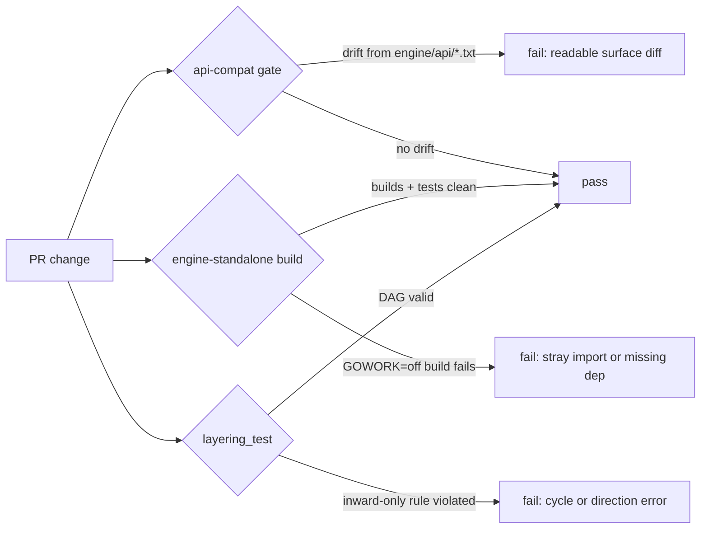

# API stability

Mecatl protects the exported API of its importable Go engine with committed API
snapshots, a standalone module build, and architecture tests. These checks make
surface changes visible before they reach an embedding application.

The engine ships as the separate Go module
`github.com/stacklok/mecatl/engine`. Importing it does not pull in provider SDKs,
gRPC, the terminal UI, or Kubernetes dependencies.

## The stable surface

The contract covers the **exported identifiers** of eight core packages:

|Package|Role|
|-|-|
|`engine/session`|Sessions, value objects, and events|
|`engine/governance`|Permission rules, evaluation, and hook event types|
|`engine/learning`|Evidence reflection and learned-skill lifecycle contracts|
|`engine/tool`|Tools, the catalog, workspaces, and source interfaces|
|`engine/prompt`|Prompt assembly and discovery interfaces|
|`engine/port`|Interfaces consumed by the agent loop|
|`engine/team`|Agent-team domain types|
|`engine/agent`|The loop, dispatch, delegation, and team supervision|

Every exported constant, variable, function, type, method, and struct field in
these packages is part of the contract. The API check derives the guarded
package set from `arch.CorePackages` in `engine/arch/surface.go`.

### What the snapshot captures

The committed baselines under `engine/api/*.txt` capture:

- Constant values as well as their types. This catches changes to wire values
  such as event types and stop reasons.
- Exported struct fields. Private fields and internal layout do not affect the
  compatibility baseline.
- Exported methods and complete interface method sets.

## What is explicitly excluded

|Excluded|Reason|
|-|-|
|`engine/adapter/*`|Reference adapters, test doubles, and conformance suites. Their interfaces in `engine/port` and `engine/tool` are guarded, but adapter implementations can change in a minor release.|
|`engine/arch`|Test-support only: the layering proofs and the `arch.CorePackages` list.|
|Root module (`internal/`, `cmd/`, `contracts/`, `perf/`)|Outside the engine module boundary (ADR 0036). No external compatibility promise applies.|

You can use reference adapters such as `mockllm` and `memfs` in tests, but treat
them as conveniences rather than stable dependencies. Build production
integrations against the guarded interfaces.

## Versioning discipline

The engine module tags independently from the host repository using the Go
submodule convention `engine/vX.Y.Z`. The host repo's own `vX.Y.Z`
container-image tags are separate.

### While v0.x (current)

|Release type|Tag grammar|When used|
|-|-|-|
|Minor|`engine/v0.Y+1.0`|Additive and breaking API changes. Every breaking change must be classified in the changelog.|
|Patch|`engine/v0.Y.Z+1`|Bug fixes with no surface change.|

### v1.0.0 and beyond

After `engine/v1.0.0`, a breaking change requires a major version bump.

:::note[Changelog classification]

`engine/CHANGELOG.md` follows Keep a Changelog. `engine/COMPATIBILITY.md`
classifies **Added** as a minor change and **Changed**, **Deprecated**, or
**Removed** as breaking. Breaking changes still use a minor release while the
module is at v0.x.

:::

## The three enforcement gates

All three run under `task test` and in CI on every PR.

### 1. `api-compat` (`task api:check`)

Compares the exported surface of all eight packages with the committed
`engine/api/*.txt` baselines. A new field, renamed method, changed constant, or
removed type fails with a readable diff. The check runs as the `api-compat` CI
job and as part of `task test`.

### 2. Engine-standalone build (`task test:engine-standalone`)

Builds and tests `engine/` with `GOWORK=off`. This reproduces the view of an
external application that imports the module. It catches imports from the host
repository and missing or inconsistent module checksums.

### 3. `layering_test` (`engine/arch/layering_test.go`)

Enforces inward-only dependencies, transitive direction, and cycle detection
across the engine import graph. It also confirms that the guarded package set
matches the API snapshots.

## Consumer workflow for an intentional break

When you change a core package's exported API on purpose:

1. Run `task api:check` and review the surface diff.
1. Run `task api:update` to regenerate `engine/api/*.txt`.
1. Commit the updated snapshots with the code change.
1. Add an entry under `## [Unreleased]` in `engine/CHANGELOG.md`, classified
   according to `engine/COMPATIBILITY.md`.
1. Review the snapshot diff and changelog classification together in the pull
   request.

See
[`engine/CHANGELOG.md`](https://github.com/stacklok/mecatl/blob/main/engine/CHANGELOG.md)
for the current unreleased changes and version history.

:::note[Go minor-version toolchain bumps]

The rendered object strings are stable across Go patch versions. A Go minor
version can reformat them. If that happens, run `task api:update` once to reseed
the baselines. A formatting-only regeneration does not require a changelog
entry.

:::

## Event-sourced `Load` contract

Mecatl normally persists a session as a snapshot. A host that uses an
append-only event log as its system of record can implement
`port.SessionStore.Load` by folding events into a `*session.Session`. The
reference implementation is `engine/adapter/eventsource.Fold`.

### Required reconstruction

|Field|Round-trip obligation|Event source|
|-|-|-|
|`Conversation` with valid tool-call pairing|Required|`EvUserPrompt`, `EvMessageDelta`, `EvToolCall`, `EvToolResult`, and the pre-compaction head from `EvCompactionArchive`|
|`State`|Required|The terminal `EvResult.Stop`; an unanswered `EvPermissionAsk` means awaiting, and no terminal event means idle|
|Recorded stop reason|Required|`EvResult.Stop`|
|`PendingAsk` while awaiting approval|Required|The trailing `EvPermissionAsk` with no following `EvApproval` or `EvResult`|
|Cumulative `Usage`|Required|The sum of every per-run `EvResult.Usage`|
|Title metadata|Required|Authoritative values from `eventsource.SessionMeta`; an empty legacy title falls back to the first client `EvUserPrompt`|
|Creation metadata|Required, supplied separately|`eventsource.SessionMeta`|
|Run counters|Latest run segment only|`EvTurnStart` and `EvToolResult`|
|Diagnostics binding, ask ID serials, and context|Rebuilt at runtime|Not event-backed|

Events do not contain creation metadata such as the session ID, limits,
environment identity, profile, provider, model, owner, or creation time. The
caller must supply this data through `eventsource.SessionMeta`.

`EvUserPrompt` carries client prompts and harness-generated continuations, so a
fold can reconstruct the conversation in stream order.

### Replay-fidelity limitation

The event stream does not contain three provider-private replay fields:

- `Message.Reasoning`, the provider reasoning replay blob
- `Message.ProviderPhase`, the OpenAI Responses phase marker
- `ToolCall.ItemID`, the provider-assigned item ID

`EvReasoningDelta` contains a readable summary, not the opaque replay value. A
fold must not place it in `Message.Reasoning`.

A folded session provides byte-identical replay only for providers that do not
use these fields. Mecatl resumes its own sessions from snapshots, which retain
them. Event-log systems that need reasoning-provider replay must store the
opaque values in a richer event schema.

## Next steps

- [Embed the engine](/building/deployment/embed-engine.md) in a Go service.
- [Implement extension points](/building/extension-points/index.md) against the
  guarded interfaces.
- [Review the engine changelog](https://github.com/stacklok/mecatl/blob/main/engine/CHANGELOG.md)
  for versioned API changes.
