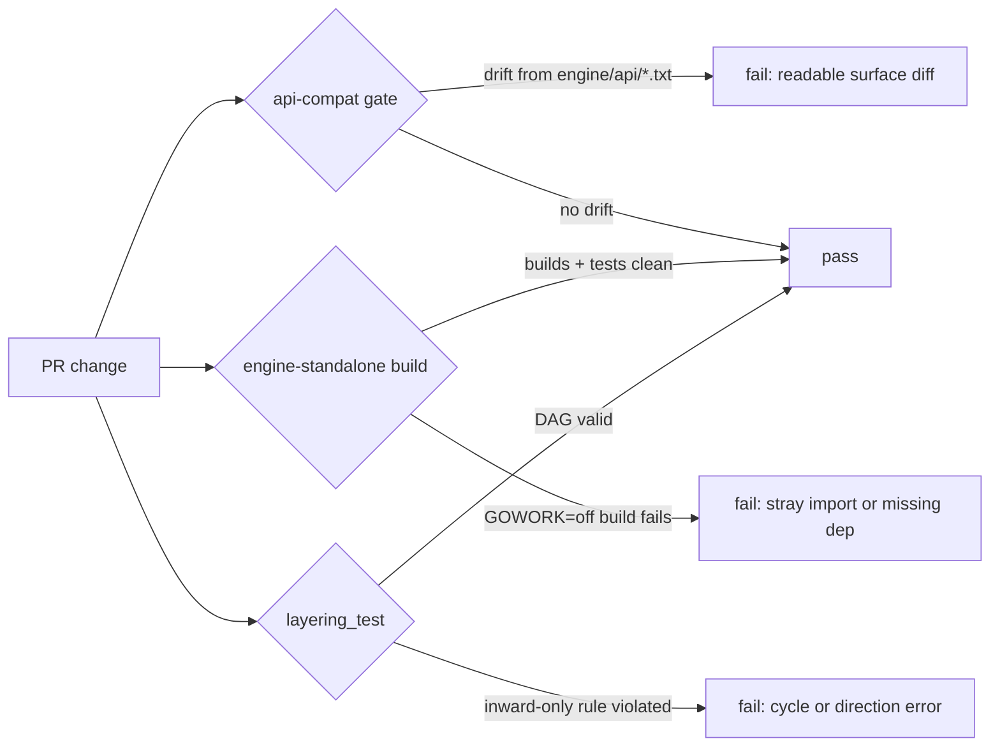

# API stability

`github.com/stacklok/mecatl/engine` is the importable core of Mecatl (ADR 0036). It ships as its own Go module with a small dependency closure (`doublestar`, `robfig/cron/v3`, `github.com/goccy/go-yaml`, `x/net`, and `x/sync`; test-only `goleak`) so external consumers do not pull Mecatl's full require cone — no LLM SDKs, no gRPC, no TUI stack. This page describes what the public surface covers, what is explicitly excluded, how changes are versioned, and how the three enforcement gates catch accidental breaks before they reach a consumer.

---

## The stable surface

The contract covers the **exported identifiers** of eight core packages:

| Package | Role |
|---|---|
| `engine/session` | the `Session` aggregate, value objects, the event taxonomy |
| `engine/governance` | permission `Effect`/`Scope`/`Rule` + `Evaluator`, hook event types |
| `engine/learning` | evidence-backed reflection and learned-skill lifecycle contracts |
| `engine/tool` | `Tool`/`Catalog`, `FileSystem`/`Workspace`, source port interfaces |
| `engine/prompt` | two-layer prompt assembly + discovery ports |
| `engine/port` | the port interfaces the agent loop consumes |
| `engine/team` | the agent-team domain |
| `engine/agent` | the loop, dispatch, delegation tools, the team `Supervisor` |

Every exported identifier — const, var, func, type, exported method, exported struct field — in those packages is part of the contract. The authoritative list is `arch.CorePackages` in `engine/arch/surface.go`. The API gate derives its guarded set from that constant and asserts equality, so a new core package cannot escape the gate and a removed one does not silently linger.

### What the snapshot captures

The committed baselines under `engine/api/*.txt` are rendered from `go/types` object strings with two refinements:

- **Const VALUES are captured**, not just the type. A wire-protocol enum change — an `EventType` string like `EvApproval = "approval"`, or a `StopReason` like `StopBudget = "budget"` — is a real break for any consumer reading the value off the wire. The baseline records the exact value so that change cannot pass silently.
- **Only exported struct fields are captured.** Unexported fields (mutexes, maps, private sub-structs) are stripped before the snapshot is rendered. Internal layout churn — adding a mutex, reorganizing private state — does not force a baseline update or a CHANGELOG note.

Exported methods and interface methods are enumerated in full.

---

## What is explicitly excluded

| Excluded | Reason |
|---|---|
| `engine/adapter/*` | Reference adapters: test doubles (`mockllm`, `memfs`, `memstore`, `permpolicy`) and sane defaults (`wallclock`, `nofs`, `sessnap`, `memlease`) plus the `*conformance` suites. These ship as offline test infrastructure and default wiring, not as a stable API. Note: the conformance suites' real contract is the port interfaces in `engine/port` and `engine/tool`, which ARE guarded — the suites merely exercise them. |
| `engine/arch` | Test-support only: the layering proofs and the `arch.CorePackages` list. |
| Root module (`internal/`, `cmd/`, `contracts/`, `perf/`) | Outside the engine module boundary (ADR 0036). No external compatibility promise applies. |

The `engine/adapter/*` exclusion matters in practice: if you embed Mecatl, you may use `engine/adapter/mockllm` and `engine/adapter/memfs` in your own tests, but you should treat them as a convenience, not a stable dependency. Their signatures can change in any minor release. The port interfaces those adapters implement — in `engine/port` and `engine/tool` — are what the contract actually guarantees.

---

## Versioning discipline

The engine module tags independently from the host repository using the Go submodule convention `engine/vX.Y.Z`. The host repo's own `vX.Y.Z` container-image tags are separate.

### While v0.x (current)

| Release type | Tag grammar | When used |
|---|---|---|
| Minor | `engine/v0.Y+1.0` | Additive changes (new exported identifiers) **and** breaking changes. Pre-v1 SemVer permits breaking changes in a minor bump; every break must be CHANGELOG-noted and classified. |
| Patch | `engine/v0.Y.Z+1` | Bug fixes with no surface change. |

### v1.0.0 and beyond

`engine/v1.0.0` is cut once the `engine/port` set settles and the external integration experience is stable. From that point, a breaking change requires a major bump per strict SemVer.

:::note[Classification in the CHANGELOG]

`engine/CHANGELOG.md` uses Keep a Changelog conventions. Every entry is classified per `engine/COMPATIBILITY.md`: **Added** = minor bump; **Changed**, **Deprecated**, or **Removed** = breaking (which is still a minor bump while v0.x).

:::

---

## The three enforcement gates

All three run under `task test` and in CI on every PR.

### 1. `api-compat` (`task api:check`)

Loads the eight core packages with `go/packages`, renders each one's exported surface to the stable text format described above, and diffs against the committed baselines in `engine/api/*.txt`. Any drift — a new field, a renamed method, a changed const value, a removed type — fails with a human-readable diff. The check runs as a named `api-compat` CI job for a clear signal, and also as part of the normal `task test` sweep.

The dumper lives in the root module (`internal/apicheck`) so the engine `go.mod` stays free of `go/tools` — importing `go/packages` would bloat the engine's dependency closure for every consumer.

### 2. Engine-standalone build (`task test:engine-standalone`)

Runs `cd engine && GOWORK=off go build ./...` and `go test ./...` with the workspace disabled. With `GOWORK=off`, the engine resolves against its own `engine/go.mod` and `engine/go.sum` alone — exactly the view an external `go get github.com/stacklok/mecatl/engine` consumer would get.

This gate catches two classes of problem: a stray engine → host-repo import (which the depguard allowlist and the DAG test also catch, but the module boundary provides a third enforcement layer), and a missing or inconsistent entry in `engine/go.sum`.

### 3. `layering_test` (`engine/arch/layering_test.go`)

Enforces the inward-only dependency rule across the whole import graph: transitive direction + cycle detection. This is the check that neither the per-file depguard allowlist (which does not understand transitivity) nor the module boundary alone can fully express. It also owns `arch.CorePackages` — the single source of truth for the guarded package set — and asserts that the `engine/api/*.txt` baseline set matches it exactly.

---

## Consumer workflow for an intentional break

When you change a core package's exported API on purpose:

1. Run `task api:check` locally (or let CI tell you). The gate fails with a readable surface diff identifying exactly what changed.
2. Run **`task api:update`** to regenerate the `engine/api/*.txt` baselines.
3. **Commit** the changed `engine/api/*.txt` files alongside your code change.
4. Add an entry to **`engine/CHANGELOG.md`** under `## [Unreleased]`, classified per `engine/COMPATIBILITY.md` (Added = minor; Changed/Deprecated/Removed = breaking).
5. In the PR, the reviewer sees the readable `.txt` diff and the CHANGELOG classification together. The break is deliberate, reviewed, and recorded — never silent.

See [`engine/CHANGELOG.md`](https://github.com/stacklok/mecatl/blob/main/engine/CHANGELOG.md) for the current state of the unreleased surface and the history of versioned changes. Recent examples: `v0.4.0` added `session.Usage.ReasoningTokens`; `v0.3.0` added the guardrail approve-once seam (`governance.HookOutcome.AskApproval`, `session.PendingAsk.HookOriginated`, `port.HookApprovalLearner`); `v0.1.0` **removed** `agent.WithWritableChildForker` and `agent.WithSubagentAutoMerge` (a breaking change, CHANGELOG-classified accordingly, once the writable Subagent moved to direct-write per ADR 0077).

:::note[Go minor-version toolchain bumps]

The `go/types` object strings the gate renders are stable across Go **patch** versions. A Go **minor** version bump may reformat them. When that happens, a one-time `task api:update` reseeds the baselines — that regeneration is NOT an API change and does not require a CHANGELOG entry.

:::

---

## Event-sourced `Load` contract

Mecatl persists a session as a snapshot (`engine/adapter/sessnap`). A host whose system of record is an append-only event log may instead implement `port.SessionStore.Load` by folding its event stream into a `*session.Session`. The reference implementation is `engine/adapter/eventsource.Fold`; ADR 0038 records the design decision.

### What a fold MUST populate vs. what is safe to lose

| Field | Round-trip obligation | Event source |
|---|---|---|
| `Conversation` (user prompts, assistant text, tool calls, tool results — tool-pairing-valid) | **MUST** | `EvUserPrompt` (user-role turns — genuine prompt + harness continuations), `EvMessageDelta` (assistant text), `EvToolCall`, `EvToolResult`; pre-compaction head from `EvCompactionArchive` |
| `State` (idle / running / awaiting / completed / failed / cancelled) | **MUST** | Derived from the terminal `EvResult.Stop`; a trailing unanswered `EvPermissionAsk` → awaiting; no terminal → idle |
| Recorded stop reason | **MUST** | `EvResult.Stop` |
| `PendingAsk` (when awaiting) | **MUST** | The trailing `EvPermissionAsk` with no following `EvApproval` or `EvResult` |
| Cumulative `Usage` | **MUST** | The **sum** of every per-run `EvResult.Usage` (each is per-run; the token-budget brake reads the cumulative aggregate) |
| Creation metadata: id, mode, limits, workspace, profile, provider/model selector, reasoning-effort, createdAt | **MUST** (supplied out-of-band) | **Not in any event** — provided by the caller via `eventsource.SessionMeta` |
| `Counters` (turns / tool calls / consecutive failures) | Run-scoped — reflect the latest run segment (reset on `Reopen`) | `EvTurnStart` (turns), `EvToolResult` (tool calls, consecutive failures) |
| Run plumbing: diagnostics binding, askID serials, context | Safe to lose — rebuilt fresh | n/a |

**Creation metadata is not in events.** No event carries the session id, limits, workspace, profile, provider/model selector, reasoning-effort, or creation timestamp. There is deliberately no `EvSessionCreated` event (ADR 0038 notes it as a possible future extension). The caller who created the session supplies this data alongside the stream via `eventsource.SessionMeta`.

User-role turns — both the genuine client prompt and harness-authored synthetic continuations (no-progress nudge, background-pending nudge, background-completion notice) — are event-carried via the log-only `EvUserPrompt` event. A fold therefore reconstructs the complete conversation in stream order.

### Replay-fidelity limitation

The conversation a fold rebuilds is complete **except for provider-private opaque replay fields**. Three fields reach the conversation only via `session.Session.RecordAssistant` in the agent loop and are never emitted on the event stream:

- `Message.Reasoning` — the provider reasoning replay blob (OpenAI encrypted reasoning content; Anthropic `(thinking, signature)`)
- `Message.ProviderPhase` — the OpenAI Responses phase marker
- `ToolCall.ItemID` — the provider-assigned item id

The `EvReasoningDelta` event carries a human-readable reasoning summary; the loop deliberately never places that on `Message.Reasoning`, and a fold must not either.

A session reconstructed by folding Mecatl's own event stream is therefore **byte-identical-replay faithful only for providers that do not use those fields**. It replays cleanly for plain-chat providers (e.g. the mock provider) but not for a reasoning provider whose `Reasoning`/`ProviderPhase`/`ItemID` would be empty where the snapshot carries them. This is why Mecatl's own resume uses the snapshot, which carries those fields. A fold is the right implementation for event-log-SoR hosts that accept this boundary or carry those fields in their own richer event schema. It is a documented contract limitation, not a bug.

---

## What's next

- [Embed the engine](/building/deployment/embed-engine.md) — `go get github.com/stacklok/mecatl/engine`, its small dependency closure, and what's importable.
- [The agent loop](/building/what-you-get/agent-loop.md) — how the engine runs turns, dispatches tools, and emits the event stream.
- [Extension points](/building/extension-points/index.md) — implement a port interface (`port.LLMProvider`, `port.SessionStore`, `port.PermissionPolicy`, and others) to replace any capability.
- [Deployment decision](/building/getting-started/deployment-decision.md) — choosing between `mecated` and the embedded engine library.
- [`engine/CHANGELOG.md`](https://github.com/stacklok/mecatl/blob/main/engine/CHANGELOG.md) — the full history of versioned API changes.
