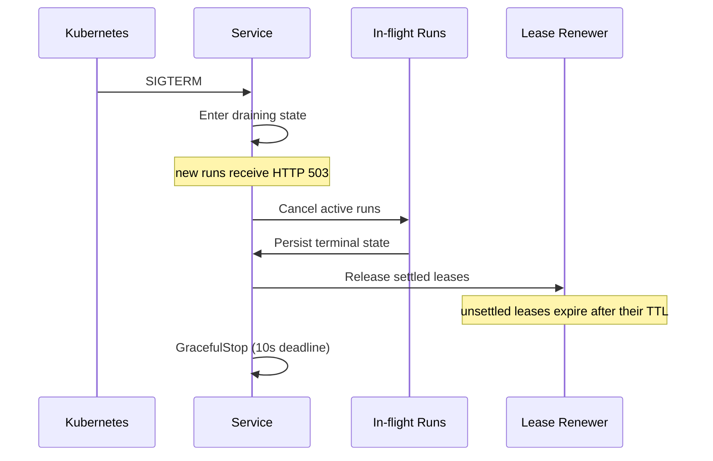

# Cloud-native kit properties

In a cloud-native Mecatl deployment, processes are disposable, state lives in
external services, and the activity record survives process failure. The
`mecak8s` Helm deployment provides these properties by storing session data in
Redis and coordinating session ownership with Kubernetes Leases.

## The three properties

### 1. Disposable process

The process can restart without losing state that reached durable storage. A
replacement resumes from the last persisted turn boundary, not from an
in-flight operation. Work after the last successful save can be lost.

Graceful shutdown stops new work and gives active runs a bounded window to
finish. A crash can leave a Kubernetes Lease held until its TTL expires. The
session recovers when a later prompt or approval re-enters it.

### 2. Externalized state

Nothing load-bearing lives only in process memory. The three durable artifacts
that matter:

- **Session snapshots** store the current session state at each turn boundary.
- **The event log** stores the append-only history, including pre-compaction
  events and approval verdicts.
- **Learned permission rules** reconstruct `allow_always` decisions from the
  event log, so a restart does not ask again for previously approved tools.

### 3. Durable record

With a durable backend, the append-only event log survives process failure. It
preserves:

- **Compaction archives** (`EvCompactionArchive`), which retain conversation
  history replaced during compaction.
- **Approval decisions** (`EvApproval`), which restore `allow_always` rules
  without storing raw tool arguments.
- **User turns** (`EvUserPrompt`), including harness-generated continuations.

These records appear in the server's durable log, not in the client event
stream.

#### Watching a session durably

A client can replay a session and continue following it with gRPC
`WatchSessionEvents` or HTTP `GET /v1/sessions/{id}/watch`. The call reads
durable storage, so a client can reconnect through a different replica.

Each frame is `{event, cursor, phase}`:

- **`cursor`** is an opaque resume token. Save it after processing each frame,
  and return it unchanged when reconnecting. An empty cursor starts at the
  beginning.
- **`phase`** identifies replayed, live, or gap frames. Treat it as an open
  string and tolerate unknown values. An event-less `live` frame marks the
  replay-to-live boundary.
- **`run_id`** can limit delivery to one run.

The server terminates a watch rather than silently dropping events:

- `watch_capacity` means the follower limit is full. Retry with bounded backoff
  from the last processed cursor.
- `watch_lagging` means the client fell behind the delivery buffer. Reconnect
  from the last processed cursor.
- `activity_gap` means a durable append failed. An event-less `gap` frame marks
  the position if the gap marker reaches storage.

A slow or broken watcher does not slow or terminate the live run.

The watch guarantee covers only events successfully appended to durable
storage. If the event-log backend fails and the process holding the watchers is
also lost, nothing can report the resulting gap. Redis, JSONL, and the gRPC
driver support cursor-based watching. Other stores return `watch_unsupported`.

## How each deployment option relates to the three properties

|Option|Disposable process|Externalized state|Durable record|
|-|-|-|-|
|**Embed the engine**|You define the lifecycle|You implement `port.SessionStore` and `port.EventLog`|You implement `port.EventLog`|
|**mecated**|Yes, with a durable store and Lease backend|JSONL through `--store-dir`, or a gRPC driver|JSONL event sidecars, or a gRPC driver|
|**mecak8s**|Yes, with durable Redis and Kubernetes Leases|Redis|Redis|
|**mecatequi**|One-shot process|None; each run is stateless|No durable record after the run|

When embedding, implement `port.SessionStore`, `port.EventLog`, and
`port.SessionLease` for your backing services. The in-memory reference adapters
provide a starting point for local use and tests.

With `mecated`, `--store-dir` enables JSONL persistence and a single-host file
lock under `<STORE_DIR>/.session-leases`. Remote or multi-host deployments need
a Kubernetes or gRPC session-lease backend. Without one, you must provide
session-affinity routing, and destructive maintenance remains unavailable.

With `mecak8s`, `--redis-url` configures the session store and event log, and
Kubernetes Leases coordinate ownership. Secure Redis with verified TLS. The
plaintext opt-in is for disposable local fixtures only.

## The cloud-native kit defined

`mecak8s` is Mecatl's reference cloud-native deployment. It provides:

- Redis for session state and the event log, with no Mecatl-owned persistent
  volume claim.
- A Kubernetes Lease for each session.
- Headless operation with `auto` posture by default.
- Bounded run cancellation and persistence, followed by recovery on another
  replica.
- A pod-only plaintext drain endpoint on port 8082. Cluster network policy must
  prevent untrusted direct access to pod IPs.

The production Helm chart creates namespace-scoped Lease RBAC, a Deployment, a
Service, and a PodDisruptionBudget for multi-replica operation. It runs two
replicas by default. A single replica is supported with lower availability.

The production profile does not create Redis or a general workload
NetworkPolicy. The local profile can create a disposable Redis fixture. Your
cluster remains responsible for general network isolation.

For the full deployment guide, see
[mecak8s deployment](/building/deployment/mecak8s.md).

## Operational implications

### Restart-sensitive state

Mecatl reconstructs persisted state after restart, but resets several
process-local controls:

- **File edit read ledger:** the next run must read a file again before editing
  or overwriting it.
- **Guardrail and run circuit breakers:** the process recreates them in their
  safe initial state.
- **Mid-round team coordination:** member sessions and transcripts persist, but
  the active roster, goal, tasks, and findings do not.

Other runtime state comes from the snapshot, event log, or operator
configuration.

### Lease-based exclusion

Local JSONL deployments automatically coordinate through single-host file
locks. Remote or multi-host storage requires a shared Lease backend. Without
one, you must provide session-affinity routing, and destructive maintenance
remains unavailable.

The server acquires a Lease before starting a run. A second replica that tries
to start the same session receives HTTP 409 or gRPC `FAILED_PRECONDITION`.
Single-host locks release when their file handle closes. Kubernetes Leases
expire after the configured `--session-lease-ttl`, which defaults to `30s`.

### Graceful SIGTERM drain

On SIGTERM, `mecak8s` closes admission before shutting down. New runs receive
HTTP 503 or gRPC `UNAVAILABLE`. The server cancels active runs, attempts to save
their terminal state, and releases their Leases.

The run-drain timeout defaults to 15 seconds. A run that does not settle within
that window retains its Lease until the TTL expires, which prevents another
replica from taking over while the original process can still write. The server
then gives gRPC 10 seconds to stop before forcing it to close. A successor
recovers the session from its last persisted state.

A settled cancelled run persists its terminal state before releasing its Lease.
After an ungraceful interruption, the successor closes orphaned tool calls with
error results when the next prompt reopens the session.

## Next steps

- [Deploy mecak8s](/building/deployment/mecak8s.md) with Redis and Kubernetes
  Leases.
- [Choose how to run Mecatl](/building/getting-started/deployment-decision.md)
  based on your operational requirements.
- [Implement extension points](/building/extension-points/index.md) for your own
  session store, event log, or Lease backend.
