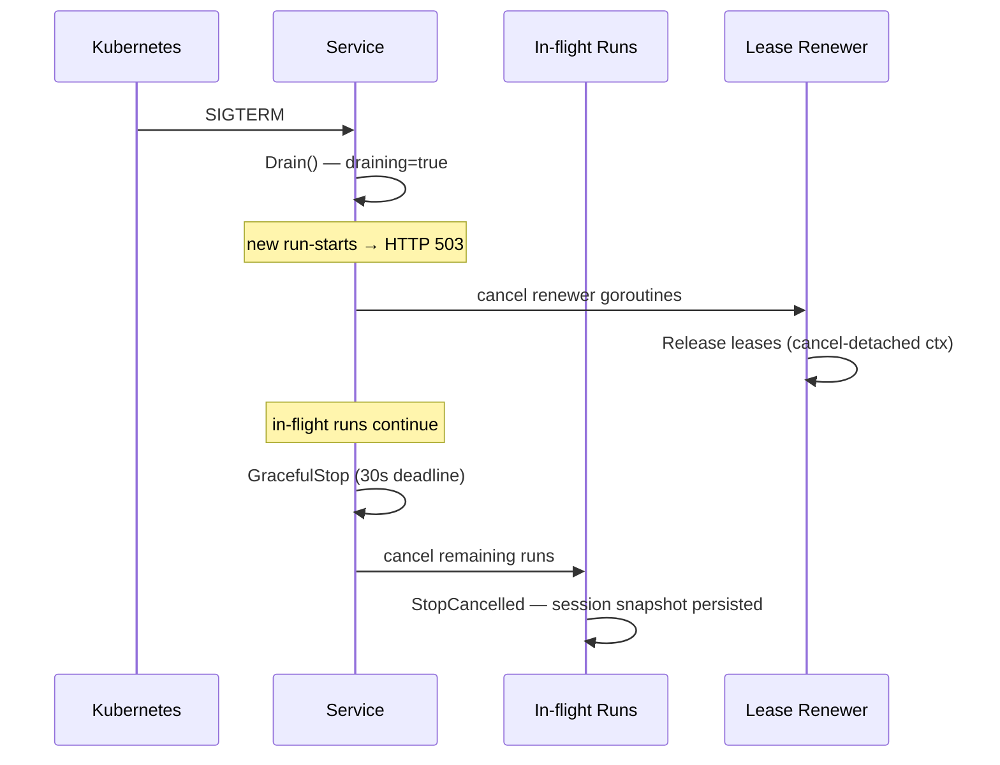

# Cloud-native kit properties

`mecak8s` is storage-free itself by design: its pods own no durable state.
Session snapshots and the durable event log live in Redis, while Kubernetes
Leases coordinate session ownership. That makes the pod disposable without
making the session disposable.

A mecatl deployment is "cloud-native" when it satisfies three properties: the process holds no irreplaceable state, all durable state lives outside the process, and the record of what happened survives process death. This page defines those three properties, maps each deployment shape against them, walks the four delivery phases that shipped them, and explains what the properties mean for operators.

---

## The three properties

### 1. Disposable process

The process can be restarted without losing state that was successfully persisted.
A replacement process resumes from the last persisted turn boundary; it does not
resume an in-flight goroutine or guarantee that work after the last save exists.
Graceful shutdown cancels active runs after its bounded drain window, while a
crash may leave a Kubernetes lease held until its TTL expires. Recovery occurs
when a later prompt or approval re-enters the session. Local JSONL persistence is
restart-safe where its guarantees are met. Strict EventLog append requires file and
directory sync; Delete, retention, and migration fail closed without directory sync,
which can make maintenance unavailable. An existing canonical snapshot can retain a
weaker Save capability, while the first Save of a root-level legacy family fails before
mutation when migration cannot sync directories. ToolCall audit is best-effort and may
leave an unsynced or partially synced record. `SnapshotDurability` probes syscall support,
not media persistence; the storage stack must honor successful sync and atomic rename.
A process crash can still lose buffered message/reasoning deltas from only the incomplete
turn or leave an unterminated final sidecar record. Completed-turn deltas are coalesced
into at most two durable appends while clients remain chunk-streamed.

The harness was unusually close to this by construction: the LLM adapters keep no server-side state (`store:false`; full replay on every turn), and the session aggregate round-trips through a stable snapshot saved at every turn boundary. The remaining gaps were the snapshot missing three fields (session profile, provider/model selector, cumulative token usage), a process death while parked awaiting approval stranding the session, and the event stream being emitted and discarded rather than persisted.

### 2. Externalized state

Nothing load-bearing lives only in process memory. The three durable artifacts that matter:

- **Session snapshots** — the `port.SessionStore` snapshot (`sessnap-json/1` format) saved at every turn boundary by `engine/adapter/sessnap`.
- **Durable event log** — the `port.EventLog` append-only per-session record, capturing every observable event including pre-compaction history and approval verdicts.
- **Permstore learned rules** — `allow_always` verdicts replayed from the event log into the in-memory permstore on load (`internal/app/approvalreplay.go`), so previously-approved tools are not re-asked after restart.

### 3. Durable record

With a durable backend, the append-only event log survives process death. Two consumers depend on it:

- **Compaction archive** (`EvCompactionArchive`) — the pre-compaction conversation captured before `ReplaceHistory` rewrites it, so "what did the agent do in turn 12" stays answerable after compaction.
- **Approval replay** (`EvApproval`) — allow-always verdicts (tool name + verdict string + askID, no raw args) replayed into a fresh permstore on load so a restarted process does not re-ask for every previously-granted tool.

A third event, `EvUserPrompt`, records every user turn (the genuine prompt plus any synthetic continuation) for the same reason: so the durable log alone is enough to reconstruct what the user actually asked. All three are log-only — neither relay puts them on the client's own event stream, only the durable log the server writes to. `engine/adapter/eventsource.Fold` is the reference consumer that walks the log back into a full `*session.Session` for a `SessionStore.Load` that has no snapshot of its own (see [ADR 0038](https://github.com/stacklok/mecatl/blob/main/docs/adr/0038-event-sourced-rehydration.md)).

The loop stays storage-agnostic throughout. It only emits — it never imports `port.EventLog` or calls `Append`. Persistence is handled by the server relay in `internal/adapter/server/grpc.go` and `internal/adapter/server/http.go`.

#### Watching a session durably

A client that wants to catch up on a session and then keep watching it has one call
for both: `WatchSessionEvents` over gRPC, or `GET /v1/sessions/{id}/watch` over
HTTP/SSE. It replays the durable log from a position, announces when it is caught
up, and then follows as the run appends — and because it reads durable storage
rather than an in-process registry, it works when the client reconnects to a
*different replica*, which is exactly the shape `mecak8s` deployments have.

Each frame is `{event, cursor, phase}`:

- **`cursor`** is an opaque resume token. Treat it as bytes to hand back — never
  parse, build, or edit one. Persist it once per frame you have *processed*; on any
  reconnect, pass that value back and the watch continues from the next record. An
  empty cursor means "from the beginning", which is the normal first attachment.
- **`phase`** is an open string, not an enum: `replay` (already durable when you
  attached), `live` (appended while you were following), or `gap`. Tolerate a value
  you do not recognise. Exactly one *event-less* `live` frame marks the replay→live
  boundary, so you can render the transcript and switch to a live view without
  waiting for a next event that, on an idle session, may never come.
- **`run_id`** optionally narrows delivery to one run's events.

Two terminations matter to an operator. A client that falls too far behind its
bounded server-side delivery buffer is **terminated** with `watch_lagging` rather
than having events silently dropped — reconnect with your last cursor and nothing
is lost. A failed durable append terminates watchers with `activity_gap`, and an
event-less `gap` frame marks the position when the marker itself lands. Neither
affects the run: a broken or slow watch never breaks or slows a live session.

That guarantee is deliberately bounded and worth stating plainly: it covers events
that were **durably appended**. If a backend outage coincides with loss of the
process holding the watchers, there is no mechanism to learn that events were
missed. Requires a store whose event log implements the cursor seam — Redis, JSONL,
and the gRPC driver do; a server without one answers `watch_unsupported` rather
than silently replaying the whole transcript.

---

## How each deployment shape relates to the three properties

| Shape | Disposable process | Externalized state | Durable record |
|---|---|---|---|
| **Embed the engine** | No — you wire it | You implement `port.SessionStore` and `port.EventLog` | You implement `port.EventLog` |
| **mecated** | Yes, with `--store-dir` (single-host flock lease is automatic) or a remote store + `--session-lease-*` | JSONL on disk (`--store-dir`) or gRPC driver (`--session-store-url`); Redis not exposed; schedule registry via `--schedule-store-url` (`ScheduleStoreService` + `ScheduleOneShotReArmerService`) | JSONL sidecar (`.events.jsonl`) or gRPC driver (`--event-log-url`) |
| **mecak8s** | Yes, out of the box | Redis (`internal/adapter/redisstore`) | Redis via same adapter |
| **mecatequi** | No — one-shot process | None — stateless per run | No durable record after the run |

**Embed:** the engine exports the ports; the reference adapters under `engine/adapter/` — `memstore`, `memlease`, `sessnap` — give you a working in-process starting point. For real externalization, implement `port.SessionStore`, `port.EventLog`, and `port.SessionLease` against your own backing service and wire them in composition.

**mecated:** the `--store-dir` flag selects JSONL persistence (`internal/adapter/store/jsonlstore`), which implements `port.SessionStore`, `port.EventLog`, and `port.ToolCallRecorder` in one `Store` type. It automatically composes the single-host flock lease under `<store-dir>/.session-leases`. Remote or multi-host deployments must wire an appropriate session lease (`--session-lease-k8s-namespace` for Kubernetes or `--session-lease-url` for a gRPC driver); without one, session-affinity routing is the deployer's responsibility and destructive maintenance fails closed.

**mecak8s:** wires Redis for session store and event log (`internal/adapter/redisstore`) and the Kubernetes `coordination.k8s.io/v1` lease adapter (`internal/adapter/k8slease`) at startup. The three properties hold when the external Redis and lease prerequisites are available; the Redis connection itself must be pointed somewhere and secured — `--redis-url` plus either verified TLS (`--redis-tls` or `--redis-tls-ca`) or, for a disposable local fixture only, the explicit `--redis-allow-plaintext` opt-in.

---

## The four delivery phases

ADR 0027 delivered the cloud-native arc in four independently-shippable phases.

### Phase 1 — Snapshot fidelity (SHIPPED)

Made the snapshot faithful enough that a restarted process is indistinguishable mid-conversation. Three fields were added to `sessnap.Snapshot` (`engine/adapter/sessnap/sessnap.go`):

- `profile` — session profile (`no-fs` vs default); the empty-workspace inference stays as a second defense.
- `ProviderID`/`ModelID` — the provider/model selector pair, so `Service.rehydrateSession` rebuilds the SAME per-session engine rather than falling to the default-provider floor.
- `usage` — cumulative `session.Usage` (input + output tokens, cache excluded), so the `MaxRunTokens` budget brake continues across restart.

All three are additive `omitempty` fields — the snapshot format tag (`sessnap-json/1`) is unchanged. An older harness loading a newer snapshot silently drops the new fields; the empty-workspace inference keeps the no-fs path correct even in that downgrade case.

### Phase 2 — Awaiting-approval evict/rehydrate (SHIPPED)

The process now supports rehydrating a session while it is parked awaiting a human
approval. A later approval request can resume the persisted ask; this is not a
claim that an in-flight goroutine survives process death.

The key addition is `engine/agent/loop.go` (`ResumeApproval`) → `engine/agent/dispatch.go` (`driveFromAwaiting`), reached from `internal/adapter/server/service.go` (`resumeFromAwaiting`) on a `LookupRun` miss. The pending tool call is resolved through the same post-authorize tail the live loop uses — exactly once — with every other unanswered tool call on the trailing assistant message closed out as synthetic aborted results, so `session.ValidateToolPairing` holds. The loop continues through the shared `runLoop` as normal.

The same-process path (a live run) is unchanged and tried first.

Wire exposure: the rehydrate-resume path is reachable only through `POST /v1/sessions/{id}/approve` (HTTP/SSE relay). The gRPC `Converse` stream resolves approvals against the stream's own live in-process run only.

### Phase 3 — Durable event log and consumers (SHIPPED)

Three sub-phases, all shipped.

**3a** — Added the `port.EventLog` seam (`engine/port/eventlog.go`: `Append` + a streamable `Read` returning `iter.Seq2[session.Event, error]`). The local adapter is the jsonlstore `Store`, which now writes a `.events.jsonl` sidecar (`eventlog-json/1` per-record format tag). The relay appends every observed event to the log, decoupled from the client send — a dead client never stops the log.

**3b** — Two consumers of the 3a log. The compaction archive (`EvCompactionArchive`) captures pre-compaction history. The approval-replay closure (`internal/app/approvalreplay.go`) re-drives `Policy.Learn` for every `EvApproval{AllowAlways}` on load, killing the Phase 2 wart where a restarted session re-asked for previously-granted tools.

**3c** — The driver service (`EventLogService`, `contracts/proto/mecatl/driver/v1/event_log.proto`), the remote path for the durable log. Append is unary; Read is server-streaming (the first streaming driver RPC, chosen because a run's log grows unbounded). The client is `internal/adapter/grpcdriver/eventlog.go`; wire it with `--event-log-url`.

### Phase 4 — Session leasing / multi-replica readiness (SHIPPED)

Cross-process single-writer enforcement via `port.SessionLease` (`engine/port/lease.go`). The seam is optional and discovered by type assertion, exactly like `port.PrunableStore`; local JSONL stores additionally auto-compose the existing flock adapter beneath their store root.

The lease is acquired at the run-entry funnel (`internal/adapter/server/service.go` (`acquireLease`)) after the per-session `runEntryMu`, so same-process exclusion stays cheap. A competing live owner gets `ErrSessionLeasedElsewhere` (gRPC `FAILED_PRECONDITION` / HTTP 409). The lease is renewed by a `Service`-owned goroutine (`renewLoop`) and released on `CloseSession` or shutdown.

Four adapters ship:

| Adapter | Package | Use case |
|---|---|---|
| In-memory | `engine/adapter/memlease` | Tests, single-process |
| Flock | `internal/adapter/flocklease` | Single host, multiple processes |
| Kubernetes lease | `internal/adapter/k8slease` | In-cluster multi-replica |
| gRPC driver | `internal/adapter/grpcdriver` (`SessionLeaseService`) | Remote / multi-host |

The loop never imports `port.SessionLease`. Acquire, renew, and release are entirely composition/`Service`-owned.

---

## The cloud-native kit defined

mecak8s (`cmd/mecak8s`) is the **reference cloud-native deployment**. It is a thin peer of `cmd/mecated` that composes `app.Build` with Kubernetes-native defaults:

- Redis as both session store and event log (`internal/adapter/redisstore`) — no PVC on anything mecatl owns.
- Kubernetes `coordination.k8s.io/v1` lease per session (`internal/adapter/k8slease`).
- `--headless` on, `--posture auto` by default.
- SIGTERM triggers `Service.Drain()` (an `atomic.Bool draining` flag checked at `acquireLease`, returning `ErrUnavailable` / HTTP 503), then a bounded `GracefulStop` (30s, then `grpcSrv.Stop()` fallback). In-flight runs are cancelled, not drained, and `Recover`-able on the successor.

The `deploy/helm/mecak8s/` Helm chart provides the production deployment contract: namespace-scoped RBAC for `leases`, a storage-free agent Deployment (two replicas by default; one is supported when lower availability is acceptable), Service, and a PodDisruptionBudget for multi-replica operation. The production profile does not create Redis and does not ship a general workload NetworkPolicy; the Kind/local profile can create a disposable Redis fixture, and enabling OIDC can render a narrow raw-driver NetworkPolicy. General network isolation remains the cluster policy layer.

For the full deployment guide, see [mecak8s deployment](/building/deployment/mecak8s.md).

---

## Implications for operators

### No in-memory-only state that matters

The list of state that IS reset by design on restart:

- **Edit read-ledger** — each live Workspace holds an in-memory map of opaque file versions. The default Service path creates a fresh Workspace per run, so the next run must re-Read before Edit/overwrite; explicit no-fs/ACP overrides retain their existing owner-defined lifetime. Restart also resets every ledger. This fails safe rather than carrying stale authorization across environment instances.
- **Modelhook guardrail breaker** (`failureStreak`, `internal/adapter/modelhook/breaker.go`) — resets to closed (fail-safe).
- **Per-run circuit breakers** (`askReviewBreaker`, `modelRouterBreaker`) — run-scoped, rebuilt trivially.
- **Mid-round team state** — the largest honest gap. Member sessions persist; the coordination state (roster, goal, tasks, findings) does not survive restart. Member transcripts remain individually loadable.

Everything else is either persisted in the snapshot, replayed from the event log, or reconstructed from config at the next `app.Build`.

### Lease-based exclusion

Local JSONL `--store-dir` compositions automatically share a single-host flock lease domain. For remote stores or multi-host storage without a suitable lease backend, the deployer remains responsible for session-affinity routing; destructive maintenance fails closed rather than relying on process-local liveness.

With a lease backend wired, the run-entry funnel acquires the lease before starting a run. A second replica attempting to start the same session gets HTTP 409 / gRPC `FAILED_PRECONDITION`. If the lease-holding process dies, the flock lease auto-releases on file-handle close; the Kubernetes `coordination.k8s.io` lease lapses after the TTL (configurable via `--session-lease-ttl`, default `30s`, shared across all lease backends).

The token used in the lease value object is plumbed but not consulted for CAS-Save — the lease grant itself is the enforcement in v1.

### Graceful SIGTERM drain

When the process receives SIGTERM, call `Service.Drain()` before initiating shutdown. Draining sets the `atomic.Bool draining` flag, which causes `acquireLease` to return `ErrUnavailable` (HTTP 503 / gRPC `UNAVAILABLE`) for any new run-start. In-flight runs are not cancelled by `Drain()` itself — they run to their next turn boundary. A downstream load balancer seeing 503 on new requests will stop routing new sessions to the draining pod while existing sessions finish.

After draining, call `grpcSrv.GracefulStop()` (with a deadline — mecak8s uses 30s then falls back to `Stop()`). Runs still active at that point are cancelled; the session snapshot persisted at the last turn boundary is recoverable via `Recover` on the successor.

A cancelled run leaves the session in `cancelled` state. The successor pod calls `Interrupt` (via `loadAndReopen`) on the next prompt, closes out orphaned tool calls with synthetic error results, and continues.

---

## What's next

- [mecak8s deployment](/building/deployment/mecak8s.md) — manifests, RBAC, Redis topology, and the kind-based e2e suite.
- [Pick your deployment shape](/building/getting-started/deployment-decision.md) — compare all four shapes against your operational requirements.
- [The agent loop](/building/what-you-get/agent-loop.md) — how the loop interacts with the session aggregate, permission pauses, and terminal states.
- [Extension points](/building/extension-points/index.md) — implement `port.SessionStore`, `port.EventLog`, and `port.SessionLease` to wire your own backing services.
