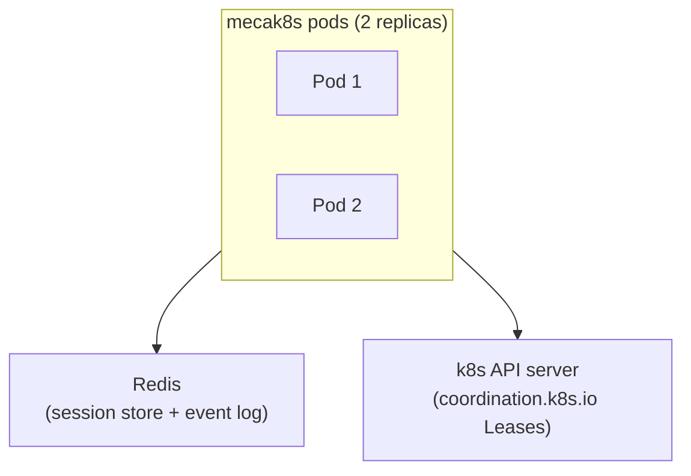
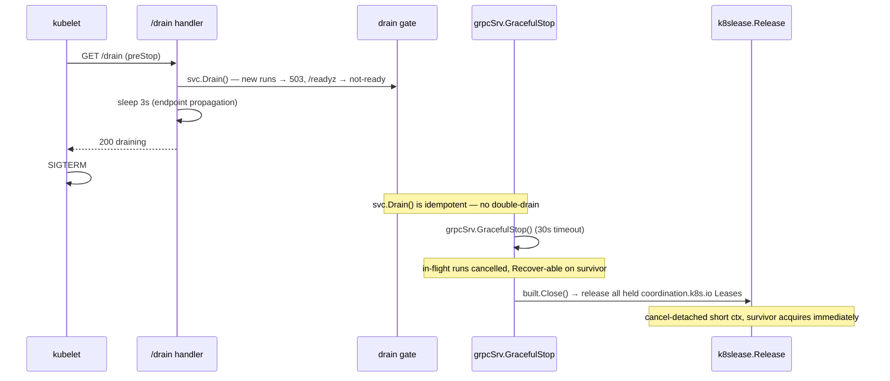

# Cloud-native k8s with mecak8s

`mecak8s` (`cmd/mecak8s`) is a thin composition-root binary that reuses the same `app.Build` assembly as `mecated`, but with Kubernetes-native defaults baked in. The agent pods hold no durable state: session snapshots and the event log live in Redis, and single-writer enforcement per session uses `coordination.k8s.io` Leases backed by the Kubernetes API server.



Kill any pod. The survivor acquires the lease and resumes interrupted sessions from the Redis snapshot. The pod is disposable; the session is not.

## Local ToolHive-free Kind profile

For a disposable Kind-only mecak8s baseline, use `task mecak8s:kind-setup`. It installs the local Helm chart with the explicit `values-kind.yaml` profile, which is the sole profile permitted to use the locally loaded `ko.local` image and plaintext fixture Redis. It does **not** install ToolHive, create vMCP resources, resolve releases, or contact GitHub. Setup recreates the named `mecatl-dev` cluster and its `.scratch/kind/mecatl-dev` state. Status uses only the dedicated kubeconfig/context, never the ambient kubeconfig. See `deploy/mecak8s-vmcp/README.md` for the local workflow.

For global MCP OAuth, use an externally provisioned read-only environment credential and
restart pods after rotation. `mecak8s` never launches a browser; a local mutable credential
root conflicts with the normal storage-free posture. See [MCP client](/building/what-you-get/mcp-client.md).

---

## How mecak8s differs from mecated

`mecak8s` has a deliberately narrower surface than `mecated`. The differences are not runtime configuration — they are compile-time defaults and removed capabilities.

| Dimension | `mecated` | `mecak8s` |
|---|---|---|
| `--headless` default | `false` (interactive) | `true` (headless daemon) |
| `--posture` default | `strict` | `auto` |
| Project-tier ingestion + read-only child shell | granted at `auto`/`yolo` by the interactive ladder | one root-aware trust decision — explicit `--trust-project`, `trustedWorkspaces:`, or remembered trust admits BOTH; without trust, headless auto gives allow-all with neither |
| Bind address default | `127.0.0.1` (loopback) | `0.0.0.0` (pod netns) |
| Workspace authority | Loopback client-selected by default | **Always server-assigned; no mounted root by default** |
| New-session profile | Default filesystem profile unless requested otherwise | **`no-fs`** when the wire profile is omitted or empty (no mounted root); a filesystem session when `--workspace` mounts one |
| Session store | In-memory or JSONL on disk (`--store-dir`); optional `--session-store-url` | **Redis only** (`--redis-url`; no `--store-dir`) |
| Session lease | Optional (`--session-lease-k8s-namespace`) | **On by default** (`--session-lease-k8s-namespace=mecatl`) |
| Prometheus `/metrics` listener | Yes | Opt-in (`--metrics-addr`, loopback only) |
| OTel / admin mux | Yes | Opt-in (`--otlp-*` push; `/metrics` loopback scrape) |
| `perf-mcp` subcommand | Yes | No |
| `skills promote` / `config` subcommands | Yes | No |
| ACP surface | Yes | No |

The `--redis-url` flag exists **only on `cmd/mecak8s`**. `mecated` does not expose it. If you want Redis-backed state with `mecated`, you need `mecak8s`.

The no-FS default is intentional. A standard mecak8s pod is storage-free and
has no authoritative filesystem root, so a client must not send a workspace
path. Empty profile/workspace values request the no-FS session; they never mean
“use the client cwd” or “choose a pod path.”

### Mounted workspace (shared filesystem root)

To give sessions a real filesystem, mount a volume into the pod and point
`--workspace` at it (for example a PVC mounted at `/workspace`). A configured
root turns mecak8s into a **server-assigned filesystem deployment** rooted
there: every session is assigned that single root, the filesystem tools and
Bash operate on it, and — because authority is server-assigned — a client still
cannot select a different root (a non-empty client workspace is rejected with
`InvalidArgument`). The path must be absolute and clean; a relative value is
refused at startup.

This does not change mecak8s's storage-free posture: harness and session state
still live in Redis and the Kubernetes API, and the mounted volume holds only
agent working files. A root shared across the two default replicas needs a
`ReadWriteMany` volume; a `ReadWriteOnce` PVC binds to a single node, so scale
to one replica or use a per-pod volume if your storage class cannot do RWX. The
operator vouches for the mount, so scope it deliberately — see the pod-filesystem
note below.

:::note[MCP OAuth credentials from Kubernetes Secrets]

`mecak8s` wires the operator profile's explicit read-only credential Reader from one
base64 environment value; it installs no browser presenter and no Kubernetes Secret writer.
The selected name must use the `MECATL_` prefix and the strict uppercase
`[A-Z_][A-Z0-9_]{0,127}` grammar — for example,
`MECATL_MCP_OAUTH_CREDENTIAL` — so the credential is removed from every agent-facing
shell environment. A Secret projected as an environment variable is immutable for the running
pod. The Reader warm-restores a valid credential. Persistent rotation requires an external
controller to update the Secret followed by a rolling pod restart, or a future Secret backend
using Kubernetes `resourceVersion` compare-and-swap. In-memory refresh is explicit and
process-local; the default fails before refresh network when no writer exists.

:::

---

## State topology

`mecak8s` maps each `port` interface to a managed service:

| State | Service | Adapter | Port |
|---|---|---|---|
| Session snapshots | Redis | `internal/adapter/redisstore` | `port.SessionStore` |
| Durable event log | Redis | `internal/adapter/redisstore` | `port.EventLog` |
| Session retention / GC | Redis | `internal/adapter/redisstore` | `port.PrunableStore` |
| Single-writer lease | k8s API server | `internal/adapter/k8slease` | `port.SessionLease` |

The `redisstore` adapter reuses `sessnap.Marshal`/`Unmarshal` — the same snapshot format `jsonlstore` and the gRPC driver use (`sessnap-json/1`). It is a transport alternative, not a new format. Event log records use `RPUSH`/`LRANGE` so append order is preserved. The adapter is validated by the same `storeconformance.Run`, `eventlogconformance.Run`, and `storeconformance.RunPrunable` suites that `jsonlstore` passes, tested offline against `miniredis`.

## Production Helm chart

`deploy/helm/mecak8s/` is the production deployment contract. It creates no Redis StatefulSet and will not render until the operator supplies an external Redis endpoint, a credentials Secret reference when a configured key needs reading, and exactly one image selector: a signed release tag or a digest. A real-provider deployment (`mockProvider: false`) also fails closed unless both server TLS and OIDC caller authentication are enabled. TLS protects transport but does not identify callers; OIDC identifies callers but does not encrypt transport. For local-only or trusted-mesh deployments that provide both controls externally, the deliberately conspicuous `security.allowUnsafeRealProvider: true` bypass is available and annotates the pod as unsafe. The chart retains two replicas, a PDB, rolling updates, restricted pod security, bounded resources, dynamic probes, exact namespaced Lease RBAC, and no agent PVC. It ships no general NetworkPolicy — the agent's egress set depends on your provider, MCP, and API-server endpoints, so network isolation belongs to the cluster's own policy layer rather than to a chart that cannot know them. The `oidc.*` values additionally render a narrow raw-driver NetworkPolicy when caller identity is enabled.

```sh
helm upgrade --install mecak8s deploy/helm/mecak8s --namespace mecatl --create-namespace \
  --set image.repository=registry.example/mecak8s \
  --set image.tag=v<release-version> \
  --set redis.endpoint=redis.example.internal:6379 \
  --set redis.credentialsSecret=mecak8s-redis \
  --set tls.enabled=true \
  --set tls.secretName=mecak8s-tls \
  --set oidc.enabled=true \
  --set oidc.issuer=https://idp.example.com \
  --set oidc.audience=mecatl
```

Chart 0.2.0 is a secure-default compatibility break for existing real-provider releases:
add both in-pod controls before upgrading, or explicitly select the unsafe trusted-mesh
bypass. `defaultProvider` and `model` render only when non-empty. Nullable
`maxRunTokens`/`maxTeamTokens` pass no ceiling when unset and accept positive integers
only. Optional `topologySpreadConstraints`, `affinity`, `nodeSelector`, and `tolerations`
map to the pod spec and stay absent by default; hostname spreading is recommended for the
two replicas when multiple nodes are available.

Server cert/key and file-backed Redis CA/ACL Secret rotations are transactional and keep
the last valid generation if projection is partial or validation fails. Keep old and new
CAs together for an overlap period, then remove the old one after leaves have rotated.
The server client-CA trust pool remains static and changing it requires a rolling restart.

The Redis Secret is mounted read-only with `defaultMode: 0440` and projects exactly the configured CA and ACL keys; unrelated Secret keys are not exposed. A password key alone uses Redis's default ACL user, while a username key requires a password key. `caKey` is optional: leaving it empty selects system-trust TLS, so an install against a publicly-rooted managed Redis with no ACL renders `--redis-tls` and no Secret volume at all. `credentialsSecret` is required exactly when some key needs reading. TLS-without-ACL external deployments are valid. The rendered command receives paths only, never Secret values. `values-kind.yaml` is deliberately the only profile that permits `ko.local` and plaintext Redis, and it passes `--redis-allow-plaintext` explicitly. It is not a production configuration.

### Server TLS

Server TLS is independent of Redis TLS. It is off by default and uses an
operator-created, same-namespace `kubernetes.io/tls` Secret:

```sh
kubectl create secret tls mecak8s-tls --namespace mecatl \
  --cert=server.crt --key=server.key

helm upgrade --install mecak8s deploy/helm/mecak8s --namespace mecatl \
  --set image.repository=registry.example/mecatl/mecak8s \
  --set image.tag=v<release-version> \
  --set redis.endpoint=redis.example.internal:6379 \
  --set redis.credentialsSecret=mecak8s-redis \
  --set tls.enabled=true \
  --set tls.secretName=mecak8s-tls
```

The chart creates no Secret. With `tls.enabled=true`, it projects only
`tls.certKey` and `tls.keyKey` from that Secret, read-only with mode `0440`.
They default to the standard `tls.crt` and `tls.key` data keys; set the values
when your Secret uses different PEM key names. The container receives the
fixed mounted paths `/var/run/secrets/tls/<certKey>` and
`/var/run/secrets/tls/<keyKey>` as `--tls-cert` and `--tls-key`, enabling TLS
for both gRPC and HTTP/SSE. The chart also changes health, readiness, and drain
requests to HTTPS. Rotated certificate material requires a rollout/restart
until the in-process reload work in issue #789 is available.

---

## Prerequisites

Before installing the chart you need:

1. **Redis.** A Redis instance reachable from the agent pods — a managed service (ElastiCache, MemoryStore, etc.), since the chart never creates one for a production install. The `--redis-url` flag takes a bare `host:port`, e.g. `redis:6379` — not a `redis://` URL. A managed service also needs verified TLS (see [Secure Redis credentials and TLS](#secure-redis-credentials-and-tls) below). Only the disposable `values-kind.yaml` profile enables an in-chart plaintext Redis fixture with the explicit `--redis-allow-plaintext` opt-in.

2. **Kubernetes RBAC.** The agent's ServiceAccount needs `get`, `create`, `update`, `delete` on `leases` in `coordination.k8s.io` in your target namespace. `templates/rbac.yaml` grants exactly those verbs — never `list` or `watch`.

3. **The `deploy/helm/mecak8s/` chart.** Contains the full topology (see below). Build and push the agent image with `ko`, then install:

   ```sh
   export KO_DOCKER_REPO=registry.example/mecatl
   task ko:publish   # or: KO_DOCKER_REPO=... ko build ./cmd/mecak8s
   helm upgrade --install mecak8s deploy/helm/mecak8s --namespace mecatl --create-namespace \
     --set image.repository=registry.example/mecak8s/mecak8s \
     --set image.tag=v<release-version> \
     --set redis.endpoint=redis.example.internal:6379 \
     --set redis.credentialsSecret=mecak8s-redis \
     --set tls.enabled=true \
     --set tls.secretName=mecak8s-tls \
     --set oidc.enabled=true \
     --set oidc.issuer=https://idp.example.com \
     --set oidc.audience=mecatl
   ```

---

## Server TLS certificate rotation

When `--tls-cert` and `--tls-key` point into a Kubernetes projected Secret,
`mecak8s` watches their parent directories and reloads a complete matching pair
after the projection settles. A malformed or mismatched intermediate generation
is rejected and the last valid certificate continues serving. Existing
connections are unaffected; new TLS handshakes use the replacement without a pod
restart. `--client-ca` is intentionally static and still requires a pod restart
to change the trusted client identities.

## Secure Redis credentials and TLS

Redis credentials reach `mecak8s` as **paths to files** projected from a Kubernetes Secret volume — never as container arguments, environment variables, or ConfigMap entries. Mount the Secret read-only (`defaultMode: 0440` is a good default), then point the flags at the mounted paths:

```text
--redis-url=redis.example.internal:6379                     # bare host:port, never a redis:// URL
--redis-username-file=/var/run/secrets/redis/username       # optional ACL username
--redis-password-file=/var/run/secrets/redis/password       # optional ACL password
--redis-tls-ca=/var/run/secrets/redis/ca.pem                # private CA...
--redis-tls                                                 # ...or verify against the system trust store
```

Every credential requires verified TLS, from one of two sources: the host's system trust store (`--redis-tls`) for a managed Redis whose certificate chains to a public CA, or a mounted PEM CA bundle (`--redis-tls-ca`) for a private one. `--redis-tls-ca` **replaces** the system trust store rather than adding to it. Both modes verify the server certificate against the hostname in `--redis-url` (including IP SAN rules); hostname verification is never disabled and TLS 1.2 or newer is required. TLS with no ACL is valid. ACL is optional: a password without a username uses Redis's default ACL user, while a username requires a password.

`mecak8s` watches the lexical parent directories of every configured Redis CA,
username, and password file, so Kubernetes projected-Secret `..data` swaps are observed.
One coalesced event re-reads the **complete** configured file set. The process builds a fresh
client through the same validation and verified-TLS path, and publishes it only after a
bounded successful PING/TLS/auth probe. Invalid or partially projected material leaves the
last valid client active; bounded single-flight retries cover the window where the Secret
projection and Redis-side ACL/trust update settle in different orders. New operations use
the replacement, while in-flight operations and migration locks finish on their original
client before it closes. No Redis files configured means no reload watcher. Credential
files may end in one newline, as Kubernetes Secret projections commonly do; other
whitespace remains part of the credential.

`--redis-url` takes a bare `host:port`. A `redis://` or `rediss://` URL is rejected on every path, plaintext included, and the rejection never repeats the address back — a URL's userinfo can carry a password, and these errors land in the operator's log.

Client-certificate (mTLS) authentication is **not supported**: the shared `toolhive-core/redis` connection layer cannot express it ([ADR 0233](https://github.com/stacklok/mecatl/blob/main/docs/adr/0233-secure-external-redis.md)), and it is tracked upstream at [toolhive-core#240](https://github.com/stacklok/toolhive-core/issues/240).

:::warning[Plaintext Redis is fixture-only]

An address-only `--redis-url` is plaintext and unauthenticated, and is **rejected at startup** unless you also pass `--redis-allow-plaintext`. That opt-in exists for the disposable `values-kind.yaml` profile only (its in-chart Redis fixture, with the mock provider and no auth). Production installs must not set it: use verified TLS, and add ACL credentials when the managed Redis service requires them.

:::

## The Helm chart's topology

`deploy/helm/mecak8s/templates/` renders the full cloud-native topology for a
production install:

| Template | What it creates |
|---|---|
| `rbac.yaml` | ServiceAccount + Role (lease verbs only) + RoleBinding |
| `deployment.yaml` | Agent Deployment — `replicas: 2`, no PVC, storage-free |
| `service.yaml` | ClusterIP Service exposing gRPC (8080) and HTTP/SSE (8081) |
| `pdb.yaml` | PodDisruptionBudget (`minAvailable: 1`) |
| `raw-driver-networkpolicy.yaml` | Rendered only when `oidc.enabled` — scopes ingress on `app.kubernetes.io/component: raw-driver` pods to the agent pod only |
| `redis-local.yaml` | Rendered only under the disposable `values-kind.yaml` profile (`redis.local.enabled`) — an in-cluster Redis StatefulSet + Service for Kind/offline use, never for production |

The chart intentionally creates no namespace and no general NetworkPolicy: the
namespace is a `helm --create-namespace` (or pre-existing) concern, and network
isolation belongs to the cluster's own policy layer — the agent's egress set
depends on your provider, MCP, and API-server endpoints, which the chart cannot
know.

Key details from `deployment.yaml`:

- `replicas: 2` with `RollingUpdate`, `maxSurge: 1`, `maxUnavailable: 0` — there is always a ready survivor during a rolling update.
- `terminationGracePeriodSeconds: 60` — the bounded `GracefulStop` window.
- No PVC, no `--store-dir`. The only `volumeMount` is `/tmp` for the Go runtime and SSE buffering under `readOnlyRootFilesystem: true`.
- A `preStop` lifecycle hook calls `GET /drain` on the HTTP port. This arms the drain gate and blocks ~3 seconds for endpoint propagation before returning, so the kubelet's SIGTERM arrives after the pod has left the Service endpoints.
- PSS `restricted` in full: `runAsNonRoot`, `allowPrivilegeEscalation: false`, `capabilities: drop: ALL`, `seccompProfile: RuntimeDefault`.

The PDB ensures that voluntary disruptions (node drains, cluster autoscaler) never take both replicas offline simultaneously, keeping at least one pod available to hold leases and serve traffic.

---

## Quick start

```sh
# 1. Build and push the mecak8s image with ko.
export KO_DOCKER_REPO=registry.example/mecatl
ko build --bare --tags=v0.2.0 ./cmd/mecak8s

# 2. Create the API key secret. This example uses --openai; swap the env
#    var name and Secret key if you are using a different provider.
kubectl create secret generic mecak8s-openai \
  --from-literal=OPENAI_API_KEY=<your-key> \
  -n mecatl

# 3. Install the chart against your external Redis.
helm upgrade --install mecak8s deploy/helm/mecak8s --namespace mecatl --create-namespace \
  --set image.repository=registry.example/mecatl/mecak8s \
  --set image.tag=v0.2.0 \
  --set redis.endpoint=redis.example.internal:6379 \
  --set redis.credentialsSecret=mecak8s-redis \
  --set tls.enabled=true \
  --set tls.secretName=mecak8s-tls \
  --set oidc.enabled=true \
  --set oidc.issuer=https://idp.example.com \
  --set oidc.audience=mecatl \
  --set defaultProvider=openai \
  --set model=gpt-5
```

`mockProvider: true` wires `--mock` for the offline Kind fixture. For a real
provider, set `defaultProvider`/`model` as above and project its API key with
`extraEnv[].valueFrom.secretKeyRef`; the key stays in a Secret and never appears in
container arguments. Prefer a values file for this structured `extraEnv` entry rather
than a long `--set` expression. No Deployment patch is required.

`mecak8s-mecak8s` is the chart's default `<release>-<chart>` Deployment name
(the `helm upgrade --install mecak8s` above); pass `--set
fullnameOverride=<name>` at install time to pin a different one.

---

## Readiness and health

mecak8s exposes three endpoints on the HTTP port (default `0.0.0.0:8081`), all mounted **outside** the auth boundary:

| Endpoint | Purpose |
|---|---|
| `GET /healthz` | Liveness — returns 200 unless the process is hung |
| `GET /readyz` | Readiness — returns 200 only when `!draining && redisOK`; flips to 503 on drain or Redis failure |
| `GET /drain` | preStop hook target — arms the drain gate, blocks ~3s for endpoint propagation, returns 200 |

The `readyz` probe is dynamic: it calls `svc.StorageReady`, which pings the Redis store with a 2-second timeout. A Redis failure shows up as not-ready and removes the pod from Service endpoints without a restart.

---

## Graceful shutdown

The shutdown sequence on SIGTERM (or when the kubelet calls `GET /drain` via the `preStop` hook) is:



The `GracefulStop` timeout is 30 seconds, well within the 60-second `terminationGracePeriodSeconds`. If it elapses, the server hard-stops: in-flight runs are cancelled but immediately `Recover`-able on the successor pod from the Redis snapshot (ADR 0027 issue #51 — `Session.Recover` repairs orphaned tool calls and moves the session to idle).

Releasing leases uses a cancel-detached context with a short timeout so the release succeeds even though the signal context is already cancelled. A survivor can acquire the released lease immediately — it does not have to wait for the 30-second TTL (`--session-lease-ttl`, default 30s) to expire.

:::note[In-flight runs are cancelled, not drained]

A multi-minute LLM turn cannot complete within the 60-second termination grace period. The honest contract is: the pod is disposable, the session is not. Any interrupted session is `Recover`-able on the successor from the Redis snapshot and durable event log. All previously approved `allow-always` decisions replay automatically from the event log at the next run entry (`replayApprovals`, ADR 0027 Phase 3b), so the successor does not re-ask for already-approved tool patterns.

:::

---

## Try it: watch a session survive a pod dying

The sequence above is easiest to believe by actually doing it. This assumes the cluster from [Quick start](#quick-start) is already up with two Ready replicas.

Grab both replica names, and port-forward one of them:

```sh
POD_A=$(kubectl get pods -n mecatl -l app.kubernetes.io/component=agent -o jsonpath='{.items[0].metadata.name}')
POD_B=$(kubectl get pods -n mecatl -l app.kubernetes.io/component=agent -o jsonpath='{.items[1].metadata.name}')

kubectl port-forward -n mecatl "pod/$POD_A" 8081:8081 &
```

Create a session and run a prompt through pod A:

```sh
SESSION_ID=$(curl -s -X POST http://127.0.0.1:8081/v1/sessions \
  -d '{"mode":"default"}' | jq -r .session_id)

curl -s -X POST "http://127.0.0.1:8081/v1/sessions/$SESSION_ID/prompt" \
  -H 'Accept: text/event-stream' -d '{"text":"say hello"}' > /dev/null
```

Check who holds the session's lease — every session gets its own, so you may see more than one entry; yours is the one that just appeared:

```sh
kubectl get lease -n mecatl -o wide
```

Now kill pod A gracefully — the way a node drain or a rolling update would, not a hard crash:

```sh
kubectl delete pod -n mecatl "$POD_A"
```

`kubectl get pods -n mecatl --watch` to see its replacement come up. Then port-forward **pod B** — a replica that was already running the whole time, not the replacement — and send the *same* session id through it:

```sh
kubectl port-forward -n mecatl "pod/$POD_B" 8082:8081 &

curl -s -X POST "http://127.0.0.1:8082/v1/sessions/$SESSION_ID/prompt" \
  -H 'Accept: text/event-stream' -d '{"text":"are you still there?"}'
# -> 200, same conversation continues
```

That 200 is the whole point: pod B never touched this session before, yet it picked up the conversation with full context, because the conversation was never pod A's to keep — it was always in Redis. `kubectl get lease -n mecatl -o wide` again to see the `HOLDER` column has moved to pod B.

Try the same thing again, but with a hard kill this time. Pod B is now the session's holder, so force-kill *it* — not pod A, which is already gone — and retry the session via a third replica (any agent pod that isn't pod B; `kubectl get pods -n mecatl -l app.kubernetes.io/component=agent` to find one, port-forward it the same way as above):

```sh
kubectl delete pod -n mecatl "$POD_B" --force --grace-period=0
```

That retry gets a `409` with `"leased by another process"` — not the `200` a graceful kill gave you — and stays that way until the lease's TTL (`--session-lease-ttl`, default 30s) naturally expires, since there was no graceful shutdown this time to release it early. That 409 is the lease actually gating something, not just an artifact of the pod being gone.

For the scripted version of exactly this (plus the case above), see `task e2e:k8s` — it's the same failover behavior, asserted rather than eyeballed.

---

## Multi-user: caller identity and ownership isolation (opt-in)

By default mecak8s has no user concept: one shared deployment, no subjects, and
whoever can reach the API is "the caller". The chart's `oidc.*` values change
that — a real IdP authenticates each request, every session/schedule/team/memory
entry records the verified `(issuer, subject)` that owns it, and **application
access is enforced per caller** (see
[ADR-0212](https://github.com/stacklok/mecatl/blob/main/docs/adr/0212-caller-ownership-enforcement.md)
for the full design).

### Read this before you enable it

**This is an isolation cutover, not merely attribution.** With identity on, a
caller reaches only the sessions, schedules, teams, and memory entries whose
verified `(issuer, subject)` owner matches them:

- a caller cannot prompt, cancel, fork, resume, or delete **another caller's**
  session, schedule, team, or persisted subagent — a foreign attempt is refused
  and looks **identical to that resource not existing at all** (never a
  distinguishing "forbidden" response, so a caller can't even learn something
  exists under someone else's name)
- listing sessions, schedules, teams, and schedule fires is **scoped to the
  caller's own resources** — no more "everyone sees everyone's rows"
- live event streams and durable event-log reads resolve through the same
  owner check, so a caller cannot watch another caller's run in progress
- two callers may use identical logical keys — the same memory key, the same
  schedule name — without collision or cross-talk; each caller's copy is
  independently stored and independently visible

**What enabling `oidc.*` does NOT change:** all sessions still run in the **same
pod filesystem**, so a workspace path is not itself a security boundary — isolate
callers' workspaces yourselves if that matters for your deployment. A raw
gRPC/HTTP driver process (a remote `SessionStore`/`MemoryStore` backend) remains
explicitly **trusted infrastructure**, not caller-enforced (see
[ADR-0213](https://github.com/stacklok/mecatl/blob/main/docs/adr/0213-driver-caller-ownership.md)) —
see the raw-driver NetworkPolicy below. And a session/schedule created **before**
you turned identity on has no owner: once enforcement is on, every ownerless
record becomes permanently unavailable to every caller (never adopted by the
first reader) — there is no migration path, so back up or export anything you
need from an ownerless deployment before flipping this on.

### Before admitting callers: inventory ownerless records

Stage the OIDC deployment with tenant traffic blocked and configure one exact
`storage_management.principals` issuer/subject pair for the operator. Call the authenticated
`GetStorageHealth` RPC (or `GET /v1/storage/health`) as that principal and inspect the
`ownerless_session_count` / `ownerless_session_ids` and
`ownerless_schedule_count` / `ownerless_schedule_names` fields. The identifiers are bounded
samples (the corresponding `*_truncated` bit says when the count is larger); no transcript,
memory value, or schedule prompt is returned. If either `*_available` field is false, do not
proceed until that backend exposes the required metadata inventory.

After ownership is enabled, retention and scheduler workers skip ownerless records before a
lease, claim, enqueue, or mutation. Authenticated callers see those records as absent. Turning
enforcement back off restores only the historical ownerless access path: it does not assign an
owner, replay skipped work, or adopt a record for the first caller.

### Validator and bounded signing-key cache

The production OIDC/JWT validator is a delegated, actively-maintained library —
mecatl never hand-rolls token verification. A bad OIDC
configuration, including an unreachable initial key fetch, fails closed at startup
rather than serving unauthenticated traffic. After a successful fetch, the last
good JWKS can cover a short IdP outage. The chart's default `oidc.maxJWKSStaleness`
sets `--oidc-max-jwks-staleness=1h`: once keys are older than that, the validator
refreshes before deciding and returns **503 Service Unavailable** when it cannot
obtain current keys. A bad, expired, wrong-issuer, or wrong-audience token remains
**401**. Set the flag to `0` only to deliberately accept unbounded cached-key
availability and its signing-key revocation exposure.

This bounds **signing-key** revocation exposure during an IdP outage; it does not
provide per-token revocation before normal token expiry. The JWKS cache is
process-local and unpersisted, so a restarted pod fetches current keys again.

### Turning it on

Set the opt-in `oidc.*` chart values, which append four flags to the agent:

```sh
helm upgrade --install mecak8s deploy/helm/mecak8s --namespace mecatl --create-namespace \
  --set image.repository=registry.example/mecatl/mecak8s \
  --set image.tag=v<release-version> \
  --set redis.endpoint=redis.example.internal:6379 \
  --set redis.credentialsSecret=mecak8s-redis \
  --set oidc.enabled=true \
  --set oidc.issuer=https://idp.example.com/realms/mecatl \
  --set oidc.audience=mecatl
```

| Value | Flag | Meaning |
|---|---|---|
| `oidc.issuer` | `--oidc-issuer` | your IdP's issuer URL, compared **byte-exact** against the token's `iss` |
| `oidc.audience` | `--oidc-audience` | the audience this deployment accepts. **Required** — an audience-less verifier accepts tokens minted for a different service |
| `oidc.jwksURI` | `--oidc-jwks-uri` | *optional.* Pin the signing-key endpoint and skip discovery. Only for an air-gapped or pinned-key deployment; leave it out and the issuer's discovery document is used |
| `oidc.maxJWKSStaleness` (default `1h`) | `--oidc-max-jwks-staleness` | Maximum time a last-good JWKS remains trusted when refresh cannot reach the IdP. `0` deliberately disables the bound. |

Point it at a **real IdP over HTTPS**. That is the only configuration that works
with the validator's defaults intact: it refuses an `http://` issuer, and refuses
a `jwks_uri` that resolves to a private, loopback or link-local address — the
check that stops a `jwks_uri` aimed at cloud instance metadata
(`169.254.169.254`). An **in-cluster** IdP needs a flag that relaxes both, which
exists for our end-to-end tests only (applied there via a runtime `kubectl
patch`, never through this chart) and is deliberately absent from
`deploy/helm/mecak8s/`.

Setting `oidc.enabled=true` also renders a `raw-driver` NetworkPolicy, scoping
ingress to any pod labelled `app.kubernetes.io/component: raw-driver` to the
mecak8s agent pod only. This exists because a raw gRPC/HTTP driver (a remote
`SessionStore`/`MemoryStore` backend) is trusted infrastructure, not
caller-enforced, until ADR-0213 lands — if you run one, give it that label and
keep it off any Service, Ingress, or tenant-facing NetworkPolicy. A tenant
workload must reach mecak8s through the authenticated public Service, never a
raw driver endpoint directly.

The chart ships no general NetworkPolicy at all (see [The Helm chart's
topology](#the-helm-charts-topology) above), so enabling caller identity
against an external or in-cluster IdP needs no egress rule added on your
side — network isolation, if you want it, is entirely your cluster's own
policy layer's job.

### Use it from the TUI

`mecatui` is an external gRPC client. Obtain a token using your normal IdP
login flow, then use `mecatui connect` and provide the token with
`--auth-token` (or `MECATL_AUTH_TOKEN`). The TUI sends it as bearer metadata on
every RPC; it does not obtain or refresh OIDC tokens for you.

For a development port-forward, bearer traffic stays on loopback:

```sh
kubectl port-forward -n mecatl service/mecak8s-agent 8080:8080 &
export MECATL_AUTH_TOKEN="$(your-oidc-cli print-access-token)"
bin/mecatui connect 127.0.0.1:8080 --auth-token "$MECATL_AUTH_TOKEN"
```

To prove that the token is actually required, remove the environment fallback and
submit a prompt in a separate TUI session:

```sh
env -u MECATL_AUTH_TOKEN \
  bin/mecatui connect 127.0.0.1:8080
```

A gRPC dial can succeed before credentials are checked; the unauthenticated
session's first request must fail before it produces a model response. If it
replies, treat that as an authentication bypass.

`--workspace` identifies a directory on the **agent pod**, not the machine
running the TUI. Use a path that exists in the pod; `/tmp` is appropriate for
this connectivity check, but is not a shared developer checkout. For a remote
endpoint, use TLS (`--tls`, and `--tls-ca` for a private CA): the TUI rejects a
bearer on a non-loopback cleartext connection.

After creating a session in the TUI, verify the saved owner through the HTTP
API (port-forward `8081:8081` as well if needed):

```sh
curl -s http://127.0.0.1:8081/v1/sessions \
  -H "Authorization: Bearer $MECATL_AUTH_TOKEN"
```

The returned session row contains the verified `owner`. This is a practical
end-user path through the same gRPC authentication edge that the TUI uses; the
kind e2e suite additionally exercises it against a real in-cluster Dex.

### Seeing who owns what

`GET /v1/sessions` carries the owner, so `curl` is enough:

```json
{ "session_id": "9bfb79d9…",
  "state": "completed",
  "owner": { "issuer": "https://idp.example.com",
             "subject": "CglhbGljZS11aWQSBWxvY2Fs",
             "grant_type": "user",
             "name": "alice" } }
```

`(issuer, subject)` is the durable identity. `subject` is whatever your IdP uses
— often an opaque id rather than a username — and `name` is a **cosmetic snapshot
of the token's `name` claim**, which your IdP may change later. Match on
`(issuer, subject)`, display `name`.

An owner is written **once**, at session creation, from the verified token and
never from the request body. Children (subagents, parallel branches, team members,
scheduled fires) inherit their parent's owner; a fork inherits the **source's**
owner (and refuses if the caller doesn't own that source). Nothing backfills:
sessions created before you enabled identity stay ownerless — and once
enforcement is on, an ownerless session is unavailable to every caller, not
merely unattributed.

### Who *did* something, versus who owns it

These are different questions, and internal system work is the routine case
where the answers differ: a schedule fires under the **scheduler's own explicit
system identity** as actor, while the created run keeps the schedule's real
owner. Ownership answers "whose is this"; actor answers "who (or what) acted on
it" — a system principal never substitutes for, or launders into, the resource
owner.

That per-event actor is written only to the **durable event log** — it is not on
any API response, gRPC or HTTP. Today the only way to read it is out of the store
directly, e.g. `redis-cli LRANGE mecatl:events:<session-id> 0 -1`, where each
record is `{"v":"redisstore-eventlog/1","ev":{…,"Actor":{…}}}`. If "who did what"
needs to be queryable for you, say so — it is a known gap, not a design intent.

### Troubleshooting: start here

Two IdP misconfigurations account for most first-deployment 401s, and neither
produces a helpful error:

1. **The audience is not in the token.** Keycloak, for example, puts only
   `account` in `aud` by default; your client id appears only if you attach an
   Audience protocol mapper. Then `--oidc-audience=<your-client-id>` never
   matches and **every** caller gets 401. Decode a token and check `aud` before
   anything else.
2. **The issuer string does not match.** `iss` is compared byte-exact, and an IdP
   stamps whatever external hostname it is configured to advertise — regardless of
   how your pods reach it. Take `--oidc-issuer` from the IdP's
   `/.well-known/openid-configuration`, never from the in-cluster Service URL.

Beyond that: a **401** means the credential was rejected; a **503** means a
required JWKS refresh could not obtain current keys after the configured
staleness bound. Before that bound, a last-good JWKS can keep validation available
during a short IdP outage. Authn failures are **not currently logged**, so neither
is visible in the agent's output — you will see the status code and nothing else.

### What this does not give you

Stated plainly so it is not inferred:

| | |
|---|---|
| **Filesystem isolation** | None. All sessions run in the same pod filesystem at the same workspace path — application-level ownership enforcement does not sandbox the workspace. |
| **Raw driver enforcement** | None yet. A remote `SessionStore`/`MemoryStore` driver process is trusted infrastructure, not caller-enforced: it takes the owner identity from its own wire without verifying it. The raw-driver NetworkPolicy above restricts which **workloads** can reach it, which is a real but partial control — it depends on a policy-enforcing CNI, and it does nothing about a caller who arrives at mecated with a token. Do not treat it as a tenant boundary. Caller enforcement is tracked by issue #452 / ADR-0213. |
| **Historical data migration** | None. Enabling identity makes every pre-existing ownerless session/schedule/team/memory entry permanently unavailable to every caller — there is no adoption-by-first-reader and no migration path. Export or back up anything you need first. |
| **Signing-key revocation** | Bounded, not immediate: with the default `--oidc-max-jwks-staleness=1h`, a last-good JWKS may remain trusted for up to one hour during an IdP outage; then validation fails 503 until refresh succeeds. `0` deliberately restores unbounded exposure. This is **not per-token revocation**: an otherwise valid token remains accepted until expiry. |
| **Rate limiting / quotas** | mecak8s registers no rate-limit flags at all; a pod is assumed to sit behind a Service or mesh. One caller can exhaust the shared Redis, lease namespace and provider budget. |
| **Store confidentiality** | Verified TLS and ACL credentials are available (`--redis-tls` / `--redis-tls-ca`, `--redis-password-file`), and any credential *requires* TLS. Without them — the `--redis-allow-plaintext` fixture path — conversations and owner labels sit in plaintext, protected only by the NetworkPolicy. Client-certificate (mTLS) authentication is not supported. |
| **PII controls** | `name` (often an email) is copied onto every durable event, the session snapshot and schedule records, unredacted, with no retention or erasure hook. |
| **Audit signals** | Telemetry is opt-in and off by default (`--metrics-addr` to expose `/metrics`, `--otlp-*` to push to a collector), and **no authn metric exists at all** — the emitted set covers runs, events, permission asks and process stats, not authentication outcomes. Combined with failures not being logged, an authn problem is invisible: you see the caller's status code and nothing on the server side. |
| **Machine-vs-human grant** | `grant_type` is best-effort and IdP-dependent. A token with no grant hint resolves to `user`, which includes most IdPs' service accounts. |

## Scaling

Add replicas freely. The `coordination.k8s.io` Lease backend enforces single-writer per session: when two pods both try to start a run on the same session, the second gets `ErrSessionLeasedElsewhere` (HTTP 409 / gRPC `FAILED_PRECONDITION`). The acquiring pod renews its lease on a background goroutine; the interval defaults to `--session-lease-ttl / 3`.

No session affinity is required on the Service. The lease is the exclusion mechanism — not routing. A client can connect to any replica; if that replica does not hold the lease, the call fails with 409 and the client retries against another replica (or waits for the in-flight run to finish).

The PodDisruptionBudget (`minAvailable: 1`) prevents voluntary disruptions from taking all replicas offline simultaneously.

For production load, note that Redis is a single point of failure in the default in-cluster setup (1 replica, no persistence). For high availability, use Redis Sentinel, Redis Cluster, or a managed service (ElastiCache, MemoryStore). The adapter talks to Redis generically — swapping the backing service is a manifest change; no adapter code changes.

---

## What you give up vs mecated

`mecak8s` trades operator surface for operational simplicity:

The experimental local `auth.yaml` path for ChatGPT Codex subscription provider
`openai-codex` is intentionally **not supported** by `mecak8s`. This rejection is
limited to `providers.openai-codex.oauth`: existing `auth.yaml` API-key entries
remain supported. Use an API-key provider today; a future Codex deployment needs
a separate Kubernetes Secret or external-secret design. Do not mount a local
Codex OAuth entry and assume the binary will accept it. See [ADR
0104](https://github.com/stacklok/mecatl/blob/main/docs/adr/0215-openai-subscription-manual-token.md).

| Capability | mecated | mecak8s |
|---|---|---|
| Interactive TUI clients | Yes (`mecatui` connects; `--headless=false` default) | No (`--headless=true` default; headless-only) |
| Prometheus `/metrics` listener | Yes (`--metrics-addr`) | Opt-in (`--metrics-addr`, loopback only — [ADR 0098](https://github.com/stacklok/mecatl/blob/main/docs/adr/0098-headless-telemetry.md)) |
| OTel traces and runtime admin mux | Yes | Opt-in (`--otlp-*` push + the `/metrics` loopback admin mux — [ADR 0098](https://github.com/stacklok/mecatl/blob/main/docs/adr/0098-headless-telemetry.md)) |
| `perf-mcp` diagnostics subcommand | Yes | No |
| `skills promote` / `config` subcommands | Yes | No |
| JSONL on-disk session store | Yes (`--store-dir`) | No — Redis only |
| Single-replica without external state | Yes (in-memory or JSONL) | No — Redis is required |

If you need the `perf-mcp` diagnostics subcommand, the `skills promote` / `config` subcommands, or an interactive TUI client, run `mecated` instead. `mecak8s` now offers OPT-IN telemetry (`--metrics-addr` loopback scrape + `--otlp-*` push, see [ADR 0098](https://github.com/stacklok/mecatl/blob/main/docs/adr/0098-headless-telemetry.md) and the [`mecak8s` flag reference](https://github.com/stacklok/mecatl/blob/main/docs/usage/mecak8s.md)); for multi-replica deployments with `mecated` and Redis-backed state you would need to wire `--redis-url` — but that flag does not exist on `mecated`. `mecak8s` is the only binary that exposes it.

---

## What's next

- [Pick your deployment shape](/building/getting-started/deployment-decision.md) — decision tree comparing all four shapes.
- [Run mecated standalone](/building/deployment/mecated.md) — the interactive, single-server alternative with a full operator surface.
- [Embed the engine directly](/building/deployment/embed-engine.md) — bring your own composition if you need to run the loop inside an existing service.
- [Single-shot CI with mecatequi](/building/deployment/mecatequi.md) — the stateless, one-prompt-per-run shape for GitHub Actions.
