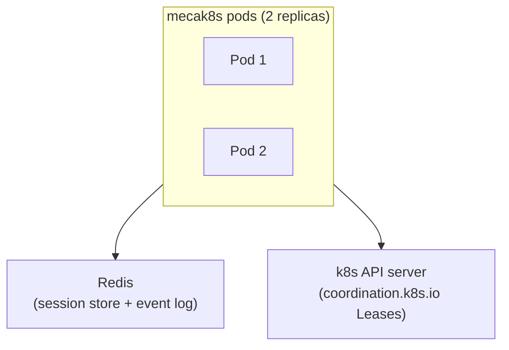
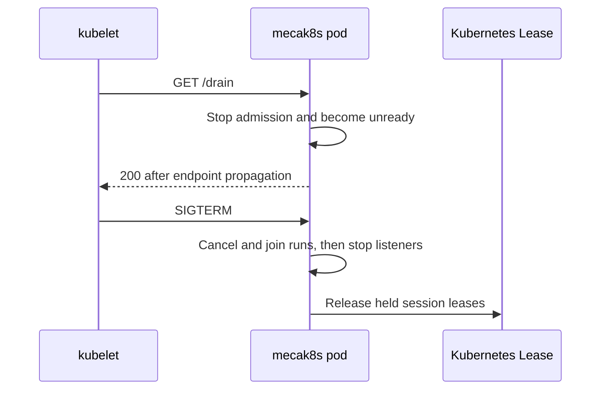

# Cloud-native k8s with mecak8s

`mecak8s` runs Mecatl with Kubernetes-native defaults. The chart uses two
replicas by default for availability; you can use one replica to reduce resource
usage and simplify session routing. Agent pods hold no durable state: session
snapshots and the event log live in Redis, while Kubernetes Leases enforce a
single writer for each session.



If a pod stops, a surviving pod can acquire its leases and resume interrupted
sessions from Redis. The pod is disposable; the session is not.

## Try mecak8s locally

The repository includes a disposable local Kind environment with Redis and two
`mecak8s` replicas. Follow
[Try Mecatl on Kubernetes](/building/getting-started/kubernetes.md) to create
the cluster and connect with `mecatui`.

For the optional Keycloak qualification flow and implementation details, see the
[local Kind README](https://github.com/stacklok/mecatl/blob/main/deploy/mecak8s-kind/README.md).

## Before you deploy

You need:

- A Kubernetes cluster, Helm, and `kubectl`. The cluster must be able to pull
  public images from `ghcr.io`.
- A Redis endpoint reachable from the agent pods. Production deployments use
  verified TLS and can read ACL credentials from a Kubernetes Secret.
- An OIDC issuer and audience for caller authentication.
- A TLS certificate and key for the `mecak8s` Service, unless an
  operator-controlled gateway terminates TLS.
- Credentials for an LLM provider.

The chart creates the ServiceAccount and namespace-scoped permissions for
Kubernetes Leases. It does not create production Redis, TLS Secrets, provider
Secrets, gateways, or general NetworkPolicies.

## Quick start

The following example stores credentials in Kubernetes Secrets and installs the
published chart with two replicas. Choose a version from
[GitHub releases](https://github.com/stacklok/mecatl/releases), then substitute
its number without the leading `v` for `<VERSION>`. Replace the example
endpoints and filenames with values for your environment.

1. Create the namespace and Secrets. Set `OPENAI_API_KEY` in your current shell
   first. Redis and TLS values are read from files instead of being placed in
   Helm values:

   ```sh
   : "${OPENAI_API_KEY:?set OPENAI_API_KEY first}"
   kubectl create namespace mecatl
   kubectl create secret generic mecak8s-openai --namespace mecatl \
     --from-literal=OPENAI_API_KEY="$OPENAI_API_KEY"
   kubectl create secret generic mecak8s-redis --namespace mecatl \
     --from-file=password=./redis-password \
     --from-file=ca.pem=./redis-ca.pem
   kubectl create secret tls mecak8s-tls --namespace mecatl \
     --cert=./server.crt --key=./server.key
   ```

1. Save the deployment values as `mecak8s-values.yaml`:

   ```yaml
   redis:
     endpoint: redis.example.internal:6379
     credentialsSecret: mecak8s-redis
     passwordKey: password
     caKey: ca.pem

   tls:
     enabled: true
     secretName: mecak8s-tls

   oidc:
     enabled: true
     issuer: https://idp.example.com
     audience: mecatl

   defaultProvider: openai
   model: gpt-5
   extraEnv:
     - name: OPENAI_API_KEY
       valueFrom:
         secretKeyRef:
           name: mecak8s-openai
           key: OPENAI_API_KEY
   ```

1. Install the chart and wait for both replicas:

   ```sh
   helm upgrade --install mecak8s \
     oci://ghcr.io/stacklok/mecatl/charts/mecak8s \
     --version <VERSION> \
     --namespace mecatl \
     --values mecak8s-values.yaml
   kubectl rollout status deployment/mecak8s-mecak8s --namespace mecatl
   ```

The default Deployment name is `<RELEASE>-mecak8s`. Set `fullnameOverride` in
the values file if you need a fixed name.

## Deployment defaults

`mecak8s` starts with unattended, Kubernetes-oriented defaults:

|Setting|Default|
|-|-|
|Replicas|Two|
|Posture|Headless with `auto` permissions|
|Session state|Redis|
|Session ownership|Kubernetes Leases|
|Filesystem|No filesystem access|
|Network binds|Pod network on `0.0.0.0`|
|Metrics and OpenTelemetry|Opt-in|

Project-provided instructions, skills, agents, and read-only child Shell access
still require explicit project trust. `mecak8s` does not include ACP, local
JSONL storage, or the `mecated` operator subcommands.

## Choose filesystem access

`mecak8s` uses the same server-owned placement contract as `mecated`. Clients do
not send workspace paths or private environment references. By default, new
sessions have no filesystem access. Schedules retain that placement, and
delegation cannot add filesystem access that the parent lacks.

See [Execution environments](/features/execution-environments.md) for the
shared placement, no-FS, child-environment, and reattachment model.

### Experimental Kubernetes execution provider

The repository contains a draft, experimental execution provider for an
operator-controlled Kubernetes cluster. It runs as a separate service and
controller with its own `mecatl-execution` chart. `mecak8s` remains a client: it
has no Pod, PVC, custom-resource, or controller management permissions.

This production candidate provides run-wide ownership, transactional references,
controlled replacement and retirement, durable grant revocation, and reloadable
TLS and signing material. Its default-deny network policy still requires an
enforcing CNI; Kind's default kindnet is not isolation evidence. A configured
RuntimeClass is an operator input, not by itself a hostile-workload guarantee.

Before you install it, prepare these values through your trusted image and
Secret delivery system:

- A digest-pinned provider image.
- A digest-pinned workload image that contains `/mecatl-executor`, `/bin/sh`,
  and the toolchain needed by foreground commands.
- One projected security Secret containing the provider certificate/key, client
  CA bundle, and versioned Ed25519 grant keys. The chart never generates them.
- A versioned `provider.securityManifest` as documented in
  [Execution environments](/features/execution-environments.md#production-security-material).
- A `mecak8s` client mTLS Secret containing `ca.crt`, `tls.crt`, and `tls.key`.
- Explicit provider-client pod/namespace selectors, API-server CIDRs, and DNS
  resolver CIDRs. Do not use `0.0.0.0/0`.

The following profile shows every required chart key. Save it as
`execution-values.yaml` and replace each placeholder:

```yaml
provider:
  image: <PROVIDER_IMAGE>@sha256:<PROVIDER_DIGEST>
  imagePullPolicy: IfNotPresent
  replicas: 2
  securitySecretName: <PROJECTED_SECURITY_SECRET>
  securityManifest: '<STRICT_JSON_MANIFEST>'
  clientIngressSelectors:
    - namespaceLabels: {kubernetes.io/metadata.name: <CLIENT_NAMESPACE>}
      podLabels: {app.kubernetes.io/name: mecak8s}
  apiServerCIDRs: [<API_SERVER_IP>/32]
  dnsCIDRs: [<CLUSTER_DNS_IP>/32]

service:
  port: 8443

profiles:
  coding:
    image: <WORKLOAD_IMAGE>@sha256:<WORKLOAD_DIGEST>
    storageClass: <STORAGE_CLASS>
    storageSize: 2Gi
    cpuRequest: 100m
    memoryRequest: 128Mi
    cpuLimit: "1"
    memoryLimit: 1Gi
    ephemeralStorageRequest: 64Mi
    ephemeralStorageLimit: 1Gi
    tmpSizeLimit: 256Mi
    runtimeClassName: <RUNTIME_CLASS>
    maxFileBytes: 5242880
    maxCommandBytes: 1048576
    maxCommandDuration: 5m
    maxEnvironments: 100

networkPolicy:
  enabled: true
  dnsPorts: [53]
  apiServerPorts: [443]
  workloadProfiles: {} # default deny; add explicit coding egress only if required

resourceGovernance:
  enabled: true
  pods: "200"
  persistentVolumeClaims: "100"
  executionEnvironments: "100"
  requestsCPU: "20"
  requestsMemory: 40Gi
  requestsStorage: 500Gi
  limitsCPU: "40"
  limitsMemory: 80Gi
```

Install the provider chart separately from `mecak8s`:

```sh
helm upgrade --install mecatl-execution ./deploy/helm/mecatl-execution \
  --namespace <NAMESPACE> \
  --values execution-values.yaml
kubectl rollout status deployment/mecatl-execution --namespace <NAMESPACE>
```

Add the following block to the existing `mecak8s` values. The endpoint is a
`host:port` gRPC target (no URL scheme) and must use the provider certificate's
DNS identity. The private `mecatl.execution.v1.ExecutionProviderService` uses
protocol `execution-grpc/1` with mandatory mTLS. Keep OIDC caller authentication enabled;
the remote binding is scoped to the verified issuer and subject.

```yaml
execution:
  enabled: true
  endpoint: mecatl-execution.<NAMESPACE>.svc:8443
  profile: coding
  tlsSecret: <MECAK8S_EXECUTION_MTLS_SECRET>
  caKey: ca.crt
  certKey: tls.crt
  keyKey: tls.key
```

An enabled client conflicts with `workspace`, `redis.filesystem.enabled`,
Parallel, and Team. Remote sessions receive the filesystem tools and foreground
Shell, but do not ingest project instructions, rules, skills, or source from the
remote PVC. Schedules, SkillDraft, background Shell, and delegated filesystem
execution are outside this draft.

The provider retains one PVC per logical environment. Session deletion and chart
uninstall do not delete committed workspace data. Retirement requires no live
references and a terminal executor; even then, this candidate retains the PVC.
A missing executor or lost terminal receipt moves the environment to
`FenceUnknown` and requires external operator fencing. There is no automated
recovery from that state.

Foreground command cancellation is cooperative and bounded. The helper attempts
to terminate the command process group and reports a terminal receipt. If it
cannot prove termination, the environment is fenced instead of admitting more
work. There is no detached command status or cancellation API in this draft.

The focused qualification task is `task e2e:k8s:execution`. It requires a generic
local Go, `ko`, Podman, Kind, Helm, and `kubectl` toolchain. Optional toolbox use
requires explicit `MECATL_EXECUTION_DEV_TOOLBOX` and
`MECATL_EXECUTION_K8S_TOOLBOX` values. The task uses a synthetic OIDC issuer and
the mock model provider, creates a unique state directory and Kind cluster, and
retains both for inspection. It performs no cleanup. Kind's default kindnet does
not enforce NetworkPolicy, so this flow provides no NetworkPolicy isolation
evidence.

When `execution.enabled` is `false`, the `mecak8s` chart mounts no execution mTLS
Secret and passes no execution-provider flags. The separate provider chart and
any environments it owns continue independently.

The no-FS default is intentional. A standard mecak8s pod is storage-free and has
no authoritative filesystem root, so the server binds omitted/default profile to
its configured no-FS placement. Clients never send a workspace path; explicit
`profile:"no-fs"` attenuates to the same filesystem-free surface.

### Mounted workspace (shared filesystem root)

To give sessions a real filesystem, mount a volume into the pod and point
`--workspace` at it (for example a PVC mounted at `/workspace`). A configured
root turns mecak8s into a **server-assigned filesystem deployment** rooted
there: every session is assigned that single root, the filesystem tools and
Shell operate on it, and clients have no field with which to select another
root. The path must be absolute and clean; a relative value is refused at
startup.

This does not change mecak8s's storage-free posture: harness and session state
still live in Redis and the Kubernetes API, and the mounted volume holds only
agent working files. A root shared across the two default replicas needs a
`ReadWriteMany` volume; a `ReadWriteOnce` PVC binds to a single node, so scale
to one replica or use a per-pod volume if your storage class cannot do RWX. The
operator vouches for the mount, so scope it deliberately. Caller identity does
not isolate one caller's files from another caller using the same mount.

### Redis virtual workspace

Set `redis.filesystem.enabled=true` (or pass `--redis-filesystem`) to provide
persistent Read/ListDir/Edit/Write/Copy/Move/Remove/Grep/Glob files without
mounting a volume. Files are partitioned by the session owner's exact OIDC
issuer/subject pair; same-owner sessions share a namespace, while ownerless
sessions share a reserved anonymous namespace. The persisted placement is
revalidated on every run. Redis failures, missing namespace markers, and corrupt
records fail closed rather than appearing as an empty filesystem.

This mode is deliberately file-lite: it has no Shell, executable-file semantics,
git worktrees, or filesystem branch/merge workflow. It is mutually exclusive
with `workspace`. Set `redis.readLedger.enabled=true` independently to persist
each session's read-before-write evidence; deleting a session deletes that
ledger but not the principal's shared files. mecak8s sets no TTL on either
representation. Redis durability, backups, capacity and eviction policy remain
operator concerns.

---

## State topology

`mecak8s` keeps session data in Redis and session ownership in the Kubernetes
API:

|State|Service|
|-|-|
|Session snapshots, retention, and cleanup|Redis|
|Durable event log and resume cursors|Redis Streams|
|Single-writer session lease|Kubernetes `coordination.k8s.io` Lease|

### Inspect the event log

The durable event log at `mecatl:events:<SESSION_ID>` is a Redis Stream. Read it
with:

```sh
redis-cli XRANGE "mecatl:events:<SESSION_ID>" - +
```

Each entry's `r` field contains the event envelope, including its `Actor`
metadata. Mecatl migrates a legacy event-log LIST to a Stream on the next
append, after which `LRANGE` returns `WRONGTYPE`. Do not modify the sibling
cursor key, `mecatl:events-gen:<SESSION_ID>`, independently of the event log.

### Size durable event followers

Each `mecak8s` process uses a dedicated Redis client for blocking durable-event
followers. This keeps session saves, event appends, and metadata operations on
the durability client when watches are idle.

|CLI flag|Helm value|Default|
|-|-|-|
|`--redis-follow-pool-size`|`redis.follow.poolSize`|`32`|
|`--redis-max-followers`|`redis.follow.maxFollowers`|`32`|

Both values must be positive integers, and the maximum follower count must not
exceed the follow pool size. `mecak8s` and the Helm chart reject invalid values
at startup or render time.

Keep the defaults unless one pod must serve more than 32 concurrent durable
watches. Size the follower limit for the expected per-pod watch concurrency,
then give the pool at least that many connections. Include every replica and
briefly overlapping credential generations in the Redis connection budget.

When the process has admitted the maximum number of followers, a new watch
ends with `watch_capacity`. gRPC reports `RESOURCE_EXHAUSTED`; HTTP retains its
status 200 event stream and sends a terminal `event: error` frame. The
TypeScript SDK reconnects from the last processed cursor with the same filter.
This code is separate from `watch_lagging`, which means a client did not consume
the server's bounded delivery buffer quickly enough.

## Production Helm chart

The production chart is published at
`oci://ghcr.io/stacklok/mecatl/charts/mecak8s`; its source is in
`deploy/helm/mecak8s/`. It requires an external Redis endpoint and creates no
Redis StatefulSet. Reference a Kubernetes Secret for Redis credentials. The
chart's default image tag matches its application and chart versions, so it
pulls the corresponding signed `ghcr.io/stacklok/mecatl/mecak8s` release. Set
`image.digest` to pin an immutable image. It accepts a canonical lowercase
SHA-256 digest: `sha256:` followed by 64 lowercase hexadecimal characters. Set
only one of `image.tag` and `image.digest`, or clear the tag to use
`v<chart-version>`.

A real-provider deployment (`mockProvider: false`) must choose one of these
security postures:

|Posture|Configuration|
|-|-|
|TLS in the pod|Enable `tls` and OIDC.|
|TLS at an operator-owned edge|Set `security.tlsTerminatedUpstream=true`, enable OIDC, and optionally keep in-pod TLS for re-encryption.|
|Unsafe bypass|Select the explicit bypass, which annotates the pod as unsafe.|

The chart reserves its security-posture annotations; `podAnnotations` cannot
override them.

### Installation telemetry identity

The chart stores a non-secret installation UUID in a ConfigMap. Live Helm
upgrades preserve an automatically generated ID with `lookup`, but uninstalling
the release removes it. Set a canonical lowercase UUID explicitly for GitOps or
to preserve the ID across reinstall:

```yaml
telemetry:
  installationID: 123e4567-e89b-12d3-a456-426614174000
```

Changing the value rolls the Deployment, and OpenTelemetry exports it as the
`mecatl.installation.id` resource attribute. To rotate an automatically
generated ID, make the new UUID explicit during an upgrade:

```sh
NEW_ID="$(uuidgen | tr '[:upper:]' '[:lower:]')"
helm upgrade <RELEASE> oci://ghcr.io/stacklok/mecatl/charts/mecak8s \
  --version <VERSION> --namespace <NAMESPACE> --reuse-values \
  --set-string telemetry.installationID="$NEW_ID"
```

### Use workload identity for an LLM gateway

Edge-terminated h2c sends the caller's bearer token across the pod network in
cleartext. Restrict the Service to gateway pods with NetworkPolicy or an mTLS
mesh. The chart does not verify the gateway or provide a general NetworkPolicy.

The gateway must forward the original bearer token and expose only the gRPC
route. Do not publish `/drain`, `/healthz`, or `/readyz`. The chart creates no
Gateway, Route, Certificate, or `BackendTLSPolicy`; configure those resources or
retain in-pod TLS for re-encryption. Move an existing in-pod TLS release to h2c
through a blue-green or maintenance cutover.

For an OpenAI-compatible gateway that trusts Kubernetes workload identity, use
the chart's existing `extraArgs`, `extraVolumes`, and `extraVolumeMounts` to
project a ServiceAccount token and pass an explicit gateway base URL with the
bearer file:

```yaml
extraArgs:
  - --openai-base-url=https://llm-gateway.example.com/v1
  - --openai-bearer-token-file=/var/run/secrets/llm-gateway/token
extraVolumes:
  - name: llm-gateway-token
    projected:
      sources:
        - serviceAccountToken:
            path: token
            audience: api://mecak8s-llm-gateway
            expirationSeconds: 600
extraVolumeMounts:
  - name: llm-gateway-token
    mountPath: /var/run/secrets/llm-gateway
    readOnly: true
```

`mecak8s` reads the file before every OpenAI request, so token rotation is
automatic. Bearer-file mode requires an explicit, nonempty `--openai-base-url`
and never defaults to `api.openai.com`. The base URL must use HTTPS unless it
targets loopback development, and redirects are refused.
`--openai-bearer-token-file` is mutually exclusive with `OPENAI_API_KEY`.

Choose the gateway's exact audience instead of the default Kubernetes API
audience. Configure the gateway to trust the cluster issuer, that audience, and
the exact `system:serviceaccount:<namespace>:<serviceaccount>` subject.

### Session affinity is an infrastructure contract

Official clients send `X-Mecatl-Session-ID` on session-bound gRPC and HTTP
requests when the ID is printable ASCII without surrounding spaces. Duplicate,
malformed, and mismatched values are rejected. Existing clients may omit it.

The field is a routing and provider-correlation hint. It grants no
authentication, authorization, ownership, fencing, idempotency, or cache
authority.

Use the header for consistent routing, but keep the Kubernetes session lease as
the ownership authority. Lease loss blocks new state mutations on the stale pod,
although an already admitted external call can finish. A pending approval stays
durable for the successor.

Closing a live running or awaiting session fails precondition and does not
release its lease. During shutdown, Mecatl stops admission, preserves pending
approvals, settles runs, then releases ownership. If the deadline expires, the
lease remains until process death or TTL expiry. After a handoff, the client
retries; external model and tool effects are not exactly once.

The chart does not create gateway or session-affinity resources. Its `affinity`
value controls Kubernetes pod scheduling only.

The separate infrastructure PR has a blocking prerequisite before affinity
rollout: live validation must show authenticated admission, request and
header-size bounds, and client, IP, and principal rate limits apply before or
independently of routing on attacker-controlled session IDs.

### Connect global MCP servers

Use `mcp.servers` for global streaming-HTTP connections. The chart supports no
authentication, a bearer from a Kubernetes Secret, or an OAuth profile. It does
not accept inline credentials, arbitrary headers, stdio/SSE transports, browser
credentials, or a writable credential store.

Global OAuth profiles enforce an exact-origin network policy. Broker OAuth must
set `additionalOrigins: []`, `privateOrigins: []`, and `maxRedirects: 0`.
Startup performs the final URL, origin, and loopback validation after Helm has
validated the values and Secret references.

```yaml
mcp:
  servers:
    - name: public
      url: https://public-mcp.example/mcp
      auth: { mode: none }
    - name: github
      url: https://github-mcp.example/mcp
      auth:
        mode: staticBearer
        staticBearer:
          secretKeyRef: { name: mecak8s-mcp, key: github-token }
```

The static token is projected as `MCP_GITHUB_TOKEN`; it never appears in Helm
values, arguments, or a ConfigMap. For a browser-based GitHub OAuth App, use
`auth.mode: oauth` with
`upstream: {mode: oauth2, oauth2: {authorizationEndpoint, tokenEndpoint}}`
instead of `issuer`, and optionally declare a static `tools` catalog. OAuth uses
the per-session broker. One enrollment can cover several protected upstreams;
each token is sent only to its configured backend.

Set `mcp.broker.callbackURL` to the final public HTTPS callback. Route the full
`/v1/mcp/broker/` prefix to the `mecak8s` HTTP listener. Broker mode requires
OIDC caller identity.

Declared protected tools appear as placeholders before enrollment. Successful
enrollment discovers every protected backend and atomically replaces the
placeholders with a frozen per-session catalog. Failure exposes no partial
catalog. Keep preregistered client secrets in `SecretKeyRef`; broker metadata
and profiles remain non-secret ConfigMap data.

:::caution[Broker mode is single-replica]

Broker sessions and OAuth state are process-local. The chart requires
`replicaCount: 1` and uses the `Recreate` strategy when `mcp.broker.callbackURL`
is set. Broker mode does not provide high availability or zero-downtime
rollouts.

:::

For a preregistered OAuth client, add this shape to the server entry:

```yaml
auth:
  mode: oauth
  oauth:
    issuer: https://issuer.example
    client:
      mode: preregistered
      preregistered:
        id: mecak8s
        secretKeyRef: { name: mecak8s-mcp-oauth, key: client-secret }
    scopes: [mcp.read]
    requestRefreshToken: true
    network:
      additionalOrigins: []
      privateOrigins: []
      maxRedirects: 0
```

Set `client.mode: cimd` with `cimd.documentURL` for client ID metadata, or
`client.mode: dcr` with an HTTPS RFC 8414 discovery URL for dynamic client
registration. A plain OAuth2 upstream uses explicit `authorizationEndpoint` and
`tokenEndpoint` values instead of `issuer`.

### Inspect the broker catalogue in mecatui

On a broker-only `mecak8s` connection, `/mcp` shows the owned session's local
broker catalogue: enrollment state, connector names, catalogue state, and tool
counts. Opening and refresh read only that local state; they do not probe an
upstream, refresh credentials, or enroll connectors. When the owner-authorized
session is stably idle and the enrollment controller is wired, `/mcp` (or Ctrl+O)
offers `c connect tools` after a fresh session, completed turns, a prior
connection, a failed/terminal attempt, or a broker-process restart. A persisted
name or inventory row never proves live connectivity: after restart the panel
truthfully reports broker state unavailable and protected tools remain
unavailable until the owner explicitly refreshes this same session.
Pending setup shows “Setup in progress” and `x cancel setup`; prompts and a
second refresh are blocked until the existing operation settles. The existing
browser flow continues without a reopen-browser action. A running or awaiting
session does not offer refresh. Setup is destructive and bundle-wide: starting
it withdraws broker tools, and cancellation or failure leaves them unavailable;
`/tools-connect` and `/tools-cancel` remain unchanged bare-command shortcuts.

ToolHive remains the sole custodian of upstream OAuth presentation, callback
state, credentials, tokens, refresh, and any grant reuse; Mecatl exposes only
its opaque enrollment control. Broker OAuth mode remains constrained to one
Helm replica (`replicaCount: 1`); this refresh path is explicit same-session
recovery, not automatic recovery, high availability, or multi-replica routing.
The panel still requires the existing authenticated verified principal and a
matching owned session; broker-only and direct-MCP compositions remain
mutually exclusive, so broker-only sessions do not offer direct resources,
prompts, or groups.

The panel is not an upstream health check. It requires the authenticated owner
of the session. Broker-only sessions do not expose direct MCP resources,
prompts, or groups.

Keep MCP and OAuth endpoints on HTTPS and permit their egress through your
NetworkPolicy or mesh. `insecureHTTP: true` is accepted only for non-loopback,
non-OAuth HTTP servers and allows a bearer to cross the pod network in
cleartext. Use it only for an isolated in-cluster endpoint.

OAuth profile changes trigger a rollout. After changing a static bearer or OAuth
client Secret, roll the Deployment and keep both credentials valid during the
transition. The chart reserves these environment names:
`MECATL_INSTALLATION_ID`, `MECATL_DRIVER_AUTH_TOKEN`, and authentication names
generated by `mcp.servers`. Rendering fails when `extraEnv` collides with one.

Broker authorization storage uses a separate Redis connection that does not
reload Redis CA or ACL files. Restart the pod after rotating those files. The
main session-store connection can remain healthy, so `/readyz` does not detect a
stale broker connection.

### Configure logging

The chart exposes the process logging threshold separately from metrics and
OTLP:

```yaml
logging:
  level: debug
```

This renders `--log-level=debug`, including the embedded
ToolHive/authserver/vMCP `slog` records in the mecak8s container logs. The
default empty value preserves the binary's `INFO` default. Supported values are
`debug`, `info`, `warn`, and `error`. `extraArgs` remains available for flags
that are not modeled by the chart; if it also contains `--log-level`, its later
argument takes precedence.

### Mount trusted skills, agents, and rules

Set `XDG_CONFIG_HOME` to the mount root, put files below
`<root>/mecatl/{skills,agents,rules}`, and set `skills.autoDiscover: true`
(default `false`) to discover skills from the standard XDG locations
(`$XDG_CONFIG_HOME/mecatl/skills` or `~/.config/mecatl/skills`, plus
`~/.claude/skills`) and, when the workspace is trusted,
`<workspace>/.mecatl/skills` and `<workspace>/.claude/skills`.

Create the referenced ConfigMap in the release namespace first:

```yaml
apiVersion: v1
kind: ConfigMap
metadata:
  name: mecatl-config-v1
  namespace: mecatl
immutable: true
data:
  review-skill: |
    ---
    name: review
    ---
    Review changes for correctness and security.
  reviewer-agent: |
    ---
    name: reviewer
    ---
    Review the supplied change and report actionable findings.
  base-rules: |
    Keep responses concise and explain material risks.
```

Then provide the matching Helm values:

```yaml
extraEnv:
  - name: XDG_CONFIG_HOME
    value: /etc/mecatl-config
skills:
  autoDiscover: true
extraArgs: [--no-user-model]
extraVolumeMounts:
  - { name: mecatl-config, mountPath: /etc/mecatl-config, readOnly: true }
extraVolumes:
  - name: mecatl-config
    configMap:
      name: mecatl-config-v1
      items:
        - { key: review-skill, path: mecatl/skills/review/SKILL.md }
        - { key: reviewer-agent, path: mecatl/agents/reviewer.md }
        - { key: base-rules, path: mecatl/rules/base.md }
```

Use a read-only mount and preferably an immutable ConfigMap. An immutable
ConfigMap cannot be updated: create a new versioned ConfigMap, update its
content and the Helm `configMap.name` reference, then run `helm upgrade`.
Mutable ConfigMap updates also require a Deployment rollout because discovery is
snapshotted at startup. `--no-user-model` is required when this XDG root is
read-only because the user model is writable. Setting `XDG_CONFIG_HOME` also
relocates `mecatl/settings.yaml`, `mecatl/soul.md`, and `mecatl/auth.yaml`
lookup, so account for those files explicitly.

On Kubernetes 1.36 or newer, a ToolHive-packaged skill can instead be mounted
straight from an OCI artifact. Its `SKILL.md` must be at the artifact root.
Mount each artifact at `<XDG_CONFIG_HOME>/mecatl/skills/<skill-name>` and keep
`skills.autoDiscover: true`:

```yaml
extraEnv:
  - { name: XDG_CONFIG_HOME, value: /etc/mecatl-config }
skills:
  autoDiscover: true
extraArgs: [--no-user-model]
extraVolumeMounts:
  - name: review-skill
    mountPath: /etc/mecatl-config/mecatl/skills/review
    readOnly: true
extraVolumes:
  - name: review-skill
    image:
      reference: registry.example/skills/review@sha256:<digest>
      pullPolicy: IfNotPresent
```

Image volumes are inherently read-only, and the pod's `imagePullSecrets` apply
to artifact pulls normally. Use a digest-pinned reference in production; it
remains immutable and `IfNotPresent` may safely use the node cache. A mutable
tag with `IfNotPresent` may also reuse cached content; use `Always` if every pod
start must resolve that tag from the registry. Mecatl snapshots skill metadata
and body at startup, so any artifact change requires pod recreation.

Verify a mounted skill in a real session; `GET /v1/skills` proves only metadata
discovery. A test skill that writes and reads a unique marker should produce
`Skill`, `Write`, and `Read` calls in that order, followed by the marker.

Use Helm 3.16 or newer when adding an image volume to an existing release. Older
clients can render the YAML but may not know the `image` field when they
calculate an upgrade patch.

### Server TLS

Server TLS is independent of Redis TLS. It is off by default and uses an
operator-created, same-namespace `kubernetes.io/tls` Secret. The quick start
creates this Secret and enables these values:

```yaml
tls:
  enabled: true
  secretName: mecak8s-tls
```

The chart creates no Secret. With `tls.enabled=true`, it projects only
`tls.certKey` and `tls.keyKey` from that Secret, read-only with mode `0440`.
They default to the standard `tls.crt` and `tls.key` data keys; set the values
when your Secret uses different PEM key names. The container receives the fixed
mounted paths `/var/run/secrets/tls/<certKey>` and
`/var/run/secrets/tls/<keyKey>` as `--tls-cert` and `--tls-key`, enabling TLS
for both gRPC and HTTP/SSE. The chart also changes health and readiness requests
to HTTPS; the Pod-only drain listener remains plaintext HTTP on port 8082. This
is the in-pod TLS + OIDC secure real-provider posture; include the OIDC values
shown above for a real provider. For an operator-owned edge TLS boundary
instead, set `security.tlsTerminatedUpstream=true` with OIDC. Keeping
`tls.enabled=true` is valid re-encryption and preserves that upstream
attestation; setting it false selects the ClusterIP-only plaintext h2c backend,
which must be reachable only from the gateway or mesh. Rotated certificate/key
pairs are loaded transactionally for new handshakes without a rollout; invalid
candidates retain the last valid generation.

### Rotate server TLS certificates

When `--tls-cert` and `--tls-key` point into a Kubernetes projected Secret,
`mecak8s` watches their parent directories and reloads a complete matching pair
after the projection settles. A malformed or mismatched intermediate generation
is rejected and the last valid certificate continues serving. Existing
connections are unaffected; new TLS handshakes use the replacement without a pod
restart. A fixed internal observer emits a bounded warning once for a
certificate generation that becomes expiring or expired; observation does not
disable the last-valid certificate. `--client-ca` is intentionally static and
still requires a pod restart to change the trusted client identities.

### Secure Redis credentials and TLS

Redis credentials reach `mecak8s` as **paths to files** projected from a
Kubernetes Secret volume — never as container arguments, environment variables,
or ConfigMap entries. Mount the Secret read-only (`defaultMode: 0440` is a good
default), then point the flags at the mounted paths:

```text
--redis-url=redis.example.internal:6379                     # bare host:port, never a redis:// URL
--redis-username-file=/var/run/secrets/redis/username       # optional ACL username
--redis-password-file=/var/run/secrets/redis/password       # optional ACL password
--redis-tls-ca=/var/run/secrets/redis/ca.pem                # private CA...
--redis-tls                                                 # ...or verify against the system trust store
```

Every credential requires verified TLS, from one of two sources: the host's
system trust store (`--redis-tls`) for a managed Redis whose certificate chains
to a public CA, or a mounted PEM CA bundle (`--redis-tls-ca`) for a private one.
`--redis-tls-ca` **replaces** the system trust store rather than adding to it.
Both modes verify the server certificate against the hostname in `--redis-url`
(including IP SAN rules); hostname verification is never disabled and TLS 1.2 or
newer is required. TLS with no ACL is valid. ACL is optional: a password without
a username uses Redis's default ACL user, while a username requires a password.

For a managed Redis certificate that chains to a public CA, set
`redis.caKey: ""`. The chart then uses the system trust store and does not mount
a Redis Secret volume when the username and password keys are also empty.

`mecak8s` watches the lexical parent directories of every configured Redis CA,
username, and password file, so Kubernetes projected-Secret `..data` swaps are
observed. One coalesced event re-reads the **complete** configured file set. The
process builds fresh durability and follow clients through the same validation
and verified-TLS path, and publishes the pair only after bounded successful
PING/TLS/auth probes. Invalid or
partially projected material leaves the last valid client active; bounded
single-flight retries cover the window where the Secret projection and
Redis-side ACL/trust update settle in different orders. New operations use the
replacement pair, while in-flight operations and migration locks finish on their
original durability client before it closes. No Redis files configured means no
reload watcher. Credential files may end in one newline, as Kubernetes Secret
projections commonly do; other whitespace remains part of the credential.

`--redis-url` takes a bare `host:port`. A `redis://` or `rediss://` URL is
rejected on every path, plaintext included, and the rejection never repeats the
address back — a URL's userinfo can carry a password, and these errors land in
the operator's log.

Client-certificate (mTLS) authentication is **not supported**: the shared
`toolhive-core/redisconn` connection layer cannot express it
([ADR 0233](https://github.com/stacklok/mecatl/blob/main/docs/adr/0233-secure-external-redis.md)),
and it is tracked upstream at
[toolhive-core#240](https://github.com/stacklok/toolhive-core/issues/240).

:::warning[Plaintext Redis is fixture-only]

An address-only `--redis-url` is plaintext and unauthenticated, and is
**rejected at startup** unless you also pass `--redis-allow-plaintext`. That
opt-in exists for the disposable `values-kind.yaml` profile only (its in-chart
Redis fixture, with the mock provider and no auth). Production installs must not
set it: use verified TLS, and add ACL credentials when the managed Redis service
requires them.

:::

## The Helm chart's topology

The chart creates these resources:

|Resource|Behavior|
|-|-|
|ServiceAccount, Role, and RoleBinding|Grants only the required Lease verbs.|
|Deployment|Runs two storage-free replicas by default; one replica is supported.|
|ConfigMap|Stores the non-secret installation UUID for telemetry.|
|ClusterIP Service|Exposes gRPC on 8080 and HTTP/SSE on 8081.|
|PodDisruptionBudget|Uses `maxUnavailable: 1` for two or more replicas and is omitted for one.|
|Raw-driver NetworkPolicy|Created only with OIDC and limits raw-driver ingress to agent pods.|
|Local Redis fixture|Created only by the disposable `values-kind.yaml` profile.|

The chart creates no namespace or general NetworkPolicy. Supply network policy
for your provider, MCP, Redis, identity-provider, and Kubernetes API traffic.

Deployment details:

- Two replicas use `RollingUpdate`, `maxSurge: 1`, and `maxUnavailable: 0`.
- Pods prefer separate nodes through a soft hostname topology-spread constraint;
  single-node clusters remain schedulable.
- `terminationGracePeriodSeconds` defaults to 60 seconds. The schema requires at
  least 44 seconds, the first whole second above the 43-second default shutdown
  budget.
- No PVC, no `--store-dir`. The only `volumeMount` is `/tmp` for the Go runtime
  and SSE buffering under `readOnlyRootFilesystem: true`.
- A `preStop` hook calls the Pod-only plaintext drain listener on port 8082 and
  waits about three seconds for endpoint propagation. Restrict direct Pod-IP
  access to that port.
- Pods run as non-root with privilege escalation disabled, all capabilities
  dropped, and `RuntimeDefault` seccomp.

With `replicaCount: 1`, a voluntary disruption can evict the only pod. Redis
preserves persisted sessions but cannot preserve availability.

## Readiness and health

mecak8s exposes two unauthenticated probe endpoints on the HTTP port (default
`0.0.0.0:8081`). A separate plaintext, Pod-only drain listener defaults to
`0.0.0.0:8082` and serves only `GET /drain`:

|Endpoint|Purpose|
|-|-|
|`GET /healthz`|Liveness — returns 200 unless the process is hung|
|`GET /readyz`|Readiness — returns 200 only when `!draining && redisOK`; flips to 503 on drain or Redis failure|
|`GET /drain` on port 8082|preStop hook target — arms the drain gate, blocks ~3s for endpoint propagation, returns 200|

The Service exposes only ports 8080 and 8081, so normal Service/gateway API
traffic cannot invoke `/drain`. Direct Pod-IP access to 8082 remains an operator
network-isolation responsibility. The `readyz` probe is dynamic: it calls
`svc.StorageReady`, which pings the Redis store with a 2-second timeout. A Redis
failure shows up as not-ready and removes the pod from Service endpoints without
a restart. The startup and readiness probes use a 3-second kubelet timeout so the
2-second Redis bound can complete before Kubernetes abandons the request.

---

## Graceful shutdown

The shutdown sequence on SIGTERM (or when the kubelet calls `GET /drain` via the
`preStop` hook) is:



The shutdown budget is 43 seconds: three seconds for endpoint propagation, 15
for run drain, 10 for gRPC, and five each for HTTP, resource closure, and
telemetry. The Helm `terminationGracePeriodSeconds` default is 60. Increase it
when you increase any runtime bound; the schema's 44-second minimum covers only
the defaults. If a bound expires, the server cancels in-flight runs; a successor
can recover them from Redis.

A surviving pod can acquire a gracefully released lease immediately. After a
hard stop, it must wait for the 30-second default lease TTL.

Long-running model calls are cancelled when the shutdown bound expires. The
successor recovers the session and previous `allow-always` decisions from Redis.

## Verify session failover

Use the disposable cluster from
[Try Mecatl on Kubernetes](/building/getting-started/kubernetes.md), which runs
two ready replicas without production authentication. Get both pod names and
forward the first pod's HTTP port:

```sh
POD_A=$(kubectl get pods -n mecatl -l app.kubernetes.io/component=agent -o jsonpath='{.items[0].metadata.name}')
POD_B=$(kubectl get pods -n mecatl -l app.kubernetes.io/component=agent -o jsonpath='{.items[1].metadata.name}')

kubectl port-forward -n mecatl "pod/$POD_A" 8081:8081 &
```

Create a session and send a prompt through pod A:

```sh
SESSION_ID=$(curl -s -X POST http://127.0.0.1:8081/v1/sessions \
  -d '{"mode":"default"}' | jq -r .session_id)

curl -s -X POST "http://127.0.0.1:8081/v1/sessions/$SESSION_ID/prompt" \
  -H 'Accept: text/event-stream' -d '{"text":"say hello"}' > /dev/null
```

Run this command before deleting pod A, then again after pod B returns 200, to
see the Lease holder change:

```sh
kubectl get lease --namespace mecatl --output wide
```

Delete pod A gracefully, then send another prompt through pod B:

```sh
kubectl delete pod -n mecatl "$POD_A"
```

```sh
kubectl port-forward -n mecatl "pod/$POD_B" 8082:8081 &

curl -s -X POST "http://127.0.0.1:8082/v1/sessions/$SESSION_ID/prompt" \
  -H 'Accept: text/event-stream' -d '{"text":"are you still there?"}'
```

The request returns 200 with the previous conversation intact.

For comparison, select the replacement pod, forward it, and then force-delete
the current holder:

```sh
POD_C=$(kubectl get pods -n mecatl \
  -l app.kubernetes.io/component=agent \
  --field-selector="metadata.name!=$POD_B,status.phase=Running" \
  -o jsonpath='{.items[0].metadata.name}')
kubectl wait -n mecatl --for=condition=Ready "pod/$POD_C" --timeout=120s
kubectl port-forward -n mecatl "pod/$POD_C" 8083:8081 &

kubectl delete pod -n mecatl "$POD_B" --force --grace-period=0

curl -i -X POST "http://127.0.0.1:8083/v1/sessions/$SESSION_ID/prompt" \
  -H 'Accept: text/event-stream' -d '{"text":"retry after hard failure"}'
```

Pod C returns 409 with `"leased by another process"` until the 30-second default
lease TTL expires. Retry the request after the TTL to confirm that it returns
200 with the previous conversation. Run `task e2e:k8s` for the scripted checks.

## Configure caller identity

Enable OIDC to authenticate every request and isolate sessions, schedules,
teams, and memory by the verified `(issuer, subject)` owner. See
[Caller identity and OIDC](/features/caller-identity.md) for the shared behavior
and client workflows.

### Check existing data first

Enabling OIDC changes access, not just attribution:

- Callers can act on and list only their own sessions, schedules, teams, memory,
  and event streams. Foreign resources appear absent.
- Different callers can use the same memory keys and schedule names without
  sharing data.
- Existing ownerless records become unavailable. Export or back them up before
  enabling ownership; Mecatl does not adopt them.

OIDC does not isolate the shared pod filesystem. Isolate caller workspaces at
the deployment layer. Raw storage drivers also remain trusted infrastructure, so
keep them inaccessible to tenants.

### Before admitting callers: inventory ownerless records

Stage the OIDC deployment with tenant traffic blocked and configure one exact
`storage_management.principals` issuer/subject pair for the operator. Call the
authenticated `GetStorageHealth` RPC (or `GET /v1/storage/health`) as that
principal and inspect the `ownerless_session_count` / `ownerless_session_ids`
and `ownerless_schedule_count` / `ownerless_schedule_names` fields. The
identifiers are bounded samples (the corresponding `*_truncated` bit says when
the count is larger); no transcript, memory value, or schedule prompt is
returned. If either `*_available` field is false, do not proceed until that
backend exposes the required metadata inventory.

After ownership is enabled, retention and scheduling skip ownerless records.
Disabling enforcement makes them accessible again but does not assign an owner
or replay skipped work.

### Validator and bounded signing-key cache

The production OIDC/JWT validator is a delegated, actively-maintained library —
Mecatl never hand-rolls token verification. A bad OIDC configuration, including
an unreachable initial key fetch, fails closed at startup rather than serving
unauthenticated traffic. After a successful fetch, the last good JWKS can cover
a short IdP outage. The chart's default `oidc.maxJWKSStaleness` sets
`--oidc-max-jwks-staleness=1h`: once keys are older than that, the validator
refreshes before deciding and returns **503 Service Unavailable** when it cannot
obtain current keys. A bad, expired, wrong-issuer, or wrong-audience token
remains **401**. Set the flag to `0` only to deliberately accept unbounded
cached-key availability and its signing-key revocation exposure.

This bounds **signing-key** revocation exposure during an IdP outage; it does
not provide per-token revocation before normal token expiry. The JWKS cache is
process-local and unpersisted, so a restarted pod fetches current keys again.

### Enable OIDC

Add the OIDC settings to your Helm values:

```yaml
oidc:
  enabled: true
  issuer: https://idp.example.com/realms/mecatl
  audience: mecatl
```

|Value|Flag|Meaning|
|-|-|-|
|`oidc.issuer`|`--oidc-issuer`|your IdP's issuer URL, compared **byte-exact** against the token's `iss`|
|`oidc.audience`|`--oidc-audience`|the audience this deployment accepts. **Required** — an audience-less verifier accepts tokens minted for a different service|
|`oidc.jwksURI`|`--oidc-jwks-uri`|_optional._ Pin the signing-key endpoint and skip discovery. Only for an air-gapped or pinned-key deployment; leave it out and the issuer's discovery document is used|
|`oidc.maxJWKSStaleness` (default `1h`)|`--oidc-max-jwks-staleness`|Maximum time a last-good JWKS remains trusted when refresh cannot reach the IdP. `0` deliberately disables the bound.|

Use an HTTPS issuer. The validator rejects JWKS endpoints that resolve to
private, loopback, link-local, or metadata addresses unless you set
`oidc.allowPrivateHTTPSIssuer: true` and identify the CA with `oidc.caSecret`
and `oidc.caKey`.

Enabling OIDC creates a narrow NetworkPolicy for pods labelled as raw storage
drivers. It does not create a general workload NetworkPolicy. Keep raw driver
endpoints off tenant-facing Services and route callers through the authenticated
`mecak8s` Service.

### Advertise login metadata

To let remote `mecatui` discover login settings, configure the externally
reachable RFC 9728 resource URL, public client ID, and optional scopes:

```yaml
oidc:
  resource: https://mecatl.example.com
  clientID: mecatui
  scopes: [openid, profile, offline_access]
```

The chart rejects partial profiles and never derives the public resource URL
from pod addresses. Metadata discovery is anonymous HTTPS and remains separate
from authenticated gRPC transport.

### Use it from the TUI

For a static bearer, pass a token from your IdP with `--auth-token` or
`MECATL_AUTH_TOKEN`. `mecatui` does not refresh a static bearer. For managed
OIDC, run `mecatui login ADDRESS` with the issuer, client ID, and audience, then
run `mecatui connect ADDRESS`. Add `--tls-ca` and `--private-issuer` for an
approved private issuer. Login stores and refreshes the encrypted credential;
`connect` never starts login implicitly.

For a development port-forward, bearer traffic stays on loopback:

```sh
kubectl port-forward -n mecatl service/mecak8s-mecak8s 8080:8080 &
export MECATL_AUTH_TOKEN="$(your-oidc-cli print-access-token)"
mecatui connect 127.0.0.1:8080 --auth-token "$MECATL_AUTH_TOKEN"
```

To verify authentication, remove the environment fallback and submit a prompt:

```sh
env -u MECATL_AUTH_TOKEN \
  mecatui connect 127.0.0.1:8080
```

A gRPC connection can succeed before authentication. The first request must fail
before the model responds.

For a non-loopback server, configure the workspace on `mecak8s`; `mecatui`
rejects `--workspace`. Use `--tls` and, for a private server CA,
`connect --tls-ca`. The issuer CA used during login is separate. `mecatui`
rejects a bearer over non-loopback cleartext.

After creating a session in the TUI, verify the saved owner through the HTTP API
(port-forward `8081:8081` as well if needed):

```sh
curl -s http://127.0.0.1:8081/v1/sessions \
  -H "Authorization: Bearer $MECATL_AUTH_TOKEN"
```

The returned session row contains the verified `owner`.

### Troubleshooting: start here

Two IdP misconfigurations account for most first-deployment 401s, and neither
produces a helpful error:

1. **The audience is not in the token.** Keycloak, for example, puts only
   `account` in `aud` by default; your client id appears only if you attach an
   Audience protocol mapper. Then `--oidc-audience=<your-client-id>` never
   matches and **every** caller gets 401. Decode a token and check `aud` before
   anything else.
2. **The issuer string does not match.** `iss` is compared byte-exact, and an
   IdP stamps whatever external hostname it is configured to advertise —
   regardless of how your pods reach it. Take `--oidc-issuer` from the IdP's
   `/.well-known/openid-configuration`, never from the in-cluster Service URL.

Beyond that: a **401** means the credential was rejected; a **503** means a
required JWKS refresh could not obtain current keys after the configured
staleness bound. Before that bound, a last-good JWKS can keep validation
available during a short IdP outage. Authn failures are **not currently
logged**, so neither is visible in the agent's output — you will see the status
code and nothing else.

### Security boundaries

|||
|-|-|
|**Filesystem isolation**|Ownership does not isolate a shared pod filesystem. Use separate workspaces or deployments for tenants that must not share files.|
|**Raw storage drivers**|Drivers are trusted infrastructure and do not authenticate end users. Restrict them to agent workloads and keep them off public Services.|
|**Existing ownerless data**|Enabling ownership makes it unavailable. Export or back it up before enabling OIDC.|
|**Signing-key revocation**|The default one-hour JWKS staleness bound permits cached signing keys during a short IdP outage. Tokens remain valid until their own expiry.|
|**Rate limits and quotas**|`mecak8s` has no rate-limit flags. Enforce caller limits at the gateway or mesh.|
|**Store confidentiality**|Production Redis requires verified TLS. Client-certificate authentication is not supported.|
|**Identity data**|The token's `name` claim, often an email address, is stored unredacted in session snapshots, schedule records, and durable event actor metadata. Configure retention and deletion accordingly.|
|**Authentication visibility**|Mecatl emits no authentication metric and does not log authentication failures. The caller sees the 401 or 503 response.|

## Scaling

The chart defaults to two replicas for HA-oriented operation, but
`replicaCount: 1` is supported when lower resource usage and simpler session
routing are preferred. In single-replica mode there is no failover and the chart
omits the PDB, so voluntary eviction can interrupt service; Redis preserves
successfully persisted state, not availability.

Kubernetes Leases enforce one writer per session. A second pod receives HTTP 409
or gRPC `FAILED_PRECONDITION`. Lease renewal defaults to one-third of
`--session-lease-ttl`.

Session affinity is optional. A client that reaches a pod without the lease
receives 409 and retries another replica or waits for the current run.

For two or more replicas, the PodDisruptionBudget defaults to
`maxUnavailable: 1`, so voluntary disruptions remove at most one replica as the
Deployment scales. Set `podDisruptionBudget.maxUnavailable` to a non-negative
integer or percentage, or set `podDisruptionBudget.enabled: false` when another
operator owns disruption policy.

The default `topologySpreadConstraints` softly prefer separate
`kubernetes.io/hostname` values and therefore keep single-node clusters
schedulable. Production deployments can replace `ScheduleAnyway` with
`DoNotSchedule` and add a zone-level constraint when the cluster topology can
satisfy them. The chart also supports `affinity`, `nodeSelector`, and
`tolerations` values.

Use Redis Sentinel, Redis Cluster, or a managed service for production high
availability. The disposable in-cluster Redis fixture has one replica and no
persistence.

---

## Differences from mecated

Unlike `mecated`, `mecak8s` requires Redis, enables Kubernetes session leases by
default, and exposes `--redis-url`. It does not include the `config`,
`skills promote`, `perf-mcp`, or ACP operator commands.

`mecak8s` does not support the local ChatGPT Codex subscription entry at
`providers.openai-codex.oauth`. API-key entries in `auth.yaml` remain supported.
Use an API-key provider instead of mounting a local Codex OAuth credential.

---

## What's next

- [Choose how to run Mecatl](/building/getting-started/deployment-decision.md) —
  decision tree comparing all four options.
- [Run mecated standalone](/building/deployment/mecated.md) — the interactive,
  single-server alternative with a full operator surface.
- [Embed the engine directly](/building/deployment/embed-engine.md) — bring your
  own composition if you need to run the loop inside an existing service.
- [Single-shot CI with mecatequi](/building/deployment/mecatequi.md) — the
  stateless, one-prompt-per-run option for GitHub Actions.
