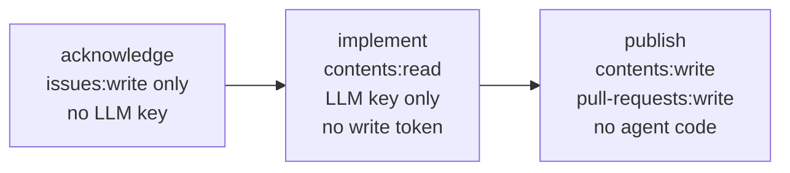

# Single-shot CI with mecatequi

Use `mecatequi` to run one bounded Mecatl task in CI. It accepts one prompt,
writes a patch and machine-readable results, then exits. It starts no network
listeners and keeps no session state between runs.

`mecatequi` is forge-independent. Your CI workflow supplies the task, separates
credentials, and publishes any resulting change. The included GitHub Actions
workflow provides this integration for GitHub repositories.

It reads the same global MCP profiles as `mecated`, but cannot launch an OAuth
browser. Authorize credentials before the job, or inject a provisioned
environment credential. See
[MCP client](/building/what-you-get/mcp-client.md).

## What mecatequi produces

A run can produce three artifacts and an exit code:

|Artifact|Flag|Default|Description|
|-|-|-|-|
|Git diff patch|`--out-diff`|disabled (empty)|A unified patch that reproduces modified, added, and deleted files. Suitable for `git apply`.|
|Summary JSON|`--out-summary`|stdout (`-`)|Machine-readable run result using schema version 1.|
|JSONL event log|`--out-events`|disabled (empty)|One redacted `session.Event` per line. An artifact for forensics, not a rehydration source.|

### Summary JSON

The summary is the stable contract for the publish job and other automation:

|Field|JSON key|Notes|
|-|-|-|
|`SchemaVersion`|`schema_version`|Always `1`; changes only for a breaking schema change|
|`SessionID`|`session_id`|The session that drove this run|
|`StopReason`|`stop_reason`|Verbatim `session.StopReason` string (see below)|
|`NonEmptyDiff`|`non_empty_diff`|Whether the run left a working-tree change|
|`DiffBytes`|`diff_bytes`|Byte length of the computed patch|
|`Usage`|`usage`|`{input_tokens, output_tokens, cache_read_tokens, cache_write_tokens, reasoning_tokens, total_tokens}`|
|`FinalText`|`final_text`|Terminal assistant prose|
|`Error`|`error`|Non-empty only when `stop_reason == "error"`|

The default summary is indented and written to standard output, so you can
inspect it directly:

```sh
mecatequi <FLAGS> | jq .stop_reason
```

Passing `--out-summary=-` explicitly selects compact mode. In that mode, the
summary is the final standard-output line as single-line JSON, which lets a log
consumer parse it without buffering the full output.

### The patch

The patch includes tracked modifications, deletions, and untracked files that
are not ignored. Both `non_empty_diff` and `diff_bytes` describe the complete
patch. A single new file sets `non_empty_diff` to `true`.

Mecatl scrubs Git-specific environment variables and disables external diff
drivers while producing the patch.

### Exit codes

Exit codes are coarse. Always read `stop_reason` and `non_empty_diff` from the
summary to judge whether real work landed.

|Exit code|Meaning|
|-|-|
|`0`|The run reached `end_turn`, `no_progress`, `budget`, `max_turns`, `max_tool_calls`, `max_consecutive_failures`, or `structured_output`|
|`1`|Run failure: model error (`stop_reason: error`), cancelled run, no-approver cancel-on-ask, `--timeout` exceeded|
|`2`|Setup failure: bad flags, missing prompt, `app.Build` / `CreateSession` error, non-git or non-top-level workspace, colliding output sinks, write failure|

:::note[Exit 0 is not "task accomplished"]

`no_progress`, `budget`, and `max_turns` all produce exit 0. The model ran
without an execution error but may not have finished. A CI step that shows
`stop_reason: no_progress` and `non_empty_diff: false` means the agent ran
without errors and left no changes. Treat those two fields as the real signal.

:::

## The split-privilege model

The included CI integration separates the LLM credential from the GitHub write
credential across three jobs:



**`acknowledge`** holds only `issues:write`. It posts one comment confirming
that the run started. It has no LLM key or contents permission.

**`implement`** holds `contents:read` and the LLM key. It runs the agent and
uploads the patch, summary, and event log. It has no GitHub write token or
`id-token`, so agent-controlled code cannot push, open a pull request, or post a
comment.

**`publish`** holds `contents:write`, `pull-requests:write`, and `issues:write`,
but runs no agent code. It downloads the artifacts and applies the patch as
data. It also reports a failed implementation run on the issue.

The job that runs agent code never holds a GitHub write token. The job with the
write token never runs agent code. Both the reusable workflow and the
customizable example preserve this boundary.

## Prompt trust boundary

|Source|Trust|Handling|
|-|-|-|
|Issue or comment text|Untrusted and attacker-controlled|Passed through `--prompt-file` and fenced by `--untrusted-prompt`|
|Operator workflow config (posture, flags, model)|Trusted|Set by a maintainer in the workflow; passed as action inputs|
|`--instructions` content|Trusted|Emitted outside the untrusted-prompt fence, never fenced|

`--untrusted-prompt` wraps the prompt body in Mecatl's untrusted-data fence. Use
it for issue and comment text so the model treats that content as task data
rather than trusted operator instructions.

`--instructions` provides trusted operator guidance outside the fence. The
GitHub Action uses it to request a pull request description and self-check. An
empty value omits this trusted channel.

## Use the reusable GitHub Actions workflow

:::note[Runner version]

The reusable workflow requires GitHub Actions Runner 2.336.0 or later.
GitHub-hosted runners meet this requirement. An older self-hosted runner fails
with an invalid `uses:` error before running the jobs.

:::

`.github/workflows/mecatequi-reusable.yml` is an `on: workflow_call` workflow. A
consuming repository references it with a short caller:

```yaml
jobs:
  mecatequi:
    uses: stacklok/mecatl/.github/workflows/mecatequi-reusable.yml@v0.0.3
    secrets:
      openrouter-key: ${{ secrets.OPENROUTER_CI_TOKEN }}
      publish-app-id: ${{ secrets.RELEASE_APP_ID }}
      publish-app-private-key: ${{ secrets.RELEASE_APP_PRIVATE_KEY }}
    with:
      label: ready-for-agent
      model: anthropic/claude-sonnet-4.6
      default-provider: openrouter
```

Replace `v0.0.3` with the latest released tag. The workflow preserves the three
jobs and their separate permissions. Its composite action builds `mecatequi`
from the tagged Mecatl source.

Use `.github/workflows/mecatequi-example.yml` as a customizable alternative when
you need a different trigger, approval stage, or author gate.

### Trigger patterns

The reusable workflow supports two triggers through `workflow_call` inputs:

- **Issue label:** A maintainer applies the configured label, which defaults to
  `mecatequi`. The workflow runs against the issue body.

- **Issue comment:** A maintainer posts the configured mention, which defaults
  to `@mecatequi`. The workflow runs against the comment body.

On private repositories, applying a label or posting the trigger requires
triage or write access. On public repositories, add a dedicated
permission-check job that calls the `collaborators/{user}/permission` API.

### Publish token

The `publish` job selects its write token in this order:

1. A GitHub App installation token, minted when `publish-app-id` and
   `publish-app-private-key` are present and scoped to the repository.
1. The pre-minted token in `publish-token`.
1. The workflow's `GITHUB_TOKEN`. This fallback emits a warning that recommends
   one of the narrower options.

### Customize the PR description

By default, `publish` writes a pull request body with the agent summary, changed
files, run link, and `Closes #<N>`. To customize it, add
a template at `.github/mecatequi/pr-body.md`. Use the `pr-body-template` input
to select a different path.

The publish step always prepends its agent-authored-content warning. Do not
repeat that warning in your template. A custom template also owns its issue
relationship, so include `Closes {{issue_ref}}` or `Refs {{issue_ref}}` as
appropriate.

The optional `pr-title-template` input overrides
`<ISSUE_TITLE> (#<ISSUE_NUMBER>)`. Use short placeholders such as
`{{issue_ref}}`, `{{issue_title}}`, `{{stop_reason}}`, and `{{branch}}`.

## Key flags

`mecatequi` reads MCP profiles from the global `settings.yaml`. Repeat
`--permission-config <PATH>` to add trusted settings files with higher
precedence.

Supply provider credentials through `auth.yaml` or the documented environment
variables: `OPENAI_API_KEY`, `OPENROUTER_API_KEY`, `ANTHROPIC_API_KEY`, and
`OPENCODE_API_KEY`. Keep secrets out of command-line arguments.

### Prompt and output

|Flag|Default|Notes|
|-|-|-|
|`--prompt`|None|Literal prompt text. Supply this flag or `--prompt-file`.|
|`--prompt-file`|None|Path to a file containing the prompt body.|
|`--untrusted-prompt`|`false`|Wrap the prompt body in the untrusted-data fence. Set `true` for issue-text input.|
|`--instructions`|`""`|Trusted operator framing emitted outside the fence. The GitHub Action sets a non-empty default (PR-description + self-verify framing).|
|`--out-summary`|`-` (stdout)|Where to write the `Summary` JSON.|
|`--out-diff`|`""` (disabled)|Where to write the git patch. Opt in with a path.|
|`--out-events`|`""` (disabled)|Where to write the JSONL event log. Opt in with a path.|

No two outputs may share a sink. Two writers on one stream interleave and
corrupt both.

### Engine and run control

|Flag|Default|Notes|
|-|-|-|
|`--workspace`|cwd|Session workspace root. Must be a git repository top level.|
|`--default-provider`|`""`|Provider ID: `openai`, `openai-codex`, `openrouter`, `anthropic`, or `opencode`.|
|`--model`|`""`|Per-session passthrough model ID. Accepts any ID the provider serves, including IDs newer than the embedded catalog. Prefer this over `--default-model` for newer models.|
|`--posture`|`""` (strict)|Permission posture. Use `auto` for autonomous CI. With `strict` and `--headless`, a main-agent permission ask cancels the run and exits 1.|
|`--trust-project`|`false`|Trust this workspace for project content and read-only child shell access. No posture grants project trust in headless mode. Without this flag or a declared or remembered trust decision, Mecatl ignores project content such as `AGENTS.md` and does not give read-only children a shell.|
|`--headless`|`true`|A single-shot CI run has no human approver. Child asks are denied or routed to the optional ask reviewer.|
|`--timeout`|`0` (disabled)|Wall-clock bound on the whole run (e.g. `40m`). A timeout-cancelled run exits 1 with `stop_reason: cancelled`.|
|`--max-run-tokens`|`0` (unlimited)|Per-engine input and output token limit. Each child enforces its own inherited limit, so aggregate delegated usage can exceed this value. Crossing the limit produces `stop_reason: budget`.|
|`--max-team-tokens`|`0` (unlimited)|Separate team-round aggregate token ceiling, not a per-engine run ceiling. When crossed, it prevents new team rounds; the current round and lead synthesis still complete. It does not enforce or report a cross-tree aggregate outside that team.|
|`--max-turns`|`0` (deployment default)|Turn cap for this run. `0` inherits the composition default.|

### Provider keys

`--default-provider` selects a provider. The matching credential must be
available, or the run fails with `no LLM provider available`.
`OPENAI_API_KEY` enables OpenAI without an explicit provider selection. For
OpenRouter, Anthropic, or OpenCode Go, set the corresponding key and select the
provider explicitly.

The experimental `openai-codex` provider has no environment key. Put a manual
ChatGPT Codex OAuth snapshot in owner-only `auth.yaml`, pass
`--api-key-file PATH --default-provider openai-codex`, and replace the token
and restart the job when it expires or is rejected. It uses an undocumented
private backend and a separate billing identity from public OpenAI API credit.
There is no login or refresh flow. See
[Configure provider credentials](./settings.md#configure-provider-credentials).

### Telemetry

`mecatequi` can push metrics and traces to an OTLP collector and flush them
before exit. Telemetry is off when both endpoint flags are empty. See
[ADR 0098](https://github.com/stacklok/mecatl/blob/main/docs/adr/0098-headless-telemetry.md)
and [Key flags](#key-flags).

|Flag|Default|Notes|
|-|-|-|
|`--otlp-endpoint`|`""` (off)|OTLP trace collector endpoint; empty disables tracing.|
|`--otlp-protocol`|`grpc`|OTLP transport for traces (`grpc` or `http`).|
|`--otlp-insecure`|`false`|Use plaintext when dialing the collector. Use only for local development.|
|`--otlp-metrics-endpoint`|`""` (off)|OTLP METRICS collector endpoint; empty disables metrics push.|
|`--otlp-metrics-protocol`|`grpc`|OTLP transport for metrics (`grpc` or `http`).|
|`--otlp-shutdown-timeout`|`5s`|Maximum time to flush telemetry during shutdown.|

Metrics use bounded role labels and do not include session or model IDs.

## Headless posture and permission asks

`mecatequi` defaults to `--headless=true`. Permission asks behave differently
for the main agent and its children.

Child asks from subagents, team members, and parallel branches are denied by
default. `--subagent-ask-reviewer` enables a tool-less, one-turn LLM reviewer
that can approve the current call only. A reviewer error leaves the call denied.
This flag applies only in headless mode.

With `--posture strict` and `--headless`, the main agent has no approver. Its
first permission ask cancels the run, produces `stop_reason: cancelled`, and
exits 1 with guidance to add allow rules or choose another posture.

Use `--posture auto` for autonomous CI. It allows main-agent and child tool
calls while retaining child prompt-injection defenses. Reserve `yolo` for a
disposable, isolated, single-tenant environment.

## What mecatequi does not support

|Capability|Where to look instead|
|-|-|
|Session continuity across runs|`mecated` or `mecak8s` with a durable session store|
|Resuming prior runs|`mecated` (`Service.StartRunContent` on a prior session id)|
|Interactive clients (TUI, IDE)|`mecated` + `mecatui`|
|Inspecting subagents across invocations|`mecated` with `InspectSubagent` and a persisted subagent store|
|Multi-turn conversational application|`mecated` or `mecak8s`|

A single-shot run reads its task, produces artifacts, and exits. The issue and
pull request provide the durable workflow record.

## Workspace validation

The workspace must be the top level of a Git repository. A subdirectory could
produce a patch for the enclosing repository, so `mecatequi` validates the
resolved workspace against `git rev-parse --show-toplevel`. A validation failure
exits 2.

## Next steps

- [Choose how to run Mecatl](/building/getting-started/deployment-decision.md)
  for other deployment options.
- [Run mecated standalone](/building/deployment/mecated.md) for interactive
  clients and durable sessions.
- [Configure permissions and guardrails](/building/what-you-get/permissions.md)
  for autonomous runs.
