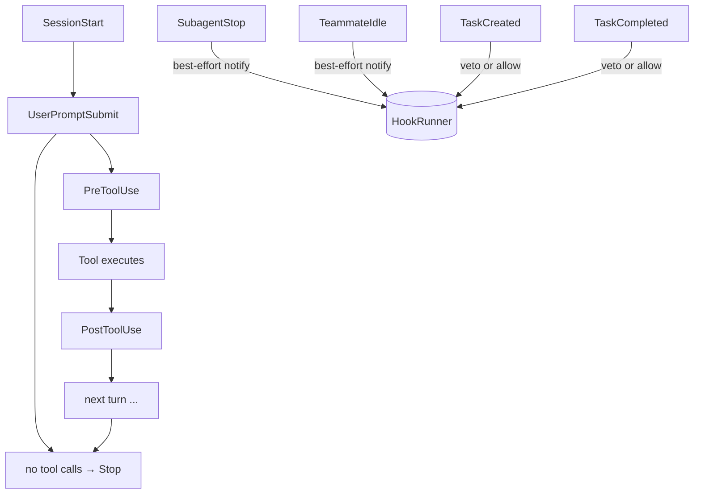

# HookRunner

`port.HookRunner` is the port the loop calls at every lifecycle transition in a session. Hooks observe or intercept events ranging from individual tool calls to prompt submission to session termination. A hook can allow an action, block it, or rewrite its payload — with the understanding that only a `PreToolUse` block is a real veto (a `PreToolUse` block can optionally be refined into an interactive approval ask instead of a dead end — see `AskApproval` below).

---

## The interface

```go
// engine/port/hookrunner.go
type HookRunner interface {
    Run(ctx context.Context, ev governance.HookEvent) (governance.HookOutcome, error)
}
```

The loop calls `Run` synchronously at each hook phase and waits for the result before continuing. A `nil` `HookRunner` is a supported no-op: every fire site in the loop skips the call cleanly when `Deps.Hooks == nil`.

### HookEvent

`governance.HookEvent` carries all context the hook needs to make a decision:

```go
// engine/governance/hookevent.go
type HookEvent struct {
    Phase     HookPhase
    Tool      string          // non-empty on tool-use phases only
    Input     json.RawMessage // phase-specific payload
    SessionID string
    CallID    string          // non-empty on tool-use phases; correlates to the tool call
}
```

The `Input` shape is phase-specific. For `PreToolUse` it is the raw tool-call arguments JSON. For `PostToolUse` it is `{"args": ..., "content": "...", "is_error": bool}`. For `UserPromptSubmit` it is `{"prompt": "..."}`. For `Stop` it is `{"stop_reason": "..."}`. Lifecycle phases with nothing to carry (e.g. `SessionStart`) have an empty `Input`.

### HookOutcome

```go
type HookOutcome struct {
    Block       bool
    Message     string
    Mutated     json.RawMessage
    AskApproval bool
}
```

- **`Block`** — when true, the hook vetoes the action. Effective only on phases that support blocking (see the table below).
- **`Message`** — human-readable explanation surfaced to the model on a block, or as an annotation on mutation.
- **`Mutated`** — when non-empty on an allowing outcome, replaces the phase's payload. The replacement must be valid JSON in the same shape as `HookEvent.Input` for that phase; a malformed payload is silently ignored and the original stands.
- **`AskApproval`** — refines a `PreToolUse` `Block` into an *askable* block instead of a dead end: on an interactive engine, the loop surfaces it as an ordinary permission ask (pause → `EvPermissionAsk` → approve/deny), reusing the same machinery as Layer-1 permission asks — an allow runs the call, a deny refuses it. A headless (non-interactive) engine ignores the bit and the block simply stands, which is the fail-safe default. It's meaningless outside `PreToolUse Block == true` and is silently ignored elsewhere. A hook implementation that predates this field just never sets it, reproducing the pre-existing dead-end-block behavior exactly.

A `HookRunner` consumer can optionally also implement `port.HookApprovalLearner` (`LearnHookApproval(ctx, HookEvent)`), which the loop calls when the human resolves an askable block with "allow and don't ask again" — letting the consumer arm its own longer-lived waiver for that tool/pattern. It's a separate, optional interface (not a `HookRunner` method), so implementing it is opt-in and doesn't touch the required `HookRunner` surface.

---

## Hook phases

Nine lifecycle phases are defined in `engine/governance/hookevent.go`. They fall into three groups:

### Per-tool phases

These fire from `engine/agent/dispatch.go` for every tool call that clears the permission gate.

| Phase | When it fires | Input shape | Supports block | Supports mutate |
|---|---|---|---|---|
| `PreToolUse` | Before the tool executes. Permission policy has already resolved to allow. | Tool-call args JSON | **Yes** (real veto) | Yes — rewrites the args the tool sees |
| `PostToolUse` | After the tool executes and returns a result. | `{"args": ..., "content": "...", "is_error": bool}` | Annotation only — see caveat below | Yes — rewrites the result the model sees |

### Run-level phases

These fire from `engine/agent/hooks.go` for the main engine lifecycle.

| Phase | When it fires | Input shape | Supports block | Supports mutate |
|---|---|---|---|---|
| `SessionStart` | Once, before the first prompt is recorded and before any model call. | (empty) | **Yes** (aborts the run) | No |
| `UserPromptSubmit` | After command expansion, before the prompt is recorded and before the first model call. | `{"prompt": "..."}` | **Yes** (rejects the prompt) | Yes — rewrites the effective prompt |
| `Stop` | When the main loop reaches any terminal path (complete, error, cancel). Runs on a detached context (5s timeout) so a cancelled run still notifies. | `{"stop_reason": "..."}` | Annotation only | No |

### Subagent and team phases

These fire from `engine/agent/subagent.go`, `engine/agent/teamsupervisor.go`, and `engine/agent/teamtools.go`. They are best-effort notifications: `fireNotify` is the common path, which detaches from a cancelled context (5s timeout) and discards any block or error.

| Phase | When it fires | Input shape | Supports block | Supports mutate |
|---|---|---|---|---|
| `SubagentStop` | When a subagent child loop stops. | `{"stop_reason": "..."}` | No (best-effort notify) | No |
| `TeammateIdle` | When an agent-team member goes idle after a turn. Best-effort. | varies | No | No |
| `TaskCreated` | Before a team task is created. | task JSON | **Yes** (vetoes the creation) | No |
| `TaskCompleted` | Before a team task is marked complete. | task JSON | **Yes** (vetoes the completion) | No |

### Phase summary



---

## Outcomes

### Allow (passthrough)

Exit code 0 or returning `HookOutcome{}` with `Block: false` and empty `Mutated`. The original action proceeds unchanged. This is what a no-op hook (e.g. `hookexec.New(nil)`) always returns.

### Block

Set `Block: true` in the outcome. What happens depends on the phase:

- **`PreToolUse` block** — the tool never executes. The loop synthesizes a permission-denied `ToolResult` and feeds it to the model, which can adapt.
- **`SessionStart` / `UserPromptSubmit` block** — the run aborts before any model call. A hook execution error on these phases is treated identically (fail-safe: the verdict is unknown, so the run cannot proceed).
- **`TaskCreated` / `TaskCompleted` block** — the task operation is vetoed.
- **`PostToolUse` block** — see the caveat below.

A block on a best-effort phase (`Stop`, `SubagentStop`, `TeammateIdle`) is ignored.

### Mutate

Return a non-empty `Mutated` JSON payload in an allowing outcome. The loop applies it symmetrically with the `HookEvent.Input` shape:

- **`UserPromptSubmit`** — `{"prompt": "..."}`. The rewritten text becomes the effective prompt the model sees.
- **`PreToolUse`** — the rewritten tool-call arguments. The permission policy is NOT re-evaluated on the mutated args; a hook is trusted more than the model.
- **`PostToolUse`** — `{"content": "...", "is_error": bool}`. The rewritten result becomes what the model is shown and what is recorded in history. The client event stream shows the same effective result — no hidden divergence.

A malformed (non-JSON) `Mutated` payload is silently ignored and the original stands. The loop emits a `hook.info` event to surface the ignored mutation for observability.

---

## PostToolUse Block caveat

`PostToolUse` Block does **not** veto. The tool has already executed by the time the post hook fires. A `Block` outcome on this phase surfaces a warning-severity annotation on the tool card in the client stream, but the result itself is neither undone nor suppressed.

To suppress a bad inbound result — for example, because it contains injected instructions or a secret — use **Mutate** instead:

```json
{
  "content": "blocked by guardrail: unsafe content detected",
  "is_error": true
}
```

The loop records the mutated result in the session history, emits it on the client event stream, and delivers it to the model — all three views agree on the rewritten result. The raw tool output never reaches the model.

Only `PreToolUse` Block is a real veto — and even there, setting `AskApproval` turns it from a dead end into an interactive ask rather than removing the veto.

:::note[Loop consistency guarantee]

When a PostToolUse hook mutates a result, the effective (rewritten) result is what the loop records, emits on the client stream, and delivers to the model. There is no hidden divergence between the three views — a redacting hook's redaction reaches the audit recorder too, not just the model.

:::

---

## The shell hook executor

`internal/adapter/hookexec` is the production `port.HookRunner` that `mecated` uses. It maps each `HookPhase` to a shell command, forks a process per event, and interprets the exit code as the outcome.

```go
// internal/adapter/hookexec/hookexec.go
func New(hooks map[governance.HookPhase]string, opts ...Option) *Runner
```

A `nil` or empty `hooks` map means no hooks configured — every event is allowed. Pass a map with a command per phase to activate those phases.

### Protocol

The runner executes each registered command as `<shell> -c <command>` (default shell `/bin/sh`). The `HookEvent` is serialized as JSON and written to the hook process's stdin.

**Exit codes:**

| Exit code | Meaning |
|---|---|
| `0` | Allow |
| `2` | Block |
| anything else non-zero | Error (hook execution failure) |

**Stdout on exit 0:** If stdout begins with `{`, it is parsed as a control envelope:

```json
{
  "mutated": { ... },
  "message": "..."
}
```

`mutated` becomes `HookOutcome.Mutated` (the phase-appropriate rewrite payload). `message` becomes `HookOutcome.Message`. Plain prose stdout (not starting with `{`) is used as `HookOutcome.Message` verbatim — existing hooks that print a status line are unaffected.

**Stdout on exit 2:** The runner prefers stdout for the block message, falling back to stderr.

**Timeout:** `DefaultTimeout` is 30 seconds per invocation. Override with `hookexec.WithTimeout`. On POSIX, the process runs in its own process group so a timeout kills the whole subprocess tree, not just the immediate shell.

**Shell override:** `hookexec.WithShell` changes the interpreter (default `/bin/sh`).

### Example registration

```go
import "github.com/stacklok/mecatl/internal/adapter/hookexec"
import "github.com/stacklok/mecatl/engine/governance"

hooks := hookexec.New(map[governance.HookPhase]string{
    governance.PhasePreToolUse:  "/usr/local/bin/check-tool-call.sh",
    governance.PhasePostToolUse: "/usr/local/bin/check-tool-result.sh",
    governance.PhaseSessionStart: "/usr/local/bin/audit-session.sh",
})
```

Wire it into `agent.Deps.Hooks` at composition time.

---

## Implementing your own HookRunner

You may want a custom `HookRunner` when:

- **Policy enforcement** — block specific tool calls based on runtime context that the static permission rule engine cannot express (e.g. calling an external rate limiter or consulting a live policy store).
- **Audit logging** — record every tool call and result to an append-only log outside the harness.
- **Side effects** — trigger downstream systems on tool events (notifications, metrics, CI signals).
- **Result rewriting** — redact secrets or truncate enormous tool results before they enter the model's context.

A no-op runner is trivial. In tests and the demo, the composition layer wires `hookexec.New(nil)`:

```go
// hookexec.New(nil) satisfies port.HookRunner and allows every event.
hooks := hookexec.New(nil)
```

A custom implementation just satisfies the `port.HookRunner` interface:

```go
type HookRunner interface {
    Run(ctx context.Context, ev governance.HookEvent) (governance.HookOutcome, error)
}
```

The loop is synchronous on hook calls — the hook runs under the caller's context (plus the hookexec timeout for the shell adapter). Keep hook implementations fast for the blocking phases (`PreToolUse`, `SessionStart`, `UserPromptSubmit`); the best-effort phases (`Stop`, `SubagentStop`, `TeammateIdle`) run on a detached context so a slow hook on those phases does not block the run.

Error handling differs by phase:

- **Blocking phases** (`SessionStart`, `UserPromptSubmit`): a hook error is treated as a block (fail-safe — the verdict is unknown).
- **Tool-use phases** (`PreToolUse`): a hook error is treated as a block (same fail-safe reasoning).
- **Best-effort phases** (`PostToolUse`, `Stop`, `SubagentStop`, `TeammateIdle`): a hook error is ignored; the run continues unaffected.

---

## Relationship to guardrails

The model-backed guardrail checker (ADR 0021, `internal/adapter/modelhook`) is **not** part of the `HookRunner` port itself. It is wired as a composition-layer decorator around `port.HookRunner` at `internal/app/build.go` (`buildGuardrailsHooks`):

```
port.HookRunner (hookexec.New)
  └── maybeWrapUserModelReview (Phase-2b user-model reviewer)
        └── buildGuardrailsHooks (modelhook guardrail checker)
               └── deps.Hooks  ← what the main engine sees
```

The guardrail checker fires on `PreToolUse` (outbound exfiltration check) and `PostToolUse` (inbound injection check) using a separate, tool-less checker model. From the loop's perspective it is just a `HookRunner` that may return a Block or Mutate outcome. From the composition layer's perspective it is an additional layer stacked on top of the base runner.

The guardrail `PostToolUse` block enforces via Mutate — exactly the pattern described in the caveat above. An enforcing inbound block rewrites the result to `{content: "blocked by guardrail: …", is_error: true}` rather than attempting to veto an already-run tool.

The guardrail runner is wired **only** onto the main engine's hooks. Child engines (subagent explorers, team members, parallel branches) use the unwrapped `hookexec.New(nil)` runner — this is the no-recursion guard: a guardrail checker spawning a checker-instrumented child would recurse.

---

## What's next

- [Permissions & guardrails](/building/what-you-get/permissions.md) — the rule-based permission layer (Layer 1) that gates every tool call before hooks fire, and the model-backed guardrail checker (Layer 2) that is wired on top of `HookRunner`.
- [The agent loop](/building/what-you-get/agent-loop.md) — the full turn structure and where `PreToolUse` / `PostToolUse` fit in the dispatch sequence.
- [PermissionPolicy](/building/extension-points/permission-policy.md) — the other port that fires on every tool call, before hooks, to decide allow / ask / deny.
- [Tool catalog](/building/extension-points/tool-catalog.md) — add, replace, or remove tools from the catalog the loop dispatches against.
