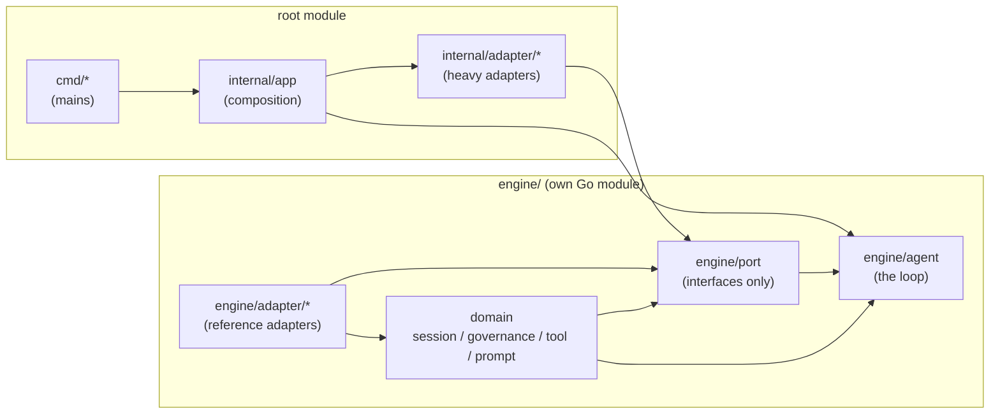

# Overview & the port model

mecatl is structured as a **hexagonal architecture** (ports & adapters). The agent loop in `engine/agent` targets only the interface definitions in `engine/port` — it never imports a concrete adapter, a provider SDK, or an OS package. Adapters implement those interfaces and are wired together at composition time in `internal/app` and the `cmd/` mains.

This means you can replace any single capability — swap in a different LLM provider, plug in Redis-backed session storage, or wire a custom permission policy — without touching the loop, the domain model, or any other adapter.

---

## The dependency flow



The key constraint: **`engine/agent` imports only `engine/port`, the domain packages, and the standard library.** Adapters are injected at construction; the loop never names them. This is machine-enforced by depguard, a DAG test in `engine/arch/layering_test.go`, and the module boundary itself (ADR 0036 — `engine/` is its own `go.mod`, so a stray `engine→internal` import breaks the standalone build outright).

---

## The port interfaces

Every seam the loop can be extended through is defined in `engine/port`. The table below lists each interface, what it abstracts, and where the adapters that satisfy it live.

| Interface | File | Abstracts | Reference adapters |
|---|---|---|---|
| `LLMProvider` | `port/llm.go` | Model calls — streams `Chunk` values; reports multimodal `ProviderCapabilities` | `engine/adapter/mockllm` (offline); `provider/openai`, `provider/anthropic`, `provider/openaichat` (opt-in submodules); `internal/adapter/openrouter`; `internal/adapter/llmresilience` (decorator) |
| `SessionStore` | `port/store.go` | Persist and reload session state | `engine/adapter/memstore` (in-memory, tests); `internal/adapter/store/jsonlstore` (append-only JSONL); `internal/adapter/redisstore` (Redis-backed) |
| `PrunableStore` | `port/store.go` | Optional retention sweep (list + delete sessions) | Same implementations that also carry `SessionStore`; discovered by type assertion |
| `PermissionPolicy` | `port/permission.go` | Evaluate a tool call → allow / ask / deny; learn per-session allow rules | `engine/adapter/permpolicy` (wraps the session-free `governance.Evaluator`) |
| `PermissionStore` | `port/permission.go` | Hold per-session learned rules | `engine/adapter/permstore` |
| `HookRunner` | `port/hookrunner.go` | Execute lifecycle hooks (`PreToolUse`, `PostToolUse`, etc.) | `internal/adapter/hookexec` (shell-exec); `engine/adapter/mockllm` test stubs |
| `EventLog` | `port/eventlog.go` | Durable append-only per-session event record | `engine/adapter/memstore` (in-memory); `internal/adapter/store/jsonlstore` (`.events.jsonl` sidecar); `internal/adapter/redisstore` |
| `EventSink` | `port/log.go` | Live mirror of the event stream (telemetry, ACP relay) | `internal/adapter/server` (gRPC/HTTP relay); `internal/adapter/telemetry` |
| `ToolCallRecorder` | `port/log.go` | Per-tool audit record (timing, call, result) | `internal/adapter/store/jsonlstore`; `internal/adapter/redisstore`; `internal/adapter/telemetry` |
| `Diagnostics` | `port/diagnostics.go` | Operator-facing log lines (structured key/value, slog-shaped) | `internal/adapter/slogdiag` (the only slog bridge); `port.NopDiagnostics` (zero-value default) |
| `Clock` | `port/clock.go` | Wall clock — `Now() time.Time` | `engine/adapter/wallclock` (production); test fakes inline in engine tests |
| `SessionLease` | `port/lease.go` | Cross-process single-writer lease for a session id (optional; cloud-native Phase 4) | `engine/adapter/memlease`; `internal/adapter/flocklease`; `internal/adapter/k8slease`; `internal/adapter/grpcdriver` |

### Ports that are NOT in `engine/port`

Two interfaces that are conceptually ports live in `engine/tool` instead of `engine/port`:

- **`tool.FileSystem`**, **`tool.Workspace`**, and **`tool.Environment`** — these define the filesystem + execution-environment abstraction the tools execute against. They live in `engine/tool` because `port` already imports `tool` (for `LLMRequest.Tools []tool.ToolSpec`) and `Tool.Execute` takes an `Environment` — moving it into `port` would create a `port↔tool` import cycle. `Environment` bundles a `session.EnvironmentRef{Kind, ID}` (cycle-safe identity — a DURABLE snapshot field as of ADR 0214, so a non-in-tree ref survives a process restart and reattaches a live `Environment` via `server.Config.EnvironmentResolver`), a NON-NULL `Workspace`, and an OPTIONAL bound `CommandRunner` (nil → Bash surfaces `ErrNoShell`). `CommandRunner.Run`/`CommandStreamer.RunStreaming` take NO per-call workdir — a runner is bound to one namespace at construction. `Workspace` is version-aware: implementations mint opaque `FileVersion` values and expose version-bearing reads, create-only writes, and conditional replace-by-version. Public Workspace has no unconditional Write capability; concrete adapters may retain bootstrap/setup writers outside the interface. `RecordRead`/`RecordedVersion` form an I/O-free ledger scoped to the live Workspace/Environment instance; key normalization must be lexical (ordinary abs/relative forms converge, physical symlink aliases may safely miss). Implementations are `engine/adapter/memfs` (tests), `internal/adapter/osfs` (production), and the ACP editor-buffer workspace. `tool.EnvironmentForker` replaces `tool.WorkspaceForker` (Fork returns a complete child Environment); `tool.EnvironmentMerger` replaces `tool.ForkMerger` (Merge receives child/parent Environments). Existing engine embedders implementing `Workspace` must add `ReadVersion`, `CreateFile`, `ReplaceFile`, and `RecordedVersion`, update `RecordRead` to accept `FileVersion`, remove `Write` from their interface assumptions, update `Tool.Execute` to take `Environment`, update `CommandRunner.Run` to drop the workdir parameter, and update any `WorkspaceForker`/`ForkMerger` implementations to the `EnvironmentForker`/`EnvironmentMerger` signatures. See [ADR 0214](https://github.com/stacklok/mecatl/blob/main/docs/adr/0214-environment-persistence.md) (persistence/reattachment), [ADR 0211](https://github.com/stacklok/mecatl/blob/main/docs/adr/0211-execution-environment-runtime-seam.md) (runtime seam), and [ADR 0208](https://github.com/stacklok/mecatl/blob/main/docs/adr/0208-execution-environment.md) (version protocol).

---

## When to implement a port vs. use the reference adapters

Most deployments — embedding the engine in a service, running `mecated`, or wrapping it in a thin custom binary — use the reference adapters directly. Composition in `internal/app.Build` wires them together; you configure, not replace.

Implement a port when you need to **swap a specific capability at the boundary**:

| Scenario | Port to implement |
|---|---|
| Route to a different LLM provider (your own inference cluster, proxy, or custom API) | `LLMProvider` |
| Store sessions in your own database (PostgreSQL, DynamoDB, …) | `SessionStore` (+ optionally `PrunableStore`) |
| Enforce your own permission logic (RBAC, OPA, org-level policy engine) | `PermissionPolicy` |
| Audit tool calls into your own observability pipeline | `ToolCallRecorder` |
| Route operator log lines to your logging infrastructure | `Diagnostics` |
| Implement session leasing against your own distributed lock service | `SessionLease` |

You do **not** need to implement a port to:

- Change which model is used — pass the model name through `internal/app`'s provider registry.
- Change permission rules — write `settings.yaml` config. The existing `PermissionPolicy` adapter picks it up per session.
- Add lifecycle hooks — write shell hooks or use `internal/adapter/hookexec`. The `HookRunner` port is for replacing the execution engine, not adding hooks.
- Add tools — extend the `tool.Catalog` at composition time.

---

## How adapters are wired: the composition pattern

mecatl uses **explicit constructors with no DI framework**. All wiring happens in `internal/app/build.go` (`app.Build`), which is the single shared composition root. The `cmd/` mains call it; they do not wire anything themselves.

The schematic below shows how ports are satisfied for a typical deployment. Actual field names are illustrative; see `internal/app/build.go` for the live signatures.

```go
// internal/app/build.go (schematic)

func Build(cfg Config) (*server.Service, error) {
    // 1. Stand up the store (satisfies SessionStore, PrunableStore, EventLog, ToolCallRecorder)
    store, err := jsonlstore.New(cfg.DataDir)

    // 2. Build the LLM provider (satisfies LLMProvider)
    //    The llmresilience decorator wraps the raw provider with retry + stream watchdog.
    raw, err := openai.New(openai.WithAPIKey(cfg.OpenAIKey), openai.WithBaseURL(cfg.BaseURL))
    provider := llmresilience.Wrap(raw, llmresilience.Config{StreamIdleTimeout: 180 * time.Second})

    // 3. Permission policy + store (satisfies PermissionPolicy, PermissionStore)
    permStore := permstore.New()
    rules := []governance.Rule{ /* your rules */ }
    policy := permpolicy.NewPolicy(rules, permStore)

    // 4. Diagnostics (satisfies Diagnostics)
    diag := slogdiag.NewFromLogger(slog.Default())

    // 5. Clock (satisfies Clock) -- the zero value is ready to use, no constructor
    clk := wallclock.Clock{}

    // 6. Hook runner (satisfies HookRunner)
    hooks, err := hookexec.New(cfg.HookConfig)

    // 7. Inject into the engine
    // Note: EventLog is NOT an engine.Deps field — the service layer (not the engine)
    // appends to the log. Pass store to the service constructor instead.
    eng := agent.NewEngine(agent.Deps{
        LLM:              provider,
        Store:            store,
        Policy:           policy,
        Hooks:            hooks,
        ToolCallRecorder: store,
        Diagnostics:      diag,
        Clock:            clk,
    })

    return server.New(eng, store, ...), nil
}
```

A few things to notice:

- **One object can satisfy multiple ports.** `jsonlstore.Store` implements `SessionStore`, `PrunableStore`, `EventLog`, and `ToolCallRecorder`. Nothing in `engine/agent` knows or cares — it sees distinct interface values. (The engine itself does not hold the `EventLog`; the service layer appends to it. The same store object is passed to both.)
- **Adapters are never imported by the engine.** `agent.Deps` carries interface values only. A new LLM adapter never requires an engine change.
- **Composition is the only place adapters meet.** Domain packages and `engine/agent` have no adapter imports, which the depguard allowlist and the DAG test verify on every build.

### Replacing a single adapter

To swap, say, `SessionStore` for your own database backend:

1. Implement `port.SessionStore` (and optionally `port.PrunableStore`) in a new package.
2. In your composition root (either your own `main` or a fork of `internal/app/build.go`), construct your store and pass it in place of `jsonlstore.New(...)`.
3. Nothing else changes — the engine, the server, the domain, the permission stack are all untouched.

To validate your implementation against the conformance suite:

```go
// Run the standard store conformance tests against your adapter.
storeconformance.Run(t, func(t *testing.T) port.SessionStore { return yourstore.New() })
```

Conformance suites ship in `engine/adapter/storeconformance`, `leaseconformance`, `fsconformance`, `sourceconformance`, `memconformance`, `eventlogconformance`, and `scheduleconformance`. An adapter that passes its suite is compatible with mecatl's expectations.

---

## What's next

- [LLM provider](llm-provider.md) — implement `port.LLMProvider` to route to a custom model endpoint.
- [Session store](session-store.md) — implement `port.SessionStore` (and the optional `PrunableStore` / `EventLog` seams) for your own persistence backend.
- [Permission policy](permission-policy.md) — replace Layer 1's rule engine with your own authorization logic.
- [Session lease](session-lease.md) — implement `port.SessionLease` for cross-process single-writer session exclusion.
