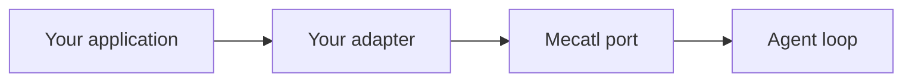

# Overview & the port model

Mecatl exposes interfaces for the capabilities around the agent loop. Implement
only the interface you need, then supply your adapter when you construct the
engine or service.

## The dependency flow



The loop depends on ports and domain types, not concrete providers, databases,
policy engines, or operating-system integrations. This keeps one adapter change
from affecting unrelated capabilities.

## The port interfaces

|Interface|Use it to replace|
|-|-|
|`LLMProvider`|Model streaming and capability reporting|
|`SessionStore`|Session persistence and reload|
|`PrunableStore`|Optional retention listing and deletion|
|`PermissionPolicy`|Allow, ask, and deny decisions|
|`PermissionStore`|Per-session learned permission rules|
|`HookRunner`|Lifecycle hook execution|
|`EventLog`|Durable per-session events|
|`EventSink`|Live event relays and telemetry|
|`ToolCallRecorder`|Tool-call audit records|
|`Diagnostics`|Operator-facing structured logs|
|`Clock`|Wall-clock time|
|`SessionLease`|Cross-process single-writer session ownership|

Many deployments use Mecatl's supplied adapters. The detailed extension-point
pages describe each interface, its invariants, available adapters, and
conformance tests.

### Ports outside `engine/port`

Filesystem and execution interfaces live in `engine/tool` because tools use them
directly:

|Interface|Responsibility|
|-|-|
|`tool.FileSystem`|Underlying filesystem operations|
|`tool.Workspace`|Version-aware reads, create-only writes, conditional replacement, and the read ledger|
|`tool.Environment`|A workspace, durable environment identity, and an optional bound command runner|
|`tool.WorkspaceNamespace`|Optional directory listing, removal, rename, and copy operations|
|`tool.EnvironmentForker`|Create an isolated child environment|
|`tool.EnvironmentMerger`|Merge a child environment into its parent|

Use `engine/adapter/memfs` for tests. The shipped server uses the OS-backed
workspace adapter, while ACP supplies an editor-buffer workspace.

## When to implement a port vs. use the reference adapters

Implement a port when your application needs behavior that the supplied adapters
do not provide:

|Requirement|Port|
|-|-|
|Route model calls to a custom API or inference cluster|`LLMProvider`|
|Store sessions in another database|`SessionStore`, and optionally `PrunableStore`|
|Use an organizational policy engine|`PermissionPolicy`|
|Send tool-call records to another audit system|`ToolCallRecorder`|
|Route diagnostic records to another logging system|`Diagnostics`|
|Use another distributed lock service|`SessionLease`|

You can make these changes without implementing a port:

- Select a model through the provider registry.
- Configure permission rules in `settings.yaml`.
- Add lifecycle hooks with the supplied hook runner.
- Register custom tools in `tool.Catalog`.

## How adapters are wired: the composition pattern

Construct adapters at your application's composition root and pass them through
the appropriate dependency fields. One object can implement several ports. For
example, a store can provide session persistence, pruning, durable events, and
tool-call recording.

```go
store, err := yourstore.New(cfg.DatabaseURL)
if err != nil {
    return nil, err
}

policy := permpolicy.NewPolicy(rules, permstore.New())

engine := agent.NewEngine(agent.Deps{
    LLM:              provider,
    Store:            store,
    Policy:           policy,
    Hooks:            hooks,
    ToolCallRecorder: store,
    Diagnostics:      diagnostics,
    Clock:            wallclock.Clock{},
})
```

The example is schematic. Use the constructors and dependency fields in the
version you import.

### Replacing a single adapter

To replace session storage:

1. Implement `port.SessionStore` and any optional store interfaces you need.
1. Construct it in your composition root and pass it where the engine and
   service require those interfaces.
1. Run the supplied conformance suite against your implementation.

```go
storeconformance.Run(t, func(t *testing.T) port.SessionStore {
    return yourstore.New()
})
```

Mecatl supplies conformance packages for stores, event logs, leases,
filesystems, sources, memory, and schedules under `engine/adapter/`.

## What's next

- [LLM provider](llm-provider.md) to route calls to a custom model endpoint.
- [Session store](session-store.md) to persist sessions in your own backend.
- [Permission policy](permission-policy.md) to replace rule evaluation.
- [Session lease](session-lease.md) to implement cross-process ownership.
