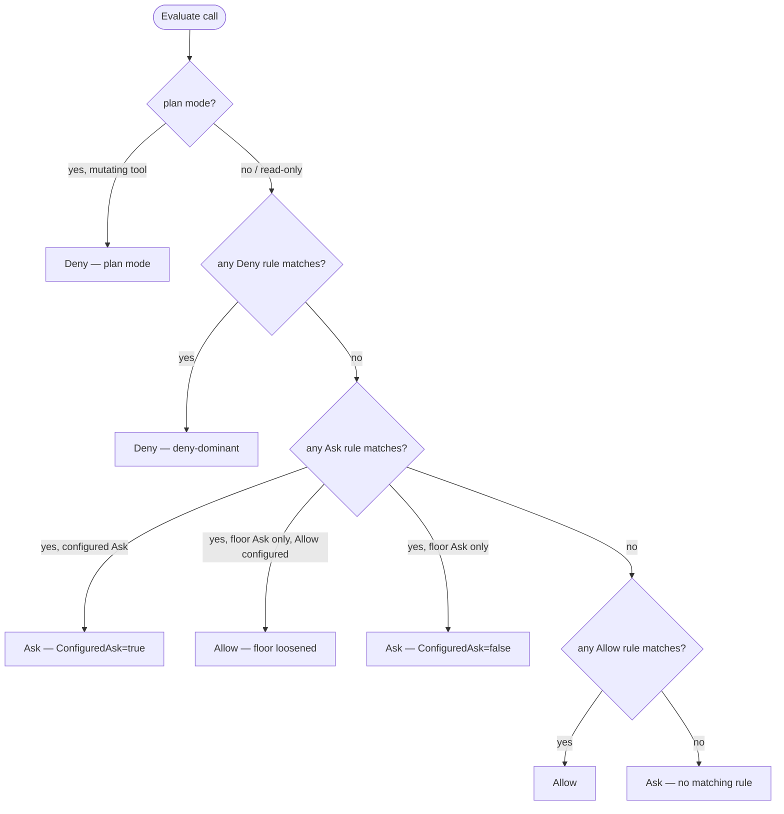

# PermissionPolicy

`port.PermissionPolicy` decides whether a tool call can run. Implement it when
YAML configuration cannot express your policy, such as tenant-specific rules or
decisions from an external authorization service, then inject it at composition.

The reference implementation is `engine/adapter/permpolicy.Policy`. The shipped
composition builds on it through `internal/adapter/permconfig` and
`internal/app`.

---

## The interface

```go
// engine/port/permission.go

type PermissionPolicy interface {
    Evaluate(
        ctx context.Context,
        sessionID session.SessionID,
        mode session.PermissionMode,
        c session.ToolCall,
        ws tool.WorkspaceReader,
    ) governance.PermissionDecision

    Learn(sessionID session.SessionID, c session.ToolCall)
}
```

Two methods:

- **`Evaluate`** — called on every tool call before execution. Returns a
  `governance.PermissionDecision` carrying `Effect` (`Allow`/`Ask`/`Deny`) and a
  human-readable `Reason`. It also carries two mutually-exclusive provenance
  bits on an `Ask` result: `ConfiguredAsk` (the ask came from a deliberate
  operator rule — never auto-suppressible) and `FlooredConfiguredAllow` (the
  only reason the decision is `Ask` is the substitution floor, and it is safe to
  auto-approve given read-only inners). The `mode` parameter is
  `session.PermissionMode` — `ModePlan` signals that the session is in plan mode
  and mutating calls must be hard-denied before the rule engine runs.

- **`Learn`** — called when the client sends an "allow always" verdict. Derives
  a narrow session-scoped allow rule from the call (if learnable) and stores it.
  A rule learned here is consulted at the lowest scope on subsequent `Evaluate`
  calls for the same session — it can never override a deny or suppress a
  configured ask.

`ws` is a read-only workspace handle (`tool.WorkspaceReader` — `Root`, `Read`,
`Stat`). The policy uses it to resolve file-based config under the session's
workspace root. A nil `ws` means no project config is available; implementations
must treat it as "no project config" rather than an error.

---

## The rule model

Rules and decisions live in `engine/governance`. The types you need to
understand:

### `governance.Rule`

```go
type Rule struct {
    Scope    Scope    // configuration layer this rule came from
    Tool     string   // empty matches any tool
    Pattern  string   // shell-style glob against canonicalized args; empty matches any
    Effect   Effect   // Allow, Ask, or Deny
    Exact    bool     // match Pattern literally (never glob); set on learned rules
    Audience Audience // AudienceAll, AudienceMain, or AudienceSubagent
}
```

### `governance.Effect`

|Value|Meaning|
|-|-|
|`Allow`|Tool call runs without prompting|
|`Ask`|Loop pauses; client must send a verdict|
|`Deny`|Call never runs; model receives the Reason|

### `governance.Scope`

Scopes encode where a rule came from. Precedence runs highest-to-lowest:

|Scope constant|Source|Numeric order|
|-|-|-|
|`ScopeManaged`|Enterprise/managed floor|0 (highest)|
|`ScopeCLI`|CLI flags at invocation|1|
|`ScopeLocalProject`|`.mecatl/settings.local.yaml` (gitignored)|2|
|`ScopeSharedProject`|`.mecatl/settings.yaml` (checked-in)|3|
|`ScopeUser`|`$XDG_CONFIG_HOME/mecatl/settings.yaml`|4|
|`ScopeBuiltinDefault`|The harness's built-in floor|5 (lowest)|

`Scope.HasHigherPrecedenceThan(other Scope) bool` is the numeric comparison
(`s < other`).

### `governance.Audience`

|Value|Binds|
|-|-|
|`AudienceAll` (zero value)|Every evaluator — back-compat default|
|`AudienceMain`|Main engine only|
|`AudienceSubagent`|Child engines (subagent, team member, parallel branch)|

Matching is symmetric-permissive: a rule binds an evaluator when either side is
`AudienceAll` or both carry the same value. An untagged rule (`AudienceAll`)
binds everywhere.

### Deny-dominant resolution

`governance.Evaluator` folds rules with this precedence, executed in order:

1. **Plan-mode gate (first, before rules).** If `mode == session.ModePlan`,
   `Edit` and `Write` are unconditionally denied. Any non-read-only `Shell`
   command is unconditionally denied. Read-only tools and read-only Shell fall
   through to the rule engine.
2. **Deny wins absolutely.** A `Deny` in any scope beats any `Allow` or `Ask` in
   any scope — there are no exceptions.
3. **Ask beats Allow** across scopes, with one narrow exception: a higher-scope
   `Allow` may loosen only a `ScopeBuiltinDefault` Ask (the harness's own
   floor). A configured `Ask` (any scope above `ScopeBuiltinDefault`) is never
   suppressible by any `Allow`.
4. **Same-effect ties:** the highest-precedence scope wins.
5. **No matching rule → Ask.** The harness never silently allows an unconfigured
   call.

This invariant must hold in any custom implementation.



---

## Reference implementation

`engine/adapter/permpolicy` is the canonical `port.PermissionPolicy`
implementation. It is a thin translation seam: `governance.Evaluator` is
session-free (it cannot import `session` without a cycle), so this adapter
bridges the session types in `port.PermissionPolicy`'s signature to the
session-free `governance.Evaluator`.

### `permpolicy.NewPolicy`

```go
func NewPolicy(
    rules []governance.Rule,
    store port.PermissionStore,
    evalOpts ...governance.EvaluatorOption,
) *Policy
```

Constructs a `*Policy` over a merged rule slice. `store` is optional (nil
disables rule learning). `evalOpts` forward to `governance.NewEvaluator` — pass
`governance.WithLooseSubstitution(true)` for the `yolo` posture,
`governance.WithAudience(governance.AudienceMain)` or
`WithAudience(governance.AudienceSubagent)` to pin the engine class (see
[Audience wiring](#audience-wiring) below).

### `permpolicy.NewPolicyWithResolver`

```go
func NewPolicyWithResolver(
    rules []governance.Rule,
    store port.PermissionStore,
    resolver RuleResolver,
    evalOpts ...governance.EvaluatorOption,
) *Policy
```

`NewPolicy` plus a `RuleResolver` that supplies file-based rules per session,
re-resolved against the session's workspace root on every `Evaluate` call. The
production layer uses this to read `.mecatl/settings.yaml` from each session's
workspace. A nil `resolver` is identical to `NewPolicy`.

### `permpolicy.RuleResolver`

```go
type RuleResolver interface {
    Resolve(ctx context.Context, ws tool.WorkspaceReader) []governance.Rule
}
```

Called on every `Evaluate`. Implementations must cache (discovery is file I/O).
A nil `ws` means no project config.

### `permstore.New`

```go
// engine/adapter/permstore
func New() *Memory
```

The in-memory `port.PermissionStore`. Keyed by session ID; per-session rules are
lost on process restart. The composition layer wires `Memory.Forget(sessionID)`
into `Service.CloseSession` so rules do not outlive their session. The store
caps per-session rules at 256 entries — at the cap, a new distinct rule is
dropped and the session keeps asking for that call rather than silently allowing
it.

### How `Evaluate` flows

On every call, `Policy.Evaluate`:

1. Reads learned rules from the store for `sessionID`.
2. Resolves file-based rules from the `RuleResolver` (if wired) for `ws`.
3. Appends both slices to the static rules as `extra`.
4. Calls `governance.Evaluator.EvaluateWith(c.Name, c.Args, planMode, extra)`.

Because `extra` is appended after the static rules, the deny-dominant fold
applies across the entire merged set. A learned allow or a config allow at any
scope can never override a static deny or a configured ask.

### How `Learn` flows

`Policy.Learn` calls `governance.Evaluator.LearnableRule(c.Name, c.Args)`. The
evaluator derives a narrow
`{Tool, Pattern, Effect: Allow, Exact: true, Scope: ScopeUser}` rule and returns
`(rule, true)` when the call is safely learnable. Not learnable:

- Compound Shell (`a && b`, pipelines, semicolons) — a single learned literal
  could green-light a hidden command in another segment.
- Shell with command/process substitution or subshell grouping — the hidden
  inner cannot be soundly extracted.
- Any call whose derived pattern is empty — an empty pattern would match
  tool-wide, which is broader than the conservative intent.

`Exact: true` means the rule matches literally, never via glob expansion, so a
learned pattern that happens to contain `*` or `?` cannot widen into a glob that
approves commands the user never saw.

---

## The production layer

If you are running `mecated` or `mecak8s`, you do not wire `permpolicy`
directly. Two internal packages build the production policy:

**`internal/adapter/permconfig`** — a `permpolicy.RuleResolver` that reads YAML
permission config from `.mecatl/settings.yaml` (shared, checked-in),
`.mecatl/settings.local.yaml` (gitignored, personal), and the user-global file.
It caches per workspace root and revalidates on mtime/size change, so a deny
added mid-process takes effect on the next call. Project allow rules are
trust-gated — admitted only when the session's workspace is trusted.

**`internal/app`** — the `app.Build` composition root wires the posture ladder
on top. The ladder is:

|`--posture`|allow-all|child substitution floor|project trust|
|-|-|-|-|
|`strict` (default)|off|gated|(your own `--trust-project`)|
|`trusted`|off|gated|on|
|`auto`|on (main + children)|gated (injection defence on)|on|
|`yolo`|on (main + children)|loosened (injection defence off)|on|

The posture applies `governance.WithLooseSubstitution` and injects a
`ScopeCLI`/`AudienceSubagent` allow-all rule under `yolo`/`auto`
(`permpolicy.AllowAllFloorRules()` provides the canonical child floor). The
deny-dominance and configured-ask invariants hold at every tier.

For the full operator surface — YAML config shape, scope semantics, workspace
trust, the `subagent:` config block, plan mode, and the `--posture` ladder — see
[Permissions & guardrails](/building/what-you-get/permissions.md).

---

## When to implement your own

The reference implementation handles the common cases. Write your own when:

- **External policy engine.** Policy lives in OPA, Cedar, a central IAM service,
  or another system-of-record that cannot be captured in a static YAML file.
  Your implementation calls the external service on each `Evaluate` (with
  appropriate caching — the call path is hot).
- **Tenant-scoped rules.** A multi-tenant deployment where each tenant has an
  independent rule set, and the `sessionID` or workspace root alone is not
  enough to scope them. Your implementation looks up the tenant from an external
  store.
- **Dynamic deny lists.** A threat-response system that can push new denies into
  a live process without a restart. Your implementation reads from a shared
  store that another goroutine refreshes.
- **Audit integration.** Every allow/ask/deny logged to an external audit trail
  with attributes beyond what the built-in diagnostics carry.

### Invariants you must preserve

These are not advisory — tests in `engine/` fail if you regress them, and the
loop's safety properties depend on them:

1. **Deny-dominant.** A `Deny` in any scope must be absolute. No `Allow` or
   learned rule can override it.
2. **Configured-Ask is never suppressible.** If a rule with `Scope` above
   `ScopeBuiltinDefault` resolves to `Ask`, no `Allow` at any scope may suppress
   it. Set `ConfiguredAsk: true` on the decision when the winning Ask came from
   a configured rule.
3. **Plan mode gates first.** When `mode == session.ModePlan`, `Edit` and
   `Write` must be denied, and non-read-only `Shell` must be denied, before any
   rule is consulted.
4. **Learned allows are lowest-scope only.** A `Learn` call may record a
   session-scoped rule, but that rule must never be able to override a deny or a
   configured ask.
5. **`Learn` must never learn compound or substituted Shell.** See the
   learnable-rule semantics above. A no-op on an unlearnable call is the correct
   behavior.

---

## Audience wiring

The loop constructs two distinct policies — one for the main engine, one for
child engines — and pins each with a `governance.Audience` tag so
audience-scoped rules bind the right engine class.

**Main engine policy:**

```go
permpolicy.NewPolicyWithResolver(
    mainRules,
    store,
    resolver,
    governance.WithAudience(governance.AudienceMain),
)
```

The main engine's policy receives all static rules tagged `AudienceAll` and
`AudienceMain`. Top-level `allow`/`ask` rules from permconfig are tagged
`AudienceMain` and therefore do not reach child engines.

**Child engine policy:**

```go
permpolicy.NewPolicy(
    append(permpolicy.AllowAllFloorRules(), childConfiguredRules...),
    store,
    governance.WithAudience(governance.AudienceSubagent),
)
```

Child engines start from `AllowAllFloorRules()` — a single
`{Scope: ScopeBuiltinDefault, Effect: Allow}` rule — so all calls are allowed at
the lowest scope unless a higher-scope rule overrides them. This floor is
`ScopeBuiltinDefault` specifically so it never registers as a
`FlooredConfiguredAllow`; a blanket allow-all must not auto-approve
substitution-floored asks.

**Top-level denies are `AudienceAll`:**

A `deny` at the top level of the permconfig binds both the main engine and all
children. It is tagged `AudienceAll` so it reaches the child evaluator too. A
`deny` only ever tightens; it never loosens.

**The `subagent:` config block** produces rules tagged `AudienceSubagent` —
child-scoped `allow`/`ask`/`deny` rules that land only in the child policy.
Project-tier `subagent:` allows are still trust-gated.

If you implement your own policy and you handle multi-engine scenarios, preserve
this split. Construct a separate policy per engine class, pin each with
`WithAudience`, and ensure top-level denies carry `AudienceAll`.

:::note[Child resolver]

Child policies do not wire a `RuleResolver` — they use `NewPolicy`, not
`NewPolicyWithResolver`. The per-session file-based config for a child is
injected as static rules (the `subagent:` block) rather than re-resolved per
call. This is a composition decision in `internal/app`, not an engine
constraint. If your resolver returns child-scoped rules (tagged
`AudienceSubagent`), they can be injected as static rules into the child policy
at construction.

:::

---

## What's next

- [Permissions & guardrails](/building/what-you-get/permissions.md) — the full
  operator surface: posture ladder, YAML config shape, workspace trust, the
  `subagent:` block, plan mode, and Layer 2 guardrails.
- [SessionStore](session-store.md) — if you are implementing custom policy
  backed by a session store, this describes the complementary port.
- [Agent loop](/building/what-you-get/agent-loop.md) — where `Evaluate` is
  called in the dispatch sequence and how the `permission.ask` pause/resume
  handshake works.
- [Hook system](/building/what-you-get/hooks.md) — `PreToolUse`/`PostToolUse`
  hooks that run after the permission decision and before/after tool execution.
