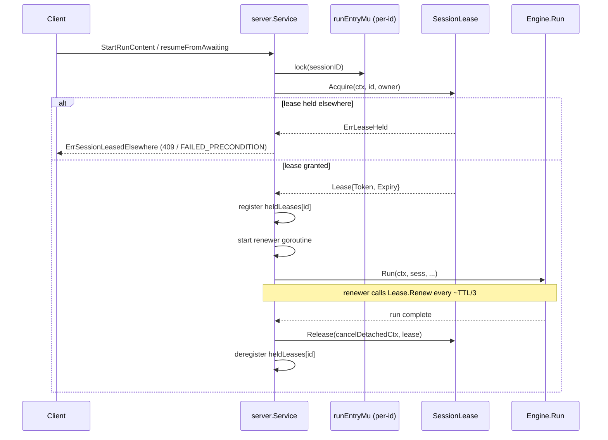

# SessionLease

`port.SessionLease` is the optional cross-process single-writer seam that prevents two replicas from driving the same session concurrently. It is the distributed lock for session ownership.

---

## What it solves

Mecatl stores session state in a `SessionStore` (JSONL on disk, Redis, or an in-memory map). In a **single-replica deployment** with session affinity, this is safe — only one process ever touches a given session. In a **multi-replica deployment** without affinity routing (or after a replica restarts mid-run), two workers could acquire the same session snapshot, drive independent turns, and silently diverge. The conversation grows incoherent and neither writer can detect the collision.

`SessionLease` is the cross-process lock that closes this gap. Before a run starts, the service layer acquires a lease on the session id. A competing replica that arrives while the lease is live gets `ErrSessionLeasedElsewhere` (gRPC `FAILED_PRECONDITION` / HTTP 409) instead of a silently-diverged run. The in-process mutex stays in place too — the lease sits on top of it, not in place of it.

---

## The interface

`port.SessionLease` lives in `engine/port/lease.go`. The loop never imports it — acquisition, renewal, and release are all `internal/adapter/server.Service` concerns.

```go
// engine/port/lease.go

type SessionLease interface {
    // Acquire grants the lease for id to owner. Succeeds when the lease is free,
    // expired, or already held by owner. Returns ErrLeaseHeld when a different,
    // still-live owner holds it.
    Acquire(ctx context.Context, id session.SessionID, owner string) (Lease, error)

    // Renew extends the lease the caller still holds, returning a fresh Lease with
    // a new Expiry and the same Token. Returns ErrLeaseHeld when the caller no
    // longer holds the lease — the loss signal, interpreted as "cancel the run".
    Renew(ctx context.Context, l Lease) (Lease, error)

    // Release relinquishes the caller's hold. Idempotent: releasing an unheld or
    // unknown lease, or one whose owner/token no longer match, is a no-op success.
    Release(ctx context.Context, l Lease) error
}
```

The `Lease` value type carries four fields:

|Field|Type|Meaning|
|-|-|-|
|`SessionID`|`session.SessionID`|The session this lease guards|
|`Owner`|`string`|The holding process's owner-identity string (e.g. `<hostname>-<pid>-<build-nonce>`); composition builds it once per `app.Build`|
|`Token`|`uint64`|Monotone fencing epoch; advances on every takeover (free/expired/other-owner → new holder), stable across a successful `Renew`|
|`Expiry`|`time.Time`|Wall-clock instant the lease lapses if not renewed|

Implementations return `port.Lease` as an immutable value. `Acquire` and `Renew` return a fresh value — callers store the returned value, never mutate one in place.

Two sentinel errors:

- **`port.ErrLeaseHeld`** — a competing, live owner holds the lease. Transient: the holder may release or its lease may expire. The run-entry gate maps this to `ErrSessionLeasedElsewhere`; a `Renew` returning this cancels the in-flight run.
- **`port.ErrLeaseUnsupported`** — the backend cannot lease at all (for example, a remote gRPC driver answering `UNIMPLEMENTED`). Sticky-disable: composition logs one INFO and stops consulting the seam, degrading to the byte-identical no-lease path.

---

## How it fits in the service layer

The lease is owned entirely by `internal/adapter/server.Service`. The agent loop (`engine/agent`) is lease-agnostic and must never import `port.SessionLease`.



Key points from the implementation:

- `Acquire` is called **after** `s.runEntryMu.lock(id)` so the in-process mutex gate fires first. Both are held for the lifetime of the run.
- Release uses a **cancel-detached context** (the same pattern as `appendEvent` for the durable event log) — a dead client's cancelled context cannot abort the lease release.
- A `Renew` returning `ErrLeaseHeld` means another process took over (the TTL lapsed). The renewer goroutine cancels the run so the rogue-run scenario becomes a clean, recoverable cancellation rather than a diverged write.
- The `heldLeases` registry on `Service` ensures SIGTERM-time cleanup: the shutdown path iterates the registry and releases all held leases, so survivors take over immediately rather than waiting for TTL expiry.

---

## The four reference implementations

Deploy them in this order as you scale up:

|Backend|Package|Flag|Use case|
|-|-|-|-|
|`memlease`|`engine/adapter/memlease`|(none — explicit construction)|Tests, offline, single-replica|
|`flocklease`|`internal/adapter/flocklease`|`--session-lease-dir <dir>`|Single host, multiple processes|
|`k8slease`|`internal/adapter/k8slease`|`--session-lease-k8s-namespace <ns>`|Kubernetes multi-replica (mecak8s)|
|`grpcdriver`|`internal/adapter/grpcdriver`|`--session-lease-url <host:port>`|Remote or multi-host lease service|

### `engine/adapter/memlease` — in-process reference

`memlease.New(clock port.Clock, ttl time.Duration) *memlease.Lease` constructs the in-process reference implementation. It keeps per-session records in a mutex-guarded map and derives expiry from an injected `port.Clock`, so tests advance a fake clock past the TTL to exercise expiry and takeover without real sleeps.

This is the backend the conformance suite validates against. The
`memstore.NewLease` constructor exists for explicit in-process/test construction
when exercising the lease seam; it is not a standard deployment backend selected
by a flag.

`memlease` is useful for tests and for single-replica deployments where you want the full lease lifecycle exercised. It is **not** a cross-process lock — two distinct OS processes each construct their own map and are invisible to each other.

### `internal/adapter/flocklease` — single-host file locking

`flocklease` provides cross-process single-writer enforcement on a single host by holding `flock(2)` advisory locks on per-session files under `--session-lease-dir`. Two mecated processes sharing the same store directory can lock-coordinate without a network dependency.

Select it with `--session-lease-dir <dir>`. The directory must exist and be writable by all competing processes. Per-session lock files are created on first acquire and removed on release.

### `internal/adapter/k8slease` — Kubernetes coordination leases

`k8slease` uses `coordination.k8s.io` `Lease` objects in a Kubernetes namespace. This is the backend mecak8s wires by default.

Select it with `--session-lease-k8s-namespace <ns>`. The ServiceAccount running the pod needs `get,create,update,delete` on `leases` in `coordination.k8s.io` in that namespace (see the RBAC template in `deploy/helm/mecak8s/templates/rbac.yaml`).

On SIGTERM, mecak8s iterates `Service.heldLeases` and releases every held lease before exiting. A survivor pod acquires the freed leases immediately rather than waiting for TTL expiry. Interrupted sessions are recoverable from the Redis snapshot on the successor pod.

---

## The default path

When no `--session-lease-*` flag is given, a local JSONL `--store-dir` automatically
uses the flock backend at `<store-dir>/.session-leases`. This makes every current
local composition participate in the same cross-process run-entry and maintenance
exclusion. A store without a local directory uses its own `port.SessionLease` when
implemented; otherwise the composition remains unleased and destructive maintenance
fails closed. The in-process per-id mutex still serializes same-process requests.

:::note[Auto-wiring is intentional]

`memstore` deliberately does NOT implement `port.SessionLease` directly: it is
process-private, so its in-process mutex is already an independent single-writer
proof. The `memstore.NewLease` constructor exists so the type-assert discovery path
can be exercised, but it is never auto-wired.

:::

The sticky-disable path handles a backend that unexpectedly returns `ErrLeaseUnsupported` at runtime (for example, a remote gRPC driver without a lease implementation). Composition logs a single INFO and stops consulting the seam, degrading cleanly rather than treating every run as `ErrSessionLeasedElsewhere`.

---

## Conformance suite

`engine/adapter/leaseconformance` validates any `port.SessionLease` implementation. Call `leaseconformance.Run` with a factory that returns a fresh lease plus an `advance(time.Duration)` callback that pushes the lease's clock forward:

```go
leaseconformance.Run(t, func(t *testing.T) (port.SessionLease, func(time.Duration)) {
    clk := adapter.NewFakeClock()
    l := memlease.New(clk, leaseconformance.TTL)
    return l, clk.Advance
})
```

The suite never sleeps — `advance` is how it crosses the TTL boundary. A real-clock backend may implement `advance` as a short sleep over a small TTL. The suite exercises:

- Fresh acquire succeeds
- Renew extends expiry, keeps the same token
- Release frees the lease for another owner
- Competing acquire by a different owner returns `ErrLeaseHeld`
- Same-owner re-acquire keeps the token
- Token is strictly greater on a takeover (release or expiry)
- `ErrLeaseHeld` on Renew after expiry-and-takeover
- Release is idempotent
- Token is monotone across a full takeover chain
- Distinct session ids lease independently

---

## When to implement your own

The four reference backends cover in-process testing, single-host file locking,
Kubernetes coordination, and a remote gRPC lease service. Implement your own
`port.SessionLease` if you have an existing distributed lock service that none
covers — for example, etcd, DynamoDB conditional writes, or a Redis-backed lock
primitive that isn't using the k8s API.

The interface is small (three methods, one value type), the conformance suite validates the contract mechanically, and the composition layer wires it with zero loop changes. A custom backend is a sibling of `flocklease` and `k8slease` under `internal/adapter/`.

---

## What's next

- [Pick your deployment shape](/building/getting-started/deployment-decision.md) — when to add a lease backend and which one to choose.
- [SessionStore & EventLog](session-store.md) — the session persistence port; the lease sits on top of it.
- [Cloud-native deployment (mecak8s)](/building/deployment/mecak8s.md) — the k8s topology that wires the `k8slease` backend and Redis together.
- [Hook system](/building/what-you-get/hooks.md) — other service-layer lifecycle seams.
