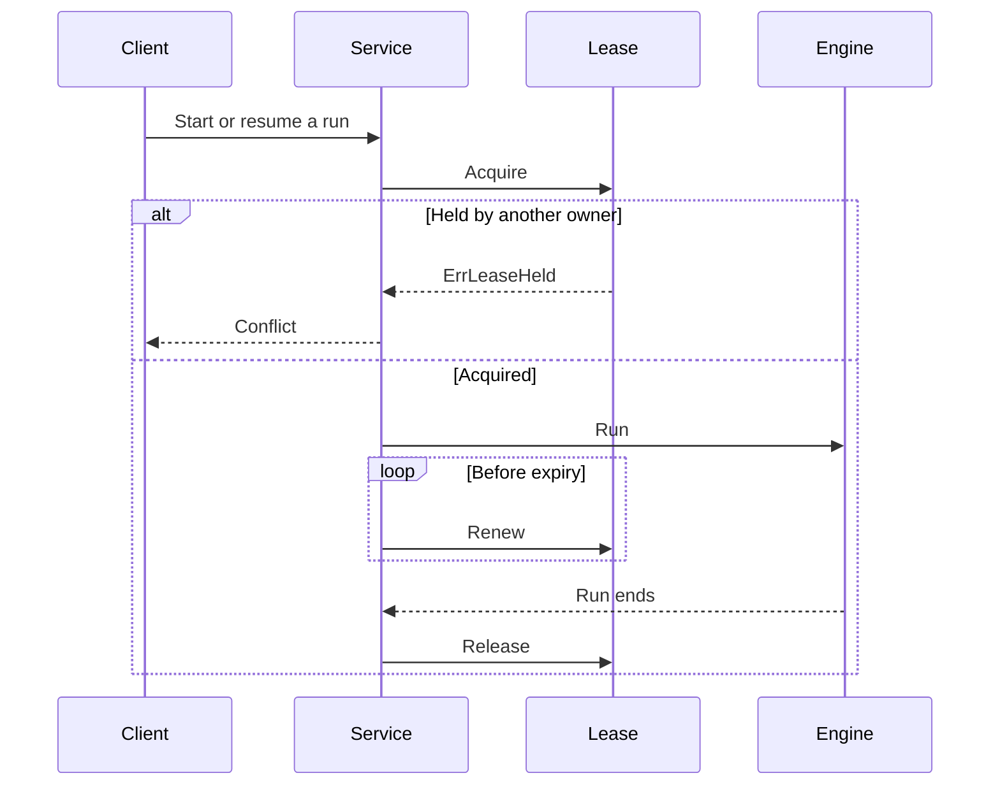

# SessionLease

`port.SessionLease` gives one process temporary ownership of a session. Add it
when requests for the same session can reach more than one process.

The server acquires this lease in addition to its per-session in-process lock. A
competing process receives `ErrSessionLeasedElsewhere` instead of driving a
divergent copy of the session.

## The interface

```go
type SessionLease interface {
    Acquire(
        ctx context.Context,
        id session.SessionID,
        owner string,
    ) (Lease, error)

    Renew(ctx context.Context, lease Lease) (Lease, error)
    Release(ctx context.Context, lease Lease) error
}
```

`Lease` is an immutable value:

|Field|Meaning|
|-|-|
|`SessionID`|Session protected by the lease|
|`Owner`|Identity of the holding process|
|`Token`|Monotonic fencing epoch for the session|
|`Expiry`|Time at which the lease can lapse|

`Acquire` succeeds when the lease is free, expired, or already held by the same
owner. A takeover must return a token greater than every previous token for that
session. A same-owner reacquisition can retain the token.

`Renew` returns a new value with the same token and a later expiry. Store the
returned value. Return `port.ErrLeaseHeld` when the caller has lost ownership;
the server treats this as a signal to cancel the run.

`Release` removes only the caller's own hold. It is idempotent when the lease is
unknown, expired, or owned under another token.

Return `port.ErrLeaseUnsupported` only when the backend cannot provide leases at
all. This is different from a transient infrastructure error. Mecatl stops
consulting a backend that reports this sentinel.

Implementations must support concurrent operations for different session IDs.

## Lease lifecycle

The server owns acquisition, renewal, and release. The agent loop does not
depend on `SessionLease`.



The server acquires the lease after its in-process lock and holds both for the
run. It renews at approximately one-third of the configured TTL. Release uses a
context detached from client cancellation.

If renewal reports `ErrLeaseHeld`, the server cancels the active run and does
not release the stale lease value. Shutdown releases leases that the process
still holds.

## Choose a supplied backend

|Backend|Package|Use|
|-|-|-|
|In-memory|`engine/adapter/memlease`|Tests and explicit single-process lifecycle testing|
|File lock|`internal/adapter/flocklease`|Several processes on one host|
|Kubernetes Lease|`internal/adapter/k8slease`|Multi-replica Kubernetes deployments|
|gRPC driver|`internal/adapter/grpcdriver`|Remote or multi-host lease service|

`memlease` does not coordinate separate processes. It accepts an injected
`port.Clock`, which lets tests advance time without sleeping.

`flocklease` stores advisory lock files in a directory shared by all competing
processes. It is limited to one host.

`k8slease` uses `coordination.k8s.io` Lease objects. The service account needs
`get`, `create`, `update`, and `delete` access to leases in the configured
namespace.

## Configure the shipped service

`mecated` accepts these explicit lease backends:

|Option|Backend|
|-|-|
|`--session-lease-dir <PATH>`|Single-host file locks|
|`--session-lease-k8s-namespace <NAMESPACE>`|Kubernetes Lease objects|
|`--session-lease-url <HOST:PORT>`|gRPC lease driver|

A local JSONL `--store-dir` automatically uses file locks under
`<STORE_DIR>/.session-leases`. A store can also provide `SessionLease` directly.
Otherwise, the deployment remains unleased and destructive maintenance is
unavailable unless the deployment proves single-process ownership.

`mecak8s` configures the Kubernetes lease backend with Redis session storage.

## Implement a backend

Implement `SessionLease` when your infrastructure already provides a distributed
locking primitive, such as etcd or a database conditional write. Preserve these
properties:

1. A live lease has at most one owner.
1. Takeovers increase the token.
1. Successful renewals retain the token.
1. Ownership loss wraps `ErrLeaseHeld`.
1. Release never removes another owner's hold.

Validate the implementation with `engine/adapter/leaseconformance`:

```go
func TestLease(t *testing.T) {
    leaseconformance.Run(t, func(
        t *testing.T,
    ) (port.SessionLease, func(time.Duration)) {
        clock := newFakeClock()
        lease := newLease(clock)
        return lease, clock.Advance
    })
}
```

The suite covers acquisition, renewal, release, expiry, takeover, monotonic
tokens, idempotency, and session isolation.

## Next steps

- [Implement session storage](session-store.md).
- [Deploy Mecatl on Kubernetes](/building/deployment/mecak8s.md).
- [Choose a deployment](/building/getting-started/deployment-decision.md).
