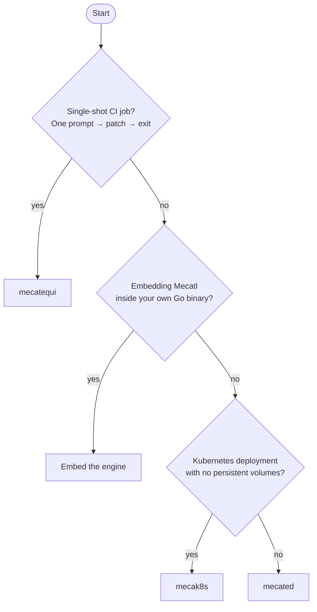

# Pick your deployment shape

Mecatl has one agent core and several deployment shapes. `mecated` and
`mecak8s` differ mainly in how you operate the service and store durable state.
`mecatui` is a terminal client for an embedded or remote server, while
`mecatequi` handles single-run CI work. You can also embed the engine in your
own Go application.

Use this page to choose the operational boundary that fits your environment.

## Decision tree

If you chose **mecated** but need multiple replicas without affinity routing,
add a session lease backend and an external store such as the gRPC driver. You
can instead use **mecak8s**, which enables Kubernetes Leases by default and uses
Redis when you configure `--redis-url`.

## Shape summary

| Shape | When to choose | State model | Key dependency |
|-------|---------------|-------------|----------------|
| **Embed the engine** | You own the binary and want the loop in-process | You own it — implement the ports | The standalone Go engine module |
| **mecated** | Single server, interactive clients (TUI, IDE), or a controlled service deployment | In-memory, JSONL on disk, or gRPC driver | A running process; durable local sessions need a PV or shared storage |
| **mecak8s** | Kubernetes, no persistent volumes, multi-replica | Configured Redis + Kubernetes `coordination.k8s.io` lease | Redis StatefulSet + k8s RBAC for `leases` |
| **mecatequi** | GitHub Actions (or any CI): label/comment → patch → PR | None — stateless per run | LLM provider key; GitHub Actions runner |

## Embed the engine

Import `github.com/stacklok/mecatl/engine` and wire the ports yourself. The engine module's runtime dependency closure is `doublestar`, `robfig/cron/v3`, `github.com/goccy/go-yaml`, `golang.org/x/net`, `golang.org/x/sync`, and `mvdan.cc/sh/v3`; `goleak` is test-only. Nothing from Mecatl's heavy require cone (OpenAI/Anthropic SDKs, gRPC, the TUI, client-go) enters your build graph.

You implement `port.LLMProvider`, `port.SessionStore`, and the rest using the reference adapters under `engine/adapter/` as a starting point, or bring your own. You get the agent loop, the full tool catalog, the permission model, hooks, subagent delegation, and compaction with no binary dependency.

The cost: you own the composition. There is no out-of-the-box server, no auth layer, no gRPC surface, and no Kubernetes manifests. This is the right choice when Mecatl needs to run inside an existing service and you want fine-grained control over every dependency — not when you want something running quickly.

## mecated

`mecated` is the standalone Mecatl server. It serves gRPC and HTTP/SSE and
provides authentication, rate limiting, observability, graceful shutdown, and
the full operator configuration surface.

It defaults to loopback-only binds with no auth — the single-user localhost trust model. Before exposing off-loopback, configure `--auth-token` and TLS. A non-loopback bind with no auth generates a loud startup warning but does not hard-fail, because a service mesh may legitimately front it.

Sessions are in-memory by default (`--store-dir ""` means no persistence). Add `--store-dir` for JSONL persistence on disk; it automatically uses a single-host flock lease under the store root. Remote or multi-host stores still need a Kubernetes or gRPC session-lease backend for cross-process single-writer enforcement.

You must operate the process and its storage. Multiple replicas without affinity
routing also require a lease backend. If storage-free Kubernetes pods are a
requirement, use `mecak8s` instead.

## mecak8s

The production `mecak8s` Helm deployment runs two replicas by default with no PVC: configured Redis holds session state, and single-writer enforcement uses `coordination.k8s.io` Leases. Set `replicaCount: 1` for a supported single-pod deployment when lower resource usage and simpler session routing matter more than high availability. In that mode, planned drains and pod failures can cause downtime; the chart omits the PDB because there is no second pod to protect. The pod is disposable for durable state: on graceful SIGTERM it drains and releases its leases so a successor can take over; after a crash, a successor waits for the lease TTL. Interrupted sessions are recoverable from the last persisted Redis snapshot on a later run.

`mecak8s` inverts `mecated`'s interactive defaults: `--headless` is on and
`--posture` defaults to `auto`. It is optimized for unattended daemon operation,
but it can serve interactive remote clients when configured with
`--headless=false`.

The `deploy/helm/mecak8s/` Helm chart provides the production deployment contract: namespace-scoped RBAC for `leases`, a storage-free agent Deployment (two replicas by default, or one when explicitly configured), Service, and a PodDisruptionBudget for the multi-replica mode. The production profile does not create Redis and does not ship a general workload NetworkPolicy; the Kind/local profile can create a disposable Redis fixture, and enabling OIDC can render a narrow raw-driver NetworkPolicy. General network isolation remains the cluster policy layer.

Redis is required, either as a managed service or an in-cluster StatefulSet. The
ServiceAccount needs `get`, `create`, `update`, and `delete` access to `leases`
in `coordination.k8s.io`. `mecak8s` does not expose the Prometheus/OTel admin
surface or the `perf-mcp` subcommand. `mecated` is not a drop-in alternative for
this topology because it does not support `--redis-url`.

## mecatequi

`mecatequi` is the single-shot headless runner: one prompt in, a git diff patch + a machine-readable summary JSON + an exit code out. It is forge-agnostic — it knows nothing about GitHub. The GitHub glue (issue extraction, PR creation, split-privilege job graph) lives in `.github/` workflows and shell scripts, not in the binary.

The standard adoption path is the reusable workflow (`mecatequi-reusable.yml`, `on: workflow_call`): a ~15-line caller in your repo, no vendored scripts, the same split-privilege job graph (acknowledge → implement → publish) with the agent job holding only the LLM key and no write token, and the publish job applying the patch as data with no agent code.

The exit code is not "task accomplished" — read `stop-reason` and `non-empty-diff` from the action outputs to decide whether real work landed. Exit 0 means the run completed cleanly; it does not mean the result is useful.

There is no session continuity across runs. If you need to resume earlier work,
inspect subagents across invocations, or serve interactive clients, choose
another shape.

## What's next

Once you've picked a shape, see the deployment guide for it:

- [Embed the engine directly](/building/deployment/embed-engine.md)
- [Run mecated standalone](/building/deployment/mecated.md)
- [Cloud-native k8s with mecak8s](/building/deployment/mecak8s.md)
- [Single-shot CI with mecatequi](/building/deployment/mecatequi.md)
