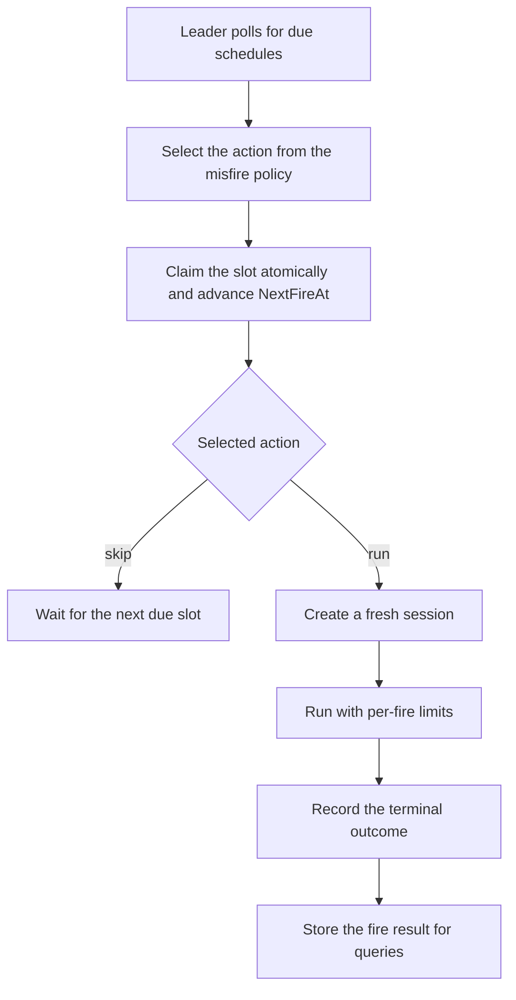

# Scheduled tasks

Scheduled tasks run a saved prompt on a cron cadence or once at a future time.
Mecatl persists the schedule and uses at-most-once slot claiming across
replicas, so no human needs to be present when the task fires.

Each fire creates a bounded run with a fixed posture. Mutating work requires an
explicit opt-in, and recovery uses the same run-entry path as an interactive
run.

Scheduling belongs to the composition layer rather than `engine/agent`. Each
fire creates a fresh session; composition owns the tick loop, cron parsing, and
leader lease.

## The `port.ScheduleStore` seam

`port.ScheduleStore` (`engine/port/schedule.go`) is a durable schedule registry,
parallel to `port.SessionLease` and `port.EventLog`. Composition discovers it by
type assertion and disables scheduling when the backend does not implement it.

A `Schedule` splits into two halves:

- **`ScheduleSpec`** — the immutable "what to run and when": name, prompt (or
  multimodal `Parts`), trigger (cron XOR one-shot), provider/model selector,
  profile, workspace, permission mode, per-fire limits, the `Mutating` opt-in,
  `MaxFires`, misfire policy, singleton flag, and timezone.
- **`ScheduleState`** — the mutable firing progress: `NextFireAt`, `LastFireAt`,
  `FireCount`, `Enabled`, and `LastFireSessionID`.

The store is ground truth. An in-memory timer, if one exists, is only a derived
lookahead over it — never the source of truth.

### At-most-once via claim-before-fire

The core contract is `Claim`: it atomically advances `NextFireAt` **before** the
fire runs, along with `LastFireAt`, `FireCount`, and a `LastFireSessionID`
placeholder (`port.PendingFireSessionID`). Once a slot is claimed, a peer
replica's `Due` no longer returns it, so a second `Claim` on the same slot is
structurally impossible. There's no owner/claim-holder field the way
`SessionLease` has one — the durable `NextFireAt` advance _is_ the fence.

The trade-off: a crash mid-fire skips the slot, because the advance already
happened. A recurring schedule self-heals on the next tick via the misfire
policy; a one-shot fire can be lost. This is the documented cost of at-most-once
slot claiming without a distributed transaction.

`ClaimNow` is the manual-trigger sibling — the same atomic advance, but without
the due-check, so an operator can force an immediate fire that still claims
atomically.



### Store adapters

|Adapter|Package|Fit|
|-|-|-|
|Reference / in-memory|`engine/adapter/memschedulestore`|Tests, offline development|
|Single-host durable|`internal/adapter/store/jsonlstore`|One `mecated` replica with a local store directory|
|Multi-replica durable|`internal/adapter/redisstore`|`mecak8s` or any multi-replica deployment sharing a Redis backend, using a Lua script for the atomic `Claim`|

All three pass the shared `engine/adapter/scheduleconformance` test suite, so
they behave identically from a caller's perspective. A deployment gets
scheduling over its configured durable store via type assertion; `mecated` can
alternatively select a remote schedule store with `--schedule-store-url`. When
OIDC caller ownership is enabled, the selected schedule store must also provide
atomic create-only publication (`port.ScheduleCreator`); current remote
schedule-store drivers do not, so that combination is rejected at startup rather
than falling back to a racy check-then-upsert.

Cron expressions themselves are parsed by `engine/adapter/cronparse`, a thin
wrapper over `robfig/cron/v3`'s standard parser. The store never interprets the
expression it's given — it stores the raw string verbatim; the caller
(composition) computes the next fire time and hands it to `Claim`.

## The tick loop and leader-lease gating

`internal/adapter/scheduler` runs the tick loop. On each tick it: polls `Due`,
applies the misfire policy, calls `Claim` to win the slot, invokes the
`FireFunc` composition seam, then calls `RecordFire` with the outcome.

In a multi-replica deployment, a leader lease on `__scheduler__`
(`port.SchedulerLeaderLeaseID`) limits polling to one replica. The `Claim`
fence, rather than the lease, prevents duplicate fires. Without a lease backend,
the scheduler assumes a single replica with affinity and logs a startup warning
about the multi-replica risk.

### Misfire policy

Read from `ScheduleSpec.Misfire` at tick time (not by the store itself):

|Policy|Behavior|
|-|-|
|`MisfireFireOnceNow` (default)|Fires once immediately for a missed slot, then resumes the normal cadence. Does not cascade — a slot missed by an hour fires once, not sixty times.|
|`MisfireSkip`|Skips the missed slot entirely and waits for the next due fire. `Claim` still advances `NextFireAt` (so the slot isn't re-returned), but `Fire` is never called.|

### The singleton guard

A schedule's `Singleton` flag (effectively always `true` in the current release
— see the note under [the tick loop](#the-tick-loop-on-by-default) below) skips
a fire if a prior fire of the same schedule is still running. The liveness check
is a trial acquire of the per-session lease on
`ScheduleState.LastFireSessionID`: a still-held lease means the prior fire is
genuinely in flight (skip); a released or expired lease means it finished or
crashed (fire freely, self-healing).

### Fresh session per fire

Each fire mints a brand-new top-level session (a `sched--`-prefixed id on the
create-failure fallback path; ordinarily whatever id session creation mints) via
the same `CreateSessionWithProfile` + `StartRunContent` calls any client uses,
with subagent-grade defaults: bounded turn/tool-call budgets, a read-leaning
posture unless the schedule opts into `Mutating: true`, and a headless ask model
(there's no human to answer a permission prompt at fire time). There is no
"schedule session" reused across fires — every fire starts with a fresh context.
A schedule that needs continuity across fires (say, yesterday's digest) has to
persist that itself, via memory or a file, and re-load it in the prompt.

The fire's conversation, tool calls, and usage live in `SessionStore` under its
session ID. `ScheduleFire` records the fire ID, session ID, start time, terminal
stop reason, and any error. Result delivery is pull-only: callers poll `GetFire`
or `ListFires`.

## Host composition surfaces: in-chat, gRPC, and REST

The engine exposes the `ScheduleStore` and scheduler seams; it does not expose
an HTTP server or gRPC service. The model-facing `Schedule` tool and the
gRPC/REST surfaces below are supplied by host composition. They use the same
validated The in-chat `Schedule` tool supports `create`, `list`, `inspect`,
`pause`, `resume`, `delete`, and `fire`; it is registered only when the
session's store provides a `ScheduleStore`.

**gRPC** — `mecatl.v1.ScheduleService`
(`contracts/proto/mecatl/v1/schedule.proto`): `CreateSchedule`, `GetSchedule`,
`ListSchedules`, `UpdateSchedule`, `DeleteSchedule` (idempotent), `FireNow`,
`PauseSchedule`, `ResumeSchedule`, `GetFire`, `ListFires`.

**REST** (under `/v1/schedules`):

|Method|Route|RPC|
|-|-|-|
|POST|`/v1/schedules`|CreateSchedule|
|GET|`/v1/schedules`|ListSchedules|
|GET|`/v1/schedules/{name}`|GetSchedule|
|PUT|`/v1/schedules/{name}`|UpdateSchedule|
|DELETE|`/v1/schedules/{name}`|DeleteSchedule|
|POST|`/v1/schedules/{name}/fire`|FireNow|
|POST|`/v1/schedules/{name}/pause`|PauseSchedule|
|POST|`/v1/schedules/{name}/resume`|ResumeSchedule|
|GET|`/v1/schedules/{name}/fires`|ListFires|
|GET|`/v1/schedules/{name}/fires/{id}`|GetFire|

A backend whose store doesn't expose a `ScheduleStore` (the plain in-memory
session store, for instance) honestly reports every schedule RPC as
`Unimplemented` (gRPC) / 501 (HTTP) rather than pretending to work. `FireNow` on
a paused or exhausted schedule is `FailedPrecondition` / 412; an unknown
schedule or fire is `NotFound` / 404.

Creating a cron schedule and forcing an immediate fire over REST:

```sh
# Create a cron schedule (read-leaning -> plan mode).
curl -X POST http://localhost:8080/v1/schedules \
  -H 'content-type: application/json' \
  -d '{"name":"nightly-report","prompt":"summarize commits from today",
       "workspace":"/repo","mode":"PERMISSION_MODE_PLAN",
       "trigger":{"cron":"0 9 * * *"}}'

# Fire it immediately. FireNow is synchronous-to-terminal: it blocks until
# the fire's run completes (bounded by the schedule's turn/token limits),
# then returns the fire_id + session_id. Set a generous client deadline —
# the fire keeps running server-side even if the client disconnects.
curl -X POST http://localhost:8080/v1/schedules/nightly-report/fire
# -> {"fire_id":"sched--...","session_id":"sched--..."}

# Retrieve the persisted fire record (stop reason + session id) after the run.
curl http://localhost:8080/v1/schedules/nightly-report/fires/<fire_id>
```

### The tick loop (on by default)

The tick loop is **ON by default** whenever the configured store exposes a
`ScheduleStore` — no enable flag exists anymore (the old `--scheduler` opt-in
was removed outright and fails fast as an unknown flag):

```sh
mecated serve --store-dir ./state --scheduler-tick-interval 30s   # ticks by default
mecak8s --redis-url redis.example:6379 --redis-tls          # multi-replica, ticks by default
mecated serve --store-dir ./state --no-scheduler                  # opt out (manual management still works)
```

|Flag|Default|Description|
|-|-|-|
|`--no-scheduler`|`false`|Disable the in-process scheduler tick loop (ON by default on any schedule-capable store). The create/list/fire API and the in-chat `Schedule` tool still work — manual management is independent of the tick loop.|
|`--scheduler-tick-interval`|`30s`|How often the tick loop polls `ScheduleStore.Due`.|
|`--scheduler-min-interval`|`1m`|The frequency floor enforced at schedule-create time — a schedule tighter than this is rejected, fail-closed, by BOTH the in-chat `Schedule` tool and the REST/gRPC create. Defaults to `1m` so an on-by-default scheduler plus the floor-Allow `Schedule` tool cannot mint an unbounded tight-cadence recurring fire out of the box; set it explicitly to tighten, or to `0` to disable the floor.|
|`--scheduler-max-concurrent-fires`|`4`|Bounds the per-tick fire fan-out.|

:::note[Singleton is currently always effectively true]

The create-seam coerces `singleton: false` to `true` (overlap suppression is
always on). Full opt-out — allowing overlapping fires of the same schedule —
needs an engine-port/proto change and is deferred to a later release.

:::

There's also a read/manage overlay in the `mecatui` TUI (`/schedule`, gated on
the connected server advertising a reachable `ScheduleStore`): it lists
schedules with their trigger, enabled state, and fire counts, supports
pause/resume/fire-now/delete, and has an in-overlay create form with
natural-language-to-cron conversion.

## Events and metrics

The scheduler emits a lifecycle event for each fire — `EvScheduleFired`,
`EvScheduleSkipped`, or `EvScheduleFailed` (`session.SchedulePayload`) —
appended to the fire session's durable event log, so schedule lifecycle rides
the same log as the fire's own events. Delivery is durable-log-only: pull it via
`GetFire`/`ListFires`. A skipped fire (which never gets a session) has no
durable log to land in, so it surfaces only through the operator diagnostic
stream.

Two metrics instruments are emitted:

|Metric|Type|Labels|Notes|
|-|-|-|-|
|`mecatl.schedule.fires`|Counter|`outcome` = `fired`/`skipped`/`failed`|One increment per tick-loop decision|
|`mecatl.schedule.fire_duration`|Histogram (seconds)|—|Due-to-terminal duration; skipped fires record no duration|

Neither carries a role label — a fire's own run already reports `role="main"` on
its usual per-run metrics.

## Shutdown and in-flight fires

Quitting an embedded `mecatui` (or stopping a `mecated`) runs a **bounded**
shutdown (issue #388): an in-flight fire is **cancelled**, its session snapshot
is persisted as `cancelled` (recoverable on the next run via the normal resume
path, never left permanently `running`/`pending`), and the whole cleanup is
capped — it cannot hang on a stuck fire, MCP server, or gRPC stream. A second
`SIGINT`/`SIGTERM` during cleanup forces an immediate exit. See the
[mecatui shutdown contract](https://github.com/stacklok/mecatl/blob/main/docs/tui.md#shutdown)
for the per-layer timeout budget.

## Live-fire notifications reconnect automatically

When a fire's result reports back into the conversation that created it,
`mecatui` receives it over a live session feed. If that feed drops (a server
restart, a network blip, a proxy idle timeout), the TUI now **reconnects
automatically** with bounded backoff and catches up on any delivery note emitted
during the gap — rendering it exactly once — instead of silently going quiet
(issue #387). Each live-feed reopen attempt is bounded, so a wedged transport
returns to the same retry path rather than leaving the reconnect loop stuck
forever. A brief "live feed reconnecting…" cue shows in the footer while it
recovers; no reload or re-prompt is needed.

## Watching a fire while it runs

A fire is observable **in-flight**, not only after it completes (issue #386).
`ScheduleQuery inspect` (and the `/schedule` overlay, and the gRPC/HTTP schedule
surface) show a claimed fire as `in-flight: claimed (session pending)` the
moment it's picked up — never an ambiguous "no fires" — then `in-flight` with
its start time, last-progress time, and deadline while it runs. You get a
"started" notice in the originating conversation as soon as the fire's session
exists, and the terminal result when it finishes.

Each fire has a **wall-clock deadline** (`fire_timeout` on the schedule spec; a
30-minute default otherwise). A fire that runs past it terminates with a
`timeout` stop reason — distinguishable from a manual cancel — and its session
stays recoverable. If the process crashes mid-fire, the next leader reconciles
the orphaned fire to a terminal `timeout`/`error` record instead of leaving it
`pending` forever, so a crashed fire is never mistaken for a live one.

## What's next

- [Operator deployment — mecated](/building/deployment/mecated.md) for the full
  flag reference and how the scheduler fits into a running server.
- [The agent loop](/building/what-you-get/agent-loop.md) for what actually
  happens inside a fire's session once it starts.
- [Extension points — session store](/building/extension-points/session-store.md)
  for implementing a custom backend that also wants to back scheduled tasks.
