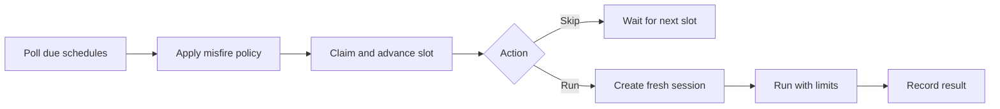

# Scheduled tasks

Scheduled tasks run a saved prompt on a cron cadence or once at a future time.
Each fire creates a fresh, bounded session with a fixed posture. Mutating work
requires an explicit opt-in.

Mecatl persists schedules and claims each slot before running it. This provides
at-most-once execution across replicas without requiring a connected client.

## Schedule storage

A schedule-capable backend implements `port.ScheduleStore`. Scheduling remains
unavailable when the selected store does not implement that interface.

|Adapter|Best fit|
|-|-|
|`engine/adapter/memschedulestore`|Tests and offline development|
|`internal/adapter/store/jsonlstore`|One server with local durable storage|
|`internal/adapter/redisstore`|Multiple replicas sharing Redis|

`mecated` can also select a remote store with `--schedule-store-url`. With OIDC
ownership enabled, the store must support atomic create-only publication.
Current remote schedule-store drivers do not, so Mecatl rejects that combination
at startup.

The store keeps cron expressions as raw strings. Composition parses them,
computes `NextFireAt`, and passes the next time to `Claim`. Implementations must
make `Claim` atomic and pass the shared `engine/adapter/scheduleconformance`
suite.

Each schedule contains:

- An immutable specification with the prompt, trigger, model selection,
  workspace, permission mode, limits, mutation opt-in, timezone, and fire rules.
- Mutable state with the next and previous fire times, count, enabled state, and
  latest fire session.

The durable store is authoritative. In-memory timers are only a lookahead.

## Claiming and recovery

`Claim` atomically advances the schedule before the run starts. After one
replica claims a slot, other replicas no longer see it as due.



A crash after claiming can skip that slot. A recurring schedule reaches its next
slot normally; a one-shot schedule can be lost. This is the tradeoff for
at-most-once execution without a distributed transaction. `ClaimNow` provides
the same atomic behavior for manual fires.

A leader lease limits polling to one replica, but the claim prevents duplicate
fires. Without a lease backend, Mecatl assumes a single replica with affinity
and logs a warning.

### Misfire policy

|Policy|Behavior|
|-|-|
|`MisfireFireOnceNow`|Run once for missed slots, then resume the cadence. This is the default.|
|`MisfireSkip`|Advance past the missed slot without running it.|

With `port.SessionLease` wired, Mecatl prevents overlapping fires from the same
schedule. It trial-acquires the lease for `LastFireSessionID`: a held lease
skips the slot, while a released or expired lease permits the next fire.
Although the spec includes `Singleton`, creation currently coerces it to `true`.
Custom multi-replica deployments must wire the lease for this check.

### One session per fire

Every fire creates a new session through the normal session and run APIs. Its
fire and session share one `sched--`-prefixed ID. The session uses bounded turn
and tool limits, a read-leaning posture unless `Mutating` is true, and headless
permission behavior. To carry information between fires, store it in project
memory or a file and load it from the prompt.

The session store retains the conversation, tool calls, and usage. The schedule
store records the fire ID, session ID, start time, terminal stop reason, and
error. Use `GetFire` or `ListFires` to retrieve results.

Each fire has a `fire_timeout`, with a 30-minute default. Exceeding it ends the
run with stop reason `timeout` and leaves the session recoverable. The next
leader reconciles a fire orphaned by a process crash into a terminal record.

The conversation is fresh, but the execution placement is stable. Creation resolves one
exact durable ref and each fire reattaches it without following a changed deployment default.
Origin-backed schedules borrow their session's placement. Independent schedules provision one
placement when the provider supports ownership cleanup; MicroVM schedules therefore reuse the
same logical worktree and repository VM across fires and harness restarts. Ownership is durable,
immutable host metadata that public request mappings cannot set. Legacy records default to
borrowed, never owned. Owned deletion atomically refuses a claimed/running fire or persists a
disabled, restart-safe deletion marker. While marked, create/update/pause/resume/fire and one-shot
re-arm cannot mutate the record; inspect/list expose `deletion_pending`, and retry resumes against
the same schedule incarnation. Conditional completion cannot delete a later same-name schedule.
Before the first claim, deletion cleans the owned attachment while retaining dirty state. The first
atomic claim hands placement lifetime to the fire-session lineage; after it, schedule deletion removes
only the record and retains the clean or dirty attachment for historical and resumable fire sessions.
Borrowed, no-FS, host-local, and legacy-ambiguous records preserve the prior idempotent direct-delete
behavior. It never deletes the repository-scoped VM/rootfs, sibling worktrees, or an origin session.

## API and in-chat access

The in-chat `Schedule` tool supports `create`, `list`, `inspect`, `pause`,
`resume`, `delete`, and `fire`. It appears only with a schedule-capable store.

The `mecatl.v1.ScheduleService` gRPC service and `/v1/schedules` REST routes
provide the same operations:

|Method|Route|Operation|
|-|-|-|
|POST|`/v1/schedules`|Create|
|GET|`/v1/schedules`|List|
|GET|`/v1/schedules/{name}`|Inspect|
|PUT|`/v1/schedules/{name}`|Update|
|DELETE|`/v1/schedules/{name}`|Delete|
|POST|`/v1/schedules/{name}/fire`|Fire now|
|POST|`/v1/schedules/{name}/pause`|Pause|
|POST|`/v1/schedules/{name}/resume`|Resume|
|GET|`/v1/schedules/{name}/fires`|List fires|
|GET|`/v1/schedules/{name}/fires/{id}`|Inspect a fire|

Unsupported stores return gRPC `Unimplemented` or HTTP 501. Paused or exhausted
schedules reject `FireNow` with `FailedPrecondition` or HTTP 412.

```sh
curl -X POST http://localhost:8080/v1/schedules \
  -H 'content-type: application/json' \
  -d '{"name":"nightly-report","prompt":"summarize commits from today",
       "workspace":"/repo","mode":"PERMISSION_MODE_PLAN",
       "trigger":{"cron":"0 9 * * *"}}'

curl -X POST http://localhost:8080/v1/schedules/nightly-report/fire
curl http://localhost:8080/v1/schedules/nightly-report/fires/<FIRE_ID>
```

`FireNow` waits for the run to end, but the fire continues server-side if the
client disconnects. Use a generous client deadline.

## Scheduler controls

The tick loop starts automatically when the store supports schedules.

|Flag|Default|Purpose|
|-|-|-|
|`--no-scheduler`|`false`|Disable automatic polling. Manual management and fires remain available.|
|`--scheduler-tick-interval`|`30s`|Set the polling interval.|
|`--scheduler-min-interval`|`1m`|Reject tighter recurring schedules. `0` disables the floor.|
|`--scheduler-max-concurrent-fires`|`4`|Limit fires started during one tick.|

The `/schedule` overlay in `mecatui` lists, creates, pauses, resumes, fires, and
deletes schedules when the server advertises support.

## Events, metrics, and shutdown

Completed fires add `EvScheduleFired`, `EvScheduleSkipped`, or
`EvScheduleFailed` to the fire session's event log. A skipped fire has no
session, so it appears only in operator diagnostics.

|Metric|Measures|
|-|-|
|`mecatl.schedule.fires`|Fire decisions by `fired`, `skipped`, or `failed` outcome|
|`mecatl.schedule.fire_duration`|Time from due slot to terminal result|

During shutdown, Mecatl cancels in-flight fires and persists their sessions as
`cancelled`. Cleanup has a fixed timeout, and a second termination signal exits
immediately.

`mecatui` reconnects a dropped live-fire feed with bounded backoff and resumes
from the durable log. The schedule view shows a fire as soon as it is claimed,
then reports its session, progress, deadline, and terminal result.

## What's next

- [Scheduled tasks](/features/scheduled-tasks.md) for operator workflows.
- [Run `mecated`](/building/deployment/mecated.md) for scheduler flags and
  durable store configuration.
- [Session store extension point](/building/extension-points/session-store.md)
  for the session persistence used alongside a schedule store.
