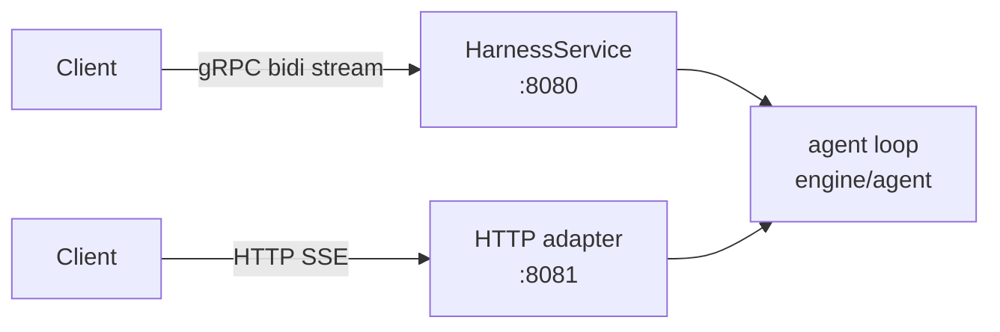
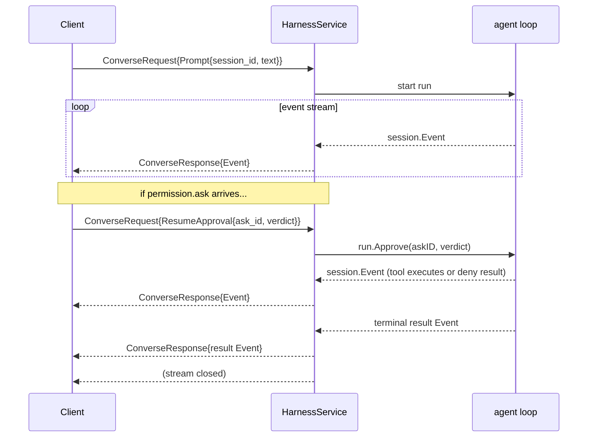

# Drive via gRPC / HTTP

`mecated` and `mecak8s` expose two wire surfaces on the same server process: a gRPC bidirectional streaming API and an HTTP+SSE API. Both carry the same event taxonomy. Use whichever fits your client stack — the event shape, approval protocol, and session lifecycle are identical across both.

The gRPC surface is defined in `contracts/proto/mecatl/v1/harness.proto`. Generated Go bindings live in `contracts/gen/go/mecatl/v1` and are imported as `mecatlv1 "github.com/stacklok/mecatl/contracts/gen/go/mecatl/v1"`.

---

## Two wire surfaces, one event model



| Surface | Transport | Default port | When to use |
|---|---|---|---|
| gRPC `HarnessService` | HTTP/2, proto binary | `:8080` (`--grpc-addr`) | Go clients, generated stubs, low-latency streaming |
| HTTP + SSE | HTTP/1.1 or HTTP/2, JSON | `:8081` (`--http-addr`) | Browser clients, curl, any language with an HTTP library |

Both surfaces share:

- The `session.Event` taxonomy, wire-encoded as proto binary (gRPC) or proto JSON (HTTP).
- The same approval protocol (`ResumeApproval` frame on gRPC, `POST /approve` on HTTP).
- Session state and lifecycle managed by the same in-process `server.Service`.

---

## gRPC service

The service is `mecatl.v1.HarnessService`.

:::note[No server reflection]

`mecated` does not register gRPC server reflection. Point `grpcurl` at the proto file directly. Generated Go stubs are the simplest client path.

:::

### Session RPCs

| RPC | Kind | Purpose |
|---|---|---|
| `CreateSession(CreateSessionRequest)` | unary | Allocate a session; returns `session_id`, `ServerCapabilities`, and `ResolvedModel` |
| `GetSession(GetSessionRequest)` | unary | Snapshot of an existing session (`state`, `mode`, `workspace`, `turns`, `tool_calls`) |
| `SetMode(SetModeRequest)` | unary | Change the session's permission posture; rejected mid-turn with `InvalidArgument` |
| `CloseSession(CloseSessionRequest)` | unary | Release session resources (learned rules, per-session engine); idempotent |
| `Converse(stream ConverseRequest) → stream ConverseResponse` | bidi | Drive one agent run |
| `ForkSession(ForkSessionRequest)` | unary | Fork a peer session from a conversation snapshot (same provider/model); returns `session_id` |

A `CreateSessionRequest` may carry an optional `source_session_id` to **seed the new
session's conversation history** from an existing session (issue #20).  The source
must be on the same provider (`InvalidArgument` otherwise), must be at a turn boundary
(not running/awaiting), and its history is snapshotted via `ForkSnapshot` + `SeedHistory`.
Model is intentionally NOT compared — v1 carries context onto a different model within
the same provider.  This is the back-end of the mecatui `/models` picker's `[c]`
carry-over key.

### Inventory RPCs (read-only, startup snapshots)

| RPC | Purpose |
|---|---|
| `ListModels` | Selectable provider/model inventory (public metadata only) |
| `ListAgents` | Resolved agent-definition registry |
| `ListCommands` | Available slash commands for a workspace |
| `ListWorktrees` | Git worktrees of a repo (nil-safe on no-FS/cloud servers) |
| `ListSkills` | Discovered skills inventory |
| `GetSoul` | Resolved soul snapshot (content, hash, provenance, trust, drift) |
| `GetUserModel` | Live user-model index (keys + descriptions; values omitted) |
| `ListMcpResources` / `ReadMcpResource` | Static MCP resource snapshots |
| `ListMcpPrompts` / `GetMcpPrompt` | MCP prompt snapshots; expand one to rendered messages |
| `ListMcpSources` | Resolved MCP source inventory + diagnostics |
| `ListToolHiveGroups` | Distinct ToolHive groups in the resolved inventory |

### Agent team RPCs

Teams require `--enable-teams` (the default). See the full field-level reference in [`docs/usage/grpc-api.md`](https://github.com/stacklok/mecatl/blob/main/docs/usage/grpc-api.md).

| RPC | Kind | Purpose |
|---|---|---|
| `CreateTeam` | unary | Allocate a team; optionally enrol an initial roster atomically |
| `SpawnTeammate` | unary | Enrol a member before `RunTeam` |
| `SendTeammateMessage` | unary | Post into a member's inbox |
| `CancelTeammate` | unary | Cancel one member mid-round; team continues |
| `RunTeam` | server-stream | Drive to quiescence; stream ends with a terminal `TeamEvent.outcome` frame |
| `ListTeam` | unary | Roster, task list, and quiescence snapshot |
| `CleanupTeam` | unary | Tear down a finished team |

### Scheduled-task RPCs

`mecatl.v1.ScheduleService` (`contracts/proto/mecatl/v1/schedule.proto`) manages cron/one-shot scheduled runs out-of-band from the tick loop: `CreateSchedule`, `GetSchedule`, `ListSchedules`, `UpdateSchedule`, `DeleteSchedule`, `FireNow`, `PauseSchedule`, `ResumeSchedule`, `GetFire`, `ListFires`. It requires a backend whose store exposes a `ScheduleStore` (jsonlstore or redisstore) — otherwise every RPC reports `Unimplemented`. The schedule management surface is otherwise the in-chat `Schedule` tool and a REST mirror under `/v1/schedules`; there is no `mecated schedules` CLI (it was removed by ADR 0073). See [Scheduled tasks](/what-you-get/scheduled-tasks.md) for the full surface.

---

## The `Converse` flow

`Converse` is a bidirectional stream that drives exactly one run. The protocol is:



1. The client sends a mandatory first `Prompt` frame with `session_id` and `text`. A first frame that is not a `Prompt` returns `InvalidArgument`.
2. The server streams `Event` envelopes in sequence order for the lifetime of the run.
3. On a `permission.ask` event, the client sends a `ResumeApproval` frame on the **same stream** — no out-of-band connection needed. The `ask_id` echoes `Event.ask.ask_id`. The verdict is three-way: `APPROVAL_VERDICT_DENY`, `APPROVAL_VERDICT_ALLOW_ONCE`, or `APPROVAL_VERDICT_ALLOW_ALWAYS`. The legacy `allow` bool still works when `verdict` is unset.
4. The client may send `Cancel{}` at any time to abort — the run terminates with `stop = "cancelled"`. `CancelChild{child_id}` cancels one delegated child without touching the parent run.
5. The server emits a terminal `result` event and closes the stream.

`ConverseRequest` is a `oneof`:

| Field | When |
|---|---|
| `prompt` | Mandatory first frame |
| `resume_approval` | Resolve a `permission.ask` |
| `cancel` | Abort the in-flight run |
| `cancel_child` | Cancel one child run by its id |

A second `prompt`, or any unrecognised control frame, is ignored — one `Converse` stream drives one run.

### Minimal Go client sequence

```go
package main

import (
    "context"
    "io"
    "log"

    "google.golang.org/grpc"
    "google.golang.org/grpc/credentials/insecure"

    mecatlv1 "github.com/stacklok/mecatl/contracts/gen/go/mecatl/v1"
)

func main() {
    conn, err := grpc.NewClient("127.0.0.1:8080",
        grpc.WithTransportCredentials(insecure.NewCredentials()))
    if err != nil {
        log.Fatal(err)
    }
    defer conn.Close()
    client := mecatlv1.NewHarnessServiceClient(conn)

    // 1. Create a session.
    cs, err := client.CreateSession(context.Background(), &mecatlv1.CreateSessionRequest{
        Workspace: "/path/to/workspace",
        Mode:      mecatlv1.PermissionMode_PERMISSION_MODE_DEFAULT,
    })
    if err != nil {
        log.Fatal(err)
    }

    // 2. Open the Converse stream and send the mandatory first Prompt.
    stream, err := client.Converse(context.Background())
    if err != nil {
        log.Fatal(err)
    }
    if err := stream.Send(&mecatlv1.ConverseRequest{
        Kind: &mecatlv1.ConverseRequest_Prompt{
            Prompt: &mecatlv1.Prompt{
                SessionId: cs.GetSessionId(),
                Text:      "List the Go files.",
            },
        },
    }); err != nil {
        log.Fatal(err)
    }

    // 3. Drain events; approve any permission.ask.
    for {
        resp, err := stream.Recv()
        if err == io.EOF {
            return // terminal result delivered, stream closed
        }
        if err != nil {
            log.Fatal(err)
        }
        ev := resp.GetEvent()
        log.Printf("[%d] %s %s", ev.GetSeq(), ev.GetType(), ev.GetText())

        if ev.GetType() == "permission.ask" {
            _ = stream.Send(&mecatlv1.ConverseRequest{
                Kind: &mecatlv1.ConverseRequest_ResumeApproval{
                    ResumeApproval: &mecatlv1.ResumeApproval{
                        AskId:   ev.GetAsk().GetAskId(),
                        Verdict: mecatlv1.ApprovalVerdict_APPROVAL_VERDICT_ALLOW_ONCE,
                    },
                },
            })
        }
    }
}
```

When creating a session with a specific provider and model, set `provider_id` and `model_id` on `CreateSessionRequest`. Both must be set together — `model_id` without `provider_id` is `InvalidArgument`. Use `ListModels` to discover available values.

---

## HTTP + SSE surface

The HTTP adapter wraps the same service. Every event is one SSE `data:` line carrying the proto `Event` marshalled to JSON.

### Session endpoints

| Method + path | Body | Response |
|---|---|---|
| `POST /v1/sessions` | `{workspace, mode?, limits?, provider_id?, model_id?, profile?, source_session_id?}` | `201` `{session_id}` |
| `GET /v1/sessions/{id}` | — | `200` session snapshot |
| `POST /v1/sessions/{id}/mode` | `{mode}` | `200` updated session snapshot; rejected mid-turn |
| `DELETE /v1/sessions/{id}` | — | `204` — close the session |
| `POST /v1/sessions/{id}/prompt` | `{text}` | `200` `text/event-stream` |
| `POST /v1/sessions/{id}/approve` | `{ask_id, verdict}` (`allow_once`\|`allow_always`\|`deny`; legacy `{ask_id, allow}` bool still accepted) | `204` |
| `POST /v1/sessions/{id}/cancel` | — | `204` |
| `POST /v1/sessions/{id}/cancel-child` | `{child_id}` | `204`; `404` for unknown/finished child |
| `POST /v1/sessions/{id}/fork` | `{title?}` | `200` `{session_id}` — fork a peer session from a conversation snapshot |

Scheduled-tasks has its own REST surface under `/v1/schedules` — see [Scheduled tasks](/what-you-get/scheduled-tasks.md#managing-schedules-in-chat-grpc-and-rest).

### Creating a session and running a prompt

```console
# Create a session.
$ curl -s -X POST http://127.0.0.1:8081/v1/sessions \
       -d '{"workspace":"/tmp/mecatlws"}'
{"session_id":"8867bdea940108c1dd82d13d3fb7fc61"}

# Start a run.
$ curl -s -N -X POST http://127.0.0.1:8081/v1/sessions/8867bdea940108c1dd82d13d3fb7fc61/prompt \
       -d '{"text":"List the Go files."}'
data: {"type":"session.init","seq":1}

data: {"type":"turn.start","seq":2}

data: {"type":"message.delta","seq":3,"text":"Here are the Go files..."}

data: {"type":"result","seq":4,"result":{"stop":"end_turn","text":"...","usage":{}},"usage":{}}
```

Pass `-N` to disable curl buffering so events stream as they arrive.

### Approving a `permission.ask`

When the stream emits a `permission.ask` event, resolve it on a **second connection** while the SSE stream is still open:

```console
# Allow once (does not persist a rule):
$ curl -s -X POST http://127.0.0.1:8081/v1/sessions/<id>/approve \
       -d '{"ask_id":"<ask_id-from-the-event>","verdict":"allow_once"}'
# 204 No Content

# Allow always (persists a session-scoped rule — this pattern won't ask again):
$ curl -s -X POST http://127.0.0.1:8081/v1/sessions/<id>/approve \
       -d '{"ask_id":"<ask_id-from-the-event>","verdict":"allow_always"}'

# Deny:
$ curl -s -X POST http://127.0.0.1:8081/v1/sessions/<id>/approve \
       -d '{"ask_id":"<ask_id-from-the-event>","verdict":"deny"}'
```

The `verdict` field is three-way: `allow_once`, `allow_always`, or `deny`. The legacy `"allow":true/false` boolean is still accepted when `verdict` is absent, but only expresses two of the three outcomes. An `ask_id` that does not match an in-flight ask returns `404`.

Disconnecting the client cancels the run. Closing the `DELETE /v1/sessions/{id}` endpoint releases the session's per-session resources (learned rules, engine); it is idempotent.

---

## The event stream

Every observable event is a `session.Event` record. Both surfaces emit the same types in the same order. On the gRPC stream, events arrive as `ConverseResponse{event}` frames; on HTTP, as SSE `data:` lines carrying the JSON projection of the same proto.

### Core event types

| `type` | When | Key fields |
|---|---|---|
| `session.init` | Once, before the first turn | — |
| `turn.start` | Beginning of each model call | `turn` |
| `message.delta` | Streaming text from the model | `text` |
| `reasoning.delta` | Streaming reasoning/thinking (model-specific) | `text` |
| `tool.call` | A tool is about to execute | `tool_call.id`, `tool_call.name`, `tool_call.args` |
| `tool.result` | A tool finished | `tool_result.call_id`, `tool_result.content`, `tool_result.is_error` |
| `tool.progress` | Mid-execution progress annotation | `text` |
| `permission.ask` | Loop paused, awaiting approval | `ask.ask_id`, `ask.tool`, `ask.args`, `ask.reason` |
| `permission.retract` | A pending ask was withdrawn (child cancelled) | `ask.ask_id` |
| `hook` | A lifecycle hook fired | `hook.phase`, `hook.tool`, `hook.decision`, `hook.call_id` |
| `compaction` | Context was compressed | `text` (summary) |
| `no_progress` | Model emitted an empty turn; loop injected a nudge | — |
| `turn.end` | Turn complete | `turn_end.usage`, `turn_end.duration_ms` |
| `result` | Terminal event | `result.stop`, `result.text`, `result.usage`, `result.error` |

The delegation families project child-loop activity without leaking content:

| Family | Events | Content policy |
|---|---|---|
| `subagent.*` | `subagent.start`, `subagent.tool`, `subagent.end` | Metadata only: ids, goal label, tool names/counts, usage, stop. No args, results, or message text. |
| `team.*` | `team.start`, `team.member`, `team.end`, `team.tasks`, `team.findings` | Fuller — member message text and capped tool-call/result previews — but every preview is bounded. Member `permission.ask` is never forwarded. |
| `parallel.*` | `parallel.start`, `parallel.branch`, `parallel.end` | Metadata only: ids, join strategy, tool counts, winner index, fork-root paths. No branch content. |

### The `result` terminal event

`Result.stop` is one of:

| `stop` value | Meaning |
|---|---|
| `end_turn` | Model stopped cleanly |
| `max_turns` | Turn limit reached |
| `max_tool_calls` | Tool-call limit reached |
| `max_consecutive_failures` | Back-to-back tool failure cap crossed |
| `budget` | `--max-run-tokens` ceiling crossed (session is `completed`, reopen-able) |
| `no_progress` | Model produced no meaningful output and nudge limit exhausted |
| `cancelled` | `Cancel` frame or client disconnect |
| `error` | Unrecoverable error; `result.error` carries the detail |

A `subagent.end` stop may additionally be `structured_output` (structured-output child exhausted validation retries).

### Full proto shape

```protobuf
message Event {
  string type = 1;         // event kind string (see table above)
  int64  seq  = 2;         // monotonic per run
  int32  turn = 3;         // 0-based turn index
  string text = 4;         // streamed/final text where applicable
  ToolCall      tool_call   = 5;
  ToolResult    tool_result = 6;
  PermissionAsk ask         = 7;
  Result        result      = 8;  // terminal event
  Usage         usage       = 9;  // cumulative on result; per-turn on turn.end
  TurnEnd       turn_end    = 10;
  Hook          hook        = 11;
  Subagent      subagent    = 12; // subagent.* events
  Team          team        = 13; // team.* events
  Parallel      parallel    = 14; // parallel.* events
  SchedulePayload schedule  = 15; // schedule.* events (fired/skipped/failed)
}
```

---

## The driver protocol

`contracts/proto/mecatl/driver/v1/` defines a separate set of services that an **operator-run backend process** implements. This is not for API clients — it is for embedding a remote backend behind the harness.

The driver protocol lets you run storage and content sources as external processes while the harness connects to them over gRPC. The harness ships an `internal/adapter/grpcdriver` client that speaks to any conforming driver.

### Driver services

| Service | Port interface it backs | Purpose |
|---|---|---|
| `SessionStoreService` | `port.SessionStore` | Persist session snapshots keyed by session id; `Save`, `Load`, `List`, `Delete` |
| `MemoryStoreService` | `tool.MemoryStore` | Hold cross-session memory entries; `RememberEntry`, `Recall`, `List`, `Forget`, `Index`, `Search` |
| `SkillSourceService` | `tool.SkillSource` | Serve skill bundles: `ListSkills`, `GetSkillBody`, `ListSkillAssets`, `ReadSkillAsset` |
| `SoulSourceService` | `prompt.SoulSource` | Serve the operator persona body; `LoadSoul` |
| `AgentSourceService` | `tool.AgentDefSource` | Serve named agent definitions; `ListAgentDefs` |
| `CommandSourceService` | `prompt.CommandSource` | Serve slash-command templates; `ListCommands`, `GetCommandBody` |

In addition, `contracts/proto/mecatl/driver/v1/session_lease.proto` and `event_log.proto` back the session lease and durable event log seams respectively — these are cloud-native (Redis / k8s lease) concerns rather than an embedding point.

### Key properties of the driver protocol

**Snapshot semantics vs live semantics.** `SessionStoreService`, `SkillSourceService`, and `AgentSourceService` use snapshot semantics — the harness resolves once at build time and does not reload. `CommandSourceService` and `MemoryStoreService` have live semantics — the harness consults them on every call.

**Opaque payloads.** `SessionStoreService` round-trips session snapshots as opaque format-tagged bytes (`format = "sessnap-json/1"`). The driver stores and returns the envelope verbatim; it never decodes it. A conforming driver must accept payloads up to 64 MiB.

**Trust tier.** Driver processes sit at the same trust tier as operator-configured infrastructure — the equivalent of an on-disk store directory. A `SoulSourceService` body steers the model like `AGENTS.md`; an `AgentSourceService` definition with `hooks` executes ungated shell on the harness host. Point the harness only at a driver you own.

**Conformance suites.** The harness ships conformance test suites under `engine/adapter/` (`memconformance`, `sourceconformance`, `storeconformance`, `leaseconformance`) that a driver can run against its own `grpcdriver` client to verify it satisfies the behavioral contract before deployment.

Wire a driver backend with these flags:

```
--session-store-url  grpc://host:port   # SessionStoreService
--memory-store-url   grpc://host:port   # MemoryStoreService
--skill-source-url   grpc://host:port   # SkillSourceService
--soul-source-url    grpc://host:port   # SoulSourceService
--agent-source-url   grpc://host:port   # AgentSourceService
--command-source-url grpc://host:port   # CommandSourceService
```

---

## Authentication

### Bearer token

`--auth-token <token>` wires a static bearer token check on both surfaces.

- **HTTP**: include `Authorization: Bearer <token>` in every request.
- **gRPC**: set the metadata key `authorization` to `Bearer <token>` on every RPC.

A request with a missing or wrong token is rejected with `401` (HTTP) or `Unauthenticated` (gRPC).

### TLS and mTLS

| Flag | Purpose |
|---|---|
| `--tls-cert` | Path to the server TLS certificate (PEM) |
| `--tls-key` | Path to the server TLS private key (PEM) |
| `--client-ca` | Path to a CA certificate for mTLS client verification (PEM) |

Without `--tls-cert`/`--tls-key`, both listeners start in plaintext. `mecatui` enforces a rule: it refuses to send `--auth-token` to a non-loopback server over plaintext — use TLS for any off-loopback deployment that carries a token.

### Default bind posture

Both listeners default to loopback-only (`127.0.0.1`). A non-loopback bind with no auth token generates a loud startup warning but does not hard-fail — a service mesh may legitimately front the process. For directly-exposed deployments, configure `--auth-token` and TLS before setting a non-loopback bind address.

---

## What's next

- [Run mecated standalone](mecated.md) — flags, TLS, auth, and the observability surface (`/metrics`, pprof, OTel).
- [Cloud-native k8s with mecak8s](mecak8s.md) — Redis + Kubernetes lease, no PVC, multi-replica.
- [The agent loop](../what-you-get/agent-loop.md) — how events map to the internal run lifecycle (`session.init` → `turn.start` → `tool.call` → `permission.ask` → `result`).
- Internal API reference: [`docs/usage/grpc-api.md`](https://github.com/stacklok/mecatl/blob/main/docs/usage/grpc-api.md) and [`docs/usage/http-sse-api.md`](https://github.com/stacklok/mecatl/blob/main/docs/usage/http-sse-api.md) — full field-level reference for every RPC and HTTP endpoint.
