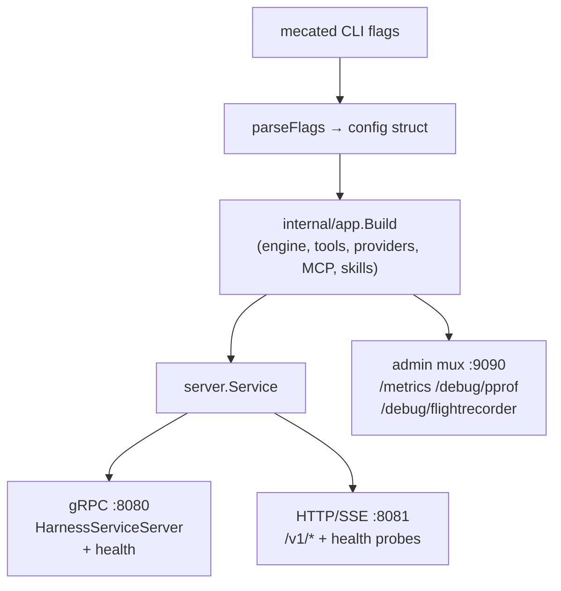

# Run mecated standalone

`mecated` is the standalone composition root for mecatl: parse flags, delegate
assembly to `internal/app.Build`, and serve the resulting `HarnessService` over
gRPC and HTTP/SSE concurrently. Auth, TLS/mTLS, rate limiting, observability
(Prometheus, pprof, OTel traces, the FlightRecorder), and graceful shutdown are
owned by `mecated` directly; the agent loop, tool catalog, permission policy,
provider registry, MCP, and skills wiring live in `internal/app` — the same
composition layer the embedded TUI (`mecatui`) uses in-process.

If you are deploying to Kubernetes without persistent volumes, see
[mecak8s](/deployment/mecak8s.md) instead. That binary wires Redis + k8s Leases by
default and is purpose-built for no-PVC pod deployments.

---

## Quick start

The canonical invocation is `mecated serve`:

```sh
mecated serve
```

A command word is required: `mecated serve` for the network daemon, `mecated
acp` for the ACP stdio mode. Bare `mecated` prints the command help and exits
with a usage error.

The minimal invocation starts the server on loopback with an in-memory session
store. No persistence, no auth — the single-user localhost trust model.

Global MCP OAuth profiles are operator settings. Serving never opens a browser; authorize
a mutable local profile explicitly with `mecated mcp login SERVER [--no-browser]
[--permission-config PATH ...]`. The repeatable permission-config option selects trusted
operator settings only, never OAuth values. Serving then warm-restores the encrypted record, persists lazy refresh-token
rotation, and remains warm after restart. Roll back with a whole `static_bearer`/`none`
profile change and restart. ACP cannot provide OAuth profiles or install/drive authorization;
after operator authorization it may invoke the shared global OAuth-backed tools under ordinary
permissions. See [MCP client](/what-you-get/mcp-client.md).

Default addresses:

| Listener | Default |
|---|---|
| gRPC | `127.0.0.1:8080` |
| HTTP/SSE | `127.0.0.1:8081` |
| Prometheus + admin | `127.0.0.1:9090` |

A slightly more configured invocation for unattended local operation:

```sh
mecated serve \
  --store-dir ~/.local/share/mecatl/sessions \
  --auth-token "$(cat ~/.mecatl/token)" \
  --posture auto
```

`--store-dir` enables JSONL persistence. `--auth-token` requires the token on every
request (also readable from `MECATL_AUTH_TOKEN`). `--posture auto` sets allow-all
for unattended runs while keeping the child substitution floor (prompt-injection
defence) on.

Before binding a non-loopback address, add `--tls-cert` / `--tls-key` and
`--auth-token` — see [the trust model](#the-trust-model) below.

---

## Architecture

`mecated` owns the network daemon surface. Everything inside `internal/app.Build`
is shared with the TUI.



`internal/app.Build` is the composition root shared with `mecatui`. Flags that
control the network daemon surface — TLS/auth/rate-limit, listen addresses, the
Prometheus registry, the FlightRecorder — are owned by `mecated`. Flags that
control agent behaviour (posture, model, store, MCP, skills, guardrails) flow
through `app.Config` into `Build`.

---

## Flag reference

Flags are grouped by area. All have zero-value defaults that produce a working
loopback-only server. Flags not covered here are advanced operator tuning; run
`mecated serve --help` for common flags grouped by task, or `mecated serve --help-all` for the exhaustive reference.

### Server

| Flag | Default | Notes |
|---|---|---|
| `--grpc-addr` | `127.0.0.1:8080` | gRPC listen address |
| `--http-addr` | `127.0.0.1:8081` | HTTP/SSE listen address |
| `--metrics-addr` | `127.0.0.1:9090` | Prometheus + admin listener; empty disables it |
| `--auth-token` | `""` (off) | Bearer token required on every request; also `MECATL_AUTH_TOKEN` |
| `--tls-cert` | `""` | PEM server certificate; enables TLS on both listeners when paired with `--tls-key` |
| `--tls-key` | `""` | PEM server private key |
| `--client-ca` | `""` | PEM client-CA bundle; enables mTLS (requires `--tls-cert`/`--tls-key`) |
| `--rate-limit` | `0` (off) | Sustained per-client request rate in req/s; with OIDC, also limits rejected bearer validation per direct transport peer IP |
| `--rate-burst` | `0` (derived) | Token-bucket burst; zero derives a sane default from `--rate-limit`, including the OIDC rejected-token bucket |
| `--oidc-issuer` | `""` (off) | OIDC issuer URL whose tokens identify callers; setting it turns caller identity on. See [Caller identity](#caller-identity-oidc) |
| `--oidc-jwks-uri` | `""` (derived) | Static JWKS endpoint, short-circuiting OIDC discovery (air-gapped or pinned-key deployments) |
| `--oidc-audience` | `""` | Audience (`aud`) this deployment accepts; **required** with `--oidc-issuer` |
| `--oidc-max-jwks-staleness` | `1h` | Maximum age of last-good signing keys during an IdP outage. `0` deliberately disables this bound; negative values are rejected. |

#### Caller identity (OIDC)

`--oidc-issuer` names the identity provider whose tokens identify your callers.
When it is set, every request must present a bearer that provider vouches for,
and the verified `(issuer, subject)` pair is recorded as the **owner** of each
session the caller creates. `--oidc-audience` is required alongside it — an
audience-less verifier would accept tokens minted for a different service.
`--oidc-jwks-uri` pins the signing-key endpoint instead of discovering it.

**This is attribution, not isolation.** Sessions, schedules and event-log
records gain an owner so you can see who did what; nothing is refused on
identity grounds. Any authenticated caller can still list and act on any
session — per-caller access control is a separate, later piece of work. Do not
deploy these flags as a tenancy boundary.

The production OIDC/JWT validator is a delegated, actively-maintained library —
mecatl never hand-rolls token verification. A bad OIDC
configuration, including an unreachable initial key fetch, fails closed at startup
rather than falling back to unauthenticated traffic. After a successful fetch, the
last good JWKS can cover a brief IdP outage. `--oidc-max-jwks-staleness=1h` bounds
that fallback: once keys are older than the bound, a failed refresh returns **503
Service Unavailable**. `0` is an explicit acceptance of unbounded cached-key
availability and its signing-key revocation exposure.

When OIDC and `--rate-limit` are both enabled, rejected bearer traffic has a
separate pre-validation bucket keyed only by the **direct transport peer IP**.
The server never trusts `Forwarded` or `X-Forwarded-For` for this decision. Once
a peer exhausts the bucket, requests return HTTP **429** / gRPC
`RESOURCE_EXHAUSTED` before another validator call. Valid tokens do not consume
that bucket; they continue to the existing verified-principal limiter and are
charged there once. A normally admitted bad token remains **401** / gRPC
`UNAUTHENTICATED`, while an IdP outage remains **503** / gRPC `UNAVAILABLE`.

This is a bound on **signing-key** revocation during an outage, not per-token
revocation. An otherwise valid token remains acceptable until its normal expiry.
The JWKS cache is process-local and not persisted; a restarted process fetches
current keys again. The flags are identical on `mecak8s`. Full reference:
[usage.md](https://github.com/stacklok/mecatl/blob/main/docs/usage.md) and
[ADR 0204](https://github.com/stacklok/mecatl/blob/main/docs/adr/0204-caller-identity-threading.md).

#### Daemon config file (`daemon.yaml`)

The listener topology above (gRPC/HTTP/metrics addresses, TLS cert/key/CA,
rate-limit/burst) can live in a small, strict, versioned YAML file instead of
repeated flags. The file is a **distinct** file from `settings.yaml` (which is
**policy**: permissions, posture, guardrails, models) and is loaded ONLY when you
start with `mecated serve --config PATH` — there is **no conventional
auto-load**. Scaffold and validate it offline:

```sh
mecated config daemon init                          # write the conventional skeleton
mecated config daemon init --print                  # print it to stdout, no file
mecated config daemon validate                      # validate the conventional path
mecated config daemon validate --file /etc/mecatl/daemon.yaml
mecated serve --config ~/.config/mecatl/daemon.yaml # start with it
```

The v1 fields are `version` (required, `v1`), `grpc_addr`, `http_addr`,
`metrics_addr`, `tls_cert`, `tls_key`, `client_ca`, `rate_limit`, `rate_burst`.
The schema is strict (unknown keys are rejected). Precedence is
**defaults < file < explicit CLI** — an explicit flag overrides the file,
including an explicit empty/zero.

**Security:** the API bearer **token is NOT accepted in `daemon.yaml`** — keep
using `MECATL_AUTH_TOKEN` / `--auth-token`. A **non-loopback** bind still
requires auth/TLS (it logs a prominent WARNING otherwise); `daemon.yaml`
changes topology, not the trust model. `config daemon validate` never prints
secrets or raw file content. See [ADR 0088](https://github.com/stacklok/mecatl/blob/main/docs/adr/0088-daemon-config-file.md) for the rationale.

### Session state

| Flag | Default | Notes |
|---|---|---|
| `--store-dir` | `""` (in-memory) | Directory for the JSONL session store. Empty = in-memory, no persistence across restart |
| `--session-lease-dir` | `""` | Single-host flock lease backend; see [multi-replica](#multi-replica) |
| `--session-lease-k8s-namespace` | `""` | k8s `coordination.k8s.io` Lease backend; see [multi-replica](#multi-replica) |
| `--session-lease-ttl` | `30s` | Lease lifetime; a crashed holder's lease becomes claimable after this long |
| `--session-store-url` | `""` | gRPC driver endpoint replacing the local JSONL store (mutually exclusive with `--store-dir`) |

### Scheduled tasks

| Flag | Default | Notes |
|---|---|---|
| `--no-scheduler` | `false` | Disable the in-process scheduler tick loop (ON by default when the store exposes a `ScheduleStore` — `--store-dir` or redisstore). The create/list/fire API still works. The removed `--scheduler` opt-in fails fast as an unknown flag |
| `--scheduler-tick-interval` | `30s` | How often the tick loop polls for due schedules |
| `--scheduler-min-interval` | `1m` | Frequency floor enforced at schedule-create time (fail-closed, by both the in-chat `Schedule` tool and the REST/gRPC create). Defaults to `1m`; `0` disables the floor |
| `--scheduler-max-concurrent-fires` | `4` | Max schedules fired in parallel per tick |
| `--schedule-store-url` | `""` | gRPC driver endpoint (`ScheduleStoreService` + `ScheduleOneShotReArmerService`) for the durable schedule registry, **independent of the session store** — when set, replaces the `ScheduleStore()` discovery from the configured store. Empty keeps the default (the configured store's own `ScheduleStore()`, or no scheduling). The driver runs the atomic advance server-side |

See [Scheduled tasks](/what-you-get/scheduled-tasks.md) for the in-chat `Schedule` tool and the gRPC/REST management surface.

### LLM resilience

| Flag | Default | Notes |
|---|---|---|
| `--llm-per-attempt-timeout` | `300s` | Bounds **establishing** the stream only (connect + first chunk). Does not cut an actively-streaming turn |
| `--llm-stream-idle-timeout` | `180s` | Max idle gap between chunks after the first arrives. A stall exceeding this is terminal and not retried |
| `--llm-max-attempts` | `3` | Max stream-establish attempts (initial call + retries) |
| `--llm-breaker-threshold` | `5` | Consecutive LLM failures that open the circuit breaker; `0` disables |
| `--llm-breaker-cooldown` | `30s` | How long the breaker stays open before half-opening |

`--llm-per-attempt-timeout` uses a separate timer that fires only if no first chunk
arrived — it does NOT set a `context.WithTimeout` that would silently truncate a
slow reasoning turn. Once the first chunk arrives, the timer is stopped and only
`--llm-stream-idle-timeout` bounds subsequent inactivity.

### Provider and model

| Flag | Default | Notes |
|---|---|---|
| `--model` | `""` | Model id sent to the provider; empty uses the provider-appropriate default |
| `--default-provider` | `""` | Deployment-wide default provider (`openai`, `openrouter`, `anthropic`, `opencode`); validated fail-fast |
| `--default-model` | `""` | Deployment-wide default model id for the default provider; validated fail-fast |
| `--subagent-model` | `""` | Global default model for child engines (Subagent, Parallel branches, team members) that do not pin their own |
| `--no-prompt-cache` | `false` | Disable provider-side prompt caching (on by default — see [ADR 0100](https://github.com/stacklok/mecatl/blob/main/docs/adr/0100-provider-prompt-caching.md)) |
| `--anthropic-cache-ttl` | `""` (API default, `5m`) | TTL on every Anthropic ephemeral cache breakpoint: `5m` or `1h` |

Provider credentials are read from environment variables — `OPENAI_API_KEY`,
`OPENROUTER_API_KEY`, `ANTHROPIC_API_KEY`, `OPENCODE_API_KEY` — never flag
values. `opencode` is [OpenCode Go](https://opencode.ai), a subscription LLM
gateway reached over the OpenAI Chat Completions protocol rather than OpenAI's
own Responses API — a separate adapter under the hood, but it configures the
same way as any other provider here. An optional `auth.yaml` credentials file
is also supported for operators who'd rather not export a key into the shell
environment; see
[`docs/usage/mecated.md`](https://github.com/stacklok/mecatl/blob/main/docs/usage/mecated.md#credentials-file-authyaml).

Experimental provider `openai-codex` can instead use a manually supplied
ChatGPT Codex subscription token from that file. It is a separate billing
identity from public API-key `openai`, uses an undocumented private backend,
and has no login or refresh flow. Configure `providers.openai-codex.oauth`,
keep the file owner-only, select `--default-provider openai-codex` (or an
explicit session selector), and restart after replacing the token. `0600` does
not stop same-UID Bash from reading a known plaintext file. See the
[exact schema, lifecycle, and failure guidance](https://github.com/stacklok/mecatl/blob/main/docs/usage/mecated.md#openai-codex-subscription-manual-token-experimental).

#### The ToolHive LLM gateway (no API key needed)

If you have [ToolHive](https://toolhive.dev)'s local LLM proxy running, `--toolhive-llm`
(on by default) auto-detects it and registers it as provider id `toolhive` — no API key
required, since ToolHive holds the credential. `/models` (or the mecatui welcome splash)
tells you when it's available but not your default, so you can opt in with `/models` or
`--default-provider toolhive` without unsetting whatever key-based provider you already
have. On a host other operators also use, pass `--toolhive-llm=false` — a per-user
ToolHive config detected by one operator's process shouldn't surprise another.

There are two routing modes for how the `toolhive` provider reaches the gateway,
selected by `--toolhive-llm-mode` (default `auto`):

- **Proxy mode** (the original path): mecatl talks to a local reverse proxy
  (`thv llm proxy`, loopback `127.0.0.1:<port>/v1`) that holds the credential and
  forwards to the real `gateway_url`. The proxy must be running.
- **Direct mode** (`auto` when configured, or `--toolhive-llm-mode direct`): mecatl
  imports ToolHive as a library and talks DIRECTLY to the real `gateway_url` — no local
  proxy hop, no subprocess. The OIDC bearer token is minted and refreshed in-process
  by a per-request HTTP RoundTripper. Get the credential once with
  `mecatui login` (in-process interactive OIDC flow; add `--skip-browser` for
  headless/SSH/CI) or `thv llm setup`. Direct mode needs the OIDC trio
  (`gateway_url` + `issuer` + `client_id`) configured AND an HTTPS `gateway_url`
  (`http://localhost`/`http://127.0.0.1` are the dev carve-out); `auto` falls back to
  proxy when either is absent, `direct` Build-fails fast with the remediation.

`mecated` is headless, so a direct-mode cache-miss surfaces a terminal error
(naming `thv llm setup` / `mecatui login` / `--toolhive-llm-mode proxy`) rather than
launching a browser — run `mecatui login` (or `thv llm setup`) to obtain the
credential, or `--toolhive-llm-mode proxy` to fall back. If your gateway uses a
self-signed certificate, use `--toolhive-llm-mode proxy` — direct mode does not honor
`tls_skip_verify` (an upstream ToolHive gap), and proxy mode does.

See the [ToolHive LLM gateway reference](https://github.com/stacklok/mecatl/blob/main/docs/usage.md#toolhive-llm-gateway)
for the full flag table, the `mecatui login` walkthrough, and the troubleshooting
table.

Two things worth knowing before you rely on it:

- **The proxy has to actually be reachable.** `/models` names the exact fix when it isn't:
  `thv llm proxy start` if the proxy isn't running, `thv llm setup` if your credential was
  rejected. An empty model list from a *valid* credential is an organizational problem
  (ask your platform admin), not a local one.
- **A model that lists fine can still fail at request time.** Some gateways expose "friendly"
  model aliases that have no cost route configured, so a request to one 5xxs with a
  cost-enforcement error even though `/models` reported the gateway healthy. If requests are
  failing but the gateway looks fine, pick a fully-qualified or provider-namespaced model
  slug instead (via `/models`, `--model`, or mecatui's `ctrl+g` global default) — or ask
  whoever runs the gateway to add a cost route for the alias. A session created before you
  fix this keeps failing on every turn even after the fix lands; open a fresh session rather
  than waiting for it to self-heal.

### Posture

| Flag | Notes |
|---|---|
| `--posture strict` | Default. Every mutating call asks for approval |
| `--posture trusted` | Honour a project's ALLOW rules (alias: `--trust-project`) |
| `--posture auto` | Allow-all server-wide + main substitution loosening; child injection defence **on**. Recommended for unattended use |
| `--posture yolo` | Also loosens child substitution (injection defence **off**). Isolated single-tenant only. Refused as root without `MECATL_SANDBOX=1` |

On a **headless** root (`--headless`), posture never raises `TrustProject`. Explicit
`--trust-project`, `trustedWorkspaces:`, or undrifted remembered trust admits BOTH repo steering and
the read-only child shell. Without a trust source, `--posture auto` keeps its approvals but gets
neither because `.git` is not vouched. See
[workspace trust](https://github.com/stacklok/mecatl/blob/main/docs/usage/workspace-trust.md#project-tier-ingestion-on-headless-roots-the-opt-in-design)
for the full walkthrough.

See [Permissions & guardrails](/what-you-get/permissions.md) for the full rule
engine. Posture is read from the operator-global `settings.yaml` (`posture:` key)
and out-ranked by the CLI flag when both are set.

### Guardrails

| Flag | Default | Notes |
|---|---|---|
| `--guardrails-model` | `""` (off) | Model id or alias for the content checker. Configuring a model **enables** guardrails |
| `--guardrails` | `""` | Kill-switch only: pass `--guardrails=off` to force off regardless of model config |

The rule list and cost knobs live in the operator-global `settings.yaml`
(`guardrails:` subtree). A project-tier `guardrails:` block is ignored with a WARN —
a checked-in file weakening a security checker would be a downgrade.

### MCP

| Flag | Default | Notes |
|---|---|---|
| `--mcp-server name=URL` | (none) | Remote MCP server, repeatable. Per-server bearer token from `MCP_<NAME>_TOKEN`; a token-bearing URL must be `https` (or `http` to loopback) |
| `--mcp-server-insecure-http name` | (none) | Per-server opt-in, repeatable: let the named server's bearer ride plain `http` off-host (cleartext on the network path — rely on network-layer controls + short-lived tokens). Unregistered or already-`https`/loopback names fail startup |
| `--mcp-resource-tools` | `true` | Register `ListMcpResources`/`ReadMcpResource` meta-tools when a server exposes resources |
| `--toolhive` | `true` | Discover MCP servers from running ToolHive workloads (fails soft when no container runtime is reachable) |
| `--toolhive-group` | `""` (default group) | ToolHive group to discover from |

`--mcp-server` uses streaming-HTTP transport only. mecatl never speaks stdio MCP
directly; ToolHive stdio backends are HTTP-proxied and fine.

### Skills

| Flag | Default | Notes |
|---|---|---|
| `--skills-dir` | (none) | Trusted local Agent Skills directory; repeatable |
| `--skills-conventional` | `false` | Add conventional project/user skill locations |
| `--skill-source-url` | (none) | Remote `SkillSourceService`; replaces local discovery and snapshots metadata at startup |

The `Skill` tool uses path-free progressive disclosure. `{name}` loads instructions
and a logical asset inventory; `{name, asset}` fetches one bounded textual asset.
Local and remote skills behave the same. Assets are not materialized or exposed as
workspace files, and bundled scripts are not implicitly executable. If a skill needs
a real file, its instructions must create or obtain one explicitly in the workspace,
where ordinary Write/Bash permissions apply.

### Observability

| Flag | Default | Notes |
|---|---|---|
| `--otlp-endpoint` | `""` (off) | OTLP trace collector, e.g. `localhost:4317`; empty disables tracing |
| `--otlp-protocol` | `grpc` | OTLP transport: `grpc` or `http` |
| `--flight-recorder` | `true` | Arm the execution-trace ring buffer; snapshots at `/debug/flightrecorder` |
| `--perf-mcp` | `false` | Mount a read-only perf MCP server at `/mcp` on the admin listener. Requires loopback `--metrics-addr` (unauthenticated surface) |
| `--mutex-profile-fraction` | `0` (off) | `runtime.SetMutexProfileFraction`; adds overhead when > 0 |
| `--block-profile-rate` | `0` (off) | `runtime.SetBlockProfileRate` in ns; adds overhead when > 0 |

The admin listener (`--metrics-addr`) is separate from the harness API and loopback by
default. It carries `/metrics`, `/debug/pprof`, `/debug/vars`, and
`/debug/flightrecorder`. pprof and the FlightRecorder can embed prompt text, file
paths, and goroutine stacks — never expose this listener off-loopback.

---

## The trust model

mecatl exposes command and file execution. The security model has three layers:

1. **Network binding.** Both listeners default to `127.0.0.1` — the loopback
   interface. No traffic crosses the machine.
2. **Authentication.** Off by default for the loopback case. Enable a bearer token
   (`--auth-token` / `MECATL_AUTH_TOKEN`) before binding a non-loopback address.
   [Caller identity](#caller-identity-oidc) is a separate, additive axis: a shared
   token is one credential with no subject behind it, while `--oidc-issuer` gives
   each caller a distinct identity. Identity records **who** acted; it does not
   yet decide **what** they may act on.
3. **Transport.** Plaintext by default. Add `--tls-cert` + `--tls-key` for TLS;
   add `--client-ca` to require and verify client certificates (mTLS).

A non-loopback bind with no auth is **permitted** (a service mesh may legitimately
front mecatl) but generates a prominent startup warning:

```
WARN  API bound to a NON-loopback address with NO authentication: it exposes
      UNAUTHENTICATED command/file execution to the network
```

This is not a hard failure — if you see it intentionally, your mesh owns the auth
layer. If you see it unexpectedly, add `--auth-token`.

mecated logs the effective security posture once at startup:

```
INFO  API security posture  bearer_auth=true  tls=true  mutual_tls=false  rate_limit_rps=0  store=jsonl
```

---

## Persistence

By default (`--store-dir ""`) sessions live in-memory. The server holds state for
all active sessions but loses everything on restart. This is the right default for
development and single-shot clients.

Enable JSONL persistence by pointing `--store-dir` at a directory:

```sh
mecated serve --store-dir /var/lib/mecatl/sessions
```

Each session gets three files sharing one stem under a `sid-v1` subdirectory: a
`.session.jsonl` snapshot log, a `.tools.jsonl` audit sidecar, and a
`.events.jsonl` durable event log (reasoning, approval pairs, delegation
lifecycle). Completed sessions are immediately readable by the event-sourced
rehydration path (`internal/adapter/eventsource`); in-flight sessions are
rehydrated from the snapshot on restart.

The stem is derived from the session id but is **not** reversible, so locate a
session by reading the id out of the file (`tail -n1 … | jq -r .id`) rather than
from the filename — see [Session store](../extension-points/session-store.md) for
the layout and a ready-made loop. A store directory written by an older version
keeps its files directly under `--store-dir`; they stay readable and move into
`sid-v1/` on that session's next write, so no migration step is needed.

:::note[Kubernetes and persistent volumes]

If you run `mecated` in Kubernetes with `--store-dir`, you need a PersistentVolume
backed by ReadWriteOnce (or ReadWriteMany for multi-replica with affinity routing).
If a PVC is a hard constraint, use `mecak8s` instead — it wires a Redis-backed store
with no PVC requirement.

:::

The `--session-store-url` flag replaces the JSONL store with a remote gRPC driver
(`mecatl.driver.v1.SessionStoreService`). This is the path for a managed Redis backend
(`mecak8s` uses it internally) or a custom store behind the driver protocol. It is
mutually exclusive with `--store-dir`.

### Import from Codex or Claude Code

`mecated import` is an offline migration command for local Codex and Claude Code
projects. It can seed a resumable Mecatl session, copy the project files into a
new workspace, and copy Agent Skills bundles into `<workspace>/.mecatl/skills`.
It does not start a server or require an API key.

Codex stores active session rollouts under `~/.codex/sessions/`; Claude Code
stores project transcripts under `~/.claude/projects/`. Select the JSONL session
you want and use the same `--store-dir` when starting the server:

```sh
mecated import \
  --from codex \
  --session ~/.codex/sessions/2026/08/05/rollout-....jsonl \
  --store-dir ~/.local/share/mecatl/sessions \
  --workspace ~/work/imported-project \
  --copy-files \
  --skills

mecated serve \
  --store-dir ~/.local/share/mecatl/sessions \
  --workspace ~/work/imported-project \
  --skills-dir ~/work/imported-project/.mecatl/skills
```

For Claude Code, use `--from claude-code` and a transcript such as
`~/.claude/projects/<project>/<session-id>.jsonl`. `--skills` discovers the
source tool's conventional project and user skill directories. You can instead
or additionally repeat `--skills-dir <source>` to name exact skill directories.

TRUST BOUNDARY: imported `SKILL.md` files steer the model exactly like
`AGENTS.md`/`CLAUDE.md` — only import skills from a source you trust, the same
way you would point `mecated serve --skills-dir` at a trusted directory.

The safety and portability rules are intentional:

- The imported session keeps user and assistant text only. Provider-private
  reasoning, system/developer instructions, and provider-specific tool calls or
  results are omitted because another provider cannot safely replay them.
- The new session is idle, uses Mecatl's default permission mode, and binds to
  the provider/model selected when it is resumed.
- `--copy-files` is opt-in and requires an explicit `--workspace`. It skips
  `.git`, symlinks, and special files.
- Existing sessions, files, and skill names are never overwritten. Resolve a
  collision or choose a new `--id`/workspace and run the import again.
- Session transcripts and copied files may contain secrets. Import stays local,
  and the JSONL store remains plaintext with owner-only directory permissions.

Use `--source-workspace` when the transcript's recorded `cwd` moved, and use
`--workspace` without `--copy-files` to attach imported history to an existing
project without copying its files.

---

## Multi-replica

`mecated` expects **session affinity** by default: a load balancer should route all
requests for a given session id to the same replica. With affinity, single-writer
enforcement is free — the in-process run registry ensures a session cannot be driven
from two goroutines concurrently within the same process.

Without affinity, or when failover between replicas is required, wire a **session
lease backend**. The lease backend enforces cross-process single-writer: only one
replica may hold the lease for a session at a time; a competing request from a
second replica returns `FAILED_PRECONDITION` (gRPC) / HTTP 409.

Three lease backends are available:

| Backend | Flag | When to use |
|---|---|---|
| flock (single-host) | `--session-lease-dir <dir>` | Multiple `mecated` processes on one machine. flock auto-releases on crash |
| k8s Lease | `--session-lease-k8s-namespace <ns>` | Multi-replica in Kubernetes; uses `coordination.k8s.io` Leases |
| gRPC driver | `--session-lease-url <host:port>` | Custom or managed lease backend via the driver protocol |

The ServiceAccount for the k8s backend needs `get,create,update,delete` on
`leases.coordination.k8s.io` in the configured namespace — no `list` or `watch`.

:::warning[Two replicas + shared store + no lease = no exclusion]

Without a lease backend AND without session affinity, two replicas over a shared
JSONL directory or remote store have no mutual exclusion. Both may drive the same
session concurrently. The lease backend is the fix; affinity routing is sufficient
for the common case without it.

:::

The lease TTL defaults to 30s (`--session-lease-ttl`). A crashed holder's lease
becomes claimable after that interval. The renew interval defaults to
`TTL / 3`; tune it well below the TTL so a slow store does not lose the lease mid-run
and cancel the session.

---

## Operator subcommands

`mecated` ships several subcommands. Two start the daemon, the rest are
one-shot offline actions:

```sh
# Start the network daemon (gRPC + HTTP/SSE) — canonical
mecated serve [flags]

# Serve the Agent Client Protocol over stdio (JSON-RPC 2.0) for an editor
mecated acp [flags]

# Write the operator settings.yaml skeleton to ~/.config/mecatl/settings.yaml
# (POLICY: permissions, posture, guardrails, models)
mecated config init

# Print the settings.yaml skeleton to stdout without writing (paste-ready reference)
mecated config init --print

# Validate settings offline without printing values or writing either input.
# --learning-patch applies one learning: mapping in memory for preflight.
mecated config validate
mecated config validate --file /etc/mecatl/settings.yaml
mecated config validate --file /etc/mecatl/settings.yaml \
  --learning-patch .scratch/learning.yaml

# Write the daemon.yaml listener-topology skeleton to
# ~/.config/mecatl/daemon.yaml (loopback defaults + commented TLS/rate examples).
# It is NOT auto-loaded; start with `mecated serve --config <path>` to use it.
mecated config daemon init

# Print the daemon.yaml skeleton to stdout without writing
mecated config daemon init --print

# Strictly validate a daemon.yaml (default: the conventional path). Never
# starts the server; never prints secrets/raw file content.
mecated config daemon validate
mecated config daemon validate --file /etc/mecatl/daemon.yaml

# Promote a model-authored candidate skill out of quarantine
mecated skills promote \
  --skills-draft-dir /var/mecatl/skill-drafts \
  --skills-dir /var/mecatl/skills \
  <name>

# Print a paste-ready .mcp.json snippet for the loopback perf MCP server
mecated perf-mcp print-config
```

`mecated config validate` defaults to the same
`$XDG_CONFIG_HOME/mecatl/settings.yaml` path as `config init`. It reads and
validates only regular files, never prints settings values, and never writes. A
`--learning-patch` file must contain exactly one top-level `learning:` mapping;
the command replaces or inserts that mapping only in memory and validates the
complete result. With an explicit patch, a missing base is treated as an empty
new file and reports `valid (new file)` without creating it.

`mecated skills promote` is the deprecated compatibility path from a legacy
model-authored quarantine skill (`--skills-draft-dir`) into an operator-managed live catalog
(`--skills-dir`). It shows the full candidate content, asks for operator confirmation (or `--yes`
for CI), validates the promotion, and moves the file. It does **not** read or activate evaluated
skill-lifecycle repository records, so it cannot silently promote an unevaluated lifecycle Draft.
Existing operator/manual skills are unchanged. New lifecycle integrations explicitly import a
legacy `origin:model` draft as inactive. The standard evaluator abstains on that unevidenced
record; later review/evaluation/stage/activation requires an explicit host or operator path. The model
cannot perform the legacy promotion step — it does not have filesystem access outside the workspace.

Schedules are managed **in-chat** via the model-facing `Schedule` tool or over the
gRPC/REST `ScheduleService` API — there is no `mecated schedules` CLI (it was removed;
see [Scheduled tasks](/what-you-get/scheduled-tasks.md#managing-schedules-in-chat-grpc-and-rest)).

---

## Graceful shutdown

On `SIGINT` or `SIGTERM`, mecated shuts down all three listeners with a 10-second
drain. In-flight gRPC streams get `GracefulStop`; in-flight HTTP requests get
`http.Server.Shutdown`. The telemetry pipeline flushes with a 5-second timeout.

Background subagent children owned by active sessions are cancelled when their parent
run is cancelled (the harness cancels runs on shutdown). A session's state is
persisted (if `--store-dir` is set) before the process exits; interrupted runs are
recoverable from the snapshot.

---

## What's next

- [Pick your deployment shape](/getting-started/deployment-decision.md) — trade-offs between mecated, mecak8s, mecatequi, and engine embedding.
- [Permissions & guardrails](/what-you-get/permissions.md) — the rule engine, posture ladder, and guardrail checker in detail.
- [mecak8s — cloud-native k8s](/deployment/mecak8s.md) — the no-PVC Kubernetes peer with Redis + coordination.k8s.io Leases baked in.
- [The agent loop](/what-you-get/agent-loop.md) — what mecated is serving: the streaming loop, tool dispatch, and the permission handshake.
