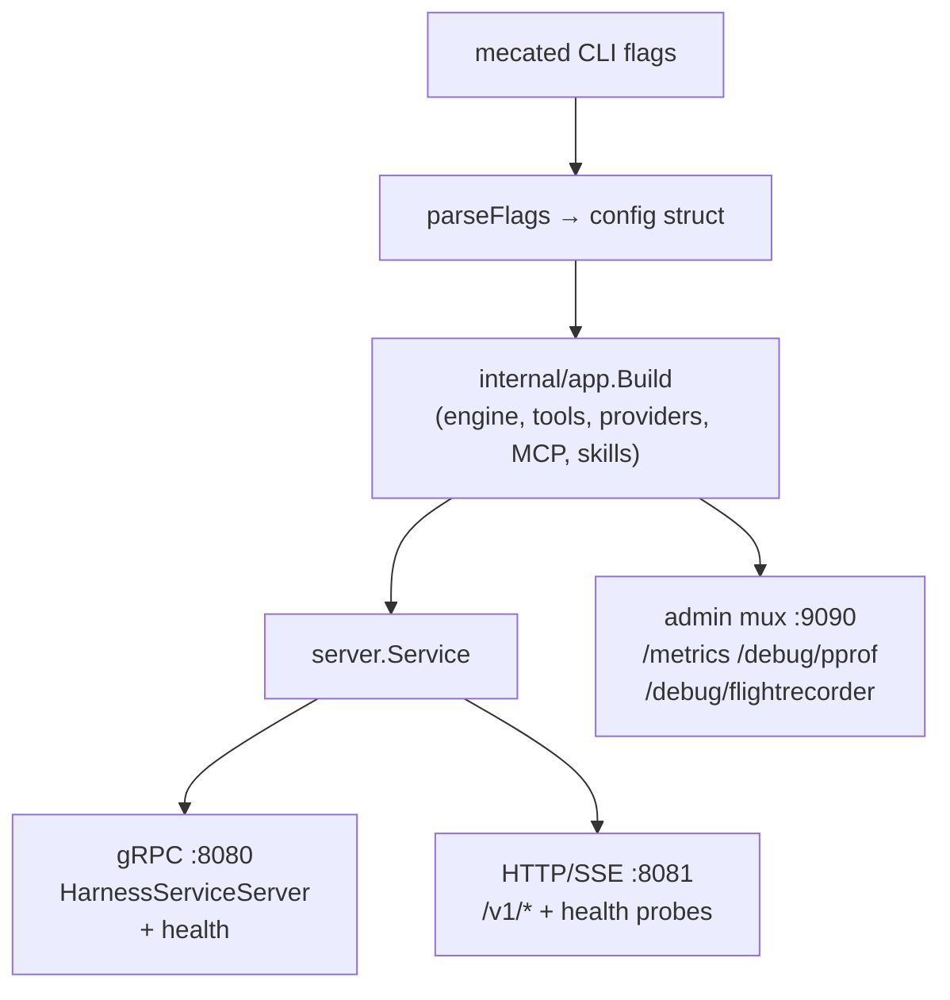

# Run mecated standalone

`mecated` is the standalone composition root for mecatl: parse flags, delegate
assembly to `internal/app.Build`, and serve the resulting `HarnessService` over
gRPC and HTTP/SSE concurrently. Auth, TLS/mTLS, rate limiting, observability
(Prometheus, pprof, OTel traces, the FlightRecorder), and graceful shutdown are
owned by `mecated` directly; the agent loop, tool catalog, permission policy,
provider registry, MCP, and skills wiring live in `internal/app` — the same
composition layer the embedded TUI (`mecatui`) uses in-process.

If you are deploying to Kubernetes without persistent volumes, see
[mecak8s](/deployment/mecak8s.md) instead. That binary wires Redis + k8s Leases by
default and is purpose-built for no-PVC pod deployments.

---

## Quick start

The minimal invocation starts the server on loopback with an in-memory session
store. No persistence, no auth — the single-user localhost trust model:

```sh
mecated
```

Default addresses:

| Listener | Default |
|---|---|
| gRPC | `127.0.0.1:8080` |
| HTTP/SSE | `127.0.0.1:8081` |
| Prometheus + admin | `127.0.0.1:9090` |

A slightly more configured invocation for unattended local operation:

```sh
mecated \
  --store-dir ~/.local/share/mecatl/sessions \
  --auth-token "$(cat ~/.mecatl/token)" \
  --posture auto
```

`--store-dir` enables JSONL persistence. `--auth-token` requires the token on every
request (also readable from `MECATL_AUTH_TOKEN`). `--posture auto` sets allow-all
for unattended runs while keeping the child substitution floor (prompt-injection
defence) on.

Before binding a non-loopback address, add `--tls-cert` / `--tls-key` and
`--auth-token` — see [the trust model](#the-trust-model) below.

---

## Architecture

`mecated` owns the network daemon surface. Everything inside `internal/app.Build`
is shared with the TUI.



`internal/app.Build` is the composition root shared with `mecatui`. Flags that
control the network daemon surface — TLS/auth/rate-limit, listen addresses, the
Prometheus registry, the FlightRecorder — are owned by `mecated`. Flags that
control agent behaviour (posture, model, store, MCP, skills, guardrails) flow
through `app.Config` into `Build`.

---

## Flag reference

Flags are grouped by area. All have zero-value defaults that produce a working
loopback-only server. Flags not covered here are advanced operator tuning; run
`mecated --help` for the full list.

### Server

| Flag | Default | Notes |
|---|---|---|
| `--grpc-addr` | `127.0.0.1:8080` | gRPC listen address |
| `--http-addr` | `127.0.0.1:8081` | HTTP/SSE listen address |
| `--metrics-addr` | `127.0.0.1:9090` | Prometheus + admin listener; empty disables it |
| `--auth-token` | `""` (off) | Bearer token required on every request; also `MECATL_AUTH_TOKEN` |
| `--tls-cert` | `""` | PEM server certificate; enables TLS on both listeners when paired with `--tls-key` |
| `--tls-key` | `""` | PEM server private key |
| `--client-ca` | `""` | PEM client-CA bundle; enables mTLS (requires `--tls-cert`/`--tls-key`) |
| `--rate-limit` | `0` (off) | Sustained per-client request rate in req/s |
| `--rate-burst` | `0` (derived) | Token-bucket burst; zero derives a sane default from `--rate-limit` |

### Session state

| Flag | Default | Notes |
|---|---|---|
| `--store-dir` | `""` (in-memory) | Directory for the JSONL session store. Empty = in-memory, no persistence across restart |
| `--session-lease-dir` | `""` | Single-host flock lease backend; see [multi-replica](#multi-replica) |
| `--session-lease-k8s-namespace` | `""` | k8s `coordination.k8s.io` Lease backend; see [multi-replica](#multi-replica) |
| `--session-lease-ttl` | `30s` | Lease lifetime; a crashed holder's lease becomes claimable after this long |
| `--session-store-url` | `""` | gRPC driver endpoint replacing the local JSONL store (mutually exclusive with `--store-dir`) |

### Scheduled tasks

| Flag | Default | Notes |
|---|---|---|
| `--scheduler` | `false` | Enable the in-process scheduler tick loop. Requires a store that exposes a `ScheduleStore` (`--store-dir` or `--session-store-url` with redisstore); fails startup otherwise |
| `--scheduler-tick-interval` | `30s` | How often the tick loop polls for due schedules |
| `--scheduler-min-interval` | `0` (off) | Frequency floor enforced at schedule-create time |
| `--scheduler-max-concurrent-fires` | `4` | Max schedules fired in parallel per tick |

See [Scheduled tasks](/what-you-get/scheduled-tasks.md) for the `mecated schedules` CLI, the declarative `settings.yaml schedules:` block, and the gRPC/REST management surface.

### LLM resilience

| Flag | Default | Notes |
|---|---|---|
| `--llm-per-attempt-timeout` | `300s` | Bounds **establishing** the stream only (connect + first chunk). Does not cut an actively-streaming turn |
| `--llm-stream-idle-timeout` | `180s` | Max idle gap between chunks after the first arrives. A stall exceeding this is terminal and not retried |
| `--llm-max-attempts` | `3` | Max stream-establish attempts (initial call + retries) |
| `--llm-breaker-threshold` | `5` | Consecutive LLM failures that open the circuit breaker; `0` disables |
| `--llm-breaker-cooldown` | `30s` | How long the breaker stays open before half-opening |

`--llm-per-attempt-timeout` uses a separate timer that fires only if no first chunk
arrived — it does NOT set a `context.WithTimeout` that would silently truncate a
slow reasoning turn. Once the first chunk arrives, the timer is stopped and only
`--llm-stream-idle-timeout` bounds subsequent inactivity.

### Provider and model

| Flag | Default | Notes |
|---|---|---|
| `--model` | `""` | Model id sent to the provider; empty uses the provider-appropriate default |
| `--default-provider` | `""` | Deployment-wide default provider (`openai`, `openrouter`, `anthropic`); validated fail-fast |
| `--default-model` | `""` | Deployment-wide default model id for the default provider; validated fail-fast |
| `--subagent-model` | `""` | Global default model for child engines (Subagent, Parallel branches, team members) that do not pin their own |

Provider credentials are read from environment variables, never flag values:
`OPENAI_API_KEY`, `OPENROUTER_API_KEY`, `ANTHROPIC_API_KEY`.

### Posture

| Flag | Notes |
|---|---|
| `--posture strict` | Default. Every mutating call asks for approval |
| `--posture trusted` | Honour a project's ALLOW rules (alias: `--trust-project`) |
| `--posture auto` | Allow-all server-wide + main substitution loosening; child injection defence **on**. Recommended for unattended use |
| `--posture yolo` | Also loosens child substitution (injection defence **off**). Isolated single-tenant only. Refused as root without `MECATL_SANDBOX=1` |

See [Permissions & guardrails](/what-you-get/permissions.md) for the full rule
engine. Posture is read from the operator-global `settings.yaml` (`posture:` key)
and out-ranked by the CLI flag when both are set.

### Guardrails

| Flag | Default | Notes |
|---|---|---|
| `--guardrails-model` | `""` (off) | Model id or alias for the content checker. Configuring a model **enables** guardrails |
| `--guardrails` | `""` | Kill-switch only: pass `--guardrails=off` to force off regardless of model config |

The rule list and cost knobs live in the operator-global `settings.yaml`
(`guardrails:` subtree). A project-tier `guardrails:` block is ignored with a WARN —
a checked-in file weakening a security checker would be a downgrade.

### MCP

| Flag | Default | Notes |
|---|---|---|
| `--mcp-server name=URL` | (none) | Remote MCP server, repeatable. Per-server bearer token from `MCP_<NAME>_TOKEN` |
| `--mcp-resource-tools` | `true` | Register `ListMcpResources`/`ReadMcpResource` meta-tools when a server exposes resources |
| `--toolhive` | `true` | Discover MCP servers from running ToolHive workloads (fails soft when no container runtime is reachable) |
| `--toolhive-group` | `""` (default group) | ToolHive group to discover from |

`--mcp-server` uses streaming-HTTP transport only. mecatl never speaks stdio MCP
directly; ToolHive stdio backends are HTTP-proxied and fine.

### Observability

| Flag | Default | Notes |
|---|---|---|
| `--otlp-endpoint` | `""` (off) | OTLP trace collector, e.g. `localhost:4317`; empty disables tracing |
| `--otlp-protocol` | `grpc` | OTLP transport: `grpc` or `http` |
| `--flight-recorder` | `true` | Arm the execution-trace ring buffer; snapshots at `/debug/flightrecorder` |
| `--perf-mcp` | `false` | Mount a read-only perf MCP server at `/mcp` on the admin listener. Requires loopback `--metrics-addr` (unauthenticated surface) |
| `--mutex-profile-fraction` | `0` (off) | `runtime.SetMutexProfileFraction`; adds overhead when > 0 |
| `--block-profile-rate` | `0` (off) | `runtime.SetBlockProfileRate` in ns; adds overhead when > 0 |

The admin listener (`--metrics-addr`) is separate from the harness API and loopback by
default. It carries `/metrics`, `/debug/pprof`, `/debug/vars`, and
`/debug/flightrecorder`. pprof and the FlightRecorder can embed prompt text, file
paths, and goroutine stacks — never expose this listener off-loopback.

---

## The trust model

mecatl exposes command and file execution. The security model has three layers:

1. **Network binding.** Both listeners default to `127.0.0.1` — the loopback
   interface. No traffic crosses the machine.
2. **Authentication.** Off by default for the loopback case. Enable a bearer token
   (`--auth-token` / `MECATL_AUTH_TOKEN`) before binding a non-loopback address.
3. **Transport.** Plaintext by default. Add `--tls-cert` + `--tls-key` for TLS;
   add `--client-ca` to require and verify client certificates (mTLS).

A non-loopback bind with no auth is **permitted** (a service mesh may legitimately
front mecatl) but generates a prominent startup warning:

```
WARN  API bound to a NON-loopback address with NO authentication: it exposes
      UNAUTHENTICATED command/file execution to the network
```

This is not a hard failure — if you see it intentionally, your mesh owns the auth
layer. If you see it unexpectedly, add `--auth-token`.

mecated logs the effective security posture once at startup:

```
INFO  API security posture  bearer_auth=true  tls=true  mutual_tls=false  rate_limit_rps=0  store=jsonl
```

---

## Persistence

By default (`--store-dir ""`) sessions live in-memory. The server holds state for
all active sessions but loses everything on restart. This is the right default for
development and single-shot clients.

Enable JSONL persistence by pointing `--store-dir` at a directory:

```sh
mecated --store-dir /var/lib/mecatl/sessions
```

The store writes one JSONL file per session as a snapshot, plus a `.events.jsonl`
sidecar for the durable event log (reasoning, approval pairs, delegation lifecycle).
Completed sessions are immediately readable by the event-sourced rehydration path
(`internal/adapter/eventsource`); in-flight sessions are rehydrated from the snapshot
on restart.

:::note[Kubernetes and persistent volumes]

If you run `mecated` in Kubernetes with `--store-dir`, you need a PersistentVolume
backed by ReadWriteOnce (or ReadWriteMany for multi-replica with affinity routing).
If a PVC is a hard constraint, use `mecak8s` instead — it wires a Redis-backed store
with no PVC requirement.

:::

The `--session-store-url` flag replaces the JSONL store with a remote gRPC driver
(`mecatl.driver.v1.SessionStoreService`). This is the path for a managed Redis backend
(`mecak8s` uses it internally) or a custom store behind the driver protocol. It is
mutually exclusive with `--store-dir`.

---

## Multi-replica

`mecated` expects **session affinity** by default: a load balancer should route all
requests for a given session id to the same replica. With affinity, single-writer
enforcement is free — the in-process run registry ensures a session cannot be driven
from two goroutines concurrently within the same process.

Without affinity, or when failover between replicas is required, wire a **session
lease backend**. The lease backend enforces cross-process single-writer: only one
replica may hold the lease for a session at a time; a competing request from a
second replica returns `FAILED_PRECONDITION` (gRPC) / HTTP 409.

Three lease backends are available:

| Backend | Flag | When to use |
|---|---|---|
| flock (single-host) | `--session-lease-dir <dir>` | Multiple `mecated` processes on one machine. flock auto-releases on crash |
| k8s Lease | `--session-lease-k8s-namespace <ns>` | Multi-replica in Kubernetes; uses `coordination.k8s.io` Leases |
| gRPC driver | `--session-lease-url <host:port>` | Custom or managed lease backend via the driver protocol |

The ServiceAccount for the k8s backend needs `get,create,update,delete` on
`leases.coordination.k8s.io` in the configured namespace — no `list` or `watch`.

:::warning[Two replicas + shared store + no lease = no exclusion]

Without a lease backend AND without session affinity, two replicas over a shared
JSONL directory or remote store have no mutual exclusion. Both may drive the same
session concurrently. The lease backend is the fix; affinity routing is sufficient
for the common case without it.

:::

The lease TTL defaults to 30s (`--session-lease-ttl`). A crashed holder's lease
becomes claimable after that interval. The renew interval defaults to
`TTL / 3`; tune it well below the TTL so a slow store does not lose the lease mid-run
and cancel the session.

---

## Operator subcommands

`mecated` ships three one-shot offline subcommands that do not start the daemon:

```sh
# Write the operator settings.yaml skeleton to ~/.config/mecatl/settings.yaml
mecated config init

# Print the skeleton to stdout without writing (paste-ready reference)
mecated config init --print

# Promote a model-authored candidate skill out of quarantine
mecated skills promote \
  --skills-draft-dir /var/mecatl/skill-drafts \
  --skills-dir /var/mecatl/skills \
  <name>

# Print a paste-ready .mcp.json snippet for the loopback perf MCP server
mecated perf-mcp print-config
```

`mecated skills promote` is the only path from a model-authored quarantine skill
(`--skills-draft-dir`) into the trusted, live catalog (`--skills-dir`). It shows the
full candidate content, asks for operator confirmation (or `--yes` for CI), validates
the promotion, and moves the file. The model cannot perform this step — it does not
have filesystem access outside the workspace.

There's a fourth subcommand group, `mecated schedules <verb>` (`create`/`list`/`inspect`/`pause`/`resume`/`delete`/`fire`) — unlike the three above it's an HTTP client against an *already-running* server (it dials `--server-addr`), not an offline one-shot. See [Scheduled tasks](/what-you-get/scheduled-tasks.md#the-mecated-schedules-cli) for its usage.

---

## Graceful shutdown

On `SIGINT` or `SIGTERM`, mecated shuts down all three listeners with a 10-second
drain. In-flight gRPC streams get `GracefulStop`; in-flight HTTP requests get
`http.Server.Shutdown`. The telemetry pipeline flushes with a 5-second timeout.

Background subagent children owned by active sessions are cancelled when their parent
run is cancelled (the harness cancels runs on shutdown). A session's state is
persisted (if `--store-dir` is set) before the process exits; interrupted runs are
recoverable from the snapshot.

---

## What's next

- [Pick your deployment shape](/getting-started/deployment-decision.md) — trade-offs between mecated, mecak8s, mecatequi, and engine embedding.
- [Permissions & guardrails](/what-you-get/permissions.md) — the rule engine, posture ladder, and guardrail checker in detail.
- [mecak8s — cloud-native k8s](/deployment/mecak8s.md) — the no-PVC Kubernetes peer with Redis + coordination.k8s.io Leases baked in.
- [The agent loop](/what-you-get/agent-loop.md) — what mecated is serving: the streaming loop, tool dispatch, and the permission handshake.
