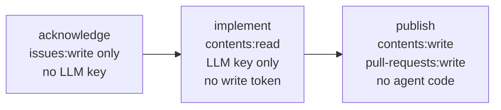

# Single-shot CI with mecatequi

`mecatequi` (`cmd/mecatequi/`) is the headless, single-shot mecatl runner. One prompt in, three artifacts out, then exit. It is stateless by design: there is no session state between runs, no listeners, no TLS, no auth layer. It shares the same engine and service assembly as `mecated` (assembled through `internal/app.Build`) so its behaviour matches the daemon's — the same tool catalog, the same permission model, the same compaction. What it does not have is any forge awareness. It knows nothing about GitHub. The split-privilege job graph, issue extraction, and PR creation live entirely in `.github/` workflows and shell scripts.

---

## What mecatequi produces

A run emits up to three artifacts, plus an exit code:

| Artifact | Flag | Default | Description |
|---|---|---|---|
| Git diff patch | `--out-diff` | disabled (empty) | A unified patch that reproduces modified, added, and deleted files. Suitable for `git apply`. |
| Summary JSON | `--out-summary` | stdout (`-`) | Machine-readable run result (`Summary`, schema version 1). Additive-only contract. |
| JSONL event log | `--out-events` | disabled (empty) | One redacted `session.Event` per line. An artifact for forensics, not a rehydration source. |

### The Summary JSON

`Summary` in `cmd/mecatequi/run.go` is the stable contract `publish.sh` and any downstream consumer reads. Fields:

| Field | JSON key | Notes |
|---|---|---|
| `SchemaVersion` | `schema_version` | Always `1`; bumped only on a breaking change |
| `SessionID` | `session_id` | The session that drove this run |
| `StopReason` | `stop_reason` | Verbatim `session.StopReason` string (see below) |
| `NonEmptyDiff` | `non_empty_diff` | Whether the run left an uncommitted working-tree change |
| `DiffBytes` | `diff_bytes` | Byte length of the computed patch |
| `Usage` | `usage` | `{input_tokens, output_tokens, cache_read_tokens, cache_write_tokens, reasoning_tokens, total_tokens}` |
| `FinalText` | `final_text` | Terminal assistant prose |
| `Error` | `error` | Non-empty only when `stop_reason == "error"` |

The summary is written indented with a trailing newline. When `--out-summary` is `-` (the default), it goes to stdout, making `mecatequi ... | jq .stop_reason` work without any flag.

### The patch

`gitDiffPatch` in `cmd/mecatequi/run.go` runs two git operations against the workspace:

1. `git diff --no-ext-diff HEAD` — tracked modifications and deletions.
2. `git ls-files --others --exclude-standard -z` followed by a `git diff --no-index -- /dev/null <file>` hunk for each untracked, non-ignored file.

The second step is load-bearing: `git diff HEAD` alone silently omits new files, so a patch built from it would lose everything the agent created. Both `non_empty_diff` and `diff_bytes` reflect the full combined patch — a single new file makes `non_empty_diff: true`.

The git environment is scrubbed (`internal/adapter/gitenv.Scrub`) and every git call carries `--no-ext-diff`, so no inherited `GIT_*` variable or repo-named external diff driver can influence the output.

### Exit codes

Exit codes are coarse. Always read `stop_reason` and `non_empty_diff` from the summary to judge whether real work landed.

| Exit code | Meaning |
|---|---|
| `0` | Clean terminal: `end_turn`, `no_progress`, `budget`, `max_turns`, `max_tool_calls`, `max_consecutive_failures`, `structured_output` |
| `1` | Run failure: model error (`stop_reason: error`), cancelled run, no-approver cancel-on-ask, `--timeout` exceeded |
| `2` | Setup failure: bad flags, missing prompt, `app.Build` / `CreateSession` error, non-git or non-top-level workspace, colliding output sinks, write failure |

:::note[Exit 0 is not "task accomplished"]

`no_progress`, `budget`, and `max_turns` all produce exit 0 — the model ran cleanly but may not have finished. A successful CI step that shows `stop_reason: no_progress` and `non_empty_diff: false` means the agent ran without errors and left no changes. Treat those two fields as the real signal.

:::

---

## The split-privilege model

mecatequi's CI integration enforces a hard token boundary across three jobs. Neither the binary nor anything in `engine/` or `internal/` knows about this boundary — it is purely a property of the workflow graph.



**`acknowledge`** runs first, gated on the same trigger as `implement`. It holds only `issues:write` — no LLM key, no contents write. It posts a single comment to the issue confirming the run has started. This guarantees a durable issue-side signal even if everything downstream fails silently.

**`implement`** holds `contents:read` and the LLM key. No write scope, no `id-token`. It runs the agent and uploads the patch, summary, and event log as workflow artifacts. If a prompt-injection attack in the issue text hijacks the agent, the blast radius is the rotatable LLM key — the job cannot push code, open a PR, or comment because it holds no token that can.

**`publish`** holds the write token (`contents:write`, `pull-requests:write`, `issues:write`) but runs no agent code. It downloads the `implement` artifacts and applies the patch as data (`git apply`). Its `if:` condition fires on both `implement` success and failure so a failed run still lands an honest terminal comment instead of silence.

The invariant: **the step that can write to GitHub never runs agent code; the step that runs agent code never holds a write token.**

This invariant holds across both adoption paths — the reusable workflow (§ Reusable workflow) and the escape-hatch template (`.github/workflows/mecatequi-example.yml`).

---

## Prompt trust boundary

| Source | Trust | Handling |
|---|---|---|
| Issue / comment text | Untrusted — attacker-controllable | Extracted via `extract-prompt.sh`, passed via `--prompt-file`, fenced by `--untrusted-prompt` |
| Operator workflow config (posture, flags, model) | Trusted | Set by a maintainer in the workflow; passed as action inputs |
| `--instructions` content | Trusted | Emitted outside the untrusted-prompt fence, never fenced |

`--untrusted-prompt` wraps the prompt body in the harness's untrusted-data fence (`agent.FenceUntrusted` in `cmd/mecatequi/main.go`) so the model treats the issue text as data to act on, not instructions to obey. This is cmd-side only — nothing in `engine/agent` or `internal/app` is modified for it.

`--instructions` is the symmetric trusted channel: operator framing (such as "write your final message as a PR description and self-verify before finishing") that is emitted outside the fence ahead of the prompt body. The GitHub Action bakes in a default `--instructions` value covering both of those; passing an empty string omits the channel entirely, and the prompt is byte-identical to the pre-flag string.

---

## Reusable workflow — the recommended adoption path

`.github/workflows/mecatequi-reusable.yml` is an `on: workflow_call` workflow. A consuming repo references it with a ~15-line caller:

```yaml
jobs:
  mecatequi:
    uses: stacklok/mecatl/.github/workflows/mecatequi-reusable.yml@v0.0.3
    secrets:
      openrouter-key: ${{ secrets.OPENROUTER_CI_TOKEN }}
      publish-app-id: ${{ secrets.RELEASE_APP_ID }}
      publish-app-private-key: ${{ secrets.RELEASE_APP_PRIVATE_KEY }}
    with:
      label: ready-for-agent
      model: anthropic/claude-sonnet-4.6
      default-provider: openrouter
```

Replace `v0.0.3` with the latest released tag. The reusable workflow is the same three jobs with the same per-job permissions, so the token boundary is preserved exactly. No vendored scripts, no mecatl checkout in the consumer — the composite action builds the binary from its own tagged source tree.

The alternative is the escape-hatch template (`.github/workflows/mecatequi-example.yml`), which is a hand-rolled copy of the full job graph. Use it when you need to customise the job graph: a custom author-gate job, an extra approval stage, a different trigger.

### Trigger patterns

The reusable workflow supports two trigger patterns, both configurable via `workflow_call` inputs:

**Issue label** (the default): a maintainer applies a label (default: `mecatequi`) to an issue. The acknowledge → implement → publish graph runs once against the issue body.

**Issue comment mention**: a maintainer comments `@mecatequi` (configurable) on an issue. The graph runs against the comment body.

Both patterns use the trigger as the author gate on private repos — applying a label or commenting requires triage/write access, so GitHub's own permission model decides who can start a run. On public repos, add a dedicated permission-check job that calls the `collaborators/{user}/permission` API.

### Publish token

The `publish` job resolves its write token in precedence order:

1. **GitHub App installation token** (form 1, stronger): minted in-job when `publish-app-id` and `publish-app-private-key` secrets are present. Scoped to exactly this repo's contents + pull-requests + issues.
2. **Pre-minted token** (`publish-token` secret, form 2).
3. **Standing `GITHUB_TOKEN`** grant (form 3, zero-config, emits a `::warning::` nudging you toward form 1 or 2).

---

## Key flags

All flags are defined in `cmd/mecatequi/flags.go`. The binary reads provider credentials from the environment (`OPENAI_API_KEY`, `OPENROUTER_API_KEY`, `ANTHROPIC_API_KEY`, `OPENCODE_API_KEY`) — or, alternatively, an `auth.yaml` credentials file — via `internal/cliconfig.ProviderFlags`, the same credential helper `mecated`, `mecatui`, and `mecak8s` share. Never pass secrets as flag values.

### Prompt and output

| Flag | Default | Notes |
|---|---|---|
| `--prompt` | — | Literal prompt text. At least one of `--prompt` or `--prompt-file` is required. |
| `--prompt-file` | — | Path to a file whose contents are the prompt body. |
| `--untrusted-prompt` | `false` | Wrap the prompt body in the untrusted-data fence. Set `true` for issue-text input. |
| `--instructions` | `""` | Trusted operator framing emitted outside the fence. The GitHub Action sets a non-empty default (PR-description + self-verify framing). |
| `--out-summary` | `-` (stdout) | Where to write the `Summary` JSON. |
| `--out-diff` | `""` (disabled) | Where to write the git patch. Opt in with a path. |
| `--out-events` | `""` (disabled) | Where to write the JSONL event log. Opt in with a path. |

No two outputs may share a sink. Two writers on one stream interleave and corrupt both.

### Engine and run control

| Flag | Default | Notes |
|---|---|---|
| `--workspace` | cwd | Session workspace root. Must be a git repository top level. |
| `--default-provider` | `""` | Select a provider by id (`openai`, `openrouter`, `anthropic`, `opencode`). |
| `--model` | `""` | Per-session passthrough model id. Accepts any id the provider serves, including ids newer than the embedded catalog. Prefer this over `--default-model` for newer models. |
| `--posture` | `""` (strict) | Operator posture ladder: `strict < trusted < auto < yolo`. For an autonomous CI run use `--posture auto` (allow-all, child injection-defence on). With `strict` posture and `--headless`, a main-engine permission ask cancels the run and exits 1. |
| `--headless` | `true` | Default on (inverted from `mecated`). A single-shot CI run has no human approver; child asks are auto-denied or routed to the opt-in ask reviewer. |
| `--timeout` | `0` (disabled) | Wall-clock bound on the whole run (e.g. `40m`). A timeout-cancelled run exits 1 with `stop_reason: cancelled`. |
| `--max-run-tokens` | `0` (unlimited) | Cumulative input+output token ceiling. Crossing it ends cleanly with `stop_reason: budget`. |
| `--max-turns` | `0` (deployment default) | Turn cap for this run. `0` inherits the composition default. |

### Provider keys

`--default-provider` selects a provider; the matching key must be present in the environment or the run fails with "no LLM provider available". A present `OPENAI_API_KEY` auto-enables the OpenAI provider without `--default-provider`. For OpenRouter, Anthropic, or OpenCode Go, set the respective key and pass `--default-provider openrouter`, `--default-provider anthropic`, or `--default-provider opencode`.

---

## Headless posture and permission asks

mecatequi defaults `--headless=true`. The consequences differ for main-agent asks versus child asks:

**Child asks** (subagent / team member / parallel branch): auto-denied by default. The optional `--subagent-ask-reviewer` flag inserts a tool-less, one-turn LLM reviewer that can approve a child ask for that call only. It is fail-safe: any reviewer error keeps the call denied. It fires only in headless mode and is deliberately not a config-file key — granting an autonomous approval capability is an operator deployment decision.

**Main-agent asks**: with `--posture strict` (the default) and `--headless`, a permission ask from the main engine has no approver. `run()` in `cmd/mecatequi/run.go` detects the first `EvPermissionAsk` event, calls `r.Cancel()`, drains the channel to close, then sets `NoApprover=true` in the `runOutcome`. The run exits 1 with an actionable "re-run with `--posture auto|trusted|yolo` or add allow rules" message on stderr. The `StopReason` is `cancelled`, honestly.

The intended CI posture is `--posture auto`: allow-all for the main agent and children, child prompt-injection defence on. Use `yolo` only in a genuinely disposable, isolated, single-tenant context.

---

## What mecatequi does not support

| Capability | Where to look instead |
|---|---|
| Session continuity across runs | `mecated` or `mecak8s` with a durable session store |
| Resuming prior runs | `mecated` (`Service.StartRunContent` on a prior session id) |
| Interactive clients (TUI, IDE) | `mecated` + `mecatui` |
| Inspecting subagents across invocations | `mecated` with `InspectSubagent` and a persisted subagent store |
| Multi-turn conversational bot | Deferred (`mecatequi` v2, pending cloud-native rehydration seam) |

The stateless design is deliberate. A single-shot run reads its task from the issue, produces artifacts, and exits. The forge (GitHub issue + pull request) is the durable record. There is nothing to re-attach to between runs.

---

## Workspace validation

The workspace must be a git repository AND its top level. A subdirectory would silently diff an enclosing repo and produce the wrong patch. mecatequi validates this with `validateWorkspaceRepo` in `cmd/mecatequi/run.go` before calling `app.Build`, mapping a failure to exit 2 with an actionable error message. The comparison resolves both the requested workspace and `git rev-parse --show-toplevel` to absolute, symlink-evaluated paths, so a relative or symlinked `--workspace` still matches correctly.

---

## What's next

- [Pick your deployment shape](/getting-started/deployment-decision.md) — comparison of mecatequi, mecated, mecak8s, and the embedded engine.
- [Run mecated standalone](/deployment/mecated.md) — the long-running daemon with interactive clients, durable sessions, and multi-replica support.
- [Cloud-native k8s with mecak8s](/deployment/mecak8s.md) — Redis-backed, PVC-free Kubernetes deployment.
- [Permissions & guardrails](/what-you-get/permissions.md) — the posture ladder, allow/ask/deny rules, and the headless ask reviewer.
