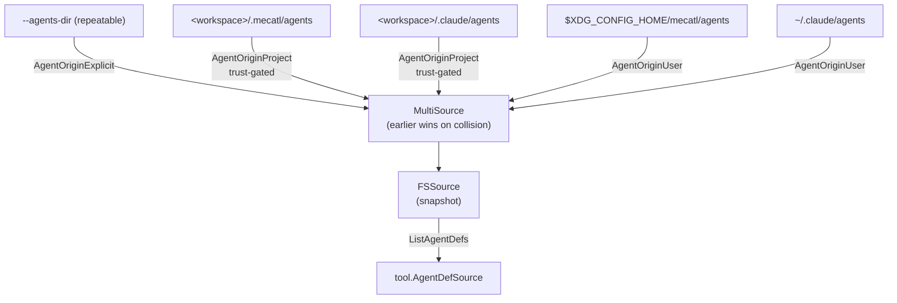

# Agent definitions

Agent definitions are named specialist profiles that give a subagent child a scoped system prompt, optional tool allowlist, per-def model, MCP servers, hooks, and persistent memory. Where an anonymous subagent explorer inherits the parent's defaults, a named specialist is pre-configured: the model invokes it by name and the harness builds a fully scoped engine for that call.

Named definitions are consumed by **two delegation paths**:

- **Subagent tool** — the model passes `agent: "<name>"` to the Subagent tool; the harness routes to that specialist's engine, which still runs read-only (see below).
- **Team members** — the team `MemberSpec.AgentType` field identifies which def to use for a member slot; a mutating member may retain Edit/Write.

A single `<name>.md` file covers both paths without duplication.

---

## The `AgentDef` value object

`engine/tool.AgentDef` is the data type that crosses the port boundary. It is a pure value object with no path, directory, or infrastructure type. Where a definition came from is the adapter's private business; the `Origin` field carries only a tier label for observability.

| Field | Type | Required | Description |
|---|---|---|---|
| `Name` | `string` | yes | The routing key passed to the Subagent `agent` arg; also the `AgentType` handle for team members |
| `Description` | `string` | yes | One-line routing summary, capped at `MaxAgentDescriptionBytes` (2000 bytes). Always in context on every request; keep it concise |
| `Body` | `string` | — | The specialist's full instructions, capped at `MaxAgentBodyBytes` (32 KiB). Composed into the def's system prompt |
| `Tools` | `[]string` | — | Allowlist of core tool names. Absent means the call-site default. `Subagent`/`Parallel`/`ToolSearch` are always excluded regardless |
| `DisallowedTools` | `[]string` | — | Subtractive filter applied after `Tools`/default |
| `Model` | `string` | — | Model alias or full ID. Empty or `"inherit"` means parent model |
| `Provider` | `string` | — | Provider ID (`"openai"`, `"openrouter"`, …). Empty inherits the session provider |
| `PermissionMode` | `string` | — | Raw permission mode string (`default`, `plan`, `acceptEdits`) |
| `MaxTurns` | `int` | — | Per-run turn cap. Zero means call-site default |
| `MaxToolCalls` | `int` | — | Per-run tool-call cap. Zero means call-site default |
| `Skills` | `[]string` | — | Skill names to preload into this def's system prompt at startup |
| `MCPServers` | `[]AgentMCPServer` | — | Per-def MCP servers (reference or inline; see below) |
| `Hooks` | `map[string]string` | — | Phase → shell command map scoped to this def's engine |
| `Memory` | `string` | — | Persistent memory tier: `""` (none), `"user"`, or `"project"` (read-only in v1) |
| `Color` | `string` | — | UX hint only; never affects execution |
| `Origin` | `AgentOrigin` | — | Admission tier label (set by the source adapter, not the file itself) |

The two byte caps are canonical — the filesystem parser truncates on discovery, and a remote-driver client re-truncates wire data defensively:

```go
const MaxAgentDescriptionBytes = 2000    // always-in-context; conservative
const MaxAgentBodyBytes        = 32*1024 // in-context only for the specialist itself
```

### MCP server entries

Each `AgentMCPServer` entry in `MCPServers` is either a **reference** (a configured main server's name, `URL` empty) or an **inline** streamable-HTTP server (`Name` + `URL` + optional `Headers`). `AgentMCPServer.IsReference()` reports which:

```go
type AgentMCPServer struct {
    Name    string
    URL     string            // empty = reference
    Headers map[string]string // SECRET-SHAPED; never logged or projected
}

func (s AgentMCPServer) IsReference() bool { return strings.TrimSpace(s.URL) == "" }
```

`Headers` is secret-shaped. The harness never logs it, never surfaces it in any inventory or snapshot, and never sends it over any non-local cleartext channel.

stdio and non-HTTP transports are rejected outright. Only streamable-HTTP inline entries are admitted.

### Admission tiers

`AgentOrigin` is a closed label set:

| Constant | Tier |
|---|---|
| `AgentOriginExplicit` | Operator-configured path or `--agents-dir` flag |
| `AgentOriginProject` | Workspace-local (trust-gated at source construction) |
| `AgentOriginUser` | User-global (never trust-gated) |
| `AgentOriginDriver` | Remote gRPC driver (`--agent-source-url`) |

Origin is stamped by the source adapter, not the file. A consumer that encounters an unrecognised value normalizes it to `AgentOriginDriver`.

---

## The `AgentDefSource` port

`engine/tool.AgentDefSource` is the read-only seam agent definitions cross into the harness:

```go
type AgentDefSource interface {
    ListAgentDefs(ctx context.Context) ([]AgentDef, error)
}
```

`ListAgentDefs` must return defs **sorted by name** with **unique names**. The interface is **snapshot-semantics**: the harness resolves once at build time and the result is stable for the life of the source. Per-def child engines are built exactly once; the build-once, trust-gate-completeness invariant depends on this.

The harness has no `Get` method on the port. The `agents.Registry` (adapter-side) provides name-indexed lookup and the non-port `Detail` channel for composition diagnostics, but neither crosses the port boundary.

---

## Reference implementations

### `engine/adapter/sourceconformance` — testing

`sourceconformance.AgentFixture` is the canonical fixture set: three defs covering a minimal def (name + description + body), a fully-loaded def (every optional field), and an MCP-bearing def (one reference entry + one inline entry with secret headers).

`RunAgentSource(t, newSource)` is the shared conformance suite. Pass it a function that returns a fresh `tool.AgentDefSource` serving exactly the fixture, and the suite verifies:

- The list matches the fixture on every field except `Origin` (each backend stamps its own tier).
- The list is stable across calls (snapshot semantics).
- No def violates the `MaxAgentDescriptionBytes` or `MaxAgentBodyBytes` caps.

`NewAgentFixtureSource()` returns the in-memory reference implementation that serves the fixture with `AgentOriginExplicit` stamped. It is also the suite's self-test subject:

```go
// in your adapter test
func TestMyAgentSource(t *testing.T) {
    sourceconformance.RunAgentSource(t, func(t *testing.T) tool.AgentDefSource {
        return myNewSource(t)
    })
}
```

### `engine/adapter/agentfs` — production filesystem source (importable)

The production adapter reads flat `<name>.md` files from one or more directories. It graduated into the importable engine module (`engine/adapter/agentfs`, issue #328) so an external consumer can compose its own sources directly; the in-repo binaries consume it through the `internal/adapter/agents` package, which re-exports it via thin aliases (there is no second copy to drift). The main types:

| Type | Role |
|---|---|
| `DirSource` | Scans one local directory; stamps each def with an admission tier and a diagnostics detail string |
| `MultiSource` | Composes an ordered list of `AgentSource`s; earlier-wins on name collisions |
| `FSSource` | Snapshot `tool.AgentDefSource` built by running `NewMultiSource` once at construction |
| `Registry` | Immutable name-indexed view used by the composition layer; not a port type |

`ResolveSources(opts ResolveOptions)` builds the ordered, highest-precedence-first source list from the conventional locations and any explicit paths. Precedence (highest first):

1. `--agents-dir` flags (`AgentOriginExplicit`)
2. `<workspace>/.mecatl/agents` (`AgentOriginProject`, trust-gated)
3. `<workspace>/.claude/agents` (`AgentOriginProject`, trust-gated)
4. `$XDG_CONFIG_HOME/mecatl/agents` (`AgentOriginUser`)
5. `~/.claude/agents` (`AgentOriginUser`)

The project tier is withheld when the workspace is untrusted (`ResolveOptions.IncludeProjectTier = false`). User-tier sources are never gated.

`NewFSSource(ctx, sources...)` runs discovery once, stamps `AgentOriginExplicit` on any def that arrived without a tier, and returns the snapshot plus aggregated `SkipError` diagnostics. Discovery is forgiving: an absent directory yields no defs and no error; a malformed file is skipped and reported, not fatal.

The `Registry.Detail` method exposes the adapter-private locator string (`"<label>: <path>"`) for composition diagnostics. It is non-port and never reaches any model-facing surface.

---

## File format

A definition file is Markdown with a YAML frontmatter block. The `name` and `description` fields are required; everything else is optional.

```
.mecatl/agents/
└── code-reviewer.md
```

```yaml
---
name: code-reviewer
description: Reviews a diff for correctness, style, and test coverage.
tools: [Read, Grep, Glob]
disallowedTools: [Write]
model: sonnet
provider: openrouter
permissionMode: plan
maxTurns: 9
maxToolCalls: 25
color: blue
skills: [refactoring]
hooks:
  PreToolUse: ./scripts/review-gate.sh
mcpServers:
  - github
  - name: jira
    url: https://jira.example/mcp
    headers: { Authorization: "Bearer ${TOKEN}" }
memory: project
---
You are a meticulous code reviewer. Focus on correctness first, then style.
```

The `tools` and `disallowedTools` fields accept either a YAML array (`[Read, Grep]`) or a comma/space-separated string (`"Read, Grep"`) for compatibility with Claude Code's `.claude/agents` format.

The `mcpServers` field accepts three forms interchangeably: a scalar string of comma-separated names, a YAML array of name strings, or a YAML array of mappings (for inline servers). Scalars and mappings may be mixed in one array.

An inline `mcpServers` entry that declares a `command:`, `type: stdio`, or any non-HTTP transport is rejected with a non-fatal diagnostic and dropped. The def itself is still kept.

:::note[Secret headers]

`headers` values are secret-shaped. Never log them, print them in diagnostics, or include them in any inventory surface. The composition layer enforces this. The field rides the driver wire only because driver dials refuse non-local cleartext connections.

:::

### `memory` field

The `memory` field accepts three values:

| Value | Behaviour |
|---|---|
| `""` (absent) | No memory; cold start (default) |
| `"user"` | Cross-project per-agent dir under `$XDG_CONFIG_HOME/mecatl/agents-memory/<sanitized-name>/` |
| `"project"` | Workspace-relative: `<workspace>/.mecatl/agents-memory/<sanitized-name>/`, **trust-gated** |

The `MEMORY.md` head (bounded at ~8 KiB) is injected as fenced `UNTRUSTED DATA` into the def's cache-stable system-prompt prefix at startup. **Read-only in v1** — the agent gains no write tools.

The trust gate on `"project"` memory keys on the **resolved tier**, not on the def's `Origin`. A user-tier def with `memory: project` still cannot read untrusted workspace memory. The def name is path-sanitized (allowlist + containment check) to prevent directory traversal; the resolved path is also symlink-contained (CWE-59).

Any value other than `""`, `"user"`, or `"project"` is a non-fatal diagnostic; the field falls back to `""`.

---

## Discovery tiers



**Precedence:** explicit > project > user. When two sources provide a def with the same name, the higher-precedence source wins; the lower-precedence entry is dropped and reported as a `SkipError` with `Fatal: true`.

The project tier is controlled by `ResolveOptions.IncludeProjectTier`, which the composition layer sets based on `cfg.TrustProject`. This is the same trust gate that governs project-tier skills, soul, and permission allow rules — a single `--trust-project` flag or `trustedWorkspaces:` entry admits the entire project-tier authority set.

Conventional discovery (`--agents-conventional`, on by default) is inert when the directories are absent — no error, no defs, no configuration required.

---

## Calling a named agent

The model invokes a specialist by passing the `agent` parameter to the Subagent tool:

```
Subagent(agent="code-reviewer", task="review the diff in HEAD")
```

On the Subagent path, named specialists are **read-only by default** (`SubagentTool.ReadOnly()` stays `true`). Edit and Write are dropped from the catalog even if the def's `tools` allowlist includes them, with a startup diagnostic. The specialist runs in an isolated git worktree (when Bash is configured and the workspace is trusted) so it retains a shell for inspection while writes land in a throwaway clone.

A specialist can also be invoked writable, landing edits directly in the real workspace — see [Writable named specialists](#writable-named-specialists) below. For concurrent mutating work, use the team member path with a `Mutating` member flag instead.

### Combining `agent` and `model`

The `agent` and `model` Subagent parameters may be used together:

```
Subagent(agent="code-reviewer", model="opus", task="deep review")
```

The harness rebuilds the specialist's scoped engine on the override model (catalog, prompt, skills, hooks, memory — the full def scope) rather than using the pre-built def engine. The model is taken verbatim with no alias resolution (parity with the model-only path). The per-def limits still bind. A def with inline MCP servers is rejected on the `agent`+`model` path in v1 (the inline manager has no process-lifetime owner for a per-call engine); reference-only MCP is supported.

### Writable named specialists

A named specialist can also run **writable**: pass `mode: "read-write"` alongside `agent` and the specialist edits the real parent workspace directly, instead of running read-only in a throwaway worktree clone.

```
Subagent(agent="code-reviewer", mode="read-write", task="apply the review fixes")
```

This reuses the same direct-write mechanics as the generic writable Subagent (no fork, no copy, no merge-back — the specialist's Edit/Write/Bash mutate the real tree in place, exactly as the main agent does). What's new is that the specialist keeps its **own** scoped engine — prompt, skills, catalog, model — instead of falling back to the generic writable explorer. The harness rebuilds the def's scoped engine with mutating tools kept, on the def's resolved provider/model, using the main session's command runner.

A few scope limits apply:

- **`agent` + `model` + `mode: "read-write"` together is rejected.** A writable specialist always runs on its own resolved model; there's no per-call model override for this path. Drop `model` (or drop `agent` to get a writable explorer on a chosen model).
- **The deployment must wire writable-specialist support**, or the call fails with "not supported in this deployment." A no-filesystem session never wires this path, so writable specialists are unavailable there.
- **The def's own tool allowlist still governs.** Running writable only *permits* Edit/Write/Bash to survive scoping — it doesn't force-inject them. A def whose `tools` allowlist excludes Edit/Write stays non-mutating even when invoked with `mode: "read-write"`.
- **Inline MCP servers are declined** on this path (a v1 scope limit — an inline server's live connection has no process-lifetime owner on a per-call engine). Reference-only MCP servers (naming a configured main server) work fine, since they borrow the shared connection.
- **Permissions resolve at main-session parity.** The child's posture is non-isolated, so it does not get the isolated-child auto-approve for read-only/build commands — its Bash, Edit, and Write asks resolve under the operator's normal posture and policy, the same as the main agent's own tools.

As with the generic writable Subagent, a crashed or cancelled writable specialist can leave partial edits in the working tree — there's no fork to discard. Git is the rollback layer: review with `git diff`/`git status`, undo with `git checkout`/`git stash`.

An unknown agent name, or a known agent whose def can't run writable (inline MCP servers), is a model-addressable error suggesting the specialist be run read-only or that an anonymous writable explorer be used instead.

### What the model sees when no def matches

An unknown `agent` name is a model-addressable error that lists the valid names. The model can retry with a corrected name or fall back to an anonymous subagent.

---

## Implementing a custom source

To supply agent definitions from a source other than the filesystem (a database, a remote registry, a test fixture):

1. Implement `tool.AgentDefSource` — one method, `ListAgentDefs`, returning a name-sorted, unique slice.
2. Stamp each def's `Origin` with the appropriate `AgentOrigin` tier constant.
3. Respect the byte caps: truncate `Description` to `MaxAgentDescriptionBytes` (2000) and `Body` to `MaxAgentBodyBytes` (32 KiB) before returning.
4. Apply snapshot semantics: run your resolution once at construction; return the same stable slice on every `ListAgentDefs` call.
5. Validate with the conformance suite: call `sourceconformance.RunAgentSource(t, newSource)` against your implementation serving `sourceconformance.AgentFixture`.

A remote gRPC driver implements `mecatl.driver.v1.AgentSourceService` and is wired via `--agent-source-url`. It is mutually exclusive with `--agents-dir` and supersedes conventional discovery.

---

## What's next

- [Skills](/extension-points/tool-catalog.md#skills) — the skill source port follows the same snapshot seam and shares the conformance-suite pattern.
- [Subagent delegation](/what-you-get/subagents-teams-parallel.md) — how the agent loop dispatches child runs and manages concurrency.
- [Permissions & guardrails](/what-you-get/permissions.md) — how workspace trust gates the project tier and what untrusted mode degrades.
- [Hook system](/what-you-get/hooks.md) — per-def hooks scoped to a specialist's engine.
