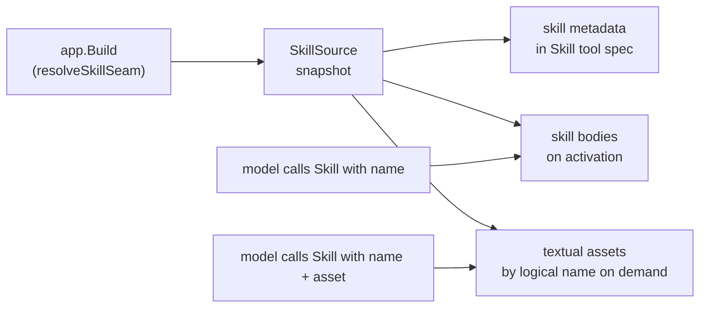
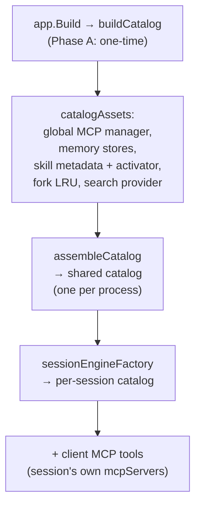

# Tool catalog

The tool catalog is the registry every tool call passes through. It holds the mapping from name to `tool.Tool`, drives the `ReadOnly` dispatch model, and is the extension point where custom tools, MCP server tools, and skill bundles enter the harness.

---

## The `Catalog` type

`engine/tool.Catalog` is a name → `Tool` map. Create one with `tool.NewCatalog()`. The loop never constructs a catalog — you build it and inject it.

### Registration

```go
cat := tool.NewCatalog()

// MustRegister panics on duplicate — right for static startup registration.
cat.MustRegister(myTool)

// Register returns ErrDuplicateTool on duplicate — right for dynamic registration
// where you want to handle the error rather than panic.
if err := cat.Register(myTool); errors.Is(err, tool.ErrDuplicateTool) {
    // handle the collision
}
```

**Collision rule: global-wins.** `assembleCatalog` in `internal/app` registers families in a fixed order:

```
core → server-global MCP (+ resource meta-tools) → client MCP →
Subagent / InspectSubagent / SubagentStatus → Parallel →
Team / InspectMember → memory → user-model → Skill → SkillDraft
```

`mcp.Register` is first-wins + skip-and-continue: a later tier with a name that collides with an already-registered tool is silently dropped and the skipped names are surfaced in a WARN diagnostic. That means server-global MCP tools win over client MCP tools with the same name, and core tools win over everything. You cannot displace a built-in tool by registering an MCP server with a conflicting name.

### Querying

| Method | Returns |
|---|---|
| `cat.Lookup(name)` | `(Tool, bool)` — the registered tool or `(nil, false)` |
| `cat.Tools()` | All registered tools, sorted by name for determinism |
| `cat.Available(mode)` | Mode-filtered tools: in `ModePlan`, non-read-only tools are excluded |
| `cat.Specs(mode)` | `[]ToolSpec` of `Available(mode)` |
| `cat.AdvertisedSpecs(mode)` | Per-turn specs under progressive disclosure — tools that implement `Disclosable` return their lightweight `Advertised()` spec instead of the full one |

Plan-mode filtering is enforced at the catalog level, before dispatch reaches the tool. A non-read-only tool that the model calls in plan mode never executes — the catalog does not expose it.

---

## The `Tool` interface

Every tool registered in the catalog implements `engine/tool.Tool`:

```go
type Tool interface {
    Spec() ToolSpec
    ReadOnly() bool
    Execute(ctx context.Context, in session.ToolCall, ws Workspace) (session.ToolResult, error)
}
```

### `Spec() ToolSpec`

`ToolSpec` is what the model sees:

```go
type ToolSpec struct {
    Name        string          // catalog name; must be unique across registrations
    Description string          // model-facing documentation: when to use, when not, limits
    Schema      json.RawMessage // JSON Schema for the tool's arguments
}
```

`Description` should be documentation-quality prose — it is the model's contract for when and how to call the tool. `Schema` is the JSON Schema the LLM adapter sends to the model to constrain argument generation.

### `ReadOnly() bool`

`ReadOnly` drives the loop's **read-parallel / mutate-serial dispatch model**. Within a single turn:

- All `ReadOnly() == true` calls are batched and executed concurrently.
- Any `ReadOnly() == false` call runs alone, never overlapping another tool execution.

This means your tool's declaration of read-only is a **correctness contract**, not a hint. If your tool mutates the workspace and returns `true`, it can overlap another write.

:::note[Default-conservative for MCP tools]

MCP tools default to `ReadOnly() == false` unless the remote server advertises `annotations.readOnlyHint == true`. This is the conservative choice: an unknown remote tool is serialized with mutations.

:::

### `Execute`

`Execute` receives the model's tool call (`session.ToolCall`, which carries the call ID and the raw JSON args), and a `Workspace` scoped to the session root. Return a `session.ToolResult` for success or a model-visible error result; return a non-nil Go error only for harness-level faults the model cannot recover from.

Tool errors do not abort the run. A `ToolResult` with `IsError: true` is fed back to the model as the tool's result, and the model can retry or choose a different path.

### Progressive disclosure: `Disclosable`

A tool may optionally implement `Disclosable` to participate in progressive tool disclosure (corpus pattern 9):

```go
type Disclosable interface {
    Tool
    Advertised() ToolSpec // cheap, metadata-only spec for the per-turn inventory
}
```

A `Disclosable` tool is advertised in the per-turn tool list with its lightweight `Advertised()` spec (typically just a name and a one-line description, with a minimal or empty schema) until the model explicitly hydrates the full spec via `ToolSearch`. Tools that do not implement `Disclosable` always appear in the per-turn list with their full `Spec()` — the catalog default is unchanged.

---

## Adding a custom tool

Implement the three-method interface and register at build time. A minimal example:

```go
package mytool

import (
    "context"
    "encoding/json"

    "github.com/stacklok/mecatl/engine/session"
    "github.com/stacklok/mecatl/engine/tool"
)

type PingTool struct{}

func (PingTool) Spec() tool.ToolSpec {
    return tool.ToolSpec{
        Name:        "Ping",
        Description: "Returns a pong. Use this to verify the tool catalog is reachable. Takes no arguments.",
        Schema:      json.RawMessage(`{"type":"object","properties":{}}`),
    }
}

func (PingTool) ReadOnly() bool { return true }

func (PingTool) Execute(_ context.Context, in session.ToolCall, _ tool.Workspace) (session.ToolResult, error) {
    return session.NewToolResult(in.ID, "pong"), nil
}
```

Register it before calling `app.Build`:

```go
// In your composition root, before or during app.Build.
cat.MustRegister(mytool.PingTool{})
```

`session.NewToolResult(id, content)` and `session.NewToolError(id, msg)` are the two constructors for a plain text result. Use `NewToolError` when the tool failed in a way the model should know about and can recover from. A third constructor, `session.NewToolResultWithParts(id, content, parts)`, backs the typed-content-block results described in [MCP client](/what-you-get/mcp-client.md#typed-tool-results) — most custom tools only need the plain-text pair above.

:::note[Build-time vs. per-session]

A tool registered at build time appears in **every session's catalog**. If a tool needs per-session state — a session-scoped HTTP client, a connection derived from session credentials — it must be wired differently. See [Per-session vs. shared catalog](#per-session-vs-shared-catalog) below.

:::

---

## MCP servers as tools

`mecated` can mount MCP servers at startup. Each server's advertised tools land in the catalog under a **namespace prefix** so their names cannot collide with built-in tool names.

### Naming convention

Every tool from an MCP server is registered as `mcp__<server-name>__<tool-name>`. For example, a server named `github` advertising a tool `search_repos` registers as `mcp__github__search_repos`.

### The `--mcp-server` flag

```
mecated serve --mcp-server github=https://mcp.github.example.com/v1 \
        --mcp-server slack=https://mcp.slack.example.com/v1
```

Each `name=URL` pair connects to a streaming-HTTP MCP server at startup. An auth token is read from the environment variable `MCP_<NAME>_TOKEN` (e.g. `MCP_GITHUB_TOKEN`). Multiple `--mcp-server` flags are additive. Server names must match `[A-Za-z0-9_]+` and be case-insensitively unique (the name derives the env var), and when a token is present the URL must be `https` — or `http` to a loopback host — so the bearer is never sent in cleartext off-host.

For a deliberately plain-http endpoint on a trusted network segment (e.g. an in-cluster Service behind a NetworkPolicy), `--mcp-server-insecure-http <name>` (repeatable) opts that one server out of the https rule. It is an explicit acknowledgment that the token travels **cleartext on the network path** — you are relying on network-layer controls plus a short-lived token. The relaxation covers only the named server and only the `http` scheme; naming a server that is not registered, or whose URL is already `https`/loopback, is a startup error.

mecatl also integrates with ToolHive: `--toolhive` (default on) discovers already-running ToolHive workloads by their HTTP proxy URLs. mecatl never starts or spawns ToolHive workloads — it only reads URLs from an already-running instance.

### The `--mcp-resource-tools` flag

When a connected server exposes MCP resources (server-provided documents addressable by URI), two harness-level meta-tools are registered:

- `ListMcpResources` — enumerates resources across connected servers; optionally filtered to one server by name.
- `ReadMcpResource` — fetches a resource by URI.

These tools use plain names (not the `mcp__` namespace) because they are harness meta-tools, not proxies for a specific remote tool. They are read-only and survive the plan-mode catalog filter.

`--mcp-resource-tools` defaults to `true` but is a no-op when no connected server exposes any resources.

### The `--mcp-prompts` flag

When `--mcp-prompts` is enabled (default on), the harness registers an expander for slash-command inputs of the form `/mcp__<server>__<prompt> key=value`. At `app.Build` time, mecatl takes a static snapshot of each server's advertised prompts. At run time, `/mcp__github__summarize_pr number=42` renders into the server's prompt template and injects it as the turn's instruction.

:::warning[Trust boundary]

MCP prompts steer the model like a slash command — a prompt template can rewrite the agent's goal. Enable `--mcp-prompts` only for servers you own or fully trust.

:::

### Connection resilience

The MCP adapter reconnects dropped sessions transparently (ADR 0056). A single retry is attempted; if the reconnect fails, the tool returns a model-visible error (`mcp call failed: MCP server "<name>" unavailable after reconnect`) rather than aborting the turn.

---

## Skills

Skills are a separate extension seam for **instruction bundles**, not new tool implementations.

### What a skill is

A skill is a named `SKILL.md` file containing YAML frontmatter (`name`, `description`) followed by a markdown body. The `name` is the stable activation key; `description` is the one-line always-in-context trigger hint the `Skill` tool's description enumerates. The body is the full instruction set — loaded only when the model activates the skill.

Skills follow **progressive disclosure**: the metadata (`name` + `description`) is always present in the `Skill` tool's spec, cache-stable across turns. The body loads on demand when the model calls `Skill("my-skill-name")`.

### The `SkillSource` port

The port for skill bundles is `engine/tool.SkillSource`:

```go
type SkillSource interface {
    ListSkills(ctx context.Context) ([]SkillMeta, error)
    SkillBody(ctx context.Context, name string) (string, error)
    ListSkillAssets(ctx context.Context, name string) ([]SkillAsset, error)
    ReadSkillAsset(ctx context.Context, skill, asset string) ([]byte, error)
}
```

A `SkillSource` deals in **logical bundles** — no path, directory, or root concept is present on the port. Both the filesystem-backed source (`engine/adapter/skillfs.FSSource`) and a remote driver are consumed identically through these methods; filesystem paths remain private to the adapter.

Skills may have **assets**: auxiliary payloads identified by a logical name like `references/api.md`. Asset names are slash-separated relative identifiers with no `..` or empty segments — validated by `tool.ValidSkillAssetName`. Calling `Skill` with `{name}` returns the instructions and bounded logical inventory. Calling it again with `{name, asset}` fetches only that textual payload, bounded by the tool-output cap and rejected if it is invalid UTF-8 or contains NUL bytes. Assets are not materialized, mounted as workspace read roots, or made available to `Read` or Bash.

### Skills inject instructions, not tools

Activating a skill does **not** register new tools in the catalog. A skill's `SKILL.md` body is returned as the tool result of the `Skill` tool call, and the model incorporates it as instructions. Bundled scripts are not implicitly installed or executable: a workflow needing a real file must explicitly create or obtain it in the workspace under normal permissions. If you want to expose new tool capabilities, register a `Tool` (see above); skills are for instruction and behavioral guidance.

### Skills as slash commands (`/<skill-name>`)

Each discovered skill is also invocable as a **slash command**: `/<skill-name>`
expands to the skill's body directly in context (Claude-Code skill-as-command
semantics — the body IS the command template). It reuses the existing
slash-command layer, so `$ARGUMENTS`/`$1`/`$2` placeholders substitute exactly
like a file-backed command. Precedence (first-that-expands-wins): a local
command file shadows a same-named skill; a skill shadows a same-named
slash-command driver source; both shadow MCP prompts. The project-tier trust
gate is inherited — an untrusted workspace's project-tier skills are not
invocable as `/<skill-name>` until you `--trust-project`. See
[`docs/usage/skills-soul-usermodel.md`](https://github.com/stacklok/mecatl/blob/main/docs/usage/skills-soul-usermodel.md#skills-as-slash-commands-skill-name)
for the full rules.

### The filesystem source

`engine/adapter/skillfs.FSSource` is the reference `SkillSource` implementation (graduated into the importable engine module per #328; the in-repo binaries consume it through `internal/adapter/skills`, which re-exports it via alias). It discovers `SKILL.md` files under a directory at construction time and takes a **snapshot** — `ListSkills` is stable for the life of the source. There is no watch seam: skills are resolved once at `app.Build` and do not change mid-process. This is deliberate: the build-once trust-gate invariant depends on skills being resolved at a known trust level before any session starts.

Skill sources are registered per tier (explicit, project, user, driver) and are trust-gated at construction. The project tier is only admitted when workspace trust is granted. See `engine/adapter/skillfs` for `FSSource`, `DirSource`, and the trust-tier resolution logic.



---

## Per-session vs. shared catalog

The shared catalog is built once in `app.Build` (Phase A + `assembleCatalog`). It is the starting point for every session. Per-session deltas are strictly controlled.



**Sanctioned per-session deltas** (the only two things that may differ between the shared catalog and a session's catalog):

1. **Client MCP tools** — tools from MCP servers the client provided in its `CreateSession` request (`mcpServers`). These are session-scoped and are closed when the session ends.
2. **Unwrapped hooks** — `maybeWrapUserModelReview` decorates the main engine only; per-session engines built for selectors use the unwrapped hook.

Everything else is identical. The invariant is enforced by `TestPerSessionCatalogMatchesSharedCatalog` (exact tool-name-set equality).

If you need a tool that carries **per-session state**, you have two options:

- Make the tool stateless and inject dependencies through the `Workspace` or via closures captured at construction time in `assembleCatalog` (where the per-session context is available).
- Wire a custom `sessionEngineFactory` that constructs the per-session catalog differently — but you take on maintaining parity with the shared catalog yourself.

:::note[Global MCP manager lifecycle]

The global MCP manager is owned by `Build`. Its `Close` is **never** folded into a per-session close. A per-session `CloseSession` closing the global manager would kill MCP for every other concurrent session.

:::

---

## `ToolCallRecorder`

`engine/port.ToolCallRecorder` is the audit seam for tool execution. It is distinct from the `EventSink` (the model-visible event stream) and from `port.Diagnostics` (operator-facing log).

```go
type ToolCallRecorder interface {
    ToolCall(id session.SessionID, call session.ToolCall, result session.ToolResult, queued, took time.Duration)
}
```

`queued` is the coordinated-omission measure: the gap between when a call entered dispatch and when its execution actually began. For a read-only call that ran immediately, `queued` is near-zero. For a mutating call held behind a permission ask or behind an in-progress read batch, `queued` is the real wait. Both durations are zero when no `Clock` is injected.

The `jsonlstore.Store` implements `port.ToolCallRecorder` alongside `port.SessionStore` and `port.EventLog`. It writes one JSON record per `ToolCall` invocation to a `.tools.jsonl` sidecar in the session's family directory (`<store-dir>/sid-v1/`; see [Session store](./session-store.md) for the layout and why the filename is not the session id). The `.tools.jsonl` file is parallel to, not a superset of, the `.events.jsonl` event log:

| File | What it captures |
|---|---|
| `*.tools.jsonl` | Structured per-tool audit: args, queue/exec timing |
| `*.events.jsonl` | Relayed run stream: reasoning, ask/verdict pairs, delegation lifecycle |

Neither subsumes the other. Wire a `ToolCallRecorder` when you need structured latency/audit data per tool call that is separate from the model's event stream.

---

## What's next

- [The agent loop](../what-you-get/agent-loop.md) — how the dispatcher executes the catalog's tools and applies the read-parallel / mutate-serial model.
- [Permissions & guardrails](../what-you-get/permissions.md) — how tool calls are evaluated before the catalog executes them, and how guardrails inspect the data crossing the tool boundary.
- [Hook system](../what-you-get/hooks.md) — `PreToolUse` and `PostToolUse` hooks that decorate catalog execution without modifying tool implementations.
- [LLM provider port](llm-provider.md) — the other half of what the loop dispatches against; implement it to bring your own model backend.
