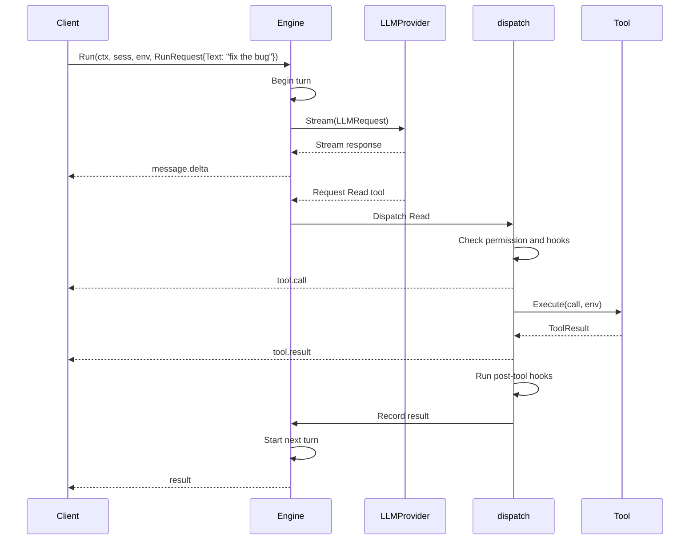

# The agent loop

`Engine.Run` starts a background loop and returns a `*Run` handle. Use the
handle's event channel to follow the run and answer permission requests. The
loop calls the model, runs tools, records their results, and repeats until the
session ends.

## The event stream

`Run.Events()` returns every observable event in order and closes when the run
ends. Range over the channel to follow a session from start to finish.

Events you will see, roughly in order:

|Event|When it fires|
|-|-|
|`session.init`|Once, before the first turn|
|`turn.start`|Beginning of each LLM turn|
|`message.delta`|Streaming text fragments from the model|
|`tool.call`|A tool call is about to execute|
|`tool.result`|A tool finished and returned a result|
|`permission.ask`|The loop has paused for approval|
|`result`|The run ended; includes usage and the stop reason|

The sequence for a single turn with one tool call looks like this:

---

## Turn structure

Each turn follows this sequence:

1. **Check limits.** The run ends if it has a stop reason, is cancelled, or has
   reached its token budget.
2. **Compact when needed.** If the request approaches the context limit, the
   loop compresses persisted history before the next model call. See
   [Context limits and compaction](#context-limits-and-compaction).
3. **Call the model.** Mecatl streams the response and retries eligible failures
   that occur before output becomes visible.
4. **Run tools.** Mecatl dispatches requested tools, records their results, and
   starts another turn.
5. **Finish or continue.** Meaningful text without tool calls ends the run. An
   empty or reasoning-only response receives up to `MaxNoProgressNudges`
   continuation prompts before ending with `StopNoProgress`. Cancellation,
   refusal, truncation, and failure end immediately.

A tool error does not abort the run. It becomes an error result fed back to the
model, which can retry or choose a different path.

### Retrying a failed model step

A terminal result can include `retry_disposition` (`unknown`, `retryable`, or
`permanent`) and `stream_progress` (`unknown`, `precommit`, `visible`, or
`complete`). Missing fields do not indicate that retry is safe.

Use gRPC `RetryStart` or `POST /v1/sessions/{id}/retry` to repeat an eligible
step without adding a user message. Automate only bounded retries marked
`retryable` and `precommit`. Require a person to decide after visible output.

## Read-parallel / mutate-serial dispatch

When one turn requests multiple tools:

- Consecutive read-only calls are authorized in order, then run concurrently.
- Mutating calls and calls with unknown safety run alone.
- Results return to the model in their original order.

The dispatcher enforces these rules; clients do not need to coordinate calls.

## Permission pause/resume

When a tool call requires human or policy approval, the loop pauses and emits a
`permission.ask` event. The event carries an `askID`, the tool name, the
arguments, and the reason the call was flagged.

Your client returns one of three verdicts:

- **Allow once** runs the tool without learning a rule.
- **Allow always** runs the tool and learns a session-scoped allow rule so the
  same pattern will not ask again in this session.
- **Deny** returns a permission error to the model, which can adapt.

An abandoned request fails closed. Mecatl registers the request before emitting
the event, so an early verdict is not lost.

gRPC clients send `ResumeApproval` on the `Converse` stream. HTTP clients use
`POST /v1/sessions/{id}/approve`.

## Context limits and compaction

Before each turn, Mecatl estimates the complete model request and compacts
persisted history when it approaches the selected model's context window. A
separate run-token budget can end the session between turns.

[Context windows](./context-windows.md) owns the resolution order, compaction
strategies, thresholds, token-budget behavior, and `mecatui` context meter.

---

## Cancellation and terminal states

Every run ends in exactly one of three terminal states:

|State|Meaning|
|-|-|
|`completed`|The model or a limit ended the run cleanly. Stop reasons include `end_turn`, `budget`, `no_progress`, and `max_turns`.|
|`cancelled`|`Run.Cancel()` was called, or the context was cancelled|
|`failed`|An unrecoverable error (e.g. the LLM provider returned an error that exhausted retries)|

`Run.Cancel()` ends the run as `cancelled`, either during dispatch or at the
next turn boundary. Restart closes incomplete tool calls with error results so
the conversation remains valid.

The service repairs incomplete tool calls before recovering a failed,
cancelled, or abandoned run. An awaiting session keeps its pending approval.
See [Start and resume sessions](./start-and-resume-sessions.md) for the client
workflow and [Session continuity](./session-continuity.md) for persistence and
crash recovery.

## Next steps

- [Permissions and posture](./permissions-and-posture.md) for how the permission rule
  engine and model-based guardrails work.
- [Hook system](./hooks.md) for lifecycle hooks that fire before and after tool
  calls, prompts, and sessions.
- [Extension points](/building/extension-points/index.md) to replace providers,
  stores, policies, and other capabilities.
