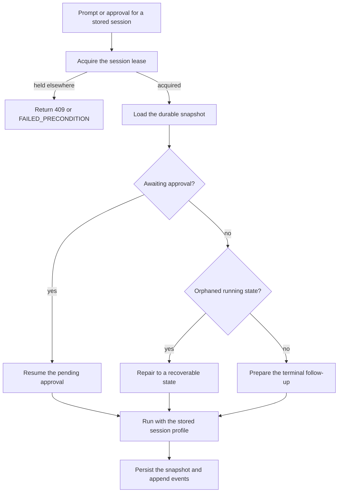

# Session continuity

A durable session store lets a Mecatl session survive a process restart. The
store preserves the provider-neutral conversation, state, usage, limits,
environment identity, and metadata needed to rebuild the same session profile.
A later process loads that snapshot and resumes the existing conversation.

## Availability

Continuity is available in these forms:

- **Local JSONL:** `mecated --store-dir DIR` persists sessions and their event-log
  sidecars on one host.
- **Redis:** `mecak8s --redis-url host:port` provides the storage-free deployment's
  session store and durable event log.
- **Remote drivers:** a session-store driver and event-log driver can be supplied
  independently over the driver protocol.
- **In memory:** the default when no store is configured. It is useful for demos
  and ephemeral runs, but it does not survive restart.

A durable store is also required for persisted Subagent `resume:` handles and for
ACP session loading. The embedded mecatui server uses its configured local state;
`mecatui connect` uses the remote server's capabilities and cannot manage storage
policy it does not own.

## Persist and resume

Use a stable store directory when starting a daemon:

```console
mecated serve \
  --store-dir "$HOME/.local/state/mecatl/sessions" \
  --workspace "$PWD"
```

The store contains prompts, model output, tool arguments and results, owner
metadata, and event history. Treat it as sensitive plaintext: keep the directory
owner-only, do not commit it, and do not place it in a shared sync folder or
unencrypted multi-user backup.

A prompt against an existing session goes through a run-entry recovery funnel.
The service reopens completed sessions, interrupts cancelled ones, recovers
failed ones, and abandons crash-orphaned running sessions only after obtaining
exclusive ownership. Tool-call history is repaired with synthetic error results
when necessary so a resumed provider request never contains an orphaned tool
call. An `awaiting` session is different: it represents a pending approval and
must be resumed through its approval path rather than reset by a new prompt.



The durable event log is separate from the snapshot and is written independently
of client delivery. A disconnected client does not prevent the terminal event
or approval metadata from being recorded. The log also preserves compaction
archives and supports replaying `allow_always` approvals into a fresh in-memory
permission policy.
Events are already redacted and do not contain raw approval arguments or denial
reasons.

## Storage choices

|Deployment|Session store|Event log|Continuity|
|-|-|-|-|
|`mecated` without `--store-dir`|in memory|in memory|process lifetime only|
|`mecated --store-dir DIR`|local JSONL|JSONL sidecar|restart-safe on one host|
|`mecated --session-store-url`|remote gRPC driver|local/default or separate driver|depends on driver durability|
|`mecated --event-log-url`|independent of session store|remote gRPC driver|event replay depends on driver|
|`mecak8s --redis-url`|Redis|Redis|suitable for stateless pods with shared Redis|

`--session-store-url` replaces `--store-dir`; the two are mutually exclusive.
`--event-log-url` is independent and can be combined with either session-store
choice. A remote backend must advertise the operations the deployment needs;
missing capabilities are unavailable, not silently substituted with local file
operations.

## Retention and maintenance

Durable stores grow unless the operator sets retention. Child sessions are
retained by age and per-family count; main-session deletion is disabled by
default and requires explicit acknowledgement. Scheduled-task fire sessions
have their own retention policy.

Example operator policy:

```yaml
retention:
  version: 1
  main:
    max_age: 0
    max_count: 0
  child:
    max_age: 168h
    max_count: 500
  scheduled:
    max_age: 168h
    max_count: 0
  sweep_cadence: 1h
  acknowledge_main_deletion: false
```

Use the server or mecatui maintenance surface to inspect storage health and
produce a dry-run plan before optimizing or deleting. Do not delete files under
the store with `find`, cron, filesystem age rules, or a shell loop. The
management path understands session families, sidecars, leases, active runs, and
snapshot generations; filename matching does not.

Optimization is non-destructive. Cleanup is destructive and protects unknown,
active, awaiting, live, and leased sessions. A stale plan must be discarded and
planned again. See [Operate local session storage](/building/deployment/session-storage-operations.md)
for the platform runbooks and authorization requirements.

## Single-writer protection

A durable snapshot must not be driven by two processes at once. When a lease
backend is configured, the run-entry path acquires a per-session lease before
running or approving a session. A competing owner receives HTTP `409` or gRPC
`FAILED_PRECONDITION`. Local JSONL stores automatically use a single-host flock
lease beneath the store root; this does not provide multi-host safety.

For multiple replicas, use a Kubernetes lease or remote lease driver and keep
request routing compatible with the shared store. A lease loss stops renewal and
prevents unsafe release assumptions. Without a suitable lease backend,
destructive maintenance fails closed rather than relying on process-local
liveness.

## Restart and deployment limitations

- A durable snapshot does not preserve an in-flight Go goroutine. A process that
  dies while driving a session leaves recoverable state at the last save boundary;
  the next owner repairs the terminal state at run entry.
- Mid-round Team coordination is not reconstructed as one team after restart,
  although member sessions remain individually persisted and inspectable.
- The in-memory edit read ledger resets with its workspace/environment instance;
  the next run may need to read a file again before editing it.
- Provider credentials and deployment configuration are not session history. The
  successor must be configured with a compatible provider and any required
  environment resolver.
- Environment reattachment for non-local identities requires an explicit
  deployment resolver. A missing or mismatched resolver fails closed instead of
  silently using a local workspace.
- Backups must include the session snapshots and their event-log sidecars using
  the backend's quiesced backup procedure. Do not copy live JSONL files while the
  service is writing them.

## Next steps

- [Start and resume sessions](./start-and-resume-sessions.md)
- [Operate local session storage](/building/deployment/session-storage-operations.md)
- [Execution environments](./execution-environments.md)
- [Deployment decision](/building/getting-started/deployment-decision.md)
- [Capability and deployment matrix](./capability-matrix.md)
