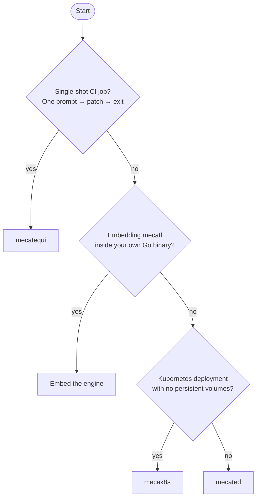

# Pick your deployment shape

mecatl has four deployment shapes. They are not interchangeable — each one fits a different operational model. This doc walks you through the decision and gives you the trade-offs for each.

## Decision tree

If you landed on **mecated** but want multi-replica support without affinity routing, add a session lease backend and Redis — or just switch to **mecak8s**, which wires both for you.

## Shape summary

| Shape | When to choose | State model | Key dependency |
|-------|---------------|-------------|----------------|
| **Embed the engine** | You own the binary and want the loop in-process | You own it — implement the ports | `golang.org/x/sync` + `doublestar` + `robfig/cron/v3` at runtime |
| **mecated** | Single server, interactive clients (TUI, IDE), or a controlled service deployment | In-memory or JSONL on disk; optional Redis or gRPC driver | A running process; PV for durable sessions |
| **mecak8s** | Kubernetes, no persistent volumes, multi-replica | Redis + Kubernetes `coordination.k8s.io` lease | Redis StatefulSet + k8s RBAC for `leases` |
| **mecatequi** | GitHub Actions (or any CI): label/comment → patch → PR | None — stateless per run | LLM provider key; GitHub Actions runner |

## Embed the engine

Import `github.com/stacklok/mecatl/engine` and wire the ports yourself. The engine module's dep closure is four packages — `golang.org/x/sync`, `doublestar`, `robfig/cron/v3` (itself dependency-free; used only by `engine/adapter/cronparse`), and (test-only) `goleak`. Nothing from mecatl's heavy require cone (OpenAI/Anthropic SDKs, gRPC, the TUI, client-go) enters your build graph.

You implement `port.LLMProvider`, `port.SessionStore`, and the rest using the reference adapters under `engine/adapter/` as a starting point, or bring your own. You get the agent loop, the full tool catalog, the permission model, hooks, subagent delegation, and compaction with no binary dependency.

The cost: you own the composition. There is no out-of-the-box server, no auth layer, no gRPC surface, and no Kubernetes manifests. This is the right choice when mecatl needs to run inside an existing service and you want fine-grained control over every dependency — not when you want something running quickly.

## mecated

`mecated` is the standalone composition root: flags in, a gRPC + HTTP/SSE server out. It handles auth (`--auth-token`, TLS/mTLS), rate limiting, observability (Prometheus, pprof, OTel traces), graceful shutdown, and the full operator surface (posture ladder, workspace trust, model slots, guardrails, web search).

It defaults to loopback-only binds with no auth — the single-user localhost trust model. Before exposing off-loopback, configure `--auth-token` and TLS. A non-loopback bind with no auth generates a loud startup warning but does not hard-fail, because a service mesh may legitimately front it.

Sessions are in-memory by default (`--store-dir ""` means no persistence). Add `--store-dir` for JSONL persistence on disk. For multi-replica deployments, mecated expects session affinity — two replicas over a shared store have no cross-process exclusion by default. Wire a session lease (`--session-lease-dir` for single-host flock, `--session-lease-k8s-namespace` for Kubernetes) to get cross-process single-writer enforcement.

The cost: you run a process and keep it alive. Durable sessions mean a PV or shared storage. Multi-replica without affinity requires a lease backend. For Kubernetes deployments where storage-free pods are a hard requirement, mecak8s is a better fit.

## mecak8s

`mecak8s` is a thin peer of `mecated` with Kubernetes-native defaults baked in. It runs two replicas with no PVC: session state lives in Redis, and single-writer enforcement uses `coordination.k8s.io` Leases. The pod is disposable — on SIGTERM it cancels in-flight runs, releases its leases so a survivor takes over immediately (not after the TTL), and exits. Interrupted sessions are recoverable from the Redis snapshot on the successor pod.

`mecak8s` inverts `mecated`'s interactive defaults: `--headless` is on and `--posture` defaults to `auto`. It is designed for unattended daemon operation, not interactive clients.

The `deploy/mecak8s/` kustomize base includes the full topology: namespace, RBAC, Redis StatefulSet, agent Deployment (two replicas, no PVC), Service, PodDisruptionBudget, and a default-deny NetworkPolicy.

The cost: Redis is a required dependency — you need a managed Redis or a Redis StatefulSet in-cluster. The ServiceAccount needs `get,create,update,delete` on `leases` in `coordination.k8s.io`. The Prometheus/OTel admin surface and the `perf-mcp` subcommand are dropped (not exposed by `mecak8s`). If you need those or want to keep the operator surface identical to `mecated`, run `mecated` with `--redis-url` is not an option — `mecated` does not expose that flag; the Redis store is wired only by `cmd/mecak8s`.

## mecatequi

`mecatequi` is the single-shot headless runner: one prompt in, a git diff patch + a machine-readable summary JSON + an exit code out. It is forge-agnostic — it knows nothing about GitHub. The GitHub glue (issue extraction, PR creation, split-privilege job graph) lives in `.github/` workflows and shell scripts, not in the binary.

The standard adoption path is the reusable workflow (`mecatequi-reusable.yml`, `on: workflow_call`): a ~15-line caller in your repo, no vendored scripts, the same split-privilege job graph (acknowledge → implement → publish) with the agent job holding only the LLM key and no write token, and the publish job applying the patch as data with no agent code.

The exit code is not "task accomplished" — read `stop-reason` and `non-empty-diff` from the action outputs to decide whether real work landed. Exit 0 means the run completed cleanly; it does not mean the result is useful.

The cost: there is no session continuity across runs. Stateless by design. If your use case requires resuming prior runs, inspecting subagents across invocations, or serving interactive clients, this is not the right shape.

## What's next

Once you've picked a shape, see the deployment guide for it:

- [Embed the engine directly](/deployment/embed-engine.md)
- [Run mecated standalone](/deployment/mecated.md)
- [Cloud-native k8s with mecak8s](/deployment/mecak8s.md)
- [Single-shot CI with mecatequi](/deployment/mecatequi.md)
