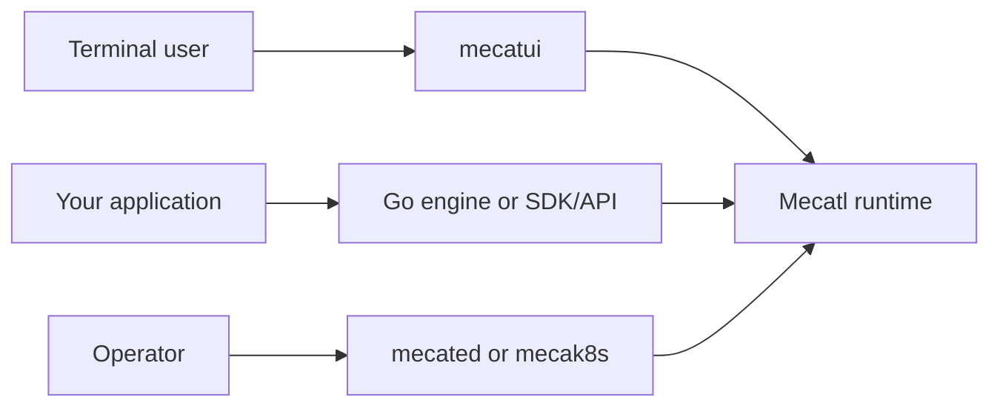

# Mecatl

Mecatl is an open source, cloud-native agent harness for running AI agents on
infrastructure you operate. It separates the agent loop from the client,
execution environment, model provider, and durable state, so you can run the
same core locally, as a shared service, or inside an application.

## How Mecatl fits together

Use `mecatui` when you want to work with an agent from your terminal. It can
start a private server for your local workspace or connect to a remote Mecatl
service. Operators run that service with `mecated`, or with `mecak8s` when they
need Kubernetes-native storage and coordination. Application builders can
embed the Go engine, or connect through the TypeScript SDK and the gRPC or
HTTP/SSE APIs.

The runtime can be disposable while its session state and execution concerns
live in services that you manage. That design lets Mecatl fit the deployment
and governance patterns you already use for applications. Read [What is a
cloud-native harness?](/cloud-native-harness.md) for the architecture and its
implications.

## Start with the journey that fits your work

### [Use `mecatui`](/mecatui/index.md)

Run local sessions in your workspace or connect the terminal client to your
organization's Mecatl service.

### [Deploy and operate Mecatl](/operating/index.md)

Run a shared `mecated` service, deploy `mecak8s` on Kubernetes, or use
`mecatequi` for one task in CI.

### [Build with Mecatl](/building/index.md)

Embed the Go engine, connect an application through the TypeScript SDK, or use
the public APIs and extension points.
