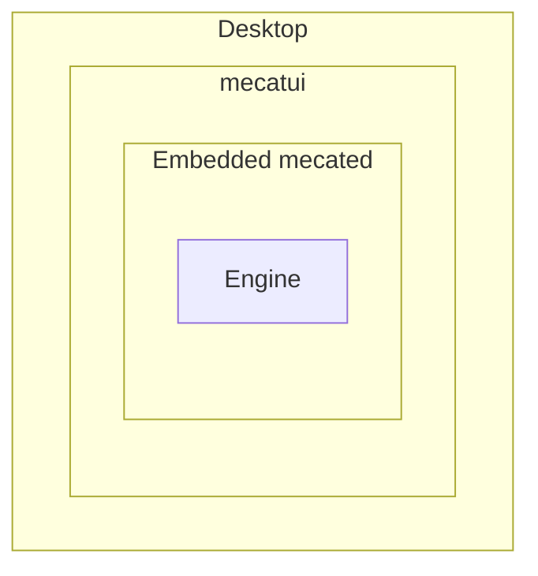
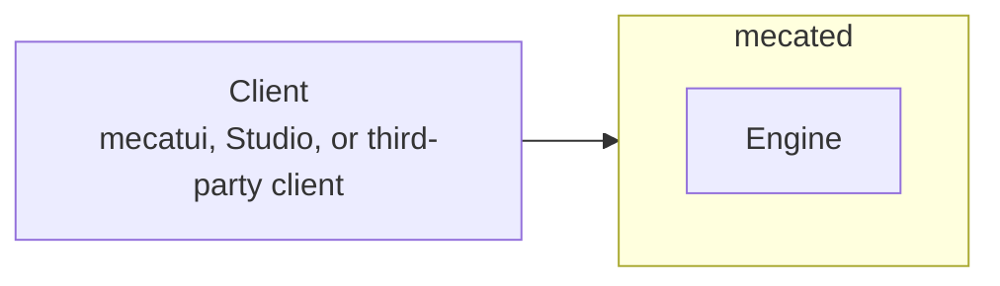
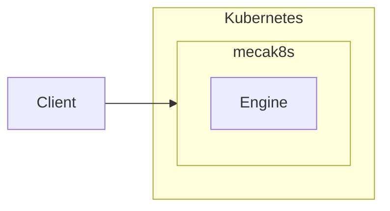
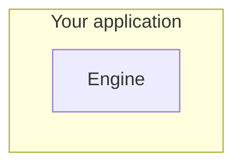

# Mecatl

Mecatl is an open source, cloud-native agent harness for running AI agents on
infrastructure you operate. It separates the agent loop from the client,
execution environment, model provider, and durable state, so you can run the
same core locally, as a shared service, or inside an application.

## How Mecatl fits together

The same engine runs in each deployment. Choose where to host it and how you
want to connect.

### Desktop

Run [mecatui](/mecatui/getting-started.md) to work in your local workspace.
Its embedded, single-user `mecated` server hosts the engine, giving you a
terminal client and local server together.

```mermaid
flowchart TB
  subgraph desktop[Desktop]
    subgraph tui[mecatui]
      subgraph daemon[Embedded mecated]
        desktop_engine[Engine]
      end
    end
  end
```

### Standalone server

Run [mecated](/operating/mecated.md) as a single-user service and connect with
mecatui, Studio, or a third-party client. The server hosts the engine separately
from your client.

```mermaid
flowchart LR
  client["Client<br/>mecatui, Studio, or third-party client"]
  subgraph server[mecated]
    server_engine[Engine]
  end
  client --> server
```

### Kubernetes

Run [mecak8s](/operating/mecak8s.md) to host the engine in a Kubernetes
cluster, with shared-team state, coordination, and scaling. Clients connect
to the service provided by your operator. Multi-user support is being developed
for `mecak8s`.

```mermaid
flowchart LR
  client[Client]
  subgraph cluster[Kubernetes]
    subgraph server[mecak8s]
      cluster_engine[Engine]
    end
  end
  client --> server
```

### Your application

[Embed the Go engine](/building/go/embed-engine.md) directly in your
application to build your own agent experience.

```mermaid
flowchart TB
  subgraph app[Your application]
    app_engine[Engine]
  end
```

The runtime can be disposable while its session state and execution concerns
live in services that you manage. That design lets Mecatl fit the deployment and
governance patterns you already use for applications. Read
[What is a cloud-native harness?](/cloud-native-harness.md) for the architecture
and its implications.

## Start with the journey that fits your work

### [Use Mecatl](/mecatui/index.md)

Run local sessions in your workspace or connect the terminal client to your
organization's Mecatl service.

### [Deploy and operate Mecatl](/operating/index.md)

Start with a lightweight `mecated` service, then use `mecak8s` for shared-team
state, coordination, and scaling.

### [Build with Mecatl](/building/index.md)

Embed the Go engine, connect an application through the TypeScript SDK, or use
the public APIs and extension points.
