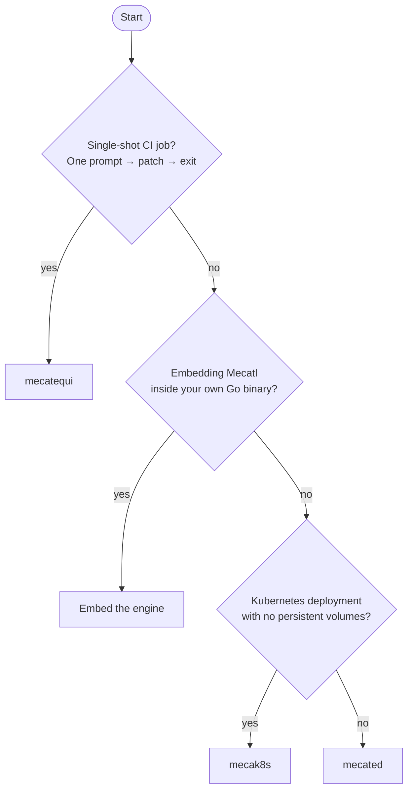

# Choose how to run Mecatl

You can run Mecatl as a standalone server, deploy it to Kubernetes, use it for a
single CI job, or embed the engine in your own Go application. Each option uses
the same agent core but differs in how you operate it and manage state.

[`mecatui`](/mecatui/index.md) is the terminal client for an embedded or remote
server.

## Decision tree

For multiple `mecated` replicas without affinity routing, add a session lease
backend and external storage. `mecak8s` instead uses Redis and enables
Kubernetes Leases by default.

## Compare the options

|Option|When to choose|State model|Key dependency|
|-|-|-|-|
|**Embed the engine**|Run the agent loop inside your Go application|Application-defined|The Go engine module|
|**`mecated`**|Run a standalone server for interactive clients or a controlled service|In-memory, JSONL on disk, or gRPC driver|A running process and writable storage for durable local sessions|
|**`mecak8s`**|Run on Kubernetes without persistent volumes or with multiple replicas|Redis with Kubernetes Leases|Redis and Kubernetes RBAC for Leases|
|**`mecatequi`**|Run one agent job in CI|None; each run is independent|An LLM provider key and CI runner|

For a feature-by-feature comparison, see the
[capability and deployment matrix](/features/get-oriented/capability-matrix.md).

## Embed the engine

Import `github.com/stacklok/mecatl/engine` when Mecatl must run inside an
existing Go application. Implement the ports yourself or start with the
reference adapters under `engine/adapter/`.

You own provider, storage, authentication, and transport integration. Choose a
packaged server when you want those pieces supplied for you.

## mecated

`mecated` serves gRPC and HTTP/SSE with authentication, rate limiting,
observability, persistence, and graceful shutdown. It defaults to loopback with
in-memory sessions and no authentication.

Add `--store-dir` for local JSONL persistence. Multiple replicas without
affinity routing require shared storage and a Kubernetes or gRPC lease backend.
Choose `mecak8s` for Kubernetes pods without persistent volumes.

## mecak8s

The `mecak8s` Helm deployment stores session state in Redis and coordinates
replicas with Kubernetes Leases. It runs two replicas by default without a PVC;
single-replica operation is also supported.

Choose it for unattended Kubernetes workloads with disposable pods. You must
provide Redis and Lease RBAC. Configure network isolation through your cluster
policy. The local Kind profile can create a disposable Redis fixture for
evaluation.

## mecatequi

`mecatequi` runs one prompt and returns a Git patch, JSON summary, and exit
code. The binary is independent of any source forge. The supplied GitHub Actions
workflow keeps the LLM key in the agent job and repository write access in a
separate publishing job.

Use the `stop-reason` and `non-empty-diff` outputs to decide whether the run
produced useful work. Exit 0 only means the run completed cleanly.

There is no session continuity across runs. If you need to resume earlier work,
inspect subagents across invocations, or serve interactive clients, choose
another option.

## Next steps

Once you've chosen an option, follow its deployment guide:

- [Embed the engine directly](/building/embed-engine.md)
- [Run mecated standalone](/operating/mecated.md)
- [Cloud-native k8s with mecak8s](/operating/mecak8s.md)
- [Single-shot CI with mecatequi](/operating/mecatequi.md)
