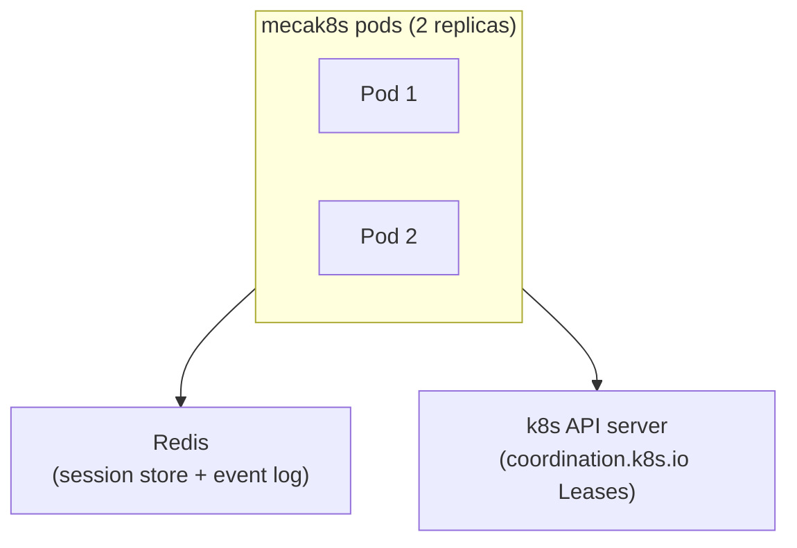

# Cloud-native k8s with mecak8s

`mecak8s` runs Mecatl with Kubernetes-native defaults. The chart uses two
replicas by default for availability; you can use one replica to reduce resource
usage and simplify session routing. Agent pods hold no durable state: session
snapshots and the event log live in Redis, while Kubernetes Leases enforce a
single writer for each session.



If a pod stops, a surviving pod can acquire its leases and resume interrupted
sessions from Redis. The pod is disposable; the session is not.

## Try mecak8s locally

The repository includes a disposable local Kind environment with Redis and two
`mecak8s` replicas. Follow [Try Mecatl on Kubernetes](/operating/kubernetes.md)
to create the cluster and connect with `mecatui`.

## Before you deploy

You need:

- A Kubernetes cluster, Helm, and `kubectl`. The cluster must be able to pull
  public images from `ghcr.io`.
- A Redis endpoint reachable from the agent pods. Production deployments use
  verified TLS and can read ACL credentials from a Kubernetes Secret.
- An OIDC issuer and audience for caller authentication.
- A TLS certificate and key for the `mecak8s` Service, unless an
  operator-controlled gateway terminates TLS.
- Credentials for an LLM provider.

The chart creates the ServiceAccount and namespace-scoped permissions for
Kubernetes Leases. It does not create production Redis, TLS Secrets, provider
Secrets, gateways, or general NetworkPolicies. A deployment that selects
`models.router.backend: jev` must project `TYPESAFE_API_KEY` from a Kubernetes
Secret and allow HTTPS egress to `api.typesafe.ai`; eligible delegated task text
leaves the cluster for classification.

## Quick start

The following example stores credentials in Kubernetes Secrets and installs the
published chart with two replicas. Choose a version from
[GitHub releases](https://github.com/stacklok/mecatl/releases), then substitute
its number without the leading `v` for `<VERSION>`. Replace the example
endpoints and filenames with values for your environment.

1. Create the namespace and Secrets. Set `OPENAI_API_KEY` in your current shell
   first. Redis and TLS values are read from files instead of being placed in
   Helm values:

   ```sh
   : "${OPENAI_API_KEY:?set OPENAI_API_KEY first}"
   kubectl create namespace mecatl
   kubectl create secret generic mecak8s-openai --namespace mecatl \
     --from-literal=OPENAI_API_KEY="$OPENAI_API_KEY"
   kubectl create secret generic mecak8s-redis --namespace mecatl \
     --from-file=password=./redis-password \
     --from-file=ca.pem=./redis-ca.pem
   kubectl create secret tls mecak8s-tls --namespace mecatl \
     --cert=./server.crt --key=./server.key
   ```

1. Save the deployment values as `mecak8s-values.yaml`:

   ```yaml
   redis:
     endpoint: redis.example.internal:6379
     credentialsSecret: mecak8s-redis
     passwordKey: password
     caKey: ca.pem

   tls:
     enabled: true
     secretName: mecak8s-tls

   oidc:
     enabled: true
     issuer: https://idp.example.com
     audience: mecatl

   defaultProvider: openai
   model: gpt-5
   extraEnv:
     - name: OPENAI_API_KEY
       valueFrom:
         secretKeyRef:
           name: mecak8s-openai
           key: OPENAI_API_KEY
   ```

1. Install the chart and wait for both replicas:

   ```sh
   helm upgrade --install mecak8s \
     oci://ghcr.io/stacklok/mecatl/charts/mecak8s \
     --version <VERSION> \
     --namespace mecatl \
     --values mecak8s-values.yaml
   kubectl rollout status deployment/mecak8s-mecak8s --namespace mecatl
   ```

The default Deployment name is `<RELEASE>-mecak8s`. Set `fullnameOverride` in
the values file if you need a fixed name.

## Deployment defaults

`mecak8s` starts with unattended, Kubernetes-oriented defaults:

|Setting|Default|
|-|-|
|Replicas|Two|
|Posture|Headless with `auto` permissions|
|Session state|Redis|
|Session ownership|Kubernetes Leases|
|Filesystem|No filesystem access|
|Network binds|Pod network on `0.0.0.0`|
|[Metrics and OpenTelemetry](/operating/observability.md)|Opt-in|

Project-provided instructions, skills, agents, and read-only child Shell access
still require explicit project trust. `mecak8s` does not include ACP, local
JSONL storage, or the `mecated` operator subcommands.

## Production Helm chart

The production chart is published at
`oci://ghcr.io/stacklok/mecatl/charts/mecak8s`; its source is in
`deploy/helm/mecak8s/`. It requires an external Redis endpoint and creates no
Redis StatefulSet. Reference a Kubernetes Secret for Redis credentials. The
chart's default image tag matches its application and chart versions, so it
pulls the corresponding signed `ghcr.io/stacklok/mecatl/mecak8s` release. Set
`image.digest` to pin an immutable image. It accepts a canonical lowercase
SHA-256 digest: `sha256:` followed by 64 lowercase hexadecimal characters. Set
only one of `image.tag` and `image.digest`, or clear the tag to use
`v<chart-version>`.

A real-provider deployment (`mockProvider: false`) must choose one of these
security postures:

|Posture|Configuration|
|-|-|
|TLS in the pod|Enable `tls` and OIDC.|
|TLS at an operator-owned edge|Set `security.tlsTerminatedUpstream=true`, enable OIDC, and optionally keep in-pod TLS for re-encryption.|
|Unsafe bypass|Select the explicit bypass, which annotates the pod as unsafe.|

The chart reserves its security-posture annotations; `podAnnotations` cannot
override them.

## Differences from mecated

Unlike `mecated`, `mecak8s` requires Redis, enables Kubernetes session leases by
default, and exposes `--redis-url`. It does not include the `config`,
`skills promote`, `perf-mcp`, or ACP operator commands.

`mecak8s` does not support the local ChatGPT Codex subscription entry at
`providers.openai-codex.oauth`. API-key entries in `auth.yaml` remain supported.
Use an API-key provider instead of mounting a local Codex OAuth credential.

## Find an operational task

<span id="choose-filesystem-access"></span>
<span id="mounted-workspace-shared-filesystem-root"></span>
<span id="redis-virtual-workspace"></span> <span id="state-topology"></span>
<span id="secure-redis-credentials-and-tls"></span>

[Configure durable state and filesystem access](/operating/mecak8s/state-and-execution.md).

<span id="kubernetes-execution-provider"></span>

[Configure the Kubernetes execution provider](/operating/mecak8s/native-execution.md).

<span id="rotate-execution-provider-authority"></span>
<span id="upgrade-uninstall-and-reinstall-the-execution-provider"></span>
<span id="run-an-administrative-lifecycle-operation"></span>

[Maintain execution-provider authority and retained state](/operating/mecak8s/execution-provider-lifecycle.md).

<span id="inspect-the-event-log"></span>
<span id="size-durable-event-followers"></span>
<span id="configure-logging"></span> <span id="readiness-and-health"></span>

[Inspect events, logs, and readiness](/operating/mecak8s/observe-and-troubleshoot.md).

<span id="installation-telemetry-identity"></span>
<span id="use-workload-identity-for-an-llm-gateway"></span>
<span id="session-affinity-is-an-infrastructure-contract"></span>
<span id="mount-trusted-skills-agents-and-rules"></span>
<span id="the-helm-charts-topology"></span> <span id="graceful-shutdown"></span>
<span id="verify-session-failover"></span> <span id="scaling"></span>

[Scale, recover, and upgrade the deployment](/operating/mecak8s/scale-recover-and-upgrade.md).

<span id="connect-global-mcp-servers"></span> <span id="server-tls"></span>
<span id="rotate-server-tls-certificates"></span>
<span id="configure-caller-identity"></span>
<span id="check-existing-data-first"></span>
<span id="before-admitting-callers-inventory-ownerless-records"></span>
<span id="validator-and-bounded-signing-key-cache"></span>
<span id="enable-oidc"></span> <span id="advertise-login-metadata"></span>
<span id="troubleshooting-start-here"></span>
<span id="security-boundaries"></span>

[Secure client access and global tools](/operating/mecak8s/identity-and-client-access.md).

<span id="inspect-the-broker-catalogue-in-mecatui"></span>
<span id="use-it-from-the-tui"></span>

[Connect with the terminal client](/mecatui/remote-servers.md).

<span id="whats-next"></span>

## Next steps

- [Configure state and execution](/operating/mecak8s/state-and-execution.md).
- [Secure client access](/operating/mecak8s/identity-and-client-access.md).
- [Observe and troubleshoot](/operating/mecak8s/observe-and-troubleshoot.md).

## Related information

- [Scale, recover, and upgrade](/operating/mecak8s/scale-recover-and-upgrade.md).

- [Server CLI reference](/reference/server-cli.md).
